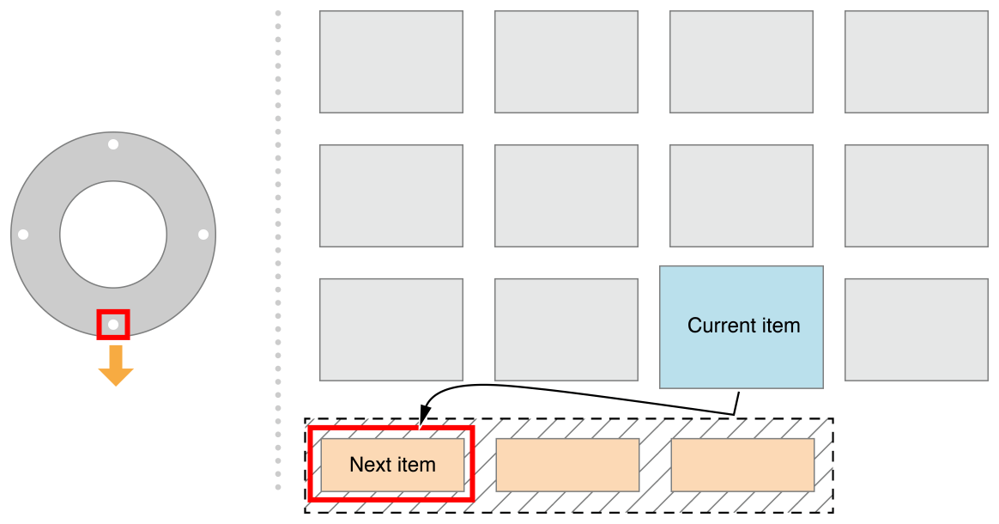
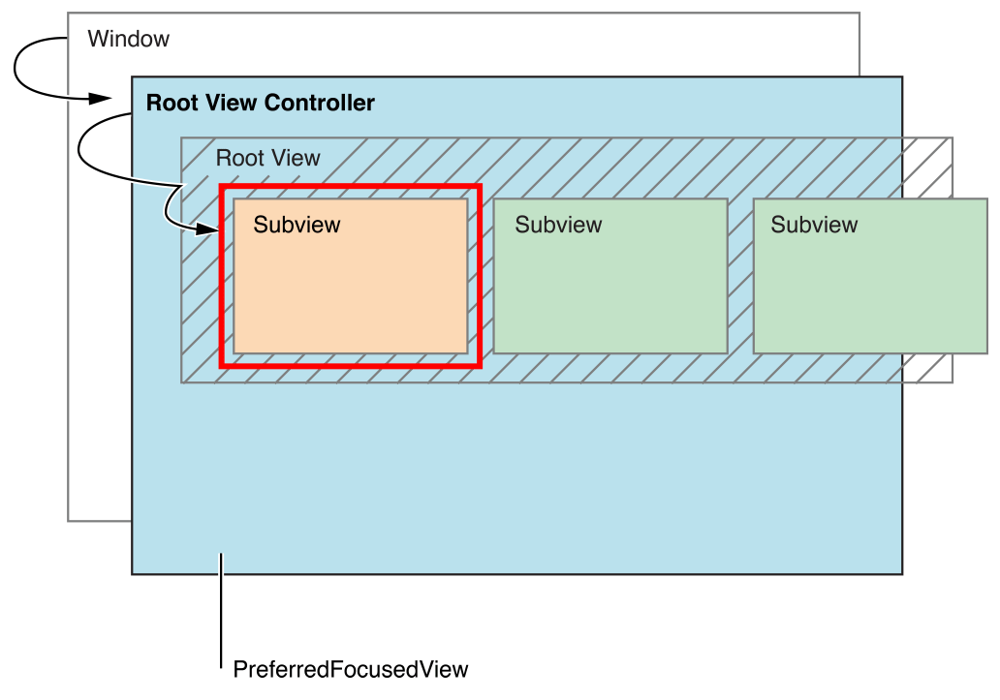
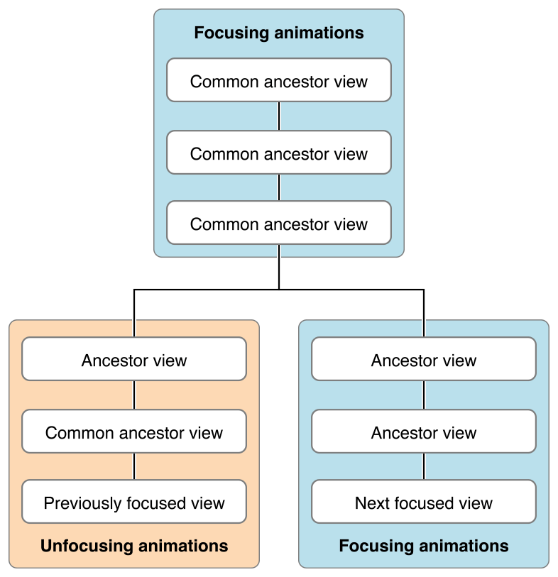
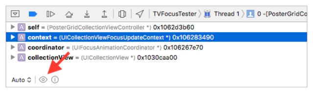
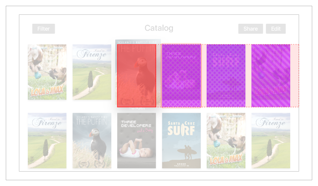

> 导航：[总目录](../../../README.md) · [documentation](../../../_indexes/documentation.md) · [App Programming Guide for tvOS](index.md)

## Controlling the User Interface with the Apple TV Remote

On iOS devices, a user interacts directly with the touchscreen. On Apple TV, a remote is used to control the interface indirectly. The user navigates to a specific item onscreen and then presses a button on the remote to select the item. The item on the screen becomes focused as the user navigates through the items on the screen. _Focus_ refers to the effect onscreen of external, indirect user input from a remote or another input device. In a focus-based interaction model, a single view onscreen is considered _focused_, and the user can move focus to other views by navigating through different UI items onscreen, which triggers a focus update. The focused view is used as the target of any user actions. For example, if an onscreen button is focused, the button’s action is triggered when a select event is sent from a remote.

The UIKit framework only supports focus-based interfaces, and in most cases this behavior is automatically provided where it makes sense to do so. You can ask for focus updates programmatically but cannot set focus or move focus in a certain direction. For example, [UIButton](https://developer.apple.com/documentation/uikit/uibutton) objects are focusable, but [UILabel](https://developer.apple.com/documentation/uikit/uilabel) objects are not. For apps with custom user interface components, you need to implement custom focus behavior, as explained in the `[Supporting Focus Within Your App](#apple-f4xwc4dqnrsv64tfmyxwi33df52wszbpkridimbqge2tenbrfvbuqnjnknlte)` section. The UIKit items such as [UIButton](https://developer.apple.com/documentation/uikit/uibutton), [UITextField](https://developer.apple.com/documentation/uikit/uitextfield), [UITableView](https://developer.apple.com/documentation/uikit/uitableview), [UICollectionView](https://developer.apple.com/documentation/uikit/uicollectionview), [UITextView](https://developer.apple.com/documentation/uikit/uitextview), [UISegmentedControl](https://developer.apple.com/documentation/uikit/uisegmentedcontrol), and [UISearchBar](https://developer.apple.com/documentation/uikit/uisearchbar) are focused by default.

### The Focus Engine Controls Focus

The system within UIKit that controls focus and focus movement is called the focus engine. A user can control focus through remotes (of varying types), game controllers, the simulator, and so forth. The focus engine listens for incoming focus-movement events in your app from all these different input devices. When an event comes in, it automatically determines where focus should update and notifies your app. This system helps to create a consistent user experience across apps, provides automatic support for all current and future input methods in every app, and helps developers concentrate on implementing their app’s unique behavior rather than defining or reinventing basic navigation.

Only the focus engine can explicitly update focus, meaning there is no API for directly setting the focused view or moving focus in a certain direction. The focus engine only updates focus if the user sends a movement event, if the system requests an update, or if the application requests an update. To learn more about how and when to manually update focus, see `[Updating Focus Programmatically](#apple-f4xwc4dqnrsv64tfmyxwi33df52wszbpkridimbqge2tenbrfvbuqnjnknltcna)`.

The focus engine controls focus to make sure that it does not move around the screen unexpectedly, and that it behaves similarly across different applications. This control helps prevent confusion for the user, and means that developers do not have to implement their own custom solution for managing focus appropriately.

### The UIFocusEnvironment Protocol

The focus engine communicates with your app using the [UIFocusEnvironment](https://developer.apple.com/documentation/uikit/uifocusenvironment) protocol, which defines the focus behavior for part of the view hierarchy. UIKit classes that conform to this protocol include [UIView](https://developer.apple.com/documentation/uikit/uiview), [UIViewController](https://developer.apple.com/documentation/uikit/uiviewcontroller), [UIWindow](https://developer.apple.com/documentation/uikit/uiwindow), and [UIPresentationController](https://developer.apple.com/documentation/uikit/uipresentationcontroller) – in other words, classes that are either directly or indirectly in control of views on the screen. Overriding `UIFocusEnvironment` methods in your views and view controllers lets you control the focus behavior in your app.

### User-Generated Focus Movement

The focus engine automatically determines where focus should move in response to navigation events from a remote or other input device. Users can move focus in any two-dimensional direction: left, right, up, down, or diagonal (if supported by the hardware). For example, if the user swipes to the left, the focus engine tries to find a focusable view directly to the left of the currently focused view. If a new view is found, then focus moves to that view; otherwise, focus stays on the currently focused view.

The focus engine also automatically handles sophisticated behaviors, if they are supported by the input device. Examples include momentum-based movement after a fast remote swipe, modulating focus-related animation speeds based on focus velocity, playing navigation sounds, and updating scroll view offsets when focus moves offscreen. To learn more about focus-related animation, see _[UIFocusAnimationCoordinator Class Reference](https://developer.apple.com/documentation/uikit/uifocusanimationcoordinator)_.

### Deciding Where to Move Focus

When deciding where to move focus in response to a user action, the focus engine takes an internal picture of your app’s user interface and highlights all the visible regions of all focusable views. This means that if a focusable view is completely underneath another view, it will be ignored, and for any views that are partially hidden it will only consider the visible regions. Using this technique, the focus engine starts from the currently focused view, and finds any focusable regions that are directly in the path of motion. The size of the search area is directly related to the size of the currently focused view.

__Figure 3-1__Focus movement

If the focus engine finds a new view to move focus to, it gives your app a chance to validate the move before the move occurs. The operating system calls the [shouldUpdateFocusInContext:](https://developer.apple.com/documentation/uikit/uifocusenvironment/1616831-shouldupdatefocusincontext) method on every focus environment that contains the previously and next focused views. The previously focused views are notified first, then the focused views are notified, and finally the parents of those views are notified. If any focus environment returns `NO``false` from [shouldUpdateFocusInContext:](https://developer.apple.com/documentation/uikit/uifocusenvironment/1616831-shouldupdatefocusincontext), then the move is canceled. To learn more about focus environments, see _[UIFocusEnvironment Protocol Reference](https://developer.apple.com/documentation/uikit/uifocusenvironment)_.

### Initial Focus and the Preferred Focus Chain

When an app launches, by default the focus engine determines a starting focused view for you. This view is usually the closest focusable view to the top-left corner of the screen.

__Figure 3-2__Hierarchical search for the initial view to gain focus

However, your application can provide hints for where focus should go by default, using the `UIFocusEnvironment` protocol’s preferred focus view. When setting initial focus, the focus engine first asks the window for its preferred focus view, which returns its root view controller’s [preferredFocusedView](https://developer.apple.com/documentation/uikit/uifocusguide/1616848-preferredfocusedview) object. Because the return value is a [UIView](https://developer.apple.com/documentation/uikit/uiview) object, which conforms to `UIFocusEnvironment`, the focus engine then asks the [UIView](https://developer.apple.com/documentation/uikit/uiview) object for its preferred focus view, and so on. This linked list of returned preferred focus views is the preferred focus chain. The focus engine follows this preferred focus chain until it reaches a view that returns `self` or `nil`. From the list, the view farthest from the initial window (or deepest) is chosen as the focusable view.

Here is an example showing how focus might be determined:

1. The focus engine asks the root window for its [preferredFocusedView](https://developer.apple.com/documentation/uikit/uifocusguide/1616848-preferredfocusedview), which returns its root view controller’s [preferredFocusedView](https://developer.apple.com/documentation/uikit/uifocusguide/1616848-preferredfocusedview) object.
2. The root view controller, a tab view controller, returns its select view controller’s [preferredFocusedView](https://developer.apple.com/documentation/uikit/uifocusguide/1616848-preferredfocusedview) object.
3. The select view controller overrides its [preferredFocusedView](https://developer.apple.com/documentation/uikit/uifocusguide/1616848-preferredfocusedview) method to return a specific [UIButton](https://developer.apple.com/documentation/uikit/uibutton) instance.
4. The [UIButton](https://developer.apple.com/documentation/uikit/uibutton) instance returns `self` (the default), and is focusable, so it is chosen by the focus engine as the next focused view.

Whenever focus updates to a specific view, the new focused view is set to that view’s deepest preferred focusable view, as defined by the preferred focus chain. Another example of a focus chain: When a view controller is modally presented on top of the currently focused view, focus is updated to the new view controller using its preferred focus chain.

### Focus Updates

A _focus update_ occurs when the user causes a focus movement (for example, by swiping on a remote), the app requests an update programmatically, or the system triggers an automatic update.

### Anatomy of a Focus Update

When focus updates or moves to a new view, whether that is a subview or a view in a different part of the view hierarchy, the following events occur:

- The [focusedView](https://developer.apple.com/documentation/uikit/uiscreen/1617831-focusedview) property is updated to reflect the newly focused view or its preferred focused view.
- The focus engine notifies every focus environment that contains either the previously focused view or the next focused view (the view that is focused after the update) by calling [didUpdateFocusInContext:withAnimationCoordinator:](https://developer.apple.com/documentation/uikit/uifocusenvironment/1616841-didupdatefocusincontext). Use the provided animation coordinator to schedule focus-related animations in response to the update. See [UIFocusAnimationCoordinator](https://developer.apple.com/documentation/uikit/uifocusanimationcoordinator).
- After all the relevant focus environments have been notified, any coordinated animations are run together at the same time.
- If the next (updated) focused view is in a scroll view and is offscreen, the scroll view scrolls the content so that the next focused view moves onscreen.

### System-Generated Focus Updates

UIKit automatically updates focus in many common situations where it is necessary. Here are a few examples of when focus is updated automatically:

- A focused view is removed from the view hierarchy.
- [UITableView](https://developer.apple.com/documentation/uikit/uitableview) or [UICollectionView](https://developer.apple.com/documentation/uikit/uicollectionview) reload their data.
- A new view controller is presented over the currently focused view.
- The user presses `Menu` on the remote to go back to the previous screen.

### Updating Focus Programmatically

Focus automatically updates when necessary most of the time, but sometimes your app needs to trigger a focus update programmatically. Any focus environment can request a focus update by calling [setNeedsFocusUpdate](https://developer.apple.com/documentation/uikit/uifocusenvironment/1616837-setneedsfocusupdate), which resets focus to that environment’s [preferredFocusedView](https://developer.apple.com/documentation/uikit/uifocusenvironment/1616830-preferredfocusedview). Here are some examples of when your app may need to programmatically update focus:

- The content of the app changes, so focus needs to change in order to stay where the user would expect. For example: A music app always needs the currently playing song to be focused. When a song ends, the app should request a focus update to move focus to the next song in the playlist.
- Upon performing an action, the user expects focus to move somewhere new. For example: An app consists of a split view with a menu on the left, and a collection of content on the right. As the user moves between menu items, the content on the right changes. When selecting a menu item, the user might expect focus to automatically move to the first item in the selected menu item collection on the right.
- A custom control, while it is focused, updates its internal state in a way that requires focus to change. For example, when a user clicks on the remote to select a picker control, focus moves into the control, letting the user pick from a set of options in the picker. Pressing Menu on the remote causes the control to be focused again. In this scenario, selecting the control requests a focus update to move focus into one of its subviews, through [preferredFocusedView](https://developer.apple.com/documentation/uikit/uifocusenvironment/1616830-preferredfocusedview).

### Supporting Focus Within Your App

If your app uses built-in UIKit controls, there is nothing your app needs to do to support focus out of the box: When the app launches, a focusable control onscreen is chosen as the initial focused view, and the focus engine takes care of managing focus for you for the lifetime of the app.

However, for most apps you will want to implement custom focus behavior, such as updating app state when focus changes, implementing new types of interactive user interface elements, and performing custom focus animations. The following sections outline what you need to know to support custom focus behaviors in your app.

`UIFocusEnvironment` controls focus-related behavior for a branch of the view hierarchy. This means that `UIViewController` controls focus-related behavior for its root view and descendants, and `UIView` controls focus behavior for itself and its descendants. Thus multiple focus environments can control focus-related behavior for the same branch of the view hierarchy – views are contained in other views, but also in view controllers. Controlling focus-related behavior does not mean something is focused. It means that the focus environment can control how focus moves in its view hierarchy, and how the UI reacts to changes in focus in the environment's view hierarchy.

### Supporting Focus in View Controllers

Because [UIViewController](https://developer.apple.com/documentation/uikit/uiviewcontroller) conforms to [UIFocusEnvironment](https://developer.apple.com/documentation/uikit/uifocusenvironment), custom view controllers in your app can override `UIFocusEnvironment` delegate methods to achieve custom focus behaviors. Custom view controllers can:

- Override the [preferredFocusedView](https://developer.apple.com/documentation/uikit/uifocusenvironment/1616830-preferredfocusedview) to specify where focus should start by default.
- Override [shouldUpdateFocusInContext:](https://developer.apple.com/documentation/uikit/uifocusenvironment/1616831-shouldupdatefocusincontext) to define where focus is allowed to move.
- Override [didUpdateFocusInContext:withAnimationCoordinator:](https://developer.apple.com/documentation/uikit/uifocusenvironment/1616841-didupdatefocusincontext) to respond to focus updates when they occur and update your app’s internal state.

Your view controllers can also request that the focus engine reset focus to the current [preferredFocusedView](https://developer.apple.com/documentation/uikit/uifocusenvironment/1616830-preferredfocusedview) by calling[setNeedsFocusUpdate](https://developer.apple.com/documentation/uikit/uifocusenvironment/1616837-setneedsfocusupdate). Note that calling [setNeedsFocusUpdate](https://developer.apple.com/documentation/uikit/uifocusenvironment/1616837-setneedsfocusupdate) only has an effect if the view controller contains the currently focused view.

### Supporting Focus in Collection Views and Table Views

When you work with collection views and table views, you use a delegate object to define any custom behavior. This pattern is also used when implementing your focus-based interface. The [UITableViewDelegate](https://developer.apple.com/documentation/uikit/uitableviewdelegate) and [UICollectionViewDelegate](https://developer.apple.com/documentation/uikit/uicollectionviewdelegate) protocols declare methods and properties similar to those provided by the `UIFocusEnvironment` protocol, but for table view and collection view behavior.

Tips for supporting focus in collection views and table views:

- Use the [collectionView:canFocusItemAtIndexPath:](https://developer.apple.com/documentation/uikit/uicollectionviewdelegate/1618013-collectionview) method with the [UICollectionViewDelegate](https://developer.apple.com/documentation/uikit/uicollectionviewdelegate) class or the [tableView:canFocusRowAtIndexPath:](https://developer.apple.com/documentation/uikit/uitableviewdelegate/1614973-tableview) method with the [UITableViewDelegate](https://developer.apple.com/documentation/uikit/uitableviewdelegate) class to specify whether a specific cell should be focusable. This action works similarly to overriding [canBecomeFocused](https://developer.apple.com/documentation/uikit/uiview/1622584-canbecomefocused) of [UIView](https://developer.apple.com/documentation/uikit/uiview) method in a custom view.
- Use the [remembersLastFocusedIndexPath](https://developer.apple.com/documentation/uikit/uitableview/1614858-rememberslastfocusedindexpath) property, defined in both [UICollectionView](https://developer.apple.com/documentation/uikit/uicollectionview) and [UITableView](https://developer.apple.com/documentation/uikit/uitableview), to specify whether focus should return to the last focused index path when focus leaves and then re-enters the collection view or table view.

### Supporting Focus in Custom Views

Like [UIViewController](https://developer.apple.com/documentation/uikit/uiviewcontroller), [UIView](https://developer.apple.com/documentation/uikit/uiview) also conforms to [UIFocusEnvironment](https://developer.apple.com/documentation/uikit/uifocusenvironment), meaning that everything outlined in `[Supporting Focus in View Controllers](#apple-f4xwc4dqnrsv64tfmyxwi33df52wszbpkridimbqge2tenbrfvbuqnjnknltc)` also applies to custom views. However, because views can be focusable, there are some extra considerations when you implement custom view focus behavior:

- If your custom view needs to be focusable, override [canBecomeFocused](https://developer.apple.com/documentation/uikit/uiview/1622584-canbecomefocused) to return `YES``true` (by default, it returns NO).

  Your view might always be focusable or only conditionally focusable. For example, [UIButton](https://developer.apple.com/documentation/uikit/uibutton) objects are not focusable when disabled.
- Optionally override [preferredFocusedView](https://developer.apple.com/documentation/uikit/uifocusenvironment/1616830-preferredfocusedview) if focusing this view should redirect focus to another view (for example, a subview).
- Override [didUpdateFocusInContext:withAnimationCoordinator:](https://developer.apple.com/documentation/uikit/uifocusenvironment/1616841-didupdatefocusincontext) to respond to focus updates when they occur and update your app’s internal state.

### Coordinating Focus-Related Animations

When a focus update occurs, the current view is animated to a focused state, the previously focused view animates to an unfocused state, and the next focused view (the view that is focused after the update) animates to a focused state. However, unlike regular animations that your app defines, UIKit adapts the timing and curves of focus-related animations in order to achieve certain system-level behaviors. For example, when focus is moving quickly, the timing of the animations are sped up to keep up with the user’s movement.

UIKit provides system-defined focus animations on the view classes that support focus. To create custom animations with system-defined behavior, use UIKit’s built-in class, [UIFocusAnimationCoordinator](https://developer.apple.com/documentation/uikit/uifocusanimationcoordinator), and the [addCoordinatedAnimations:completion:](https://developer.apple.com/documentation/uikit/uifocusanimationcoordinator/1619045-addcoordinatedanimations) method.

Animations added to the coordinator are either run alongside the focusing animation or the unfocusing animation (not both), depending on the focus environment to which the coordinator is provided. Common ancestors of both the unfocusing and focusing views, as well as exclusive ancestors of only the focusing view, will have their animations run alongside the focusing animation. Exclusive ancestors of only the unfocusing view will have their animations run alongside the unfocusing animation.

__Figure 3-3__Custom focus animation

Views commonly have different animations depending on whether they are becoming focused or losing focus. You can specify which view takes which kind of animation by overriding the view’s -[didUpdateFocusInContext:withAnimationCoordinator:](https://developer.apple.com/documentation/uikit/uifocusenvironment/1616841-didupdatefocusincontext)method and checking the context for the current focus state of the view. The following is an example of overriding the [didUpdateFocusInContext:withAnimationCoordinator:](https://developer.apple.com/documentation/uikit/uifocusenvironment/1616841-didupdatefocusincontext) method.

1. `- (void)didUpdateFocusInContext:(UIFocusUpdateContext *)context withAnimationCoordinator:(UIFocusAnimationCoordinator *)coordinator`
2. `{`
3. `[super didUpdateFocusInContext:context withAnimationCoordinator:coordinator];`
5. `if (self == context.nextFocusedView) {`
6. `[coordinator addCoordinatedAnimations:^{`
7. `// focusing animations`
8. `} completion:^{`
9. `// completion`
10. `}];`
11. `} else if (self == context.previouslyFocusedView) {`
12. `[coordinator addCoordinatedAnimations:^{`
13. `// unfocusing animations`
14. `} completion:^{`
15. `// completion`
16. `}];`
17. `}`
18. `}`

Common ancestors of the unfocusing and focusing views can target animations for both the unfocusing view and the focusing view. For example, a [UICollectionView](https://developer.apple.com/documentation/uikit/uicollectionview) can animate the previously focused cell and the next focused cell. The recommended approach in this case is to subclass [UICollectionViewCell](https://developer.apple.com/documentation/uikit/uicollectionviewcell) and implement the animation code in the subclass, using similar logic to the above code snippet.

### Debugging Focus Issues

UIKit helps you debug focus issues while your app is running.

### Why Is This View Not Focusable?

There are a number of reasons a view that is expected to be focusable may not be, including (but not limited to):

- The view’s [canBecomeFocused](https://developer.apple.com/documentation/uikit/uiview/1622584-canbecomefocused) method returns `NO``false`.
- The view’s hidden property has a value of `YES``true`.
- The view’s alpha property has a value of 0.
- The view’s user interaction is disabled.
- The view is obscured by another view on top of it.

UIKit provides a hidden method in the [UIView](https://developer.apple.com/documentation/uikit/uiview) class, `_whyIsThisViewNotFocusable`, to help test all previously mentioned common cases at once. This method is only meant to be invoked in the debugger on a specific view reference, and prints out a list of human-readable issues that could be causing the problem, as shown below.

1. `(lldb) po [(UIView *)0x148db5234 _whyIsThisViewNotFocusable]`
2. `ISSUE: This view has userInteractionEnabled set to NO. Views must allow user interaction to be focusable.`
3. `ISSUE: This view returns NO from -canBecomeFocused.`

1. `(lldb) po [(UIView *)0x14b644d70 _whyIsThisViewNotFocusable]`
2. `ISSUE: One or more ancestors are not eligible for focus, preventing this view from being focusable. Details:`
4. `<ExampleAncestorView 0x148db5810>:`
5. `ISSUE: This view has userInteractionEnabled set to NO. Views must allow user interaction to be focusable.`

### Why Did Focus Move Somewhere You Did Not Expect?

Sometimes focus doesn’t move where you would expect, or it might not move at all. The focus engine provides a lot of benefits, and sometimes you’d like to get more information about how it makes its decisions.

UIKit sends a visual representation of how the focus engine searched for the next view to be focused in the Quick Look for [UIFocusUpdateContext](https://developer.apple.com/documentation/uikit/uifocusupdatecontext) instances. To see this image, set a breakpoint in either [shouldUpdateFocusInContext:](https://developer.apple.com/documentation/uikit/uifocusenvironment/1616831-shouldupdatefocusincontext) or [didUpdateFocusInContext:withAnimationCoordinator:](https://developer.apple.com/documentation/uikit/uifocusenvironment/1616841-didupdatefocusincontext). When the breakpoint is hit during execution of your app, select the context parameter in the debugger and open Quick Look.

__Figure 3-4__Select the context parameter in the debugger

If the breakpoint was hit during a focus movement (not a programmatic focus update), then Quick Look presents an image to show the search path that the focus engine used to find the next focused view. Figure 3-5 shows an example.

__Figure 3-5__Quick Look presentation of an Image

Here is the kind of information that the Quick Look image might show:

- The previously focused view (the start of the search), shown in red
- The search path, outlined by a dotted red line
- Any focusable [UIView](https://developer.apple.com/documentation/uikit/uiview) regions found in the search path, shown in purple and differentiated by pattern colors
- Any focusable [UIFocusGuide](https://developer.apple.com/documentation/uikit/uifocusguide) regions found in the search path, shown in blue and differentiated by pattern colors

[Creating a Client-Server App](YourFirstAppleTVApp.md#apple-f4xwc4dqnrsv64tfmyxwi33df52wszbpkridimbqge2tenbrfvbuqmznknltc)

[Detecting Gestures and Button Presses](DetectingButtonPressesandGestures.md#apple-f4xwc4dqnrsv64tfmyxwi33df52wszbpkridimbqge2tenbrfvbuqmjwfvjvomi)
