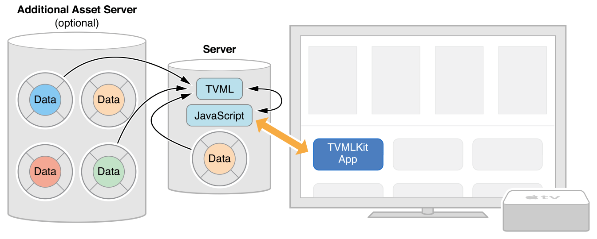
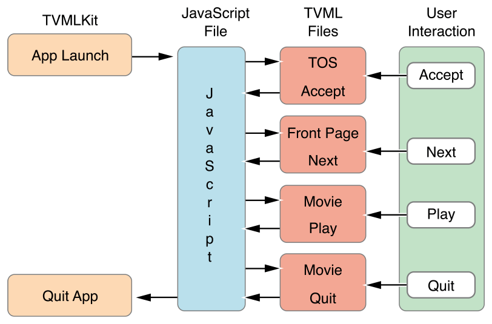

> 导航：[总目录](../../../README.md) · [documentation](../../../_indexes/documentation.md) · [App Programming Guide for tvOS](index.md)

## Creating a Client-Server App

Client-server apps using JavaScript and TVML differ slightly from traditional apps. The main function of the project you create in Xcode is to access a main JavaScript file and present pages created from TVML files on the screen. Figure 2-1 shows the client-server model.

__Figure 2-1__Client-server model

Your JavaScript file loads TVML pages and pushes each page onto the navigation stack. As the user navigates through your app, TVML pages are pushed and popped from the stack. After the user closes your app, the Apple TV home screen appears. Figure 2-2 shows the flow for a basic app.

__Figure 2-2__Client-server app flow

To build a client-server app:

1. Open Xcode and create a new project.
2. Select the Single View Application template from tvOS.
3. Remove the view controller file and the main storyboard for the app.
4. Open the `info.plist` file and remove the _Main storyboard file base name_ entry.

   > [!NOTE]
   > 
5. Make these changes to the `AppDelegate.swift` file:

   - Add `import TVMLKit`.
   - Change the class declaration to be `class AppDelegate: UIResponder, UIApplicationDelegate, TVApplicationControllerDelegate {`.
   - Add the following global variable to your class: `var appController: TVApplicationController?`
   - Modify `application:didfinishLaunchingWithOptions:` according to the code found in the listing below:

   1. `func application(application: UIApplication, didFinishLaunchingWithOptions launchOptions: [NSObject: AnyObject]?) -> Bool {`
   2. `self.window = UIWindow(frame: UIScreen.mainScreen().bounds)`
   4. `let appControllerContext = TVApplicationControllerContext()`
   6. `let javascriptURL = NSURL(string: "Enter path to your JavaScript file here")`
   8. `appControllerContext.javaScriptApplicationURL = javascriptURL`
   9. `appControllerContext.launchOptions["BASEURL"] = TVBaseURL`
   10. `if let options = launchOptions {`
   11. `for (kind, value) in options {`
   12. `if let kindStr = kind as? String {`
   13. `appControllerContext.launchOptions[kindStr] = value`
   14. `}`
   15. `}`
   16. `}`
   18. `self.appController = TVApplicationController(context: appControllerContext, window: self.window, delegate: self)`
   20. `return true`
   21. `}`

The code in the above example loads a JavaScript file which then loads a TVML page and displays it in the simulator or on a television screen if a new Apple TV is connected to your computer. For more information about JavaScript classes, see _[Apple TV JavaScript Framework Reference](https://developer.apple.com/documentation/tvmljs)_.

The JavaScript in Listing 2-1 loads a TVML page ([Listing 2-2](#apple-f4xwc4dqnrsv64tfmyxwi33df52wszbpkridimbqge2tenbrfvbuqmznknltk)) that displays an alert asking if the user wants to upgrade to the premium version of your app. After the page is loaded, it is pushed onto the navigation stack The operating system then displays it to the user. For more information on available TVML templates and elements, see _[Apple TV Markup Language Reference](https://developer.apple.com/library/archive/documentation/LanguagesUtilities/Conceptual/ATV_Template_Guide/index.html#//apple_ref/doc/uid/TP40015064)_.

__Listing 2-1__Pushing a TVML page onto the navigation stack

1. `function getDocument(url) {`
2. `var templateXHR = new XMLHttpRequest();`
3. `templateXHR.responseType = "document";`
4. `templateXHR.addEventListener("load", function() {pushDoc(templateXHR.responseXML);}, false);`
5. `templateXHR.open("GET", url, true);`
6. `templateXHR.send();`
7. `return templateXHR;`
8. `}`
10. `function pushDoc(document) {`
11. `navigationDocument.pushDocument(document);`
12. `}`
14. `App.onLaunch = function(options) {`
15. `var templateURL = 'Enter path to your server here/alertTemplate.tvml';`
16. `getDocument(templateURL);`
17. `}`
19. `App.onExit = function() {`
20. `console.log('App finished');`
21. `}`

__Listing 2-2__A TVML page to display an alert

1. `<document>`
2. `<alertTemplate>`
3. `<title>Update to premium</title>`
4. `<description>Go ad free by updating to the premium version</description>`
5. `<button>`
6. `<text>Update Now</text>`
7. `</button>`
8. `<button>`
9. `<text>Cancel</text>`
10. `</button>`
11. `</alertTemplate>`
12. `</document>`

> [!IMPORTANT]
> 

[Apple TV and tvOS](index.md#apple-f4xwc4dqnrsv64tfmyxwi33df52wszbpkridimbqge2tenbrfvbuqmjsfvjvomi)

[Controlling the User Interface with the Apple TV Remote](WorkingwiththeAppleTVRemote.md#apple-f4xwc4dqnrsv64tfmyxwi33df52wszbpkridimbqge2tenbrfvbuqnjnknlti)
