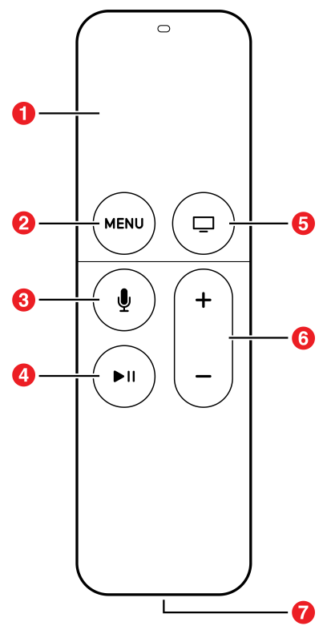

> 导航：[总目录](../../../README.md) · [documentation](../../../_indexes/documentation.md)

## Apple TV and tvOS

With Apple TV on tvOS, users can now play games, use productivity and social apps, watch movies, and enjoy shared experiences. All of these new features bring new opportunities for developers.

tvOS is derived from iOS but is a distinct OS, including some frameworks that are supported only on tvOS. You’ll find that the familiarity of iOS development, combined with support for a shared, multiuser experience, opens up areas of possibilities for app development that you won’t find on iOS devices. You can create new apps or use your iOS code as a starting point for a tvOS app. Either way, you use tools (Xcode) and languages (Objective-C, Swift, and JavaScript) that you are already familiar with. This document describes the unique capabilities of Apple TV and provides pointers to in-depth information that will get you started developing a tvOS app.

When porting an existing project, you can include an additional target in your Xcode project to simplify sharing of resources, but you need to create new storyboards for tvOS. Likely, you will need to look at how users navigate through your app and adapt your app’s user interface to Apple TV. For more information, see _Apple TV Human Interface Guidelines_.

A new Apple TV-specific provisioning profile is required for Apple TV development and distribution, which is used with your existing iOS development and distribution signing identities. You create a new Apple TV provisioning profile the same way that you create an iOS provisioning profile, using Fix Issue in Xcode, or through the developer portal website. For information on capabilities supported by Apple TV, see Supported Capabilities.

Although iOS and tvOS apps are distinct entities (meaning there isn’t a single binary that runs on both platforms), you can create a universal purchase that bundles these apps. The user purchases an app once, and gets the iOS version for their iOS devices and a tvOS version for Apple TV. For more information, see _App Distribution Guide_.

### Apple TV Hardware

Apple TV has the following hardware specifications:

- 64-bit A8 processor
- 32 GB or 64 GB of storage
- 2 GB of RAM
- 10/100 Mbps Ethernet
- WiFi 802.11a/b/g/n/ac
- 1080p resolution
- HDMI
- New Siri Remote / Apple TV Remote

The Apple TV Remote comes in two flavors—one with Siri built in and the other with onscreen search capabilities. The Siri Remote is available in the following countries:

- Australia
- Canada
- France
- Germany
- Japan
- Spain
- United Kingdom
- United States

Apple TVs in all other countries are packaged with the Apple TV Remote. [Figure 1-1](#apple-f4xwc4dqnrsv64tfmyxwi33df52wszbpkridimbqge2tenbrfvbuqmjsfvjvonq) shows the new remote. It has the following buttons:

1. Touch surface. Swipe to navigate. Press to select. Press and hold for contextual menus.
2. Menu. Press to return to the previous menu.
3. Siri/Search. Press and hold to talk in those countries that have the Siri Remote. In all other countries, press to open the onscreen search app.
4. Play/Pause. Play and pause media.
5. Home. Press to return to the Home screen. Press twice to view open apps. Press and hold to sleep.
6. Volume. Control TV volume.
7. Lightning connector. Plug-in for charging.

__Figure 1-1__Siri Remote and Apple TV Remote

### Traditional Apps

The process for creating apps for Apple TV is similar to the process for creating iOS apps. You can create games, utility apps, media apps, and more using the same techniques and frameworks used by iOS. New and existing apps can target both iOS and the new Apple TV, allowing for unprecedented multiplayer options.

### Client-Server Apps

Apple TV makes it easier to create client-server apps, whose primary purpose is to stream media, using web technologies such as HTTPS, XMLHTTPRequest, DOM, and JavaScript. You use Apple’s custom markup language, TVML, to create interfaces, and you specify app behaviors using JavaScript. The TVMLKit framework provides the bridge between your native code and the JavaScript code in your user interface.

You specify your app’s initial launch behavior in a JavaScript file. Create your binary app as you typically would, and then use the TVMLKit framework to load the JavaScript file. Your JavaScript file loads TVML pages and displays them on the screen. Create TVML pages using templates supplied by Apple. Each template produces a unique, full-screen display of information. You modify a page by adding or removing elements from a template. For a list of Apple-supplied TVML templates and elements, see _[Apple TV Markup Language Reference](https://developer.apple.com/library/archive/documentation/LanguagesUtilities/Conceptual/ATV_Template_Guide/index.html#//apple_ref/doc/uid/TP40015064)_.

All video playback on Apple TV is based on HTTP Live Streaming and FairPlay Streaming. See _[About HTTP Live Streaming](../../../referencelibrary/Getting%20Started/About%20HTTP%20Live%20Streaming.md#apple-f4xwc4dqnrsv64tfmyxwi33df52wszbpkridimbqgeztsnzy)_ and _FairPlay Streaming Overview_. For HTTP Live Streaming authoring specifications, see [HLS Authoring Specification for Apple TV](https://developer.apple.com/services-account/download?path=/Documentation/HLS_Authoring_Specification_for_Apple_TV/HLS_Authoring_Specification_for_Apple_TV.pdf).

### Top Shelf

Users can place any Apple TV app in the top row of their app’s menu, which can contain up to five icons. When a user selects an app icon in the top row, the top of the screen shows content related to that app. This area is called the top shelf. The top shelf can showcase an app’s content, give people a preview of the content they care about, or let them jump straight into a particular part of the app.

### Focus and Layered Images

A UI element is _in focus_ when the user highlights an item, but has not selected an item. When a user brings focus to a layered image, the image responds to the user’s touches on the glass touch surface of the remote. Each layer of the image rotates at a slightly different rate to create a parallax effect. This subtle effect creates a sense of depth, realism, and vitality, and emphasizes that the focused item is the closest thing to the user.

Your layered images are going to be created by your designers. But how do you get them into your app? The [UIImageView](https://developer.apple.com/documentation/uikit/uiimageview) class has been modified to support layered images, so in most cases you only need to make minimal coding changes. Your workflow is going to change depending on whether you are adding the images directly to your app or loading them from a server at runtime.

### New tvOS Frameworks

Apple tvOS introduces the following new frameworks that are specific to tvOS:

- TVMLJS. Describes the JavaScript APIs used to load the TVML pages that are used to display information in client-server apps. See _[Apple TV JavaScript Framework Reference](https://developer.apple.com/documentation/tvmljs)_.
- TVMLKit. Provides a way to incorporate JavaScript and TVML elements into your app. See _[TVMLKit Framework Reference](https://developer.apple.com/documentation/tvmlkit)_.
- TVServices. Describes how to add a top shelf extension to your app. See _[TVServices Framework Reference](https://developer.apple.com/documentation/tvservices)_.

### New User Interface Challenges

Apple TV does not have a mouse that allows users to directly select and interact with an app, nor are users able to use gestures and touch to interact with an app. Instead, they use the new Siri Remote or a game controller to move around the screen.

In addition to the new controls, the overall user experience is drastically different. Macs and iOS devices are generally a single-person experience. A user may interact with others through your app, but that user is still the only person using the device. With the new Apple TV, the user experience becomes much more social. Several people can be sitting on the couch and interacting with your app and each other. Designing apps to take advantage of these changes is crucial to designing a great app.

### Local Storage for Your App Is Limited

The maximum size for a tvOS app bundle 4 GB. Moreover, your app can only access 500 KB of persistent storage that is local to the device (using the [NSUserDefaults](https://developer.apple.com/library/archive/documentation/LegacyTechnologies/WebObjects/WebObjects_3.5/Reference/Frameworks/ObjC/Foundation/Classes/NSUserDefaults/Description.html#//apple_ref/occ/cl/NSUserDefaults) class). Outside of this limited local storage, all other data must be purgeable by the operating system when space is low. You have a few options for managing these resources:

- Your app can store and retrieve user data in iCloud.
- Your app can download the data it needs into its cache directory. Downloaded data is not deleted while the app is running. However, when space is low and your app is not running, this data may be deleted. Do not use the entire cache space as this can cause unpredictable results.
- Your app can package read-only assets using on-demand resources. Then, at runtime, your app requests the resources it needs, and the operating system automatically downloads and manages those resources. Knowing how and when to load new assets while keeping your users engaged is critical to creating a successful app. For information on on-demand resources, see _[On-Demand Resources Guide](https://developer.apple.com/library/archive/documentation/FileManagement/Conceptual/On_Demand_Resources_Guide/index.html#//apple_ref/doc/uid/TP40015083)_.

This means that every app developed for the new Apple TV must be able to store data in iCloud and retrieve it in a way that provides a great customer experience.

### Targeting Apple TV in Your Apps

To conditionalize code so that it is only compiled for tvOS, use the `TARGET_OS_TV` macro or one of the tvOS version constants defined in `Availability.h`. In an app written in Swift, use a build configuration statement or an API availability statement.

__Listing 1-1__Conditionalizing code for tvOS in Objective-C

1. `#if TARGET_OS_TV`
2. `NSLog(@"Code compiled only when building for tvOS.");`
3. `#endif`

__Listing 1-2__Conditionalizing code for tvOS in Swift

1. `#if os(tvOS)`
2. `NSLog(@"Code compiled only when building for tvOS.");`
3. `#endif`
5. `if #available(tvOS 9.1,*) {`
6. `print("Code that executes only on tvOS 9.1 or later.")`
7. `}`

### Adopting Light and Dark Themes

Starting in tvOS 10.0, you are able to personalize your app using light and dark themes. Apps automatically adopt a light theme unless you specifically tell your app to adopt dark themes. To adopt a dark theme, set the [UIUserInterfaceStyle](../Information%20Property%20List%20Key%20Reference/iOS%20Keys.md#apple-f4xwc4dqnrsv64tfmyxwi33df52wszbpkridimbqga4tenjsfvjvonbu) property in your apps info.plist to either `Dark` or `Automatic`. If you create a new app using Xcode 8.0, the [UIUserInterfaceStyle](../Information%20Property%20List%20Key%20Reference/iOS%20Keys.md#apple-f4xwc4dqnrsv64tfmyxwi33df52wszbpkridimbqga4tenjsfvjvonbu) property is automatically set to `Automatic`.

### Implementing Universal Purchase

By linking the iOS and tvOS versions of your app in iTunes Connect, you can enable universal purchase for your app. Universal purchase allows users to download both iOS and tvOS versions of your app with a single purchase, providing a seamless experience for your users. See [Universal Purchase of iOS and tvOS Apps](https://developer.apple.com/support/universal-purchase/) to learn how to set up universal purchase.

### Creating a Background Audio App

You must declare that your tvOS app provides specific background services and must be allowed to continue running while in the background. To do this, add the `UIBackgroundModes` key in your app’s `info.plist` file. The key’s value is an array that contains one or more strings identifying which background tasks your app supports. Specify the string value `audio` to indicate your app plays audible content to the user while in the background.

[Creating a Client-Server App](YourFirstAppleTVApp.md#apple-f4xwc4dqnrsv64tfmyxwi33df52wszbpkridimbqge2tenbrfvbuqmznknltc)
