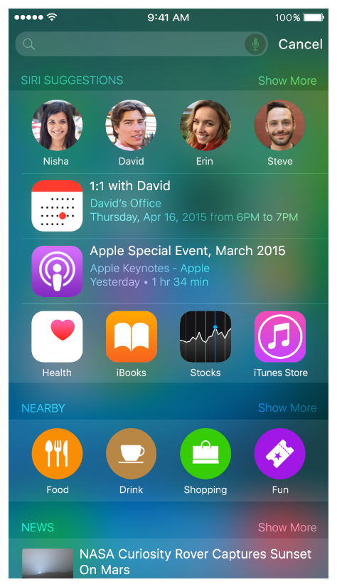
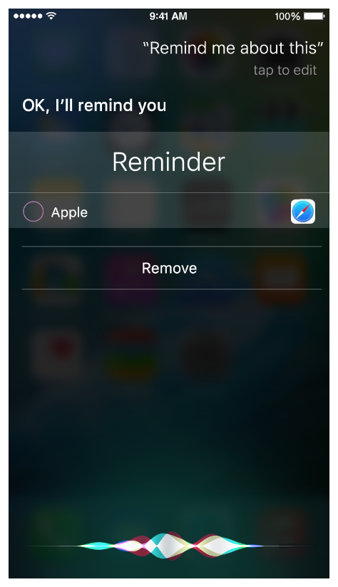
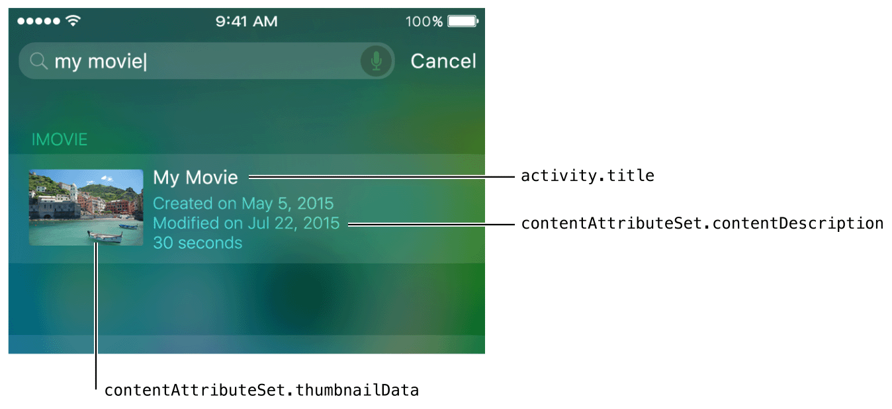

> 导航：[总目录](../../../README.md) · [documentation](../../../_indexes/documentation.md) · [App Search Programming Guide](index.md)

## Index Activities and Navigation Points

The [NSUserActivity](https://developer.apple.com/documentation/foundation/nsuseractivity) class provides methods that let you capture specific app states and navigation points that the user has previously visited and then restore them later using Handoff (to learn more about enabling Handoff in your app, see _[Handoff Programming Guide](../../User%20Experience/Handoff%20Programming%20Guide/About%20Handoff.md#apple-f4xwc4dqnrsv64tfmyxwi33df52wszbpkridimbqge2dgmzy)_). In apps that run in iOS 8 and later, users expect Handoff to help them start an activity on one device and continue it on another.

In addition to supporting Handoff, using `NSUserActivity` in iOS 9 and later lets you:

- Index activities as users perform them in your app. Activities could include creating or viewing content, viewing a set of items (such as a results list), or visiting a navigation point within your app.
- Mark specific items as available for public searching (for some examples of items that can be appropriate for public searching, see [Example Implementations](Choosing.md#apple-f4xwc4dqnrsv64tfmyxwi33df52wszbpkridimbqge3dgmbyfvbuqmznknltc))
- Provide indexable metadata about an item, which gives users rich information in search results

To provide the best search results, avoid creating multiple `NSUserActivity` objects at one time. Also, note that the `NSUserActivity` class is _not_ intended to help you index arbitrary data in your app. If you want to index app-specific data, use the APIs of the Core Spotlight framework and use the appropriate [relatedUniqueIdentifier](https://developer.apple.com/documentation/corespotlight/cssearchableitemattributeset/1621569-relateduniqueidentifier) to link indexed items together (to learn more, see [Index App Content](AppContent.md#apple-f4xwc4dqnrsv64tfmyxwi33df52wszbpkridimbqge3dgmbyfvbuqnznknltc)).

Using [NSUserActivity](https://developer.apple.com/documentation/foundation/nsuseractivity) APIs also lets you take advantage of Siri suggestions and smart reminders. Siri suggestions are displayed in the Spotlight search screen and can include searchable activities. (Note that only activities with a high engagement ratio are eligible to be included in Siri suggestions. For more information about engagement, see [Combine APIs to Increase Coverage](CombiningAPIs.md#apple-f4xwc4dqnrsv64tfmyxwi33df52wszbpkridimbqge3dgmbyfvbuqmjqfvjvomi).) Users can use Siri smart reminders to be reminded about specific content related to your app. When users receive a smart reminder, the activity they specified is displayed in the reminder.

As the user uses your app, you create activity objects associated with various navigation points and app states. Each item is added to the on-device index by default. In iOS 9 and later, marking a public item as eligible for public indexing also adds it to the on-device index and confers an additional advantage: When you use web markup to make your related website content searchable, user engagement with publicly eligible search results from your app can help improve the ranking of your website’s content. When a user taps a searchable activity or state in Spotlight search results, you use [NSUserActivity](https://developer.apple.com/documentation/foundation/nsuseractivity) APIs to continue the activity and return the user to the relevant area in your app.

> [!NOTE]
> 

### Creating Searchable Activities

To make an activity or navigation point searchable, create an [NSUserActivity](https://developer.apple.com/documentation/foundation/nsuseractivity) object to represent it. Use `NSUserActivity` properties to identify the item’s type, provide metadata that describes it, and make it eligible for search. Setting an item as eligible for search means that the item gets added to the on-device index when the item becomes current. Listing 3-1 shows how to create an activity.

__Listing 3-1__Creating an activity

1. `// It's recommended that you use reverse DNS notation for the required activity type property.`
2. `var activity: NSUserActivity = NSUserActivity(activityType: "com.myCompany.myContentType")`
4. `// Set properties that describe the activity and that can be used in search.`
5. `activity.title = "My Activity Title"`
6. `activity.userInfo = ["id": "http://www.mydomain.com/myContentItem/ABC-123"]`
8. `// Add the item to the private on-device index.`
9. `activity.eligibleForSearch = true`

Although it’s not shown in Listing 3-1, `NSUserActivity` also defines the `contentAttributeSet` property, which lets you specify as many attributes as you need to describe an item. The `contentAttributeSet` property takes a `CSSearchableItemAttributeSet` object, which is a Core Spotlight object you use to provide indexable metadata that enriches search results. Core Spotlight defines a large number of properties that specify metadata in several topic areas, such as media, events, and messages. Only the [title](https://developer.apple.com/documentation/foundation/nsuseractivity/1413375-title), [userInfo](https://developer.apple.com/documentation/foundation/nsuseractivity/1411706-userinfo), and [contentAttributeSet](https://developer.apple.com/documentation/foundation/nsuseractivity/1616398-contentattributeset) properties are required, but to give users the best experience, it’s recommended that you provide values for as many properties as possible. In particular, it’s recommended that you always provide content-specific values for the [thumbnailData](https://developer.apple.com/documentation/corespotlight/cssearchableitemattributeset/1621582-thumbnaildata) and [contentDescription](https://developer.apple.com/documentation/corespotlight/cssearchableitemattributeset/1621584-contentdescription) properties. For a full list of properties you can use, see _[CSSearchableItemAttributeSet Class Reference](https://developer.apple.com/documentation/corespotlight/cssearchableitemattributeset)_.

Figure 3-1 shows how three common properties can be used to provide metadata about a searchable item.

__Figure 3-1__A searchable item can use various properties to display metadata

Three `NSUserActivity` properties warrant particular mention:

- [eligibleForPublicIndexing](https://developer.apple.com/documentation/foundation/nsuseractivity/1414701-iseligibleforpublicindexing)
- [expirationDate](https://developer.apple.com/documentation/foundation/nsuseractivity/1413745-expirationdate)
- [webpageURL](https://developer.apple.com/documentation/foundation/nsuseractivity/1418086-webpageurl)

Activities are private by default. When you set an item’s `eligibleForPublicIndexing` property and you use web markup to make your related website content searchable, user engagement with the item can help improve the ranking of your website’s content. To learn more about using web markup, see [Mark Up Web Content](WebContent.md#apple-f4xwc4dqnrsv64tfmyxwi33df52wszbpkridimbqge3dgmbyfvbuqobnknltc).

If you don’t set the [expirationDate](https://developer.apple.com/documentation/foundation/nsuseractivity/1413745-expirationdate) property appropriately, the system automatically expires the activity after a period of time.

The [webpageURL](https://developer.apple.com/documentation/foundation/nsuseractivity/1418086-webpageurl) property is useful when your app content is also available in your website and you use both `NSUserActivity` APIs in your app and web markup in your website. In particular, you can use the `webpageURL` property to avoid duplicate indexing of the same item (to learn more, see [Combine APIs to Increase Coverage](CombiningAPIs.md#apple-f4xwc4dqnrsv64tfmyxwi33df52wszbpkridimbqge3dgmbyfvbuqmjqfvjvomi)). When you set the `webpageURL` property, also set the [requiredUserInfoKeys](https://developer.apple.com/documentation/foundation/nsuseractivity/1417256-requireduserinfokeys) property, using the keys of the [userInfo](https://developer.apple.com/documentation/foundation/nsuseractivity/1411706-userinfo) dictionary that must be stored. If you don’t set the `requiredUserInfoKeys` property, the `userInfo` dictionary will be empty when the activity is restored.

When a user performs the activity or enters the app state associated with the `NSUserActivity` object you created, your app calls the [becomeCurrent](https://developer.apple.com/documentation/foundation/nsuseractivity/1413665-becomecurrent) method to mark the activity as current. A current activity that’s eligible for search is automatically added to the private on-device index (that is, [CSSearchableIndex](https://developer.apple.com/documentation/corespotlight/cssearchableindex)). Additionally you can enable user actions within a search result, such as calling a phone number or getting directions to a location (to learn how to do this, see “Supporting Actions” in _[CSSearchableItemAttributeSet Class Reference](https://developer.apple.com/documentation/corespotlight/cssearchableitemattributeset)_).

To guarantee that the activity and its metadata get indexed, you must hold a strong reference to the activity until it gets added to the index. There are two ways to do this: The first way is to assign the activity to a property in the controller object that creates the activity. The second way is to use the [userActivity](https://developer.apple.com/documentation/uikit/uiresponder/1621089-useractivity) property of the [UIResponder](https://developer.apple.com/documentation/uikit/uiresponder) object. If you use the second way, you need to set the metadata—such as information in the [userInfo](https://developer.apple.com/documentation/foundation/nsuseractivity/1411706-userinfo) property—in the [updateUserActivityState:](https://developer.apple.com/documentation/uikit/uiresponder/1621095-updateuseractivitystate) method; otherwise, the metadata you set on the activity will not be persisted.

If you want an activity to be eligible for search but not for Handoff between devices, set the [eligibleForSearch](https://developer.apple.com/documentation/foundation/nsuseractivity/1417761-iseligibleforsearch) property to `true` and the [eligibleForHandoff](https://developer.apple.com/documentation/foundation/nsuseractivity/1410971-eligibleforhandoff) property to `false`.

Use Core Spotlight APIs to remove items you indexed using `NSUserActivity`. When an item is indexed using both `NSUserActivity` and Core Spotlight APIs and the item is connected using the [relatedUniqueIdentifier](https://developer.apple.com/documentation/corespotlight/cssearchableitemattributeset/1621569-relateduniqueidentifier) property, removing the item by using the Core Spotlight APIs makes the activity ineligible for indexing. For more information about using the `relatedUniqueIdentifier` property, see [Combine APIs to Increase Coverage](CombiningAPIs.md#apple-f4xwc4dqnrsv64tfmyxwi33df52wszbpkridimbqge3dgmbyfvbuqmjqfvjvomi).

### Continuing Activities Chosen in Search Results

When users tap a search result for an [NSUserActivity](https://developer.apple.com/documentation/foundation/nsuseractivity) item that you added to the index, your app should open and restore the context associated with that item. To accomplish this, your app delegate implements [application:continueUserActivity:restorationHandler:](https://developer.apple.com/documentation/uikit/uiapplicationdelegate/1623072-application), checking the type of the incoming activity to see whether the app is opening because the user tapped an indexed item in a search result. The `application:continueUserActivity:restorationHandler:` method is the same method you currently use to continue an activity using Handoff.

Listing 3-2 shows a skeletal implementation of `application:continueUserActivity:restorationHandler:`.

__Listing 3-2__Continuing a user activity

1. `func application(UIApplication, continueUserActivity userActivity: NSUserActivity, restorationHandler: [AnyObject]? -> Void) -> Bool {`
2. `if userActivity.activityType == "com.myCompany.myContentType" {`
3. `// Restore app state for this userActivity and associated userInfo value.`
4. `}`
5. `return true`
6. `}`

[Example Implementations](Choosing.md#apple-f4xwc4dqnrsv64tfmyxwi33df52wszbpkridimbqge3dgmbyfvbuqmznknltc)

[Index App Content](AppContent.md#apple-f4xwc4dqnrsv64tfmyxwi33df52wszbpkridimbqge3dgmbyfvbuqnznknltc)
