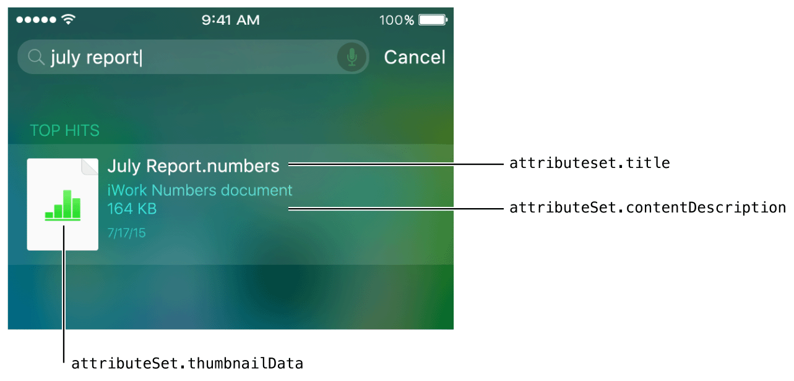

> 导航：[总目录](../../../README.md) · [documentation](../../../_indexes/documentation.md) · [App Search Programming Guide](index.md)

## Index App Content

The Core Spotlight framework provides ways to index the content within your app and manage the private on-device index. Core Spotlight works best for indexing user-specific content, such as friends, items marked as favorite, purchased items, and so on. When you use Core Spotlight APIs to make items searchable, you make it easy for users to find their content in Spotlight search results.

> [!NOTE]
> 

At a high level, Core Spotlight APIs help you provide a comprehensive description of an item and to add it to the on-device index. In addition, CoreSpotlight APIs support indexing items at any time, such as when your app loads.

When users tap an indexed item in Spotlight search results, your app delegate’s [application:continueUserActivity:restorationHandler:](https://developer.apple.com/documentation/uikit/uiapplicationdelegate/1623072-application) method is called (this is the same method you implement to support Handoff). In this scenario, the activity type your app delegate receives is [CSSearchableItemActionType](https://developer.apple.com/documentation/corespotlight/cssearchableitemactiontype), which helps you determine the app content to show the user. [Creating Searchable Items](#apple-f4xwc4dqnrsv64tfmyxwi33df52wszbpkridimbqge3dgmbyfvbuqnznknlte) describes the process in more detail.

In addition to using Core Spotlight APIs to make app content searchable, you should also use [NSUserActivity](https://developer.apple.com/documentation/foundation/nsuseractivity) APIs to make app states and navigation points searchable (you can learn more about indexing activities in [Index Activities and Navigation Points](Activities.md#apple-f4xwc4dqnrsv64tfmyxwi33df52wszbpkridimbqge3dgmbyfvbuqnrnknltc)). Both APIs use the same object to provide metadata about searchable items (that is, a [CSSearchableItemAttributeSet](https://developer.apple.com/documentation/corespotlight/cssearchableitemattributeset) object), and both give you ways to prevent duplication of items in search results. Unlike the [NSUserActivity](https://developer.apple.com/documentation/foundation/nsuseractivity) API, however, Core Spotlight APIs don’t require users to visit the content before it gets indexed. Learn more about the advantages of using multiple search-related APIs in [Combine APIs to Increase Coverage](CombiningAPIs.md#apple-f4xwc4dqnrsv64tfmyxwi33df52wszbpkridimbqge3dgmbyfvbuqmjqfvjvomi).

### Creating Searchable Items

To make content searchable, first create an attribute set containing properties that specify the metadata you want to display about an item in a search result. The attributes you choose vary, depending on your domain: You can use the attributes that Core Spotlight provides in categories defined on [CSSearchableItemAttributeSet](https://developer.apple.com/documentation/corespotlight/cssearchableitemattributeset), or you can define your own. (If you want to define a custom attribute, be as specific as possible in your definition and use the [contentTypeTree](https://developer.apple.com/documentation/corespotlight/cssearchableitemattributeset/1621660-contenttypetree) property so that your custom attribute can inherit from a known type.)

> [!NOTE]
> 

Next, create a [CSSearchableItem](https://developer.apple.com/documentation/corespotlight/cssearchableitem) object to represent the item and add it to the on-device index. When you create a searchable item, you must specify a unique identifier so that you can access the item in the index. (Note that you need to specify an appropriate expiration date for items that should remain searchable after a period of time; for more information, see [expirationDate](https://developer.apple.com/documentation/corespotlight/cssearchableitem/1621680-expirationdate).) You can also specify a domain identifier that identifies a group or owner for the item and lets you access groups of items at the same time. Listing 4-1 shows how to create a `CSSearchableItem` object and index it.

__Listing 4-1__Creating a searchable item and adding it to the on-device index

1. `// Create an attribute set to describe an item.`
2. `let attributeSet = CSSearchableItemAttributeSet(itemContentType: kUTTypeData as String)`
3. `// Add metadata that supplies details about the item.`
4. `attributeSet.title = "July Report.Numbers"`
5. `attributeSet.contentDescription = "iWork Numbers Document"`
6. `attributeSet.thumbnailData = DocumentImage.jpg`
8. `// Create an item with a unique identifier, a domain identifier, and the attribute set you created earlier.`
9. `let item = CSSearchableItem(uniqueIdentifier: "1", domainIdentifier: "file-1", attributeSet: attributeSet)`
11. `// Add the item to the on-device index.`
12. `CSSearchableIndex.defaultSearchableIndex().indexSearchableItems([item]) { error in`
13. `if error != nil {`
14. `print(error?.localizedDescription)`
15. `}`
16. `else {`
17. `print("Item indexed.")`
18. `}`
19. `}`

Using the code shown in Listing 4-1, an item that represents a Numbers document is added to the on-device index. When the user searches for part of the document’s title, the search results look something like this:

When the user taps on a searchable item from your app in Spotlight search results, your app delegate’s [application:continueUserActivity:restorationHandler:](https://developer.apple.com/documentation/uikit/uiapplicationdelegate/1623072-application) method is called. In your implementation of this method, check the type of the incoming activity to confirm that your app is opening because the user tapped an indexed item in a search result. Listing 4-2 shows a skeletal implementation of `application:continueUserActivity:restorationHandler:`.

__Listing 4-2__Continuing the activity that represents the searchable item

1. `func application(UIApplication, continueUserActivity userActivity: NSUserActivity, restorationHandler: [AnyObject]? -> Void) -> Bool {`
2. `if userActivity.activityType == CSSearchableItemActionType {`
3. `// This activity represents an item indexed using Core Spotlight, so restore the context related to the unique identifier.`
4. `// Note that the unique identifier of the Core Spotlight item is set in the activity’s userInfo property for the key CSSearchableItemActivityIdentifier.`
5. `let uniqueIdentifier = userActivity.userInfo? [CSSearchableItemActivityIdentifier] as? String`
6. `// Next, find and open the item specified by uniqueIdentifer.`
7. `}`
8. `return true`
9. `}`

The [CSSearchableItemAttributeSet](https://developer.apple.com/documentation/corespotlight/cssearchableitemattributeset) class also helps you support actions that users can take from an item in search results; specifically, you can let users make a phone call or get directions to a location. To enable a phone call, set the item’s [supportsPhoneCall](https://developer.apple.com/documentation/corespotlight/cssearchableitemattributeset/1621653-supportsphonecall) property to `1` and specify a phone number in the [phoneNumbers](https://developer.apple.com/documentation/corespotlight/cssearchableitemattributeset/1621650-phonenumbers) property. Be sure to enable a phone call action only when it's appropriate and it represents the primary action a user is likely to take. For example, it makes sense to let users call a business, but it doesn’t make sense to let users call a phone number that happens to be displayed on a research paper.

To help users get directions to a location described in a search result, set the item’s [supportsNavigation](https://developer.apple.com/documentation/corespotlight/cssearchableitemattributeset/1621564-supportsnavigation) property to `1` and supply values for the [latitude](https://developer.apple.com/documentation/corespotlight/cssearchableitemattributeset/1620586-latitude) and [longitude](https://developer.apple.com/documentation/corespotlight/cssearchableitemattributeset/1620571-longitude) properties. As with the phone call action, be sure to enable the navigation action only when it makes sense. For example, you wouldn’t enable navigation for a person’s photo, but you could enable navigation for an item that represents a restaurant review.

### Maintaining the Index

Keeping the on-device index up to date is critical for ensuring that search results from your app remain relevant. When search results contain relevant items, users are more likely to engage with them, which in turn helps to increase the ranking of your searchable items.

Core Spotlight provides several APIs you can use to work with the index and keep it up to date. For example, Listing 4-3 shows how to update the index, using the same method you use to add new items to the index.

__Listing 4-3__Updating the index

1. `func indexSearchableItems(items: [CSSearchableItem], completionHandler: ((NSError?) -> Void)?)`

You also use the [indexSearchableItems:completionHandler:](https://developer.apple.com/documentation/corespotlight/cssearchableindex/1620333-indexsearchableitems) method to update an item’s title, description, or any other property.

To ensure that only relevant items are returned in search results, you may need to delete indexed items. Core Spotlight provides a few ways to remove items from the index, three of which are shown in Listing 4-4.

__Listing 4-4__Three ways to delete items from the on-device index

1. `// Delete the items represented by an array of unique identifiers.`
2. `func deleteSearchableItemsWithIdentifiers(identifiers: [String], completionHandler: ((NSError?) -> Void)?)`
4. `// Delete the items represented by an array of domains.`
5. `func deleteSearchableItemsWithDomainIdentifiers(domainIdentifiers: [String], completionHandler: ((NSError?) -> Void)?)`
7. `// Delete all items from the on-device index.`
8. `func deleteAllSearchableItemsWithCompletionHandler(completionHandler: ((NSError?) -> Void)?)`

### Using Advanced Features

Core Spotlight supports advanced features that help you batch updates to the index and, in case there was a problem indexing your data, perform index updates while your app isn’t running. For example, Core Spotlight includes support for data protection classes that help you choose the appropriate security policy for the information that you're indexing (to learn more about using protection classes, see [initWithName:protectionClass:](https://developer.apple.com/documentation/corespotlight/cssearchableindex/1620332-initwithname)). To take advantage of Core Spotlight advanced features, be sure to set the [indexDelegate](https://developer.apple.com/documentation/corespotlight/cssearchableindex/1620354-indexdelegate) property in your app and implement the required methods of [CSSearchableIndexDelegate](https://developer.apple.com/documentation/corespotlight/cssearchableindexdelegate).

When you have to index multiple items, you can break the task into batches and save the state of your indexing process. Listing 4-5 shows how to perform a batched update to the index.

__Listing 4-5__Batching updates to the index

1. `CSSearchableIndex *index = [CSSearchableIndex new];`
2. `[index beginIndexBatch];`
3. `[index indexSearchableitems:items completionHandler:nil];`
4. `[index deleteSearchableItemsWithIdentifiers:identifiers completionHandler:nil];`
5. `[index endIndexBatchWithClientState:clientState completionHandler:^(NSError *error) {`
6. `// Handle errors.`
7. `}];`

To resume indexing, use the value of the `clientState` parameter to determine where to restart, as shown in Listing 4-6.

__Listing 4-6__Restarting a batched update to the index

1. `CSSearchableIndex *index = [CSSearchableIndex new];`
2. `[index fetchLastClientStateWithCompletionHandler:^(NSData *clientState, NSError *error) {`
4. `if(error == nil) {`
5. `NSArray *items = // Fetch a batch of items for the specified client state.`
6. `[index beginIndexBatch];`
7. `[index indexSearchableitems:items completionHandler:nil];`
8. `[index endIndexBatchWithClientState:clientState completionHandler:^(NSError *error) {`
9. `// Handle errors.`
10. `}];`
11. `}`
13. `}];`

Core Spotlight defines an app extension you can implement to index items when your app isn’t running. The system calls this extension when the index is lost or there was a problem saving data that had been indexed, which can happen if the app crashes. Listing 4-7 shows one way to write this type of app extension.

__Listing 4-7__Creating an index-maintenance app extension

1. `@interface MyIndexRequestExtensionHandler : CSIndexExtensionRequestHandler`
3. `@end`
5. `@implementation MyIndexRequestExtensionHandler`
7. `- (void)searchableIndex:(CSSearchableIndex *)searchableIndex reindexAllSearchableItemsWithAcknowledgementHandler:(void (^)(void))acknowledgementHandler {`
8. `// Use index API to re-index all your data.`
9. `// Call the acknowledgement handler when this is done.`
10. `}`
12. `- (void)searchableIndex:(CSSearchableIndex *)searchableIndex reindexSearchableItemsWithIdentifiers:(NSArray *)identifiers acknowledgementHandler:(void (^)(void))acknowledgementHandler {`
13. `// Use index API to re-index data with the specified identifiers.`
14. `// Call the acknowledgement handler when this is done.`
15. `}`
17. `@end`

[Index Activities and Navigation Points](Activities.md#apple-f4xwc4dqnrsv64tfmyxwi33df52wszbpkridimbqge3dgmbyfvbuqnrnknltc)

[Mark Up Web Content](WebContent.md#apple-f4xwc4dqnrsv64tfmyxwi33df52wszbpkridimbqge3dgmbyfvbuqobnknltc)
