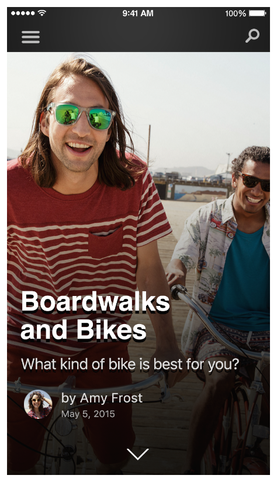

> 导航：[总目录](../../../README.md) · [documentation](../../../_indexes/documentation.md) · [App Search Programming Guide](index.md)

## Enhance Your Search Results

iOS users expect app search to give them the most relevant results, regardless of where the content comes from. To deliver the best user experience, iOS determines the quality and ranking of a searchable item by measuring:

- The frequency with which users view your content (which is captured when you use [NSUserActivity](https://developer.apple.com/documentation/foundation/nsuseractivity))
- The amount of engagement users have with your content (determined by the engagement ratio, which is based on the number of times users tap an item related to your app and the number of app-related items that are displayed in search results)
- The popularity of a URL in your website and the amount of structured data available

Rich, visually compelling search results encourage users to engage with items, and higher engagement ratios can improve the ranking of your app in search results. You provide rich data about searchable items by including metadata. Here are several ways you can associate rich metadata with searchable items and improve their visual appeal.

__Provide a succinct title that’s specific to the item.__ Based on the screen size of an iOS device, a long title can get truncated, so it’s best to limit your title to 90 characters.

__Write a well-structured description that doesn’t merely repeat the information that appears in the item’s title.__ For example, a recipe item’s title might be Chocolate Chip Cookies, but the description could be “Mouth-watering chocolate chip cookies just like Mom used to make.” As with titles, long descriptions can also get truncated, so it’s best to limit your description to 300 characters.

__Set an appropriate content type for the item.__ Spotlight can tailor the appearance of an item according to the [contentType](https://developer.apple.com/documentation/corespotlight/cssearchableitemattributeset/1621561-contenttype) value you supply when you create the [CSSearchableItemAttributeSet](https://developer.apple.com/documentation/corespotlight/cssearchableitemattributeset) object for the item. For example, to ensure that a contact in a search result uses the same appearance as a contact in the Contacts app, specify a `contentType` value of [kUTTypeContact](https://developer.apple.com/documentation/coreservices/kuttypecontact) and set the [authors](https://developer.apple.com/documentation/corespotlight/cssearchableitemattributeset/1621608-authors) property. (Or, to preserve the order of contact information, use the [authorNames](https://developer.apple.com/documentation/corespotlight/cssearchableitemattributeset/1621620-authornames) and [authorEmailAddresses](https://developer.apple.com/documentation/corespotlight/cssearchableitemattributeset/1621625-authoremailaddresses) properties.) You can learn more about different content types in _[UTType Reference](https://developer.apple.com/documentation/mobilecoreservices/uttype)_.

__Provide a thumbnail image that captures the item in a relevant and appealing way.__ As much as possible, use a unique image for each item; at a minimum, avoid using the same image for every item. For example, using your app logo as the thumbnail for items that represent different products doesn’t encourage users to engage with the items.

The optimal size for a thumbnail image varies, depending on the iOS device displaying the search result. If you are indexing the same sized image on all devices, it’s recommended that you use an image with a minimum size of 180 x 270 pixels. Here are some examples of appropriate image sizes:

- For a square or circular image, use 180 x 180 pixels.
- For an image that is taller than it is wide, use a height of 270 pixels and let the width be determined by maintaining the original aspect ratio. In this case, the image is center aligned.
- For an image that is wider than it is tall, use a width of 180 pixels and let the height be determined by maintaining the original aspect ratio. In this case, the image is top aligned.

If you want to take the current device into account when indexing an image, you can optimize the size to index smaller images in the following ways:

- On iPhone 5s and earlier models, use an image that has a minimum width of 40 pixels or a minimum height of 60 pixels.
- On iPhone 6 and all iPad models, use an image that has a minimum width of 120 pixels or a minimum height of 180 pixels.
- On iPhone 6 Plus, use an image that has a minimum width of 180 pixels or a minimum height of 270 pixels.

__Provide key information that the user is likely to want.__ For example, include dates and a booking number in the information about a hotel reservation.

__Enable actions the user can take, such as calling a phone number or getting directions to an address.__

__If your app is available in multiple languages, be sure to localize searchable items, too.__ You can use [CSLocalizedString](https://developer.apple.com/documentation/corespotlight/cslocalizedstring) to map a locale code to the corresponding string. For example: en -> “Hello”, es “Hola”.

In addition to providing rich metadata, you can use keywords to associate your results with queries. In general, it works well to use a small number of keywords per item. You can use synonyms and abbreviations—for example, you might use both “San Francisco Giants” and “SF Giants”—as well as category keywords such as “ticket” or “recipe.”

> [!NOTE]
> 

When users tap a search result from your app, be sure to take them directly to that content in your app. As much as possible, avoid displaying any interstitial views—such as pop-up views or multistep builds—because these experiences delay users from reaching the content they care about.

Avoid delaying users from their destination

Take users directly to their content

It’s also important to minimize the load time of your content, because a slow load time can negatively affect the ranking of your search results.

[Combine APIs to Increase Coverage](CombiningAPIs.md#apple-f4xwc4dqnrsv64tfmyxwi33df52wszbpkridimbqge3dgmbyfvbuqmjqfvjvomi)
