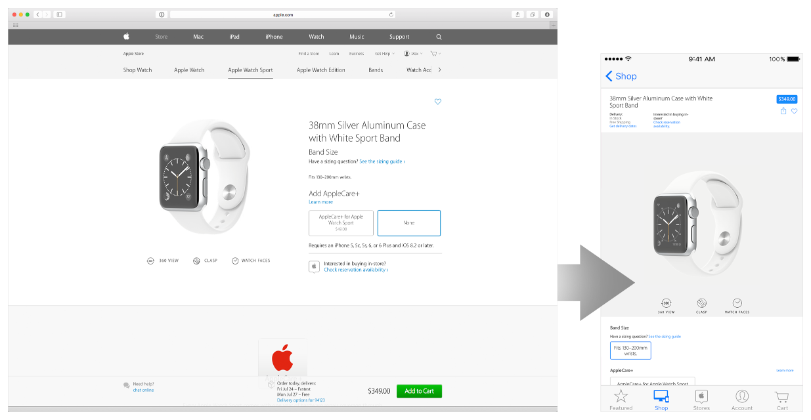
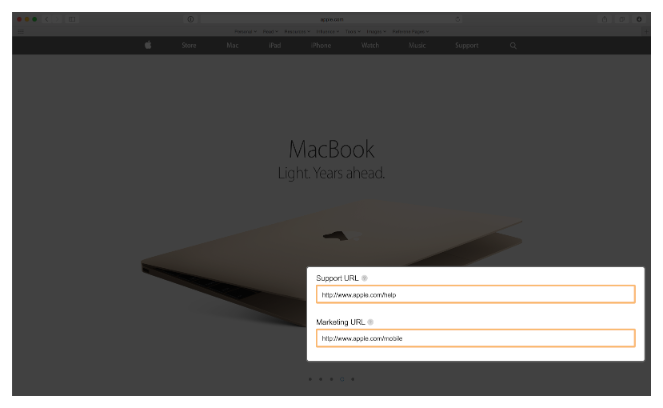
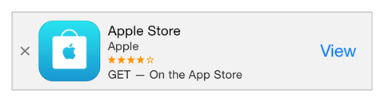
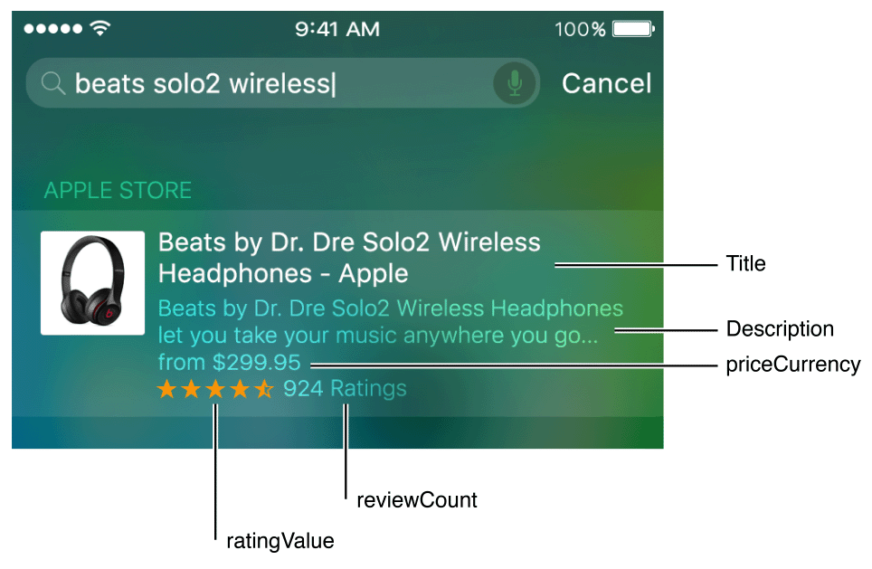

> 导航：[总目录](../../../README.md) · [documentation](../../../_indexes/documentation.md) · [App Search Programming Guide](index.md)

## Mark Up Web Content

If some or all of your app’s content is also available on your website, you can use web markup to give users access to your content in search results. Using web markup lets the Applebot web crawler index your content in Apple’s server-side index, which makes it available to all iOS users in Spotlight and Safari search results.

In addition to adding web markup, it’s strongly recommended that you support universal links. Adding support for universal links further enhances the user experience by opening your native app when users tap a link to your website (if your app isn’t installed, tapping the result opens Safari). This behavior helps websites that contain large amounts of data to be indexed and searchable by all users.

To learn how to use universal links, see [Support Universal Links](UniversalLinks.md#apple-f4xwc4dqnrsv64tfmyxwi33df52wszbpkridimbqge3dgmbyfvbuqmjsfvjvomi). Figure 5-1 shows an example of using universal links to let users tap a website link and open an app.

__Figure 5-1__Using universal links to support opening a website link in an app

To make your content searchable using web markup, follow these three steps:

- Make sure that Apple can discover and index your website.
- Add markup for deep links from your website into your app.
- Enrich your search results by adding markup for structured data.

> [!NOTE]
> 

### Making Your Website Discoverable by Apple

The easiest way to make sure that the Applebot web crawler crawls your website is to specify the URL as your support or marketing website when you submit your app. To learn more about specifying this URL, see Version Information.

__Figure 5-2__Specifying the support and marketing URLs

In addition, it’s critical that you amend your `robots.txt` file to allow Applebot to crawl your website. Applebot checks your `robots.txt` file to determine which parts of your website it should crawl. (You can learn more about the `robots.txt` file on [Wikipedia](https://en.wikipedia.org/wiki/Robots_exclusion_standard).) To detect Applebot, you can use a regular expression.

> [!NOTE]
> 

Use the App Search API validation tool to verify the data that Applebot is able to extract from your website. The information from the validation tool can help you identify pieces of information that you should add and can help you discover ways to optimize your website metadata. You can access the validation tool here: [https://search.developer.apple.com/appsearch-validation-tool](https://search.developer.apple.com/appsearch-validation-tool).

### Adding Deep Links to Your Website

The best way to help the users of your website discover your app is to adopt Smart App Banners (you can learn more about Smart App Banners by reading [Promoting Apps with Smart App Banners](https://developer.apple.com/library/archive/documentation/AppleApplications/Reference/SafariWebContent/PromotingAppswithAppBanners/PromotingAppswithAppBanners.html#//apple_ref/doc/uid/TP40002051-CH6)). A Smart App Banner on your website invites users who don’t have your app installed to download it from the App Store, and it gives users who already have your app installed an easy way to open a page deep within it. Figure 5-3 shows an example of a Smart App Banner.

__Figure 5-3__A Smart App Banner redirecting users into your installed app

Including an `app-argument` value in your Smart App Banner markup allows Apple to index your content. To include an `app-argument` value, you can use markup similar to this:

1. `<meta name="myApp" content="app-id=123, app-argument=http://example.com/about">`

It’s critical that the `app-argument` value contain the URL into your native app that corresponds to the specific web content that the user is currently viewing. Don’t leave the `app-argument` value set to the URL of your app’s opening screen.

In addition to adding a Smart App Banner, it’s strongly recommended that you use universal links with your deep links instead of using a custom URL scheme. When you support universal links, iOS can use Handoff to launch your app and provide you with the specific web URL that the user was viewing. To learn how to support universal links, see [Support Universal Links](UniversalLinks.md#apple-f4xwc4dqnrsv64tfmyxwi33df52wszbpkridimbqge3dgmbyfvbuqmjsfvjvomi).

As an alternative to using Smart App Banners, you can use one of the open standards that Apple supports to provide deep links on your website, such as Twitter Cards and App Links. For example, you might use Twitter Cards markup similar to the following:

1. `<meta name="twitter:app:name:iphone" content="myAppName">`
2. `<meta name="twitter:app:id:iphone" content="myAppID">`
3. `<meta name="twitter:app:url:iphone" content="myURL">`

Or you could use App Links markup in a similar way:

1. `<meta property="al:ios:app_name" content="myAppName">`
2. `<meta property="al:ios:app_store_id" content="myAppID">`
3. `<meta property="al:ios:url" content="myURL">`

For more information about Twitter Cards, see [https://dev.twitter.com/cards/mobile](https://dev.twitter.com/cards/mobile); for more information about App Links, see [http://applinks.org](http://applinks.org./documentation/).

After you mark up your website with deep links, you want to make sure that your app can handle them. When you support universal links, iOS calls your [application:continueUserActivity:restorationHandler:](https://developer.apple.com/documentation/uikit/uiapplicationdelegate/1623072-application) delegate method when a user taps a deep link into your app. If you use a custom schema, iOS calls [openURL:](https://developer.apple.com/documentation/uikit/uiapplication/1622961-openurl) to open your app. Listing 5-1 shows an example of using [openURL:](https://developer.apple.com/documentation/uikit/uiapplication/1622961-openurl) to handle a deep link from a Smart App Banner.

__Listing 5-1__Handling deep links

1. `// In this example, the URL is "http://example.com/profile/?123".`
2. `func application(application: UIApplication, openURL url: NSURL, sourceApplication: String?, annotation: AnyObject) -> Bool {`
3. `if let components = NSURLComponents(URL: url, resolvingAgainstBaseURL: true), let path = components.path, let query = components.query {`
4. `if path == "/profile" {`
5. `// Pass the profile ID from the URL to the view controller.`
6. `return profileViewController.loadProfile(query)`
7. `}`
8. `}`
9. `return false`
10. `}`

> [!NOTE]
> 

### Enriching Search Results

Marking up structured data on your website helps Apple better parse and understand your content and provide richer search results. For example, in addition to providing a title and a description for an item, you can include metadata such as an image, prices, ratings, and other details. The biggest advantage of providing structured data is that it can help you improve the ranking of your search results: Users tend to engage more with results that include richer information; moreover, results that get more engagement are shown more frequently.

To annotate your web content so that users can see rich search results, use standards-based markup for structured data, such as that defined at [Schema.org](http://schema.org/). For example, the code shown in Listing 5-2 combines different types of markup to give users the rich information shown in [Figure 5-4](#apple-f4xwc4dqnrsv64tfmyxwi33df52wszbpkridimbqge3dgmbyfvbuqobnknltg).

__Listing 5-2__Using markup to provide rich information

1. `<title>Beats by Dr. Dre Solo2 Wireless Headphones - Apple</title>`
2. `<meta property="og:description" content="Beats by Dr. Dre Solo2 Wireless Headphones let you take your music anywhere you go. Get fast, free shipping when you buy online.">`
3. `924`
4. `<meta itemprop="ratingValue" content="4.5">`
5. `<meta itemprop="priceCurrency" content="USD">`

__Figure 5-4__Marking up structured data gives users rich information

Although you must supply the deep link, title, and description elements to index an item, it’s strongly recommended that you also include a content-specific image.

The following schemas are currently supported:

- AggregateRating
- Offers
- PriceRange
- InteractionCount
- Organization
- Recipe
- SearchAction
- ImageObject

In addition to using the structured data markup defined at [Schema.org](http://schema.org/), you can provide Open Graph protocol markup (defined at [opg.me](http://ogp.me/)) to specify an image, title, audio, video, and description to accompany the result. You can use [Schema.org](http://schema.org/) markup to enable actions within search results. For example, you might let users dial a phone number or get directions to an address. To enable actions that users can take within search results, you can use code like that shown in Listing 5-3. (You can see examples of how users can access these actions in [Search Consists of Several Technologies](index.md#apple-f4xwc4dqnrsv64tfmyxwi33df52wszbpkridimbqge3dgmbyfvbuqnbnknlte).)

__Listing 5-3__Enabling various actions using web markup

1. `<!— Enable dialing a phone number. ->`
2. `
`
4. ``
5. `(408) 123-4567`
6. `
`
8. `<!— Enable getting directions to an address. ->`
9. `
`
11. ``
12. `1 Infinite Loop`
13. ``
14. ``
15. `Cupertino,`
16. ``
17. `CA`
18. ``
19. `95014`
20. `
`

As mentioned in [Making Your Website Discoverable by Apple](#apple-f4xwc4dqnrsv64tfmyxwi33df52wszbpkridimbqge3dgmbyfvbuqobnknltk), it’s a good idea to use the App Search API validation tool to check the correctness of the metadata you add to your website.

[Index App Content](AppContent.md#apple-f4xwc4dqnrsv64tfmyxwi33df52wszbpkridimbqge3dgmbyfvbuqnznknltc)

[Support Universal Links](UniversalLinks.md#apple-f4xwc4dqnrsv64tfmyxwi33df52wszbpkridimbqge3dgmbyfvbuqmjsfvjvomi)
