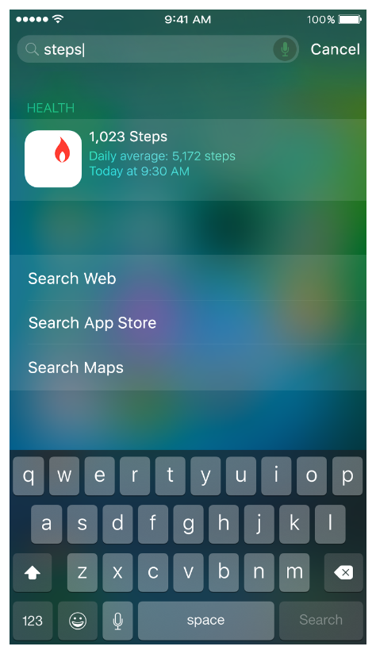

> 导航：[总目录](../../../README.md) · [documentation](../../../_indexes/documentation.md)

## Search Drives User Engagement

Search in iOS 9 and later gives people great ways to access information inside of your app, even when it isn’t installed. When you make your content searchable, users can access activities and content deep within your app through Spotlight and Safari search results, Handoff, Siri Suggestions, and Reminders. Making your content searchable helps you enhance the user experience of your app and improve its discoverability.

App search is easy for you to adopt and customize. You don’t need any prior experience with implementing search, and you control what content gets indexed, which information to show in search results, and where the user goes after tapping a result related to your content.

### Two Indexes Help Protect User Privacy

Privacy is a fundamental feature of search in iOS. To give users the best search experience while protecting their private data, there are two indexes that can store searchable items related to your content. You use the various search-related APIs to specify the appropriate index for each item, so it’s important to understand how each index works.

iOS provides the following indexes:

- __A private on-device index.__ Each device contains a private index whose information is never shared with Apple or synced between devices. When you make an item available in a user’s on-device index, only that user can view the item in search results.
- __Apple’s server-side index.__ The server-side index stores only publicly available data that you’ve marked appropriately on your website.

### Search Consists of Several Technologies

To give users the best search experience and increase engagement with your app, you use a combination of different APIs and technologies. Before you begin, evaluate your content to determine where content is stored and who should be able to access information about it. Based on your investigation, choose the APIs and technologies you should adopt. For some examples of adopting search in different types of apps, see [Example Implementations](Choosing.md#apple-f4xwc4dqnrsv64tfmyxwi33df52wszbpkridimbqge3dgmbyfvbuqmznknltc).

iOS includes several APIs that help you make your content available in the appropriate index.

- Methods and properties in the [NSUserActivity](https://developer.apple.com/documentation/foundation/nsuseractivity) class help you index items as users perform activities in your app, such as visiting a navigation point or creating and viewing content.
- The Core Spotlight framework provides APIs that help you add app-specific content to the on-device index and enable deep links into your app.
- Web markup lets you make your related web content searchable and helps you enrich the user’s search experience.

> [!NOTE]
> 

It’s recommended that all apps use [NSUserActivity](https://developer.apple.com/documentation/foundation/nsuseractivity) and that they support Handoff. Using the search-related properties of `NSUserActivity` is the best way to show users the information they care about and to improve the ranking of your search results. As users perform activities in your app, you use `NSUserActivity` to add the item to the on-device index. By default, an item represented by an `NSUserActivity` object is private, which means that it is added to the on-device index. If your content includes activities that all users can view, you identify them as eligible for public indexing. Learn more about using `NSUserActivity` in [Index Activities and Navigation Points](Activities.md#apple-f4xwc4dqnrsv64tfmyxwi33df52wszbpkridimbqge3dgmbyfvbuqnrnknltc).

If your app handles persistent user data, such as documents, photos, and other types of content created by or on behalf of users, use the Core Spotlight APIs to index the content. Unlike [NSUserActivity](https://developer.apple.com/documentation/foundation/nsuseractivity), Core Spotlight does not require users to visit the content in order to index it. In addition, you can use CoreSpotlight APIs to index content at any point, such as when the app loads. Note that Core Spotlight helps you make items searchable in the private on-device index; you don’t use Core Spotlight APIs to make items publicly searchable. Learn more about using Core Spotlight APIs in [Index App Content](AppContent.md#apple-f4xwc4dqnrsv64tfmyxwi33df52wszbpkridimbqge3dgmbyfvbuqnznknltc).

If your app hosts some or all of its content on a website, use web markup to let Apple’s web crawler (called _Applebot_) index your content in Apple’s server-side index and make it available to all iOS users in Spotlight and Safari search results. Learn more about using web markup to make your web content searchable in [Mark Up Web Content](WebContent.md#apple-f4xwc4dqnrsv64tfmyxwi33df52wszbpkridimbqge3dgmbyfvbuqobnknltc). Note that search results generated by web markup are shown in countries that are supported by Spotlight Suggestions.

Regardless of the APIs you use to make content searchable, you can also let users take actions directly from a search result, such as making a phone call and getting directions to a location. Users can get the actions you enable in views such as these:

Make a phone call

Get directions to a location

In addition to using the APIs of [NSUserActivity](https://developer.apple.com/documentation/foundation/nsuseractivity) and Core Spotlight and adding web markup, there are three key technologies you should use to give users the best experience.

- __Universal links.__ Use universal links to replace custom URL schemes with standard HTTP or HTTPS links. Universal links work for all users: If users have your app installed, the link takes them directly into your app; if they don’t have your app installed, the link opens your website in Safari. To learn how to use universal links, see [Support Universal Links](UniversalLinks.md#apple-f4xwc4dqnrsv64tfmyxwi33df52wszbpkridimbqge3dgmbyfvbuqmjsfvjvomi).
- __Smart App Banners.__ When users visit your website in Safari, a Smart App Banner lets them open your app (if it’s installed) or get the opportunity to download your app (if it’s not installed). To learn more about Smart App Banners, see [Promoting Apps with Smart App Banners](https://developer.apple.com/library/archive/documentation/AppleApplications/Reference/SafariWebContent/PromotingAppswithAppBanners/PromotingAppswithAppBanners.html#//apple_ref/doc/uid/TP40002051-CH6) in _[Safari Web Content Guide](../../Apple%20Applications/Safari%20Web%20Content%20Guide/Developing%20Web%20Content%20for%20Safari.md#apple-f4xwc4dqnrsv64tfmyxwi33df52wszbpkridimbqgazdanjr)_.
- __Handoff.__ Handoff lets users continue an activity from one device to another. For example, when browsing a website on their Mac, they can jump straight to your native app on their iPad. In iOS 9 and later, Handoff includes specific support for app search. To learn more about supporting Handoff, see _[Handoff Programming Guide](../../User%20Experience/Handoff%20Programming%20Guide/About%20Handoff.md#apple-f4xwc4dqnrsv64tfmyxwi33df52wszbpkridimbqge2dgmzy)_.

### Several Factors Determine the Ranking of Search Results

Adopting the search-related APIs appropriately can improve the relevancy and ranking of the search results related to your content. To give users the best search experience, the system measures how often users interact with app content and with Spotlight and Safari results. Because iOS measures the level of user engagement with search results, items that users don’t find useful are quickly identified and can eventually stop showing up in results.

iOS determines relevancy and ranking using information such as:

- The frequency with which users view your content (which is captured only through the use of [NSUserActivity](https://developer.apple.com/documentation/foundation/nsuseractivity))
- The amount of engagement users have with your content, demonstrated when users tap a search result or find the information useful
- In the case of marked-up web content, the popularity of a URL and the amount of structured data available

At a high level, you can provide great search results and encourage people to use your app by doing the following things:

- Create an app with compelling content.
- Improve the relevance of your search results by adopting the search-related APIs just described.
- As much as possible, index only the items that users are most likely to search for.
- Keep the indexes up to date by removing and updating items when necessary.
- Encourage users to engage with an indexed item by providing relevant, rich information about it.
- Minimize the time between tapping on a search result and viewing the content in your app.

To learn about ways to improve the user’s search experience, see [Combine APIs to Increase Coverage](CombiningAPIs.md#apple-f4xwc4dqnrsv64tfmyxwi33df52wszbpkridimbqge3dgmbyfvbuqmjqfvjvomi) and [Improve the Ranking of Your Results](SearchUserExperience.md#apple-f4xwc4dqnrsv64tfmyxwi33df52wszbpkridimbqge3dgmbyfvbuqmjrfvjvomi).

[Example Implementations](Choosing.md#apple-f4xwc4dqnrsv64tfmyxwi33df52wszbpkridimbqge3dgmbyfvbuqmznknltc)
