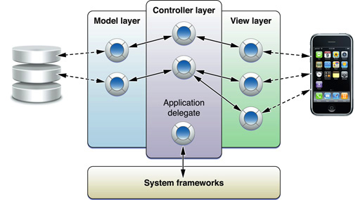

> 导航：[总目录](../../../README.md) · [documentation](../../../_indexes/documentation.md)

[Next](Class%20Clusters.md)

# About the Basic Programming Concepts for Cocoa and Cocoa Touch

Many of the programmatic interfaces of the Cocoa and Cocoa Touch frameworks only make sense only if you are aware of the concepts on which they are based. These concepts express the rationale for many of the core designs of the frameworks. Knowledge of these concepts will illuminate your software-development practices.

This document contains articles that explain central concepts, design patterns, and mechanisms of the Cocoa and Cocoa Touch frameworks. The articles are arranged in alphabetical order.

If you read this document cover-to-cover, you learn important information about Cocoa and Cocoa Touch application development. However, most readers come to the articles in this document in one of two ways:

- Other documents—especially those that are intended for novice iOS and OS X developers—which link to these articles.
- In-line mini-articles (which appear when you click a dash-underlined word or phrase) that have a link to an article as a “Definitive Discussion.”

Prior programming experience, especially with object-oriented languages, is recommended.

_[Programming with Objective-C](../../Cocoa/Programming%20with%20Objective-C/About%20Objective-C.md#apple-f4xwc4dqnrsv64tfmyxwi33df52wszbpkridimbqgeytemjq)_ offers further discussion of many of the language-related concepts covered in this document.

[Next](Class%20Clusters.md)

