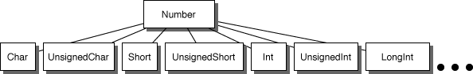

> 导航：[总目录](../../../README.md) · [documentation](../../../_indexes/documentation.md) · [Concepts in Objective-C Programming](About%20the%20Basic%20Programming%20Concepts%20for%20Cocoa%20and%20Cocoa%20Touch.md)


[Next](Class%20Factory%20Methods.md)[Previous](About%20the%20Basic%20Programming%20Concepts%20for%20Cocoa%20and%20Cocoa%20Touch.md)

# Class Clusters

Class clusters are a design pattern that the Foundation framework makes extensive use of. Class clusters group a number of private concrete subclasses under a public abstract superclass. The grouping of classes in this way simplifies the publicly visible architecture of an object-oriented framework without reducing its functional richness. Class clusters are based on the Abstract Factory design pattern.

To illustrate the class cluster architecture and its benefits, consider the problem of constructing a class hierarchy that defines objects to store numbers of different types (`char`, `int`, `float`, `double`). Because numbers of different types have many features in common (they can be converted from one type to another and can be represented as strings, for example), they could be represented by a single class. However, their storage requirements differ, so it’s inefficient to represent them all by the same class. Taking this fact into consideration, one could design the class architecture depicted in Figure 1-1 to solve the problem.

__Figure 1-1__  A simple hierarchy for number classes


`Number` is the abstract superclass that declares in its methods the operations common to its subclasses. However, it doesn’t declare an instance variable to store a number. The subclasses declare such instance variables and share in the programmatic interface declared by `Number`.

So far, this design is relatively simple. However, if the commonly used modifications of these basic C types are taken into account, the class hierarchy diagram looks more like Figure 1-2.

__Figure 1-2__  A more complete number class hierarchy



The simple concept—creating a class to hold number values—can easily burgeon to over a dozen classes. The class cluster architecture presents a design that reflects the simplicity of the concept.

Applying the class cluster design pattern to this problem yields the class hierarchy in Figure 1-3 (private classes are in gray).

__Figure 1-3__  Class cluster architecture applied to number classes


Users of this hierarchy see only one public class, `Number`, so how is it possible to allocate instances of the proper subclass? The answer is in the way the abstract superclass handles instantiation.

The abstract superclass in a class cluster must declare methods for creating instances of its private subclasses. It’s the superclass’s responsibility to dispense an object of the proper subclass based on the creation method that you invoke—you don’t, and can’t, choose the class of the instance.

In the Foundation framework, you generally create an object by invoking a `+`_className_`...` method or the `alloc...` and `init...` methods. Taking the Foundation framework’s [NSNumber](https://developer.apple.com/library/archive/documentation/LegacyTechnologies/WebObjects/WebObjects_3.5/Reference/Frameworks/ObjC/Foundation/Classes/NSNumber/Description.html#//apple_ref/occ/cl/NSNumber) class as an example, you could send these messages to create number objects:

```
NSNumber *aChar = [NSNumber numberWithChar:’a’];
NSNumber *anInt = [NSNumber numberWithInt:1];
NSNumber *aFloat = [NSNumber numberWithFloat:1.0];
NSNumber *aDouble = [NSNumber numberWithDouble:1.0];
```

You are not responsible for releasing the objects returned from factory methods. Many classes also provide the standard `alloc...` and `init...` methods to create objects that require you to manage their deallocation.

Each object returned—`aChar`, `anInt`, `aFloat`, and `aDouble`—may belong to a different private subclass (and in fact does). Although each object’s class membership is hidden, its interface is public, being the interface declared by the abstract superclass, `NSNumber`. Although it is not precisely correct, it’s convenient to consider the `aChar`, `anInt`, `aFloat`, and `aDouble` objects to be instances of the `NSNumber` class, because they’re created by `NSNumber` class methods and accessed through instance methods declared by `NSNumber`.

In the example above, one abstract public class declares the interface for multiple private subclasses. This is a class cluster in the purest sense. It’s also possible, and often desirable, to have two (or possibly more) abstract public classes that declare the interface for the cluster. This is evident in the Foundation framework, which includes the clusters listed in Table 1-1.

__Table 1-1__  Class clusters and their public superclasses

| Class cluster | Public superclasses |
| `NSData` | [NSData](https://developer.apple.com/library/archive/documentation/LegacyTechnologies/WebObjects/WebObjects_3.5/Reference/Frameworks/ObjC/Foundation/Classes/NSDataClassCluster/Description.html#//apple_ref/occ/cl/NSData) |
| `NSData` | [NSMutableData](https://developer.apple.com/library/archive/documentation/LegacyTechnologies/WebObjects/WebObjects_3.5/Reference/Frameworks/ObjC/Foundation/Classes/NSDataClassCluster/Description.html#//apple_ref/occ/cl/NSMutableData) |
| `NSArray` | [NSArray](https://developer.apple.com/library/archive/documentation/LegacyTechnologies/WebObjects/WebObjects_3.5/Reference/Frameworks/ObjC/Foundation/Classes/NSArrayClassCluster/Description.html#//apple_ref/occ/cl/NSArray) |
| `NSArray` | [NSMutableArray](https://developer.apple.com/library/archive/documentation/LegacyTechnologies/WebObjects/WebObjects_3.5/Reference/Frameworks/ObjC/Foundation/Classes/NSArrayClassCluster/Description.html#//apple_ref/occ/cl/NSMutableArray) |
| `NSDictionary` | [NSDictionary](https://developer.apple.com/library/archive/documentation/LegacyTechnologies/WebObjects/WebObjects_3.5/Reference/Frameworks/ObjC/Foundation/Classes/NSDictionaryClassClstr/Description.html#//apple_ref/occ/cl/NSDictionary) |
| `NSDictionary` | [NSMutableDictionary](https://developer.apple.com/library/archive/documentation/LegacyTechnologies/WebObjects/WebObjects_3.5/Reference/Frameworks/ObjC/Foundation/Classes/NSDictionaryClassClstr/Description.html#//apple_ref/occ/cl/NSMutableDictionary) |
| `NSString` | [NSString](https://developer.apple.com/library/archive/documentation/LegacyTechnologies/WebObjects/WebObjects_3.5/Reference/Frameworks/ObjC/Foundation/Classes/NSStringClassCluster/Description.html#//apple_ref/occ/cl/NSString) |
| `NSString` | [NSMutableString](https://developer.apple.com/library/archive/documentation/LegacyTechnologies/WebObjects/WebObjects_3.5/Reference/Frameworks/ObjC/Foundation/Classes/NSStringClassCluster/Description.html#//apple_ref/occ/cl/NSMutableString) |

Other clusters of this type also exist, but these clearly illustrate how two abstract nodes cooperate in declaring the programmatic interface to a class cluster. In each of these clusters, one public node declares methods that all cluster objects can respond to, and the other node declares methods that are only appropriate for cluster objects that allow their contents to be modified.

This factoring of the cluster’s interface helps make an object-oriented framework’s programmatic interface more expressive. For example, imagine an object representing a book that declares this method:

```objc
- (NSString *)title;
```

The book object could return its own instance variable or create a new string object and return that—it doesn’t matter. It’s clear from this declaration that the returned string can’t be modified. Any attempt to modify the returned object will elicit a compiler warning.

The class cluster architecture involves a trade-off between simplicity and extensibility: Having a few public classes stand in for a multitude of private ones makes it easier to learn and use the classes in a framework but somewhat harder to create subclasses within any of the clusters. However, if it’s rarely necessary to create a subclass, then the cluster architecture is clearly beneficial. Clusters are used in the Foundation framework in just these situations.

If you find that a cluster doesn’t provide the functionality your program needs, then a subclass may be in order. For example, imagine that you want to create an array object whose storage is file-based rather than memory-based, as in the `NSArray` class cluster. Because you are changing the underlying storage mechanism of the class, you’d have to create a subclass.

On the other hand, in some cases it might be sufficient (and easier) to define a class that embeds within it an object from the cluster. Let’s say that your program needs to be alerted whenever some data is modified. In this case, creating a simple class that wraps a data object that the Foundation framework defines may be the best approach. An object of this class could intervene in messages that modify the data, intercepting the messages, acting on them, and then forwarding them to the embedded data object.

In summary, if you need to manage your object’s storage, create a true subclass. Otherwise, create a composite object, one that embeds a standard Foundation framework object in an object of your own design. The following sections give more detail on these two approaches.

A new class that you create within a class cluster must:

- Be a subclass of the cluster’s abstract superclass
- Declare its own storage
- Override all initializer methods of the superclass
- Override the superclass’s primitive methods (described below)

Because the cluster’s abstract superclass is the only publicly visible node in the cluster’s hierarchy, the first point is obvious. This implies that the new subclass will inherit the cluster’s interface but no instance variables, because the abstract superclass declares none. Thus the second point: The subclass must declare any instance variables it needs. Finally, the subclass must override any method it inherits that directly accesses an object’s instance variables. Such methods are called _primitive methods_.

A class’s primitive methods form the basis for its interface. For example, take the `NSArray` class, which declares the interface to objects that manage arrays of objects. In concept, an array stores a number of data items, each of which is accessible by index. `NSArray` expresses this abstract notion through its two primitive methods, `count` and `objectAtIndex:`. With these methods as a base, other methods—_derived methods_—can be implemented; Table 1-2 gives two examples of derived methods.

__Table 1-2__  Derived methods and their possible implementations

| Derived Method | Possible Implementation |
| `lastObject` | Find the last object by sending the array object this message: `[self objectAtIndex: ([self count] –1)]`. |
| `containsObject:` | Find an object by repeatedly sending the array object an `objectAtIndex:` message, each time incrementing the index until all objects in the array have been tested. |

The division of an interface between primitive and derived methods makes creating subclasses easier. Your subclass must override inherited primitives, but having done so can be sure that all derived methods that it inherits will operate properly.

The primitive-derived distinction applies to the interface of a fully initialized object. The question of how `init...` methods should be handled in a subclass also needs to be addressed.

In general, a cluster’s abstract superclass declares a number of `init...` and `+ className` methods. As described in [Creating Instances](#apple-f4xwc4dqnrsv64tfmyxwi33df52wszbpkridimbqgeydqmjqfvbuqnbnknltcoa), the abstract class decides which concrete subclass to instantiate based your choice of `init...` or `+ className` method. You can consider that the abstract class declares these methods for the convenience of the subclass. Since the abstract class has no instance variables, it has no need of initialization methods.

Your subclass should declare its own `init...` (if it needs to initialize its instance variables) and possibly `+ className` methods. It should not rely on any of those that it inherits. To maintain its link in the initialization chain, it should invoke its superclass’s designated initializer within its own designated initializer method. It should also override all other inherited initializer methods and implement them to behave in a reasonable manner. (See [Multiple Initializers and the Designated Initializer](Object%20Initialization.md#apple-f4xwc4dqnrsv64tfmyxwi33df52wszbpkridimbqgeydqmjqfvbuqnrnknltg) for a discussion of designated initializers.) Within a class cluster, the designated initializer of the abstract superclass is always `init`.

Let’s say that you want to create a subclass of `NSArray`, named `MonthArray`, that returns the name of a month given its index position. However, a `MonthArray` object won’t actually store the array of month names as an instance variable. Instead, the method that returns a name given an index position (`objectAtIndex:`) will return constant strings. Thus, only twelve string objects will be allocated, no matter how many `MonthArray` objects exist in an application.

The `MonthArray` class is declared as:

```objc
#import <foundation/foundation.h>
@interface MonthArray : NSArray
{
}

+ monthArray;
- (unsigned)count;
- (id)objectAtIndex:(unsigned)index;

@end
```

Note that the `MonthArray` class doesn’t declare an `init...` method because it has no instance variables to initialize. The `count` and `objectAtIndex:` methods simply cover the inherited primitive methods, as described above.

The implementation of the `MonthArray` class looks like this:

```objc
#import "MonthArray.h"

@implementation MonthArray

static MonthArray *sharedMonthArray = nil;
static NSString *months[] = { @"January", @"February", @"March",
    @"April", @"May", @"June", @"July", @"August", @"September",
    @"October", @"November", @"December" };

+ monthArray
{
    if (!sharedMonthArray) {
        sharedMonthArray = [[MonthArray alloc] init];
    }
    return sharedMonthArray;
}

- (unsigned)count
{
 return 12;
}

- objectAtIndex:(unsigned)index
{
    if (index >= [self count])
        [NSException raise:NSRangeException format:@"***%s: index
            (%d) beyond bounds (%d)", sel_getName(_cmd), index,
            [self count] - 1];
    else
        return months[index];
}

@end
```

Because `MonthArray` overrides the inherited primitive methods, the derived methods that it inherits will work properly without being overridden. `NSArray`’s `lastObject`, `containsObject:`, `sortedArrayUsingSelector:`, `objectEnumerator`, and other methods work without problems for `MonthArray` objects.

By embedding a private cluster object in an object of your own design, you create a composite object. This composite object can rely on the cluster object for its basic functionality, only intercepting messages that the composite object wants to handle in some particular way. This architecture reduces the amount of code you must write and lets you take advantage of the tested code provided by the Foundation Framework. Figure 1-4 depicts this architecture.

__Figure 1-4__  An object that embeds a cluster object


The composite object must declare itself to be a subclass of the cluster’s abstract superclass. As a subclass, it must override the superclass’s primitive methods. It can also override derived methods, but this isn’t necessary because the derived methods work through the primitive ones.

The `count` method of the `NSArray` class is an example; the intervening object’s implementation of a method it overrides can be as simple as:

```objc
- (unsigned)count {
    return [embeddedObject count];
}
```

However, your object could put code for its own purposes in the implementation of any method it overrides.

To illustrate the use of a composite object, imagine you want a mutable array object that tests changes against some validation criteria before allowing any modification to the array’s contents. The example that follows describes a class called `ValidatingArray`, which contains a standard mutable array object. `ValidatingArray` overrides all of the primitive methods declared in its superclasses, `NSArray` and `NSMutableArray`. It also declares the `array`, `validatingArray`, and `init` methods, which can be used to create and initialize an instance:

```objc
#import <foundation/foundation.h>

@interface ValidatingArray : NSMutableArray
{
    NSMutableArray *embeddedArray;
}

+ validatingArray;
- init;
- (unsigned)count;
- objectAtIndex:(unsigned)index;
- (void)addObject:object;
- (void)replaceObjectAtIndex:(unsigned)index withObject:object;
- (void)removeLastObject;
- (void)insertObject:object atIndex:(unsigned)index;
- (void)removeObjectAtIndex:(unsigned)index;

@end
```

The implementation file shows how, in an `init` method of the `ValidatingArray`class , the embedded object is created and assigned to the _embeddedArray_ variable. Messages that simply access the array but don’t modify its contents are relayed to the embedded object. Messages that could change the contents are scrutinized (here in pseudocode) and relayed only if they pass the hypothetical validation test.

```objc
#import "ValidatingArray.h"

@implementation ValidatingArray

- init
{
    self = [super init];
    if (self) {
        embeddedArray = [[NSMutableArray allocWithZone:[self zone]] init];
    }
    return self;
}

+ validatingArray
{
    return [[[self alloc] init] autorelease];
}

- (unsigned)count
{
    return [embeddedArray count];
}

- objectAtIndex:(unsigned)index
{
    return [embeddedArray objectAtIndex:index];
}

- (void)addObject:object
{
    if (/* modification is valid */) {
        [embeddedArray addObject:object];
    }
}

- (void)replaceObjectAtIndex:(unsigned)index withObject:object;
{
    if (/* modification is valid */) {
        [embeddedArray replaceObjectAtIndex:index withObject:object];
    }
}

- (void)removeLastObject;
{
    if (/* modification is valid */) {
        [embeddedArray removeLastObject];
    }
}
- (void)insertObject:object atIndex:(unsigned)index;
{
    if (/* modification is valid */) {
        [embeddedArray insertObject:object atIndex:index];
    }
}
- (void)removeObjectAtIndex:(unsigned)index;
{
    if (/* modification is valid */) {
        [embeddedArray removeObjectAtIndex:index];
    }
}
```

[Next](Class%20Factory%20Methods.md)[Previous](About%20the%20Basic%20Programming%20Concepts%20for%20Cocoa%20and%20Cocoa%20Touch.md)

