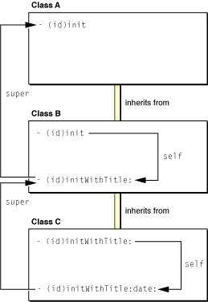

> 导航：[总目录](../../../README.md) · [documentation](../../../_indexes/documentation.md) · [Concepts in Objective-C Programming](About%20the%20Basic%20Programming%20Concepts%20for%20Cocoa%20and%20Cocoa%20Touch.md)


[Next](Model-View-Controller.md)[Previous](Object%20Allocation.md)

# Object Initialization

Initialization sets the instance variables of an object to reasonable and useful initial values. It can also allocate and prepare other global resources needed by the object, loading them if necessary from an external source such as a file. Every object that declares instance variables should implement an initializing method—unless the default set-everything-to-zero initialization is sufficient. If an object does not implement an initializer, Cocoa invokes the initializer of the nearest ancestor instead.

`NSObject` declares the [init](https://developer.apple.com/library/archive/documentation/LegacyTechnologies/WebObjects/WebObjects_3.5/Reference/Frameworks/ObjC/Foundation/Classes/NSObject/Description.html#//apple_ref/occ/instm/NSObject/init) prototype for initializers; it is an instance method typed to return an object of type `id`. Overriding `init` is fine for subclasses that require no additional data to initialize their objects. But often initialization depends on external data to set an object to a reasonable initial state. For example, say you have an `Account` class; to initialize an `Account` object appropriately requires a unique account number, and this must be supplied to the initializer. Thus initializers can take one or more parameters; the only requirement is that the initializing method begins with the letters “init”. (The stylistic convention `init...` is sometimes used to refer to initializers.)

Cocoa has plenty of examples of initializers with parameters. Here are a few (with the defining class in parentheses):

- `- (id)initWithArray:(NSArray *)array;` (from `NSSet`)
- `- (id)initWithTimeInterval:(NSTimeInterval)secsToBeAdded sinceDate:(NSDate *)anotherDate;` (from `NSDate`)
- `- (id)initWithContentRect:(NSRect)contentRect styleMask:(unsigned int)aStyle backing:(NSBackingStoreType)bufferingType defer:(BOOL)flag;` (from `NSWindow`)
- `- (id)initWithFrame:(NSRect)frameRect;` (from `NSControl` and `NSView`)

These initializers are instance methods that begin with “init” and return an object of the dynamic type `id`. Other than that, they follow the Cocoa conventions for multiparameter methods, often using `With`_Type_`:` or `From`_Source_`:` before the first and most important parameter.

Although `init...` methods are required by their method signature to return an object, that object is not necessarily the one that was most recently allocated—the receiver of the `init...` message. In other words, the object you get back from an initializer might not be the one you thought was being initialized.

Two conditions prompt the return of something other than the just-allocated object. The first involves two related situations: when there must be a singleton instance or when the defining attribute of an object must be unique. Some Cocoa classes—[NSWorkspace](https://developer.apple.com/documentation/appkit/nsworkspace), for instance—allow only one instance in a program; a class in such a case must ensure (in an initializer or, more likely, in a class factory method) that only one instance is created, returning this instance if there is any further request for a new one.

A similar situation arises when an object is required to have an attribute that makes it unique. Recall the hypothetical `Account` class mentioned earlier. An account of any sort must have a unique identifier. If the initializer for this class—say, `initWithAccountID:`—is passed an identifier that has already been associated with an object, it must do two things:

- Release the newly allocated object (in memory-managed code)
- Return the `Account` object previously initialized with this unique identifier

By doing this, the initializer ensures the uniqueness of the identifier while providing what was asked for: an `Account` instance with the requested identifier.

Sometimes an `init...` method cannot perform the initialization requested. For example, an `initFromFile:` method expects to initialize an object from the contents of a file, the path to which is passed as a parameter. But if no file exists at that location, the object cannot be initialized. A similar problem happens if an `initWithArray:` initializer is passed an [NSDictionary](https://developer.apple.com/library/archive/documentation/LegacyTechnologies/WebObjects/WebObjects_3.5/Reference/Frameworks/ObjC/Foundation/Classes/NSDictionaryClassClstr/Description.html#//apple_ref/occ/cl/NSDictionary) object instead of an [NSArray](https://developer.apple.com/library/archive/documentation/LegacyTechnologies/WebObjects/WebObjects_3.5/Reference/Frameworks/ObjC/Foundation/Classes/NSArrayClassCluster/Description.html#//apple_ref/occ/cl/NSArray) object. When an `init...` method cannot initialize an object, it should:

- Release the newly allocated object (in memory-managed code)
- Return `nil`

Returning `nil` from an initializer indicates that the requested object cannot be created. When you create an object, you should generally check whether the returned value is `nil` before proceeding:

```
id anObject = [[MyClass alloc] init];
if (anObject) {
    [anObject doSomething];
    // more messages...
} else {
    // handle error
}
```

Because an `init...` method might return `nil` or an object other than the one explicitly allocated, it is dangerous to use the instance returned by `alloc` or `allocWithZone:` instead of the one returned by the initializer. Consider the following code:

```
id myObject = [MyClass alloc];
[myObject init];
[myObject doSomething];
```

The `init` method in this example could have returned `nil` or could have substituted a different object. Because you can send a message to `nil` without raising an exception, nothing would happen in the former case except (perhaps) a debugging headache. But you should always rely on the initialized instance instead of the “raw” just-allocated one. Therefore, you should nest the allocation message inside the initialization message and test the object returned from the initializer before proceeding.

```
id myObject = [[MyClass alloc] init];
if ( myObject ) {
    [myObject doSomething];
} else {
    // error recovery...
}
```

Once an object is initialized, you should not initialize it again. If you attempt a reinitialization, the framework class of the instantiated object often raises an exception. For example, the second initialization in this example would result in [NSInvalidArgumentException](https://developer.apple.com/library/archive/documentation/LegacyTechnologies/WebObjects/WebObjects_3.5/Reference/Frameworks/ObjC/Foundation/TypesAndConstants/FoundationTypesConstants/Description.html#//apple_ref/c/data/NSInvalidArgumentException) being raised.

```
NSString *aStr = [[NSString alloc] initWithString:@"Foo"];
aStr = [aStr initWithString:@"Bar"];
```


There are several critical rules to follow when implementing an `init...` method that serves as a class’s sole initializer or, if there are multiple initializers, its _designated initializer_ (described in [Multiple Initializers and the Designated Initializer](#apple-f4xwc4dqnrsv64tfmyxwi33df52wszbpkridimbqgeydqmjqfvbuqnrnknltg)):

- Always invoke the superclass (`super`) initializer _first_.
- Check the object returned by the superclass. If it is `nil`, then initialization cannot proceed; return `nil` to the receiver.
- When initializing instance variables that are references to objects, retain or copy the object as necessary (in memory-managed code).
- After setting instance variables to valid initial values, return `self` unless:

  - It was necessary to return a substituted object, in which case release the freshly allocated object first (in memory-managed code).
  - A problem prevented initialization from succeeding, in which case return `nil`.

```objc
- (id)initWithAccountID:(NSString *)identifier {
    if ( self = [super init] ) {
        Account *ac = [accountDictionary objectForKey:identifier];
        if (ac) { // object with that ID already exists
            [self release];
            return [ac retain];
        }
        if (identifier) {
            accountID = [identifier copy]; // accountID is instance variable
            [accountDictionary setObject:self forKey:identifier];
            return self;
        } else {
            [self release];
            return nil;
        }
    } else
        return nil;
}
```

It isn’t necessary to initialize all instance variables of an object explicitly, just those that are necessary to make the object functional. The default set-to-zero initialization performed on an instance variable during allocation is often sufficient. Make sure that you retain or copy instance variables, as required for memory management.

The requirement to invoke the superclass’s initializer as the first action is important. Recall that an object encapsulates not only the instance variables defined by its class but the instance variables defined by all of its ancestor classes. By invoking the initializer of `super` first, you help to ensure that the instance variables defined by classes up the inheritance chain are initialized first. The immediate superclass, in its initializer, invokes the initializer of its superclass, which invokes the main `init...` method of its superclass, and so on (see Figure 6-1). The proper order of initialization is critical because the later initializations of subclasses may depend on superclass-defined instance variables being initialized to reasonable values.

__Figure 6-1__  Initialization up the inheritance chain


Inherited initializers are a concern when you create a subclass. Sometimes a superclass `init...` method sufficiently initializes instances of your class. But because it is more likely it won’t, you should override the superclass’s initializer. If you don’t, the superclass’s implementation is invoked, and because the superclass knows nothing about your class, your instances may not be correctly initialized.

A class can define more than one initializer. Sometimes multiple initializers let clients of the class provide the input for the same initialization in different forms. The [NSSet](https://developer.apple.com/library/archive/documentation/LegacyTechnologies/WebObjects/WebObjects_3.5/Reference/Frameworks/ObjC/Foundation/Classes/NSSetClassCluster/Description.html#//apple_ref/occ/cl/NSSet) class, for example, offers clients several initializers that accept the same data in different forms; one takes an [NSArray](https://developer.apple.com/library/archive/documentation/LegacyTechnologies/WebObjects/WebObjects_3.5/Reference/Frameworks/ObjC/Foundation/Classes/NSArrayClassCluster/Description.html#//apple_ref/occ/cl/NSArray) object, another a counted list of elements, and another a `nil`-terminated list of elements:

```objc
- (id)initWithArray:(NSArray *)array;
- (id)initWithObjects:(id *)objects count:(unsigned)count;
- (id)initWithObjects:(id)firstObj, ...;
```

Some subclasses provide convenience initializers that supply default values to an initializer that takes the full complement of initialization parameters. This initializer is usually the designated initializer, the most important initializer of a class. For example, assume there is a `Task` class and it declares a designated initializer with this signature:

```objc
- (id)initWithTitle:(NSString *)aTitle date:(NSDate *)aDate;
```

The `Task` class might include secondary, or convenience, initializers that simply invoke the designated initializer, passing it default values for those parameters the secondary initializer doesn’t explicitly request. This example shows a designated initializer and a secondary initializer.

```objc
- (id)initWithTitle:(NSString *)aTitle {
    return [self initWithTitle:aTitle date:[NSDate date]];
}

- (id)init {
    return [self initWithTitle:@”Task”];
}
```

The designated initializer plays an important role for a class. It ensures that inherited instance variables are initialized by invoking the designated initializer of the superclass. It is typically the `init...` method that has the most parameters and that does most of the initialization work, and it is the initializer that secondary initializers of the class invoke with messages to `self`.

When you define a subclass, you must be able to identify the designated initializer of the superclass and invoke it in your subclass’s designated initializer through a message to `super`. You must also make sure that inherited initializers are covered in some way. And you may provide as many convenience initializers as you deem necessary. When designing the initializers of your class, keep in mind that designated initializers are chained to each other through messages to `super`; whereas other initializers are chained to the designated initializer of their class through messages to `self`.

An example will make this clearer. Let’s say there are three classes, A, B, and C; class B inherits from class A, and class C inherits from class B. Each subclass adds an attribute as an instance variable and implements an `init...` method—the designated initializer—to initialize this instance variable. They also define secondary initializers and ensure that inherited initializers are overridden, if necessary. Figure 6-2 illustrates the initializers of all three classes and their relationships.

__Figure 6-2__  Interactions of secondary and designated initializers



The designated initializer for each class is the initializer with the most coverage; it is the method that initializes the attribute added by the subclass. The designated initializer is also the `init...` method that invokes the designated initializer of the superclass in a message to `super`. In this example, the designated initializer of class C, `initWithTitle:date:`, invokes the designated initializer of its superclass, `initWithTitle:`, which in turn invokes the `init` method of class A. When creating a subclass, it’s always important to know the designated initializer of the superclass.

Although designated initializers are thus connected up the inheritance chain through messages to `super`, secondary initializers are connected to their class’s designated initializer through messages to `self`. Secondary initializers (as in this example) are frequently overridden versions of inherited initializers. Class C overrides `initWithTitle:` to invoke its designated initializer, passing it a default date. This designated initializer, in turn, invokes the designated initializer of class B, which is the overridden method, `initWithTitle:`. If you sent an `initWithTitle:` message to objects of class B and class C, you’d be invoking different method implementations. On the other hand, if class C did _not_ override `initWithTitle:` and you sent the message to an instance of class C, the class B implementation would be invoked. Consequently, the C instance would be incompletely initialized (since it would lack a date). When creating a subclass, it’s important to make sure that all inherited initializers are adequately covered.

Sometimes the designated initializer of a superclass may be sufficient for the subclass, and so there is no need for the subclass to implement its own designated initializer. Other times, a class’s designated initializer may be an overridden version of its superclass's designated initializer. This is frequently the case when the subclass needs to supplement the work performed by the superclass’s designated initializer, even though the subclass does not add any instance variables of its own (or the instance variables it does add don’t require explicit initialization).

[Next](Model-View-Controller.md)[Previous](Object%20Allocation.md)

