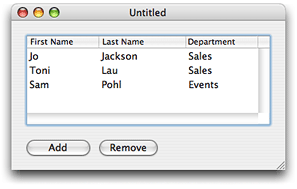

> 导航：[总目录](../../../README.md) · [documentation](../../../_indexes/documentation.md) · [Concepts in Objective-C Programming](About%20the%20Basic%20Programming%20Concepts%20for%20Cocoa%20and%20Cocoa%20Touch.md)

[Next](Object%20Mutability.md)[Previous](Model-View-Controller.md)

# Object Modeling

This section defines terms and presents examples of object modeling and key-value coding that are specific to Cocoa bindings and the Core Data framework. Understanding terms such as key paths is fundamental to using these technologies effectively. This section is recommended reading if you are new to object-oriented design or key-value coding.

When using the Core Data framework, you need a way to describe your model objects that does not depend on views and controllers. In a good reusable design, views and controllers need a way to access model properties without imposing dependencies between them. The Core Data framework solves this problem by borrowing concepts and terms from database technology—specifically, the entity-relationship model.

Entity-relationship modeling is a way of representing objects typically used to describe a data source’s data structures in a way that allows those data structures to be mapped to objects in an object-oriented system. Note that entity-relationship modeling isn’t unique to Cocoa; it’s a popular discipline with a set of rules and terms that are documented in database literature. It is a representation that facilitates storage and retrieval of objects in a data source. A data source can be a database, a file, a web service, or any other persistent store. Because it is not dependent on any type of data source it can also be used to represent any kind of object and its relationship to other objects.

In the entity-relationship model, the objects that hold data are called _entities_, the components of an entity are called _attributes_, and the references to other data-bearing objects are called _relationships_. Together, attributes and relationships are known as _properties_. With these three simple components (entities, attributes, and relationships), you can model systems of any complexity.

Cocoa uses a modified version of the traditional rules of entity-relationship modeling referred to in this document as _object modeling_. Object modeling is particularly useful in representing model objects in the Model-View-Controller (MVC) design pattern. This is not surprising because even in a simple Cocoa application, models are typically persistent—that is, they are stored in a data container such as a file.

Entities are model objects. In the MVC design pattern, model objects are the objects in your application that encapsulate specified data and provide methods that operate on that data. They are usually persistent but more importantly, model objects are not dependent on how the data is displayed to the user.

For example, a structured collection of model objects (an object model) can be used to represent a company’s customer base, a library of books, or a network of computers. A library book has attributes—such as the book title, ISBN number, and copyright date—and relationships to other objects—such as the author and library member. In theory, if the parts of a system can be identified, the system can be expressed as an object model.

Figure 8-1 shows an example object model used in an employee management application. In this model, Department models a department and Employee models an employee.

__Figure 8-1__  Employee management application object diagram

Attributes represent structures that contain data. An attribute of an object may be a simple value, such as a scalar (for example, an `integer`, `float`, or `double` value), but can also be a C structure (for example an array of `char` values or an [NSPoint](https://developer.apple.com/library/archive/documentation/LegacyTechnologies/WebObjects/WebObjects_3.5/Reference/Frameworks/ObjC/Foundation/TypesAndConstants/FoundationTypesConstants/Description.html#//apple_ref/c/tdef/NSPoint) structure) or an instance of a primitive class (such as, [NSNumber](https://developer.apple.com/library/archive/documentation/LegacyTechnologies/WebObjects/WebObjects_3.5/Reference/Frameworks/ObjC/Foundation/Classes/NSNumber/Description.html#//apple_ref/occ/cl/NSNumber), [NSData](https://developer.apple.com/library/archive/documentation/LegacyTechnologies/WebObjects/WebObjects_3.5/Reference/Frameworks/ObjC/Foundation/Classes/NSDataClassCluster/Description.html#//apple_ref/occ/cl/NSData), or [NSColor](https://developer.apple.com/documentation/appkit/nscolor) in Cocoa). Immutable objects such as `NSColor` are usually considered attributes too. (Note that Core Data natively supports only a specific set of attribute types, as described in _[NSAttributeDescription Class Reference](https://developer.apple.com/documentation/coredata/nsattributedescription)_. You can, however, use additional attribute types, as described in Non-Standard Persistent Attributes in _[Core Data Programming Guide](https://developer.apple.com/library/archive/documentation/Cocoa/Conceptual/CoreData/index.html#//apple_ref/doc/uid/TP40001075)_.)

In Cocoa, an attribute typically corresponds to a model’s instance variable or accessor method. For example, Employee has `firstName`, `lastName`, and `salary` instance variables. In an employee management application, you might implement a table view to display a collection of Employee objects and some of their attributes, as shown in Figure 8-2. Each row in the table corresponds to an instance of Employee, and each column corresponds to an attribute of Employee.

__Figure 8-2__  Employees table view

Not all properties of a model are attributes—some properties are relationships to other objects. Your application is typically modeled by multiple classes. At runtime, your object model is a collection of related objects that make up an object graph. These are typically the persistent objects that your users create and save to some data container or file before terminating the application (as in a document-based application). The relationships between these model objects can be traversed at runtime to access the properties of the related objects.

For example, in the employee management application, there are relationships between an employee and the department in which the employee works, and between an employee and the employee’s manager. Because a manager is also an employee, the employee–manager relationship is an example of a reflexive relationship—a relationship from an entity to itself.

Relationships are inherently bidirectional, so conceptually at least there are also relationships between a department and the employees that work in the department, and an employee and the employee’s direct reports. [Figure 8-3](#apple-f4xwc4dqnrsv64tfmyxwi33df52wszbpkridimbqgeydqmjqfvbuqmjvfuytmmbtge3c2q2kijdekskeiq) illustrates the relationships between a Department and an Employee entity, and the Employee reflexive relationship. In this example, the Department entity’s “employees” relationship is the inverse of the Employee entity’s “department” relationship. It is possible, however, for relationships to be navigable in only one direction—for there to be no inverse relationship. If, for example, you are never interested in finding out from a department object what employees are associated with it, then you do not have to model that relationship. (Note that although this is true in the general case, Core Data may impose additional constraints over general Cocoa object modeling—not modeling the inverse should be considered an extremely advanced option.)

__Figure 8-3__  Relationships in the employee management application

Every relationship has a _cardinality_; the cardinality tells you how many destination objects can (potentially) resolve the relationship. If the destination object is a single object, then the relationship is called a _to-one relationship_. If there may be more than one object in the destination, then the relationship is called a _to-many relationship_.

Relationships can be mandatory or optional. A mandatory relationship is one where the destination is required—for example, every employee must be associated with a department. An optional relationship is, as the name suggests, optional—for example, not every employee has direct reports. So the `directReports` relationship depicted in [Figure 8-4](#apple-f4xwc4dqnrsv64tfmyxwi33df52wszbpkridimbqgeydqmjqfvbuqmjvfuytmmbugazc2q2kijfemqkfiy) is optional.

It is also possible to specify a range for the cardinality. An optional to-one relationship has a range 0-1. An employee may have any number of direct reports, or a range that specifies a minimum and a maximum, for example, 0-15, which also illustrates an optional to-many relationship.

Figure 8-4 illustrates the cardinalities in the employee management application. The relationship between an Employee object and a Department object is a mandatory to-one relationship—an employee must belong to one, and only one, department. The relationship between a Department and its Employee objects is an optional to-many relationship (represented by a “\*”). The relationship between an employee and a manager is an optional to-one relationship (denoted by the range 0-1)—top-ranking employees do not have managers.

__Figure 8-4__  Relationship cardinality

Note also that destination objects of relationships are sometimes owned and sometimes shared.

In order for models, views, and controllers to be independent of each other, you need to be able to access properties in a way that is independent of a model’s implementation. This is accomplished by using key-value pairs.

You specify properties of a model using a simple key, often a string. The corresponding view or controller uses the key to look up the corresponding attribute value. This design enforces the notion that the attribute itself doesn’t necessarily contain the data—the value can be indirectly obtained or derived.

Key-value coding is used to perform this lookup; it is a mechanism for accessing an object’s properties indirectly and, in certain contexts, automatically. Key-value coding works by using the names of the object’s properties—typically its instance variables or accessor methods—as keys to access the values of those properties.

For example, you might obtain the name of a Department object using a `name` key. If the Department object either has an instance variable or a method called `name` then a value for the key can be returned (if it doesn’t have either, an error is returned). Similarly, you might obtain Employee attributes using the `firstName`, `lastName`, and `salary` keys.

All values for a particular attribute of a given entity are of the same data type. The data type of an attribute is specified in the declaration of its corresponding instance variable or in the return value of its accessor method. For example, the data type of the Department object `name` attribute may be an `NSString` object in Objective-C.

Note that key-value coding returns only object values. If the return type or the data type for the specific accessor method or instance variable used to supply the value for a specified key is not an object, then an `NSNumber` or `NSValue` object is created for that value and returned in its place. If the `name` attribute of Department is of type `NSString`, then, using key-value coding, the value returned for the `name` key of a Department object is an `NSString` object. If the `budget` attribute of Department is of type `float`, then, using key-value coding, the value returned for the `budget` key of a Department object is an `NSNumber` object.

Similarly, when you set a value using key-value coding, if the data type required by the appropriate accessor or instance variable for the specified key is not an object, then the value is extracted from the passed object using the appropriate `-`_type_`Value` method.

The value of a to-one relationship is simply the destination object of that relationship. For example, the value of the `department` property of an Employee object is a Department object. The value of a to-many relationship is the collection object. The collection can be a set or an array. If you use Core Data it is a set; otherwise, it is typically an array) that contains the destination objects of that relationship. For example, the value of the `employees` property of an Department object is a collection containing Employee objects. Figure 8-5 shows an example object graph for the employee management application.

__Figure 8-5__  Object graph for the employee management application

A _key path_ is a string of dot-separated keys that specify a sequence of object properties to traverse. The property of the first key is determined by, and each subsequent key is evaluated relative to, the previous property. Key paths allow you to specify the properties of related objects in a way that is independent of the model implementation. Using key paths you can specify the path through an object graph, of whatever depth, to a specific attribute of a related object.

The key-value coding mechanism implements the lookup of a value given a key path similar to key-value pairs. For example, in the employee-management application you might access the name of a Department via an Employee object using the `department.name` key path where `department` is a relationship of Employee and `name` is an attribute of Department. Key paths are useful if you want to display an attribute of a destination entity. For example, the employee table view in Figure 8-6 is configured to display the name of the employee’s department object, not the department object itself. Using Cocoa bindings, the value of the Department column is bound to `department.name` of the Employee objects in the displayed array.

__Figure 8-6__  Employees table view showing department name

Not every relationship in a key path necessarily has a value. For example, the `manager` relationship can be `nil` if the employee is the CEO. In this case, the key-value coding mechanism does not break—it simply stops traversing the path and returns an appropriate value, such as `nil.`

[Next](Object%20Mutability.md)[Previous](Model-View-Controller.md)

