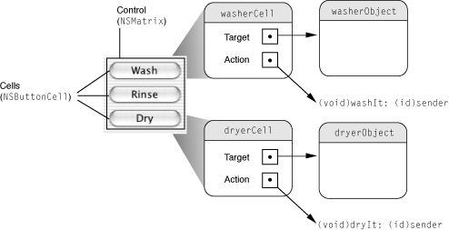

> 导航：[总目录](../../../README.md) · [documentation](../../../_indexes/documentation.md) · [Concepts in Objective-C Programming](About%20the%20Basic%20Programming%20Concepts%20for%20Cocoa%20and%20Cocoa%20Touch.md)


[Next](Toll-Free%20Bridging.md)[Previous](Receptionist%20Pattern.md)

# Target-Action

Although delegation, bindings, and notification are useful for handling certain forms of communication between objects in a program, they are not particularly suitable for the most visible sort of communication. A typical application’s user interface consists of a number of graphical objects, and perhaps the most common of these objects are controls. A control is a graphical analog of a real-world or logical device (button, slider, checkboxes, and so on); as with a real-world control, such as a radio tuner, you use it to convey your intent to some system of which it is a part—that is, an application.

The role of a control on a user interface is simple: It interprets the intent of the user and instructs some other object to carry out that request. When a user acts on the control by, say, clicking it or pressing the Return key, the hardware device generates a raw event. The control accepts the event (as appropriately packaged for Cocoa) and translates it into an instruction that is specific to the application. However, events by themselves don't give much information about the user's intent; they merely tell you that the user clicked a mouse button or pressed a key. So some mechanism must be called upon to provide the translation between event and instruction. This mechanism is called _target-action_.

Cocoa uses the target-action mechanism for communication between a control and another object. This mechanism allows the control and, in OS X its cell or cells, to encapsulate the information necessary to send an application-specific instruction to the appropriate object. The receiving object—typically an instance of a custom class—is called the _target_. The _action_ is the message that the control sends to the target. The object that is interested in the user event—the target—is the one that imparts significance to it, and this significance is usually reflected in the name it gives to the action.

A target is a receiver of an action message. A control or, more frequently, its cell holds the target of its action message as an outlet (see [Outlets](Outlets.md#apple-f4xwc4dqnrsv64tfmyxwi33df52wszbpkridimbqgeydqmjqfvbuqmjqfvjvomi)). The target usually is an instance of one of your custom classes, although it can be any Cocoa object whose class implements the appropriate action method.

You can also set a cell’s or control’s target outlet to `nil` and let the target object be determined at runtime. When the target is `nil`, the application object ([NSApplication](https://developer.apple.com/documentation/appkit/nsapplication) or [UIApplication](https://developer.apple.com/documentation/uikit/uiapplication)) searches for an appropriate receiver in a prescribed order:

1. It begins with the first responder in the key window and follows [nextResponder](https://developer.apple.com/documentation/appkit/nsresponder/1528245-nextresponder) links up the responder chain to the window object’s ([NSWindow](https://developer.apple.com/documentation/appkit/nswindow) or [UIWindow](https://developer.apple.com/documentation/uikit/uiwindow)) content view.
2. It tries the window object and then the window object’s delegate.
3. If the main window is different from the key window, it then starts over with the first responder in the main window and works its way up the main window’s responder chain to the window object and its delegate.
4. Next, the application object tries to respond. If it can’t respond, it tries its delegate. The application object and its delegate are the receivers of last resort.

Control objects do not (and should not) retain their targets. However, clients of controls sending action messages (applications, usually) are responsible for ensuring that their targets are available to receive action messages. To do this, they may have to retain their targets in memory-managed environments. This precaution applies equally to delegates and data sources.

An action is the message a control sends to the target or, from the perspective of the target, the method the target implements to respond to the action message. A control or—as is frequently the case in AppKit—a control’s cell stores an action as an instance variable of type `SEL`. `SEL` is an Objective-C data type used to specify the signature of a message. An action message must have a simple, distinct signature. The method it invokes returns nothing and usually has a sole parameter of type `id`. This parameter, by convention, is named `sender`. Here is an example from the [NSResponder](https://developer.apple.com/documentation/appkit/nsresponder) class, which defines a number of action methods:

```objc
- (void)capitalizeWord:(id)sender;
```

Action methods declared by some Cocoa classes can also have the equivalent signature:

```objc
- (IBAction) deleteRecord:(id)sender;
```

In this case, `IBAction` does not designate a data type for a return value; no value is returned. `IBAction` is a type qualifier that Interface Builder notices during application development to synchronize actions added programmatically with its internal list of action methods defined for a project.

The `sender`parameter usually identifies the control sending the action message (although it can be another object substituted by the actual sender). The idea behind this is similar to a return address on a postcard. The target can query the sender for more information if it needs to. If the actual sending object substitutes another object as sender, you should treat that object in the same way. For example, say you have a text field and when the user enters text, the action method `nameEntered:` is invoked in the target:

```objc
- (void)nameEntered:(id) sender {
    NSString *name = [sender stringValue];
    if (![name isEqualToString:@""]) {
        NSMutableArray *names = [self nameList];
        [names addObject:name];
        [sender setStringValue:@""];
    }
}
```

Here the responding method extracts the contents of the text field, adds the string to an array cached as an instance variable, and clears the field. Other possible queries to the sender would be asking an `NSMatrix` object for its selected row (`[sender selectedRow]`), asking an `NSButton` object for its state (`[sender state]`), and asking any cell associated with a control for its tag (`[[sender cell] tag]`), a tag being a numeric identifier.

The AppKit framework uses specific architectures and conventions in implementing target-action.

Most controls in AppKit are objects that inherit from the [NSControl](https://developer.apple.com/documentation/appkit/nscontrol) class. Although a control has the initial responsibility for sending an action message to its target, it rarely carries the information needed to send the message. For this, it usually relies on its cell or cells.

A control almost always has one or more cells—objects that inherit from [NSCell](https://developer.apple.com/documentation/appkit/nscell)—associated with it. Why is there this association? A control is a relatively “heavy” object because it inherits all the combined instance variables of its ancestors, which include the [NSView](https://developer.apple.com/documentation/appkit/nsview) and [NSResponder](https://developer.apple.com/documentation/appkit/nsresponder) classes. Because controls are expensive, cells are used to subdivide the screen real estate of a control into various functional areas. Cells are lightweight objects that can be thought of as overlaying all or part of the control. But it's not only a division of area, it's a division of labor. Cells do some of the drawing that controls would otherwise have to do, and cells hold some of the data that controls would otherwise have to carry. Two items of this data are the instance variables for target and action. [Figure 12-1](#apple-f4xwc4dqnrsv64tfmyxwi33df52wszbpkridimbqgeydqmjqfvbuqmjsfvjvomq) depicts the control-cell architecture.

Being abstract classes, `NSControl` and `NSCell` both incompletely handle the setting of the target and action instance variables. By default, `NSControl` simply sets the information in its associated cell, if one exists. (`NSControl` itself supports only a one-to-one mapping between itself and a cell; subclasses of `NSControl` such as [NSMatrix](https://developer.apple.com/documentation/appkit/nsmatrix) support multiple cells.) In its default implementation, `NSCell` simply raises an exception. You must go one step further down the inheritance chain to find the class that really implements the setting of target and action: [NSActionCell](https://developer.apple.com/documentation/appkit/nsactioncell).

Objects derived from `NSActionCell` provide target and action values to their controls so the controls can compose and send an action message to the proper receiver. An `NSActionCell` object handles mouse (cursor) tracking by highlighting its area and assisting its control in sending action messages to the specified target. In most cases, the responsibility for an `NSControl` object’s appearance and behavior is completely given over to a corresponding `NSActionCell` object. (`NSMatrix`, and its subclass [NSForm](https://developer.apple.com/documentation/appkit/nsform), are subclasses of `NSControl` that don’t follow this rule.)

__Figure 12-1__  How the target-action mechanism works in the control-cell architecture



When users choose an item from a menu, an action is sent to a target. Yet menus ([NSMenu](https://developer.apple.com/documentation/appkit/nsmenu) objects) and their items ([NSMenuItem](https://developer.apple.com/documentation/appkit/nsmenuitem) objects) are completely separate, in an architectural sense, from controls and cells. The `NSMenuItem` class implements the target-action mechanism for its own instances; an `NSMenuItem` object has both target and action instance variables (and related accessor methods) and sends the action message to the target when a user chooses it.

You can set the targets and actions of cells and controls programmatically or by using Interface Builder. For most developers and most situations, Interface Builder is the preferred approach. When you use it to set controls and targets, Interface Builder provides visual confirmation, allows you to lock the connections, and archives the connections to a nib file. The procedure is simple:

1. Declare an action method in the header file of your custom class that has the `IBAction` qualifier.
2. In Interface Builder, [connect the control sending the message to the action method of the target](http://help.apple.com/xcode/mac/current/#/dev9662c7670).

If the action is handled by a superclass of your custom class or by an off-the-shelf AppKit or UIKit class, you can make the connection without declaring any action method. Of course, if you declare an action method yourself, you must be sure to implement it.

To set the action and the target programmatically, use the following methods to send messages to a control or cell object:

```objc
- (void)setTarget:(id)anObject;
- (void)setAction:(SEL)aSelector;
```

The following example shows how you might use these methods:

```
[aCell setTarget:myController];
[aControl setAction:@selector(deleteRecord:)];
[aMenuItem setAction:@selector(showGuides:)];
```

Programmatically setting the target and action does have its advantages and in certain situations it is the only possible approach. For example, you might want the target or action to vary according to some runtime condition, such as whether a network connection exists or whether an inspector window has been loaded. Another example is when you are dynamically populating the items of a pop-up menu, and you want each pop-up item to have its own action.

The AppKit framework not only includes many `NSActionCell`-based controls for sending action messages, it defines action methods in many of its classes. Some of these actions are connected to default targets when you create a Cocoa application project. For example, the Quit command in the application menu is connected to the [terminate:](https://developer.apple.com/documentation/appkit/nsapplication/1428417-terminate) method in the global application object (`NSApp`).

The `NSResponder` class also defines many default action messages (also known as _standard commands_) for common operations on text. This allows the Cocoa text system to send these action messages up an application’s responder chain—a hierarchical sequence of event-handling objects—where it can be handled by the first [NSView](https://developer.apple.com/documentation/appkit/nsview), `NSWindow`, or `NSApplication` object that implements the corresponding method.

The UIKit framework also declares and implements a suite of control classes; the control classes in this framework inherit from the [UIControl](https://developer.apple.com/documentation/uikit/uicontrol) class, which defines most of the target-action mechanism for iOS. However there are some fundamental differences in how the AppKit and UIKit frameworks implement target-action. One of these differences is that UIKit does not have any true cell classes. Controls in UIKit do not rely upon their cells for target and action information.

A larger difference in how the two frameworks implement target-action lies in the nature of the event model. In the AppKit framework, the user typically uses a mouse and keyboard to register events for handling by the system. These events—such as clicking on a button—are limited and discrete. Consequently, a control object in AppKit usually recognizes a single physical event as the trigger for the action it sends to its target. (In the case of buttons, this is a mouse-up event.) In iOS, the user’s fingers are what originate events instead of mouse clicks, mouse drags, or physical keystrokes. There can be more than one finger touching an object on the screen at one time, and these touches can even be going in different directions.

To account for this multitouch event model, UIKit declares a set of control-event constants in `UIControl.h` that specify various physical gestures that users can make on controls, such as lifting a finger from a control, dragging a finger into a control, and touching down within a text field. You can configure a control object so that it responds to one or more of these touch events by sending an action message to a target. Many of the control classes in UIKit are implemented to generate certain control events; for example, instances of the [UISlider](https://developer.apple.com/documentation/uikit/uislider) class generate a [UIControlEventValueChanged](https://developer.apple.com/documentation/uikit/uicontrol/event/1618238-valuechanged) control event, which you can use to send an action message to a target object.

You set up a control so that it sends an action message to a target object by associating both target and action with one or more control events. To do this, send [addTarget:action:forControlEvents:](https://developer.apple.com/documentation/uikit/uicontrol/1618259-addtarget) to the control for each target-action pair you want to specify. When the user touches the control in a designated fashion, the control forwards the action message to the global `UIApplication` object in a [sendAction:to:from:forEvent:](https://developer.apple.com/documentation/uikit/uiapplication/1622946-sendaction) message. As in AppKit, the global application object is the centralized dispatch point for action messages. If the control specifies a `nil` target for an action message, the application queries objects in the responder chain until it finds one that is willing to handle the action message—that is, one implementing a method corresponding to the action selector.

In contrast to the AppKit framework, where an action method may have only one or perhaps two valid signatures, the UIKit framework allows three different forms of action selector:

- `- (void)action`
- `- (void)action:(id)sender`
- `- (void)action:(id)sender forEvent:(UIEvent *)event`

To learn more about the target-action mechanism in UIKit, read _[UIControl Class Reference](https://developer.apple.com/documentation/uikit/uicontrol)_.

[Next](Toll-Free%20Bridging.md)[Previous](Receptionist%20Pattern.md)

