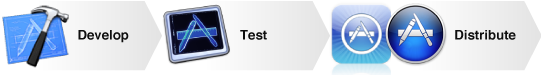

> 导航：[总目录](../../../README.md) · [documentation](../../../_indexes/documentation.md)

[Next](Building%20an%20App%20for%20the%20App%20Store.md)

# About the Application Development Process

There has never been a better time to create apps for iOS and OS X. Apple provides tools that make development easy and straightforward. This document presents a high-level view of the stages in developing an app, from creating a team to responding to feedback from users.

This document walks you through the process of developing apps for the App Store. By the time you finish reading this document, you should be ready to organize your development team and devise a plan to design, code, and publish an app on the App Store.

### Developing for Apple’s Platforms Is a Mix of Administrative and Coding Tasks

Most of the time spent developing your app is spent on coding tasks, but throughout the development process, there are also a number of administrative tasks you must perform. This mix of tasks can be handled by a single developer, or the work can be divided between different people on a development team.

Most administrative tasks appear at the start and the end of a development project. For example, when you develop your first app, one person must sign an agreement with Apple to become an Apple developer. This person, known as the _team agent_, bears the legal responsibility for the team, adds people to the team and defines each person’s responsibilities and privileges.

### Apps Published on the App Store Must Be Approved by Apple

The App Store is a curated store and restricts what apps may be sold on the App Store. Apple takes these precautions to provide the best experience possible for our users. For example, apps that are sold on the App Store must not crash or exhibit other major bugs. A major part of the publishing process is to submit your app to Apple for approval.

### Apps Published on the App Store Must Be Cryptographically Signed

Code signing is used to provide a layer of security to users, your development team, and Apple. Signing an app makes it resistant to malicious tampering; if an attacker modifies the app, it can no longer be executed because the code signing has been broken. Code signing also provides a clear chain of responsibility if malicious code is included in a signed app. Although both iOS and OS X require code signing to publish an app on the App Store, iOS takes this security a step further; no apps can execute on an iOS device, even during development, unless they are signed.

When you organize a development team, the team agent (or a person that task is delegated to) decides which members of your team are permitted to sign your apps and creates the necessary code signing resources for those developers.

### The Majority of Your Coding Time Is Spent in Xcode

Xcode integrates coding, debugging, and user interface design in a single development environment. You use Xcode throughout the development process, even using it when you are ready to submit an app for approval. When you install Xcode, other apps are installed with Xcode that you can use to improve the quality of your apps. For example, the Instruments application provides many tools to record and analyze data about how an app acts while running. Using the data, you can formulate plans to ensure that your apps run correctly and efficiently.

### Administrative Tasks are Performed with Several Resources

When you manage a team, you use various resources to perform tasks. Here are the most frequently used resources:

- The Member Center website is primarily used by the team agent to invite members to join the development team and to configure their privilege levels.
- The iOS Provisioning Portal (or for OS X development, the Developer Certificate Utility app) is used to create the code signing resources for your team. A team admin (either the team agent or a member of the team this task has been delegated to) uses these tools to provide the necessary code signing resources to members of your team.
- The iTunes Connect website is used to manage information related to the business side of your app development, including sales and financial information, information displayed in the App Store for your app, and information stored on Apple’s servers for your apps. As with the Member Center, the team agent decides how much access each person on your team is permitted on iTunes Connect.

### Many Behaviors of an App Are Defined by Data, Not Code

In addition to the code you write, data you provide is used to define how the store displays your app as well as how your app executes. The data can even affect what the operating system displays about your app when it isn’t running.

Some data is contained in files stored alongside an executable; this combination of data and files is referred to as an _application bundle_. Other data is stored on Apple servers—for example, information displayed for your app on the App Store is primarily stored on iTunes Connect. Regardless of where the data is stored,keep in mind that an app is more than a simple executable; it exists in an ecosystem of code, data, and services.

Regardless of the role you play on a development team, you should read this document to get a better understanding of steps the team must follow to develop an app for the App Store.

If you are a programmer, some concepts described in this document will make more sense to you if you finish one of the following app tutorials before reading this document:

- iOS: _[Start Developing iOS Apps Today (Retired)](https://developer.apple.com/library/archive/referencelibrary/GettingStarted/RoadMapiOS-Legacy/index.html#//apple_ref/doc/uid/TP40011343)_
- OS X: _[Start Developing Mac Apps Today](https://developer.apple.com/library/archive/referencelibrary/GettingStarted/RoadMapOSX/index.html#//apple_ref/doc/uid/TP40012262)_

[Next](Building%20an%20App%20for%20the%20App%20Store.md)

