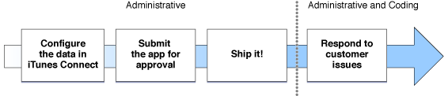

> 导航：[总目录](../../../README.md) · [documentation](../../../_indexes/documentation.md) · [Developing for the App Store](About%20the%20Application%20Development%20Process.md)

[Next](Document%20Revision%20History.md)[Previous](Developing%20an%20App.md)

# Publishing an App in the App Store

After the last bug is fixed, the app is ready to ship. Now you need to get it on the App Store.

When an app is sold in the App Store, the store displays a lot of information about the app, including its name, a description, an icon, screenshots and contact information for your company. To provide that information, you log into iTunes Connect, create a record for your app, and fill in these items. The record in iTunes Connect includes a field for a bundle ID; the value you place in this field must exactly match the bundle ID for your app.

Some Apple technologies, including Game Center and In-App Purchase, require that an iTunes Connect record be created earlier in the development process. For example, with In-App Purchase, you need to create the app record so that you can add the details of the items you want to sell. This content needs to be created before the development process is complete so that you can use it to test the code you added to implement In-App Purchase.

Near the end of your development time on your app, you started creating archives of your app. To recap, an archive includes a built version of your app and all of the associated debugging symbol information. When your team is ready to submit an app for approval, a team admin is going to perform two tasks on an archive you’ve created.

- Your team admin uses Xcode to validate the archive. Validating an archive performs an automated check against the app in the archive as well as the information you provided in your iTunes Connect record.
- Your team admin uses Xcode to submit the archive for app approval. Xcode transmits the archive to Apple, where it is examined to determine whether it conforms to the app guidelines. For example, apps that crash or do not perform the tasks described in your iTunes Connect record are rejected.

If your app is rejected, correct the problems that were brought up during app approval and resubmit it.

Use iTunes Connect to set a date when your app will be released to the App Store. For example, you can choose a date that immediately releases the app to the App Store after it is approved, or you can set a date sometime in the future. Using a later release date allows you to arrange other marketing activities around the launch of your app.

Your work isn’t quite done yet. You want to pay attention to how users perceive your app. Customer ratings and reviews on the App Store can have a big effect on the success of your app; if users run into problems, work quickly to determine the bug and submit a new version of your app through the approval process.

The iTunes Connect site provides data to help you determine how successful your app is, including sales and financial reports, customer reviews, and crash logs submitted to Apple by users. Crash logs are particularly important, because they represent significant problems users are seeing in your app. Your team should make investigating these reports a high priority. Here are the kinds of crash logs you might see:

- _Application crash:_ An application crash is generated when execution is halted due to bad memory access, an exception, or some other programming error.
- _Low memory:_  A low memory warning is generated when the app was killed by the system because there was not enough memory to satisfy the app’s demands.
- _User force-quit:_  A force-quit message is generated because your app became unresponsive and was quit by a user.
- _Watchdog timeout:_  A watchdog timeout is generated when an app takes too long to launch, terminate, or respond to system events.

Except for low memory crash logs, all crash logs contain stack traces for each thread at the time of termination. To view a crash log, you need to open it in the Xcode Organizer. As long as your development computer has the archive corresponding to the version of the app that generated the crash log, Xcode automatically resolves any addresses in the crash log with the actual classes and functions in your app; this process is known as _symbolication_. This process is described in more detail in the workflow guides.

While designing and implementing your app, and definitely before submitting it to the app approval process, you should read the [App Store Review Guidelines](https://developer.apple.com/appstore/resources/approval/guidelines.html).

If you are on an iOS team, these documents are your next steps to learn more about distributing your app:

- If you are a team admin, read _[iOS Team Administration Guide](../../Tools%20Languages/iOS%20Team%20Administration%20Guide/About%20iOS%20Development%20Team%20Administration.md#apple-f4xwc4dqnrsv64tfmyxwi33df52wszbpkridimbqgeytcnjz)_.
- If you are a team member, read _Tools Workflow Guide for iOS_.
- Read [iTunes Connect Development Guide](https://itunesconnect.apple.com/docs/iTunesConnect_DeveloperGuide.pdf) for a comprehensive look at iTunes Connect and the tasks you perform there.

If you are on an OS X team, these documents are your next steps to learn more about creating a team and setting up its signing certificates:

- If you are a team member or a team admin, read _Tools Workflow Guide for Mac_.
- Read [iTunes Connect Development Guide](https://itunesconnect.apple.com/docs/iTunesConnect_DeveloperGuide.pdf) for a comprehensive look at iTunes Connect and the tasks you perform there.

[Next](Document%20Revision%20History.md)[Previous](Developing%20an%20App.md)

