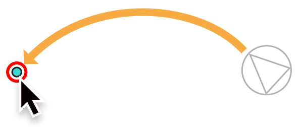
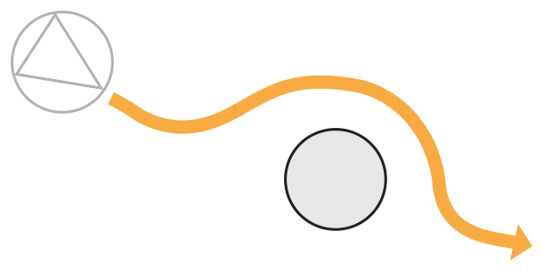
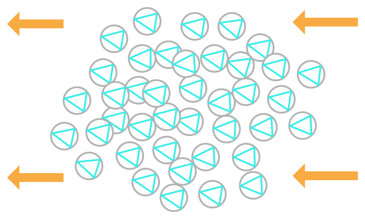
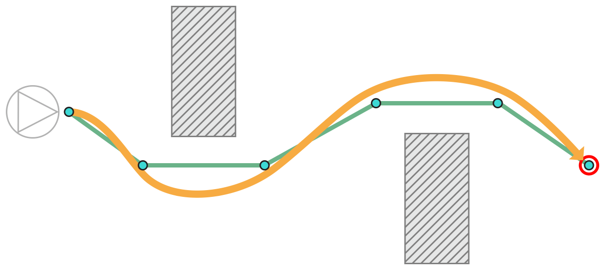

> 导航：[总目录](../../../README.md) · [documentation](../../../_indexes/documentation.md) · [GameplayKit Programming Guide](index.md)

## Agents, Goals, and Behaviors

In many kinds of games, entities move in real time and with some degree of autonomy. For example, a game might allow the player to tap or click to move a character to a desired location, and the character will automatically walk around obstacles to reach that location. Enemy characters might move to attack, planning to intercept the player character ahead of its current position. Ally characters might fly in formation with the player character, maintaining their distance from the player character and a parallel direction of flight. In all of these cases, each entity’s movement might also be constrained to realistic limits, so that the game characters still move and change direction realistically.

The Agent system in GameplayKit provides a way to efficiently implement autonomous movement. An _agent_ represents a game entity that moves in 2D space according to realistic constraints: its size, position, and velocity, and its resistance to changes in velocity. (Note that although an agent’s movement is based on a physical model, agents are not governed by SpriteKit or SceneKit physics simulations.) An agent’s behavior is determined by goals that motivate its movement.

A _goal_ represents a distinct motivation that can influence an agent’s movement over time. The following figures show some examples of goals:

__Figure 7-1__A Goal to Move Toward a Specific Location

__Figure 7-2__A Goal to Avoid Obstacles

__Figure 7-3__A Goal to Flock Together with Other Agents

__Figure 7-4__A Goal to Follow a Path Along a Sequence of Points

A _behavior_ ties together one or more goals to drive an agent’s movement. For example, a behavior might combine a goal that moves to a target point with a goal that avoids obstacles along the way. When you combine multiple goals in a behavior, you can assign a weight to each that determines its relative influence.

### Designing Your Game for Agents

The agent architecture in GameplayKit extends the Entity-Component architecture discussed in [Entities and Components](EntityComponent.md#apple-f4xwc4dqnrsv64tfmyxwi33df52wszbpkridimbqge2tcnzsfvbuqnrnknltc)—a [GKAgent](https://developer.apple.com/documentation/gameplaykit/gkagent) object is a component. After you design your game to use entities for each of the moving characters, you can create agent-based behaviors by simply adding a `GKAgent` component to each relevant entity and configuring it with a [GKBehavior](https://developer.apple.com/documentation/gameplaykit/gkbehavior) object that specifies a list of [GKGoal](https://developer.apple.com/documentation/gameplaykit/gkgoal) objects. As with any other component, you call the [updateWithDeltaTime:](https://developer.apple.com/documentation/gameplaykit/gkcomponent/1501218-update) method (directly, or through a [GKComponentSystem](https://developer.apple.com/documentation/gameplaykit/gkcomponentsystem) object that collects all the agents in your game) on each simulation step or animation frame in your game loop.

> [!NOTE]
> 

Each [GKGoal](https://developer.apple.com/documentation/gameplaykit/gkgoal) object represents a basic, reusable unit of behavior. When an agent’s [updateWithDeltaTime:](https://developer.apple.com/documentation/gameplaykit/gkcomponent/1501218-update) method is called, it evaluates each of the goals in its associated [GKBehavior](https://developer.apple.com/documentation/gameplaykit/gkbehavior) object, resulting in a vector that represents the change in the agent’s rotation and velocity needed to fulfill that goal—or rather, to move toward fulfilling that goal within the limits of the time delta and the agent’s maximum speed. The agent then combines those vectors, each scaled by a corresponding weight defined by the `GKBehavior` object, to get the combined adjustment that is then applied to the agent’s position, direction, and velocity. For the complete set of possible goals, see _[GKGoal Class Reference](https://developer.apple.com/documentation/gameplaykit/gkgoal)_.

A [GKGoal](https://developer.apple.com/documentation/gameplaykit/gkgoal) object can be reused in multiple behaviors. For example, two enemy agents might share the same goal of moving to intercept the player agent, but one of them might balance that goal with avoiding a third agent. Similarly, a [GKBehavior](https://developer.apple.com/documentation/gameplaykit/gkbehavior) object can be reused by multiple agents. For example, several enemy agents might share the same behavior of pursuing the player while avoiding obstacles, and each would independently move to fulfill that combination of goals regardless of its current state.

### Using Agents in Your Game

The AgentsCatalog sample code project includes several SpriteKit scenes that illustrate the basic use of agents with one or more goals.

> [!NOTE]
> 

For example, the Fleeing scene (found in the `FleeingScene` class) demonstrates how you might use agents and goals to make one game character follow the mouse or touch location while another character attempts to evade the first. This effect is created using three agents:

- A “tracking agent,” which has no onscreen representation, but whose position is always updated to match that of mouse click/drag events (OS X) or touch begin/move events (iOS) events, as shown below:

  1. `- (void)touchesMoved:(nonnull NSSet<UITouch *> *)touches withEvent:(nullable UIEvent *)event {`
  2. `UITouch *touch = [touches anyObject];`
  3. `CGPoint position = [touch locationInNode:self];`
  4. `self.trackingAgent.position = (vector_float2){position.x, position.y};`
  5. `}`
- A “player agent,” whose only goal is to seek the tracking agent’s current position:

  1. `self.seekGoal = [GKGoal goalToSeekAgent:self.trackingAgent];`
  2. `[self.player.agent.behavior setWeight:1 forGoal:self.seekGoal];`
- An “enemy agent,” whose only goal is to flee from the position of the player agent:

  1. `self.fleeGoal = [GKGoal goalToFleeAgent:self.player.agent];`
  2. `[self.enemy.agent.behavior setWeight:1 forGoal:self.fleeGoal];`

The SpriteKit scene’s [update:](https://developer.apple.com/documentation/spritekit/skscene/1519802-update) method calls the [updateWithDeltaTime:](https://developer.apple.com/documentation/gameplaykit/gkagent2d/1501242-update) method of each agent. Each agent then updates its position and velocity to meet its goals, and calls the [agentDidUpdate:](https://developer.apple.com/documentation/gameplaykit/gkagentdelegate/1501131-agentdidupdate) method, which in turn updates the position and rotation of the SpriteKit node that serves as the agent’s visual representation.

> [!NOTE]
> 

Examine other scenes in this sample code project for demonstrations of other kinds of agent behavior. For example, the `FlockingScene` class illustrates how to combine separation, alignment, and cohesion goals to cause a group of agents to move together.

### Agents and Pathfinding

GameplayKit contains two systems for helping you manage the movement of game characters: agents, discussed in this chapter, and pathfinding, discussed in the previous chapter (see [Pathfinding](Pathfinding.md#apple-f4xwc4dqnrsv64tfmyxwi33df52wszbpkridimbqge2tcnzsfvbuqmznknltc)). Each system manages movement in a different way. Pathfinding involves describing the game world on a large scale so that you can plan routes far ahead of time and in great detail, whereas the agent simulation looks at a narrow slice of time and space to react to dynamic situations during gameplay. Depending on the gameplay features you want to implement, one system or the other might be more appropriate, or you can combine the two.

One common pattern is to use pathfinding to plan a route for a game character, then use the agent simulation to make the character follow that route—possibly while also considering other goals. The [goalToFollowPath:maxPredictionTime:forward:](https://developer.apple.com/documentation/gameplaykit/gkgoal/1501095-goaltofollowpath) goal motivates an agent to move from point to point along the path described by a [GKPath](https://developer.apple.com/documentation/gameplaykit/gkpath) object, and the [initWithGraphNodes:radius:](https://developer.apple.com/documentation/gameplaykit/gkpath/1501138-init) initializer conveniently creates a [GKPath](https://developer.apple.com/documentation/gameplaykit/gkpath) object from the result of a pathfinding operation.

The DemoBots sample code project demonstrates this pattern. In order to use pathfinding, the game first creates a [GKObstacleGraph](https://developer.apple.com/documentation/gameplaykit/gkobstaclegraph) object representing the impassable areas of the game world, as shown in [Listing 6-3](Pathfinding.md#apple-f4xwc4dqnrsv64tfmyxwi33df52wszbpkridimbqge2tcnzsfvbuqmznknltm) in the previous chapter. Then, when an enemy robot character needs to chase another character, the game’s `TaskBotBehavior` class finds a path through the graph (shown in [Listing 6-4](Pathfinding.md#apple-f4xwc4dqnrsv64tfmyxwi33df52wszbpkridimbqge2tcnzsfvbuqmznknlto) in the previous chapter).

> [!NOTE]
> 

Pathfinding results in an array of graph nodes—the `addFollowAndStayOnPathGoalsForPath` method shown in Listing 7-1 creates [GKGoal](https://developer.apple.com/documentation/gameplaykit/gkgoal) objects from those nodes so that an agent can automatically follow the path.

__Listing 7-1__Using Pathfinding to Create a Goal

1. `private func addFollowAndStayOnPathGoalsForPath(path: GKPath) {`
2. `// The "follow path" goal tries to keep the agent facing in a forward direction when it is on this path.`
3. `setWeight(1.0, forGoal: GKGoal(toFollowPath: path, maxPredictionTime: GameplayConfiguration.TaskBot.maxPredictionTimeWhenFollowingPath, forward: true))`
5. `// The "stay on path" goal tries to keep the agent on the path within the path's radius.`
6. `setWeight(1.0, forGoal: GKGoal(toStayOnPath: path, maxPredictionTime: GameplayConfiguration.TaskBot.maxPredictionTimeWhenFollowingPath))`
7. `}`

> [!NOTE]
> 

In addition to the pathfinding behavior, the `TaskBotBehavior` class creates other goals and adds them to the agent representing an enemy robot:

- The `behaviorAndPathPointsForAgent` method adds separation, alignment, and coherence goals to make groups of robots move together as a unit without overlapping one another.
- The `addAvoidObstaclesGoalForScene` method adds a goal that keeps a robot from attempting to pass through the impassable areas of the level. This goal is necessary because an agent often does not follow a polygonal path precisely—its [maxAcceleration](https://developer.apple.com/documentation/gameplaykit/gkagent/1501224-maxacceleration), [maxSpeed](https://developer.apple.com/documentation/gameplaykit/gkagent/1501323-maxspeed), and other properties, as well its other goals, cause the agent to follow a natural-looking, smooth trajectory that roughly approximates the path. An avoid-obstacles goal influences the agent’s behavior to steer the approximate path away from any obstacles.

[Pathfinding](Pathfinding.md#apple-f4xwc4dqnrsv64tfmyxwi33df52wszbpkridimbqge2tcnzsfvbuqmznknltc)

[Rule Systems](RuleSystems.md#apple-f4xwc4dqnrsv64tfmyxwi33df52wszbpkridimbqge2tcnzsfvbuqmjqfvjvomi)
