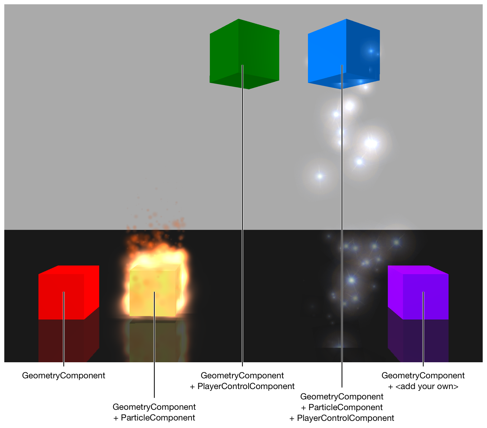
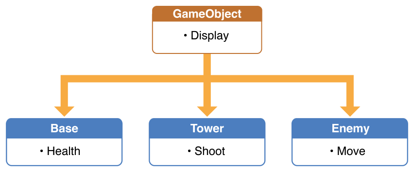
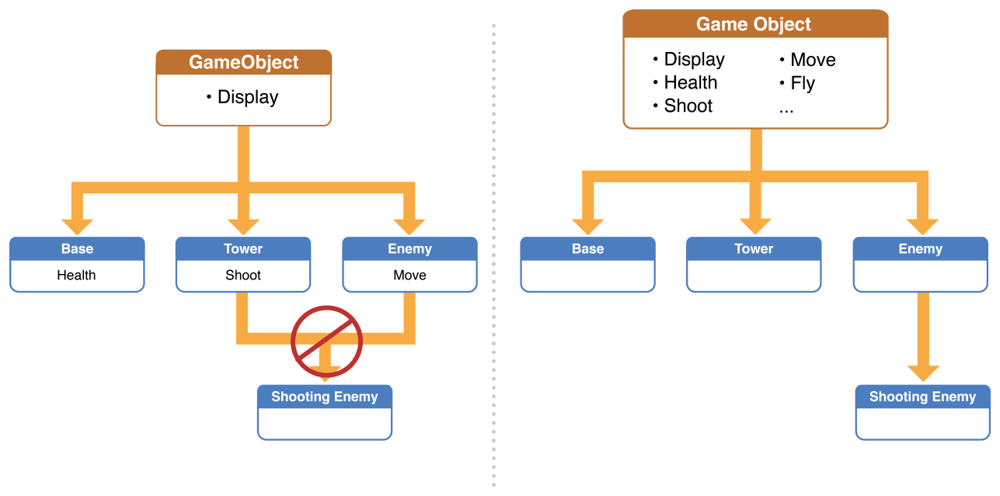
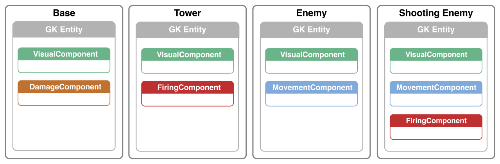

> 导航：[总目录](../../../README.md) · [documentation](../../../_indexes/documentation.md) · [GameplayKit Programming Guide](index.md)

## Entities and Components

As with any piece of software, designing a complex game requires planning a good architecture. Some of the design decisions that come naturally when building a simple game demo can become hindrances as your game becomes larger and richer with content. GameplayKit offers an architecture that helps you plan for better reusability from the start, separating the concerns that have to do with different aspects of your game.

In this architecture, an _entity_ is a general type for objects relevant to your game. Entities can represent objects that are crucial to gameplay, such as player and enemy characters, or objects that merely exist in the game world without interacting with the player, such as animated decorations in a level. Entities can even be conceptual or UI elements of your game, such as a system that decides when and where to add new enemy characters to a level or a system for managing equipment worn by the player character.

An entity gets its functionality by being a container for _components_. A component is an object that handles a specific, limited aspect of any entity’s appearance or behavior. Because a component’s scope of functionality is limited and not tied to a specific entity, you can reuse the same components across multiple entities.

### Example: Boxes

For a quick look at Entity-Component architecture, download the sample code project _[Boxes: GameplayKit Entity-Component Basics](../../../samplecode/Boxes-%20GameplayKit%20Entity-Component%20Basics/Boxes-%20GameplayKit%20Entity-Component%20Basics.md#apple-f4xwc4dqnrsv64tfmyxwi33df52wszbpkridimbqge3dinjz)_. Each box entity in the Boxes game is defined by a set of components, as shown in Figure 3-1. Individual components are unaware of each other and of the entity they belong to, so you can easily add new entities and new behaviors without complex interdependencies in your code.

__Figure 3-1__The Boxes Sample Code Project in Action

### Designing with Entities and Components

The Entity-Component design pattern is an architecture that favors composition over inheritance. To illustrate the difference between inheritance-based and composition-based architectures, consider how you might design an example “tower defense” style game, with the following features:

- The player has a “base” location on one side of the game field.
- Enemy characters periodically appear in waves at the other side of the game field, proceeding toward the base to attack it. If too many enemies reach the base, the game is over.
- To prevent enemies from attacking the base, the player places towers in the game field. These defensive turrets automatically fire at enemies.

This design is easy to model using inheritance-based design:

- A `Base` class could model the base, which has little to do other than maintain its display representation (such as an [SKSpriteNode](https://developer.apple.com/documentation/spritekit/skspritenode) object in a SpriteKit game) and keep track of how many enemy attacks it has sustained.
- An `Enemy` class could provide a display representation and logic to handle movement.
- A `Tower` class could provide a display representation and logic to handle targeting and firing at enemies.

All of these classes need to handle a visual representation, so that functionality can be implemented in a common `GameObject` superclass, resulting in a class hierarchy such as that shown in Figure 3-2.

__Figure 3-2__An Inheritance-Based Design for a Game

### Inheritance-Based Architecture Hinders Game Design Evolution

As you refine your game, you might choose to add more kinds of enemies and towers or add new capabilities to your game objects. For example, you might add enemies that fire back at the towers. However, this presents a problem—the new `ShootingEnemy` class can’t reuse the targeting and firing code from the `Tower` class because it doesn’t inherit from that class. To attempt to solve this problem, you might move that code into the `GameObject` class so that you can use it in both the `Tower` and `ShootingEnemy` classes.

__Figure 3-3__Problems Evolving An Inheritance-Based Design

However, if your game design continues evolve along these lines, eventually one root class holds nearly all of the functionality for each of its subclasses and each subclass provides little functionality of its own. This situation results in code that is complex and hard to maintain, as the root class implementation needs to check which subclass identity it’s using before it can do anything, and new features must be carefully fit in among the various conditional behaviors of the root class.

### Composition-Based Architecture Makes Evolving Game Design Easy

Instead of organizing a game’s object model in terms of what each game object _is_, the Entity-Component pattern encourages you to think about what each game object _does_. In this example, you can make components for each bit of functionality that might be expected of a base, an enemy, or a tower. One component might handle visual representations; another might handle targeting and firing; another might handle movement; still another might track how much damage has been sustained and update a UI element accordingly; and so on. Create a new subclass of [GKComponent](https://developer.apple.com/documentation/gameplaykit/gkcomponent) for each unique area of functionality.

Then, rather than creating classes for each kind of game object, use the [GKEntity](https://developer.apple.com/documentation/gameplaykit/gkentity) class as a generic container for components. For example (as shown in Figure 3-4), one `GKEntity` instance could represent a tower, so it contains visual and firing components. Another `GKEntity` instance could represent an enemy, so it contains visual and movement components. To add an enemy that can shoot, simply add both the movement and firing components to the same entity.

__Figure 3-4__Entity-Component Design Composes Functionality

### Building Games with Entities & Components

On its own, the Entity-Component design pattern is simply a way to organize your code. GameplayKit extends this pattern to incorporate another concept common to game development—periodic updates. Combining these concepts provides a useful architecture for building games.

### Driving a Game with Periodic Updates

Game engines (such as SpriteKit and SceneKit, but also including custom engines built directly using Metal or OpenGL) typically run gameplay-related code in a tight loop called an _update/render cycle_. In the update phase, a game updates all of its gameplay-related internal state, performing actions such as polling for controller input, simulating enemy character AI, scheduling animations to be played, and adjusting onscreen elements representing game characters and the user interface. In the render phase, the game engine handles automated features such as animation and physics, then draws the scene for display based on the current state. Often, game engines are designed so that the game programmer controls only the update logic, and the engine itself takes care of the render phase—this is the case for SceneKit and SpriteKit.

The [GKEntity](https://developer.apple.com/documentation/gameplaykit/gkentity) and [GKComponent](https://developer.apple.com/documentation/gameplaykit/gkcomponent) classes in GameplayKit make use of this notion. Each time your game’s update handler executes (for example, the [update:](https://developer.apple.com/documentation/spritekit/skscene/1519802-update) method in a SpriteKit scene or the [renderer:updateAtTime:](https://developer.apple.com/documentation/scenekit/scnscenerendererdelegate/1522937-renderer) method in a SceneKit renderer delegate), you can dispatch to the [updateWithDeltaTime:](https://developer.apple.com/documentation/gameplaykit/gkcomponent/1501218-update) methods of the components that provide your game logic. GameplayKit provides two ways to handle this dispatch:

- __Per-entity updates.__ In a game with few entities, you can iterate through the list of active entities in the game and call the [updateWithDeltaTime:](https://developer.apple.com/documentation/gameplaykit/gkentity/1501228-updatewithdeltatime) method of each. The [GKEntity](https://developer.apple.com/documentation/gameplaykit/gkentity) class then forwards the update message to each of its attached components.
- __Per-component updates.__ In a more complex game, it can be useful to ensure that all components used by all entities update in a strictly defined order, without needing to keep track of which entities have which components. In this case, you can create [GKComponentSystem](https://developer.apple.com/documentation/gameplaykit/gkcomponentsystem) objects, each of which manages all components of a specific class. Then, call the [updateWithDeltaTime:](https://developer.apple.com/documentation/gameplaykit/gkcomponentsystem/1501051-update) method for each component system in your game, and the component system forwards update messages to all components of its class, regardless of which entities those components are attached to. For details, see _[GKComponentSystem Class Reference](https://developer.apple.com/documentation/gameplaykit/gkcomponentsystem)_.

### An Example Game with Entity-Component Design

The Maze sample code project implements a variation on several classic arcade games. In this game, the player character must navigate a maze. However, four enemy characters chase the player, and contact with an enemy resets the player character to its original starting position.

> [!NOTE]
> 

This project shows Entity-Component design in action (and also illustrates several other GameplayKit features). In this game, both the player character and the enemy characters are represented by entities, and each type of character uses a different set of components. In the sample code project, you’ll find three [GKComponent](https://developer.apple.com/documentation/gameplaykit/gkcomponent) subclasses:

- `AAPLSpriteComponent`: This class manages, for each entity, the translation of gameplay logic into onscreen action. Other components model the maze as an integer grid, and call upon an entity’s sprite component to synchronize the entity’s grid position with the SpriteKit node that provides that entity’s visual representation—animating that representation in the process. Both the player character entity and the enemy character entities use this component.

  Because the sprite component handles all SpriteKit-related logic for working with game characters, other components don’t need to know about scene dimensions or animation. If the game’s visual design changes in the future (or even switches to a different rendering engine, such as SceneKit), other components don’t need to be rewritten.
- `AAPLIntelligenceComponent`: This class is used only by enemy character entities and provides the logic that allows them to move independently and react to the player’s actions. To keep track of what an enemy should be doing at any given time, the intelligence component uses a state machine (see the [State Machines](StateMachine.md#apple-f4xwc4dqnrsv64tfmyxwi33df52wszbpkridimbqge2tcnzsfvbuqnznknltc) chapter). Part of the enemy logic also uses a rule system (see the [Rule Systems](RuleSystems.md#apple-f4xwc4dqnrsv64tfmyxwi33df52wszbpkridimbqge2tcnzsfvbuqmjqfvjvomi) chapter) to allow abstraction of the conditions that can lead to different behaviors. This component also uses a pathfinding graph (see the [Pathfinding](Pathfinding.md#apple-f4xwc4dqnrsv64tfmyxwi33df52wszbpkridimbqge2tcnzsfvbuqmznknltc) chapter) to route the enemy through the maze, and calls on the sprite component to handle the onscreen representation of that movement.

  Because the intelligence component is generalized, it could be reused for other kinds of entities. For example, a future variation of the game could include computer-controlled ally characters that chase the enemies.
- `AAPLPlayerControlComponent`: This class is used only by the player character entity, translating a directional input (which may come from a game controller, a keyboard, or touchscreen events) into movement of the player character in the game world, then calling on the sprite component to animate that movement onscreen.

  Because the control component mediates between a desired direction and movement in the maze, it could be reused for other kinds of entities. For example, a future variation of the game could add multiplayer support by using a separate `AAPLPlayerControlComponent` instance for each player.

Although it is possible to use the [GKEntity](https://developer.apple.com/documentation/gameplaykit/gkentity) class directly (as a container for your custom [GKComponent](https://developer.apple.com/documentation/gameplaykit/gkcomponent) subclasses), it’s often the case that multiple components need to share information about the entity instance whose behavior they provide. Rather than keeping such information in the component classes (and having to synchronize it between multiple components), you can create a [GKEntity](https://developer.apple.com/documentation/gameplaykit/gkentity) subclass. In the Maze game, all component classes need to know the current position of the entity they control on the integer grid representing the maze, so an `AAPLEntity` class stores this information.

[Randomization](RandomSources.md#apple-f4xwc4dqnrsv64tfmyxwi33df52wszbpkridimbqge2tcnzsfvbuqojnknltc)

[State Machines](StateMachine.md#apple-f4xwc4dqnrsv64tfmyxwi33df52wszbpkridimbqge2tcnzsfvbuqnznknltc)
