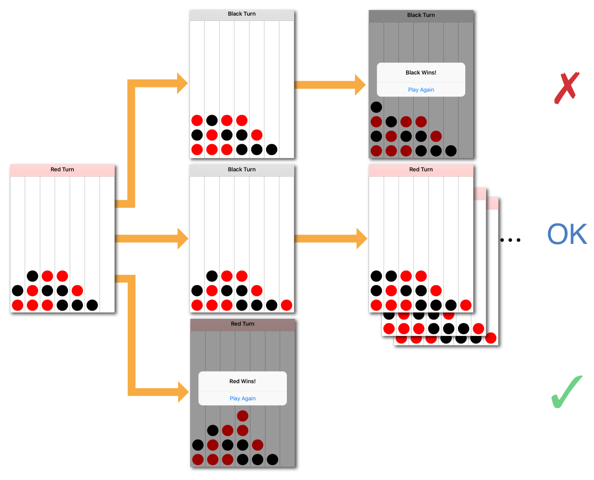

> 导航：[总目录](../../../README.md) · [documentation](../../../_indexes/documentation.md) · [GameplayKit Programming Guide](index.md)

## The Minmax Strategist

Many games that have been popular since long before the days of video gaming—especially board games such as backgammon, chess, Tic-Tac-Toe, and Go—are essentially games of logic. A player succeeds in playing such games by planning the best possible move at every opportunity, taking into account the possible moves of the opposing player (or players). These kinds of games can be exciting to play whether the opponent is another person or a computer player.

In GameplayKit, a _strategist_ is a simple form of artificial intelligence that you can employ to create a computer opponent for these types of games. The [GKMinmaxStrategist](https://developer.apple.com/documentation/gameplaykit/gkminmaxstrategist) class and supporting APIs implement a _minmax_ strategy for playing games that have many (if not all) of the following characteristics:

- __Sequential.__ Each player must act in order—that is, the players take turns.
- __Adversarial.__ For one player to win, the other player (or players) must lose. The game design assumes that on each turn, a player will make a move that puts that player closer to winning, or the other players closer to losing.
- __Deterministic.__ Players can plan their moves confident in the assumption that the move will occur as planned—that is, player actions are not subject to chance.
- __Perfect information.__ All information crucial to the outcome of the game is visible to all players at all times. For example, a game of chess is won or lost based on the positions of the pieces on the board, and both players can see the positions of all pieces at all times. If there existed a chess variant where each player held in secret a hand of cards, with each card corresponding to a possible move, that variant would not be a perfect information game because the possible actions for one player would not be known to the other player.

It’s possible to use the minmax strategist with games (or elements in more complex games) that don’t fit all of the above characteristics, provided that you can translate your game design into a consistent description that’s compatible with the GameplayKit API. For example, in a single-player game (lacking an adversary), you can use the strategist to suggest optimal moves. Or, in a game where some elements remain hidden until revealed through gameplay, the strategist can plan moves within the constraints of available information. In general, though, the strategist produces more optimal gameplay (that is, comes closer to winning or tying every game) if your gameplay model fits more of these characteristics.

### Designing Your Game for the Minmax Strategist

The minmax strategist works by predicting and rating the possible future states of your gameplay in a decision tree, then choosing a next move by finding the path through the tree with the highest rating. For each turn of its own, the strategist rates possible moves highly if those moves lead to a win; for each turn of the strategist’s opponent, the strategist assigns a low rating to possible moves that will lead to a win for the opponent. (The name “minmax” comes from the strategy of maximizing the rating of one’s own moves and minimizing the rating of an opponent’s moves.)

Consider a game in which each player (red or black) moves by dropping a colored chip into one column of a grid, and a player wins upon placing four chips in a row horizontally, vertically, or diagonally. Figure 5-1 shows a partial decision tree for such a game. The FourInARow sample code project implements this game.

> [!NOTE]
> 

__Figure 5-1__Possible Turns in a Four-In-A-Row Game

The red player can move by dropping a piece in any of the seven columns. For each column, the strategist considers the state of the board after a move in that column, and rates the move based on the outcome. (The diagram above shows only a few of the possible moves.)

- If the red player moves in column 1 (the leftmost column), the black player can move in that column on the next turn and win the game. This is not a good outcome for the red player, so the red player assigns a low rating to this move.
- If the red player moves in column 7 (the rightmost column), the black player has no possible move on the next turn that wins the game, so the red player assigns an intermediate rating to this move.
- The red player wins with a move in column 4 (the middle column), so that move has the highest possible rating.

From this example, it should be clear that using the minmax strategist requires three key features in your game’s architecture:

- A representation of the game “board”; that is, an object that models the current state of all elements crucial to the game’s outcome.
- A way to specify the possible moves for a player, and indicate how each move leads from one game state to another.
- A means of scoring or rating each possible state of the game model, so that the states resulting from more advantageous move can be distinguished from other states.

A well-architected game tends to already have these features. For example, the FourInARow sample code project uses a [Model-View-Controller](https://developer.apple.com/library/archive/documentation/General/Conceptual/DevPedia-CocoaCore/MVC.html#//apple_ref/doc/uid/TP40008195-CH32) architecture to separate its gameplay model from the code that drives user interaction and display. Listing 5-1 shows the key features of the `AAPLBoard` class that implements the gameplay model:

__Listing 5-1__Interface for a Four-In-A-Row Game Model

1. `@interface AAPLBoard : NSObject`
2. `{`
3. `AAPLChip _cells[AAPLBoardWidth * AAPLBoardHeight];`
4. `}`
5. `@property AAPLPlayer *currentPlayer;`
6. `- (AAPLChip)chipInColumn:(NSInteger)column row:(NSInteger)row;`
7. `- (BOOL)canMoveInColumn:(NSInteger)column;`
8. `- (void)addChip:(AAPLChip)chip inColumn:(NSInteger)column;`
9. `- (BOOL)isFull;`
10. `- (NSArray<NSNumber *> *)runCountsForPlayer:(AAPLPlayer *)player;`
11. `@end`

These properties and methods expose all the information that a strategist needs to play the game:

- An `AAPLBoard` object itself represents the state of the game (or a potential future state of a game). It contains a rectangular array of `AAPLChip` values (an integer enumeration with labeled cases for the red player, the black player, and an empty space). It also references `AAPLPlayer` objects, which represent the player whose turn it currently is.
- The `canMoveInColumn` and `addChip` methods provide a way to specify the possible moves at any given time and simulate the outcome of those moves. To speculate about a possible future state of the game, the strategist makes a copy of the “official” `AAPLBoard` object representing the current state, then call the `addChip` method on the copy.
- The `isFull` method determines whether the game has ended due to a draw, and the `runCountsForPlayer` method provides information that helps determine how close either player is to winning the game. If you add the ability to produce additional `AAPLBoard` objects for speculating about future states of the game, these methods can be the basis for scoring or rating those future states.

### Using the Minmax Strategist in Your Game

You use an instance of the [GKMinmaxStrategist](https://developer.apple.com/documentation/gameplaykit/gkminmaxstrategist) class to implement the minmax strategist in your game. This class uses the gameplay model you’ve defined to reason about the state of the game, offering suggestions for the “best” next move for a player to take at any time. However, before the `GKMinmaxStrategist` class can reason about your gameplay model, you must describe that model in standardized terms that GameplayKit can understand. You do this by adopting the [GKGameModel](https://developer.apple.com/documentation/gameplaykit/gkgamemodel), [GKGameModelUpdate](https://developer.apple.com/documentation/gameplaykit/gkgamemodelupdate), and [GKGameModelPlayer](https://developer.apple.com/documentation/gameplaykit/gkgamemodelplayer) protocols.

> [!NOTE]
> 

### Adopt GameplayKit Protocols in Your Game Model

Three key protocols define the interface GameplayKit uses to reason about the state of your game.

- The [GKGameModel](https://developer.apple.com/documentation/gameplaykit/gkgamemodel) protocol applies to objects that represent a distinct state of your gameplay model. In the FourInARow example, the `AAPLBoard` class is a good candidate for adopting this protocol.
- The [GKGameModelPlayer](https://developer.apple.com/documentation/gameplaykit/gkgamemodelplayer) protocol is an abstraction of the objects that represent players in your game. In the example, the `AAPLPlayer` class works well for this case.
- The [GKGameModelUpdate](https://developer.apple.com/documentation/gameplaykit/gkgamemodelupdate) protocol is for objects that describe a transition between two game states. In the example, there is no such object—the `addChip` method _performs_ the transition. In this case, adopting the `GKGameModelUpdate` protocol requires creating a new class.

The code listings below show how to extend the model classes in the FourInARow example to adopt the GameplayKit protocols. First, Listing 5-2 adds an `AAPLMove` class that adopts the [GKGameModelUpdate](https://developer.apple.com/documentation/gameplaykit/gkgamemodelupdate) protocol.

__Listing 5-2__The Move Class Adopts the GKGameModelUpdate Protocol

1. `@interface AAPLMove : NSObject <GKGameModelUpdate>`
2. `@property (nonatomic) NSInteger value;`
3. `@property (nonatomic) NSInteger column;`
4. `+ (AAPLMove *)moveInColumn:(NSInteger)column;`
5. `@end`

The [GKGameModelUpdate](https://developer.apple.com/documentation/gameplaykit/gkgamemodelupdate) protocol requires one property: [value](https://developer.apple.com/documentation/gameplaykit/gkgamemodelupdate/1490280-value). The strategist assigns a score to this property when weighing the desirability of each possible move. For the rest of your implementation of this protocol, create properties or methods that describe a move in terms particular to your game. In the FourInARow game, the only information needed to specify a move is which column to drop a chip into.

Next, Listing 5-3 adds [GKGameModelPlayer](https://developer.apple.com/documentation/gameplaykit/gkgamemodelplayer) conformance to the `AAPLPlayer` class.

__Listing 5-3__The Player Class Adopts the GKGameModelPlayer Protocol

1. `@interface AAPLPlayer (AAPLMinmaxStrategy) <GKGameModelPlayer>`
2. `@end`
4. `@implementation AAPLPlayer (AAPLMinmaxStrategy)`
5. `- (NSInteger)playerId { return self.chip; }`
6. `@end`

The `AAPLPlayer` class simply exposes the integer value of its `AAPLChip` enumeration as its [playerId](https://developer.apple.com/documentation/gameplaykit/gkgamemodelplayer/1490272-playerid) property.

Adding [GKGameModel](https://developer.apple.com/documentation/gameplaykit/gkgamemodel) conformance to the `AAPLBoard` class requires three areas of functionality: keeping track of players, handling and scoring moves, and copying state information. Listing 5-4 shows the first of these areas.

__Listing 5-4__GKGameModel Implementation: Managing Players

1. `- (NSArray<AAPLPlayer *> *)players { return [AAPLPlayer allPlayers]; }`
2. `- (AAPLPlayer *)activePlayer { return self.currentPlayer; }`

The [players](https://developer.apple.com/documentation/gameplaykit/gkgamemodel/1490287-players) getter always returns the two players in the game. For the FourInARow game, the number and identity of players is constant, so this array is stored in the `AAPLPlayer` class. The [activePlayer](https://developer.apple.com/documentation/gameplaykit/gkgamemodel/1490293-activeplayer) getter simply maps to the `currentPlayer` property already implemented in the `AAPLBoard` class.

A critical part of a [GKGameModel](https://developer.apple.com/documentation/gameplaykit/gkgamemodel) implementation is simulating each player’s prospective moves. Listing 5-5 shows how the `AAPLBoard` class handles these tasks.

__Listing 5-5__GKGameModel Implementation: Finding and Handling Moves

1. `- (NSArray<AAPLMove *> *)gameModelUpdatesForPlayer:(AAPLPlayer *)player {`
2. `NSMutableArray<AAPLMove *> *moves = [NSMutableArray arrayWithCapacity:AAPLBoardWidth];`
3. `for (NSInteger column = 0; column < AAPLBoardWidth; column++) {`
4. `if ([self canMoveInColumn:column]) {`
5. `[moves addObject:[AAPLMove moveInColumn:column]];`
6. `}`
7. `}`
8. `return moves; // will be empty if isFull`
9. `}`
11. `- (void)applyGameModelUpdate:(AAPLMove *)gameModelUpdate {`
12. `[self addChip:self.currentPlayer.chip inColumn:gameModelUpdate.column];`
13. `self.currentPlayer = self.currentPlayer.opponent;`
14. `}`

The [gameModelUpdatesForPlayer:](https://developer.apple.com/documentation/gameplaykit/gkgamemodel/1490288-gamemodelupdatesforplayer) method returns the possible moves for the specified player. Each possible move is an instance of your game’s implementation of the [GKGameModelUpdate](https://developer.apple.com/documentation/gameplaykit/gkgamemodelupdate) protocol—in this example, the `Move` class. The FourInARow game implements this method by returning an array of `AAPLMove` objects corresponding to each non-full column.

> [!NOTE]
> 

The [applyGameModelUpdate:](https://developer.apple.com/documentation/gameplaykit/gkgamemodel/1490278-apply) method takes a [GKGameModelUpdate](https://developer.apple.com/documentation/gameplaykit/gkgamemodelupdate) object and performs whatever game actions that object specifies. In this example, a game model update is a `AAPLMove` object, so the board applies a move by calling its `addChip:` method to drop a chip of the current player’s color in the column specified by the `AAPLMove` object. This method is also responsible for letting GameplayKit know the order of turns in your game, so that when the strategist plans several turns ahead it knows which player is moving on which turn. This example is a two-player game, so the `applyGameModelUpdate:` method switches the [activePlayer](https://developer.apple.com/documentation/gameplaykit/gkgamemodel/1490293-activeplayer) property to the current player’s opponent on each move.

For the minmax strategist to determine which of the possible moves is the best choice, your game model must indicate when it represents a more or less desirable state of the game, as shown in Listing 5-6.

__Listing 5-6__GKGameModel Implementation: Evaluating Board State

1. `- (BOOL)isWinForPlayer:(AAPLPlayer *)player {`
2. `NSArray<NSNumber *> *runCounts = [self runCountsForPlayer:player];`
3. `// The player wins if there are any runs of 4 (or more, but that shouldn't happen in a regular game).`
4. `NSNumber *longestRun = [runCounts valueForKeyPath:@"@max.self"];`
5. `return longestRun.integerValue >= AAPLCountToWin;`
6. `}`
8. `- (BOOL)isLossForPlayer:(AAPLPlayer *)player {`
9. `return [self isWinForPlayer:player.opponent];`
10. `}`
12. `- (NSInteger)scoreForPlayer:(AAPLPlayer *)player {`
13. `NSArray<NSNumber *> *playerRunCounts = [self runCountsForPlayer:player];`
14. `NSNumber *playerTotal = [playerRunCounts valueForKeyPath:@"@sum.self"];`
15. `NSArray<NSNumber *> *opponentRunCounts = [self runCountsForPlayer:player.opponent];`
16. `NSNumber *opponentTotal = [opponentRunCounts valueForKeyPath:@"@sum.self"];`
17. `// Return the sum of player runs minus the sum of opponent runs.`
18. `return playerTotal.integerValue - opponentTotal.integerValue;`
19. `}`

The first step in enabling a strategist to select optimal moves is identifying when a game model represents a win or a loss. You provide this information in the [isWinForPlayer:](https://developer.apple.com/documentation/gameplaykit/gkgamemodel/1490271-iswinforplayer) and [isLossForPlayer:](https://developer.apple.com/documentation/gameplaykit/gkgamemodel/1490286-isloss) methods. In the FourInARow example, the `runCountsForPlayer` method provides a convenient way to test for wins—as the name of the game suggests, the player wins with a run of four chips in a row.

Because this game is for two players only, a loss for the player is by definition a win for the player’s opponent, and vice versa, so you can implement the [isLossForPlayer:](https://developer.apple.com/documentation/gameplaykit/gkgamemodel/1490286-isloss) method in terms of the `isWinForPlayer:` method. (In a game with more than two players, this assumption might not be true. For example, a winner might be determined only after all other players have lost.)

Armed with only the knowledge of winning and losing game states, the minmax strategist can play the game. The [GKMinmaxStrategist](https://developer.apple.com/documentation/gameplaykit/gkminmaxstrategist) class automatically ignores possible moves after a win or loss, and it weighs its decisions based on how many moves in the future an expected win or loss is. However, at this point the strategist does not play the game very well, because there are a number of possible states of the game with equal numbers of possible future wins or losses.

To improve the strategist’s gameplay, use the [scoreForPlayer:](https://developer.apple.com/documentation/gameplaykit/gkgamemodel/1490281-score) method to implement a _heuristic_—an estimate of how desirable the current state of the board is to the player. Alternately, a score represents an estimate of how likely the player is to win, or how soon, the player can win. The FourInARow example uses a heuristic based on its `runCountsForPlayer` method, assuming that, for example, a player with two runs of two chips each is more likely to win soon than a player with no runs. Because the player’s success or failure is related to that of the opponent, the [scoreForPlayer:](https://developer.apple.com/documentation/gameplaykit/gkgamemodel/1490281-score) method totals the player’s number and length of runs and subtracts from it the opponent’s number and length of runs.

> [!NOTE]
> 

Finally, a game model class must support copying itself and its internal state, so that the strategist can make multiple copies of a board for examining the results of possible future moves. Listing 5-7 shows how the `AAPLBoard` class copies itself.

__Listing 5-7__GKGameModel Implementation: Copying State Information

1. `- (void)setGameModel:(AAPLBoard *)gameModel {`
2. `memcpy(_cells, gameModel->_cells, sizeof(_cells));`
3. `self.currentPlayer = gameModel.currentPlayer;`
4. `}`
6. `- (id)copyWithZone:(NSZone *)zone {`
7. `AAPLBoard *copy = [[[self class] allocWithZone:zone] init];`
8. `[copy setGameModel:self];`
9. `return copy;`
10. `}`

The [setGameModel:](https://developer.apple.com/documentation/gameplaykit/gkgamemodel/1490267-setgamemodel) method copies the internal state of one [GKGameModel](https://developer.apple.com/documentation/gameplaykit/gkgamemodel) object to another. Here, the `AAPLBoard` class simply copies its `_cells` array and `currentPlayer` property. The [GKGameModel](https://developer.apple.com/documentation/gameplaykit/gkgamemodel) protocol requires conformance to the [NSCopying](https://developer.apple.com/library/archive/documentation/LegacyTechnologies/WebObjects/WebObjects_3.5/Reference/Frameworks/ObjC/Foundation/Protocols/NSCopying/Description.html#//apple_ref/occ/intf/NSCopying) protocol, so the [copyWithZone:](https://developer.apple.com/library/archive/documentation/LegacyTechnologies/WebObjects/WebObjects_3.5/Reference/Frameworks/ObjC/Foundation/Protocols/NSCopying/Description.html#//apple_ref/occ/intfm/NSCopying/copyWithZone:) method uses the [setGameModel:](https://developer.apple.com/documentation/gameplaykit/gkgamemodel/1490267-setgamemodel) method to turn a new `AAPLBoard` instance into a copy.

To simulate possible moves, the strategist uses several copies of your [GKGameModel](https://developer.apple.com/documentation/gameplaykit/gkgamemodel) class and calls the [setGameModel:](https://developer.apple.com/documentation/gameplaykit/gkgamemodel/1490267-setgamemodel) method many times. For example, looking ahead six turns in the FourInARow game (which has up to seven possible moves at any given time) requires examining hundreds of thousands of board states. (Rather than continually creating new instances of your game model class, GameplayKit makes only a few copies, and reuses those instances with the `setGameModel:` method. This optimization improves memory efficiency.)

> [!IMPORTANT]
> 

### Use a Strategist Object to Plan Moves

After you’ve adopted [GKGameModel](https://developer.apple.com/documentation/gameplaykit/gkgamemodel) and related protocols in your gameplay model classes, using the minmax strategist requires only a few simple steps. To see how these steps are implemented in the FourInARow game, download the sample code project.

1. Keep a [GKMinmaxStrategist](https://developer.apple.com/documentation/gameplaykit/gkminmaxstrategist) instance in whatever controller code manages your gameplay model—for example, a view controller or SpriteKit scene.
2. Use the `GKMinmaxStrategist` object’s `gameModel` property to point to the current state of your game—that is, your model object that implements the [GKGameModel](https://developer.apple.com/documentation/gameplaykit/gkgamemodel) protocol.

   Typically, you can do this only once, when initializing a new game, because the `gameModel` property will refer to the same `GKGameModel` object even as that object’s internal state changes. However, if you begin using a different instance of your model class (for example, when resetting the board for a new game), be sure to set the `gameModel` property again.
3. Set the [maxLookAheadDepth](https://developer.apple.com/documentation/gameplaykit/gkminmaxstrategist/1501226-maxlookaheaddepth) property to the number of consecutive future moves you want to plan for.

   In general, deeper lookahead results in a stronger computer-controlled player. However, deeper lookahead also exponentially increases the amount of work the strategist must do to plan a move. Choose a lookahead depth that provides the desired level of difficulty for your game without sacrificing performance.

   For example, the FourInARow game requires four chips in a row to win. Therefore, if a computer-controlled player always makes the optimal move, it should theoretically always be able to either win or force a draw when the lookahead depth is seven—four of the strategist’s own turns plus the intervening three opponent turns. (Whether that theory holds true depends on the robustness of your [scoreForPlayer:](https://developer.apple.com/documentation/gameplaykit/gkgamemodel/1490281-score) method.) For this game, a lookahead depth of seven results in a search space of nearly a million possible board states.
4. To plan the computer-controlled player’s next move, use the [bestMoveForPlayer:](https://developer.apple.com/documentation/gameplaykit/gkminmaxstrategist/1501137-bestmoveforplayer) method. This method returns a [GKGameModelUpdate](https://developer.apple.com/documentation/gameplaykit/gkgamemodelupdate) object (in the FourInARow example, an `AAPLMove` object) corresponding to the chosen move. To perform the move, use your gameplay model’s [applyGameModelUpdate:](https://developer.apple.com/documentation/gameplaykit/gkgamemodel/1490278-apply) method.

   Alternatively, use one of the other methods listed in _[GKMinmaxStrategist Class Reference](https://developer.apple.com/documentation/gameplaykit/gkminmaxstrategist)_, which provide options for handling cases with multiple “best” moves or randomizing moves.

   > [!NOTE]
   > 

[State Machines](StateMachine.md#apple-f4xwc4dqnrsv64tfmyxwi33df52wszbpkridimbqge2tcnzsfvbuqnznknltc)

[Pathfinding](Pathfinding.md#apple-f4xwc4dqnrsv64tfmyxwi33df52wszbpkridimbqge2tcnzsfvbuqmznknltc)
