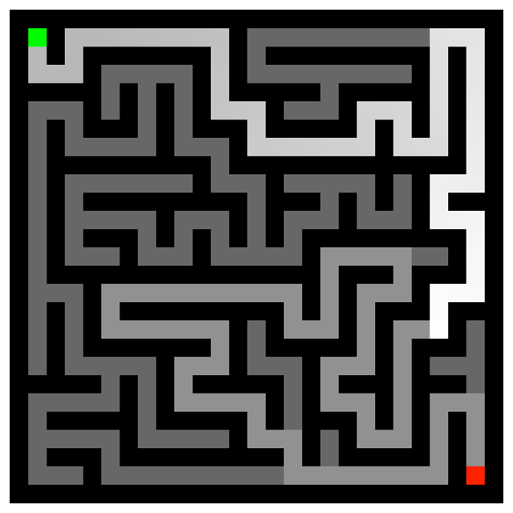
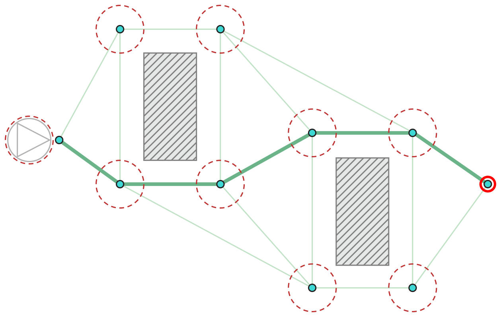
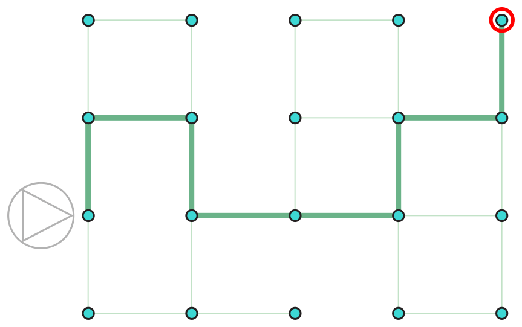
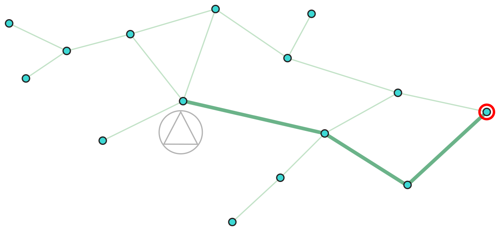

> 导航：[总目录](../../../README.md) · [documentation](../../../_indexes/documentation.md) · [GameplayKit Programming Guide](index.md)

## Pathfinding

Navigation is an important concept in many games. Some turn-based games require a player to choose the optimal path toward a goal in terms of places on a board. Many action and adventure games place characters in some form of labyrinth—the player character must solve the maze to achieve gameplay goals, and enemy characters must work their way through it to present a challenge to the player. The process of determining how to traverse a game board, maze, or other navigable space is called _pathfinding_. GameplayKit offers a set of utilities for mapping your game world and finding paths through it, which you can then use to move characters or other game entities.

Using the pathfinding utilities in GameplayKit requires describing the navigable areas in your game as a _graph_—a collection of distinct locations, or _nodes_, and the connections that specify how an entity navigates from one location to another. Because most games that involve 2D movement fit this description, adapting such games to use pathfinding is typically a matter of finding a convenient way to create graph descriptions of the game world.

### Example: Pathfinder

Before exploring the full capabilities of GameplayKit’s pathfinding features in this chapter, you can get a quick taste by downloading the sample code project _[Pathfinder: GameplayKit Pathfinding Basics](../../../samplecode/Pathfinder-%20GameplayKit%20Pathfinding%20Basics/Pathfinder-%20GameplayKit%20Pathfinding%20Basics.md#apple-f4xwc4dqnrsv64tfmyxwi33df52wszbpkridimbqge3dinrr)_. This simple game automatically creates mazes, then uses GameplayKit to solve them, highlighting the shortest path through each maze, as shown in Figure 6-1.

__Figure 6-1__The Pathfinder Sample Code Project in Action

### Designing Your Game for Pathfinding

You describe a graph using the [GKGraph](https://developer.apple.com/documentation/gameplaykit/gkgraph) class and related APIs, which offer three ways to model navigable areas.

- __As a continuous space interrupted by obstacles.__ Use the [GKPolygonObstacle](https://developer.apple.com/documentation/gameplaykit/gkpolygonobstacle) class to model impassable areas, the [GKGraphNode2D](https://developer.apple.com/documentation/gameplaykit/gkgraphnode2d) class to model locations of interest within open spaces, and the [GKObstacleGraph](https://developer.apple.com/documentation/gameplaykit/gkobstaclegraph) class to create graphs containing both. Figure 6-2 illustrates this format, which can be found in many 2D action, adventure, and puzzle games, as well as 3D games in which gameplay-relevant movement is strictly 2D.

  __Figure 6-2__Finding a Path Around Obstacles
  

  When building games with SpriteKit, you can generate a collection of [GKPolygonObstacle](https://developer.apple.com/documentation/gameplaykit/gkpolygonobstacle) objects based on the contents of a scene or node. With this technique, you can define navigable regions using methods you might already be using for other game mechanics. For example, you can design a level with the SpriteKit Scene Editor in Xcode and use physics bodies to mark regions that the player (or other game entities) cannot pass through, then use the [obstaclesFromNodePhysicsBodies:](https://developer.apple.com/documentation/spritekit/sknode/1483085-obstaclesfromnodephysicsbodies) method to generate [GKPolygonObstacle](https://developer.apple.com/documentation/gameplaykit/gkpolygonobstacle) objects marking impassable regions.
- __As a discrete two-dimensional grid, where the only valid locations are those with integer coordinates.__ Use the [GKGridGraph](https://developer.apple.com/documentation/gameplaykit/gkgridgraph) and [GKGridGraphNode](https://developer.apple.com/documentation/gameplaykit/gkgridgraphnode) classes to create grid-based graphs. Figure 6-3 illustrates this format, which appears in many classic arcade games, board games, and tactical role-playing games.

  __Figure 6-3__Finding a Path Through a Grid
  

  In some such games, character movement appears to be continuous, but for purposes of game logic all positions are constrained to an integer grid.
- __As a collection of discrete locations and the connections between them.__ Use the [GKGraphNode](https://developer.apple.com/documentation/gameplaykit/gkgraphnode) class to model nodes and connections with no associated geometry information, then use the [GKGraph](https://developer.apple.com/documentation/gameplaykit/gkgraph) class to work with the graph as a whole. This style works well for games in which entities move between distinctly marked spaces but their actual location within a space is irrelevant to gameplay. Figure 6-4 illustrates this format, which works well for certain types of board games and strategy games.

  __Figure 6-4__Finding a Path in an Arbitrary Graph
  

  The connections between nodes are _directed_—that is, a connection from Node A to Node B indicates only that one can navigate from Node A to Node B. For navigation from Node B to Node A to also be possible, a separate connection from Node B to Node A must also exist.

After you create a graph, you can use that [GKGraph](https://developer.apple.com/documentation/gameplaykit/gkgraph) object to connect new nodes based on their relationships to existing nodes in the graph, remove nodes from the graph regardless of their relationships to existing nodes, and most importantly, find paths from one node in the graph to another.

### Adding Pathfinding to Your Game

The typical workflow for using pathfinding in a game involves three or four steps:

1. Before gameplay begins, create an instance of the [GKGraph](https://developer.apple.com/documentation/gameplaykit/gkgraph) class or one of its subclasses to represent the static content of a game scene, using either of the styles described in [Designing Your Game for Pathfinding](#apple-f4xwc4dqnrsv64tfmyxwi33df52wszbpkridimbqge2tcnzsfvbuqmznknlte).
2. When you need to find a path for use by dynamic entities in your game—for example, to cause a player character to navigate around obstacles to the location of a click or tap event—either find existing nodes that match the positions of those entities, or create temporary nodes representing those entities and connect them to the graph.
3. Use the [findPathFromNode:toNode:](https://developer.apple.com/documentation/gameplaykit/gkgraph/1501270-findpath) method to find a path through the graph.

   This method returns an array of [GKGraphNode](https://developer.apple.com/documentation/gameplaykit/gkgraphnode) objects representing the path to follow. (The subclass of `GKGraphNode` in the array depends is the same subclass you used to create the graph.) You can use the position data contained in the nodes along the path to move your game entities—for example, a SpriteKit game can create a sequence of [SKAction](https://developer.apple.com/documentation/spritekit/skaction) objects to move a game character to the locations on the path.
4. (Optional) After finding a path, disconnect any temporary nodes from the graph so that they don’t interfere with future pathfinding.

The sections below illustrate the use of pathfinding in two example games.

### Pathfinding on a Grid

The Maze sample code project (already seen in the [Entities and Components](EntityComponent.md#apple-f4xwc4dqnrsv64tfmyxwi33df52wszbpkridimbqge2tcnzsfvbuqnrnknltc) and [State Machines](StateMachine.md#apple-f4xwc4dqnrsv64tfmyxwi33df52wszbpkridimbqge2tcnzsfvbuqnznknltc) chapters) implements a variation on several classic arcade games. In this game both the player and enemy characters move through a maze on an integer grid. Movement appears to be continuous only because animation interpolates between grid positions.

> [!NOTE]
> 

This game creates a [GKGridGraph](https://developer.apple.com/documentation/gameplaykit/gkgridgraph) object to represent the maze, as shown in Listing 6-1.

__Listing 6-1__Generating a Grid Graph

1. `GKGridGraph *graph = [GKGridGraph graphFromGridStartingAt:(vector_int2){0, 0} width:AAPLMazeWidth height:AAPLMazeHeight diagonalsAllowed:NO];`
2. `NSMutableArray *walls = [NSMutableArray arrayWithCapacity:AAPLMazeWidth*AAPLMazeHeight];`
3. `NSMutableArray *spawnPoints = [NSMutableArray array];`
4. `for (int i = 0; i < AAPLMazeWidth; i++) {`
5. `for (int j = 0; j < AAPLMazeHeight; j++) {`
6. `int tile = [self tileAtRow:i column:j];`
7. `if (tile == TileTypeWall) {`
8. `[walls addObject:[graph nodeAtGridPosition:(vector_int2){i, j}]];`
9. `} else if (tile == TileTypePortal) {`
10. `[spawnPoints addObject:[graph nodeAtGridPosition:(vector_int2){i, j}]];`
11. `} else if (tile == TileTypeStart) {`
12. `_startPosition = [graph nodeAtGridPosition:(vector_int2){i, j}];`
13. `}`
14. `}`
15. `}`
16. `// Remove wall tiles from the graph so that paths go around them.`
17. `[graph removeNodes:walls];`

The [graphFromGridStartingAt:width:height:diagonalsAllowed:](https://developer.apple.com/documentation/gameplaykit/gkgridgraph/1556416-graphfromgridstartingat) method creates a graph with a node for every location in a specified rectangular grid. This code then removes the nodes at grid positions corresponding to walls in the maze, leaving only the traversable areas of the maze as graph nodes.

When enemy characters are in their Chase state, they use pathfinding to obtain routes toward the player’s current position. Listing 6-2 shows the implementation of this behavior.

__Listing 6-2__Pathfinding to Known Grid Positions

1. `- (NSArray<GKGridGraphNode *> *)pathToNode:(GKGridGraphNode *)node {`
2. `GKGridGraph *graph = self.game.level.pathfindingGraph;`
3. `GKGridGraphNode *enemyNode = [graph nodeAtGridPosition:self.entity.gridPosition];`
4. `NSArray<GKGridGraphNode *> *path = [graph findPathFromNode:enemyNode toNode:node];`
5. `return path;`
6. `}`
8. `- (void)startFollowingPath:(NSArray<GKGridGraphNode *> *)path {`
9. `// Set up a move to the first node on the path, but`
10. `// no farther because the next update will recalculate the path.`
11. `if (path.count > 1) {`
12. `GKGridGraphNode *firstMove = path[1]; // path[0] is the enemy's current position.`
13. `AAPLSpriteComponent *component = (AAPLSpriteComponent *)[self.entity componentForClass:[AAPLSpriteComponent class]];`
14. `component.nextGridPosition = firstMove.gridPosition;`
15. `}`
16. `}`

In this example, both the enemy and the player occupy positions that are already in the graph. (Again, even though the characters’ movement is animated to appear continuous, for gameplay purposes each character is always at an integer grid position.) Thus, to find a path for the enemy to chase the player, this method need only look up the [GKGridGraphNode](https://developer.apple.com/documentation/gameplaykit/gkgridgraphnode) objects corresponding to the enemy’s and player’s current positions, then use the [findPathFromNode:toNode:](https://developer.apple.com/documentation/gameplaykit/gkgraph/1501270-findpath) method to find a path.

To move the enemy character, this method examines only the first two nodes in the path. This method is called from an [updateWithDeltaTime:](https://developer.apple.com/documentation/gameplaykit/gkcomponent/1501218-update) method, so it executes for every frame of animation—possibly finding a new path in response to the changes in the player’s location. Because it takes longer to animate the enemy character’s move along the first step of the path than to calculate a new path, this method simply starts that animation by setting a target position for the game’s `SpriteComponent` class. (See the [Entities and Components](EntityComponent.md#apple-f4xwc4dqnrsv64tfmyxwi33df52wszbpkridimbqge2tcnzsfvbuqnrnknltc) chapter for discussion of this class.)

### Pathfinding Around Obstacles

The DemoBots sample code project implements a different game in which characters can move freely in open space, so grid-based pathfinding is not feasible. Instead, this game uses obstacle-based pathfinding.

> [!NOTE]
> 

To prepare for this style of pathfinding, this example uses a set of nodes in each level’s scene file (created with the SpriteKit Scene Editor in Xcode) whose physics bodies designate areas of the game world that should be impassable to game characters. Then, the `LevelScene` class implements a `graph` property that builds a [GKObstacleGraph](https://developer.apple.com/documentation/gameplaykit/gkobstaclegraph) object, as shown in Listing 6-3.

__Listing 6-3__Creating an Obstacle-Based Graph

1. `lazy var obstacleSpriteNodes: [SKSpriteNode] = self["world/obstacles/*"] as! [SKSpriteNode]`
3. `lazy var polygonObstacles: [GKPolygonObstacle] = SKNode.obstaclesFromNodePhysicsBodies(self.obstacleSpriteNodes)`
5. `lazy var graph: GKObstacleGraph = GKObstacleGraph(obstacles: self.polygonObstacles, bufferRadius: GameplayConfiguration.TaskBot.pathfindingGraphBufferRadius)`

> [!NOTE]
> 

The `graph` property’s initializer first reads the `polygonObstacles` property, which searches the level’s node tree (see Searching the Node Tree in _[SKNode Class Reference](https://developer.apple.com/documentation/spritekit/sknode)_) to provide an array of all child nodes of the `obstacles` node. Then, the `SKNode` method [obstaclesFromNodePhysicsBodies:](https://developer.apple.com/documentation/spritekit/sknode/1483085-obstaclesfromnodephysicsbodies) creates an array of [GKPolygonObstacle](https://developer.apple.com/documentation/gameplaykit/gkpolygonobstacle) objects corresponding to the shapes of each obstacle node’s physics body. Finally, these objects create a graph.

When it comes time to plan a route for a game character, the game’s `TaskBotBehavior` class uses the method shown in Listing 6-4.

__Listing 6-4__Finding Paths in an Obstacle-Based Graph

1. `private func addGoalsToFollowPathFromStartPoint(startPoint: float2, toEndPoint endPoint: float2, pathRadius: Float, inScene scene: LevelScene) -> [CGPoint] {`
3. `` // Convert the provided `CGPoint`s into nodes for the `GPGraph`. ``
4. `let startNode = connectedNodeForPoint(startPoint, onObstacleGraphInScene: scene)`
5. `let endNode = connectedNodeForPoint(endPoint, onObstacleGraphInScene: scene)`
7. `// Find a path between these two nodes.`
8. `let pathNodes = scene.graph.findPathFromNode(startNode, toNode: endNode) as! [GKGraphNode2D]`
10. `` // Create a new `GKPath` from the found nodes with the requested path radius. ``
11. `let path = GKPath(graphNodes: pathNodes, radius: pathRadius)`
13. `// Add "follow path" and "stay on path" goals for this path.`
14. `addFollowAndStayOnPathGoalsForPath(path)`
16. `// Remove the "start" and "end" nodes now that the path has been calculated.`
17. `scene.graph.removeNodes([startNode, endNode])`
19. `` // Convert the `GKGraphNode2D` nodes into `CGPoint`s for debug drawing. ``
20. `let pathPoints: [CGPoint] = pathNodes.map { CGPoint($0.position) }`
21. `return pathPoints`
22. `}`

The `addGoalsToFollowPathFromStartPoint` method follows a similar set of steps as those shown in [Listing 6-2](#apple-f4xwc4dqnrsv64tfmyxwi33df52wszbpkridimbqge2tcnzsfvbuqmznknltk), but with some variations for an obstacle-based graph:

1. This method creates and connects temporary nodes representing the desired start and end points for a path.

   Unlike a grid-based graph, a graph of continuous 2D space does not already contain nodes at those positions. (The `connectedNodeForPoint` call is a convenience function in this project that both creates a new node and uses the [connectNodeUsingObstacles:](https://developer.apple.com/documentation/gameplaykit/gkobstaclegraph/1501129-connectnodeusingobstacles) method to add it to the graph.)
2. The [findPathFromNode:toNode:](https://developer.apple.com/documentation/gameplaykit/gkgraph/1501270-findpath) method returns an array of graph nodes representing a route between the temporary nodes.
3. This project’s `addFollowAndStayOnPathGoalsForPath` method then uses GameplayKit’s Agents feature to move a game character along the path.

   For a discussion of the `addFollowAndStayOnPathGoalsForPath` method’s implementation, see [Listing 7-1](Agent.md#apple-f4xwc4dqnrsv64tfmyxwi33df52wszbpkridimbqge2tcnzsfvbuqobnknlti).
4. After that work has been done, the `startNode` and `endNode` nodes are removed from the graph so that they don’t interfere with future pathfinding operations.
5. Finally, the method also returns an array of [CGPoint](https://developer.apple.com/documentation/coregraphics/cgpoint) structures so that the game can optionally draw an overlay illustrating the path for use in debugging.

[The Minmax Strategist](Minmax.md#apple-f4xwc4dqnrsv64tfmyxwi33df52wszbpkridimbqge2tcnzsfvbuqmrnknltc)

[Agents, Goals, and Behaviors](Agent.md#apple-f4xwc4dqnrsv64tfmyxwi33df52wszbpkridimbqge2tcnzsfvbuqobnknltc)
