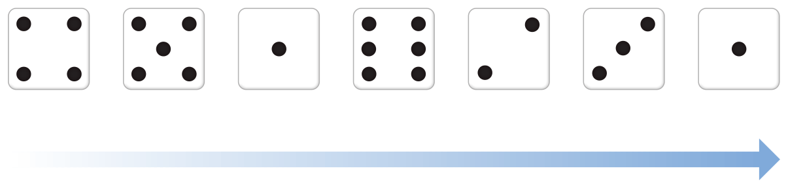
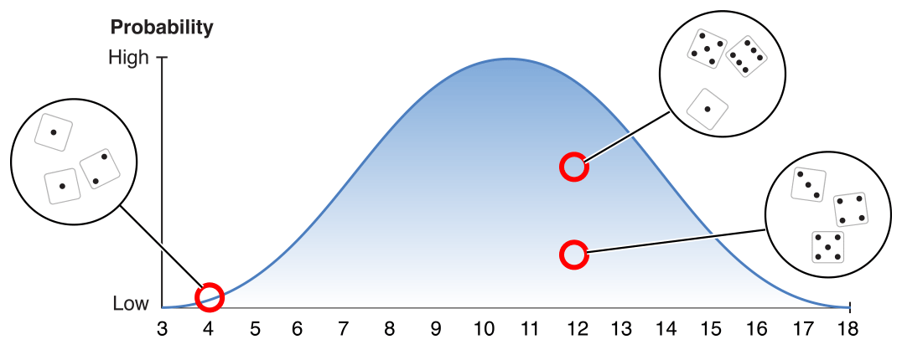
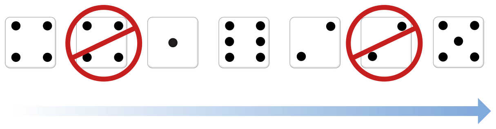

> 导航：[总目录](../../../README.md) · [documentation](../../../_indexes/documentation.md) · [GameplayKit Programming Guide](index.md)

## Randomization

Games are full of mechanics based on chance and probability. There are board games where a die roll determines the player’s movement, card games with shuffled decks, arcade games where enemy creatures appear at unpredictable times, role-playing games where every action has a chance to succeed or fail, open-world games where background characters wander naturally, and many, many more examples. Unexpected surprises can make a game more fun for the player; behavior that changes with every playthrough can add replay value to a game; elements that mimic natural chaotic systems can make a game world more immersive.

Building a game that relies on elements of chance typically involves the use of a pseudorandom number generator, or _random source_. However, not all random sources are created equal, and using a random source poorly can undermine its purpose. To build robust pseudorandom behavior in a game, you typically want some or all of the following traits:

- __Randomness.__ A random number generator should produce unpredictable behavior (or at least the appearance of it). But how is randomness quantified? Computerized pseudorandom number generators are based on _finite sequences_ of numbers that appear to have no order or structure. Eventually, the sequence will repeat—exactly how many random numbers a source generates before repeating depends on the algorithm that source employs. Furthermore, when generated numbers are viewed in binary, some of the bits in a number may be more or less predictable depending on the random source’s algorithm.
- __Performance.__ More complex algorithms can produce better unpredictability at a cost of processing time. If your game uses several random numbers for each frame and needs to run at 60 frames per second, a complex random source could be too slow. Choosing a random source may involve compromises between randomness and performance.
- __Determinism.__ Quality software requires testing, but true randomness makes it difficult to re-create a specific set of conditions to test. A random source should maintain the appearance of unpredictability for players of the game, but allow certain sequence of outcomes to be replicated when needed. Deterministic random sources are also necessary for networked games—you need to make sure that randomized game mechanics behave the same for all players.
- __Independence__. Because a random source is based on a sequence of numbers, the next number generated depends in part on the numbers that came before. However, a game often contains multiple random elements whose behavior should be distinct. For example, consider a game that randomizes both gameplay elements and aesthetic elements, such as a competitive game where each player’s available actions each turn are selected at random, and player characters speak randomly chosen lines of voiceover dialogue to add flavor to the game setting. If both the dialogue system and the available actions use the same randomizer, a sophisticated player might predict the opponent’s next move based on the spoken dialogue.
- __Known distribution.__ For many uses of randomization in gameplay, it’s desirable for random numbers to follow a _uniform distribution_—that is, the probability of generating a specific number is the same as the probability of generating any other number in the range of numbers that the source generates. For other uses, it’s desirable for random numbers to follow a specific distribution—for example, many natural processes involve a _normal distribution_, where a random sampling frequently produces a result near the average, with other results increasingly less likely the farther they are from the average.

GameplayKit includes a suite of several randomization classes to satisfy these goals.

### Using Randomization in Your Game

All randomization classes, or randomizers, in GameplayKit conform to the [GKRandom](https://developer.apple.com/documentation/gameplaykit/gkrandom) protocol, which describes the minimal interface for generating random numbers. To use a randomizer, you first need to choose one that suits your task:

- In most cases, you need random numbers that are uniformly distributed across a specific range. For this task, use the [GKRandomDistribution](https://developer.apple.com/documentation/gameplaykit/gkrandomdistribution) class.
- To customize the randomization behavior but maintain a uniform distribution, choose a different [GKRandomSource](https://developer.apple.com/documentation/gameplaykit/gkrandomsource) subclass to provide underlying random values for a [GKRandomDistribution](https://developer.apple.com/documentation/gameplaykit/gkrandomdistribution) object.
- To customize the distribution of random numbers, use the [GKGaussianDistribution](https://developer.apple.com/documentation/gameplaykit/gkgaussiandistribution) or [GKShuffledDistribution](https://developer.apple.com/documentation/gameplaykit/gkshuffleddistribution) class.
- If you don’t need random numbers with a specific range or distribution, use one of the [GKRandomSource](https://developer.apple.com/documentation/gameplaykit/gkrandomsource) subclasses directly.

  You can also use one of the [GKRandomSource](https://developer.apple.com/documentation/gameplaykit/gkrandomsource) classes directly to randomize the order of objects in an array; for example, to shuffle a deck of cards. First, choose a random source object with the characteristics you need, then pass the array to the random source’s [arrayByShufflingObjectsInArray:](https://developer.apple.com/documentation/gameplaykit/gkrandomsource/1501128-arraybyshufflingobjectsinarray) method. This method returns a copy of the original array, but with its contents in a randomized order.

The following sections detail the differences in the sets of random source and random distribution classes.

### Random Sources: The Building Blocks of Randomization

The [GKRandomSource](https://developer.apple.com/documentation/gameplaykit/gkrandomsource) class and its subclasses provide the algorithms for generating random numbers. To start building randomized behaviors, choose one of the concrete `GKRandomSource` subclasses:

- The [GKARC4RandomSource](https://developer.apple.com/documentation/gameplaykit/gkarc4randomsource) class uses the ARC4 algorithm, which is suitable for most gameplay uses. (This algorithm is similar to that used in the C `arc4random` API; however, the [GKARC4RandomSource](https://developer.apple.com/documentation/gameplaykit/gkarc4randomsource) class is independent from those functions.)
- The [GKLinearCongruentialRandomSource](https://developer.apple.com/documentation/gameplaykit/gklinearcongruentialrandomsource) class uses an algorithm that is faster, but less random, than the `GKARC4RandomSource` class. (Specifically, the low bits of generated numbers repeat more often than the high bits.) Use this source when performance is more important than robust unpredictability.
- The [GKMersenneTwisterRandomSource](https://developer.apple.com/documentation/gameplaykit/gkmersennetwisterrandomsource) class uses an algorithm that is slower, but more random, than the `GKARC4RandomSource` class. Use this source when it’s important that your use of random numbers not show repeating patterns and performance is a lesser concern.

When you create an instance of one of these classes, the result is an _independent_ random source—that is, the sequence of numbers generated by one instance has no effect on the sequence generated by another instance.

All of these classes implement _deterministic_ random number generation. Each class uses a _seed value_ that determines its behavior. When you initialize a random source with the [init](https://developer.apple.com/documentation/gameplaykit/gkarc4randomsource/1501230-init) initializer, GameplayKit uses a nondeterministic seed value. If you want to re-create the behavior of a specific random source instance, read that value from its [seed](https://developer.apple.com/documentation/gameplaykit/gkarc4randomsource/1501260-seed) property, then initialize a new source with the [initWithSeed:](https://developer.apple.com/documentation/gameplaykit/gkarc4randomsource/1501056-initwithseed) initializer to reproduce the sequence of numbers generated by the original source.

Archiving a random source is another way to preserve its state. For example, if you encode a [GKRandomSource](https://developer.apple.com/documentation/gameplaykit/gkrandomsource) (or subclass) instance using an [NSKeyedArchiver](https://developer.apple.com/documentation/foundation/nskeyedarchiver) object, any two random sources decoded from that same archive will produce the same sequence of random numbers.

### Random Distributions Produce Specialized Random Behaviors

A random source provides a basic random number generation algorithm. Building a randomized game mechanic typically requires further specialization, such as the range of generated numbers or consistent patterns (or _distributions_) that appear across many random samplings. To control these parameters, use the [GKRandomDistribution](https://developer.apple.com/documentation/gameplaykit/gkrandomdistribution) class or one of its subclasses:

- The [GKRandomDistribution](https://developer.apple.com/documentation/gameplaykit/gkrandomdistribution) class, by itself, produces a uniform distribution across a specified range—that is, every value between the specified minimum and maximum values is equally likely to occur. Use this class whenever you need a random number that falls within a specific range of numbers. Dice are a common example of a uniform random distribution with a specific range, as seen in Figure 2-1.

  __Figure 2-1__A Uniform Random Distribution Simulates a Single Die Roll
  

  For example, a fair six-sided die has the same probability of landing on any of the numbers one through six. To model commonly used kinds of dice, use the [d6](https://developer.apple.com/documentation/gameplaykit/gkrandomdistribution/1495634-d6) and [d20](https://developer.apple.com/documentation/gameplaykit/gkrandomdistribution/1495649-d20) convenience initializers, or use the [distributionForDieWithSideCount:](https://developer.apple.com/documentation/gameplaykit/gkrandomdistribution/1495651-distributionfordiewithsidecount) initializer to model a die with any number of sides.
- The [GKGaussianDistribution](https://developer.apple.com/documentation/gameplaykit/gkgaussiandistribution) class models a Gaussian distribution, also known as a _normal distribution_, shown in Figure 2-2. In a normal distribution, a certain result—the _mean_—has the highest probability of occurring, and higher- or lower-valued results are less likely. This distribution is symmetric: results that are the same distance from the mean have the same probability of occurring, whether they are above or below the mean.

  __Figure 2-2__A Gaussian Random Distribution is Equivalent to a Roll of Multiple Dice
  

  The Gaussian distribution appears in many real-world phenomena that you might model in a game. For example:

  - __A roll of multiple dice.__ If a role-playing game involves throwing three six-sided dice (often abbreviated _3d6_) to calculate damage from a hit, you can balance the other variables in your game secure in the assumption that hits will most often cause 9 to 13 points of damage.
  - __A player throwing darts.__ The x and y coordinates where each dart hits can be randomized on this distribution, causing darts to cluster near the center of the dartboard.
  - __Randomly generated character variety.__ The heights, weights, and other physical characteristics of nonplayer characters can be normally distributed, giving your game world a realistic population where most people are of average height and very tall or very short people are rare.
- The [GKShuffledDistribution](https://developer.apple.com/documentation/gameplaykit/gkshuffleddistribution) class models a distribution that is generally uniform over time, but that also prevents clusters of similar values from occurring in sequence, as shown in Figure 2-3. A truly random sequence can often include a series of many consecutive “good” or “bad” values, so a shuffled distribution can help your game appear more fair by avoiding such behavior. This distribution can be useful in any gameplay mechanic but is especially suited for cases where random behavior is key to the game and highly visible to the user, such as dice rolls that are displayed onscreen or a deck of cards that is shuffled for play.

  __Figure 2-3__A Shuffled Random Distribution Avoids Repeating the Same Value
  

[About GameplayKit](index.md#apple-f4xwc4dqnrsv64tfmyxwi33df52wszbpkridimbqge2tcnzsfvbuqmjnknltc)

[Entities and Components](EntityComponent.md#apple-f4xwc4dqnrsv64tfmyxwi33df52wszbpkridimbqge2tcnzsfvbuqnrnknltc)
