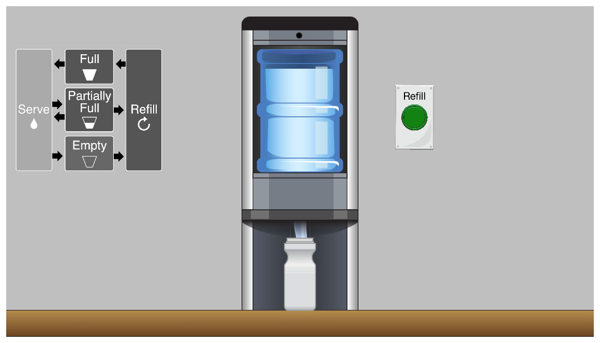
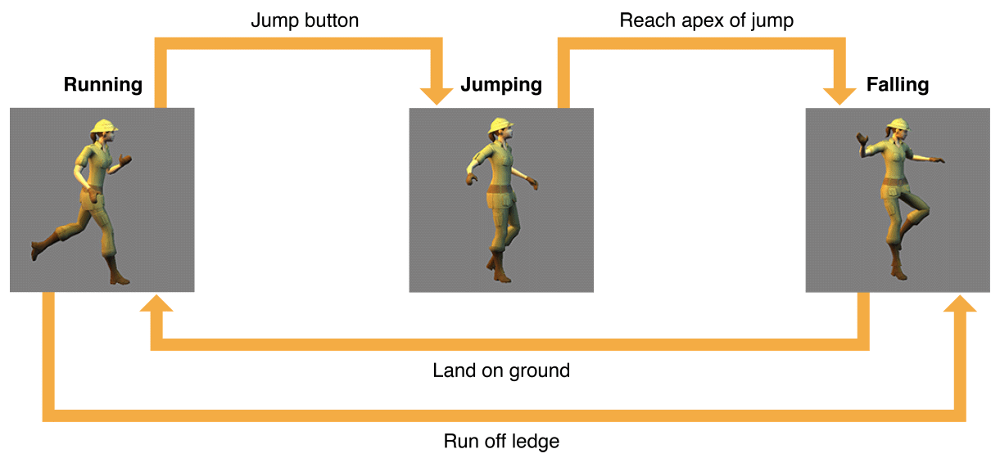
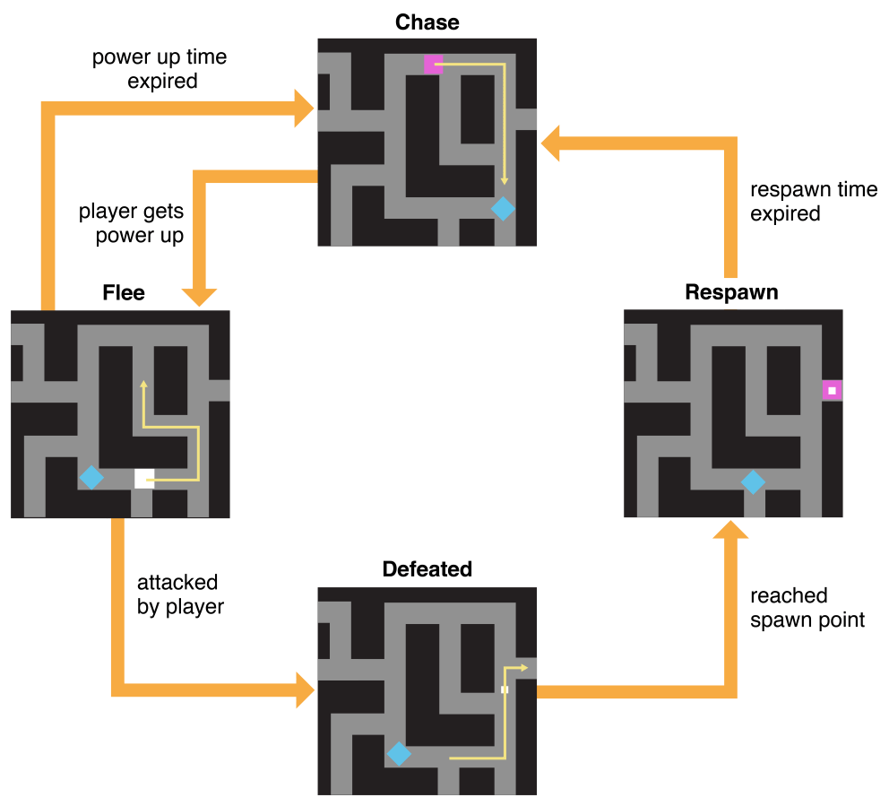
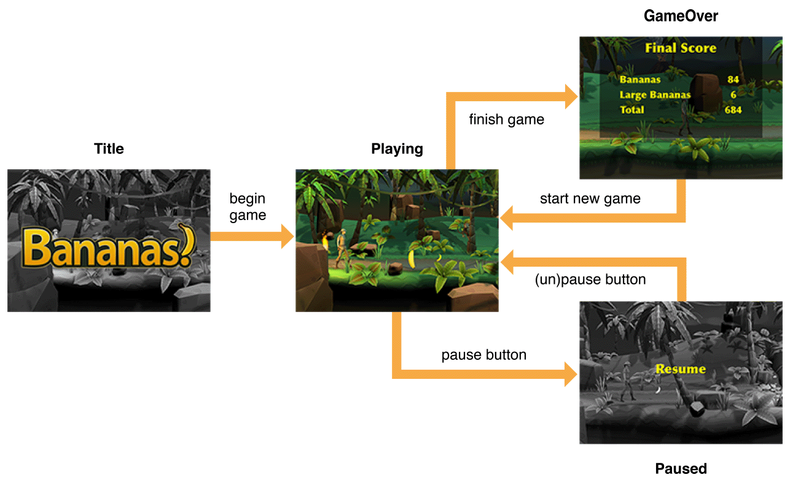

> 导航：[总目录](../../../README.md) · [documentation](../../../_indexes/documentation.md) · [GameplayKit Programming Guide](index.md)

## State Machines

In nearly all games, gameplay-related logic is highly dependent on the current state of the game. For example, animation code might change depending on whether a player character is currently walking, jumping, or standing. Enemy movement code might depend on high-level decisions made by your simulated intelligence for enemy characters, such as whether to chase a vulnerable player or flee from a strong one. Even which parts of your game should be running per-frame update code at any time might depend on whether the game is playing, paused, or in a menu or cut scene.

When you start building a game, it’s easy to put all the state-dependent code in one place—for example, in the per-frame update method of a SpriteKit game. However, as your game grows and becomes more complex, that single method can become difficult to maintain or extend further.

Instead, it can help to formally define the distinct states in your game and the rules that determine which transitions between states should be allowed. These formal definitions are called _state machines_. Then, you can associate the relevant states with any code that determines what your game does on per-frame updates while in a particular state, when to transition to another state, and what secondary actions might result from the transition. By using a state machine to organize your code, you can more easily reason about complicated behaviors in your game.

### Example: Dispenser

Before diving into the details of state machines in this chapter, you can get a quick taste of how they can simplify your game design by downloading the sample code project _[Dispenser: GameplayKit State Machine Basics](../../../samplecode/Dispenser-%20GameplayKit%20State%20Machine%20Basics/Dispenser-%20GameplayKit%20State%20Machine%20Basics.md#apple-f4xwc4dqnrsv64tfmyxwi33df52wszbpkridimbqge3dinrq)_. This simple game simulates a water dispenser, as shown in Figure 4-1. As the diagram displayed in the game shows, the dispenser can be in only one state at a time: empty, full, partially full, serving, or refilling. Using a state machine makes it easy to formalize and enforce this behavior, and also helps you organize sections of game logic that are specific to each state.

__Figure 4-1__The Dispenser Sample Code Project in Action

### Designing With State Machines

State machines can be applied to any part of your game that involves state-dependent behavior. The following examples walk through designs of several different state machines.

### A State Machine for Animation

Consider a 2D “endless running” game—in this style of game, the player character runs automatically, and the player must press a jump button to pass obstacles. Running and jumping have separate animations, and while running or jumping, the player’s position needs to be updated. This design can be expressed as a state machine with three states, illustrated in Figure 4-2.

__Figure 4-2__A State Machine for Animation

- __Running.__ While in this state, loop the run animation. If the player presses the jump button, switch to the Jump state. If the player runs off a ledge, switch to the Falling state.
- __Jumping.__ On entering this state, play a sound effect, and start a one-time jumping animation. While in this state, move the character up a short distance (per frame), decelerating with gravity. When upward speed reaches zero, switch to the Falling state.
- __Falling.__ On entering this state, start a one-time falling animation. While in this state, move the character down a short distance (per frame). On reaching the ground, switch to the Running state and play a one-time landing animation and sound effect.

### A State Machine for Enemy Behavior

Consider an arcade action game with enemy characters that pursue the player. The player can occasionally gain a power-up that makes the enemies temporarily vulnerable to attack, and defeated enemies are out of the game for some time before reappearing. Each enemy character can use its own state machine instance, with the following states, illustrated in Figure 4-3:

__Figure 4-3__A State Machine for Enemy Behavior

- __Chase.__ On entering this state, display the enemy’s normal appearance. While in this state, change position on every frame to pursue the player. If the player gains a power-up, switch to the Flee state.
- __Flee.__ On entering this state, display a vulnerable appearance. While in this state, change position on every frame to avoid the player. After some time has elapsed while in this state, return to the Chase state. If attacked by the player, switch to the Defeated state.
- __Defeated.__ On entering this state, display an animation and increment the player’s score. While in this state, move what remains of the enemy to a central location where it will later reappear. Upon reaching that position, switch to the Respawn state.
- __Respawn.__ While in this state, simply track the amount of time spent since entering. After some time has elapsed, return to the Chase state.

This state machine is further illustrated in the [Building a Game with State Machines](#apple-f4xwc4dqnrsv64tfmyxwi33df52wszbpkridimbqge2tcnzsfvbuqnznknltg) section below, as well as in the Maze sample code project.

### A State Machine for Game UI

In almost any game, a user interface depends on the state of the game, and vice versa. For example, pausing a game might show a menu screen, and while the game is paused, normal gameplay code should not take effect. You can control your game’s overall user interface with a set of states like those listed below and illustrated in Figure 4-4:

__Figure 4-4__A State Machine for Game UI

- __TitleScreen.__ The app opens in this state. Upon entering this state, display a title screen. While in this state, animate the title screen. Switch to the Playing state upon user input.
- __Playing.__ While in this state, call per-frame update logic for gameplay. Switch to the Paused state upon appropriate user input.
- __Paused.__ Upon entering this state, apply a visual effect to the game screen to indicate that gameplay is paused. Remove the effect when exiting the state. (There is no need to suspend gameplay operation during this state, as game logic is invoked only during the Playing state.) Switch back to the Playing state upon appropriate user input.
- __GameOver.__ When entering this state, display a UI that summarizes the player’s actions and score, and respond to events for operating any interactive elements in that UI. Switch to the Playing state (starting a new game) upon appropriate user input.

This sort of state machine design can be easily extended to cover many games. For example, additional Menu states could handle a complex series of menus, or a Cutscene state could run scene animations but not handle input.

### Building a Game with State Machines

In GameplayKit, a state machine is an instance of the [GKStateMachine](https://developer.apple.com/documentation/gameplaykit/gkstatemachine) class. For each state, you define the actions that occur while in that state, or when transitioning into or out of that state, by creating a custom subclass of [GKState](https://developer.apple.com/documentation/gameplaykit/gkstate). At any one time, a state machine has exactly one current state. When you perform per-frame update logic for your game objects (for example, from within the [update:](https://developer.apple.com/documentation/spritekit/skscene/1519802-update) method of a SpriteKit scene or the [renderer:updateAtTime:](https://developer.apple.com/documentation/scenekit/scnscenerendererdelegate/1522937-renderer) method of a SceneKit render delegate), call the [updateWithDeltaTime:](https://developer.apple.com/documentation/gameplaykit/gkstatemachine/1385748-update) method of the state machine, and it in turn calls the same method on its current state object. When your game logic requires a change in state, call the state machine’s [enterState:](https://developer.apple.com/documentation/gameplaykit/gkstatemachine/1385753-enterstate) method to choose a new state.

The Maze sample code project (already seen in the [Entities and Components](EntityComponent.md#apple-f4xwc4dqnrsv64tfmyxwi33df52wszbpkridimbqge2tcnzsfvbuqnrnknltc) chapter) implements a variation on several classic arcade games. This game uses a separate instance of the state machine summarized above (see [A State Machine for Enemy Behavior](#apple-f4xwc4dqnrsv64tfmyxwi33df52wszbpkridimbqge2tcnzsfvbuqnznknltm)) to drive each of several enemy characters. Normally, enemies chase the player but flee when the player gains a power-up that allows them to be defeated. When defeated, they return to a respawn point, then reappear after a short time.

> [!NOTE]
> 

### Define States and Their Behavior

Each state in the state machine is a subclass of [GKState](https://developer.apple.com/documentation/gameplaykit/gkstate) containing custom code that implements state-specific behavior. This state machine uses four state classes: `AAPLEnemyChaseState`, `AAPLEnemyFleeState`, `AAPLEnemyDefeatedState`, and `AAPLEnemyRespawnState`. All four state classes make use of general information about the game world, so all four inherit from an `AAPLEnemyState` class that defines properties and a common initializer used by all state classes in the game. Listing 4-1 summarizes the definitions of these classes.

__Listing 4-1__Enemy State Definitions

1. `@interface AAPLEnemyState : GKState`
2. `@property (weak) AAPLGame *game;`
3. `@property AAPLEntity *entity;`
4. `- (instancetype)initWithGame:(AAPLGame *)game entity:(AAPLEntity *)entity;`
5. `// ...`
6. `@end`
8. `@interface AAPLEnemyChaseState : AAPLEnemyState`
9. `@end`
11. `@interface AAPLEnemyFleeState : AAPLEnemyState`
12. `@end`
14. `@interface AAPLEnemyDefeatedState : AAPLEnemyState`
15. `@property GKGridGraphNode *respawnPosition;`
16. `@end`
18. `@interface AAPLEnemyRespawnState : AAPLEnemyState`
19. `@end`

Most of these state classes need no additional public properties—all information they need about the game comes from their reference to the main `AAPLGame` object. This reference is weak, because the state objects are owned by state machines, which in turn are owned by entities, each of which is owned by the `Game` object.

Each state class then defines state-specific behavior by overriding the [GKState](https://developer.apple.com/documentation/gameplaykit/gkstate) enter, exit, and update methods. For example, Listing 4-2 summarizes the implementation of the Flee state.

__Listing 4-2__Enemy Chase State Implementation

1. `- (BOOL)isValidNextState:(Class __nonnull)stateClass {`
2. `return stateClass == [AAPLEnemyChaseState class] ||`
3. `stateClass == [AAPLEnemyDefeatedState class];`
4. `}`
5. `- (void)didEnterWithPreviousState:(__nullable GKState *)previousState {`
6. `AAPLSpriteComponent *component = (AAPLSpriteComponent *)[self.entity componentForClass:[AAPLSpriteComponent class]];`
7. `[component useFleeAppearance];`
9. `// Choose a target location to flee towards.`
10. `// ...`
11. `}`
13. `- (void)updateWithDeltaTime:(NSTimeInterval)seconds {`
14. `// If the enemy has reached its target, choose a new target.`
15. `// ...`
17. `// Flee towards the current target point.`
18. `[self startFollowingPath:[self pathToNode:self.target]];`
19. `}`

The state machine calls a state object’s [didEnterWithPreviousState:](https://developer.apple.com/documentation/gameplaykit/gkstate/1501076-didenterwithpreviousstate) method when that state becomes the machine’s current state. In the Flee state, this method uses the game’s `SpriteComponent` class to change the appearance of the enemy character. (See the [Entities and Components](EntityComponent.md#apple-f4xwc4dqnrsv64tfmyxwi33df52wszbpkridimbqge2tcnzsfvbuqnrnknltc) chapter for discussion of this class.) This method also chooses a random location in the game level for the enemy to flee toward.

The [updateWithDeltaTime:](https://developer.apple.com/documentation/gameplaykit/gkstate/1501136-update) method is called for every frame of animation (ultimately, from the [update:](https://developer.apple.com/documentation/spritekit/skscene/1519802-update) method of the SpriteKit scene displaying the game). In this method, the Flee state continually recalculates a route to its target location and sets the enemy character moving along that route. (For a deeper discussion of this method’s implementation, see the [Pathfinding](Pathfinding.md#apple-f4xwc4dqnrsv64tfmyxwi33df52wszbpkridimbqge2tcnzsfvbuqmznknltc) chapter.)

You can enforce preconditions or invariants in your state classes by having each class override the [isValidNextState:](https://developer.apple.com/documentation/gameplaykit/gkstate/1501221-isvalidnextstate) method. In this game, the Respawn state is a valid next state only for the Defeated state—not the Chase or Flee state. Therefore, the code in the `EnemyRespawnState` class can safely assume that any side effects of the Defeated state have already occurred.

### Create and Drive a State Machine

After you define [GKState](https://developer.apple.com/documentation/gameplaykit/gkstate) subclasses, you can use them to create a state machine. In the Maze game, an `AAPLIntelligenceComponent` object manages a state machine for each enemy character. (To learn more about the component-based architecture in this game, see the [Entities and Components](EntityComponent.md#apple-f4xwc4dqnrsv64tfmyxwi33df52wszbpkridimbqge2tcnzsfvbuqnrnknltc) chapter.) Setting up a state machine is simply a matter of creating and configuring an instance of each state class, then creating a [GKStateMachine](https://developer.apple.com/documentation/gameplaykit/gkstatemachine) instance that uses those objects, as shown in Listing 4-3.

__Listing 4-3__Defining a State Machine

1. `@implementation AAPLIntelligenceComponent`
3. `- (instancetype)initWithGame:(AAPLGame *)game enemy:(AAPLEntity *)enemy startingPosition:(GKGridGraphNode *)origin {`
4. `self = [super init];`
5. `if (self) {`
6. `AAPLEnemyChaseState *chase = [[AAPLEnemyChaseState alloc] initWithGame:game entity:enemy];`
7. `AAPLEnemyFleeState *flee = [[AAPLEnemyFleeState alloc] initWithGame:game entity:enemy];`
8. `AAPLEnemyDefeatedState *defeated = [[AAPLEnemyDefeatedState alloc] initWithGame:game entity:enemy];`
9. `defeated.respawnPosition = origin;`
10. `AAPLEnemyRespawnState *respawn = [[AAPLEnemyRespawnState alloc] initWithGame:game entity:enemy];`
12. `_stateMachine = [GKStateMachine stateMachineWithStates:@[chase, flee, defeated, respawn]];`
13. `[_stateMachine enterState:[AAPLEnemyChaseState class]];`
14. `}`
15. `return self;`
16. `}`
18. `- (void)updateWithDeltaTime:(NSTimeInterval)seconds {`
19. `[self.stateMachine updateWithDeltaTime:seconds];`
20. `}`
22. `@end`

The game then creates an instance of the `AAPLIntelligenceComponent` class for each enemy character in the game. To support running per-frame update logic in each state class, the `AAPLIntelligenceComponent` class uses its [updateWithDeltaTime:](https://developer.apple.com/documentation/gameplaykit/gkcomponent/1501218-update) method to call the corresponding method on its state machine. In turn, the state machine calls the update method for whichever state object is its current state—so, for example, the per-frame update logic for the Chase state runs only when the Chase state is active.

To run the state machine through its sequence of states, call its [enterState:](https://developer.apple.com/documentation/gameplaykit/gkstatemachine/1385753-enterstate) method whenever a state change is appropriate in your game. In this example, each enemy character’s state machine starts in the Chase state. The Maze game changes states in several places:

- The main `AAPLGame` object keeps track of whether the player has the power to defeat enemy characters. When the player gains or loses this power, the `setHasPowerup:` method changes all enemies’ current state to the Flee or Chase state, respectively, as shown below:

  1. `- (void)setHasPowerup:(BOOL)hasPowerup {`
  2. `static const NSTimeInterval powerupDuration = 10;`
  3. `if (hasPowerup != _hasPowerup) {`
  4. `// Choose the Flee or Chase state depending on whether the player has a powerup.`
  5. `Class nextState;`
  6. `if (!_hasPowerup) {`
  7. `nextState = [AAPLEnemyFleeState class];`
  8. `} else {`
  9. `nextState = [AAPLEnemyChaseState class];`
  10. `}`
  11. `// Make all enemies enter the chosen state.`
  12. `for (AAPLIntelligenceComponent *component in self.intelligenceSystem) {`
  13. `[component.stateMachine enterState:nextState];`
  14. `}`
  15. `self.powerupTimeRemaining = powerupDuration;`
  16. `}`
  17. `_hasPowerup = hasPowerup;`
  18. `}`
- The `AAPLGame` object also handles physics contacts reported by SpriteKit. When the player character collides with an enemy character, the game first uses that enemy’s current state to determine the outcome of their interaction. If the enemy is in the Flee state, the player defeats that enemy, which transitions into its Defeated state.
- The `AAPLEnemyDefeatedState` class moves a defeated enemy back to its starting position, then switches to the Respawn state. To accomplish these tasks, the Defeated state finds a path to the starting position, then uses the game’s `AAPLSpriteComponent` class to generate an [SKAction](https://developer.apple.com/documentation/spritekit/skaction) sequence. This sequence moves the enemy character along the path, and after all of its move actions are complete—that is, the character is at the end of the path—it switches to the Respawn state.

  For details on pathfinding and this game’s `AAPLSpriteComponent` class, see the [Pathfinding](Pathfinding.md#apple-f4xwc4dqnrsv64tfmyxwi33df52wszbpkridimbqge2tcnzsfvbuqmznknltc) and [Entities and Components](EntityComponent.md#apple-f4xwc4dqnrsv64tfmyxwi33df52wszbpkridimbqge2tcnzsfvbuqnrnknltc) chapters.
- The `AAPLEnemyRespawnState` class handles the wait time for each defeated enemy before it returns to play. This state class uses its [updateWithDeltaTime:](https://developer.apple.com/documentation/gameplaykit/gkstate/1501136-update) method to test an elapsed time property and switch to the Chase state accordingly:

  1. `- (void)updateWithDeltaTime:(NSTimeInterval)seconds {`
  2. `self.timeRemaining -= seconds;`
  3. `if (self.timeRemaining < 0) {`
  4. `[self.stateMachine enterState:[AAPLEnemyChaseState class]];`
  5. `}`
  6. `}`

[Entities and Components](EntityComponent.md#apple-f4xwc4dqnrsv64tfmyxwi33df52wszbpkridimbqge2tcnzsfvbuqnrnknltc)

[The Minmax Strategist](Minmax.md#apple-f4xwc4dqnrsv64tfmyxwi33df52wszbpkridimbqge2tcnzsfvbuqmrnknltc)
