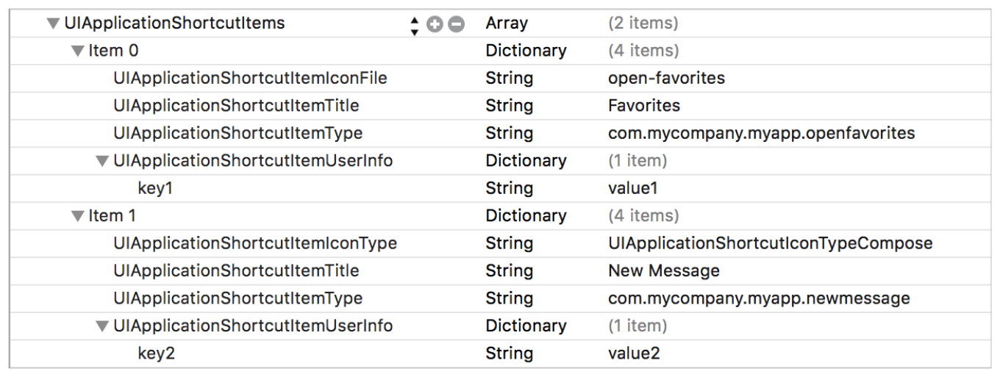

> 导航：[总目录](../../../README.md) · [documentation](../../../_indexes/documentation.md) · [Information Property List Key Reference](About%20Info.plist%20Keys%20and%20Values.md)


[Next](watchOS%20Keys.md)[Previous](macOS%20Keys.md)

# iOS Keys

The iOS frameworks provide the infrastructure you need for creating iOS apps. You use the keys associated with this framework to configure the appearance of your app at launch time and the behavior of your app once it is running.

UIKit keys use the prefix `UI` to distinguish them from other keys. Other frameworks also use appropriate prefixes. Several `Info.plist` keys for iOS, tvOS, and watchOS employ the `NS` prefix and are described in the [Cocoa Keys](Cocoa%20Keys.md#apple-f4xwc4dqnrsv64tfmyxwi33df52wszbpkridimbqga4tenjrfvjvomi) chapter in this document.

For more information about configuring the information property-list file of your iOS app, see _[App Programming Guide for iOS](https://developer.apple.com/library/archive/documentation/iPhone/Conceptual/iPhoneOSProgrammingGuide/Introduction/Introduction.html#//apple_ref/doc/uid/TP40007072)_.

Table 1 contains an alphabetical listing of iOS keys, the corresponding name for that key in the Xcode property list editor, a high-level description of each key, and the platforms on which you use it. Detailed information about each key is available in later sections.

__Table 1__  Summary of UIKit keys

| Key | Xcode name | Summary | Availability |
| CoreSpotlightContinuation | (none) | Specifies whether the app supports Spotlight query continuation. See [CoreSpotlightContinuation](#apple-f4xwc4dqnrsv64tfmyxwi33df52wszbpkridimbqga4tenjsfvjvonbt) for details. | iOS 10.0 and later |
| INAlternativeAppNames | (none) | Specifies alternative names by which users can refer to the app in Siri. See [INAlternativeAppNames](#apple-f4xwc4dqnrsv64tfmyxwi33df52wszbpkridimbqga4tenjsfvjvomrw) for details. | iOS 11.0 and later |
| MKDirectionsApplicationSupportedModes | (none) | Specifies the types of directions the app can deliver. See [MKDirectionsApplicationSupportedModes](#apple-f4xwc4dqnrsv64tfmyxwi33df52wszbpkridimbqga4tenjsfvjvomzt) for details. | iOS 6.0 and later |
| UIAppFonts | “Fonts provided by application” | Specifies a list of app-specific fonts. See [UIAppFonts](#apple-f4xwc4dqnrsv64tfmyxwi33df52wszbpkridimbqga4tenjsfvjvomjy) for details. | iOS 3.2 and later |
| UIApplicationExitsOnSuspend | “Application does not run in background” | Specifies whether the app terminates instead of run in the background. See [UIApplicationExitsOnSuspend](#apple-f4xwc4dqnrsv64tfmyxwi33df52wszbpkridimbqga4tenjsfvjvomrt) for details. | iOS 4.0 and later |
| UIApplicationShortcutItems | (none) | Specifies the static Home screen quick actions for the app. See [UIApplicationShortcutItems](#apple-f4xwc4dqnrsv64tfmyxwi33df52wszbpkridimbqga4tenjsfvjvomzw) for details. | iOS 9.0 and later |
| UIApplicationShortcutWidget | (none) | Specifies the bundle ID of the widget to be available as a Home screen quick action, for apps that have more than one widget. See [UIApplicationShortcutWidget](#apple-f4xwc4dqnrsv64tfmyxwi33df52wszbpkridimbqga4tenjsfvjvomzs) for details. | iOS 10.0 and later |
| UIAppSupportsHDR | "Supports HDR color mode” | Specifies whether the app supports HDR mode on Apple TV 4K. See [UIAppSupportsHDR](#apple-f4xwc4dqnrsv64tfmyxwi33df52wszbpkridimbqga4tenjsfvjvomzy) for details. | tvOS 11.2 and later |
| UIBackgroundModes | “Required background modes” | Specifies that the app needs to continue running in the background. See [UIBackgroundModes](#apple-f4xwc4dqnrsv64tfmyxwi33df52wszbpkridimbqga4tenjsfvjvomrs) for details. | iOS 4.0 and later, watchOS 4.0 and later |
| UIDeviceFamily | “Targeted device family” | Inserted automatically by Xcode to define the target device of the app. See [UIDeviceFamily](#apple-f4xwc4dqnrsv64tfmyxwi33df52wszbpkridimbqga4tenjsfvjvomjr) for details. | iOS 3.2 and later |
| UIFileSharingEnabled | “Application supports iTunes file sharing” | Specifies whether the app shares files with the user’s computer through iTunes. See [UIFileSharingEnabled](#apple-f4xwc4dqnrsv64tfmyxwi33df52wszbpkridimbqga4tenjsfvjvomrq) for details. | iOS 3.2 and later |
| UIInterfaceOrientation | “Initial interface orientation” | Specifies the initial orientation of the app’s user interface. See [UIInterfaceOrientation](#apple-f4xwc4dqnrsv64tfmyxwi33df52wszbpkridimbqga4tenjsfvjvomjt) for details. | iOS |
| UILaunchImageFile | “Launch image” | Specifies the name of the app’s launch image. See [UILaunchImageFile](#apple-f4xwc4dqnrsv64tfmyxwi33df52wszbpkridimbqga4tenjsfvjvomru) for details. | iOS 3.2 and later |
| UILaunchImages | (none) | Specifies the launch images to use for the app. See [UILaunchImages](#apple-f4xwc4dqnrsv64tfmyxwi33df52wszbpkridimbqga4tenjsfvjvomry) for details. | iOS 7.0 and later |
| UILaunchStoryboardName | (none) | Specifies the storyboard from which to generate a launch image to use for the app. See [UILaunchStoryboardName](#apple-f4xwc4dqnrsv64tfmyxwi33df52wszbpkridimbqga4tenjsfvjvonbq) for details. | iOS 9.0 and later |
| UILaunchStoryboards | (none) | Specifies information about multiple storyboards from which to generate launch images for an app. See [UILaunchStoryboards](#apple-f4xwc4dqnrsv64tfmyxwi33df52wszbpkridimbqga4tenjsfvjvonbr) for details. | iOS 9.0 and later |
| UINewsstandApp | (none) | Specifies whether the app presents its content in Newsstand. See [UINewsstandApp](#apple-f4xwc4dqnrsv64tfmyxwi33df52wszbpkridimbqga4tenjsfvjvomrv) for details. | iOS 5.0 and later |
| UIPrerenderedIcon | “Icon already includes gloss effects” | Specifies whether the app’s icon already includes a shine effect. See [UIPrerenderedIcon](#apple-f4xwc4dqnrsv64tfmyxwi33df52wszbpkridimbqga4tenjsfvjvomjw) for details. | iOS |
| UIRequiredDeviceCapabilities | “Required device capabilities” | Specifies the device-related features required for the app to run. See [UIRequiredDeviceCapabilities](#apple-f4xwc4dqnrsv64tfmyxwi33df52wszbpkridimbqga4tenjsfvjvomy) for details. | iOS 3.0 and later |
| UIRequiresPersistentWiFi | “Application uses Wi-Fi” | Specifies whether this app requires a Wi-Fi connection. See [UIRequiresPersistentWiFi](#apple-f4xwc4dqnrsv64tfmyxwi33df52wszbpkridimbqga4tenjsfvjvomjs) for details. | iOS |
| UIStatusBarHidden | “Status bar is initially hidden” | Specifies whether the status bar is initially hidden when the app launches. See [UIStatusBarHidden](#apple-f4xwc4dqnrsv64tfmyxwi33df52wszbpkridimbqga4tenjsfvjvomjv) for details. | iOS |
| UIStatusBarStyle | “Status bar style” | Specifies the style of the status bar as the app launches. See [UIStatusBarStyle](#apple-f4xwc4dqnrsv64tfmyxwi33df52wszbpkridimbqga4tenjsfvjvomju) for details. | iOS |
| UISupportedExternalAccessoryProtocols | “Supported external accessory protocols” | Specifies the communications protocols supported for communication with attached hardware accessories. See [UISupportedExternalAccessoryProtocols](#apple-f4xwc4dqnrsv64tfmyxwi33df52wszbpkridimbqga4tenjsfvjvona) for details. | iOS 3.0 and later |
| UISupportedInterfaceOrientations | “Supported interface orientations” | Specifies the interface orientations that the app supports. See [UISupportedInterfaceOrientations](#apple-f4xwc4dqnrsv64tfmyxwi33df52wszbpkridimbqga4tenjsfvjvomjq) for details. | iOS 3.2 and later |
| UISupportsDocumentBrowser | “Supports Document Browser” | Specifies that the app is a document-based app. See [UISupportsDocumentBrowser](#apple-f4xwc4dqnrsv64tfmyxwi33df52wszbpkridimbqga4tenjsfvjvomzx) for details. | iOS 11.0 and later |
| UIUserInterfaceStyle | “User Interface Style” | Specifies the preferred user interface appearance—light or dark—for a tvOS app. See [UIUserInterfaceStyle](#apple-f4xwc4dqnrsv64tfmyxwi33df52wszbpkridimbqga4tenjsfvjvonbu) for details. | tvOS 10.0 and later |
| UIViewControllerBasedStatusBarAppearance | (none) | Specifies whether the view controller determines the status bar style. See [UIViewControllerBasedStatusBarAppearance](#apple-f4xwc4dqnrsv64tfmyxwi33df52wszbpkridimbqga4tenjsfvjvomrz) for details. | iOS 7.0 and later |
| UIViewEdgeAntialiasing | “Renders with edge antialiasing” | Specifies whether Core Animation layers use antialiasing when drawing does not align to pixel boundaries. See [UIViewEdgeAntialiasing](#apple-f4xwc4dqnrsv64tfmyxwi33df52wszbpkridimbqga4tenjsfvjvoni) for details. | iOS 3.0 and later |
| UIViewGroupOpacity | “Renders with group opacity” | Specifies whether Core Animation layers inherit the opacity of their superlayer. See [UIViewGroupOpacity](#apple-f4xwc4dqnrsv64tfmyxwi33df52wszbpkridimbqga4tenjsfvjvonq) for details. | iOS 3.0 and later |
| UIWhitePointAdaptivityStyle | (none) | Specifies the app’s white point adaptivity style, for use on devices with True Tone displays. See [UIWhitePointAdaptivityStyle](#apple-f4xwc4dqnrsv64tfmyxwi33df52wszbpkridimbqga4tenjsfvjvomzr) for details. | iOS 9.3 and later |

`CoreSpotlightContinuation` (`Boolean` - iOS) To declare that your app supports Spotlight query continuation, add this key to your app’s `Info.plist` file with a value of `YES`.

When continuing a query from Spotlight, the system calls the following two app delegate methods in sequence:

1. The system first calls the [application:willContinueUserActivityWithType:](https://developer.apple.com/documentation/uikit/uiapplicationdelegate/1622919-application) method, passing a [CSQueryContinuationActionType](https://developer.apple.com/documentation/corespotlight/csquerycontinuationactiontype) constant to the _userActivityType_ parameter.
2. Next, the system calls the [application:continueUserActivity:restorationHandler:](https://developer.apple.com/documentation/uikit/uiapplicationdelegate/1623072-application) method, passing an [NSUserActivity](https://developer.apple.com/documentation/foundation/nsuseractivity) object to the _userActivity_ parameter.

   The [userInfo](https://developer.apple.com/documentation/foundation/nsuseractivity/1411706-userinfo) dictionary (of the `NSUserActivity` object) has a key-value pair in which the key is a `CSSearchQueryString` constant and the value is the string the app should use when performing its query

This key is supported in iOS 10.0 and later.

`INAlternativeAppNames` (`Array` - iOS) Specifies the alternative names by which users may refer to the app in Siri. Use this key to specify common synonyms by which users refer to your app. (To learn more about how to do this, see [Specifying Synonyms for Your App Name](https://developer.apple.com/documentation/sirikit/registering_custom_vocabulary_with_sirikit/specifying_synonyms_for_your_app_name).) The value of this key is an array of no more than three dictionaries, each of which contains contains the following keys:

- `INAlternativeAppName`. (Required) Specifies the alternative name by which users may refer to the app in Siri. The value of this key can be localized.
- `INAlternativeAppNamePronunciationHint`. (Optional) Specifies a pronunciation hint for the app name, formatted in a “sounds like” format. The value of this key can be localized.

Siri recognizes alternative app names only for apps that include an Intents app extension with support for one or more intents. Apps must not use this key to divert Siri requests from other apps on the system. It is a programmer error to include more than three entries (per localized version of your `Info.plist` file) in the array for this key.

This key is supported in iOS 11.0 and later.

`MKDirectionsApplicationSupportedModes` (`Array` - iOS) Specifies the modes of transportation for which the app is capable of giving directions. The array contains one or more strings, each of which indicates a supported mode. Apps may include the following strings in this array:

- `MKDirectionsModeCar`
- `MKDirectionsModeBus`
- `MKDirectionsModeTrain`
- `MKDirectionsModeSubway`
- `MKDirectionsModeStreetCar`
- `MKDirectionsModePlane`
- `MKDirectionsModeBike`
- `MKDirectionsModeFerry`
- `MKDirectionsModeTaxi`
- `MKDirectionsModePedestrian`
- `MKDirectionsModeRideShare`
- `MKDirectionsModeOther`

If this key is in your app’s `Info.plist` file, you must upload a GeoJSON file to App Store Connect that indicates the regions for which your app is capable of providing directions. For more information about specifying this file, see _[Location and Maps Programming Guide](../../User%20Experience/Location%20and%20Maps%20Programming%20Guide/About%20Location%20Services%20and%20Maps.md#apple-f4xwc4dqnrsv64tfmyxwi33df52wszbpkridimbqga4tiojx)_.

This key is supported in iOS 6.0 and later.

`UIAppFonts` (`Array` - iOS) Specifies any app-provided fonts that should be made available through the normal mechanisms. Each item in the array is a string containing the name of a font file (including filename extension) that is located in the app’s bundle. The system loads the specified fonts and makes them available for use by the app when that app is run.

This key is supported in iOS 3.2 and later.

`UIApplicationExitsOnSuspend` (`Boolean` - iOS) Specifies that the app should be terminated rather than moved to the background when it is quit. Apps linked against iOS SDK 4.0 or later can include this key and set its value to `YES` to prevent being automatically opted-in to background execution and app suspension. When the value of this key is `YES`, the app is terminated and purged from memory instead of moved to the background. If this key is not present, or is set to `NO`, the app moves to the background as usual.

This key is supported in iOS 4.0 and later.

`UIApplicationShortcutItems` (`Array` - iOS) Specifies the static Home screen quick actions for the app. This key contains an array of dictionaries. Each dictionary contains detailed information about a single quick action and how it is used.

You can specify static quick actions for your app as an array of dictionaries. The number of quick actions shown for your app on the Home screen, when the user presses your Home screen icon on a device that supports 3D Touch, is determined by the system.

The static quick actions you define in your `Info.plist` file are shown on the Home screen in the same order they appear in the file. The system populates the set of Home screen quick actions first with your static quick actions, and only if there are additional slots available does it also show your defined dynamic quick actions. For more information on dynamic quick actions, see _[Adopting 3D Touch on iPhone](https://developer.apple.com/library/archive/documentation/UserExperience/Conceptual/Adopting3DTouchOniPhone/index.html#//apple_ref/doc/uid/TP40016543)_.

The following screenshot shows an example definition of two static quick actions in the Xcode property list editor:



The following code listing shows the example definition as they appear in the corresponding property list file:

```
<key>UIApplicationShortcutItems</key>
    <array>
        <dict>
            <key>UIApplicationShortcutItemIconFile</key>
            <string>open-favorites</string>
            <key>UIApplicationShortcutItemTitle</key>
            <string>Favorites</string>
            <key>UIApplicationShortcutItemType</key>
            <string>com.mycompany.myapp.openfavorites</string>
            <key>UIApplicationShortcutItemUserInfo</key>
            <dict>
                <key>key1</key>
                <string>value1</string>
            </dict>
        </dict>
        <dict>
            <key>UIApplicationShortcutItemIconType</key>
            <string>UIApplicationShortcutIconTypeCompose</string>
            <key>UIApplicationShortcutItemTitle</key>
            <string>New Message</string>
            <key>UIApplicationShortcutItemType</key>
            <string>com.mycompany.myapp.newmessage</string>
            <key>UIApplicationShortcutItemUserInfo</key>
            <dict>
                <key>key2</key>
                <string>value2</string>
            </dict>
        </dict>
    </array>
```

When a user chooses one of your Home screen quick actions, the system launches or resumes your app and UIKit calls the [application:performActionForShortcutItem:completionHandler:](https://developer.apple.com/documentation/uikit/uiapplicationdelegate/1622935-application) method in your app delegate. Be sure to read the description of that method in _[UIApplicationDelegate Protocol Reference](https://developer.apple.com/documentation/uikit/uiapplicationdelegate)_ for information on how to ensure the method is called only when it should be.

To retrieve the attributes of a received quick action, use the `UIApplicationLaunchOptionsShortcutItemKey` launch option key, described in _[UIApplicationDelegate Protocol Reference](https://developer.apple.com/documentation/uikit/uiapplicationdelegate)_. The value of this key is a [UIApplicationShortcutItem](https://developer.apple.com/documentation/uikit/uiapplicationshortcutitem) object. The attributes of the received quick action are available in the object properties.

Table 2 lists the keys that can be included in each dictionary of the array.

__Table 2__  Keys for Home screen quick actions, also known as shortcut items

| Key | Description |
| `UIApplicationShortcutItemType` (required) | A required string delivered to your app when the user invokes the corresponding quick action. Your app can use this string to classify quick actions into types, and then to disambiguate among action types it receives. You don’t need to register your quick action types. |
| `UIApplicationShortcutItemTitle` (required) | A string displayed to the user on the Home screen as the name of the quick action.  If the title fits on one line, the system displays it as a single line quick action item. If the title is too long for one line and you have not specified a `UIApplicationShortcutItemSubtitle` string, the system displays the title on two lines.  You can, optionally, internationalize a quick action title by employing your app’s `InfoPlist.strings` file. For guidance on how to do this, read [Localizing Property List Values](About%20Information%20Property%20List%20Files.md#apple-f4xwc4dqnrsv64tfmyxwi33df52wszbpkridimbqga4tenjufuytamrsg43a). |
| `UIApplicationShortcutItemSubtitle` | An optional string that is displayed to the user on the Home screen, immediately below the corresponding title string.  If you specify a subtitle for a quick action, the system displays the quick action title on a single line (perhaps just a portion of the title, followed by ellipsis character), no matter how long the title is.  You can, optionally, internationalize a quick action subtitle by employing your app’s `InfoPlist.strings` file. For guidance on how to do this, read [Localizing Property List Values](About%20Information%20Property%20List%20Files.md#apple-f4xwc4dqnrsv64tfmyxwi33df52wszbpkridimbqga4tenjufuytamrsg43a). |
| `UIApplicationShortcutItemIconType` | An optional string specifying the type of an icon from the system-provided library; see the [UIApplicationShortcutIconType](https://developer.apple.com/documentation/uikit/uiapplicationshortcuticon/icontype) enumeration in _[UIApplicationShortcutIcon Class Reference](https://developer.apple.com/documentation/uikit/uiapplicationshortcuticon)_. The icon is displayed in the set of quick actions for your app, along with the quick action's title, on the Home screen. |
| `UIApplicationShortcutItemIconFile` | An optional string specifying an icon image to use from the app’s bundle, or the name of an image in an asset catalog. The icon is displayed before quick action title on the Home screen.  Icons should be square, single color, and 35x35 points, as shown in these [template files](https://developer.apple.com/design/downloads/Quick-Action-Guides.zip) (未归档：ZIP 按安全策略跳过) and as described in _iOS Human Interface Guidelines_.  If you specify this key, the system ignores the `UIApplicationShortcutItemIconType` key. |
| `UIApplicationShortcutItemUserInfo` | An optional, app-defined dictionary. One use for this dictionary is to provide app version information, as described in the “App Launch and App Update Considerations for Quick Actions” section of the overview in _[UIApplicationShortcutItem Class Reference](https://developer.apple.com/documentation/uikit/uiapplicationshortcutitem)_. |

This key is supported in iOS 9.0 and later for devices that support 3D Touch.

`UIApplicationShortcutWidget` (`String` - iOS) Specifies the bundle ID of the widget to be available as a Home screen quick action, for apps that have more than one widget.

Home screen quick actions, in iOS 10.0 and later, include up to one quick action to provides fast user access to an app’s contained widget app extension. If you provide more than one widget with your app, employ this key to identify which widget should be available on the Home screen.

This key is supported in iOS 10.0 and later.

`UIAppSupportsHDR` (`Boolean` - tvOS) Specifies whether the app supports HDR mode on Apple TV 4K. If the key's value is `NO` and Apple TV 4K is in HDR mode, Apple TV switches to SDR mode before launching the app, and it switches back to HDR mode when the app resigns. If the key is not present or its value is `YES`, the device remains in HDR mode when the app launches.

HDR mode on Apple TV 4K uses the GPU to compose the content that appears on the screen. GPU bound apps, such as games, can access more of the GPU by opting out of HDR support, that is, setting `UIAppSupportsHDR` to `NO`. However, switching between HDR and SDR modes may cause color flashing to appear on the screen. Apps should only opt out when absolutely necessary.

This key is supported in tvOS 11.2 and later.

`UIBackgroundModes` (`Array` - iOS, watchOS) Specifies that the app provides specific background services and must be allowed to continue running while in the background. These keys should be used sparingly and only by apps providing the indicated services. Where alternatives for running in the background exist, those alternatives should be used instead. For example, apps can use the signifiant location change interface to receive location events instead of registering as a background location app.

Table 3 lists the possible string values that you can put into the array associated with this key. You can include any or all of these strings but your app must provide the indicated services.

__Table 3__  Values for the `UIBackgroundModes` array

| Value | Description |
| `audio` | The app plays audible content in the background.  For watchOS 3, including this key allows a workout app, with an active [HKWorkoutSession](https://developer.apple.com/documentation/healthkit/hkworkoutsession) object, to provide audio playback while the app runs in the background.  In watchOS 4 and later, you no longer need the key to play audio in the background. Instead, your app can play audio as long as it has an active workout or location session.  Additionally, all watchOS 4 apps can record audio in the background. You must start recording in the foreground, but recording continues when the app transitions to the background. |
| `location` | The app provides location-based information to the user and requires the use of the standard location services (as opposed to the significant change location service) to implement this feature.  For watchOS, this value is supported in watchOS 4.0 and later. |
| `voip` | The app provides Voice-over-IP services. Apps with this key are automatically launched after system boot so that the app can reestablish VoIP services. Apps with this key are also allowed to play background audio. |
| `fetch` | The app requires new content from the network on a regular basis. When it is convenient to do so, the system launches or resumes the app in the background and gives it a small amount of time to download any new content.  This value is supported in iOS 7.0 and later. |
| `remote-notification` | The app uses remote notifications as a signal that there is new content available for download. When a remote notification arrives, the system launches or resumes the app in the background and gives it a small amount of time to download the new content.  This value is supported in iOS 7.0 and later. |
| `newsstand-content` | The app processes content that was recently downloaded in the background using the Newsstand Kit framework, so that the content is ready when the user wants it.  This value is supported in iOS 5.0 and later. |
| `external-accessory` | The app communicates with an accessory that delivers data at regular intervals.  This value is supported in iOS 5.0 and later. |
| `bluetooth-central` | The app uses the CoreBluetooth framework to communicate with a Bluetooth accessory while in the background.  This value is supported in iOS 5.0 and later. |
| `bluetooth-peripheral` | The app uses the CoreBluetooth framework to communicate in peripheral mode with a Bluetooth accessory. The system will alert the user to the potential privacy implications of apps with this key set. See [Best Practices for Maintaining User Privacy](https://developer.apple.com/library/archive/documentation/iPhone/Conceptual/iPhoneOSProgrammingGuide/TheAppLifeCycle/TheAppLifeCycle.html#//apple_ref/doc/uid/TP40007072-CH2-SW7) for more information on privacy.  This value is supported in iOS 6.0 and later. |

This key is supported in iOS 4.0 and later, and watchOS 4.0 and later.

`UIDeviceFamily` (`Number` or `Array` - iOS) Specifies the underlying hardware type on which this app is designed to run.

The value of this key is usually an integer but it can also be an array of integers. Table 4 lists the possible integer values you can use and the corresponding devices.

__Table 4__  Values for the `UIDeviceFamily` key

| Value | Description |
| 1 | (Default) The app runs on iPhone and iPod touch devices. |
| 2 | The app runs on iPad devices. |

This key is supported in iOS 3.2 and later.

`UIFileSharingEnabled` (`Boolean` - iOS) Specifies whether the app shares files through iTunes. If this key is `YES`, the app shares files. If it is not present or is `NO`, the app does not share files. Apps must put any files they want to share with the user in their _<Application_Home>_`/Documents` directory, where _<Application_Home>_ is the path to the app’s home directory.

In iTunes, the user can access an app’s shared files from the File Sharing section of the Apps tab for the selected device. From this tab, users can add and remove files from the directory.

In iOS 11 and later, if both this key and the [LSSupportsOpeningDocumentsInPlace](Launch%20Services%20Keys.md#apple-f4xwc4dqnrsv64tfmyxwi33df52wszbpkridimbqga4tenjqfvjvomjt) key are `YES`, the local file provider grants access to all the documents in the app’s `Documents` directory. These documents appear in the Files app, and in a Document Browser. Users can open and edit these document in place.

This key is supported in iOS 3.2 and later.

`UIInterfaceOrientation` (`String` - iOS) Specifies the initial orientation of the app’s user interface. This key is ignored if the [UISupportedInterfaceOrientations](#apple-f4xwc4dqnrsv64tfmyxwi33df52wszbpkridimbqga4tenjsfvjvomjq) key is present.

This value is based on the [UIInterfaceOrientation](https://developer.apple.com/documentation/uikit/uiinterfaceorientation) constants declared in the `UIApplication.h` header file. The default style is [UIInterfaceOrientationPortrait](https://developer.apple.com/documentation/uikit/uiinterfaceorientation/portrait).

`UILaunchImageFile` (`String` - iOS) Specifies the name of the launch image file for the app on older versions of iOS. If this key and the [UILaunchImages](#apple-f4xwc4dqnrsv64tfmyxwi33df52wszbpkridimbqga4tenjsfvjvomry) key are both present, the app uses the UILaunchImages key. If neither key is present, the system looks for a launch image file with the name `Default.png`.

This key is supported in iOS 3.2 and later.

The name of each launch image conveys its purpose and how it is used. It is recommended that you use the following format for launch image filenames:

_<basename>__<usage_specific_modifiers>_`.png`

The _<basename>_ portion of the filename is the string that you specify using the `UILaunchImageFile` key. (If you do not specify the key, iOS uses the string `Default` for the launch image name.) To the base name, you can add several different types of modifiers:

- __High-resolution image modifier__—Use the `@2x` modifier to identify images that are intended for Retina displays.
- __Platform-specific modifiers__—Use the modifiers `~iphone` or `~ipad` to specify images targeting a specific size of device.
- __Orientation-specific modifiers__—Use the strings `-Landscape`, `-Portrait`, `-LandscapeLeft`, `-LandscapeRight`, or `-PortraitUpsideDown` to specify launch images when the device is in a specific orientation. More specific orientation modifiers take precedence over less-specific orientation modifiers. For example, an image with the `-LandscapeLeft` modifier takes precedence over an image with the `-Landscape` modifier when the device is in the correct orientation.
- __iPhone 5 modifier__—Use the string `-568h` to specify a launch image intended for devices whose screen is 568 points high. Because such devices also have Retina displays, you should also include the `@2x` modifier in the image name.
- __URL scheme modifiers__—Include the name of your app’s custom URL scheme in launch image names if you want those launch images displayed when your app is launched to open a URL of the specified type. The format of a scheme modifier is `-`_<url_scheme>_ where _<url_scheme>_ is your custom scheme name. For example, if your app opens URLs of the form `myscheme://example.com`, you would include `-myscheme` in your launch image names.

`UILaunchImages` (`Array` - iOS) Explicitly specifies the launch images to use for the app. This key contains an array of dictionaries. Each dictionary contains detailed information about a single launch image and how it is used. Xcode fills in the value of each dictionary based on information you provide in your project settings.

Table 5 lists the keys that can be included in each dictionary of the array.

__Table 5__  Keys for launch image dictionaries

| Key | Description |
| `UILaunchImageName` (required) | A string containing the name of the PNG image file. The image file must reside at the top level of the app bundle. The name you specify for this key should not include a filename extension, nor should it include modifiers such as `@2x`, `-568h`, `~iphone`, or `~ipad`.  On disk, your image filenames may still include the `@2x`, `-568h`, `~iphone`, or `~ipad` modifiers as appropriate, although they are not required. The system automatically considers such modifiers when choosing which file to load. |
| `UILaunchImageMinimumOSVersion` (required) | A string representing the minimum iOS version number for which the image is intended. The form of the version number is the same as for the [LSMinimumSystemVersion](Launch%20Services%20Keys.md#apple-f4xwc4dqnrsv64tfmyxwi33df52wszbpgiydambrgqztcljrgeztenjt) key, which is a string of the form _n_._n_._n_ where _n_ is a number. For example, images targeting iOS 7 and later should specify a string “7.0”. |
| `UILaunchImageSize` | A string containing the width and height of the image. This string represents the size of the display for which the image is intended. You must specify the width and height with respect to the device in a portrait orientation. In other words, portrait and landscape images targeting the same device would have the same width and height.  The format of this string is `{`_width_`,` _height_`}` where width and height are the size of the image in points. (The format of this string is the same as that generated by the [NSStringFromCGSize](https://developer.apple.com/documentation/uikit/1624514-nsstringfromcgsize) function.) For example, the string `{320, 480}` specifies an image that can be used on an iPhone 4 or iPhone 4S.  If you do not specify this key, the image size is assumed to be `{320, 480}`. |
| `UILaunchImageOrientation` | A string containing the orientation of the image. The value of this key is one of the following values:   - `Portrait` - `PortraitUpsideDown` - `Landscape` - `LandscapeLeft` - `LandscapeRight`   If you do not specify a value for this key, the orientation is assumed to be `Portrait`. |

If this key is present, iOS 7 uses it exclusively to obtain launch images. The system does not fall back to the older naming conventions used prior to iOS 7.

This key is supported in iOS 7.0 and later.

`UILaunchStoryboardName` (`String` - iOS) Specifies the filename of the storyboard from which to generate your app’s launch image. (If you want to use multiple storyboards to generate different launch images, use [UILaunchStoryboards](#apple-f4xwc4dqnrsv64tfmyxwi33df52wszbpkridimbqga4tenjsfvjvonbr).)

This key is supported in iOS 9 and later.

`UILaunchStoryboards` (`Dictionary` - iOS) Specifies information about the storyboards from which to generate launch images for your app. Use this key to support multiple launch storyboards—for example, to support opening your app through various URL schemes. If you don’t need more than one launch storyboard, you can continue to use [UILaunchStoryboardName](#apple-f4xwc4dqnrsv64tfmyxwi33df52wszbpkridimbqga4tenjsfvjvonbq) instead.

This key is a dictionary that takes the following keys:

| Key | Description |
| --- | --- |
| `UILaunchStoryboardDefinitions` | A dictionary that identifies launch storyboards. Valid keys for this dictionary are:   - `UILaunchStoryboardIdentifier`—A string that contains the name you use in your code to identify a specific launch storyboard - `UILaunchStoryboardFile`— A string that contains the filename that identifies a specific launch storyboard in your app’s bundle (the extension is not required). |
| `UIDefaultLaunchStoryboard` | A string that specifies the identifier (not the filename) of one of the storyboard files listed in the `UILaunchStoryboardDefinitions` dictionary to use as the default launch interface for your app. |
| `UIURLToLaunchStoryboardAssociations` | A dictionary containing keys that identify URL schemes corresponding to the values of the `CFBundleURLSchemes` key in the [CFBundleURLTypes](Core%20Foundation%20Keys.md#apple-f4xwc4dqnrsv64tfmyxwi33df52wszbpgiydambrgqztcljrgazdembx) array. The values should be the identifiers of storyboards in the `UILaunchStoryboardDefinitions` dictionary. |

This key is supported in iOS 9 and later.

`UIMainStoryboardFile` (`String` - iOS) Contains a string with the name of the app’s main storyboard file (minus the `.storyboard` extension). A storyboard file is an Interface Builder archive containing the app’s view controllers, the connections between those view controllers and their immediate views, and the segues between view controllers. When this key is present, the main storyboard file is loaded automatically at launch time and its initial view controller installed in the app’s window.

This key is mutually exclusive with the [NSMainNibFile](Cocoa%20Keys.md#apple-f4xwc4dqnrsv64tfmyxwi33df52wszbpgiydambrgqztcljrga3temrr) key. You should include one of the keys in your `Info.plist` file but not both. This key is supported in iOS 5.0 and later.

`UINewsstandApp` (`Boolean` - iOS) Specifies the whether the app presents its content in Newsstand. Publishers of newspaper and magazine content use the Newsstand Kit framework to handle the downloading of new issues. However, instead of those apps showing up on the user’s Home screen, they are collected and presented through Newsstand. This key identifies the apps that should be presented that way.

Such apps must also provide default Newsstand icons as described in [Contents of the UINewsstandIcon Dictionary](Core%20Foundation%20Keys.md#apple-f4xwc4dqnrsv64tfmyxwi33df52wszbpkridimbqga4tenbzfvjvomjv).

This key is supported in iOS 5.0 and later.

`UIPrerenderedIcon` (`Boolean` - iOS) Specifies whether the app’s icon already contains a shine effect. If the icon already has this effect, you should set this key to `YES` to prevent the system from adding the same effect again. All icons automatically receive a rounded bezel regardless of the value of this key.

| Value | Description |
| --- | --- |
| `YES` | iOS does not apply a shine effect to the app icon. |
| `NO` | (Default) iOS applies a shine effect to the app icon. |

`UIRequiredDeviceCapabilities` (`Array` or `Dictionary` - iOS) lets iTunes and the App Store know which device-related features an app requires in order to run. iTunes and the mobile App Store use this list to prevent customers from installing apps on a device that does not support the listed capabilities.

If you use an array, the presence of a given key indicates the corresponding feature is required. If you use a dictionary, you must specify a Boolean value for each key. If the value of this key is `YES`, the feature is required. If the value of the key is false, the feature must not be present on the device. In both cases, omitting a key indicates that the feature is not required but that the app is able to run if the feature is present.

Table 6 lists the keys that you can include in the array or dictionary associated with the `UIRequiredDeviceCapabilities` key. You should include keys only for the features that your app absolutely requires. If your app can accommodate missing features by avoiding the code paths that use those features, do not include the corresponding key.

__Table 6__  Dictionary keys for the `UIRequiredDeviceCapabilities` key

| Key | Description | Minimum iOS Required |
| `accelerometer` | Include this key if your app requires (or specifically prohibits) the presence of accelerometers on the device. Apps use the Core Motion framework to receive accelerometer events. You do not need to include this key if your app detects only device orientation changes. | iOS 3.0 |
| `arkit` | Include this key if your app requires support for ARKit on the device (that is, an iOS device with an A9 or later processor). | iOS 11.0 |
| `armv7` | Include this key if your app is compiled only for the armv7 instruction set, or if it’s a 32/64-bit universal app. | iOS 3.1 |
| `arm64` | Include this key if your app or embedded bundle (i.e. extension, framework) is compiled only for the arm64 instruction set. Include this key for all 64-bit apps and embedded bundles. | iOS 9.0 |
| `auto-focus-camera` | Include this key if your app requires (or specifically prohibits) autofocus capabilities in the device’s still camera. Although most developers should not need to include this key, you might include it if your app supports macro photography or requires sharper images in order to perform some sort of image processing. | iOS 3.0 |
| `bluetooth-le` | Include this key if your app requires (or specifically prohibits) the presence of Bluetooth low-energy hardware on the device. | iOS 5.0 |
| `camera-flash` | Include this key if your app requires (or specifically prohibits) the presence of a camera flash for taking pictures or shooting video. Apps use the [UIImagePickerController](https://developer.apple.com/documentation/uikit/uiimagepickercontroller) interface to control the enabling of this feature. | iOS 3.0 |
| `front-facing-camera` | Include this key if your app requires (or specifically prohibits) the presence of a forward-facing camera. Apps use the [UIImagePickerController](https://developer.apple.com/documentation/uikit/uiimagepickercontroller) interface to capture video from the device’s camera. | iOS 3.0 |
| `gamekit` | Include this key if your app requires (or specifically prohibits) Game Center. | iOS 4.1 |
| `gps` | Include this key if your app requires (or specifically prohibits) the presence of GPS (or AGPS) hardware when tracking locations. (You should include this key only if you need the higher accuracy offered by GPS hardware.) If you include this key, you should also include the `location-services` key. You should require GPS only if your app needs location data more accurate than the cellular or Wi-fi radios might otherwise provide. | iOS 3.0 |
| `gyroscope` | Include this key if your app requires (or specifically prohibits) the presence of a gyroscope on the device. Apps use the Core Motion framework to retrieve information from gyroscope hardware. | iOS 3.0 |
| `healthkit` | Include this key if your app requires (or specifically prohibits) HealthKit. | iOS 8.0 |
| `location-services` | Include this key if your app requires (or specifically prohibits) the ability to retrieve the device’s current location using the Core Location framework. (This key refers to the general location services feature. If you specifically need GPS-level accuracy, you should also include the `gps` key.) | iOS 3.0 |
| `magnetometer` | Include this key if your app requires (or specifically prohibits) the presence of magnetometer hardware. Apps use this hardware to receive heading-related events through the Core Location framework. | iOS 3.0 |
| `metal` | Include this key if your app requires (or specifically prohibits) Metal. | iOS 8.0 |
| `microphone` | Include this key if your app uses the built-in microphone or supports accessories that provide a microphone. | iOS 3.0 |
| `nfc` | Include this key if your app requires (or specifically prohibits) access to detect Near Field Communication (NFC) tags and reads messages that contain NFC Data Exchange Format data. Apps use the Core NFC framework to detect and read NFC tags. | iOS 11.0 |
| `opengles-1` | Include this key if your app requires (or specifically prohibits) the presence of the OpenGL ES 1.1 interfaces. | iOS 3.0 |
| `opengles-2` | Include this key if your app requires (or specifically prohibits) the presence of the OpenGL ES 2.0 interfaces. | iOS 3.0 |
| `opengles-3` | Include this key if your app requires (or specifically prohibits) the presence of the OpenGL ES 3.0 interfaces. | iOS 7.0 |
| `peer-peer` | Include this key if your app requires (or specifically prohibits) peer-to-peer connectivity over a Bluetooth network. | iOS 3.1 |
| `sms` | Include this key if your app requires (or specifically prohibits) the presence of the Messages app. You might require this feature if your app opens URLs with the `sms` scheme. | iOS 3.0 |
| `still-camera` | Include this key if your app requires (or specifically prohibits) the presence of a camera on the device. Apps use the [UIImagePickerController](https://developer.apple.com/documentation/uikit/uiimagepickercontroller) interface to capture images from the device’s still camera. | iOS 3.0 |
| `telephony` | Include this key if your app requires (or specifically prohibits) the presence of the Phone app. You might require this feature if your app opens URLs with the `tel` scheme. | iOS 3.0 |
| `video-camera` | Include this key if your app requires (or specifically prohibits) the presence of a camera with video capabilities on the device. Apps use the [UIImagePickerController](https://developer.apple.com/documentation/uikit/uiimagepickercontroller) interface to capture video from the device’s camera. | iOS 3.0 |
| `wifi` | Include this key if your app requires (or specifically prohibits) access to the networking features of the device. | iOS 3.0 |

This key is supported in iOS 3.0 and later.

`UIRequiresPersistentWiFi` (`Boolean` - iOS) Specifies whether the app requires a Wi-Fi connection. iOS maintains the active Wi-Fi connection open while the app is running.

| Value | Description |
| --- | --- |
| `YES` | iOS opens a Wi-Fi connection when this app is launched and keeps it open while the app is running. Use with Wi-Fi–based apps. |
| `NO` | (Default) iOS closes the active Wi-Fi connection after 30 minutes. |

`UIStatusBarHidden` (`Boolean` - iOS) Specifies whether the status bar is initially hidden when the app launches.

| Value | Description |
| --- | --- |
| `YES` | Hides the status bar. |
| `NO` | Shows the status bar. |

`UIStatusBarStyle` (`String` - iOS) Specifies the style of the status bar as the app launches.

This value is based on the [UIStatusBarStyle](https://developer.apple.com/documentation/uikit/uistatusbarstyle) constants declared in `UIApplication.h` header file. The default style is [UIStatusBarStyleDefault](https://developer.apple.com/documentation/uikit/uistatusbarstyle/uistatusbarstyledefault).

`UISupportedExternalAccessoryProtocols` (`Array` - iOS) Specifies the protocols that your app supports and can use to communicate with external accessory hardware. Each item in the array is a string listing the name of a supported communications protocol. Your app can include any number of protocols in this list and the protocols can be in any order. The system does not use this list to determine which protocol your app should choose; it uses it only to determine if your app is capable of communicating with the accessory. It is up to your code to choose an appropriate communications protocol when it begins talking to the accessory.

This key is supported in iOS 3.0 and later. For more information about communicating with external accessories, see _[External Accessory Programming Topics](../../../featuredarticles/External%20Accessory%20Programming%20Topics/About%20External%20Accessories.md#apple-f4xwc4dqnrsv64tfmyxwi33df52wszbpkridimbqga4tkmbs)_.

`UISupportedInterfaceOrientations` (`Array` - iOS) Specifies the interface orientations your app supports. The system uses this information (along with the current device orientation) to choose the initial orientation in which to launch your app. The value for this key is an array of strings.

When updating an app to be universal, ensure the `Info.plist` file contains this key as well as the iPad variant of this key, `UISupportedInterfaceOrientations~ipad`. To learn about `Info.plist` key variants, read [Creating Platform- and Device-Specific Keys](About%20Information%20Property%20List%20Files.md#apple-f4xwc4dqnrsv64tfmyxwi33df52wszbpkridimbqga4tenjufvjvooi). To learn about how to configure this key to support iOS 9 multitasking enhancements on iPad, read [Slide Over & Split View Quick Start](../../Windows%20Views/Adopting%20Multitasking%20Enhancements%20on%20iPad/QuickStartForSlideOverAndSplitView.md#apple-f4xwc4dqnrsv64tfmyxwi33df52wszbpkridimbqge2tcnbvfvbuqmjt) in _[Adopting Multitasking Enhancements on iPad](https://developer.apple.com/library/archive/documentation/WindowsViews/Conceptual/AdoptingMultitaskingOniPad/index.html#//apple_ref/doc/uid/TP40015145)_.

Table 7 lists the possible string values you can include in the array.

__Table 7__  Supported orientations

| Value | Description |
| `UIInterfaceOrientationPortrait` | The device is in portrait mode, with the device held upright and the Home button at the bottom. If you do not specify any orientations, this orientation is assumed by default. |
| `UIInterfaceOrientationPortraitUpsideDown` | The device is in portrait mode but upside down, with the device held upright and the Home button at the top. This mode is not supported on iPhone X. |
| `UIInterfaceOrientationLandscapeLeft` | The device is in landscape mode, with the device held upright and the Home button on the left side. |
| `UIInterfaceOrientationLandscapeRight` | The device is in landscape mode, with the device held upright and the Home button on the right side. |

This key is supported in iOS 3.2 and later.

`UISupportsDocumentBrowser` (`Boolean` - iOS) Specifies that the app is a document-based app and uses the [UIDocumentBrowserViewController](https://developer.apple.com/documentation/uikit/uidocumentbrowserviewcontroller) class.

If this key is set to `YES`, the user can set the document browser’s default save location in Settings. Additionally, the local file provider grants access to all the documents in the app’s `Documents` directory. These documents appear in the Files app, and in a Document Browser. Users can open and edit these document in place.

This key is supported in iOS 11 and later.

`UIUserInterfaceStyle` (`String` - tvOS) Optionally specifies whether the user interface for a tvOS app respects the systemwide, user-configured light or dark appearance, or ignores the user setting and always employs one appearance or the other. If you do not specify a value for this key, your app employs the `UIUserInterfaceStyleLight` trait, resulting in the light appearance.

The `UIUserInterfaceStyle` key pertains to the running app’s user interface; tvOS app icons do not employ user interface appearance variants. Human interface considerations for this key are described in “[Color](https://developer.apple.com/tvos/human-interface-guidelines/visual-design/#color)” in [tvOS Human Interface Guidelines](https://developer.apple.com/tvos/human-interface-guidelines/).

This key is supported in tvOS 10.0 and later. Other platforms ignore this key.

Table 8 lists the possible string values you can specify for the `UIUserInterfaceStyle` key, and describes how these options interact with the user’s system setting for dark appearance in tvOS.

__Table 8__  User interface appearance settings and behavior

| Value of key | User’s dark appearance setting | Trait used for app UI | Description |
| `"Automatic"` | Off | `UIUserInterfaceStyleLight` | Respects the systemwide setting; uses light appearance |
| `"Automatic"` | On | `UIUserInterfaceStyleDark` | Respects the systemwide setting; uses dark appearance |
| `"Light"` | (ignored) | `UIUserInterfaceStyleLight` | Always uses light appearance |
| `"Dark"` | (ignored) | `UIUserInterfaceStyleDark` | Always uses dark appearance |
| (key not present in `Info.plist` file, or incorrect value) | (ignored) | `UIUserInterfaceStyleLight` | Always uses light appearance |

`UIViewControllerBasedStatusBarAppearance` (Boolean - iOS) Specifies whether the status bar appearance is based on the style preferred by the view controller that is currently under the status bar. When this key is not present or its value is set to `YES`, the view controller determines the status bar style. When the key is set to `NO`, view controllers (or the app) must each set the status bar style explicitly using the [UIApplication](https://developer.apple.com/documentation/uikit/uiapplication) object.

This key is supported in iOS 7.0 and later.

`UIViewEdgeAntialiasing` (`Boolean` - iOS) Specifies whether Core Animation layers use antialiasing when drawing a layer that is not aligned to pixel boundaries.

| Value | Description |
| --- | --- |
| `YES` | Use antialiasing when drawing a layer that is not aligned to pixel boundaries. This option allows for more sophisticated rendering in the simulator but can have a noticeable impact on performance. |
| `NO` | (Default) Do not use antialiasing. |

This key is supported in iOS 3.0 and later.

`UIViewGroupOpacity` (`Boolean` - iOS) Specifies whether Core Animation sublayers inherit the opacity of their superlayer.

| Value | Description |
| --- | --- |
| `YES` | (Default on iOS 7 and later) Inherit the opacity of the superlayer. This option allows for more sophisticated rendering in the simulator but can have a noticeable impact on performance. |
| `NO` | (Default on iOS 6 and earlier) Do not inherit the opacity of the superlayer. |

This key is supported in iOS 3.0 and later.

`UIWhitePointAdaptivityStyle` (`String` - iOS) Specifies the app’s white point adaptivity style, enabled on devices with True Tone displays.

If your app’s use of the screen is at odds with the standard color shift provided by True Tone, employ this key to describe your app’s primary visual content. For example:

- For a photo editing app, color fidelity is more important than automatic adjustment to the environmental white point. Use the `UIWhitePointAdaptivityStylePhoto` style to reduce the strength of True Tone shift applied by the system.
- For a reading app, conformance with the environmental white point is helpful to users. Use the `UIWhitePointAdaptivityStyleReading` style to increase the strength of True Tone shift applied by the system.

In Split View and in Slide Over, the entire screen employs the white point adaptivity style of the app with the weaker adaptivity style. For example, with a photo editing app (`UIWhitePointAdaptivityStylePhoto`) and a reading app (`UIWhitePointAdaptivityStyleReading`) both onscreen, the entire screen employs the `UIWhitePointAdaptivityStylePhoto` style.

| Value | Description |
| --- | --- |
| `UIWhitePointAdaptivityStyleStandard` | Default value. Standard white-point adaptivity. |
| `UIWhitePointAdaptivityStyleReading` | For reading-focused apps (stronger adaptivity than provided with the `UIWhitePointAdaptivityStyleStandard` option) |
| `UIWhitePointAdaptivityStylePhoto` | For photography-focused apps (weaker adaptivity than provided with the `UIWhitePointAdaptivityStyleStandard` option) |
| `UIWhitePointAdaptivityStyleVideo` | For video-focused apps (weaker adaptivity than provided with the `UIWhitePointAdaptivityStyleStandard` option) |
| `UIWhitePointAdaptivityStyleGame` | For games (weaker adaptivity than provided with the `UIWhitePointAdaptivityStyleStandard` option) |

This key is supported in iOS 9.3 and later.

[Next](watchOS%20Keys.md)[Previous](macOS%20Keys.md)

