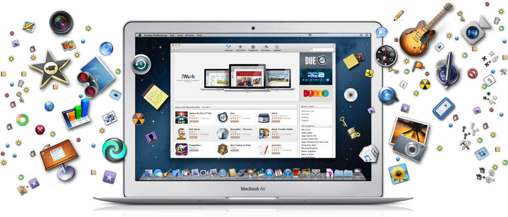

> 导航：[总目录](../../../README.md) · [documentation](../../../_indexes/documentation.md)

[Next](The%20Mac%20Application%20Environment.md)

# About OS X App Design

This document is the starting point for learning how to create Mac apps. It contains fundamental information about the OS X environment and how your apps interact with that environment. It also contains important information about the architecture of Mac apps and tips for designing key parts of your app.

Cocoa is the application environment that unlocks the full power of OS X. Cocoa provides APIs, libraries, and runtimes that help you create fast, exciting apps that automatically inherit the beautiful look and feel of OS X, as well as standard behaviors users expect.

### Cocoa Helps You Create Great Apps for OS X

You write apps for OS X using Cocoa, which provides a significant amount of infrastructure for your program. Fundamental design patterns are used throughout Cocoa to enable your app to interface seamlessly with subsystem frameworks, and core application objects provide key behaviors to support simplicity and extensibility in app architecture. Key parts of the Cocoa environment are designed particularly to support ease of use, one of the most important aspects of successful Mac apps. Many apps should adopt iCloud to provide a more coherent user experience by eliminating the need to synchronize data explicitly between devices.

### Common Behaviors Make Apps Complete

During the design phase of creating your app, you need to think about how to implement certain features that users expect in well-formed Mac apps. Integrating these features into your app architecture can have an impact on the user experience: accessibility, preferences, Spotlight, services, resolution independence, fast user switching, and the Dock. Enabling your app to assume full-screen mode, taking over the entire screen, provides users with a more immersive, cinematic experience and enables them to concentrate fully on their content without distractions.

### Get It Right: Meet System and App Store Requirements

Configuring your app properly is an important part of the development process. Mac apps use a structured directory called a _bundle_ to manage their code and resource files. And although most of the files are custom and exist to support your app, some are required by the system or the App Store and must be configured properly. The application bundle also contains the resources you need to provide to internationalize your app to support multiple languages.

### Finish Your App with Performance Tuning

As you develop your app and your project code stabilizes, you can begin performance tuning. Of course, you want your app to launch and respond to the user’s commands as quickly as possible. A responsive app fits easily into the user’s workflow and gives an impression of being well crafted. You can improve the performance of your app by speeding up launch time and decreasing your app’s code footprint.

This guide introduces you to the most important technologies that go into writing an app. In this guide you will see the whole landscape of what's needed to write one. That is, this guide shows you all the "pieces" you need and how they fit together. There are important aspects of app design that this guide does not cover, such as user interface design. However, this guide includes many links to other documents that provide details about the technologies it introduces, as well as links to tutorials that provide a hands-on approach.

In addition, this guide emphasizes certain technologies introduced in OS X v10.7, which provide essential capabilities that set your app apart from older ones and give it remarkable ease of use, bringing some of the best features from iOS to OS X.

The following documents provide additional information about designing Mac apps, as well as more details about topics covered in this document:

- To work through a tutorial showing you how to create a Cocoa app, see _[Start Developing Mac Apps Today](https://developer.apple.com/library/archive/referencelibrary/GettingStarted/RoadMapOSX/index.html#//apple_ref/doc/uid/TP40012262)_.
- For information about user interface design enabling you to create effective apps using OS X, see _OS X Human Interface Guidelines_.
- To understand how to create an explicit app ID, create provisioning profiles, and enable the correct entitlements for your application, so you can sell your application through the Mac App Store or use iCloud storage, see _App Distribution Guide_.
- For a general survey of OS X technologies, see _[Mac Technology Overview](../../Mac%20OSX/Mac%20Technology%20Overview/About%20Developing%20for%20Mac.md#apple-f4xwc4dqnrsv64tfmyxwi33df52wszbpkridimbqgaytanrx)_.
- To understand how to implement a document-based app, see _[Document-Based App Programming Guide for Mac](../../Data%20Management/Document-Based%20App%20Programming%20Guide%20for%20Mac/About%20the%20Cocoa%20Document%20Architecture.md#apple-f4xwc4dqnrsv64tfmyxwi33df52wszbpkridimbqgeytcnzz)_.
[Next](The%20Mac%20Application%20Environment.md)

