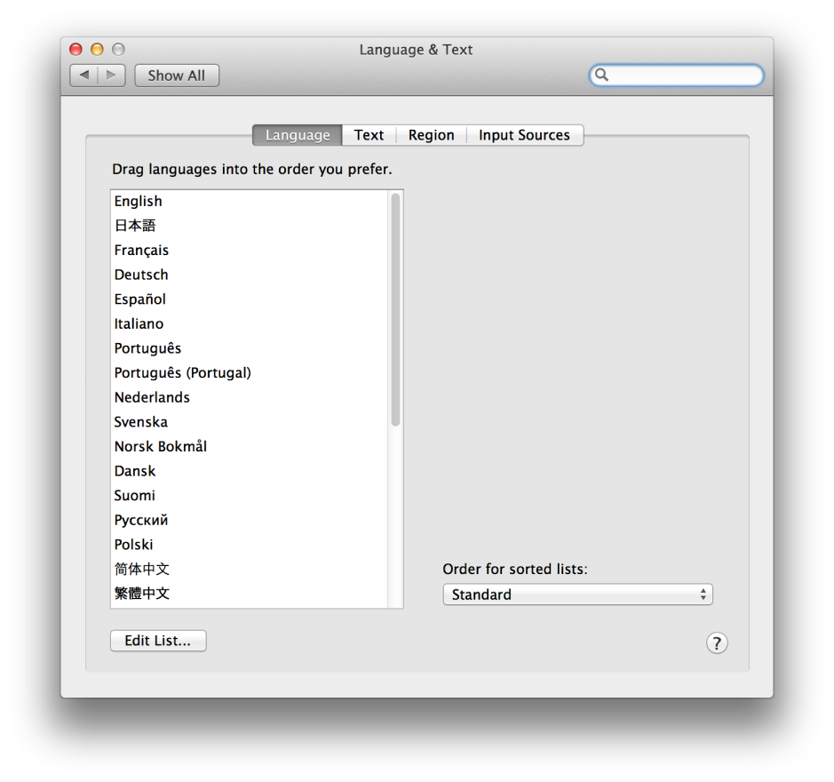

> 导航：[总目录](../../../README.md) · [documentation](../../../_indexes/documentation.md) · [Mac App Programming Guide](About%20OS%20X%20App%20Design.md)


[Next](Tuning%20for%20Performance%20and%20Responsiveness.md)[Previous](Supporting%20Common%20App%20Behaviors.md)

# Build-Time Configuration Details

Configuring your app properly is an important part of the development process. Mac apps use a structured directory configuration to manage their code and resource files. And although most of the files are custom and are there to support your app, some are required by the system or the App Store and must be configured properly.

If you intend to sell your application through the Mac App Store or use iCloud storage, you also need to create an explicit app ID, create provisioning profiles, and enable the correct entitlements for your application. These procedures are explained in _App Distribution Guide_.

All of the requirements for preparing your app and distributing it on the App Store are described in the [App Store Resource Center](https://developer.apple.com/appstore/).

To develop a Mac app, you create an Xcode project. An [Xcode Project](https://developer.apple.com/library/archive/featuredarticles/XcodeConcepts/Concept-Projects.html#//apple_ref/doc/uid/TP40009328-CH5) is a repository for all the files, resources, and information required to build your app (or one of a number of other software products). A project contains all the elements used to build your app and maintains the relationships between those elements. It contains one or more targets, which specify how to build the software. A project defines default build settings for all the targets in the project (each target can also specify its own build settings, which override the project build settings).

You create a new project using the Xcode File > New > New Project menu command, which invokes the New Project dialog. This dialog enables you to choose a template for your project, such as a Cocoa app, to name it, and to locate it in your file system. The New Project dialog also provides options, so you can specify whether your app uses the Cocoa document architecture or the Core Data framework. When you save your project, Xcode lets you to create a local Git repository to enable source code control for your project.

If you have two or more closely related projects, you should create an [Xcode Workspace](https://developer.apple.com/library/archive/featuredarticles/XcodeConcepts/Concept-Workspace.html#//apple_ref/doc/uid/TP40009328-CH7) and add your projects to it. A workspace groups projects and other documents so you can work on them together. One project can use the products and shared libraries of another project while building, and Xcode does indexing across the entire workspace, extending the scope of content-aware features such as code completion.

Once you have created your project, you write and edit your code using the Xcode source editor. You also use Xcode to build and debug your code, setting breakpoints, viewing the values of variables, stepping through running code, and reviewing issues found during builds or code analysis.

When you create a new project, it includes one or more [targets](https://developer.apple.com/library/archive/featuredarticles/XcodeConcepts/Concept-Targets.html#//apple_ref/doc/uid/TP40009328-CH4), where each target specifies one build product and the instructions for how the product is to be built. Most developers never need to change the default of the vast majority of build settings, but there are a few basic settings that you should check for each target, such as the deployment target (platform, OS version, and architecture), main user interface, and linked frameworks and libraries.

You also need to set up one or more [schemes](https://developer.apple.com/library/archive/featuredarticles/XcodeConcepts/Concept-Schemes.html#//apple_ref/doc/uid/TP40009328-CH8) to specify the targets, build configuration, and executable configuration to use when the product specified by the target is launched. You use the project editor and the scheme editing dialog to edit build settings and control what happens when you build and run your code. [Building and Running Your Code](https://developer.apple.com/library/archive/documentation/ToolsLanguages/Conceptual/Xcode_Overview/UnitTesting.html#//apple_ref/doc/uid/TP40010215-CH9) explains how to work with Xcode build settings and schemes.

For more information about using Xcode to create, configure, build, and debug your project, as well as archiving your program to package it for distribution or submission to the Mac App Store, see _[Xcode Overview](https://developer.apple.com/library/archive/documentation/ToolsLanguages/Conceptual/Xcode_Overview/index.html#//apple_ref/doc/uid/TP40010215)_.

An [information property list](https://developer.apple.com/library/archive/documentation/General/Conceptual/DevPedia-CocoaCore/InfoPlist.html#//apple_ref/doc/uid/TP40008195-CH61) (`Info.plist`) file contains essential runtime-configuration information for the app. Xcode provides a version of this file with every Mac application project and configures it with several standard keys. Although the default keys cover several important aspects of the app’s configuration, most apps require additional keys to specify their configuration fully.

To view the contents of your `Info.plist` file, select it in the Groups & Files pane. Xcode displays a property list editor similar to the one in Figure 5-1 (which is from Xcode 3.2.5). You can use this window to edit the property values and add new key-value pairs. By default, Xcode displays a more user-friendly version of each key name. To see the key names that Xcode adds to the `Info.plist` file, Control-click an item in the editor and choose Show Raw Keys/Values from the contextual menu that appears.

__Figure 5-1__  The information property list editor

!!

Xcode automatically adds some important keys to the `Info.plist` file of all new projects and sets their initial values. However, there are several keys that Mac apps use commonly to configure their launch environment and runtime behavior. Here are some keys that you might want to add to your app’s `Info.plist` file specifically for OS X:

- `LSApplicationCategoryType` (required for apps distributed using the App Store)
- `CFBundleDisplayName`
- `LSHasLocalizedDisplayName`
- `NSHumanReadableCopyright`
- `LSMinimumSystemVersion`
- `UTExportedTypeDeclarations`
- `UTImportedTypeDeclarations`

For detailed information about these and other keys that you can include in your app’s `Info.plist` file, see _[Information Property List Key Reference](../Information%20Property%20List%20Key%20Reference/About%20Info.plist%20Keys%20and%20Values.md#apple-f4xwc4dqnrsv64tfmyxwi33df52wszbpkridimbqga4tenbx)_.

When you build your Mac app, Xcode packages it as a [bundle](https://developer.apple.com/library/archive/documentation/General/Conceptual/DevPedia-CocoaCore/Bundle.html#//apple_ref/doc/uid/TP40008195-CH4). A _bundle_ is a directory in the file system that groups related resources together in one place. A Mac app bundle contains a single `Contents` directory, inside of which are additional files and directories with the app’s code, resources, and localized content. Table 5-1 lists the contents of a typical Mac app bundle, which for demonstration purposes is called `MyApp`. This example is for illustrative purposes only. Some of the files listed in this table may not appear in your own application bundles.

__Table 5-1__  A typical application bundle

| Files | Description |
| `Contents/MacOS/MyApp` | The executable file containing your app’s code. The name of this file is the same as your app name minus the `.app` extension.  This file is required. |
| `Contents/Info.plist` | Also known as the [information property list file](https://developer.apple.com/library/archive/documentation/General/Conceptual/DevPedia-CocoaCore/PropertyList.html#//apple_ref/doc/uid/TP40008195-CH44), a file containing configuration data for the app. The system uses this data to determine how to interact with the app at specific times.  This file is required. For more information, see [The Information Property List File](#apple-f4xwc4dqnrsv64tfmyxwi33df52wszbpkridimbqgeydknbtfvbuqobnknlti). |
| `Contents/Resources/English.lproj/MainMenu.nib` | The English version of the app’s main [nib file](https://developer.apple.com/library/archive/documentation/General/Conceptual/DevPedia-CocoaCore/NibFile.html#//apple_ref/doc/uid/TP40008195-CH34). This file contains the default interface objects to load at app launch time. Typically, this nib file contains the app’s menu bar and application [delegate object](https://developer.apple.com/library/archive/documentation/General/Conceptual/DevPedia-CocoaCore/Delegation.html#//apple_ref/doc/uid/TP40008195-CH14). It may also contain other controller objects that should always be available at launch time. (The name of the main nib file can be changed by assigning a different value to the `NSMainNibFile` key in the `Info.plist` file.)  This file is optional but recommended. For more information, see [The Information Property List File](#apple-f4xwc4dqnrsv64tfmyxwi33df52wszbpkridimbqgeydknbtfvbuqobnknlti) |
| `Contents/Resources/sun.png` (or other resource files) | Nonlocalized resources are placed at the top level of the `Resources` directory (`sun.png` represents a nonlocalized image file in the example). The app uses nonlocalized resources when no localized version of the same resource is provided. Thus, you can use these files in situations where the resource is the same for all localizations. |
| `Contents/Resources/en_GB.lproj`  `Contents/Resources/es.lproj`  `Contents/Resources/de.lproj`  Other language-specific project directories | [Localized resources](https://developer.apple.com/library/archive/documentation/General/Conceptual/DevPedia-CocoaCore/Internationalization.html#//apple_ref/doc/uid/TP40008195-CH23) are placed in subdirectories with an ISO 639-1 language abbreviation for a name plus an `.lproj` suffix. Although more human readable names (such as `English.lproj`, `French.lproj`, and `German.lproj`) can be used for directory names, the ISO 639-1 names are preferred because they allow you to include an ISO 3166-1 regional designation. (For example, the `en_GB.lproj` directory contains resources localized for English as spoken in Great Britain, the `es.lproj` directory contains resources localized for Spanish, and the `de.lproj` directory contains resources localized for German.) |

A Mac app should be [internationalized](https://developer.apple.com/library/archive/documentation/General/Conceptual/DevPedia-CocoaCore/Internationalization.html#//apple_ref/doc/uid/TP40008195-CH23) and have a _language_`.lproj` directory for each language it supports. Even if you provide localized versions of your resources, though, include a default version of these files at the top level of your `Resources` directory. The default version is used when a specific localization is not available.

At runtime, you can access your app’s resource files from your code using the following steps:

1. Obtain a reference to your app’s main bundle object (typically using the[NSBundle](https://developer.apple.com/library/archive/documentation/LegacyTechnologies/WebObjects/WebObjects_3.5/Reference/Frameworks/ObjC/Foundation/Classes/NSBundle/Description.html#//apple_ref/occ/cl/NSBundle) class).
2. Use the methods of the bundle object to obtain a file-system path to the desired resource file.
3. Open (or access) the file and use it.

You obtain a reference to your app’s main bundle using the [mainBundle](https://developer.apple.com/library/archive/documentation/LegacyTechnologies/WebObjects/WebObjects_3.5/Reference/Frameworks/ObjC/Foundation/Classes/NSBundle/Description.html#//apple_ref/occ/clm/NSBundle/mainBundle) class method of `NSBundle`. The [pathForResource:ofType:](https://developer.apple.com/library/archive/documentation/LegacyTechnologies/WebObjects/WebObjects_3.5/Reference/Frameworks/ObjC/Foundation/Classes/NSBundle/Description.html#//apple_ref/occ/instm/NSBundle/pathForResource:ofType:) method is one of several `NSBundle` methods that you can use to retrieve the location of resources. The following example shows how to locate a file called `sun.png` and create an image object using it. The first line gets the bundle object and the path to the file. The second line creates an [NSImage](https://developer.apple.com/documentation/appkit/nsimage) object that you could use to display the image in your app.

```
NSString* imagePath = [[NSBundle mainBundle] pathForResource:@"sun" ofType:@"png"];
NSImage* sunImage = [[NSImage alloc] initWithContentsOfFile:imagePath];
```

For information on how to access and use resources in your app, see _[Resource Programming Guide](../../Cocoa/Resource%20Programming%20Guide/About%20Resources.md#apple-f4xwc4dqnrsv64tfmyxwi33df52wszbpgeydambqga2tc2i)_. For more information about the structure of a Mac app bundle, see _[Bundle Programming Guide](../../Core%20Foundation/Bundle%20Programming%20Guide/Introduction.md#apple-f4xwc4dqnrsv64tfmyxwi33df52wszbpgeydambqgezdg2i)_.

The process of preparing a project to handle content in different languages is called [internationalization](https://developer.apple.com/library/archive/documentation/General/Conceptual/DevPedia-CocoaCore/Internationalization.html#//apple_ref/doc/uid/TP40008195-CH23). The process of converting text, images, and other content into other languages is called __localization__. Project resources that are candidates for localization include:

- Code-generated text, including locale-specific aspects of date, time, and number formatting
- Static text—for example, strings you specify programmatically and display in parts of your user interface or an HTML file containing app help
- Icons (including your app icon) and other images when those images either contain text or have some culture-specific meaning
- Sound files containing spoken language
- [Nib files](https://developer.apple.com/library/archive/documentation/General/Conceptual/DevPedia-CocoaCore/NibFile.html#//apple_ref/doc/uid/TP40008195-CH34)

Users select their preferred language from the Language and Text system preference, shown in Figure 5-2.

__Figure 5-2__  The Language preference view



Your application bundle can include multiple language-specific resource directories. The names of these directories consist of three components: an ISO 639-1 language code, an optional ISO 3166-1 region code, and a `.lproj` suffix. For example, to designate resources localized to English, the bundle would be named `en.lproj`. By convention, these directories are called `lproj` directories.

Each `lproj` directory contains a localized copy of the app’s resource files. When you request the path to a resource file using the [NSBundle](https://developer.apple.com/library/archive/documentation/LegacyTechnologies/WebObjects/WebObjects_3.5/Reference/Frameworks/ObjC/Foundation/Classes/NSBundle/Description.html#//apple_ref/occ/cl/NSBundle) class or the [CFBundleRef](https://developer.apple.com/documentation/corefoundation/cfbundle) opaque type, the path you get back automatically reflects the resource for the user’s preferred language.

For more information about internationalization and how you support localized content in your Mac apps, see _[Internationalization and Localization Guide](../../Mac%20OSX/Internationalization%20and%20Localization%20Guide/About%20Internationalization%20and%20Localization.md#apple-f4xwc4dqnrsv64tfmyxwi33df52wszbpgeydambqge3tc2i)_.

[Next](Tuning%20for%20Performance%20and%20Responsiveness.md)[Previous](Supporting%20Common%20App%20Behaviors.md)

