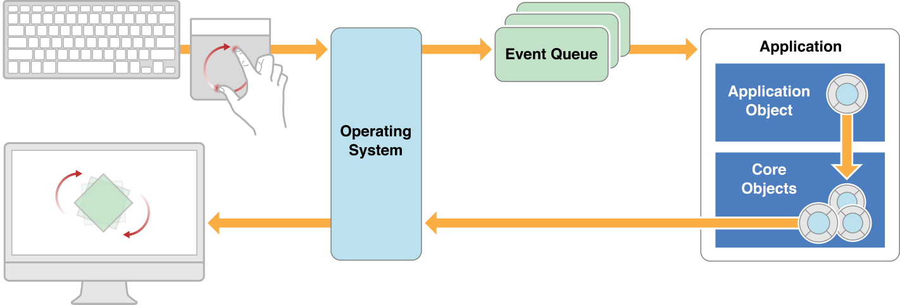

> 导航：[总目录](../../../README.md) · [documentation](../../../_indexes/documentation.md) · [Mac App Programming Guide](About%20OS%20X%20App%20Design.md)


[Next](Implementing%20the%20Full-Screen%20Experience.md)[Previous](The%20Mac%20Application%20Environment.md)

# The Core App Design

To unleash the power of OS X, you develop apps using the Cocoa application environment. Cocoa presents the app’s user interface and integrates it tightly with the other components of the operating system. Cocoa provides an integrated suite of object-oriented software components packaged in two core class libraries, the AppKit and Foundation [frameworks](https://developer.apple.com/library/archive/documentation/General/Conceptual/DevPedia-CocoaCore/Framework.html#//apple_ref/doc/uid/TP40008195-CH56), and a number of underlying frameworks providing supporting technologies. Cocoa classes are reusable and extensible—you can use them as is or extend them for your particular requirements.

Cocoa makes it easy to create apps that adopt all of the conventions and expose all of the power of OS X. In fact, you can create a new Cocoa application project in Xcode and, without adding any code, have a functional app. Such an app is able to display its window (or create new documents) and implements many standard system behaviors. And although the Xcode templates provide some code to make this all happen, the amount of code they provide is minimal. Most of the behavior is provided by Cocoa itself.

To make a great app, you should build on the foundations Cocoa lays down for you, working with the conventions and infrastructure provided for you. To do so effectively, it's important to understand how a Cocoa app fits together.

Cocoa incorporates many design patterns in its implementation. Table 2-1 lists the key design patterns with which you should be familiar.

__Table 2-1__  Fundamental design patterns used by Mac apps

| Design pattern | Why it is important |
| [Model-View-Controller](https://developer.apple.com/library/archive/documentation/General/Conceptual/DevPedia-CocoaCore/MVC.html#//apple_ref/doc/uid/TP40008195-CH32) | Use of the _Model-View-Controller (MVC)_ design pattern ensures that the objects you create now can be reused or updated easily in future versions of your app.  Cocoa provides most of the classes used to build your app’s controller and view layers. It is your job to customize the classes you need and provide the necessary data model objects to go with them.  MVC is central to a good design for a Cocoa application because many Cocoa technologies and architectures are based on MVC and require that your custom objects assume one of the MVC roles. |
| [Delegation](https://developer.apple.com/library/archive/documentation/General/Conceptual/DevPedia-CocoaCore/Delegation.html#//apple_ref/doc/uid/TP40008195-CH14) | The _delegation_ design pattern allows you to change the runtime behavior of an object without subclassing. Delegate objects conform to a specific [protocol](https://developer.apple.com/library/archive/documentation/General/Conceptual/DevPedia-CocoaCore/Protocol.html#//apple_ref/doc/uid/TP40008195-CH45) that defines the interaction points between the delegate and the object it modifies. At specific points, the master object calls the methods of its delegate to provide it with information or ask what to do. The delegate can then take whatever actions are appropriate. |
| [Responder chain](https://developer.apple.com/library/archive/documentation/General/Conceptual/Devpedia-CocoaApp/Responder.html#//apple_ref/doc/uid/TP40009071-CH1) | The _responder chain_ defines the relationships between event-handling objects in your app. As events arrive, the app dispatches them to the first responder object for handling. If that object does not want the event, it passes it to the next responder, which can either handle the event or send it to its next responder, and so on up the chain.  Windows and views are the most common types of responder objects and are always the first responders for mouse events. Other types of objects, such as your app’s controller objects, may also be responders. |
| [Target-action](https://developer.apple.com/library/archive/documentation/General/Conceptual/Devpedia-CocoaApp/TargetAction.html#//apple_ref/doc/uid/TP40009071-CH3) | Controls use the _target-action_ design pattern to notify your app of user interactions. When the user interacts with a control in a predefined way (such as by touching a button), the control sends a message (the action) to an object you specify (the target). Upon receiving the action message, the target object can then respond in an appropriate manner. |
| [Block objects](https://developer.apple.com/library/archive/documentation/General/Conceptual/DevPedia-CocoaCore/Block.html#//apple_ref/doc/uid/TP40008195-CH3) | _Block objects_ are a convenient way to encapsulate code and local stack variables in a form that can be executed later. Blocks are used in lieu of callback functions by many frameworks and are also used in conjunction with Grand Central Dispatch to perform tasks asynchronously.  For more information about using blocks, see _[Blocks Programming Topics](../../Cocoa/Blocks%20Programming%20Topics/Introduction.md#apple-f4xwc4dqnrsv64tfmyxwi33df52wszbpkridimbqga3tkmbs)_. |
| [Notifications](https://developer.apple.com/library/archive/documentation/General/Conceptual/DevPedia-CocoaCore/Notification.html#//apple_ref/doc/uid/TP40008195-CH35) | __Notifications__ are used throughout Cocoa to deliver news of changes to your app. Many objects send notifications at key moments in the object’s life cycle. Intercepting these notifications gives you a chance to respond and add custom behavior. |
| [Key-value observing (KVO)](https://developer.apple.com/library/archive/documentation/General/Conceptual/DevPedia-CocoaCore/KVO.html#//apple_ref/doc/uid/TP40008195-CH16) | __KVO__ tracks changes to a specific property of an object. When that property changes, the change generates automatic notifications for any objects that registered an interest in that property. Those observers then have a chance to respond to the change. |
| [Bindings](https://developer.apple.com/library/archive/documentation/General/Conceptual/DevPedia-CocoaCore/DynamicBinding.html#//apple_ref/doc/uid/TP40008195-CH15) | __Cocoa bindings__ provide a convenient bridge between the model, view, and controller portions of your app. You bind a view to some underlying data object (which can be static or dynamic) through one of your controllers. Changes to the view are then automatically reflected in the data object, and vice versa.  The use of bindings is not required for apps but does minimize the amount of code you have to write. You can set up bindings programmatically or using Interface Builder. |

The style of your app defines which core objects you must use in its implementation. Cocoa supports the creation of both single-window and multiwindow apps. For multiwindow designs, it also provides a document architecture to help manage the files associated with each app window. Thus, apps can have the following forms:

- Single-window utility app
- Single-window library-style app
- Multiwindow document-based app

You should choose a basic app style early in your design process because that choice affects everything you do later. The single-window styles are preferred in many cases, especially for developers bringing apps from iOS. The single-window style typically yields a more streamlined user experience, and it also makes it easier for your app to support a full-screen mode. However, if your app works extensively with complex documents, the multiwindow style may be preferable because it provides more document-related infrastructure to help you implement your app.

The Calculator app provided with OS X, shown in Figure 2-1, is an example of a single-window utility app. Utility apps typically handle ephemeral data or manage system processes. Calculator does not create or deal with any documents or persistent user data but simply processes numerical data entered by the user into the text field in its single window, displaying the results of its calculations in the same field. When the user quits the app, the data it processed is simply discarded.

__Figure 2-1__  The Calculator single-window utility app

!

Single-window, library-style (or “shoebox”) apps do handle persistent user data. One of the most prominent examples of a library-style app is iPhoto, shown in Figure 2-2. The user data handled by iPhoto are photos (and associated metadata), which the app edits, displays, and stores. All user interaction with iPhoto happens in a single window. Although iPhoto stores its data in files, it doesn’t present the files to the user. The app presents a simplified interface so that users don’t need to manage files in order to use the app. Instead, they work directly with their photos. Moreover, iPhoto hides its files from regular manipulation in the Finder by placing them within a single package. In addition, the app saves the user’s editing changes to disk at appropriate times. So, users are relieved of the need to manually save, open, or close documents. This simplicity for users is one of the key advantages of the library-style app design.

__Figure 2-2__  The iPhoto single-window app

!

A good example of a multiwindow document-based app is TextEdit, which creates, displays, and edits documents containing plain or styled text and images. TextEdit does not organize or manage its documents—users do that with the Finder. Each TextEdit document opens in its own window, multiple documents can be open at one time, and the user interacts with the frontmost document using controls in the window’s toolbar and the app’s menu bar. Figure 2-3 shows a document created by TextEdit. For more information about the document-based app design, see [Document-Based Apps Are Based on an NSDocument Subclass](#apple-f4xwc4dqnrsv64tfmyxwi33df52wszbpkridimbqgeydknbtfvbuqmznknltini).

__Figure 2-3__  TextEdit document window

!

Both single-window and multiwindow apps can present an effective full-screen mode, which provides an immersive experience that enables users to focus on their tasks without distractions. For information about full-screen mode, see [Implementing the Full-Screen Experience](Implementing%20the%20Full-Screen%20Experience.md#apple-f4xwc4dqnrsv64tfmyxwi33df52wszbpkridimbqgeydknbtfvbuqnrnknltc).

Regardless of whether you are using a single-window or multiwindow app style, all apps use the same core set of objects. Cocoa provides the default behavior for most of these objects. You are expected to provide a certain amount of customization of these objects to implement your app’s custom behavior.

Figure 2-4 shows the relationships among the core objects for the single-window app styles. The objects in this figure are separated according to whether they are part of the [model, view, or controller](https://developer.apple.com/library/archive/documentation/General/Conceptual/DevPedia-CocoaCore/MVC.html#//apple_ref/doc/uid/TP40008195-CH32) portions of the app. As you can see from the figure, the Cocoa–provided objects provide much of the controller and view layer for your app.

__Figure 2-4__  Key objects in a single-window app

!

[Table 2-2](#apple-f4xwc4dqnrsv64tfmyxwi33df52wszbpkridimbqgeydknbtfvbuqmznknltq) describes the roles played by the objects in the diagram.

__Table 2-2__  The core objects used by all Cocoa apps

| Object | Description |
| [NSApplication](https://developer.apple.com/documentation/appkit/nsapplication) object | (Required) Runs the event loop and manage interactions between your app and the system. You typically use the `NSApplication` class as is, putting any custom app-object-related code in your application delegate object. |
| Application [delegate](https://developer.apple.com/library/archive/documentation/General/Conceptual/DevPedia-CocoaCore/Delegation.html#//apple_ref/doc/uid/TP40008195-CH14) object | (Expected) A custom object that you provide which works closely with the `NSApplication` object to run the app and manage the transitions between different application states.  Your application delegate object must conform to the [NSApplicationDelegate Protocol](https://developer.apple.com/documentation/appkit/nsapplicationdelegate). |
| Data model objects | Store content specific to your app. A banking app might store a database containing financial transactions, whereas a painting app might store an image object or the sequence of drawing commands that led to the creation of that image. |
| Window controllers | Responsible for loading and managing a single window each and coordinating with the system to handle standard window behaviors.  You subclass [NSWindowController](https://developer.apple.com/documentation/appkit/nswindowcontroller) to manage both the window and its contents. Each window controller is responsible for everything that happens in its window. If the contents of your window are simple, the window controller may do all of the management itself. If your window is more complex, the window controller might use one or more view controllers to manage portions of the window. |
| Window objects | Represent your onscreen windows, configured in different styles depending on your app’s needs. For example, most windows have title bars and borders but you can also configure windows without those visual adornments. A window object is almost always managed by a window controller.  An app can also have secondary windows, also known as dialogs and panels. These windows are subordinate to the current document window or, in the case of single-window apps, to the main window. They support the document or main window, for example, allowing selection of fonts and color, allowing the selection of tools from a palette, or displaying a warning‚ A secondary window is often modal. |
| View controllers | Coordinate the loading of a single view hierarchy into your app. Use view controllers to divide up the work for managing more sophisticated window layouts. Your view controllers work together (with the window controller) to present the window contents.  If you have developed iOS apps, be aware that AppKit view controllers play a less prominent role than UIKit view controllers. In OS X, AppKit view controllers are assistants to the window controller, which is ultimately responsible for everything that goes in the window. The main job of an AppKit view controller is to load its view hierarchy. Everything else is custom code that you write. |
| View objects | Define a rectangular region in a window, draw the contents of that region, and handle events in that region. Views can be layered on top of each other to create view hierarchies, whereby one view obscures a portion of the underlying view. |
| Control objects | Represent standard system controls. These view subclasses provide standard visual items such as buttons, text fields, and tables that you can use to build your user interface. Although a few controls are used as is to present visual adornments, most work with your code to manage user interactions with your app’s content. |

As opposed to a single-window app, a multiwindow app uses several windows to present its primary content. The Cocoa support for multiwindow apps is built around a document-based model implemented by a subsystem called the __document architecture__. In this model, each document object manages its content, coordinates the reading and writing of that content from disk, and presents the content in a window for editing. All document objects work with the Cocoa infrastructure to coordinate event delivery and such, but each document object is otherwise independent of its fellow document objects.

Figure 2-5 shows the relationships among the core objects of a multiwindow document-based app. Many of the same objects in this figure are identical to those used by a single-window app. The main difference is the insertion of the [NSDocumentController](https://developer.apple.com/documentation/appkit/nsdocumentcontroller) and [NSDocument](https://developer.apple.com/documentation/appkit/nsdocument) objects between the application objects and the objects for managing the user interface.

__Figure 2-5__  Key objects in a multiwindow document app

!

[Table 2-3](#apple-f4xwc4dqnrsv64tfmyxwi33df52wszbpkridimbqgeydknbtfvbuqmznknlts) describes the role of the inserted [NSDocumentController](https://developer.apple.com/documentation/appkit/nsdocumentcontroller) and [NSDocument](https://developer.apple.com/documentation/appkit/nsdocument) objects. (For information about the roles of the other objects in the diagram, see [Table 2-2](#apple-f4xwc4dqnrsv64tfmyxwi33df52wszbpkridimbqgeydknbtfvbuqmznknltq).)

__Table 2-3__  Additional objects used by multiwindow document apps

| Object | Description |
| Document Controller object | The `NSDocumentController` class defines a high-level controller for creating and managing all document objects. In addition to managing documents, the document controller also manages many document-related menu items, such as the Open Recent menu and the open and save panels. |
| Document object | The [NSDocument](https://developer.apple.com/documentation/appkit/nsdocument) class is the base class for implementing documents in a multiwindow app. This class acts as the controller for the data objects associated with the document. You define your own custom subclasses to manage the interactions with your app’s data objects and to work with one or more [NSWindowController](https://developer.apple.com/documentation/appkit/nswindowcontroller) objects to display the document contents on the screen. |

No matter how you store your app’s data, iCloud is a convenient way to make that data available to all of a user’s devices. To integrate iCloud into your app, you change where you store user files. Instead of storing them in the user’s Home folder or in your App Sandbox container, you store them in special file system locations known as _ubiquity containers_. A _ubiquity container_ serves as the local representation of corresponding iCloud storage. It is outside of your App Sandbox container, and so requires specific entitlements for your app to interact with it.

In addition to a change in file system locations, your app design needs to acknowledge that your data model is accessible to multiple processes. The following considerations apply:

- Document-based apps get iCloud support through the [NSDocument](https://developer.apple.com/documentation/appkit/nsdocument) class, which handles most of the interactions required to manage the on-disk file packages that represent documents.
- If you implement a custom data model and manage files yourself, you must explicitly use file coordination to ensure that the changes you make are done safely and in concert with the changes made on the user’s other devices. For details, see [The Role of File Coordinators and Presenters](https://developer.apple.com/library/archive/documentation/FileManagement/Conceptual/FileSystemProgrammingGuide/FileCoordinators/FileCoordinators.html#//apple_ref/doc/uid/TP40010672-CH11) in _[File System Programming Guide](../../File%20Management/File%20System%20Programming%20Guide/About%20Files%20and%20Directories.md#apple-f4xwc4dqnrsv64tfmyxwi33df52wszbpkridimbqgeydmnzs)_.
- For storing small amounts of data in iCloud, you use key-value storage. Use key-value storage for such things as stocks or weather information, locations, bookmarks, a recent-documents list, settings and preferences, and simple game state. Every iCloud app should take advantage of key-value storage. To interact with key-value storage, you use the shared [NSUbiquitousKeyValueStore](https://developer.apple.com/documentation/foundation/nsubiquitouskeyvaluestore) object.

To learn how to adopt iCloud in your app, read _[iCloud Design Guide](../iCloud%20Design%20Guide/About%20Incorporating%20iCloud%20into%20Your%20App.md#apple-f4xwc4dqnrsv64tfmyxwi33df52wszbpkridimbqgezdaoju)_.

When implementing a single-window, shoebox-style (sometimes referred to as a “library” style) app, it is sometimes better not to use `NSDocument` objects to manage your content. The `NSDocument` class was designed specifically for use in multiwindow document apps. Instead, use custom controller objects to manage your data. Those custom controllers would then work with a view controller or your app’s main window controller to coordinate the presentation of the data.

Although you normally use an `NSDocumentController` object only in multiwindow apps, you can subclass it and use it in a single-window app to coordinate the Open Recent and similar behaviors. When subclassing, though, you must override any methods related to the creation of `NSDocument` objects.

Documents are containers for user data that can be stored in files and iCloud. In a document-based design, the app enables users to create and manage documents containing their data. One app typically handles multiple documents, each in its own window, and often displays more than one document at a time. For example, a word processor provides commands to create new documents, it presents an editing environment in which the user enters text and embeds graphics into the document, it saves the document data to disk (and, optionally, iCloud), and it provides other document-related commands, such as printing and version management. In Cocoa, the document-based app design is enabled by the document architecture, which is part of of the AppKit framework.

There are several ways to think of a document. Conceptually, a document is a container for a body of information that can be named and stored in a disk file and in iCloud. In this sense, the document is not the same as the file but is an object in memory that owns and manages the document data. To users, the document is their information—such as text and graphics formatted on a page. Programmatically, a document is an instance of a custom `NSDocument` subclass that knows how to represent internally persistent data that it can display in windows. This document object knows how to read document data from a file and create an object graph in memory for the document data model. It also knows how to handle the user’s editing commands to modify the data model and write the document data back out to disk. So, the document object mediates between different representations of document data, as shown in Figure 2-6.

__Figure 2-6__  Document file, object, and data model

!

Using iCloud, documents can be shared automatically among a user’s computers and iOS devices. Changes to the document data are synchronized without user intervention. For information about iCloud, see [Integrating iCloud Support Into Your App](#apple-f4xwc4dqnrsv64tfmyxwi33df52wszbpkridimbqgeydknbtfvbuqmznknltcoi).

The document-based style of app is a design choice that you should consider when you design your app. If it makes sense for your users to create multiple discrete sets of data, each of which they can edit in a graphical environment and store in files or iCloud, then you certainly should plan to develop a document-based app.

The Cocoa document architecture provides a framework for document-based apps to do the following things:

- __Create new documents.__ The first time the user chooses to save a new document, it presents a dialog enabling the user to name and save the document in a disk file in a user-chosen location.
- __Open existing documents stored in files.__ A document-based app specifies the types of document it can read and write, as well as read-only and write-only types. It can represent the data of different types internally and display the data appropriately. It can also close documents.
- __Automatically save documents.__ Document-based apps can adopt autosaving in place, and its documents are automatically saved at appropriate times so that the data the user sees on screen is effectively the same as that saved on disk. Saving is done safely, so that an interrupted save operation does not leave data inconsistent.
- __Asynchronously read and write document data.__ Reading and writing are done asynchronously on a background thread, so that lengthy operations do not make the app’s user interface unresponsive. In addition, reads and writes are coordinated using `NSFilePresenter` protocol and `NSFileCoordinator` class to reduce version conflicts. Coordinated reads and writes reduce version conflicts both among different apps sharing document data in local storage and among different instances of an app on different devices sharing document data via iCloud.
- __Manage multiple versions of documents.__ Autosave creates versions at regular intervals, and users can manually save a version whenever they wish. Users can browse versions and revert the document’s contents to a chosen version using a Time Machine–like interface. The version browser is also used to resolve version conflicts from simultaneous iCloud updates.
- __Print documents.__ The print dialog and page setup dialog enable the user to choose various page layouts.
- __Monitor and set the document’s edited status and validate menu items.__ To avoid automatic saving of inadvertent changes, old files are locked from editing until explicitly unlocked by the user.
- __Track changes.__ The document manages its edited status and implements multilevel undo and redo.
- __Handle app and window delegation.__ Notifications are sent and delegate methods called at significant lifecycle events, such as when the app terminates.

See _[Document-Based App Programming Guide for Mac](../../Data%20Management/Document-Based%20App%20Programming%20Guide%20for%20Mac/About%20the%20Cocoa%20Document%20Architecture.md#apple-f4xwc4dqnrsv64tfmyxwi33df52wszbpkridimbqgeytcnzz)_ for more detailed information about how to implement a document-based app.

The app life cycle is the progress of an app from its launch through its termination. Apps can be launched by the user or the system. The user launches apps by double-clicking the app icon, using Launchpad, or opening a file whose type is currently associated with the app. In OS X v10.7 and later, the system launches apps at user login time when it needs to restore the user’s desktop to its previous state.

When an app is launched, the system creates a process and all of the normal system-related data structures for it. Inside the process, it creates a main thread and uses it to begin executing your app’s code. At that point, your app’s code takes over and your app is running.

Like any C-based app, the main entry point for a Mac app at launch time is the `main` function. In a Mac app, the `main` function is used only minimally. Its main job is to give control to the AppKit framework. Any new project you create in Xcode comes with a default `main` function like the one shown in Listing 2-1. You should normally not need to change the implementation of this function.

__Listing 2-1__  The `main` function of a Mac app

```objc
#import <Cocoa/Cocoa.h>

int main(int argc, char *argv[])
{
    return NSApplicationMain(argc,  (const char **) argv);
}
```

The [NSApplicationMain](https://developer.apple.com/documentation/appkit/1428499-nsapplicationmain) function initializes your app and prepares it to run. As part of the initialization process, this function does several things:

- Creates an instance of the [NSApplication](https://developer.apple.com/documentation/appkit/nsapplication) class. You can access this object from anywhere in your app using the [sharedApplication](https://developer.apple.com/documentation/appkit/nsapplication/1428360-shared) class method.
- Loads the nib file specified by the `NSMainNibFile` key in the `Info.plist` file and instantiates all of the objects in that file. This is your app’s main nib file and should contain your application delegate and any other critical objects that must be loaded early in the launch cycle. Any objects that are not needed at launch time should be placed in separate nib files and loaded later.
- Calls the [run](https://developer.apple.com/documentation/appkit/nsapplication/1428631-run) method of your application object to finish the launch cycle and begin processing events.

By the time the `run` method is called, the main objects of your app are loaded into memory but the app is still not fully launched. The `run` method notifies the application delegate that the app is about to launch, shows the application menu bar, opens any files that were passed to the app, does some framework housekeeping, and starts the event processing loop. All of this work occurs on the app’s main thread with one exception. Files may be opened in secondary threads if the [canConcurrentlyReadDocumentsOfType:](https://developer.apple.com/documentation/appkit/nsdocument/1515216-canconcurrentlyreaddocumentsofty) [class method](https://developer.apple.com/library/archive/documentation/General/Conceptual/DevPedia-CocoaCore/ClassMethod.html#//apple_ref/doc/uid/TP40008195-CH8) of the corresponding `NSDocument` object returns `YES`.

If your app preserves its user interface between launch cycles, Cocoa loads any preserved data at launch time and uses it to re-create the windows that were open the last time your app was running. For more information about how to preserve your app’s user interface, see [User Interface Preservation](#apple-f4xwc4dqnrsv64tfmyxwi33df52wszbpkridimbqgeydknbtfvbuqmznknltenq).

As the user interacts with your app, the app’s main event loop processes incoming events and dispatches them to the appropriate objects for handling. When the [NSApplication](https://developer.apple.com/documentation/appkit/nsapplication) object is first created, it establishes a connection with the system window server, which receives events from the underlying hardware and transfers them to the app. The app also sets up a FIFO event queue to store the events sent to it by the window server. The main event loop is then responsible for dequeueing and processing events waiting in the queue, as shown in Figure 2-7.

__Figure 2-7__  The main event loop

!

The [run](https://developer.apple.com/documentation/appkit/nsapplication/1428631-run) method of the `NSApplication` object is the workhorse of the main event loop. In a closed loop, this method executes the following steps until the app terminates:

1. Services window-update notifications, which results in the redrawing of any windows that are marked as “dirty.”
2. Dequeues an event from its internal event queue using the [nextEventMatchingMask:untilDate:inMode:dequeue:](https://developer.apple.com/documentation/appkit/nsapplication/1428485-nexteventmatchingmask) method and converts the event data into an [NSEvent](https://developer.apple.com/documentation/appkit/nsevent) object.
3. Dispatches the event to the appropriate target object using the [sendEvent:](https://developer.apple.com/documentation/appkit/nsapplication/1428359-sendevent) method of `NSApplication`.

When the app dispatches an event, the [sendEvent:](https://developer.apple.com/documentation/appkit/nsapplication/1428359-sendevent) method uses the type of the event to determine the appropriate target. There are two major types of input events: key events and mouse events. Key events are sent to the _key window_—the window that is currently accepting key presses. Mouse events are dispatched to the window in which the event occurred.

For mouse events, the window looks for the view in which the event occurred and dispatches the event to that object first. Views are [responder objects](https://developer.apple.com/library/archive/documentation/General/Conceptual/Devpedia-CocoaApp/Responder.html#//apple_ref/doc/uid/TP40009071-CH1) and are capable of responding to any type of event. If the view is a control, it typically uses the event to generate an [action message](https://developer.apple.com/library/archive/documentation/General/Conceptual/Devpedia-CocoaApp/TargetAction.html#//apple_ref/doc/uid/TP40009071-CH3) for its associated target.

The overall process for handling events is described in detail in _[Cocoa Event Handling Guide](../../Cocoa/Cocoa%20Event%20Handling%20Guide/Introduction.md#apple-f4xwc4dqnrsv64tfmyxwi33df52wszbpgeydambqga3da2i)_.

In OS X v10.7 and later, the use of the Quit command to terminate an app is diminished in favor of more user-centric techniques. Specifically, Cocoa supports two techniques that make the termination of an app transparent and fast:

- _Automatic termination_ eliminates the need for users to quit an app. Instead, the system manages app termination transparently behind the scenes, terminating apps that are not in use to reclaim needed resources such as memory.
- _Sudden termination_ allows the system to kill an app’s process immediately without waiting for it to perform any final actions. The system uses this technique to improve the speed of operations such as logging out of, restarting, or shutting down the computer.

Automatic termination and sudden termination are independent techniques, although both are designed to improve the user experience of app termination. Although Apple recommends that apps support both, an app can support one technique and not the other. Apps that support both techniques can be terminated by the system without the app being involved at all. On the other hand, if an app supports sudden termination but not automatic termination, then it must be sent a Quit event, which it needs to process without displaying any user interface dialogs.

Automatic termination transfers the job of managing processes from the user to the system, which is better equipped to handle the job. Users do not need to manage processes manually anyway. All they really need is to run apps and have those apps available when they need them. Automatic termination makes that possible while ensuring that system performance is not adversely affected.

Apps must opt in to both automatic termination and sudden termination and implement appropriate support for them. In both cases, the app must ensure that any user data is saved well before termination can happen. And because the user does not quit an autoterminable app, such an app should also save the state of its user interface using the built-in Cocoa support. Saving and restoring the interface state provides the user with a sense of continuity between app launches.

For information on how to support for automatic termination in your app, see [Automatic Termination](#apple-f4xwc4dqnrsv64tfmyxwi33df52wszbpkridimbqgeydknbtfvbuqmznknlteny). For information on how to support sudden termination, see [Sudden Termination](#apple-f4xwc4dqnrsv64tfmyxwi33df52wszbpkridimbqgeydknbtfvbuqmznknlteoa).

No matter what style of app you are creating, there are specific behaviors that all apps should support. These behaviors are intended to help users focus on the content they are creating rather than focus on app management and other busy work that is not part of creating their content.

Automatic termination is a feature that you must explicitly code for in your app. Declaring support for automatic termination is easy, but apps also need to work with the system to save the current state of their user interface so that it can be restored later as needed. The system can kill the underlying process for an auto-terminable app at any time, so saving this information maintains continuity for the app. Usually, the system kills an app’s underlying process some time after the user has closed all of the app’s windows. However, the system may also kill an app with open windows if the app is not currently on screen, perhaps because the user hid it or switched spaces.

To support automatic termination, you should do the following:

- Declare your app’s support for automatic termination, either programmatically or using an `Info.plist` key.
- Support saving and restoring your window configurations.
- Save the user’s data at appropriate times.

  - Single-window, library-style apps should implement strategies for saving data at appropriate checkpoints.
  - Multiwindow, document-based apps can use the autosaving and saveless documents capabilities in `NSDocument`.
- Whenever possible, support sudden termination for your app as well.

Declaring support for automatic termination lets the system know that it should manage the actual termination of your app at appropriate times. An app has two ways to declare its support for automatic termination:

- Include the `NSSupportsAutomaticTermination` key (with the value `YES`) in the app’s `Info.plist` file. This sets the app’s default support status.
- Use the [NSProcessInfo](https://developer.apple.com/library/archive/documentation/LegacyTechnologies/WebObjects/WebObjects_3.5/Reference/Frameworks/ObjC/Foundation/Classes/NSProcessInfo/Description.html#//apple_ref/occ/cl/NSProcessInfo) class to declare support for automatic termination dynamically. Use this technique to change the default support of an app that includes the `NSSupportsAutomaticTermination` key in its `Info.plist` file.

You should always avoid forcing the user to save changes to their data manually. Instead, implement automatic data saving. For a multiwindow app based on `NSDocument`, automatic saving is as simple as overriding the [autosavesInPlace](https://developer.apple.com/documentation/appkit/nsdocument/1515106-autosavesinplace) class method to return `YES`. For more information, see _[Document-Based App Programming Guide for Mac](../../Data%20Management/Document-Based%20App%20Programming%20Guide%20for%20Mac/About%20the%20Cocoa%20Document%20Architecture.md#apple-f4xwc4dqnrsv64tfmyxwi33df52wszbpkridimbqgeytcnzz)_.

For a single-window, library-style app, identify appropriate points in your code where any user-related changes should be saved and write those changes to disk automatically. This benefits the user by eliminating the need to think about manually saving changes, and when done regularly, it ensures that the user does not lose much data if there is a problem.

Some appropriate times when you can save user data automatically include the following:

- When the user closes the app window or quits the app ([applicationWillTerminate:](https://developer.apple.com/documentation/appkit/nsapplicationdelegate/1428522-applicationwillterminate))
- When the app is deactivated ([applicationWillResignActive:](https://developer.apple.com/documentation/appkit/nsapplicationdelegate/1428539-applicationwillresignactive))
- When the user hides your app ([applicationWillHide:](https://developer.apple.com/documentation/appkit/nsapplicationdelegate/1428478-applicationwillhide))
- Whenever the user makes a valid change to data in your app

The last item means that you have the freedom to save the user’s data at any time it makes sense to do so. For example, if the user is editing fields of a data record, you can save each field value as it is changed or you can wait and save all fields when the user displays a new record. Making these types of incremental changes ensures that the data is always up-to-date but also requires more fine-grained management of your data model. In such an instance, Core Data can help you make the changes more easily. For information about Core Data, see _Core Data Starting Point_.

Sudden termination lets the system know that your app’s process can be killed directly without any additional involvement from your app. The benefit of supporting sudden termination is that it lets the system close apps more quickly, which is important when the user is shutting down a computer or logging out.

An app has two ways to declare its support for sudden termination:

- Include the `NSSupportsSuddenTermination` key (with the value `YES`) in the app’s `Info.plist` file.
- Use the [NSProcessInfo](https://developer.apple.com/library/archive/documentation/LegacyTechnologies/WebObjects/WebObjects_3.5/Reference/Frameworks/ObjC/Foundation/Classes/NSProcessInfo/Description.html#//apple_ref/occ/cl/NSProcessInfo) class to declare support for sudden termination dynamically. You can also use this class to change the default support of an app that includes the `NSSupportsSuddenTermination` key in its `Info.plist` file.

One solution is to declare global support for the feature globally and then manually override the behavior at appropriate times. Because sudden termination means the system can kill your app at any time after launch, you should disable it while performing actions that might lead to data corruption if interrupted. When the action is complete, reenable the feature again.

You disable and enable sudden termination programmatically using the [disableSuddenTermination](https://developer.apple.com/documentation/foundation/processinfo/1412841-disablesuddentermination) and [enableSuddenTermination](https://developer.apple.com/documentation/foundation/processinfo/1409836-enablesuddentermination) methods of the `NSProcessInfo` class. These methods increment and decrement a counter, respectively, maintained by the process. When the value of this counter is 0, the process is eligible for sudden termination. When the value is greater than 0, sudden termination is disabled.

Enabling and disabling sudden termination dynamically also means that your app should save data progressively and not rely solely on user actions to save important information. The best way to ensure that your app’s information is saved at appropriate times is to support the interfaces in OS X v10.7 for saving your document and window state. Those interfaces facilitate the automatic saving of relevant user and app data. For more information about saving your user interface state, see [User Interface Preservation](#apple-f4xwc4dqnrsv64tfmyxwi33df52wszbpkridimbqgeydknbtfvbuqmznknltenq). For more information about saving your documents, see [Document-Based Apps Are Based on an NSDocument Subclass](#apple-f4xwc4dqnrsv64tfmyxwi33df52wszbpkridimbqgeydknbtfvbuqmznknltini).

For additional information about enabling and disabling sudden termination, see _[NSProcessInfo Class Reference](https://developer.apple.com/documentation/foundation/processinfo)_.

The Resume feature, in OS X v10.7 and later, saves the state of your app’s windows and restores them during subsequent launches of your app. Saving the state of your windows enables you to return your app to the state it was in when the user last used it. Use the Resume feature especially if your app supports automatic termination, which can cause your app to be terminated while it is running but hidden from the user. If your app supports automatic termination but does not preserve its interface, the app launches into its default state. Users who only switched away from your app might think that the app crashed while it was not being used.

You must do the following to preserve the state of your user interface:

- For each window, you must set whether the window should be preserved using the [setRestorable:](https://developer.apple.com/documentation/appkit/nswindow/1526255-restorable) method.
- For each preserved window, you must specify an object whose job is to re-create that window at launch time.
- Any objects involved in your user interface must write out the data they require to restore their state later.
- At launch time, you must use the provided data to restore your objects to their previous state.

The actual process of writing out your application state to disk and restoring it later is handled by Cocoa, but you must tell Cocoa what to save. Your app’s windows are the starting point for all save operations. Cocoa iterates over all of your app’s windows and saves data for the ones whose [isRestorable](https://developer.apple.com/documentation/appkit/nswindow/1526255-isrestorable) method returns `YES`. Most windows are preserved by default, but you can change the preservation state of a window using the [setRestorable:](https://developer.apple.com/documentation/appkit/nswindow/1526255-restorable) method.

In addition to preserving your windows, Cocoa saves data for most of the responder objects associated with the window. Specifically, it saves the views and window controller objects associated with the window. (For a multiwindow document-based app, the window controller also saves data from its associated document object.) Figure 2-8 shows the path that Cocoa takes when determining which objects to save. Window objects are always the starting point, but other related objects are saved, too.

__Figure 2-8__  Responder objects targeted by Cocoa for preservation

!

All Cocoa window and view objects save basic information about their size and location, plus information about other attributes that might affect the way they are currently displayed. For example, a tab view saves the index of the selected tab, and a text view saves the location and range of the current text selection. However, these responder objects do not have any inherent knowledge about your app’s data structures. Therefore, it is your responsibility to save your app’s data and any additional information needed to restore the window to its current state. There are several places where you can write out your custom state information:

- If you subclass [NSWindow](https://developer.apple.com/documentation/appkit/nswindow) or [NSView](https://developer.apple.com/documentation/appkit/nsview), implement the [encodeRestorableStateWithCoder:](https://developer.apple.com/documentation/appkit/nsresponder/1526236-encoderestorablestate) method in your subclass and use it to write out any relevant data.

  Alternatively, your custom [responder objects](https://developer.apple.com/library/archive/documentation/General/Conceptual/Devpedia-CocoaApp/Responder.html#//apple_ref/doc/uid/TP40009071-CH1) can override the [restorableStateKeyPaths](https://developer.apple.com/documentation/appkit/nsresponder/1526242-restorablestatekeypaths) method and use it to specify key paths for any attributes to be preserved. Cocoa uses the key paths to locate and save the data for the corresponding attribute. Attributes must be compliant with [key-value coding](https://developer.apple.com/library/archive/documentation/General/Conceptual/DevPedia-CocoaCore/KeyValueCoding.html#//apple_ref/doc/uid/TP40008195-CH25) and [Key-value observing](https://developer.apple.com/library/archive/documentation/General/Conceptual/DevPedia-CocoaCore/KVO.html#//apple_ref/doc/uid/TP40008195-CH16).
- If your window has a delegate object, implement the [window:willEncodeRestorableState:](https://developer.apple.com/documentation/appkit/nswindowdelegate/1419619-window) method for the delegate and use it to store any relevant data.
- In your window controller, use the `encodeRestorableStateWithCoder:` method to save any relevant data or configuration information.

Be judicious when deciding what data to preserve, and strive to write out the smallest amount of information that is required to reconfigure your window and associated objects. You are expected to save the actual data that the window displays and enough information to reattach the window to the same data objects later.

For information on how to use coder objects to archive state information, see _[NSCoder Class Reference](https://developer.apple.com/documentation/foundation/nscoder)_. For additional information on what you need to do to save state in a multiwindow document-based app, see _[Document-Based App Programming Guide for Mac](../../Data%20Management/Document-Based%20App%20Programming%20Guide%20for%20Mac/About%20the%20Cocoa%20Document%20Architecture.md#apple-f4xwc4dqnrsv64tfmyxwi33df52wszbpkridimbqgeytcnzz)_.

Whenever the preserved state of one of your [responder objects](https://developer.apple.com/library/archive/documentation/General/Conceptual/Devpedia-CocoaApp/Responder.html#//apple_ref/doc/uid/TP40009071-CH1) changes, mark the object as dirty by calling the [invalidateRestorableState](https://developer.apple.com/documentation/appkit/nsresponder/1526243-invalidaterestorablestate) method of that object. Having done so, at some point in the future, [encodeRestorableStateWithCoder:](https://developer.apple.com/documentation/appkit/nsresponder/1526236-encoderestorablestate) message is sent to your responder object. Marking your responder objects as dirty lets Cocoa know that it needs to write their preservation state to disk at an appropriate time. Invalidating your objects is a lightweight operation in itself because the data is not written to disk right away. Instead, changes are coalesced and written at key times, such as when the user switches to another app or logs out.

You should mark a responder object as dirty only for changes that are truly interface related. For example, a tab view marks itself as dirty when the user selects a different tab. However, you do not need to invalidate your window or its views for many content-related changes, unless the content changes themselves caused the window to be associated with a completely different set of data-providing objects.

If you used the [restorableStateKeyPaths](https://developer.apple.com/documentation/appkit/nsresponder/1526242-restorablestatekeypaths) method to declare the attributes you want to preserve, Cocoa preserves and restores the values of those attributes of your responder object. Therefore, any key paths you provide should be [key-value observing](https://developer.apple.com/library/archive/documentation/General/Conceptual/DevPedia-CocoaCore/KVO.html#//apple_ref/doc/uid/TP40008195-CH16) compliant and generate the appropriate notifications. For more information on how to support key-value observing in your objects, see _[Key-Value Observing Programming Guide](../../Cocoa/Key-Value%20Observing%20Programming%20Guide/Introduction%20to%20Key-Value%20Observing%20Programming%20Guide.md#apple-f4xwc4dqnrsv64tfmyxwi33df52wszbpgeydambqge3to2i)_.

As part of your app’s normal launch cycle, Cocoa checks to see whether there is any preserved interface data. If there is, Cocoa uses that data to try to re-create your app’s windows. Every window must identify a _restoration class_ that knows about the window and can act on its behalf at launch time to create the window when asked to do so by Cocoa.

The restoration class is responsible for creating both the window and all of the critical objects required by that window. For most app styles, the restoration class usually creates one or more controller objects as well. For example, in a single-window app, the restoration class would likely create the window controller used to manage the window and then retrieve the window from that object. Because it creates these controller objects too, you typically use high-level application classes for your restoration classes. An app might use the application delegate, a document controller, or even a window controller as a restoration class.

During the launch cycle, Cocoa restores each preserved window as follows:

1. Cocoa retrieves the window’s restoration class from the preserved data and calls its [restoreWindowWithIdentifier:state:completionHandler:](https://developer.apple.com/documentation/appkit/nswindowrestoration/1526251-restorewindowwithidentifier) [class method](https://developer.apple.com/library/archive/documentation/General/Conceptual/DevPedia-CocoaCore/ClassMethod.html#//apple_ref/doc/uid/TP40008195-CH8).
2. The `restoreWindowWithIdentifier:state:completionHandler:` class method must call the provided completion handler with the desired window object. To do this, it does one of the following:

   - It creates any relevant controller objects (including the window controller) that might normally be created to display the window.
   - If the controller objects already exist (perhaps because they were already loaded from a nib file), the method gets the window from those existing objects.

   If the window could not be created, perhaps because the associated document was deleted by the user, the `restoreWindowWithIdentifier:state:completionHandler:` should pass an error object to the completion handler.
3. Cocoa uses the returned window to restore it and any preserved responder objects to their previous state.

   - Standard Cocoa window and view objects are restored to their previous state without additional help. If you subclass [NSWindow](https://developer.apple.com/documentation/appkit/nswindow) or [NSView](https://developer.apple.com/documentation/appkit/nsview), implement the [restoreStateWithCoder:](https://developer.apple.com/documentation/appkit/nsresponder/1526253-restorestate) method to restore any custom state.

     If you implemented the [restorableStateKeyPaths](https://developer.apple.com/documentation/appkit/nsresponder/1526242-restorablestatekeypaths) method in your custom [responder objects](https://developer.apple.com/library/archive/documentation/General/Conceptual/Devpedia-CocoaApp/Responder.html#//apple_ref/doc/uid/TP40009071-CH1), Cocoa automatically sets the value of the associated attributes to their preserved values. Thus, you do not have to implement the `restoreStateWithCoder:` to restore these attributes.
   - For the window delegate object, Cocoa calls the [window:didDecodeRestorableState:](https://developer.apple.com/documentation/appkit/nswindowdelegate/1419475-window) method to restore the state of that object.
   - For your window controller, Cocoa calls the `restoreStateWithCoder:` method to restore its state.

When re-creating each window, Cocoa passes the window’s unique identifier string to the restoration class. You are responsible for assigning user interface identifier strings to your windows prior to preserving the window state. You can assign an identifier in your window’s nib file or by setting your window object's [identifier](https://developer.apple.com/documentation/appkit/nsuserinterfaceitemidentification/1396829-identifier) property (defined in [NSUserInterfaceItemIdentification](https://developer.apple.com/documentation/appkit/nsuserinterfaceitemidentification) protocol). For example, you might give your preferences window an identifier of `preferences` and then check for that identifier in your implementation. Your restoration class can use this identifier to determine which window and associated objects it needs to re-create. The contents of an identifier string can be anything you want but should be something to help you identify the window later.

For a single-window app whose main window controller and window are loaded from the main nib file, the job of your restoration class is fairly straightforward. Here, you could use the application delegate’s class as the restoration class and implement the `restoreWindowWithIdentifier:state:completionHandler:` method similar to the implementation shown in Listing 2-2. Because the app has only one window, it returns the main window directly. If you used the application delegate’s class as the restoration class for other windows, your own implementation could use the identifier parameter to determine which window to create.

__Listing 2-2__  Returning the main window for a single-window app

```objc
+ (void)restoreWindowWithIdentifier:(NSString *)identifier
        state:(NSCoder *)state
        completionHandler:(void (^)(NSWindow *, NSError *))completionHandler
{
   // Get the window from the window controller,
   // which is stored as an outlet by the delegate.
   // Both the app delegate and window controller are
   // created when the main nib file is loaded.
   MyAppDelegate* appDelegate = (MyAppDelegate*)[[NSApplication sharedApplication] delegate];
   NSWindow* mainWindow = [appDelegate.windowController window];

   // Pass the window to the provided completion handler.
   completionHandler(mainWindow, nil);
}
```


The objects of the core architecture are important but are not the only objects you need to consider in your design. The core objects manage the high-level behavior of your app, but the objects in your app’s view layer do most of the work to display your custom content and respond to events. Other objects also play important roles in creating interesting and engaging apps.

An app’s user interface is made up of a menu bar, one or more windows, and one or more views. The _menu bar_ is a repository for commands that the user can perform in the app. Commands may apply to the app as a whole, to the currently active window, or to the currently selected object. You are responsible for defining the commands that your app supports and for providing the event-handling code to respond to them.

You use windows and views to present your app’s visual content on the screen and to manage the immediate interactions with that content. A _window_ is an instance of the [NSWindow](https://developer.apple.com/documentation/appkit/nswindow) class. A _panel_ is an instance of the [NSPanel](https://developer.apple.com/documentation/appkit/nspanel) class (which is a descendant of `NSWindow`) that you use to present secondary content. Single-window apps have one main window and may have one or more secondary windows or panels. Multiwindow apps have multiple windows for displaying their primary content and may have one or more secondary windows or panels too. The style of a window determines its appearance on the screen. Figure 2-9 shows the menu bar, along with some standard windows and panels.

__Figure 2-9__  Windows and menus in an app

!!

A _view_, an instance of the [NSView](https://developer.apple.com/documentation/appkit/nsview) class, defines the content for a rectangular region of a window. Views are the primary mechanism for presenting content and interacting with the user and have several responsibilities. For example:

- __Drawing and animation support.__ Views draw content in their rectangular area. Views that support Core Animation layers can use those layers to animate their contents.
- __Layout and subview management.__ Each view manages a list of subviews, allowing you to create arbitrary view hierarchies. Each view defines layout and resizing behaviors to accommodate changes in the window size.
- __Event handling.__ Views receive events. Views forward events to other objects when appropriate.

For information about creating and configuring windows, see _[Window Programming Guide](../../Cocoa/Window%20Programming%20Guide/Introduction.md#apple-f4xwc4dqnrsv64tfmyxwi33df52wszbpgeydambqgaztc2i)_. For information about using and creating view hierarchies, see _[View Programming Guide](../../Cocoa/View%20Programming%20Guide/Introduction%20to%20View%20Programming%20Guide%20for%20Cocoa.md#apple-f4xwc4dqnrsv64tfmyxwi33df52wszbpkridimbqgazdsnzy)_.

The system window server is responsible for tracking mouse, keyboard, and other events and delivering them to your app. When the system launches an app, it creates both a process and a single thread for the app. This initial thread becomes the app’s main thread. In it, the [NSApplication](https://developer.apple.com/documentation/appkit/nsapplication) object sets up the _main run loop_ and configures its event-handling code, as shown in Figure 2-10. As the window server delivers events, the app queues those events and then processes them sequentially in the app’s main run loop. Processing an event involves dispatching the event to the object best suited to handle it. For example, mouse events are usually dispatched to the view in which the event occurred.

__Figure 2-10__  Processing events in the main run loop



Distributing and handling events is the job of responder objects, which are instances of the [NSResponder](https://developer.apple.com/documentation/appkit/nsresponder) class. The `NSApplication`, [NSWindow](https://developer.apple.com/documentation/appkit/nswindow), [NSDrawer](https://developer.apple.com/documentation/appkit/nsdrawer), [NSView](https://developer.apple.com/documentation/appkit/nsview), [NSWindowController](https://developer.apple.com/documentation/appkit/nswindowcontroller), and [NSViewController](https://developer.apple.com/documentation/appkit/nsviewcontroller) classes are all descendants of `NSResponder`. After pulling an event from the event queue, the app dispatches that event to the window object where it occurred. The window object, in turn, forwards the event to its _first responder_. In the case of mouse events, the first responder is typically the view object (`NSView`) in which the touch took place. For example, a mouse event occurring in a button is delivered to the corresponding button object.

If the first responder is unable to handle an event, it forwards the event to its _next responder_, which is typically a parent view, view controller, or window. If that object is unable to handle the event, it forwards it to its next responder, and so on, until the event is handled. This series of linked responder objects is known as the _responder chain_. Messages continue traveling up the responder chain—toward higher-level responder objects, such as a window controller or the application object—until the event is handled. If the event isn't handled, it is discarded.

The responder object that handles an event often sets in motion a series of programmatic actions by the app. For example, a control object (that is, a subclass of [NSControl](https://developer.apple.com/documentation/appkit/nscontrol)) handles an event by sending an action message to another object, typically the controller that manages the current set of active views. While processing the action message, the controller might change the user interface or adjust the position of views in ways that require some of those views to redraw themselves. When this happens, the view and graphics infrastructure takes over and processes the required redraw events in the most efficient manner possible.

For more information about responders, the responder chain, and handling events, see _[Cocoa Event Handling Guide](../../Cocoa/Cocoa%20Event%20Handling%20Guide/Introduction.md#apple-f4xwc4dqnrsv64tfmyxwi33df52wszbpgeydambqga3da2i)_.

There are two basic ways in which a Mac app can draw its content:

- Native drawing technologies (such as Core Graphics and AppKit)
- OpenGL

The native OS X drawing technologies typically use the infrastructure provided by Cocoa views and windows to render and present custom content. When a view is first shown, the system asks it to draw its content. System views draw their contents automatically, but custom views must implement a [drawRect:](https://developer.apple.com/documentation/appkit/nsview/1483686-draw) method. Inside this method, you use the native drawing technologies to draw shapes, text, images, gradients, or any other visual content you want. When you want to update your view’s visual content, you mark all or part of the view invalid by calling its [setNeedsDisplay:](https://developer.apple.com/documentation/appkit/nsview/1483360-needsdisplay) or [setNeedsDisplayInRect:](https://developer.apple.com/documentation/appkit/nsview/1483475-setneedsdisplayinrect) method. The system then calls your view’s `drawRect:` method (at an appropriate time) to accommodate the update. This cycle then repeats and continues throughout the lifetime of your app.

If you are using OpenGL to draw your app’s content, you still create a window and view to manage your content, but those objects simply provide the rendering surface for an OpenGL drawing context. Once you have that drawing context, your app is responsible for initiating drawing updates at appropriate intervals.

For information about how to draw custom content in your views, see _[Cocoa Drawing Guide](../../Cocoa/Cocoa%20Drawing%20Guide/Introduction%20to%20Cocoa%20Drawing%20Guide.md#apple-f4xwc4dqnrsv64tfmyxwi33df52wszbpkridimbqgazteojq)_.

The Cocoa text system, the primary text-handling system in OS X, is responsible for the processing and display of all visible text in Cocoa. It provides a complete set of high-quality typographical services through the text-related AppKit classes, which enable apps to create, edit, display, and store text with all the characteristics of fine typesetting.

The Cocoa text system provides all these basic and advanced text-handling features, and it also satisfies additional requirements from the ever-more-interconnected computing world: support for the character sets of all of the world’s living languages, powerful layout capabilities to handle various text directionality and nonrectangular text containers, and sophisticated typesetting capabilities such as control of kerning, ligatures, line breaking, and justification. Cocoa’s object-oriented text system is designed to provide all these capabilities without requiring you to learn about or interact with more of the system than is necessary to meet the needs of your app.

Underlying the Cocoa text system is Core Text, which provides low-level, basic text layout and font-handling capabilities to higher-level engines such as Cocoa and WebKit. Core Text provides the implementation for many Cocoa text technologies. App developers typically have no need to use Core Text directly. However, the Core Text API is accessible to developers who must use it directly, such as those writing apps with their own layout engine and those porting older ATSUI- or QuickDraw-based codebases to the modern world.

For more information about the Cocoa text system, see _[Cocoa Text Architecture Guide](../../Cocoa%20Text%20Architecture%20Guide/About%20the%20Cocoa%20Text%20System.md#apple-f4xwc4dqnrsv64tfmyxwi33df52wszbpkridimbqga4tinjz)_.

The classes `NSMenu` and `NSMenuItem` are the basis for all types of menus. An instance of `NSMenu` manages a collection of menu items and draws them one beneath another. An instance of `NSMenuItem` represents a menu item; it encapsulates all the information its `NSMenu` object needs to draw and manage it, but does no drawing or event-handling itself. You typically use Interface Builder to create and modify any type of menu, so often there is no need to write any code.

The application menu bar stretches across the top of the screen, replacing the menu bar of any other app when the app is foremost. All of an app’s menus in the menu bar are owned by one `NSMenu` instance that’s created by the app when it starts up.

Xcode’s Cocoa application templates provide that `NSMenu` instance in a nib file called `MainMenu.xib`. This nib file contains an application menu (named with the app’s name), a File menu (with all of its associated commands), an Edit menu (with text editing commands and Undo and Redo menu items), and Format, View, Window, and Help menus (with their own menu items representing commands). These menu items, as well as all of the menu items of the File menu, are connected to the appropriate first-responder action methods. For example, the About menu item is connected to the [orderFrontStandardAboutPanel:](https://developer.apple.com/documentation/appkit/nsapplication/1428724-orderfrontstandardaboutpanel) action method in the File’s Owner that displays a standard About window.

The template has similar ready-made connections for the Edit, Format, View, Window, and Help menus. If your app does not support any of the supplied actions (for example, printing), you should remove the associated menu items (or menu) from the nib. Alternatively, you may want to repurpose and rename menu commands and action methods to suit your own app, taking advantage of the menu mechanism in the template to ensure that everything is in the right place.

For your app’s custom menu items that are not already connected to action methods in objects or placeholder objects in the nib file, there are two common techniques for handling menu commands in a Mac app:

- Connect the corresponding menu item to a first responder method.
- Connect the menu item to a method of your custom application object or your application delegate object.

Of these two techniques, the first is more common given that many menu commands act on the current document or its contents, which are part of the responder chain. The second technique is used primarily to handle commands that are global to the app, such as displaying preferences or creating a new document. It is possible for a custom application object or its delegate to dispatch events to documents, but doing so is generally more cumbersome and prone to errors. In addition to implementing action methods to respond to your menu commands, you must also implement the methods of the `NSMenuValidation` protocol to enable the menu items for those commands.

Step-by-step instructions for connecting menu items to action methods in your code are given in Designing User Interfaces in Xcode. For more information about menu validation and other menu topics, see _[Application Menu and Pop-up List Programming Topics](../../Cocoa/Application%20Menu%20and%20Pop-up%20List%20Programming%20Topics/Introduction%20to%20Application%20Menus%20and%20Pop-up%20Lists.md#apple-f4xwc4dqnrsv64tfmyxwi33df52wszbpgeydambqgazte2i)_.

[Next](Implementing%20the%20Full-Screen%20Experience.md)[Previous](The%20Mac%20Application%20Environment.md)

