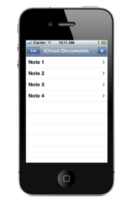

> 导航：[总目录](../../../README.md) · [documentation](../../../_indexes/documentation.md)

[Next](Getting%20Started.md)

# About Your Third iOS App

Your Third iOS App introduces you to the iCloud document storage APIs. You use these APIs to store and manipulate files in a user’s iCloud storage.

During this tutorial, you will build an app that creates and manages text files in a user’s iCloud storage. This app is intended as a primer to teach you the basic iCloud concepts and to give you some hands on experience creating a simple iCloud app.

To benefit from this tutorial, you must already have some familiarity with the basics of computer programming in general and with the [Objective-C](https://developer.apple.com/library/archive/documentation/General/Conceptual/DevPedia-CocoaCore/ObjectiveC.html#//apple_ref/doc/uid/TP40008195-CH43) language in particular. This tutorial does not describe the more basic aspects of app design in order to focus on iCloud integration. Therefore, you should go through the app-related tutorials in order to develop a basic understanding of the app creation process.

_Your Third iOS App_ builds on the knowledge you gained in _Your First iOS App_ and _[Your Second iOS App: Storyboards](../../iPhone/Your%20Second%20iOS%20App-%20Storyboards/About%20Creating%20Your%20Second%20iOS%20App.md#apple-f4xwc4dqnrsv64tfmyxwi33df52wszbpkridimbqgeytgmjy)_ to show you how to incorporate support for storing documents in iCloud.

### Configuring Your Project to Use iCloud

Apps that use iCloud must be signed with special entitlements that grant them access to the document storage space in a user’s iCloud account. To set up these entitlements, you modify your project’s configuration and perform several steps in Xcode and the iOS Member Center. Although you can do some of this configuration later in your development cycle, this tutorial addresses these issues first so that you can be assured that your project works correctly later.

### Managing Your Files Using Document Objects

Document objects are the easiest way to manage files in you store in a user’s iCloud account. Each document object manages a discrete portion of your app’s data and is responsible for writing that data to disk and reading it back into memory at appropriate times. All interactions with that data occur through the interfaces of the document class you define.

### Building the App’s User Interface

Although iCloud primarily manages your app’s data, your app still needs a user interface to present that data. This tutorial uses two view controllers to present its content. The first displays the list of available documents and manages the creation and deletion of those documents. The second displays the contents of a document and allows you to edit those contents.

### Searching for Existing Documents in iCloud

Searching for documents in iCloud is necessary because the list of documents can change while your app is not running. Documents can be created on different devices and the user can delete documents that are no longer needed. Your app uses a metadata query object to search for documents and detect changes to the document list.

### Solving Problems and Choosing Your Next Steps

As you complete the tasks in this tutorial, you might encounter problems that you do not know how to solve. There are a few common errors that you can look for and it includes code listings that you can compare against the code in your project.

After you finish this tutorial, you should think about ways to improve your app and increase your knowledge.

The following tutorials introduce best practices for creating all apps and should be read before this tutorial:

- _Your First iOS App_
- _[Your Second iOS App: Storyboards](../../iPhone/Your%20Second%20iOS%20App-%20Storyboards/About%20Creating%20Your%20Second%20iOS%20App.md#apple-f4xwc4dqnrsv64tfmyxwi33df52wszbpkridimbqgeytgmjy)_

This tutorial demonstrates only one aspect of app development, namely the adoption of iCloud in your app’s data model and controller layers. For information about other key aspects of app development, see the following documents:

- To learn about the recommended approaches to designing the user interface and user experience of an iOS app, see _iOS Human Interface Guidelines_.
- For comprehensive guidance on creating a full-featured iOS app, see _[App Programming Guide for iOS](https://developer.apple.com/library/archive/documentation/iPhone/Conceptual/iPhoneOSProgrammingGuide/Introduction/Introduction.html#//apple_ref/doc/uid/TP40007072)_.
- For more detailed information about creating a document-based app, see _[Document-Based App Programming Guide for iOS](../../Data%20Management/Document-Based%20App%20Programming%20Guide%20for%20iOS/About%20Document-Based%20Applications%20in%20iOS.md#apple-f4xwc4dqnrsv64tfmyxwi33df52wszbpkridimbqgeytcnbz)_.
- To learn about all the tasks you need to perform as you prepare to submit your app to the App Store, see _App Distribution Guide_.
[Next](Getting%20Started.md)

