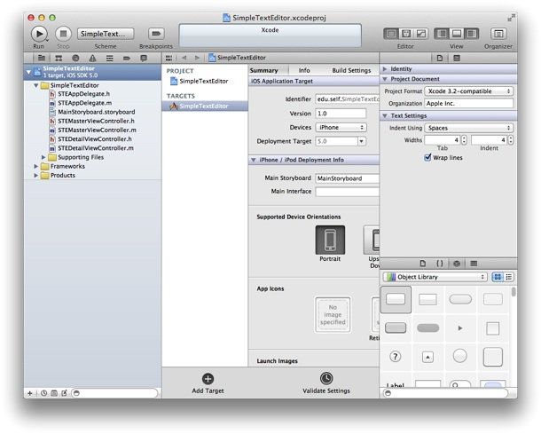
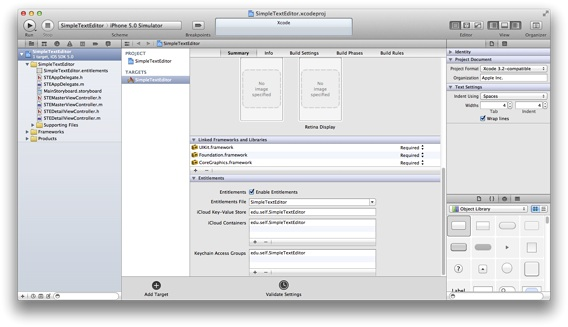

> 导航：[总目录](../../../README.md) · [documentation](../../../_indexes/documentation.md) · [Your Third iOS App: iCloud](About%20Your%20Third%20iOS%20App.md)


[Next](Defining%20Your%20Document%20Subclass.md)[Previous](About%20Your%20Third%20iOS%20App.md)

# Getting Started

To create the iOS app in this tutorial, you need Xcode 4.2 or later and the iOS SDK. Xcode is Apple’s integrated development environment for both iOS and Mac OS X development. The iOS SDK includes the programming interfaces of the iOS platform.

If you do not have Xcode installed on your Mac, visit the [iOS Dev Center](https://developer.apple.com/devcenter/ios) and download the Xcode 4.2 developer toolset (which includes the iOS 5 SDK). Double-click the package and follow the installer instructions.

To get started developing your app, create a new Xcode project.

To create a new project

1. Open Xcode.
2. Choose File > New > New Project to initiate the creation of your project.
3. In the iOS section, select Application, select Master-Detail Application from the list of templates, and then click Next.

   A new dialog appears that prompts you to name your app and choose additional options for your project.
4. Fill in the Product Name, Company Identifier, and Class Prefix fields.

   You can use the following values:

   - Product Name: `SimpleTextEditor`
   - Company Identifier: Your company identifier, if you have one, or `edu.self` if you do not have one.
   - Class Prefix: `STE`
5. In the Device Family pop-up menu, make sure that iPhone is selected.
6. Make sure that the Use Storyboard and Use Automatic Reference Counting options are selected and that the Include Unit Tests option is unselected. (These are the default values.)
7. Click Next.

   Another dialog appears asking you to specify where you want to save your project.
8. Specify a location for your project (leave the Source Control option unselected) and then click Create.

   You should see a new project window similar to this:

   

Because you have not yet added any iCloud functionality, you can build your app and run it in the Simulator application that is included in Xcode. As its name implies, Simulator allows you to get an idea of how your app would look and behave if it were running on an iOS–based device. However, for the rest of the project, you should build your app and run it on an iOS device that is configured with iOS 5 and has an active iCloud account.

Apps that use iCloud must be configured with special entitlements to ensure secure access to the user’s account. You configure these entitlements directly from Xcode.

To configure your iCloud entitlements

1. Select the target for your project.
2. In the Summary tab, scroll down to the Entitlements section.
3. Select the Enable Entitlements option.

   Xcode adds an entitlements file to your project and automatically enters default values for accessing iCloud.

   

For this tutorial, the default entitlement values provided by Xcode are sufficient. In your own projects, you can change these values if needed to match the bundle identifier for another one of your app’s. For example, if you create a free version of your app, you can assign the bundle identifier for the paid version so that the two versions of the app share data. Doing so means that upgrading from the free version to the paid one does not make the user’s previous data inaccessible.

Before you can install an iCloud app on a device, you must create an app ID and provisioning profile. Creating app IDs and provisioning profiles can only be done by administrative users. If you do not have administrative privileges, you must ask another member of your team to help you.

The app ID uniquely identifies your app on a device and in iCloud. For detailed instructions, see Creating App IDs in _App Distribution Guide_. Use the following details:

- Description: `Simple Text Editor`
- App Services: Enable iCloud
- App ID Suffix: Explicit app identifier
- Bundle Identifier: Use your app’s bundle identifier. This is a combination of your company identifier and the SimpleTextEditor app name. To see this value in Xcode, go to the Summary pane of your app target and look in the Identifier field.

You also need to generate a provisioning profile that you can use during development. For detailed instructions, see Creating Development Provisioning Profiles in _App Distribution Guide_. Use the following details:

- Profile Name: `My Simple Text Editor Profile`
- Certificates: Select your user name.
- App ID: `Simple Text Editor` (This is the app ID you configured previously.)
- Devices: Select the devices you plan to use to test the app.

If your machine is configured with the appropriate certificates, the provisioning profile should show up in the Xcode organizer as valid. If there is any mismatch in the installed certificates, Xcode displays an appropriate message in the Organizer window. You can use this information to help diagnose the problem. For more information about diagnosing provisioning profile issues, see [Diagnosing Provisioning Profile Issues](Troubleshooting.md#apple-f4xwc4dqnrsv64tfmyxwi33df52wszbpkridimbqgeytgmjxfvbuqnrnknlte).

After generating the custom provisioning profile for your app, you must associate that profile with your project.

To associate the provisioning profile with your project

1. Select the target for your project.
2. In the Build Settings tab, search for Code Signing Identity.
3. From the Code Signing Identity popup, select your provisioning profile.

You must specify the provisioning profile you created specifically for your app. You cannot use the generic Team Provisioning Profile to test iCloud apps.

Before you attempt to use iCloud for the first time, you need to call the [URLForUbiquityContainerIdentifier:](https://developer.apple.com/documentation/foundation/nsfilemanager/1411653-urlforubiquitycontaineridentifie) method and give the system a chance to prepare your app for iCloud use. The first time you call this method, it modifies your app sandbox so that it can access its container directories. It also performs other checks to see if iCloud is actually available and configured on the current device. Because these checks can take some time, you should call it early in your app’s launch cycle so that it has time to complete before your app needs access to any files. If your app has access to multiple container directories, you must call the method separately for each one.

To initialize your app’s iCloud container

1. In the project navigator, select `STEAppDelegate.m`.
2. Define a new method called `initializeiCloudAccess` to check for iCloud availability.

   The Simple Text Editor does not change its configuration based on whether iCloud is available, so this method just logs the results. In your own apps, you might use the result to perform additional configuration steps.

```objc
- (void)initializeiCloudAccess {
   dispatch_async(dispatch_get_global_queue(DISPATCH_QUEUE_PRIORITY_DEFAULT, 0), ^{
      if ([[NSFileManager defaultManager]
            URLForUbiquityContainerIdentifier:nil] != nil)
         NSLog(@"iCloud is available\n");
      else
         NSLog(@"This tutorial requires iCloud, but it is not available.\n");
   });
}
```
3. In the [application:didFinishLaunchingWithOptions:](https://developer.apple.com/documentation/uikit/uiapplicationdelegate/1622921-application) method, call the `initializeiCloudAccess` method.

```objc
- (BOOL)application:(UIApplication *)application
        didFinishLaunchingWithOptions:(NSDictionary *)launchOptions {
   [self initializeiCloudAccess];

   // Override point for customization after application launch.
   return YES;
}
```

Your own apps can use this early call of the `URLForUbiquityContainerIdentifier:` method to perform some app-specific tasks related to iCloud availability. For example, you might use the result to configure your app’s data structures differently. You might also use it to set configuration options for your user interface. Because this method might return its value either before or after your user interface is configured, you should not attempt to modify your interface directly from here. Instead, set a flag and notify the appropriate interface objects that the app configuration has changed. Those objects should then take appropriate action based on the value of the flag.

In this chapter, you used Xcode to create a new project based on the Master-Detail template. Then, you configured the iCloud entitlements for your project. You also created an app ID and provisioning profile for your project using the iOS Member Center and associated the provisioning profile with your project. Finally, you initialized your iCloud container directory in your app’s launch code.

At this point, your project is configured and ready to be installed on the iOS devices you specified. In the next chapter, you will start writing the code you need to take advantage of iCloud’s document support.

[Next](Defining%20Your%20Document%20Subclass.md)[Previous](About%20Your%20Third%20iOS%20App.md)

