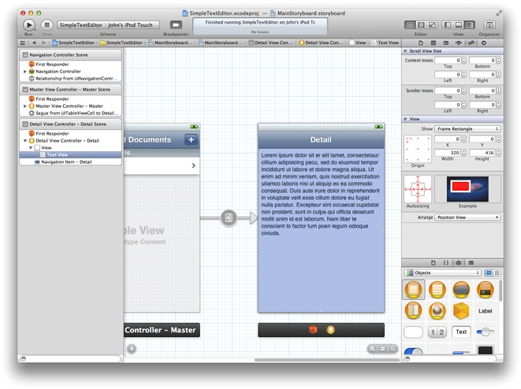
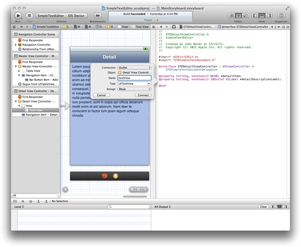

> 导航：[总目录](../../../README.md) · [documentation](../../../_indexes/documentation.md) · [Your Third iOS App: iCloud](About%20Your%20Third%20iOS%20App.md)


[Next](Searching%20for%20iCloud%20Documents.md)[Previous](Implementing%20the%20Master%20View%20Controller.md)

# Implementing the Detail View Controller

With the master view controller able to generate URLs, you now need a way to create and manage the actual files at those URLs. Your Xcode project includes a detail view controller for displaying the contents of item selected in the master view controller’s table. In this chapter, you will use that detail view controller to create a document object, display the document’s current text, provide a way to edit that text, and save the text back to disk.

The default view provided for the detail view controller contains a single label object. For text editing, the label is not sufficient and needs to be replaced with a text view, which supports multiline text entry.

Before setting up the view itself, you need to to prepare the detail view controller source files. You need to make the class conform to the `STESimpleTextDocumentDelegate` protocol and there is also some cleanup you need to do to account for not using the label object.

To prepare the source files for the text view

1. In the project navigator, select `STEDetailViewController.h`.
2. Add an import statement for the `STESimpleTextDocument.h` header file.

```objc
#import "STESimpleTextDocument.h"
```
3. Make the detail view controller conform to the `STESimpleTextDocumentDelegate` protocol.

```objc
@interface STEDetailViewController : UIViewController <STESimpleTextDocumentDelegate>
```
4. Change the type of the existing `detailItem` property from `id` to `NSURL*`.

   The master view controller passes an [NSURL](https://developer.apple.com/documentation/foundation/nsurl) object to the detail view controller. The detail view controller uses that URL to create the corresponding document object.
5. In the project navigator, select `STEDetailViewController.m`
6. Add a private `_document` member variable whose type is the `STESimpleTextDocument` class.

   The member variable is used privately to store the document object. The beginning of your class implementation should now look like the following:

```objc
@implementation STEDetailViewController {
    STESimpleTextDocument* _document;
}
@synthesize detailItem = _detailItem;
@synthesize detailDescriptionLabel = _detailDescriptionLabel;
```
7. Comment out the implementation of the `setDetailItem:` method.

   The custom implementation of the `setDetailItem:` accessor method causes the label to be updated. Because the label is not used, you can comment out this custom method and just use the compiler-generated accessor methods.

Now that the source files are configured, you can add the text view to the storyboard file and connect the appropriate outlets. In addition to the detail view controller having an outlet for the text view, it also acts as the delegate for the text view. Both outlets must be configured in the storyboard.

To add the text view to the storyboard file

1. In the project navigator, select `MainStoryboard.storyboard`.
2. In the Detail Scene, delete the default label that comes with the view.

   You will not need the label for this tutorial.
3. Drag a text view object onto the detail view.

   Position the text view so that it aligns with the edges of the underlying content view. You want the text view to fill the entire space underneath the navigation bar. The autosizing options of the text view object should already be configured to resize itself to match its underlying content view.

   
4. Show the Assistant editor.

   When you click the Assistant editor button in your project, the editor displays the `STEMasterViewController.h` file alongside your storyboard file.
5. Control-click the text view and drag to the header file to create an outlet for the view.

   Use the name `textView` for the outlet.

   
6. Connect the `delegate` outlet of the text view object to the `STEDetailViewController` class.

   The `STEDetailViewController` object acts as the delegate for the text view.

When the user taps a cell in the master view controller’s table, the associated segue loads a new detail view controller and displays it to the user. However, before the detail view controller is actually displayed, the master view controller’s [prepareForSegue:sender:](https://developer.apple.com/documentation/uikit/uiviewcontroller/1621490-prepareforsegue) method is called to give it a chance to pass any needed data to the detail view controller.

The Simple Text Editor app uses the `prepareForSegue:sender:` method to assign the selected URL object to the detail view controller.

To configure the detail view controller during a segue

1. In the project navigator, select `STEMasterViewController.m`.
2. Add the `STESimpleTextDocument.h` header file to the list of imported headers.

```objc
#import "STEDetailViewController.h"
```
3. Add an implementation for the `prepareForSegue:sender:` method to your implementation.

   The implementation of this method identifies the URL of the document using the table view cell passed in to the `sender` parameter. The location of that cell in the table determines which URL to retrieve from the `documents` array and assign to the `detailItem` property of the detail view controller.

```objc
- (void)prepareForSegue:(UIStoryboardSegue *)segue sender:(id)sender {
    if (![segue.identifier isEqualToString:DisplayDetailSegue])
        return;

    // Get the detail view controller.
    STEDetailViewController* destVC =
           (STEDetailViewController*)segue.destinationViewController;

    // Find the correct dictionary from the documents array.
    NSIndexPath *cellPath = [self.tableView indexPathForSelectedRow];
    UITableViewCell *theCell = [self.tableView cellForRowAtIndexPath:cellPath];
    NSURL *theURL = [documents objectAtIndex:[cellPath row]];

    // Assign the URL to the detail view controller and
    // set the title of the view controller to the doc name.
    destVC.detailItem = theURL;
    destVC.navigationItem.title = theCell.textLabel.text;
}
```

Although the detail view controller now has a reference to the appropriate URL, it needs to create the document and either open it or create it. The view controller does this when its view is about to appear onscreen.

To set the initial text for the text view

1. In the project navigator, select `STEDetailViewController.m`.
2. Update the [viewWillAppear:](https://developer.apple.com/documentation/uikit/uiviewcontroller/1621510-viewwillappear) method to create the document object.

   After clearing out the text view, the first step is to create the document object and assign the detail view controller as the document’s delegate. After that, document creation proceeds differently depending on whether you are opening an existing document or creating a new one. For existing documents, call the [openWithCompletionHandler:](https://developer.apple.com/documentation/uikit/uidocument/1619977-open) method to load the document’s existing contents. For new documents, call the [saveToURL:forSaveOperation:completionHandler:](https://developer.apple.com/documentation/uikit/uidocument/1619988-save) method to create the file on disk.

   Your implementation of the `viewWillAppear:` method should look like to the following:

```objc
- (void)viewWillAppear:(BOOL)animated {
    [super viewWillAppear:animated];

    // Clear out the text view contents.
    self.textView.text = @"";

    // Create the document and assign the delegate.
    _document = [[STESimpleTextDocument alloc] initWithFileURL:self.detailItem];
    _document.delegate = self;

    // If the file exists, open it; otherwise, create it.
    NSFileManager *fm = [NSFileManager defaultManager];
    if ([fm fileExistsAtPath:[self.detailItem path]])
        [_document openWithCompletionHandler:nil];
    else
        // Save the new document to disk.
        [_document saveToURL:self.detailItem
                   forSaveOperation:UIDocumentSaveForCreating
                   completionHandler:nil];
}
```

When opening an existing document, it usually takes some time to load the document’s content from disk. Rather than delay the presentation of the corresponding views while the document loads, the detail view controller presents its views as usual. Initially, the text view contains no content. However, because the detail view controller assigned itself as the delegate of the document, it is notified when the document content has finished loading. It then uses the `documentContentsDidChange:` delegate method to update the text view.

To update the text view when the document finishes loading

1. In the project navigator, select `STEDetailViewController.m`.
2. Add an implementation for the `documentContentsDidChange:` method.

   By the time this method is called, the document object contains the changed text. Thus, your implementation of this method should assign that text to the text view. Because the delegate method could be called on any thread, this method includes an explicit dispatch call to ensure that the code is executed from the app’s main queue.

```objc
- (void)documentContentsDidChange:(STESimpleTextDocument *)document {
    dispatch_async(dispatch_get_main_queue(), ^{
        self.textView.text = document.documentText;
    });
}
```


When the user taps the back button to return to the list of documents, the detail view controller writes the current changes back to the document object and then closes the document. Closing the document causes any changes to be written to disk asynchronously.

To save changes to the document

1. In the project navigator, select `STEDetailViewController.m`.
2. Update the implementation of your [viewWillDisappear:](https://developer.apple.com/documentation/uikit/uiviewcontroller/1621485-viewwilldisappear) method to copy the current text back to the document object and close the document.

```objc
- (void)viewWillDisappear:(BOOL)animated {
    [super viewWillDisappear:animated];

    NSString* newText = self.textView.text;
    _document.documentText = newText;

    // Close the document.
    [_document closeWithCompletionHandler:nil];
```

   The `viewWillDisappear:` method is called just before the detail view controller is removed from the navigation controller’s stack.

Whenever the keyboard appears, it slides over the top of your app’s window, hiding the content underneath. In the Simple Text Editor app, this means that a large portion of the text view becomes partially hidden. This is a problem if the user types enough text to cause the cursor to move underneath the keyboard. To ensure that all of the user’s text is visible, you can adjust the content insets of the text view when the keyboard appears.

First, find out when the keyboard appears and disappears. To do that, you register for the keyboard notifications.

To register for the keyboard notifications

1. In the project navigator, select `STEDetailViewController.m`.
2. Register for the keyboard notifications in the [viewWillAppear:](https://developer.apple.com/documentation/uikit/uiviewcontroller/1621510-viewwillappear) method.

   Your detail view controller needs to register for both the [UIKeyboardWillShowNotification](https://developer.apple.com/documentation/uikit/uiresponder/1621576-keyboardwillshownotification) and [UIKeyboardWillHideNotification](https://developer.apple.com/documentation/uikit/uikeyboardwillhidenotification) notifications so that it can synchronizes its changes with the keyboard animations. Register for the notifications at the end of your `viewWillAppear:` method, whose implementation should now look like the following:

```objc
- (void)viewWillAppear:(BOOL)animated {
    [super viewWillAppear:animated];

    // Clear out the text view contents.
    self.textView.text = @"";

    // Create the document and assign the delegate.
    _document = [[STESimpleTextDocument alloc] initWithFileURL:self.detailItem];
    _document.delegate = self;

    // If the file exists, open it; otherwise, create it.
    NSFileManager *fm = [NSFileManager defaultManager];
    if ([fm fileExistsAtPath:[self.detailItem path]])
        [_document openWithCompletionHandler:nil];
    else
        // Save the new document to disk.
        [_document saveToURL:self.detailItem
                   forSaveOperation:UIDocumentSaveForCreating
                   completionHandler:nil];

    // Register for the keyboard notifications
    [[NSNotificationCenter defaultCenter] addObserver:self
                        selector:@selector(keyboardWillShow:)
                        name:UIKeyboardWillShowNotification
                        object:nil];
    [[NSNotificationCenter defaultCenter] addObserver:self
                        selector:@selector(keyboardWillHide:)
                        name:UIKeyboardWillHideNotification
                        object:nil];
}
```
3. Unregister for the keyboard notifications when your view disappears.

   You need to remove your observers for the keyboard notifications to prevent the notification center from calling your code at a time when your view controller might not exist. Unregister for the notifications in your [viewWillDisappear:](https://developer.apple.com/documentation/uikit/uiviewcontroller/1621485-viewwilldisappear) method, whose implementation should now look like the following:

```objc
- (void)viewWillDisappear:(BOOL)animated {
    [super viewWillDisappear:animated];

    NSString* newText = self.textView.text;
    _document.documentText = newText;

    // Close the document.
    [_document closeWithCompletionHandler:nil];

    // Unregister for the keyboard notifications.
    [[NSNotificationCenter defaultCenter] removeObserver:self
          name:UIKeyboardWillShowNotification
          object:nil];
    [[NSNotificationCenter defaultCenter] removeObserver:self
          name:UIKeyboardWillHideNotification
          object:nil];
}
```

The [UIKeyboardWillShowNotification](https://developer.apple.com/documentation/uikit/uiresponder/1621576-keyboardwillshownotification) notification is sent shortly before the keyboard is animated into place. The detail view controller class uses this notification to animate the changing of the text view content insets. Adding to the bottom inset causes the text to be shifted toward the top of the text view.

To adjust your text view when the keyboard is shown

1. In the project navigator, select `STEDetailViewController.m`.
2. Add the following implementation of the `keyboardWillShow:` method to your code.

   You should always use the keyboard size provided by the notification. The keyboard position an size can vary depending on the current language and input method. This method adds the height to the bottom inset, which causes text to be shifted up. The change to the insets is animated in to place at the same speed as the keyboard animation.

```objc
- (void)keyboardWillShow:(NSNotification*)aNotification {
    NSDictionary* info = [aNotification userInfo];
    CGRect kbSize = [[info objectForKey:UIKeyboardFrameEndUserInfoKey]
                             CGRectValue];
    double duration = [[info objectForKey:UIKeyboardAnimationDurationUserInfoKey]
                             doubleValue];

    UIEdgeInsets insets = self.textView.contentInset;
    insets.bottom += kbSize.size.height;

    [UIView animateWithDuration:duration animations:^{
        self.textView.contentInset = insets;
    }];
}
```

Before the keyboard disappears, you need to restore the content insets to their original values so that the content fills the text view again.

To restore the text view’s content insets when the keyboard is hidden

1. In the project navigator, select `STEDetailViewController.m`.
2. Add the following implementation of the `keyboardWasShown:` method to your code

   This method restores the bottom inset to 0, which causes text to flow right up to the bottom edge of the text view.

```objc
- (void)keyboardWillHide:(NSNotification*)aNotification {
    NSDictionary* info = [aNotification userInfo];
    double duration = [[info objectForKey:UIKeyboardAnimationDurationUserInfoKey]
                                doubleValue];

    // Reset the text view's bottom content inset.
    UIEdgeInsets insets = self.textView.contentInset;
    insets.bottom = 0;

    [UIView animateWithDuration:duration animations:^{
        self.textView.contentInset = insets;
    }];
}
```

It is recommended that you always use animations when changing views to accommodate the keyboard. Doing so helps prevent abrupt changes to the appearance of your content.

In this chapter, you created the document object and used it to open or create the corresponding file. You also learned how to save changes back to the document and prepare for segues. In the next chapter, you will learn how to search for the documents you have already created.

[Next](Searching%20for%20iCloud%20Documents.md)[Previous](Implementing%20the%20Master%20View%20Controller.md)

