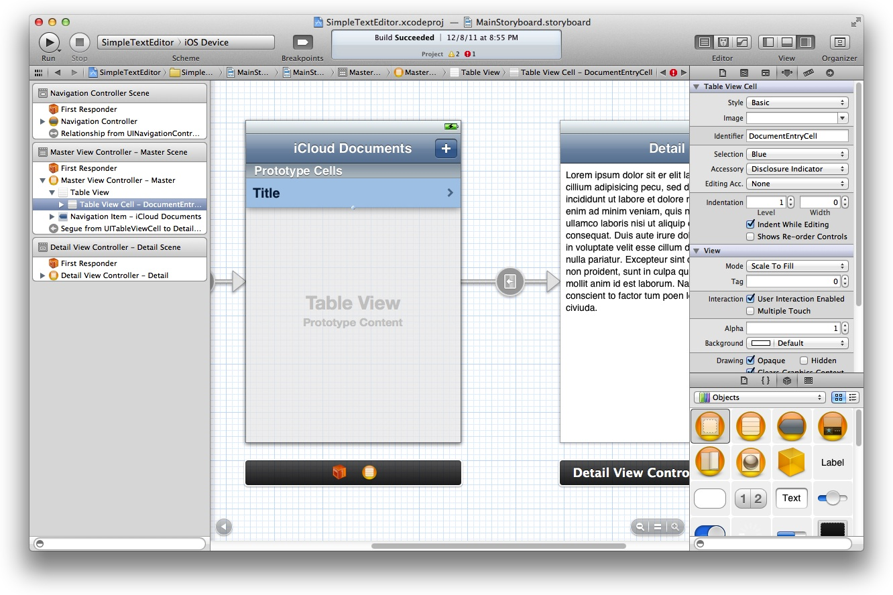
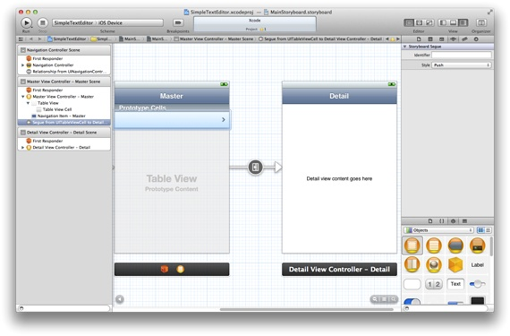
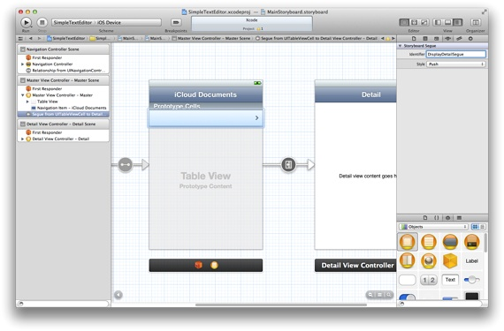
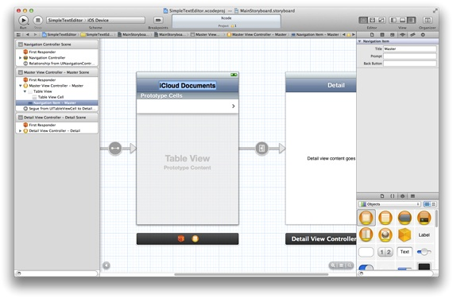
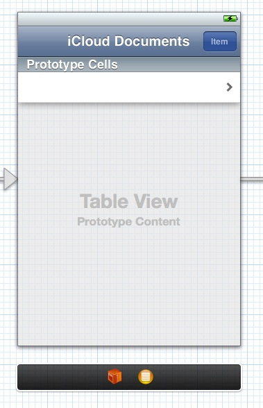
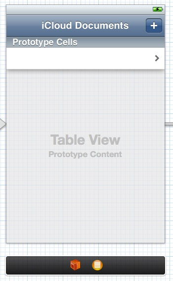
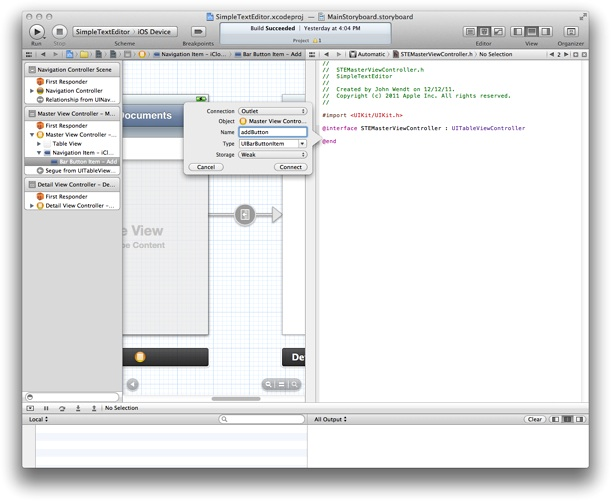
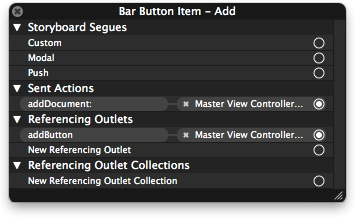

> 导航：[总目录](../../../README.md) · [documentation](../../../_indexes/documentation.md) · [Your Third iOS App: iCloud](About%20Your%20Third%20iOS%20App.md)


[Next](Implementing%20the%20Detail%20View%20Controller.md)[Previous](Defining%20Your%20Document%20Subclass.md)

# Implementing the Master View Controller

Now that your app has a document class, it is time to start building the interface that will display those documents. The Simple Text Editor app has one storyboard file that stores all of its view controllers and views. This storyboard contains a navigation controller, a master view controller, and a detail view controller. This chapter focuses on how to configure the master view controller and its associated code.

Setting up the master view controller is a process that includes the following steps:

1. Set up the view.
2. Configure the view controller’s data structures.
3. Implement some table data source methods.
4. Write code to specify the location of new documents.
5. Write code to edit the list of documents.

The first step for configuring the master view controller is to configure its view in your app’s storyboard file. The storyboard file contains a master scene and a detail scene. The default contents of the master scene include a table view and a navigation item.

The table view is configured to display static content initially but you must change it to display dynamically generated content. You also need to create a segue between the table cells and the detail view controller.

To configure the table cell to display dynamic content

1. In the project navigator, select `MainStoryboard.storyboard`.
2. Select the Table View, which is embedded in the master view controller.
3. Display the table attributes in the Attributes inspector.

   The table view is configured to display static content by default. You need to change the table to display content derived from a table data source.
4. For the Content field, change the value to Dynamic Prototypes.
5. Select the table view cell and open the Attributes inspector.
6. Set the Style field of the cell to Basic.
7. Set the value of the Identifier field to `DocumentEntryCell`.

   You must set the reuse identifier to create new instances of the cell.
8. Control-click the table view cell and drag it to the detail scene to create a segue.

   
9. When prompted, select Push from the list of segues.

   
10. Select the segue and open the Attributes inspector.
11. Set the value of the Identifier field to `DisplayDetailSegue`.

    You should always provide names for the segues in your storyboard files. You can use these names to trigger segues programmatically and to differentiate between multiple segues originating from the same view controller.

    

One last small detail is to change the title of the master view controller’s navigation item to something more appropriate for this app.

To change the title of the navigation item

1. In the project navigator, select `MainStoryboard.storyboard`.
2. In the master scene, double-click the title in the navigation bar to make it editable.
3. Change the title to `iCloud Documents`.

   

Your app displays the list of documents it finds in iCloud in the master view controller’s table view. Because this list can change over time, your app must provide the table contents dynamically. The master view controller must therefore manage the data structures that track the available documents.

The master view controller’s basic data structure is an array of [NSURL](https://developer.apple.com/documentation/foundation/nsurl) objects, in which each URL represents the location of a file in the app’s iCloud container directory. The array is stored in a member variable called `documents`.

To create the data structures for the master view controller

1. In the project navigator, select `STEMasterViewController.m`.
2. Add a private `documents` member variable to the class implementation and set its type to [NSMutableArray](https://developer.apple.com/library/archive/documentation/LegacyTechnologies/WebObjects/WebObjects_3.5/Reference/Frameworks/ObjC/Foundation/Classes/NSArrayClassCluster/Description.html#//apple_ref/occ/cl/NSMutableArray).

   The beginning of your class implementation should now look like the following:

```objc
@implementation STEMasterViewController {
    NSMutableArray *documents;
}
```
3. Add the following code to the existing `awakeFromNib` method:

```
if (!documents)
   documents = [[NSMutableArray alloc] init];
```

   You could also allocate the array in an initialization method of the view controller. For simplicity, the steps use the [awakeFromNib](https://developer.apple.com/documentation/objectivec/nsobject/1402907-awakefromnib) method that was provided by the template project.

There are several steps that you must perform before you can create new documents:

1. Generate a name for the new document.
2. Build the URL for the new document’s location.
3. Add a new document button to the UI.

These steps give you the infrastructure you need to create the document later in your app’s detail view controller.

Before you create the document, think about what name you want to give to the underlying file. Apps are expected to choose appropriate default names so that the user can start working quickly.

The Simple Text Editor app generates a new document name using a simple scheme. This scheme, implemented by the `newUntitledDocumentName` method, combines a static string with a dynamically chosen integer to create a potential document name. That name is then checked against the app’s existing document names. This method returns the first name it finds that is not in use.

To generate a default name for a document

1. In the project navigator, select `STEMasterViewController.m`.
2. Define a `STEDocFilenameExtension` string constant.

   Define this constant at the top of the source file. You use this constant to specify the type of files to look for. In this case, the app uses a custom filename extension.

```
NSString* STEDocFilenameExtension = @"stedoc";
```
3. Implement the `newUntitledDocumentName` method.

```objc
- (NSString*)newUntitledDocumentName {
   NSInteger docCount = 1;     // Start with 1 and go from there.
   NSString* newDocName = nil;

   // At this point, the document list should be up-to-date.
   BOOL done = NO;
   while (!done) {
      newDocName = [NSString stringWithFormat:@"Note %d.%@",
                      docCount, STEDocFilenameExtension];

      // Look for an existing document with the same name. If one is
      // found, increment the docCount value and try again.
      BOOL nameExists = NO;
      for (NSURL* aURL in documents) {
         if ([[aURL lastPathComponent] isEqualToString:newDocName]) {
            docCount++;
            nameExists = YES;
            break;
         }
      }

      // If the name wasn't found, exit the loop.
      if (!nameExists)
         done = YES;
   }
   return newDocName;
}
```

   This method increments an integer variable to create unique document names—for example, `Note 1`, `Note 2`, `Note 3`, and so on. Rather than increment the variable continuously, the method always starts at 1 and looks for the first name that is not in use. This technique keeps the document names simple and avoids their containing potentially large numerical values.
4. Add a forward declaration of the `newUntitledDocumentName` method at the top of the file.

Now that you can specify unique names, you need a method to create the URL for the document’s associated file. One option is to create the file locally and move it to iCloud using the [setUbiquitous:itemAtURL:destinationURL:error:](https://developer.apple.com/documentation/foundation/filemanager/1413989-setubiquitous) method. This technique is preferred for shipping apps because it guarantees that that there is a valid location for creating the file. For simplicity in this tutorial, and because it only works with files that are in iCloud, the Simple Text Editor app creates its documents directly in the iCloud container directory.

After creating the URL, the master view controller updates its table and pushes a detail view controller onto the navigation stack. The detail view controller then handles the creation of the document object based on the new URL. The `addDocument:` method is the action method responsible for building the URL for the new document.

To implement the addDocument: method

1. In the project navigator, select `STEMasterViewController.m`.
2. At the top of the source file, include the header file that defines the `STESimpleTextDocument` class:

```objc
#import "STESimpleTextDocument.h"
```
3. Define a `DisplayDetailSegue` string constant for the segue to be performed.

   Define this constant at the top of the source file. The string value must match the value in your segue’s Identifier field. Your constant declaration should look like the following:

```
NSString* DisplayDetailSegue = @"DisplayDetailSegue";
```
4. Define a `STEDocumentsDirectoryName` string constant for the iCloud `Documents` directory.

   Define this constant at the top of the source file. Your constant declaration should look like the following:

```
NSString* STEDocumentsDirectoryName = @"Documents";
```
5. Add an `addDocument:` method to the source file.

   This method is implemented as an [action](https://developer.apple.com/library/archive/documentation/General/Conceptual/Devpedia-CocoaApp/TargetAction.html#//apple_ref/doc/uid/TP40009071-CH3) method so that it can be linked to a button. This method identifies a suitable URL for the new document, updates the app’s data structures, and segues to the detail view to begin editing.

   Use the following implementation of the `addDocument:` method in your code:

```objc
- (IBAction)addDocument:(id)sender {
    // Disable the Add button while creating the document.
    self.addButton.enabled = NO;

    dispatch_async(dispatch_get_global_queue(DISPATCH_QUEUE_PRIORITY_DEFAULT, 0), ^{
        // Create the new URL object on a background queue.
        NSFileManager *fm = [NSFileManager defaultManager];
        NSURL *newDocumentURL = [fm URLForUbiquityContainerIdentifier:nil];

        newDocumentURL = [newDocumentURL
            URLByAppendingPathComponent:STEDocumentsDirectoryName
            isDirectory:YES];
        newDocumentURL = [newDocumentURL
            URLByAppendingPathComponent:[self newUntitledDocumentName]];

        // Perform the remaining tasks on the main queue.
        dispatch_async(dispatch_get_main_queue(), ^{
            // Update the data structures and table.
            [documents addObject:newDocumentURL];

            // Update the table.
            NSIndexPath* newCellIndexPath =
            [NSIndexPath indexPathForRow:([documents count] - 1) inSection:0];
            [self.tableView insertRowsAtIndexPaths:[NSArray arrayWithObject:newCellIndexPath]
                            withRowAnimation:UITableViewRowAnimationAutomatic];

            [self.tableView selectRowAtIndexPath:newCellIndexPath
                            animated:YES
                            scrollPosition:UITableViewScrollPositionMiddle];

            // Segue to the detail view controller to begin editing.
            UITableViewCell* selectedCell = [self.tableView
                           cellForRowAtIndexPath:newCellIndexPath];
            [self performSegueWithIdentifier:DisplayDetailSegue sender:selectedCell];

            // Reenable the Add button.
            self.addButton.enabled = YES;
        });
    });
}
```

Note that the project will not compile at this point. You must complete the steps in the following section, [Adding a New Document Button](#apple-f4xwc4dqnrsv64tfmyxwi33df52wszbpkridimbqgeytgmjxfvbuqnbnknltcny), before the code will compile.

Now that you have an action method for creating documents, you need to add a button to the user interface and configure it to call that method.

To add a New Document button to the navigation bar

1. In the project navigator, select `MainStoryboard.storyboard`.
2. Scroll the frame so that the master scene is visible.
3. Drag a bar button item from the library and drop it onto the top-right corner of the navigation bar.

   Your master scene should now look like the following:

   
4. Select the bar button item and open the Attributes inspector.
5. Change the value in the button’s Identifier pop-up menu to Add.

   The Add button type is one of the standard button types provided by the system for common tasks. This type automatically configures the image displayed on the button to be a plus sign.

   
6. Show the Assistant editor.

   When you click the Assistant editor button in your project, the editor displays the `STEMasterViewController.h` file alongside your storyboard file.
7. Control-click the bar button item and drag to the header file to create an outlet for the button.

   Use the name `addButton` for the outlet.

   
8. Connect the Add button’s selector action to the master view controller’s `addDocument:` method.

   The connections for the Add button should now look like the following:

   

Although you can create new documents, those documents do not yet appear in the master scene’s table view. Because the table view gets its data dynamically, you need to implement the table’s data source methods—specifically, the [tableView:numberOfRowsInSection:](https://developer.apple.com/documentation/uikit/uitableviewdatasource/1614931-tableview) and [tableView:cellForRowAtIndexPath:](https://developer.apple.com/documentation/uikit/uitableviewdatasource/1614861-tableview) data source methods. The first method reports the number of documents that are available, and the second provides the actual table cell objects to display.

In Simple Text Editor, the number of rows in the table is equal to the number of entries in the `documents` array. The implementation of your `tableView:numberOfRowsInSection:` method should therefore just return the number of entries in the array.

To implement the tableView:numberOfRowsInSection: method

1. In the project navigator, select `STEMasterViewController.m`.
2. Implement the `tableView:numberOfRowsInSection:` method as follows:

```objc
- (NSInteger)tableView:(UITableView *)tableView
             numberOfRowsInSection:(NSInteger)section {
    return [documents count];
}
```

For each row, the data source provides a table view cell that displays the name of the document. The Simple Text Editor app uses the default style for its table cells.

To implement the tableView:cellForRowAtIndexPath: method

1. In the project navigator, select `STEMasterViewController.m`.
2. Define a `DocumentEntryCell` string constant for the table view cell’s reuse identifier.

   Define this constant at the top of the source file with the other constants defined in previous steps. Make sure the value of this constant is the string `DocumentEntryCell`. This string must match the value you assigned to the Identifier field of your prototype cell. Your constant declaration should look like the following:

```
NSString* DocumentEntryCell = @"DocumentEntryCell";
```
3. Implement the `tableView:cellForRowAtIndexPath:` method as follows:

```objc
- (UITableViewCell*)tableView:(UITableView *)tableView
                    cellForRowAtIndexPath:(NSIndexPath *)indexPath {
    UITableViewCell *newCell = [tableView dequeueReusableCellWithIdentifier:DocumentEntryCell];
    if (!newCell)
        newCell = [[UITableViewCell alloc] initWithStyle:UITableViewCellStyleDefault
                                           reuseIdentifier:DocumentEntryCell];

    if (!newCell)
        return nil;

    // Get the doc at the specified row.
    NSURL *fileURL = [documents objectAtIndex:[indexPath row]];

    // Configure the cell.
    newCell.textLabel.text = [[fileURL lastPathComponent] stringByDeletingPathExtension];
    return newCell;
}
```

   The standard way to implement this method is to recycle an existing table cell (or create a new one), set the value for that cell, and return it. For this app, the index of the cell always corresponds to the index of the corresponding URL in the `documents` array. This correspondence makes it easy to retrieve the URL and assign the corresponding filename to the cell’s label.

There is one last feature to add to the master view controller: support for deleting rows in the table. You delete rows by using the table view’s built-in editing support. This feature will make it easier for you to test your app later.

The first step is to add a button that the user can tap to put the table into editing mode. The [UIViewController](https://developer.apple.com/documentation/uikit/uiviewcontroller) class provides a preconfigured bar button item that you can use to implement an Edit button.

To add the Edit button to the navigation bar

1. In the project navigator, select `STEMasterViewController.m`.
2. Add the following line of code to the [awakeFromNib](https://developer.apple.com/documentation/objectivec/nsobject/1402907-awakefromnib) method:

```
self.navigationItem.leftBarButtonItem = self.editButtonItem;
```

When the user taps the Edit button, it calls the [setEditing:animated:](https://developer.apple.com/documentation/uikit/uiviewcontroller/1621378-setediting) method of the view controller to begin the editing process. At the same time, the appearance of the button changes to that of a Done button to provide feedback to the user about the change in edit mode. Tapping the Done button exits edit mode.

When the master view controller is in edit mode, it adds controls to its table to allow for deleting individual rows. Although the controls are visible and can be tapped by the user, doing so does not actually delete the underlying files yet. To handle the file deletion, you need to implement the [tableView:commitEditingStyle:forRowAtIndexPath:](https://developer.apple.com/documentation/uikit/uitableviewdatasource/1614871-tableview) data source method. Your implementation of this method must delete the files and update the table data structures.

To handle the deletion of table rows

1. In the project navigator, select `STEMasterViewController.m`.
2. Add the implementation of the `tableView:commitEditingStyle:forRowAtIndexPath:` method to your code.

   The Xcode project provides a commented-out version of this method for you to start with. Replace the commented-out version with the implementation provided here. This implementation uses a file coordinator to delete the file on a background thread and then update the app’s data structures before notifying the table of the deletion. The order of these last two operations is important because the table view expects your data source to be up to date by the time you tell it to delete any rows.

```objc
 - (void)tableView:(UITableView *)tableView
         commitEditingStyle:(UITableViewCellEditingStyle)editingStyle
         forRowAtIndexPath:(NSIndexPath *)indexPath {
     if (editingStyle == UITableViewCellEditingStyleDelete) {
         NSURL *fileURL = [documents objectAtIndex:[indexPath row]];

         // Don't use file coordinators on the app's main queue.
         dispatch_async(dispatch_get_global_queue(DISPATCH_QUEUE_PRIORITY_DEFAULT, 0), ^{
             NSFileCoordinator *fc = [[NSFileCoordinator alloc]
                                      initWithFilePresenter:nil];
             [fc coordinateWritingItemAtURL:fileURL
                 options:NSFileCoordinatorWritingForDeleting
                 error:nil
                 byAccessor:^(NSURL *newURL) {
                     NSFileManager *fm = [[NSFileManager alloc] init];
                     [fm removeItemAtURL:newURL error:nil];
             }];
         });

         // Remove the URL from the documents array.
         [documents removeObjectAtIndex:[indexPath row]];

         // Update the table UI. This must happen after
         // updating the documents array.
         [tableView deleteRowsAtIndexPaths:[NSArray arrayWithObject:indexPath]
                    withRowAnimation:UITableViewRowAnimationAutomatic];
     }
 }
```

When deleting or moving files stored in iCloud, always use an [NSFileCoordinator](https://developer.apple.com/documentation/foundation/nsfilecoordinator) object. This is one of the few times when you must create the file coordinator object yourself. In most other cases, the document object creates one for you and uses it to perform the relevant file-related operation. The file coordinator ensures that the iCloud service cannot modify the file while you are deleting it. It also ensures that the iCloud service is notified when you do delete the file. For more information about using file coordinators, see _[File System Programming Guide](../../File%20Management/File%20System%20Programming%20Guide/About%20Files%20and%20Directories.md#apple-f4xwc4dqnrsv64tfmyxwi33df52wszbpkridimbqgeydmnzs)_.

In this chapter, you configured the table view for the master view controller and added controls that let you create and edit the list of documents. You also implemented the code needed to create and delete your document files in iCloud. Finally, you configured a storyboard segue that responds to the selection of a document by displaying the detail view controller. In the next chapter, you will learn how to display and edit the contents of a document using the detail view controller.

[Next](Implementing%20the%20Detail%20View%20Controller.md)[Previous](Defining%20Your%20Document%20Subclass.md)

