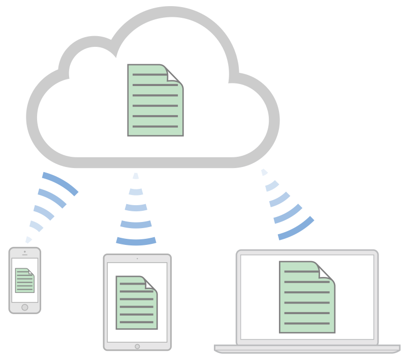

> 导航：[总目录](../../../README.md) · [documentation](../../../_indexes/documentation.md)

[Next](iCloud%20Fundamentals%20%28Key-Value%20and%20Document%20Storage%29.md)

# About Incorporating iCloud into Your App

iCloud is a free service that lets users access their personal content on all their devices—wirelessly and automatically via Apple ID. iCloud does this by combining network-based storage with dedicated APIs, supported by full integration with the operating system. Apple provides server infrastructure, backup, and user accounts, so you can focus on building great iCloud-enabled apps.

There are three iCloud storage services: key-value storage, document storage, and CloudKit. The core idea behind key-value and document storage is to eliminate explicit synchronization between devices. A user never needs to think about syncing, and your app never interacts directly with iCloud servers. When you adopt these APIs as described in this document, changes appear automatically on all the devices attached to an iCloud account. Your users get safe, consistent, and transparent access to their personal content everywhere.

CloudKit allows you to store app and user data as records in a public database, that is shared between users of your app, or a private database accessible only by the current user. However, it’s your responsibility to determine when to fetch and save records. Because the data is shared, your app also needs to keep local records synchronized. For native apps, CloudKit provides the CloudKit framework, and for web apps, the CloudKit JS library and web services to access these databases.

To check the availability of iCloud services for your type of app, see Supported Capabilities in _App Distribution Guide_.

iCloud is all about content, so your integration effort focuses on the model layer of your app. Because instances of your app running on a user’s other devices can change the local app instance’s data model, you design your app to handle such changes. You might also need to modify the user interface for presenting iCloud-based files and data.

In one important case, [Cocoa](https://developer.apple.com/library/archive/documentation/General/Conceptual/DevPedia-CocoaCore/Cocoa.html#//apple_ref/doc/uid/TP40008195-CH9) adopts iCloud for you: A document-based app for OS X v10.8 or later requires very little iCloud adoption work, thanks to the capabilities of the [NSDocument](https://developer.apple.com/documentation/appkit/nsdocument) class.

There are many different ways you can use iCloud storage, and a variety of technologies available to access it. This document introduces all the iCloud storage APIs and offers guidance in how to design your app in the context of iCloud.

### iCloud Supports User Workflows

Adopting iCloud key-value and document storage in your app lets your users begin a workflow on one device and finish it on another.

Say you provide a podcast app. A commuter subscribes to a podcast on his iPhone and listens to the first 20 minutes on his way to work. At the office, he launches your app on his iPad. The episode automatically downloads and the play head advances to the point he was listening to.

For a drawing app, an architect creates some sketches on her iPad while visiting a client. On returning to her studio, she launches your app on her iMac. All the new sketches are already there, waiting to be opened and worked on.

To store state information for the podcast app in iCloud, you’d use iCloud key-value storage. To store the architectural drawings in iCloud, you’d use iCloud document storage.

### Many Kinds of iCloud Storage

There are four iCloud storage APIs to choose from. To pick the right one (or combination) for your app, make sure you understand the purpose and capabilities of each. The iCloud storage types are:

- __Key-value storage__ for discrete values, such as preferences, settings, and simple app state.
- __iCloud document storage__ for user-visible file-based information such as word-processing documents, drawings, and complex app state.
- _Core Data storage_ for shoebox-style apps and server-based, multidevice database solutions for structured content. iCloud Core Data storage is built on iCloud document storage and employs the same iCloud APIs.
- _CloudKit storage_ for managing structured data in iCloud yourself and for sharing data among all of your users.

This guide assumes you are already familiar with the software and tools you use to write code. If not, start by reading a number of platform-specific tutorials. Next, read the technology overview documents and then the specific iCloud technology documents.

|  | iOS, tvOS | Mac |
| --- | --- | --- |
| To get started . . . | _[Start Developing iOS Apps Today (Retired)](https://developer.apple.com/library/archive/referencelibrary/GettingStarted/RoadMapiOS-Legacy/index.html#//apple_ref/doc/uid/TP40011343)_  _App Distribution Quick Start_ | _App Distribution Quick Start_ |
| To learn about other technologies . . . | _[App Programming Guide for iOS](https://developer.apple.com/library/archive/documentation/iPhone/Conceptual/iPhoneOSProgrammingGuide/Introduction/Introduction.html#//apple_ref/doc/uid/TP40007072)_  _[App Programming Guide for tvOS](https://developer.apple.com/library/archive/documentation/General/Conceptual/AppleTV_PG/index.html#//apple_ref/doc/uid/TP40015241)_ | _[Mac App Programming Guide](../Mac%20App%20Programming%20Guide/About%20OS%20X%20App%20Design.md#apple-f4xwc4dqnrsv64tfmyxwi33df52wszbpkridimbqgeydknbt)_ |
| To learn about iCloud key-value storage | _[NSUbiquitousKeyValueStore Class Reference](https://developer.apple.com/documentation/foundation/nsubiquitouskeyvaluestore)_ | _[NSUbiquitousKeyValueStore Class Reference](https://developer.apple.com/documentation/foundation/nsubiquitouskeyvaluestore)_ |
| To learn about iCloud document storage | _[Document-Based App Programming Guide for iOS](../../Data%20Management/Document-Based%20App%20Programming%20Guide%20for%20iOS/About%20Document-Based%20Applications%20in%20iOS.md#apple-f4xwc4dqnrsv64tfmyxwi33df52wszbpkridimbqgeytcnbz)_ | _[Document-Based App Programming Guide for Mac](../../Data%20Management/Document-Based%20App%20Programming%20Guide%20for%20Mac/About%20the%20Cocoa%20Document%20Architecture.md#apple-f4xwc4dqnrsv64tfmyxwi33df52wszbpkridimbqgeytcnzz)_ |
| To learn about Core Data. . . | _[Core Data Programming Guide](https://developer.apple.com/library/archive/documentation/Cocoa/Conceptual/CoreData/index.html#//apple_ref/doc/uid/TP40001075)_  _[iCloud Programming Guide for Core Data](../../Data%20Management/iCloud%20Programming%20Guide%20for%20Core%20Data/About%20Using%20iCloud%20with%20Core%20Data.md#apple-f4xwc4dqnrsv64tfmyxwi33df52wszbpkridimbqgeztiojr)_ | _[Core Data Programming Guide](https://developer.apple.com/library/archive/documentation/Cocoa/Conceptual/CoreData/index.html#//apple_ref/doc/uid/TP40001075)_  _[iCloud Programming Guide for Core Data](../../Data%20Management/iCloud%20Programming%20Guide%20for%20Core%20Data/About%20Using%20iCloud%20with%20Core%20Data.md#apple-f4xwc4dqnrsv64tfmyxwi33df52wszbpkridimbqgeztiojr)_ |
| To learn about CloudKit. . . | _[CloudKit Quick Start](../../Data%20Management/CloudKit%20Quick%20Start/About%20This%20Document.md#apple-f4xwc4dqnrsv64tfmyxwi33df52wszbpkridimbqge2dsobx)_  _[CloudKit Framework Reference](https://developer.apple.com/documentation/cloudkit)_  _[CloudKit JS Reference](https://developer.apple.com/documentation/cloudkitjs)_  _[CloudKit Web Services Reference](https://developer.apple.com/library/archive/documentation/DataManagement/Conceptual/CloudKitWebServicesReference/index.html#//apple_ref/doc/uid/TP40015240)_ | _[CloudKit Quick Start](../../Data%20Management/CloudKit%20Quick%20Start/About%20This%20Document.md#apple-f4xwc4dqnrsv64tfmyxwi33df52wszbpkridimbqge2dsobx)_  _[CloudKit Framework Reference](https://developer.apple.com/documentation/cloudkit)_  _[CloudKit JS Reference](https://developer.apple.com/documentation/cloudkitjs)_  _[CloudKit Web Services Reference](https://developer.apple.com/library/archive/documentation/DataManagement/Conceptual/CloudKitWebServicesReference/index.html#//apple_ref/doc/uid/TP40015240)_ |

[Next](iCloud%20Fundamentals%20%28Key-Value%20and%20Document%20Storage%29.md)

