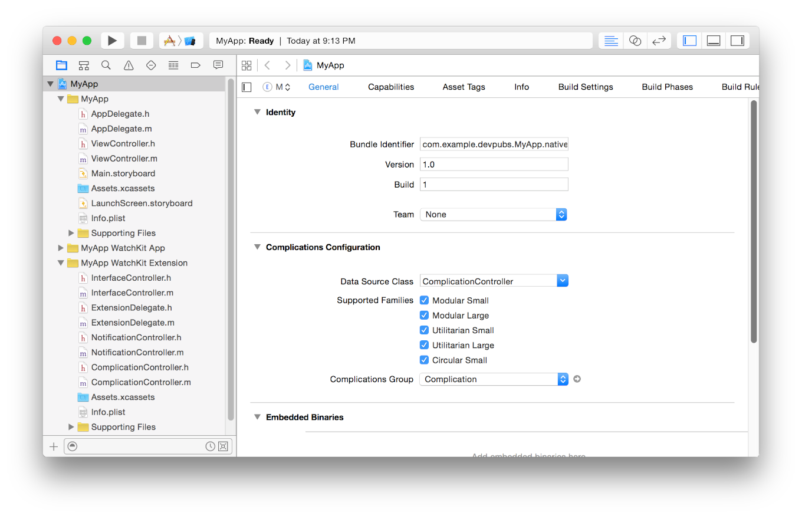

> 导航：[总目录](../../../README.md) · [documentation](../../../_indexes/documentation.md) · [watchOS 2 Transition Guide](index.md)

## Creating a Complication

To support a complication for your app, do the following:

1. Identify the data you want to display in your complication.
2. Select the templates you support for each family.
3. Implement a data source object to provide your data to ClockKit.
4. Configure your WatchKit extension to tell ClockKit that you support a complication.

When creating a new Watch app for watchOS 2, you can ask Xcode to create the resources you need for a complication. Xcode provides you with a data source class and configures your project to use that class. If you did not enable complication support when creating your Watch app, you can add that support later.

### Deciding Whether to Provide a Complication

Before creating a complication, first consider whether a complication makes sense for your app. Not every app needs a complication, and apps that provide a complication must be able to communicate relevant information in a potentially small space. Another factor to consider is how much time you need to generate data for your app. The amount of execution time given to complications is budgeted, so your complication has a limited amount of time to run each day. If you cannot generate the required data during that time, providing a complication might not be useful.

Consider the following factors when deciding whether to implement a complication for your app:

- __Can you fit your data into the available complication templates?__ Space for data is limited. You can choose which templates you want to use for each family, but for many templates there may only be space for a few characters of text or for a small image. You must be able to use the available space to convey useful information to the user.
- __Do you already use notifications to convey timely information to the user?__ If you are using notifications to deliver updates to the user, a complication might serve as a more unobtrusive way to deliver the same data. For example, a sports app might use a complication to post updated sports scores rather than send notifications when the scores change.
- __How much data can you provide in advance?__  If your app’s data changes frequently, it might be difficult to provide enough data to display in a complication. Worse, if you refresh your complication data too frequently, you may exceed your execution time budget and your complication might not be updated until the following day.

If you think it makes sense to provide a complication for your app, the next step is to define your data source object and use it to provide information about your complication and to create timeline entries.

### Implementing the Data Source Object

ClockKit interacts with your complication through your app’s complication data source object. The data source object is an instance of a class that conforms to the [CLKComplicationDataSource](https://developer.apple.com/documentation/clockkit/clkcomplicationdatasource) protocol. You define the class, but you do not create instances of that class at runtime. Instead, you specify the name of the class in your Xcode project settings and ClockKit instantiates that class as needed. During instantiation, ClockKit initializes your data source class using the standard [init](https://developer.apple.com/library/archive/documentation/LegacyTechnologies/WebObjects/WebObjects_3.5/Reference/Frameworks/ObjC/Foundation/Classes/NSObject/Description.html#//apple_ref/occ/instm/NSObject/init) method.

The job of your data source class is to provide ClockKit with any requested data as quickly as possible. The implementations of your data source methods should be minimal. Do not use your data source methods to fetch data from the network, compute values, or do anything that might delay the delivery of that data. If you need to fetch or compute the data for your complication, do it in your iOS app or in other parts of your WatchKit extension, and cache the data in a place where your complication data source can access it. The only thing your data source methods should do is take the cached data and put it into the format that ClockKit requires.

For detailed information about the methods of the `CLKComplicationDataSource` protocol, see _[CLKComplicationDataSource Protocol Reference](https://developer.apple.com/documentation/clockkit/clkcomplicationdatasource)_.

### Providing Your Timeline Data

The most important job of your complication data source is to package your app-specific data into a template that ClockKit can then display onscreen. Each family of complications has one or more templates that you can use to build your content. The templates define the position of text and images within the space allotted for the complication. After creating the template object with your data, assign it to a [CLKComplicationTimelineEntry](https://developer.apple.com/documentation/clockkit/clkcomplicationtimelineentry) object, specify an appropriate date at which to display the data, and return the timeline entry to ClockKit.

When specifying the data for your templates, you use [CLKTextProvider](https://developer.apple.com/documentation/clockkit/clktextprovider) and [CLKImageProvider](https://developer.apple.com/documentation/clockkit/clkimageprovider) objects to specify values instead of raw strings and images. Provider objects take raw data and format it in the best way possible for the corresponding template. ClockKit provides several text providers for handling dates and times, including relative time values that update dynamically without affecting your complication’s budgeted execution time.

Listing 8-1 illustrates how to create the current timeline entry for a complication. After fetching the needed data from the extension delegate, the method configures the template object for the specified complication family and assigns it to a timeline entry object. The date you specify for the current entry must be equal to or earlier than the current time. For past and future entries, set the date to the appropriate time at which to display the corresponding data.

__Listing 8-1__Creating a timeline entry

Objective-C

1. `// Keys for accessing the complicationData dictionary.`
2. `extern NSString* ComplicationCurrentEntry;`
3. `extern NSString* ComplicationTextData;`
4. `extern NSString* ComplicationShortTextData;`
6. `- (void)getCurrentTimelineEntryForComplication:(CLKComplication *)complication`
7. `withHandler:(void(^)(CLKComplicationTimelineEntry *))handler {`
8. `// Get the current complication data from the extension delegate.`
9. `ExtensionDelegate* myDelegate = (ExtensionDelegate*)[[WKExtension sharedExtension] delegate];`
10. `NSDictionary* data = [myDelegate.myComplicationData objectForKey:ComplicationCurrentEntry];`
12. `CLKComplicationTimelineEntry* entry = nil;`
13. `NSDate* now = [NSDate date];`
15. `// Create the template and timeline entry.`
16. `if (complication.family == CLKComplicationFamilyModularSmall) {`
17. `CLKComplicationTemplateModularSmallSimpleText* textTemplate =`
18. `[[CLKComplicationTemplateModularSmallSimpleText alloc] init];`
19. `textTemplate.textProvider = [CLKSimpleTextProvider`
20. `textProviderWithText:[data objectForKey:ComplicationTextData]`
21. `shortText:[data objectForKey:ComplicationShortTextData]];`
23. `// Create the entry.`
24. `entry = [CLKComplicationTimelineEntry entryWithDate:now`
25. `complicationTemplate:textTemplate];`
26. `}`
27. `else {`
28. `// ...configure entries for other complication families.`
29. `}`
31. `// Pass the timeline entry back to ClockKit.`
32. `handler(entry);`
33. `}`

Swift

1. `// Keys for accessing the complicationData dictionary.`
2. `let ComplicationCurrentEntry = "ComplicationCurrentEntry"`
3. `let ComplicationTextData = "ComplicationTextData"`
4. `let ComplicationShortTextData = "ComplicationShortTextData"`
6. `func getCurrentTimelineEntryForComplication(complication: CLKComplication,`
7. `withHandler handler: ((CLKComplicationTimelineEntry?) -> Void)) {`
8. `// Get the complication data from the extension delegate.`
9. `let myDelegate = WKExtension.sharedExtension().delegate as! ExtensionDelegate`
10. `var data : Dictionary = myDelegate.myComplicationData[ComplicationCurrentEntry]!`
12. `var entry : CLKComplicationTimelineEntry?`
13. `let now = NSDate()`
15. `// Create the template and timeline entry.`
16. `if complication.family == .ModularSmall {`
17. `let longText = data[ComplicationTextData]`
18. `let shortText = data[ComplicationShortTextData]`
20. `let textTemplate = CLKComplicationTemplateModularSmallSimpleText()`
21. `textTemplate.textProvider = CLKSimpleTextProvider(text: longText, shortText: shortText)`
23. `// Create the entry.`
24. `entry = CLKComplicationTimelineEntry(date: now, complicationTemplate: textTemplate)`
25. `}`
26. `else {`
27. `// ...configure entries for other complication families.`
28. `}`
30. `// Pass the timeline entry back to ClockKit.`
31. `handler(entry)`
32. `}`

### Updating Your Complication Data

ClockKit provides several ways for you to update your complication data at runtime:

- Update the data explicitly when your WatchKit extension is running.
- Ask ClockKit to wake your WatchKit extension at periodic intervals so that you can update your data.
- Use push notifications to update your data.
- Transfer time-sensitive data from your iOS app.

When you have new data for your complication, you must use the [reloadTimelineForComplication:](https://developer.apple.com/documentation/clockkit/clkcomplicationserver/1627891-reloadtimelineforcomplication) or [extendTimelineForComplication:](https://developer.apple.com/documentation/clockkit/clkcomplicationserver/1627895-extendtimelineforcomplication) method of the `CLKComplicationServer` object to signal to ClockKit that your complication is ready to be updated. You call these methods in all of the update scenarios listed previously, including at scheduled update times. Calling these methods causes ClockKit to create your data source object and request new data from it. Do not call these methods unless you have new data for your complication. All of these techniques count against the time budgeted for your complication code to execute. If you exceed your daily allotted time, your code does not run until that budget is restored.

At the end of every update cycle, ClockKit calls the [getNextRequestedUpdateDateWithHandler:](https://developer.apple.com/documentation/clockkit/clkcomplicationdatasource/1628062-getnextrequestedupdatedatewithha) method of your data source to give you an opportunity to schedule a future update. Scheduled updates are useful for apps whose data changes at predictable times. When a scheduled update occurs, ClockKit calls the [requestedUpdateDidBegin](https://developer.apple.com/documentation/clockkit/clkcomplicationdatasource/1628038-requestedupdatedidbegin) or [requestedUpdateBudgetExhausted](https://developer.apple.com/documentation/clockkit/clkcomplicationdatasource/1628013-requestedupdatebudgetexhausted) method of your data source first. Use those methods to determine whether you have new data available. If you do, call the `reloadTimelineForComplication:` or `extendTimelineForComplication:` method to update your timeline.

When your iOS app receives updated data intended for your complication, it can use the Watch Connectivity framework to update your complication right away. The [transferCurrentComplicationUserInfo:](https://developer.apple.com/documentation/watchconnectivity/wcsession/1615639-transfercurrentcomplicationuseri) method of `WCSession` sends a high priority message to your WatchKit extension, waking it up as needed to deliver the data. Upon receiving the data, extend or reload your timeline as needed to force ClockKit to request the new data from your data source.

### Configuring Your Xcode Project’s Complication Support

To run your extension, ClockKit needs to know the name of your data source class and the complication families that you support. Xcode provides an interface for specifying this information in the General tab of your WatchKit extension’s project, as shown in Figure 8-1. If you asked Xcode to configure your complication when your Watch app, the fields should already contain default values.

__Figure 8-1__Configuring the complication settings

The data you specify in the General tab is added to the `Info.plist` file of your WatchKit extension. Xcode adds the following keys and sets the values appropriately based on the information you provide.

- `CLKComplicationsPrincipalClass`. The value of this key is a string containing the name of the data source class that provides your app’s complication data.
- `CLKSupportedComplicationFamilies`. The value of this key is an array of strings containing the complication styles your app supports. The value for each string is the name of one of the constants in the [CLKComplicationFamily](https://developer.apple.com/documentation/clockkit/clkcomplicationfamily) enumerated type. For example, if you support only modular complications, you would include entries with the strings [CLKComplicationFamilyModularLarge](https://developer.apple.com/documentation/clockkit/clkcomplicationfamily/modularlarge) and [CLKComplicationFamilyModularSmall](https://developer.apple.com/documentation/clockkit/clkcomplicationfamily/modularsmall).

[About Complications](DesigningaComplication.md#apple-f4xwc4dqnrsv64tfmyxwi33df52wszbpkridimbqge2temzufvbuqmjrfvjvomi)
