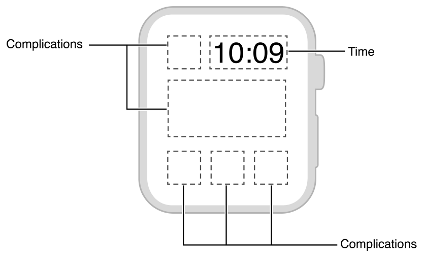
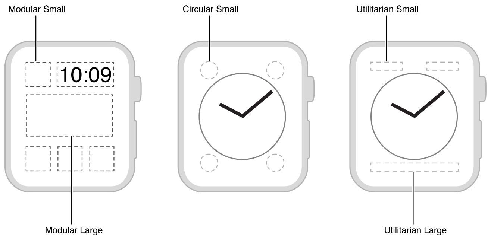
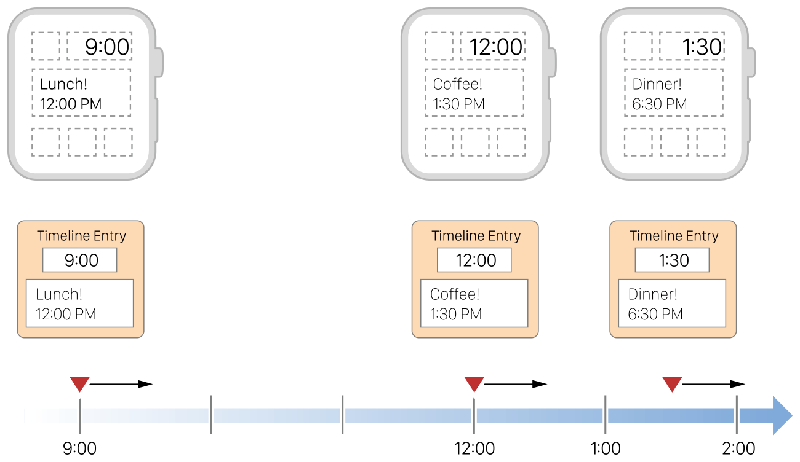

> 导航：[总目录](../../../README.md) · [documentation](../../../_indexes/documentation.md) · [watchOS 2 Transition Guide](index.md)

## About Complications

Complications are small elements that appear on the watch face and provide quick access to frequently used data. Users can customize most watch faces and install the complications that they want to see. The system provides built-in complications for weather information, upcoming calendar events, the user’s activity, and many more types of data. Apps can also add support for complications and display app-specific data.

The size and placement of complications is determined by watchOS and is based on available space on the selected watch face. Figure 7-1 shows the layout of the Modular watch face, which has space for five different complications in two different sizes.

__Figure 7-1__Complications on the Modular watch face

> [!NOTE]
> 

To implement a complication, add the ClockKit framework to your WatchKit extension. The ClockKit framework defines the classes you use to implement your complication and provide the data that Apple Watch needs. For information about the classes of this framework, see _[ClockKit Framework Reference](https://developer.apple.com/documentation/clockkit)_.

### Complication Families

Apple Watch supports multiple complication families, which define the size and characteristics of the complication. Figure 7-2 illustrates the complication families and how they appear on specific watch faces. You are encouraged to support all of the available families in your app.

__Figure 7-2__Complication families

Within a given family, you decide what data you want to display and you arrange that data using one of the ClockKit templates. Each family has different templates for displaying text, images, or a combination of the two in the available space. You pick the templates you want to use and provide the needed text and image data. At runtime, ClockKit renders your data according to the template’s design.

### How Complications Work

The watch face is one of the more frequently viewed screens of a user’s Apple Watch. The user glances at the watch face to get the current time and to get other important information from the displayed complications. Because interactions with the watch face occur quickly and last for a short time, ClockKit must render complications in advance to ensure that they can be displayed in a timely manner. To minimize power usage, ClockKit asks you to provide as much data as you have available and then caches the data and renders it when needed.

When ClockKit needs data from your complication, it runs your WatchKit extension and calls methods of your complication data source object to get what it needs. The data source object conforms to the [CLKComplicationDataSource](https://developer.apple.com/documentation/clockkit/clkcomplicationdatasource) protocol and is an object that you provide. You use the methods of this object to return meta information to ClockKit and to provide the past, present, and future data that you want displayed.

The past, present, and future entries returned by your data source object are used to build a _timeline_ of your complication’s data. Each timeline entry consists of an `NSDate` object and a complication template with the data that you want to display. When the specified date and time arrives, ClockKit renders the data from the corresponding template into the space occupied by your complication. As time passes, ClockKit updates your complication based on the entries in your timeline.

Another advantage of building a timeline of your data is that it allows the user to see more of your data during Time Travel. With Time Travel, the user can use the Digital Crown to review or preview any data provided by the visible complications.

When constructing your timeline entries, it is important to choose dates that make sense for the data you are displaying. ClockKit begins displaying the data in a timeline entry at the precise time you specify. For some types of data, you might want to modify the date you choose. For example, if you’re implementing a meeting app, it makes sense to display the user’s next meeting before that meeting starts. Figure 7-3 illustrates how you might configure the corresponding timeline entries. Each new meeting is displayed when the previous meeting starts, giving the user time to prepare.

__Figure 7-3__Timeline entries for a meeting app

[Incorporate New Features](ManagingYourData.md#apple-f4xwc4dqnrsv64tfmyxwi33df52wszbpkridimbqge2temzufvbuqmjsfvjvomi)

[Creating a Complication](CreatingaComplication.md#apple-f4xwc4dqnrsv64tfmyxwi33df52wszbpkridimbqge2temzufvbuqmjqfvjvomi)
