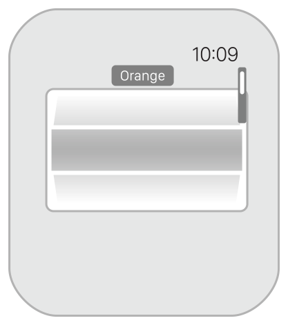
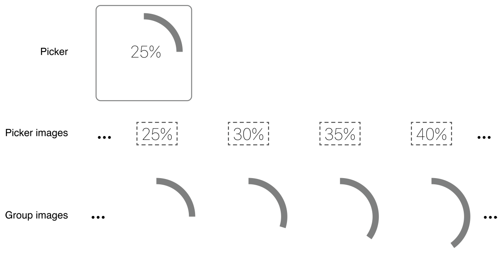
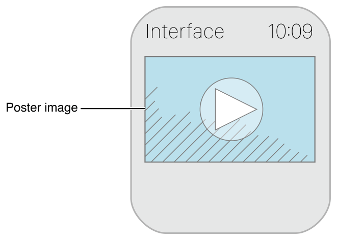
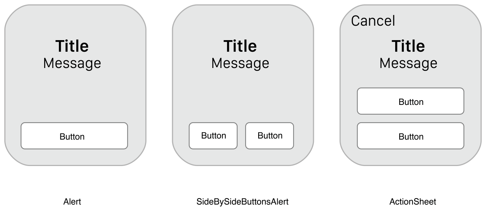
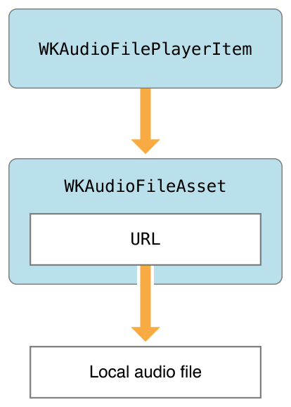

> 导航：[总目录](../../../README.md) · [documentation](../../../_indexes/documentation.md) · [watchOS 2 Transition Guide](index.md)

## Incorporate New Features

Apps built for watchOS 2 can take advantage of new interface objects and new capabilities, such as the ability to play audio and video.

### Taking Advantage of the New Interface Elements

The WatchKit framework introduces several new interface elements that let you create sophisticated interfaces with scrollable content, audio, and video. For guidance about how to use each element in your interface, see [Apple Watch Human Interface Guidelines](https://developer.apple.com/watch/human-interface-guidelines/).

### The Picker Object (WKInterfacePicker)

A [WKInterfacePicker](https://developer.apple.com/documentation/watchkit/wkinterfacepicker) object is an interface for navigating a list of items and selecting one item from the list. A picker displays images alone or a combination of images and text. Activating a picker lets the user to scroll through the items using the Digital Crown.

The picker’s appearance is determined mostly by the items it displays. The style of the picker defines how the picker displays its contents and how it animates between items during scrolling. Figure 6-1 illustrates a picker that uses the list style, where items appear to be on the surface of a rotating wheel. Other styles display only images and offer different options for animating from one image to the next.

__Figure 6-1__A picker using the list style

You can include multiple pickers on a single screen and configure the size and other attributes of the picker to suit the needs of your layout. When displaying images, you typically want to size the picker to match the size of the images.

To add a picker to your app’s interface, drag the picker object into your storyboard scene. Configure the picker style in your storyboard and create an outlet to the picker in your corresponding interface controller. You must have an outlet for your picker because you configure the picker’s contents programmatically. There are two attributes of a picker that you configure in your WatchKit extension:

- __Picker items.__ Use the [setItems:](https://developer.apple.com/documentation/watchkit/wkinterfacepicker/1627940-setitems) method to specify the contents of the picker. Each item is an instance of the [WKPickerItem](https://developer.apple.com/documentation/watchkit/wkpickeritem) class that contains the text or images you want to display in the picker interface.
- __Coordinated interface objects.__ For sophisticated picker interfaces, you can link the picker to one or more [WKInterfaceImage](https://developer.apple.com/documentation/watchkit/wkinterfaceimage) or [WKInterfaceGroup](https://developer.apple.com/documentation/watchkit/wkinterfacegroup) objects that contain animated image sequences. As the user turns the Digital Crown to select the next picker item, the picker updates the displayed image in each coordinated object.

Linking interface objects to the picker lets you created synchronized animations for your interface. As the user turns the Digital Crown, the picker updates its own content and the content of any coordinated objects at the same time. This behavior lets you create interfaces like the one shown in Figure 6-2. In the example, a picker is embedded inside a group object whose background contains an animated image showing an expanding circular ring. The picker contains images of completion percentage values and uses the group as a coordinated interface object. When the user turns the Digital Crown, the percentage value in the picker and circular ring image in the group update at the same time.

__Figure 6-2__Coordinating animations with the picker contents

Each time the picker value changes, the `WKInterfacePicker` object reports the change to its associated action method. The format of this action method is as follows:

Objective-C

1. `- (IBAction)pickerAction:(NSInteger)index`

Swift

1. `@IBAction func pickerAction(index: Int)`

You can use the action method’s index value to obtain the selected item from the array of items you used to configure the picker. The picker reports every change to its action method, regardless of how fast the user turns the Digital Crown. If your app should respond only to the item that the user selected, use the [pickerDidSettle:](https://developer.apple.com/documentation/watchkit/wkinterfacecontroller/1628205-pickerdidsettle) method of `WKInterfaceController` to get the selected item instead.

For more information about how to configure and use a `WKInterfacePicker` object, see _[WKInterfacePicker Class Reference](https://developer.apple.com/documentation/watchkit/wkinterfacepicker)_.

### The Movie Object (WKInterfaceMovie)

A [WKInterfaceMovie](https://developer.apple.com/documentation/watchkit/wkinterfacemovie) object lets you embed short audio or video clips directly into your interface. A movie object displays a poster image that appears inline with the rest of your content, as illustrated in Figure 6-3. When the user taps the poster image, the movie object presents the system’s media interface controller to handle playback of the media content. You can use this object to play audio-only clips, video-only clips, or clips with both audio and video.

__Figure 6-3__A movie interface object

You configure many attributes of a movie object in your storyboard file, including the poster image and the resizing options. You specify the media file to play from your WatchKit extension when your interface controller is initialized. The URL you specify for your media assets may refer to a local file or an asset located on a remote server. For remote assets, the movie object downloads the movie completely before playing it.

Any audio you play using a movie object is routed to a paired Bluetooth headset if one is available. If no Bluetooth headset is available, audio is routed to the Apple Watch speaker.

For information about using a `WKInterfaceMovie` object in your app, see _[WKInterfaceMovie Class Reference](https://developer.apple.com/documentation/watchkit/wkinterfacemovie)_. For information about how to manage media assets in your app, see [Making Media Files Accessible to Your Watch App](#apple-f4xwc4dqnrsv64tfmyxwi33df52wszbpkridimbqge2temzufvbuqmjsfvjvomjz). For information about how to encode media assets, see [Encoding Media Assets](#apple-f4xwc4dqnrsv64tfmyxwi33df52wszbpkridimbqge2temzufvbuqmjsfvjvomrq).

### Alerts and Action Sheets

Alerts offer a standard way to alert the user to uncommon situations in your app such as error conditions. Action sheets offer a standard interface for prompting the user to select from a specific set of options. Both types of interface represent an interruption in your workflow and should be used only when necessary.

To present an alert or action sheet, call the [presentAlertControllerWithTitle:message:preferredStyle:actions:](https://developer.apple.com/documentation/watchkit/wkinterfacecontroller/1628243-presentalertcontrollerwithtitle) method from the current interface controller. When presenting the interface, you can specify a title and message that you want to display to the user, together with information for one or more buttons. The system uses that information to build the interface. Figure 6-4 shows each of the three interface styles you can create.

__Figure 6-4__Alert and action sheet styles

For information about how to configure and present alerts and action sheets, see _[WKInterfaceController Class Reference](https://developer.apple.com/documentation/watchkit/wkinterfacecontroller)_.

### Adding Audio and Video Content

WatchKit supports the ability to play audio or video content from your app and the ability to record audio to a local file. Audio playback in WatchKit is intended primarily for playing short audio clips, but you can also play longer audio files.

> [!IMPORTANT]
> 

For information about the methods of each class, see _[WatchKit Framework Reference](https://developer.apple.com/documentation/watchkit)_.

### Playing Short Audio and Video Clips

The [presentMediaPlayerControllerWithURL:options:completion:](https://developer.apple.com/documentation/watchkit/wkinterfacecontroller/1628203-presentmediaplayercontrollerwith) method of the current interface controller can be called at any time to present the system’s media playback interface. The method offers an alternative to embedding a [WKInterfaceMovie](https://developer.apple.com/documentation/watchkit/wkinterfacemovie) object in your content. Instead of displaying a poster image in your interface, you can use buttons, table rows, and other interactive items to trigger the playback of media. The method also offers an expanded set of options for playing your content, including the ability to start playback automatically and to start playback in the middle of the clip.

Listing 6-1 demonstrates how to play a movie file located in the WatchKit extension’s bundle. Passing in the [WKMediaPlayerControllerOptionsAutoplayKey](https://developer.apple.com/documentation/watchkit/wkmediaplayercontrolleroptionsautoplaykey) option causes the movie to begin playing as soon as it’s ready. The media player handles all user interactions and provides a Done button that the user can use to dismiss the interface. You do not have to dismiss the interface explicitly in your completion handler block.

__Listing 6-1__Playing a movie

Objective-C

1. `NSBundle* myBundle = [NSBundle mainBundle];`
2. `NSURL* movieURL = [myBundle URLForResource:@"myMovie" withExtension:@"mp4"];`
4. `NSDictionary* options = @{WKMediaPlayerControllerOptionsAutoplayKey : @YES};`
6. `[self presentMediaPlayerControllerWithURL:movieURL`
7. `options:options`
8. `completion:^(BOOL didPlayToEnd, NSTimeInterval endTime, NSError * __nullable error) {`
9. `if (error)`
10. `NSLog(@"Error: %@", [error description]);`
12. `// Perform any other tasks.`
13. `}];`

Swift

1. `let myBundle = NSBundle.mainBundle()`
2. `if let movieURL = myBundle.URLForResource("myMovie", withExtension: "mp4") {`
3. `self.movie.setMovieURL(movieURL)`
5. `self.presentMediaPlayerControllerWithURL(movieURL,`
6. `options: [WKMediaPlayerControllerOptionsAutoplayKey: true],`
7. `completion: { (didPlayToEnd : Bool,`
8. `endTime : NSTimeInterval,`
9. `error : NSError?) -> Void in`
10. `if let anErrorOccurred = error {`
11. `// Handle the error.`
12. `}`
13. `// Perform other tasks`
14. `})`
16. `}`

Audio in your media files is routed to a paired Bluetooth headset if one is available. If no Bluetooth headset is available, audio is routed to the Apple Watch speaker.

For information about the encoding to use for audio and video clips, see the description of the `presentMediaPlayerControllerWithURL:options:completion:` method in _[WKInterfaceController Class Reference](https://developer.apple.com/documentation/watchkit/wkinterfacecontroller)_.

### Recording Short Audio Clips

To record short audio clips, use the `presentAudioRecordingControllerWithOutputURL:preset:maximumDuration:actionTitle:completion:` method of `WKInterfaceController` to display the standard audio recording interface. When presenting the interface, you specify the audio quality you want and the location for the resulting audio file. After the user has recorded the content, the user must explicitly accept the recording before it is written to disk at the URL you specified.

For information about the audio recording options, see the description of the `presentAudioRecordingControllerWithOutputURL:preset:maximumDuration:actionTitle:completion:` method in _[WKInterfaceController Class Reference](https://developer.apple.com/documentation/watchkit/wkinterfacecontroller)_.

### Playing Extended Audio Content

A WatchKit extension may initiate the playback of extended audio content through a paired Bluetooth audio headset. Playing extended audio audio involves using several different objects. Some objects manage the media file itself while others manage the playback process.

To manage the audio file, create a [WKAudioFileAsset](https://developer.apple.com/documentation/watchkit/wkaudiofileasset) object and then create a [WKAudioFilePlayerItem](https://developer.apple.com/documentation/watchkit/wkaudiofileplayeritem) object. An asset object manages information about the audio file itself, such as the file’s URL on disk and the meta information associated with that file. A player item object manages transient information about the audio file, such as whether the audio is currently playing and how much of the audio has been played so far. Figure 6-5 shows the relationship of these objects to each other and to the associated media file.

__Figure 6-5__The arrangement of an audio asset and item

To play a media file, pass your `WKAudioFilePlayerItem` object to a [WKAudioFilePlayer](https://developer.apple.com/documentation/watchkit/wkaudiofileplayer) object. A player object manages the playback of the single audio file managed by your player item object. To play a sequence of audio files, use a [WKAudioFileQueuePlayer](https://developer.apple.com/documentation/watchkit/wkaudiofilequeueplayer) object instead.

Player objects route audio through your Watch app, which then handles playback with the help of the system. To prevent your Watch app from terminating while it is playing audio, you must add the `UIBackgroundModes` key with the `audio` value to the `Info.plist` file of your Watch app. Adding this key lets your Watch app continue running for the purpose of playing audio. If the key is not present, playback ends when the user stops interacting with your app.

> [!IMPORTANT]
> 

After initiating playback of an audio file using a `WKAudioFilePlayer` object, use that object or the `WKAudioFilePlayerItem` object to monitor or change the state of playback. For example, you might use these objects to check for errors during playback. The user can also control playback using the system’s Now Playing glance.

For information about the classes used to manage audio playback, see _[WatchKit Framework Reference](https://developer.apple.com/documentation/watchkit)_.

### Making Media Files Accessible to Your Watch App

Although your WatchKit extension creates the objects needed to play your media, it does not handle the playback of that media. Because movie and audio playback happens through your app’s interface, playback is handled by your Watch app. As a result, your Watch app must have access to any media files you play. When considering where to place media files in the file system, use the following guidelines:

- __Place media clips that ship with your app inside the bundle of your WatchKit extension.__ Your WatchKit extension is located inside your Watch app bundle, so your Watch app can access any files in the extension’s bundle directory. In your extension code, use the methods of the [NSBundle](https://developer.apple.com/library/archive/documentation/LegacyTechnologies/WebObjects/WebObjects_3.5/Reference/Frameworks/ObjC/Foundation/Classes/NSBundle/Description.html#//apple_ref/occ/cl/NSBundle) class to locate the files inside your extension’s bundle.
- __Place media files that you download from the network (or transfer from your iOS app) in a shared group container.__ A shared group container provides common storage for your Watch app and WatchKit extension. In your extension code, create URLs for any media files inside the container, and use them to configure the media interfaces.

To set up a shared group container, enable the App Groups capability for both your WatchKit extension and Watch app, and select or create an appropriate group name. To access the container directory at runtime, use the [containerURLForSecurityApplicationGroupIdentifier:](https://developer.apple.com/documentation/foundation/nsfilemanager/1412643-containerurlforsecurityapplicati) method of `NSFileManager` to retrieve the URL for the shared directory, and use that URL to build new URLs for files in that directory.

> [!NOTE]
> 

For information about how to set up a shared group container, see _[App Extension Programming Guide](https://developer.apple.com/library/archive/documentation/General/Conceptual/ExtensibilityPG/index.html#//apple_ref/doc/uid/TP40014214)_.

### Encoding Media Assets

Table 6-1 lists the encoding information to use when creating media files to play on a user’s Apple Watch. For audio and video assets played directly from your app, keep your clips relatively short. Short clips consume less space on disk, use less power, and take less time to download.

__Table 6-1__Media encoding

| Media type | Recommended encoding |
| --- | --- |
| Video assets | Video codec: H.264 High Profile  Bit rate: 160 kpbs at up to 30 fps  Full screen resolution: 208 x 260 in portrait orientation  16:9 resolution: 320 x 180 in landscape orientation  Audio bit rate: 32 kpbs stereo |
| Audio-only assets | Bit rate: 32 kbps stereo |

For audio recordings, use the audio presets defined by the `WKAudioRecordingPreset` type. The preset values give you choices based on the intended use of the resulting audio. For example, you can use the `WKAudioRecordingPresetNarrowBandSpeech` option for voice memos and other content that does not require high-fidelity audio. Other options provide higher quality audio options.

### Opening URLs

Apps can initiate telephone calls or SMS messages using the [openSystemURL:](https://developer.apple.com/documentation/watchkit/wkextension/1628224-opensystemurl) method of the shared `WKExtension` object. When you open a URL that uses the `tel` or `sms` scheme, Apple Watch redirects that URL to the appropriate system app for handling. You can also open Passbook URLs by using the `openSystemURL:` method to open the URL associated with a [PKPass](https://developer.apple.com/documentation/passkit/pkpass) object.

For information about how to create URLs using the `tel` and `sms` URL schemes, see _[Apple URL Scheme Reference](../../../featuredarticles/Apple%20URL%20Scheme%20Reference/About%20Apple%20URL%20Schemes.md#apple-f4xwc4dqnrsv64tfmyxwi33df52wszbpkridimbqga3tqojz)_. For more information about using PassKit, see _[Wallet Developer Guide](https://developer.apple.com/library/archive/documentation/UserExperience/Conceptual/PassKit_PG/index.html#//apple_ref/doc/uid/TP40012195)_.

### Storing Data Securely in the Keychain

To store information securely on Apple Watch, use the keychain interfaces. Setting the [kSecAttrAccessible](https://developer.apple.com/documentation/security/ksecattraccessible) attribute of a data item to [kSecAttrAccessibleWhenUnlocked](https://developer.apple.com/documentation/security/ksecattraccessiblewhenunlocked) makes that item accessible when Apple Watch is on the user’s wrist and has been unlocked. When the user removes Apple Watch, the keychain is locked again to prevent access to any items with this attribute.

Listing 6-2 shows how to use the [kSecAttrAccessibleWhenUnlocked](https://developer.apple.com/documentation/security/ksecattraccessiblewhenunlocked) key to save a data item securely to the user’s keychain. The example saves password information, but you can use the key to save other types of data.

__Listing 6-2__Securing data in the user’s keychain

Objective-C

1. `NSString* secret = @"SomeSecretInformation";`
2. `NSData* secretData = [secret dataUsingEncoding:NSUnicodeStringEncoding];`
3. `if (secretData) {`
4. `NSDictionary* attributes = [NSDictionary dictionaryWithObjectsAndKeys:`
5. `kSecClassGenericPassword, kSecClass,`
6. `kSecAttrAccessibleWhenUnlocked, kSecAttrAccessible,`
7. `@"myservice", kSecAttrService,`
8. `@"account name", kSecAttrAccount,`
9. `secretData, kSecValueData, nil];`
11. `SecItemAdd((__bridge CFDictionaryRef)attributes, nil);`
12. `}`

Swift

1. `let secret = "SomeSecretInformation"`
2. `if let secretData = secret.dataUsingEncoding(NSUnicodeStringEncoding) {`
3. `let attributes: [NSString: NSObject] = [`
4. `kSecClass: kSecClassGenericPassword,`
5. `kSecAttrAccessible: kSecAttrAccessibleWhenUnlocked,`
6. `kSecAttrService: "myservice",`
7. `kSecAttrAccount: "account name",`
8. `kSecValueData: secretData ]`
9. `SecItemAdd(attributes, nil)`
10. `}`

For more information about how to secure information in the user’s keychain, see _Keychain Services Programming Guide_.

[Update Your Existing Code](UpdatetheAppCode.md#apple-f4xwc4dqnrsv64tfmyxwi33df52wszbpkridimbqge2temzufvbuqnrnknltc)

[About Complications](DesigningaComplication.md#apple-f4xwc4dqnrsv64tfmyxwi33df52wszbpkridimbqge2temzufvbuqmjrfvjvomi)
