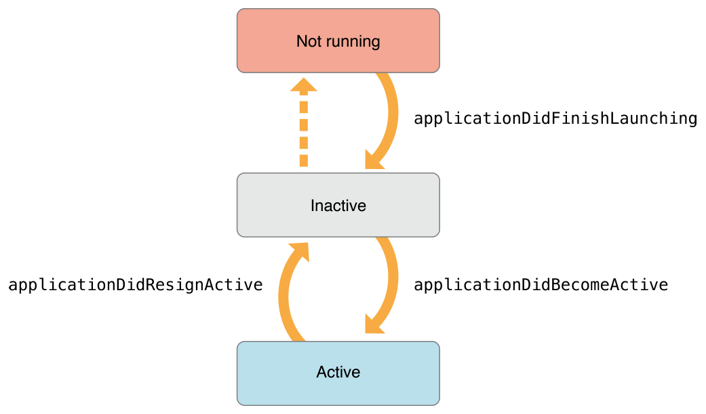

> 导航：[总目录](../../../README.md) · [documentation](../../../_indexes/documentation.md) · [watchOS 2 Transition Guide](index.md)

## Update Your Existing Code

In watchOS 2, there are several changes that affect the way you implement your apps. The most significant change affects how you move data between your iOS app and Watch app. Additionally, an extension object and an extension delegate object handle tasks that previously were handled by an app’s main interface controller.

### Implementing the Extension Delegate

In watchOS 2, your WatchKit extension has an extension object and a corresponding delegate object to manage behavior that is central to your app. The [WKExtension](https://developer.apple.com/documentation/watchkit/wkextension) object is a shared object that is available whenever your Watch app runs. The extension object has an associated delegate object that conforms to the [WKExtensionDelegate](https://developer.apple.com/documentation/watchkit/wkextensiondelegate) protocol.

WatchKit instantiates your extension delegate class automatically as part of the initial launch sequence. In the `Info.plist` file of your WatchKit extension, the `WKExtensionDelegateClassName` key contains the name of the extension delegate class to instantiate. When you create a new Watch app target for your Xcode project, Xcode configures this key and creates the source files for your extension delegate class. All you have to do is add code to the source files that Xcode provides.

### Managing the Watch App Life Cycle

The extension delegate manages the life cycle events of your app. When the user launches your app, WatchKit notifies the extension delegate at various points as the app transitions to and from different states. Figure 5-1 shows the state transitions that occur and the methods of the [WKExtensionDelegate](https://developer.apple.com/documentation/watchkit/wkextensiondelegate) protocol that are called for each transition. Use these methods to prepare your app’s data structures, check for data from the counterpart iOS app, and initiate requests for any new data.

__Figure 5-1__The life cycle of a Watch app

> [!IMPORTANT]
> 

At launch time, a Watch app normally transitions from the inactive state directly to the active state. It transitions back to the inactive state when the user exits the app, and at some point later may transition quietly to the not-running state. The delivery of life cycle events may be intermixed with the delivery of activation and deactivation events to the app’s interface controllers, and the order of delivery is not guaranteed. In other words, the [willActivate](https://developer.apple.com/documentation/watchkit/wkinterfacecontroller/1619547-willactivate) method of an interface controller may be called before or after the [applicationDidBecomeActive](https://developer.apple.com/documentation/watchkit/wkextensiondelegate/1628185-applicationdidbecomeactive) method of the extension delegate.

### Updating Your Notification Action Handler Code

When implementing support for actionable notifications, you now implement a response to button taps in the extension delegate and not in your app’s main interface controller. Actionable notifications provide quick responses for notifications. For example, a meeting invitation might include buttons to accept or decline the invitation. When the user taps one of those buttons, the action information is sent to the extension delegate. Specifically, WatchKit calls one of the following methods:

- For remote notifications, WatchKit calls the [handleActionWithIdentifier:forRemoteNotification:](https://developer.apple.com/documentation/watchkit/wkextensiondelegate/1628138-handleactionwithidentifier) or [handleActionWithIdentifier:forRemoteNotification:withResponseInfo:](https://developer.apple.com/documentation/watchkit/wkextensiondelegate/1628160-handleaction) method.
- For local notifications, WatchKit calls the [handleActionWithIdentifier:forLocalNotification:](https://developer.apple.com/documentation/watchkit/wkextensiondelegate/1628139-handleaction) or [handleActionWithIdentifier:forLocalNotification:withResponseInfo:](https://developer.apple.com/documentation/watchkit/wkextensiondelegate/1628242-handleactionwithidentifier) method.

The specific method called by WatchKit depends on whether the action included a text response from the user. Support for text responses is new in watchOS 2 and iOS 9. To add that support, add the `UIUserNotificationActionBehaviorTextInput` value to the `behavior` property of the `UIUserNotificationAction` that you create on iOS. When enabled, the user can dictate a text response or select from a set of predefined messages. The string representing the selected response is provided to your handler block along with the other notification information. You can then incorporate that string into any actions that handle the notification. For example, if the user declined a meeting invite, you can add the text response to the invite so that the originator knows why the user declined.

If a notification arrives while the user is interacting with your Watch app, WatchKit delivers the notification to the [didReceiveRemoteNotification:](https://developer.apple.com/documentation/watchkit/wkextensiondelegate/1628170-didreceiveremotenotification) or [didReceiveLocalNotification:](https://developer.apple.com/documentation/watchkit/wkextensiondelegate/1628200-didreceive) method of your extension delegate. You can use these methods to refresh your interface or take other actions based on the data in the notification.

> [!NOTE]
> 

### Managing Your Data

Migrating to watchOS 2 may require substantial changes to the way you share data with your iOS app. Because the WatchKit extension runs on Apple Watch, all shared data must be shuttled between Apple Watch and the user’s iPhone. This change may affect how you manage data in your app.

When upgrading your app, consider whether the following data management scenarios affect your implementation:

- __Data placement.__ WatchKit extensions must take a more active role in managing files. The container directory for your WatchKit extension has the same basic structure as the container for your iOS app. Place user data and other critical information in the `Documents` directory. Place files in the `Caches` directory whenever possible so that they can be deleted by the system when the amount of free disk space is low.
- __Data backups.__ Apple Watch does not automatically back up files your WatchKit extension stores locally. If your Watch app creates data that must be preserved, you must explicitly transfer that data back to your iOS app and save it there.
- __iCloud interactions.__ CloudKit and other iCloud technologies are not available on Apple Watch. If your app stores files in iCloud, you must now acquire those files on iOS and forward them to your WatchKit extension. Any changes you make in your WatchKit extension must also be forwarded back to your iPhone app so that they can be saved to iCloud.
- __Media files.__ The Watch app handles audio and video playback in your app. If your WatchKit extension downloads media files from the network or the companion iOS app, you must place those files in a shared group container that is accessible to both your Watch app and WatchKit extension. For more information about managing media-related files, see [Making Media Files Accessible to Your Watch App](ManagingYourData.md#apple-f4xwc4dqnrsv64tfmyxwi33df52wszbpkridimbqge2temzufvbuqmjsfvjvomjz).

Watch apps that formerly shared data with their iOS apps using a shared group container must be redesigned to manage that data differently. In watchOS 2, each process must manage its own copy of any shared data in the local container directory. For data that is actually shared and updated by both apps, this requires using the Watch Connectivity framework to move that data between them.

For general information about how to manage files in a container directory, see _[File System Programming Guide](../../File%20Management/File%20System%20Programming%20Guide/About%20Files%20and%20Directories.md#apple-f4xwc4dqnrsv64tfmyxwi33df52wszbpkridimbqgeydmnzs)_.

### Communicating with Your Companion iOS App

To communicate between your WatchKit extension and iOS app, use the Watch Connectivity framework. That framework provides bidirectional communications between the two processes and lets you transfer data and files in the foreground or background. The framework replaces the existing `openParentApplication:reply:` method of the `WKInterfaceController` class.

With the Watch Connectivity framework, you use a [WCSession](https://developer.apple.com/documentation/watchconnectivity/wcsession) object to initiate transfers and to manage the connection between your WatchKit extension and iOS app. You configure and create the session object early in the launch cycle of your app. Activating the session lets Watch Connectivity know that you are ready to send receive messages from the other app.

For information about the classes of the Watch Connectivity framework, see _[Watch Connectivity Framework Reference](https://developer.apple.com/documentation/watchconnectivity)_.

### Activating the Session Object

Early in the life of your iOS app and WatchKit extension, you must configure and activate the default [WCSession](https://developer.apple.com/documentation/watchconnectivity/wcsession) object. The session object is the focal point for sending and receiving data. It is a singleton object that you typically configure at launch time. To configure the object, assign a delegate object to it. The delegate is a custom object that conforms to the [WCSessionDelegate](https://developer.apple.com/documentation/watchconnectivity/wcsessiondelegate) protocol. You use the methods of this protocol to receive data and to handle errors.

After assigning your delegate to the default session object, activate the session by calling its [activateSession](https://developer.apple.com/documentation/watchconnectivity/wcsession/1615655-activatesession) method. Activating the session registers it with the Watch Connectivity framework and lets you start using the other methods and properties of the `WCSession` class.

Listing 5-1 shows a standard example of how to configure and activate your session object. In the example, `self` is an object that conforms to the [WCSessionDelegate](https://developer.apple.com/documentation/watchconnectivity/wcsessiondelegate) protocol and receives any incoming messages. You can use this code in both your iOS app and your WatchKit extension.

__Listing 5-1__Configuring the connectivity session

Objective-C

1. `if ([WCSession isSupported]) {`
2. `WCSession* session = [WCSession defaultSession];`
3. `session.delegate = self;`
4. `[session activateSession];`
5. `}`

Swift

1. `if WCSession.isSupported() {`
2. `let session = WCSession.defaultSession()`
3. `session.delegate = self`
4. `session.activateSession()`
5. `}`

After your iOS app activates the session object, check to see if an Apple Watch is paired and ready for communication before taking further actions. If the user does not have a paired Apple Watch or did not install your app, the [paired](https://developer.apple.com/documentation/watchconnectivity/wcsession/1615665-ispaired) and [watchAppInstalled](https://developer.apple.com/documentation/watchconnectivity/wcsession/1615623-watchappinstalled) properties of the `WCSession` object reflect those facts. If a watch is paired and installed, your iOS app can send background messages to your Watch app. When the [reachable](https://developer.apple.com/documentation/watchconnectivity/wcsession/1615683-isreachable) property is `YES``true`, you can also send foreground messages.

Use your delegate object to detect changes to the paired and reachable state of the other process. When the `paired` or `watchAppInstalled` property changes, the Watch Connectivity framework calls your delegate’s [sessionWatchStateDidChange:](https://developer.apple.com/documentation/watchconnectivity/wcsessiondelegate/1615689-sessionwatchstatedidchange) method. When the `reachable` property changes, the framework similarly calls the [sessionReachabilityDidChange:](https://developer.apple.com/documentation/watchconnectivity/wcsessiondelegate/1615662-sessionreachabilitydidchange) method. Use these methods to update your app’s behavior to accommodate for the changes. For example, update your app so that when an Apple Watch becomes reachable, you can send it a foreground message with fresh data.

For more information about the delegate methods and how you implement them, see _[WCSessionDelegate Protocol Reference](https://developer.apple.com/documentation/watchconnectivity/wcsessiondelegate)_.

### Choosing the Right Communication Option

The Watch Connectivity framework offers several options for sending data between your iOS app and WatchKit extension. Each option is intended for a different usage. Most options perform a one-way transfer of data in the background and are a convenient way to deliver updates. Foreground transfers let your app send a message immediately and wait for a reply. Table 5-1 lists the methods you use for communication and usage guidelines for each.

__Table 5-1__Communicating with a counterpart app

| Methods | Usage |
| --- | --- |
| [updateApplicationContext:error:](https://developer.apple.com/documentation/watchconnectivity/wcsession/1615621-updateapplicationcontext) | Send small amounts of state information to a counterpart app. The receiving app should use the information to synchronize its behavior or update its interface. For example, a Watch app might use the data to update the contents of its glance.  The data you send using this method is considered volatile. Each successive call replaces the dictionary sent by the previous call.  Data is transferred in the background at an appropriate time to minimize power usage. Transfers may happen at any time, including when neither app is running.  This method supports background transfers. |
| [transferUserInfo:](https://developer.apple.com/documentation/watchconnectivity/wcsession/1615671-transferuserinfo)  [transferCurrentComplicationUserInfo:](https://developer.apple.com/documentation/watchconnectivity/wcsession/1615639-transfercurrentcomplicationuseri) | Send a dictionary of information in the background. The receiving process need not be running for the data to be transferred. Data is transferred in the background and queued for delivery.  Use the `transferCurrentComplicationUserInfo:` method specifically to send complication-related data from your iOS app to your Watch app.  Data is transferred in the background at an appropriate time to minimize power usage. Transfers may happen at any time, including when neither app is running.  These methods support background transfers. |
| `transferFile:userInfo:` | Transfer files in the background. The receiving app must move the file to a new location if it intends to keep it. Files not moved in the [session:didReceiveFile:](https://developer.apple.com/documentation/watchconnectivity/wcsessiondelegate/1615651-session) method are deleted after that method returns.  Data is transferred in the background at an appropriate time to minimize power usage. Transfers may happen at any time, including when neither app is running.  This method supports background transfers. |
| [sendMessage:replyHandler:errorHandler:](https://developer.apple.com/documentation/watchconnectivity/wcsession/1615687-sendmessage)  [sendMessageData:replyHandler:errorHandler:](https://developer.apple.com/documentation/watchconnectivity/wcsession/1615617-sendmessagedata) | Send data immediately to a counterpart app. If you do not want a response, you may specify `nil` for the _replyHandler_ parameter.  The counterpart app must be reachable before calling this method. The iOS app is always considered reachable, and calling this method from your Watch app wakes up the iOS app in the background as needed. The Watch app is considered reachable only while it is installed and running.  Data is transmitted immediately and messages are queued and delivered in the order in which they were sent.  These methods must initiate their transfers in the foreground . |

For most types of transfers, you provide an [NSDictionary](https://developer.apple.com/library/archive/documentation/LegacyTechnologies/WebObjects/WebObjects_3.5/Reference/Frameworks/ObjC/Foundation/Classes/NSDictionaryClassClstr/Description.html#//apple_ref/occ/cl/NSDictionary) object with the data you want to send. The keys and values of your dictionary must all be property list types, because the data must be serialized and sent wirelessly. (If you need to include types that are not property list types, package them in an `NSData` object or write them to a file before sending them.) In addition, the dictionaries you send should be compact and contain only the data you really need. Keeping your dictionaries small ensures that they are transmitted quickly and do not consume too much power on both devices.

For more information about how to transfer data using the Watch Connectivity framework, see _[Watch Connectivity Framework Reference](https://developer.apple.com/documentation/watchconnectivity)_.

### Guidelines for Communicating Between Apps

Here are some guidelines to consider when adding support for Watch Connectivity to your app:

- __Use Background App Refresh to push new data to your Watch app.__ If your iOS app wakes up periodically to handle tasks, use some of that time to prepare data and send it to your Watch app using the [updateApplicationContext:error:](https://developer.apple.com/documentation/watchconnectivity/wcsession/1615621-updateapplicationcontext) method. This is especially useful for keeping your app’s glance up to date.
- __Move files synchronously in your delegate method.__ The system deletes a file transferred to a device after calling the [session:didReceiveFile:](https://developer.apple.com/documentation/watchconnectivity/wcsessiondelegate/1615651-session) method of the appropriate delegate object. Deleting files prevents them from taking up space unnecessarily, but it also means that you must explicitly move files to a new location if you want to keep them.
- __Transfer only the data that you need.__ All transfers involve sending data wirelessly to the counterpart app. Do not waste power by sending data that you do not need.
- __Use the application context mode for transient data that changes.__ The [updateApplicationContext:error:](https://developer.apple.com/documentation/watchconnectivity/wcsession/1615621-updateapplicationcontext) method is intended as a way to communicate a snapshot of state information between your Watch app and iOS app. Calling the method a second time replaces data from any previous calls. If you want to ensure the delivery of data, use the [transferUserInfo:](https://developer.apple.com/documentation/watchconnectivity/wcsession/1615671-transferuserinfo) method to queue the data instead.
- __Provide a graceful fallback in the case of errors.__ Errors can occur if there is insufficient space for the data, if the data is malformed, or if there is a communications error. Check for errors in your handler code and take appropriate actions.
- __Remember that background transfers may not be delivered immediately.__ Files and contextual data are delivered as quickly as possible, but transfers are not instantaneous. Data files involving large files or large amounts of data also take a commensurately long time to complete.

### Performing Network-Based Operations

WatchKit extensions can communicate directly with the network using [NSURLSession](https://developer.apple.com/documentation/foundation/urlsession) objects. Use a URL session object in places where you have a server that you can communicate with directly. The `NSURLSession` class in watchOS supports all of the same transfer options as iOS, including background transfers.

When fetching data from your Watch app, remember that your app can be deactivated at any time. If you use a default session for your request, your app might exit before it receives any data. To prevent your app from exiting immediately, you can use the [performExpiringActivityWithReason:usingBlock:](https://developer.apple.com/documentation/foundation/processinfo/1617030-performexpiringactivity) method of `NSProcessInfo` to extend your app’s life for a short time. When fetching files, you can also configure your session as a background session so that the file transfer can be managed by the system.

If your Watch app and iOS app use the same server, it is usually simpler for each process to fetch its data separately rather than trying to sync from one app to the other. If you want to ensure the two apps are synchronized, use the [updateApplicationContext:error:](https://developer.apple.com/documentation/watchconnectivity/wcsession/1615621-updateapplicationcontext) method to communicate basic information such as record IDs or title strings so that each app knows what the other has fetched.

For information about using an `NSURLSession` object to perform network requests, see _URL Loading System Programming Guide_.

[Configure the Xcode Project](ConfiguretheXcodeProject.md#apple-f4xwc4dqnrsv64tfmyxwi33df52wszbpkridimbqge2temzufvbuqnjnknltc)

[Incorporate New Features](ManagingYourData.md#apple-f4xwc4dqnrsv64tfmyxwi33df52wszbpkridimbqge2temzufvbuqmjsfvjvomi)
