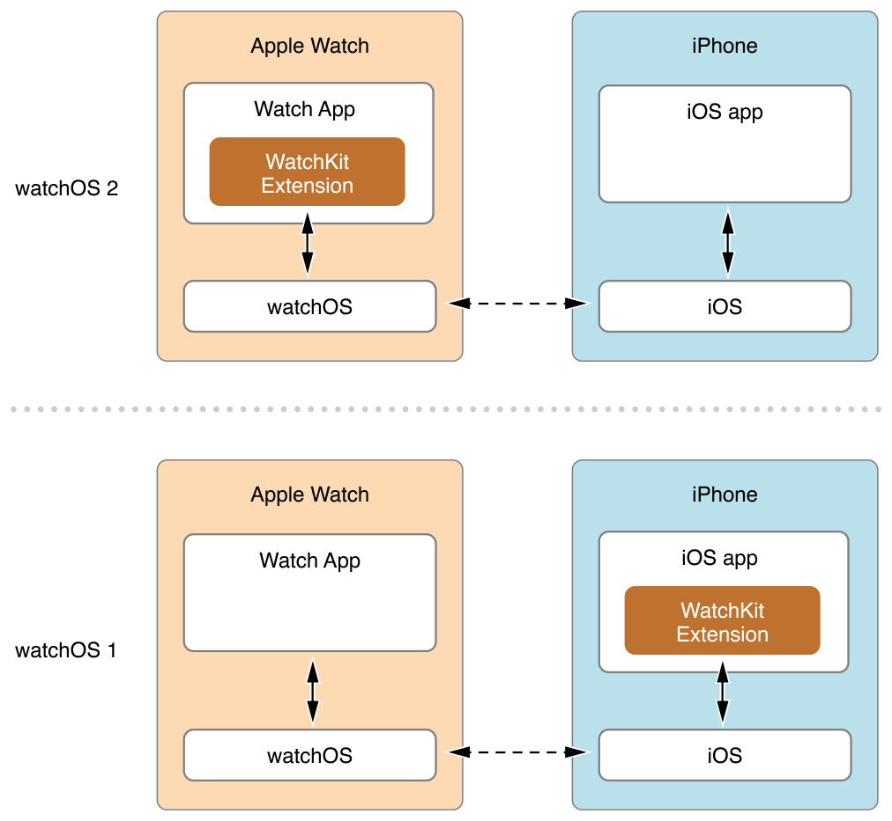

> 导航：[总目录](../../../README.md) · [documentation](../../../_indexes/documentation.md)

## Before You Start

A Watch app for watchOS 2 consists of two separate bundles that work together to deliver your content to the user. The Watch app itself contains the storyboards and resource files needed to display your interface, and the WatchKit extension contains the code and resources needed to update that interface. In watchOS 2, the extension runs on the user’s Apple Watch instead of on the user’s iPhone, as was the case in watchOS 1. Moving the extension to Apple Watch makes communication between the Watch app and extension much faster and makes it possible for your app to run when the user’s iPhone is unavailable.

Figure 1-1 shows the architecture for apps running on watchOS 2 and watchOS 1. In watchOS 2, not only does the WatchKit extension run on the user’s Apple Watch, it is delivered inside the user’s Watch app. This arrangement makes it easier for the Watch app to access resources stored in the WatchKit extension’s bundle.

__Figure 1-1__Comparing architectures in watchOS 2 and watchOS 1

Apart from the architectural changes, the division of labor between your Watch app and WatchKit extension remains unchanged in watchOS 2. In the Watch app, you use storyboards to define the screens your app uses to present information to the user. In your WatchKit extension, you define [WKInterfaceController](https://developer.apple.com/documentation/watchkit/wkinterfacecontroller) subclasses to manage each of those screens. Interactions between the screens and your code are handled by the WatchKit framework.

Most of your existing WatchKit extension code should continue to work in watchOS 2, but moving the WatchKit extension to the user’s Apple Watch has implications for how you design your app:

- You must implement your extension using the frameworks in the watchOS SDK instead of the iOS SDK. For any features not available in the watchOS frameworks, you must rely on your iPhone app to perform the corresponding task. For a list of frameworks available in the watchOS SDK, see [Available System Technologies](LeverageSystemTechnologies.md#apple-f4xwc4dqnrsv64tfmyxwi33df52wszbpkridimbqge2temzufvbuqobnknltc).
- Your extension now stores files and data on Apple Watch. Any data that is not part of your Watch app or WatchKit extension bundle must be fetched from the network or from the companion iOS app running on the user’s iPhone. You cannot rely on a shared group container to exchange files with your iOS app. Fetching files involves transferring them wirelessly to Apple Watch.

In addition to updating your WatchKit extension code, apps can now provide custom complications. A _complication_ is a small UI element that displays app-specific information on the watch face. The system provides complications to display weather information, the user’s current activity status, the battery level, and other information related to system apps. You can provide your own complications to display data that is specific to your app.

### Should You Migrate?

When deciding whether to update your Watch app to watchOS 2, consider how the architectural changes affect your existing app. There are many features to take advantage of in watchOS 2, but migrating to watchOS 2 might also require architectural changes. Use the following questions to help determine whether you should migrate your existing app to watchOS 2:

- __Does your app rely heavily on iCloud?__

  In watchOS 2, your WatchKit extension no longer has direct access to iCloud technologies such as CloudKit. Instead, all operations involving those technologies must now be performed by the iOS companion app and relayed to the WatchKit extension wirelessly. Making such a change means rethinking the way you manage your data and synchronizing the data on the user’s Apple Watch with the data on the user’s iPhone yourself.
- __Does your Watch app rely on data from the corresponding iOS app?__

  In watchOS 2, if your Watch app relies on files from the iOS app, you must explicitly transfer those files from iOS to Apple Watch and manage them locally in both locations. More importantly, data on Apple Watch is not backed up automatically, so you must send files back to the user’s iPhone if you want them backed up.
- __Do you need to support earlier versions of Apple Watch?__

  You can deliver your Watch app for both watchOS 1 and watchOS 2 in the same iOS app bundle, but doing so means maintaining separate targets and executables for each. Because it runs on Apple Watch, a Watch app for watchOS 2 must be completely recompiled into a separate executable. And because of the architectural differences between the platforms, sharing code may be more effort and add more complexity than having two separate apps.

If you choose not to migrate your existing Watch app to watchOS 2, your app will still run on watchOS 2. Apps designed for watchOS 1 run in the same way on watchOS 2. Specifically, the WatchKit extension continues to run on the user’s iPhone. If you want your WatchKit extension to run on the user’s Apple Watch, you must explicitly migrate your app to watchOS 2 and modify it accordingly.

For information about how to migrate your existing code to watchOS 2, see [Update Your Existing Code](UpdatetheAppCode.md#apple-f4xwc4dqnrsv64tfmyxwi33df52wszbpkridimbqge2temzufvbuqnrnknltc).

[Scoping the Project](ScopingtheProject.md#apple-f4xwc4dqnrsv64tfmyxwi33df52wszbpkridimbqge2temzufvbuqmznknltc)
