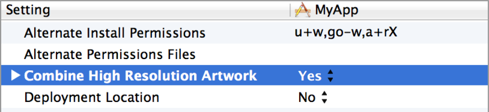

> 导航：[总目录](../../../README.md) · [documentation](../../../_indexes/documentation.md) · [High Resolution Guidelines for OS X](About%20High%20Resolution%20for%20OS%20X.md)


[Next](Advanced%20Optimization%20Techniques.md)[Previous](High%20Resolution%20Explained-%20Features%20and%20Benefits.md)

# Optimizing for High Resolution

After you optimize your app for high resolution, users will enjoy its detailed drawings and sharp text. And depending on how you’ve designed and coded your app, you might not have that much optimization to perform. If your app is a Cocoa app and uses only the standard controls, doesn’t require custom graphics resources, and doesn’t use pixel-based APIs, your work is over. OS X handles the scaling for you.

If your app is like many apps, however, you probably need to perform some work to ensure your users will have a great visual experience. At a minimum, you will need to provide high-resolution versions of custom artwork, including the app icon. If your app uses a lot of graphics resources, creating these assets could require a significant amount of designer time.

You’ll also need to make sure your code uses the correct image-loading methods and other APIs that support high resolution.

The tasks listed in the following sections outline the work that most apps need to perform:

- [Provide High-Resolution Versions of All App Graphics Resources](#apple-f4xwc4dqnrsv64tfmyxwi33df52wszbpkridimbqgezdgmbsfvbuqnznknltg)
- [Load Images Using High-Resolution-Savvy Image-Loading Methods](#apple-f4xwc4dqnrsv64tfmyxwi33df52wszbpkridimbqgezdgmbsfvbuqnznknltcma)
- [Use the Most Recent APIs That Support High Resolution](#apple-f4xwc4dqnrsv64tfmyxwi33df52wszbpkridimbqgezdgmbsfvbuqnznknltena)

After you complete this work, look at [Advanced Optimization Techniques](Advanced%20Optimization%20Techniques.md#apple-f4xwc4dqnrsv64tfmyxwi33df52wszbpkridimbqgezdgmbsfvbuqmjqfvjvomi) to see if your app requires further adjustments for special scenarios, such as using pixel-based technologies (OpenGL, Quartz bitmaps) or custom Core Animation layers.

Your app’s icons, custom controls, custom cursors, custom artwork, and any images you want to display need to have high-resolution versions in addition to their standard-resolution versions. Each version needs to be scaled so that it displays in the same point size. For example, if you supply a standard-resolution image sized at 50x50 pixels, the high-resolution version must be sized at 100x100 pixels. You can check for correct scaling using the `tiffutil` command (see [Run the TIFF Utility Command in Terminal](#apple-f4xwc4dqnrsv64tfmyxwi33df52wszbpkridimbqgezdgmbsfvbuqnznknlteny)).

In some cases, scaling custom content does not result in the same perceptual effect that the content has at standard resolution. Shadows or outlines might look too heavy, or some graphics might require more detail added to them. For example, on a high-resolution display, using an `NSBezierPath` object to draw a line with a width of 1.0 point would result in a line that is 2 pixels wide. If the 2-pixels-wide line looks too heavy, consider adjusting the graphic to show a 1-pixel-wide line, regardless of whether it appears on a standard- or a high-resolution display. You might need to experiment to ensure the perceptual effect is equivalent across resolutions.

When you create a high-resolution version of an image, follow this naming convention for the image pair:

- Standard: `<ImageName>.<filename_extension>`

  Example: `circle.png`
- High resolution: `<ImageName>`@2x`.<filename_extension>`

  Example: `circle@2x.png`

The `<ImageName`> and <`filename_extension>` portions specify the name and extension for the file. The inclusion of the `@2x` modifier for the high-resolution image lets the system know that the image is the high-resolution variant of the standard image. The two component images should be in the same folder in the app’s sources. Ideally, package the image pairs into one file (see [Package Multiple Versions of Image Resources into One File](#apple-f4xwc4dqnrsv64tfmyxwi33df52wszbpkridimbqgezdgmbsfvbuqnznknltcmy)).

You should create a set of icons that consist of pairs of icons (standard and high resolution) for each icon size—16x16, 32x32, 128x128, 256x256, 512x512. The naming convention is:

`icon_<sizeinpoints>x<sizeinpoints>[@<scale>].png`

where `<sizeinpoints>` is the size of the icon in points, and `<scale>` is @2x for the high-resolution version. (Don’t add a scale for standard resolution.) Additionally, the filename must use the `icon_` prefix.

The images must be square and have the dimensions that match the name of the file.

Ideally, you would supply a complete set of icons. However, it is not a requirement to have a complete set; the system will choose the best representation for sizes and resolutions that you don’t supply. Each icon in the set is a hint to the system as to the best representation to use. A complete set consists of the following:

- `icon_16x16.png`
- `icon_16x16@2x.png`
- `icon_32x32.png`
- `icon_32x32@2x.png`
- `icon_128x128.png`
- `icon_128x128@2x.png`
- `icon_256x256.png`
- `icon_256x256@2x.png`
- `icon_512x512.png`
- `icon_512x512@2x.png`

You might be wondering whether some of these icons are redundant. But, from a perceptual standpoint, a 16x16@2x version isn’t equivalent to a 32x32 version. Although they might have the same number of pixels, the user size is different. You might need to make adjustments to achieve the optimal look for an icon at a particular user size and pixel density.

The set needs to be put into a folder whose name is `<folder name>.iconset`, where `<folder name>` is whatever name you’d like. The folder must have the `.iconset` extension. It might seem a little unusual for a folder to have an extension, but this extension is a signal to the system that the folder contains a set of icons.

For new icons, it’s easiest to design the large icons first and then decide how to scale them down. When scaling up existing icons, the enlarged versions should look like close-ups of the existing icons, with the appropriate level of detail. For example, a house icon could show shingles or shutters in the larger sizes, while a large book icon might actually contain readable text. Do not simply create a pixel-for-pixel upscaled version of the existing icon. Figure 2-1 shows the changes in detail for different icon sizes. The larger icon has much more detail; you can see the bolts holding the mail slot on the door.

__Figure 2-1__  Customizing the level of detail for different icon sizes

!!

For detailed information on designing icons, see _OS X Human Interface Guidelines_.

Xcode 4.4 automatically validates and converts an iconset folder to an `icns` file. All you need to do is add the iconset folder to your project and build the project. The generated `icns` file is added automatically to the built product.

The `iconutil` command-line tool converts iconset folders to deployment-ready, high-resolution `icns` files. (You can find complete documentation for this tool by entering `man iconutil` in Terminal.) Using this tool also compresses the resulting `icns` file, so there is no need for you to perform additional compression.

To convert a set of icons to an icns file

- Enter this command into the Terminal window:

```
iconutil -c icns <iconset filename>
```

  where `<iconset filename>` is the path to the folder containing the set of icons you want to convert to `icns`.

  The output is written to the same location as the `iconset` file, unless you specify an output file as shown:

```
iconutil -c icns -o <icon filename> <iconset filename>
```
To convert an icns file to an iconset

- Enter this command into the Terminal window:

```
iconutil -c iconset <icns filename>
```

  where `<icns filename>` is the path to the `icns` file you want to convert to an `iconset`.

  The output is written to the same location as the `icns` file, unless you specify an output file as shown:

```
iconutil -c iconset -o <iconset filename> <icns filename>
```

After creating the `icns` file, enter the filename in Xcode for the Icon file key located in Custom OS X Application Target Properties.

__Figure 2-2__  Setting the icns filename in Xcode

!!

There are two options for packaging standard- and high-resolution versions of app image resources. You can:

- Set up Xcode to combine high-resolution artwork into one file.
- Use the `tiffutil` command-line tool.

The easiest way to package art is to let Xcode perform the work for you.

To set up Xcode to combine high-resolution artwork into one file

1. Open the Target Build Settings.
2. Under Deployment, set the option Combine High Resolution Artwork to `Yes`.

   

You can use the man command `tiffutil` with the option `-cathidpicheck`. The command lets you manipulate TIFF files using the specified options. The `-cathidpdicheck` option writes a single output file containing the files supplied as arguments to the option. This option also checks to make sure that the standard- and high-resolution files you supply are sized correctly. That is, the dimensions of the high-resolution image must be twice that of the standard-resolution image. Running `tiffutil` explicitly changes the dpi. Using `tiffutil` also compresses the resulting output file, so there is no need for you to perform additional compression.

Running the following command creates a single file from the two input files:

```
tiffutil -cathidpicheck infile1 infile2 -out outfile
```

For example, if the input files are:

- `myimage.png` with width = 32 pixels, height = 32 pixels
- `myimage@2x.png` with width = 64 pixels, height = 64 pixels

running this command:

```
tiffutil -cathidpicheck myimage.png myimage@2x.png -out myimage.tiff
```

will produce a single TIFF file that contains the two input images.

See the `tiffutil` man pages documentation in Terminal for more information, including options for extracting an image from a multirepresentation TIFF file.

You can check an iconset or multirepresentation TIFF file by choosing its icon in the Finder and pressing the Space bar. As shown in Figure 2-3, the QuickLook window that appears has a slider that allows you to look through each image contained in the file.

__Figure 2-3__  Previewing icons in the QuickLook window

!

An [NSImage](https://developer.apple.com/documentation/appkit/nsimage) object can contain multiple representations of an image, making it ideal for supporting high-resolution graphics. You can use `NSImage` to load standard- and high-resolution versions of an image, but you can also use it to load multiple representations from a single TIFF file. (For details on creating TIFF files for multiple representations, see [Package Multiple Versions of Image Resources into One File](#apple-f4xwc4dqnrsv64tfmyxwi33df52wszbpkridimbqgezdgmbsfvbuqnznknltcmy).)

If you follow the naming convention described in [Adopt the @2x Naming Convention](#apple-f4xwc4dqnrsv64tfmyxwi33df52wszbpkridimbqgezdgmbsfvbuqnznknlteoa), there are two methods available that will load standard- and high-resolution versions of an image into an `NSImage` object, even if you don’t provide a multirepresentation image file.

- The [imageNamed:](https://developer.apple.com/documentation/appkit/nsimage/1520015-imagenamed) method of the [NSImage](https://developer.apple.com/documentation/appkit/nsimage) class finds resources located in the main application bundle, but not in frameworks or plug-ins.
- The [imageForResource:](https://developer.apple.com/documentation/foundation/nsbundle/1519901-imageforresource) method of the [NSBundle](https://developer.apple.com/library/archive/documentation/LegacyTechnologies/WebObjects/WebObjects_3.5/Reference/Frameworks/ObjC/Foundation/Classes/NSBundle/Description.html#//apple_ref/occ/cl/NSBundle) class will also look for resources outside the main bundle. Framework authors should use this method.

If you do not provide a high-resolution version of a given image, the `NSImage` object loads only the standard-resolution image and scales it during drawing. Figure 2-4 shows a comparison of an image on a high-resolution display when an `@2x` version is available and when it is not. Note that the @2x version has much more detail.

__Figure 2-4__  @2x image (left) and a standard-resolution image (right) on a high-resolution display

!

When you draw the image, the `NSImage` object automatically chooses the best representation for the drawing destination. For images with the @2x suffix in the filename, it calculates the user size to be half the width and height of the pixels, which renders the image correctly.

Listing 2-1 shows how to use [imageNamed:](https://developer.apple.com/documentation/appkit/nsimage/1520015-imagenamed) to load an image into a view. The system displays the correct image for the resolution, provided a pair of images—`myPhoto.png` and `myPhoto@2x.png`—are available. Keep in mind that the @2x version must have dimensions that are twice the size as its standard-resolution counterpart.

__Listing 2-1__  Loading an image into a view

```objc
- (id)initWithFrame:(NSRect)frame
{
    self = [super initWithFrame:frame];
    if (self) {
        [self setImage:[NSImage imageNamed:@"myPhoto"]];
    }
    return self;
}
```

Here are a few additional tips for working with high-resolution images:

- If your app uses an `NSImageView` object for both an image and a highlight image, or to animate several images, it’s advisable that all images in the view have the same resolution.
- If you want to create an `NSImage` object from a `CGImageRef` data type, use the [initWithCGImage:size:](https://developer.apple.com/documentation/appkit/nsimage/1519939-init) method, specifying the image size in points, not pixels. For the image to be sharp on a high-resolution display, make sure that the pixel height and pixel width of the image are twice that of the image height and width in points.
- For custom cursors, you can pass a multirepresentation TIFF to the [NSCursor](https://developer.apple.com/documentation/appkit/nscursor) class method [initWithImage:hotSpot:](https://developer.apple.com/documentation/appkit/nscursor/1524612-init).
- If your app tiles or stretches images to fill a space, you should use the [NSDrawThreePartImage](https://developer.apple.com/documentation/appkit/1524633-nsdrawthreepartimage) function or the [NSDrawNinePartImage](https://developer.apple.com/documentation/appkit/1526394-nsdrawninepartimage) function instead of using `imageNamed:`. AppKit treats the parts as a group, matching the parts appropriately and handling pixel cracks. These methods are more performant than stretching an image.

Cocoa apps must replace deprecated APIs with their newer counterparts. Apps that use older Carbon technologies need to replace those technologies with newer ones.

A number of methods that support high resolution are available for converting geometry, detecting scaling, and aligning pixels (see [APIs for Supporting High Resolution](APIs%20for%20Supporting%20High%20Resolution.md#apple-f4xwc4dqnrsv64tfmyxwi33df52wszbpkridimbqgezdgmbsfvbuqnjnknlte)). These more recent methods support the Quartz-based, high-resolution imaging model. Earlier APIs do not and are deprecated; these APIs are listed in [Deprecated APIs](APIs%20for%20Supporting%20High%20Resolution.md#apple-f4xwc4dqnrsv64tfmyxwi33df52wszbpkridimbqgezdgmbsfvbuqnjnknltcmy), which also provides advice as to what to use in their place.

Check to make sure that your app—or any code it calls into, such as a plug-in—does not use any of the following:

- QuickDraw or any API, such as the `NSMovieView` class, that calls into QuickDraw
- QuickTime Movie Toolbox—instead, use AVFoundation (if you can’t migrate to AVFoundation, use the QTKit framework)
- The Display Manager
- Carbon windows that are not composited

If your app uses any of these, the system will magnify your app when it runs on a high-resolution device, regardless of whether you provide @2x image resources. For details on this user experience, see [Magnified Mode Accommodates Apps That Aren’t Yet Ready for High Resolution](High%20Resolution%20Explained-%20Features%20and%20Benefits.md#apple-f4xwc4dqnrsv64tfmyxwi33df52wszbpkridimbqgezdgmbsfvbuqnbnknltcma).

[Next](Advanced%20Optimization%20Techniques.md)[Previous](High%20Resolution%20Explained-%20Features%20and%20Benefits.md)

