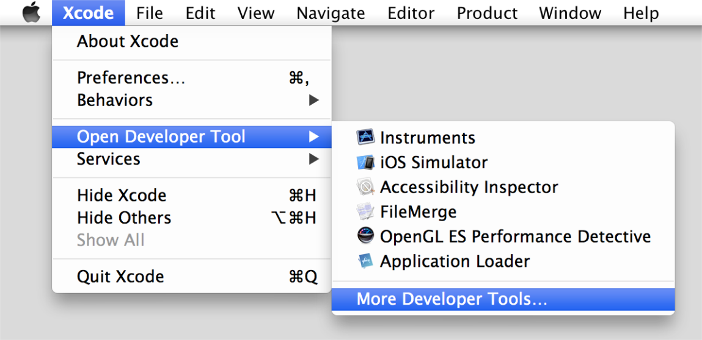
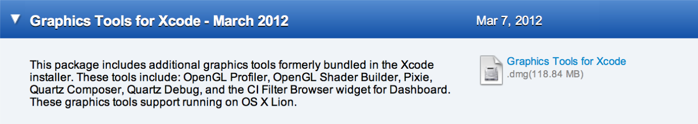
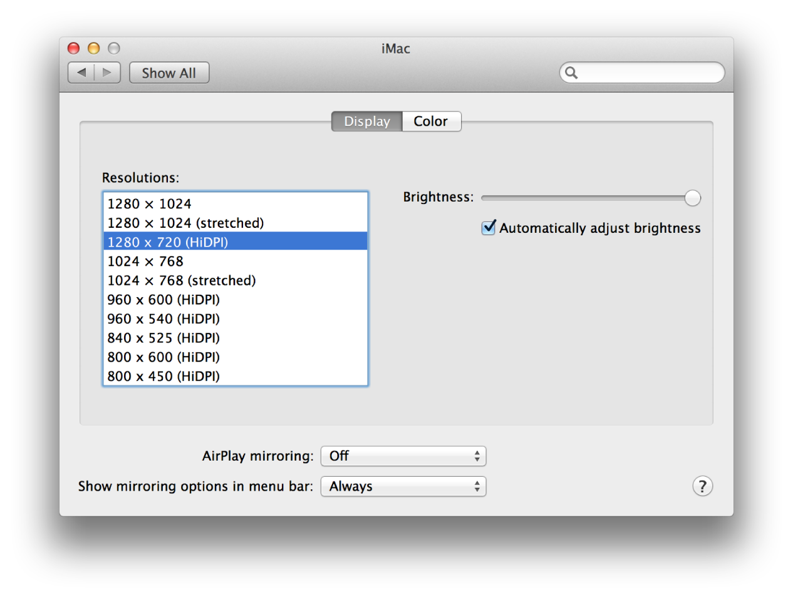

> 导航：[总目录](../../../README.md) · [documentation](../../../_indexes/documentation.md) · [High Resolution Guidelines for OS X](About%20High%20Resolution%20for%20OS%20X.md)


[Next](Glossary.md)[Previous](APIs%20for%20Supporting%20High%20Resolution.md)

# Testing and Troubleshooting High-Resolution Content

As you update an app for a high-resolution environment, you’ll need to test it to ensure you get the expected results. Although you’ll want to test the app on high-resolution hardware prior to releasing it, you can emulate a high-resolution display on a standard-resolution display as an intermediate step.

Before you can set the high-resolution options in Quartz Debug, you first need to download it (if you don't already have a copy).

To download Quartz Debug

1. Open Xcode.
2. Choose Xcode > Open Developer Tool > More Developer Tools...

   Choosing this item will take you to [developer.apple.com](https://developer.apple.com/).

   
3. Sign in to developer.apple.com.

   You should then see the Downloads for Apple Developers webpage.
4. Download the Graphics Tools for Xcode package, which contains Quartz Debug.

   
To enable high-resolution display modes

1. Launch Quartz Debug.
2. Choose UI Resolution from the Window menu.
3. Select “Enable HiDPI display modes”.
4. Log out and then log in to have the change take effect.

   This updates the Resolutions list in System Preferences.
5. Open System Preferences > Displays, and choose a resolution that is marked as HiDPI.

   

Before releasing your app you’ll want to make sure that @2x images load as expected. Users can configure a system with multiple displays such that one display is high resolution and another is standard resolution. Not only must your app be prepared to run on systems with different screen resolutions, but you need to ensure that your app’s windows work as expected when dragged from one display to another. When a window moves from a standard- to a high-resolution display, the window’s content should update to show the appropriately scaled image.

One way to check whether an image is loading correctly in high resolution is to tint it. You can do this by using the image-tinting option in Quartz Debug. After you turn on image tinting any @2x image that is not correctly sized for high resolution will appear tinted (as shown in the image on the right in Figure 5-1).

__Figure 5-1__  A standard-resolution image (left) and the same image tinted (right)

!!

Tinting is especially useful for finding graphics resources that might have been overlooked during your upscaling work, as shown in Figure 5-2. Note that the curved ends of the scroll control are tinted, which shows these details still need to be upscaled.

__Figure 5-2__  Tinting highlights details that could be overlooked

!

The easiest way to turn on the image-tinting option is from the Tools menu in Quartz Debug v4.2.

__Figure 5-3__  The tinting option in the Quartz Debug Tools menu

!

You can also access the feature from the command line using Terminal.

To turn on the tinting option for all apps for a given user (that is, global domain)

- Enter the following:

```
defaults write -g CGContextHighlight2xScaledImages YES
```
To restrict tinting to a particular app

- Replace `-g` with that app’s bundle identifier (for example, com.mycompany.myapp):

```
defaults write com.mycompany.myapp CGContextHighlight2xScaledImages YES
```


This section addresses some common problems you might encounter as you modify your app for high resolution.

Misplaced or truncated drawing almost certainly results from code that assumes a 1:1 relationship between points and pixels. In a high-resolution environment, there is no guarantee that this is the case. You might need to use the functions described in [Converting to and from the Backing Store](APIs%20for%20Supporting%20High%20Resolution.md#apple-f4xwc4dqnrsv64tfmyxwi33df52wszbpkridimbqgezdgmbsfvbuqnjnknltk) to perform appropriate conversions between points and pixels.

If you supplied standard- and high-resolution versions of images in your app but don’t think the correct version is being loaded, you can check whether it is by using the tinting option in Quartz Debug (see [Make Sure @2x Images Load on High-Resolution Screens](#apple-f4xwc4dqnrsv64tfmyxwi33df52wszbpkridimbqgezdgmbsfvbuqnrnknltk)). If you see a tinted image instead, use `tiffutil` to check the sizing (see [Run the TIFF Utility Command in Terminal](Optimizing%20for%20High%20Resolution.md#apple-f4xwc4dqnrsv64tfmyxwi33df52wszbpkridimbqgezdgmbsfvbuqnznknlteny)). You should also make sure the high-resolution version is named correctly. For example, make sure you use a lowercase `x` for `@2x`.

If OpenGL drawing looks slightly out of focus, make sure that:

- Your code opts in for getting the best resolution for your OpenGL view (see [Enable OpenGL for High-Resolution Drawing](Advanced%20Optimization%20Techniques.md#apple-f4xwc4dqnrsv64tfmyxwi33df52wszbpkridimbqgezdgmbsfvbuqmjqfvjvomzt)).
- You have not mixed point-based and pixel-based routines (see the example shown in [Set Up the Viewport to Support High Resolution](Advanced%20Optimization%20Techniques.md#apple-f4xwc4dqnrsv64tfmyxwi33df52wszbpkridimbqgezdgmbsfvbuqmjqfvjvomzv)).

The solution is to make sure that your drawing aligns on pixel boundaries rather than relying on points. You might also consider using Auto Layout for constraint-based, pixel-precise layout that works well for dynamic window changes. For more details, see _[Auto Layout Guide](https://developer.apple.com/library/archive/documentation/UserExperience/Conceptual/AutolayoutPG/index.html#//apple_ref/doc/uid/TP40010853)_.

To adjust the position of an object to fall on exact pixel boundaries

1. Convert the object’s origin and size values from user space to device space.
2. Normalize the values to fall on exact pixel boundaries in device space.
3. Convert the normalized values back to user space to obtain the coordinates required to achieve the desired pixel boundaries.
4. Draw your content using the adjusted values.

[Next](Glossary.md)[Previous](APIs%20for%20Supporting%20High%20Resolution.md)

