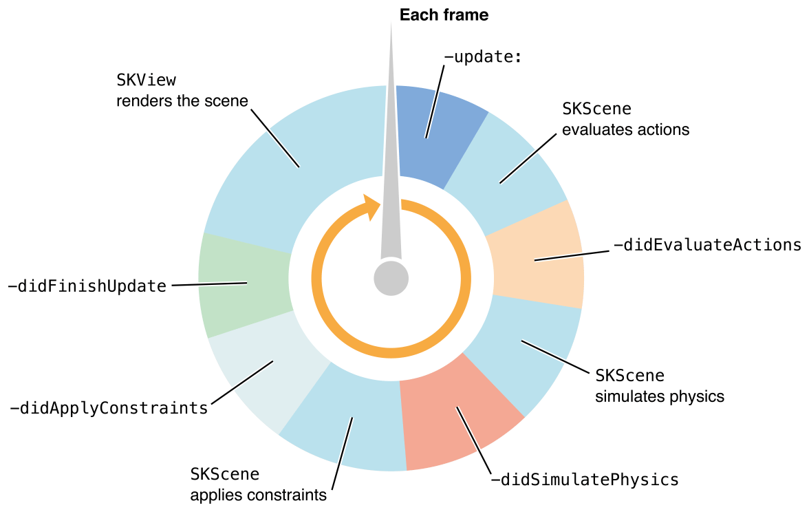

> 导航：[总目录](../../../README.md) · [documentation](../../../_indexes/documentation.md)

[Next](Jumping%20into%20SpriteKit.md)

# About SpriteKit

SpriteKit provides a graphics rendering and animation infrastructure that you can use to animate arbitrary textured images, or _sprites_. SpriteKit uses a traditional rendering loop where the contents of each frame are processed before the frame is rendered. Your game determines the contents of the scene and how those contents change in each frame. SpriteKit does the work to render frames of animation efficiently using the graphics hardware. SpriteKit is optimized so that the positions of sprites can be changed arbitrarily in each frame of animation.

SpriteKit also provides other functionality that is useful for games, including basic sound playback support and physics simulation. In addition, Xcode provides built-in support for SpriteKit so that you can create complex special effects and texture atlases directly in Xcode. This combination of framework and tools makes SpriteKit a good choice for games and other apps that require similar kinds of animation. For other kinds of user-interface animation, use Core Animation instead.

SpriteKit is available on iOS and OS X. It uses the graphics hardware available on the hosting device to composite 2D images at high frame rates. SpriteKit supports many different kinds of content, including:

- Untextured or textured rectangles (sprites)
- Text
- Arbitrary CGPath-based shapes
- Video

SpriteKit also provides support for cropping and other special effects; you can apply these effects to all or a portion of your content. You can animate or change these elements in each frame. You can also attach physics bodies to these elements so that they properly support forces and collisions.

Because SpriteKit supports a rich rendering infrastructure and handles all of the low-level work to submit drawing commands to OpenGL, you can focus your efforts on solving higher-level design problems and creating great gameplay.

### Sprite Content is Drawn by Presenting Scenes Inside a Sprite View

Animation and rendering is performed by an [SKView](https://developer.apple.com/documentation/spritekit/skview) object. You place this view inside a window, then render content to it. Because it is a view, its contents can be combined with other views in the view hierarchy.

Content in your game is organized into _scenes_, which are represented by [SKScene](https://developer.apple.com/documentation/spritekit/skscene) objects. A scene holds sprites and other content to be rendered. A scene also implements per-frame logic and content processing. At any given time, the view presents one scene. As long as a scene is presented, its animation and per-frame logic are automatically executed.

To create a game using SpriteKit, you either subclasses the `SKScene` class or create a scene delegate to perform major game-related tasks. For example, you might create separate scene classes to display a main menu, the gameplay screen, and content displayed after the game ends. You can easily use a single [SKView](https://developer.apple.com/documentation/spritekit/skview) object in your window and switch between different scenes. When you switch scenes, you can use the [SKTransition](https://developer.apple.com/documentation/spritekit/sktransition) class to animate between the two scenes.

### A Node Tree Defines What Appears in a Scene

The `SKScene` class is a descendant of the [SKNode](https://developer.apple.com/documentation/spritekit/sknode) class. When using SpriteKit, nodes are the fundamental building blocks for all content, with the scene object acting as the root node for a tree of node objects. The scene and its descendants determine which content is drawn and how it is rendered.

Each node’s position is specified in the coordinate system defined by its parent. A node also applies other properties to its content and the content of its descendants. For example, when a node is rotated, all of its descendants are rotated also. You can build a complex image using a tree of nodes and then rotate, scale, and blend the entire image by adjusting the topmost node’s properties.

The `SKNode` class does not draw anything, but it applies its properties to its descendants. Each kind of drawable content is represented by a distinct subclass in SpriteKit. Some other node subclasses do not draw content of their own, but modify the behavior of their descendants. For example, you can use an [SKEffectNode](https://developer.apple.com/documentation/spritekit/skeffectnode) object to apply a Core Image filter to an entire subtree in the scene. By precisely controlling the structure of the node tree, you determine the order in which nodes are rendered.

All node objects are responder objects, descending either from [UIResponder](https://developer.apple.com/documentation/uikit/uiresponder) or [NSResponder](https://developer.apple.com/documentation/appkit/nsresponder), so you can subclass any node class and create new classes that accept user input. The view class automatically extends the responder chain to include the scene’s node tree.

### Textures Hold Reusable Graphical Data

Textures are shared images used to render sprites. Always use textures whenever you need to apply the same image to multiple sprites. Usually you create textures by loading image files stored in your app bundle. However, SpriteKit can also create textures for you at runtime from other sources, including Core Graphics images or even by rendering a node tree into a texture.

SpriteKit simplifies texture management by handling the lower-level code required to load textures and make them available to the graphics hardware. Texture management is automatically managed by SpriteKit. However, if your game uses a large number of images, you can improve its performance by taking control of parts of the process. Primarily, you do this by telling SpriteKit explicitly to load a texture.

A _texture atlas_ is a group of related textures that are used together in your game. For example, you might use a texture atlas to store all of the textures needed to animate a character or all of the tiles needed to render the background of a gameplay level. SpriteKit uses texture atlases to improve rendering performance.

### Nodes Execute Actions to Animate Content

A scene’s contents are animated using _actions_. Every action is an object, defined by the [SKAction](https://developer.apple.com/documentation/spritekit/skaction) class. You tell nodes to execute actions. Then, when the scene processes frames of animation, the actions are executed. Some actions are completed in a single frame of animation, while other actions apply changes over multiple frames of animation before completing. The most common use for actions is to animate changes to the node’s properties. For example, you can create actions that move a node, scale or rotate it, or make it transparent. However, actions can also change the node tree, play sounds, or even execute custom code.

Actions are very useful, but you can also combine actions to create more complex effects. You can create _groups_ of actions that run simultaneously or _sequences_ where actions run sequentially. You can cause actions to automatically repeat.

Scenes can also perform custom per-frame processing. You override the methods of your scene subclass to perform additional game tasks. For example, if a node needs to be moved every frame, you might adjust its properties directly every frame instead of using an action to do so.

### Add Physics Bodies and Joints to Simulate Physics in Your Scene

Although you can control the exact position of every node in the scene, often you want these nodes to interact with each other, colliding with each other and imparting velocity changes in the process. You might also want to do things that are not handled by the action system, such as simulating gravity and other forces. To do this, you create physics bodies ([SKPhysicsBody](https://developer.apple.com/documentation/spritekit/skphysicsbody)) and attach them to nodes in your scene. Each physics body is defined by shape, size, mass, and other physical characteristics. The scene defines global characteristics for the physics simulation in an attached [SKPhysicsWorld](https://developer.apple.com/documentation/spritekit/skphysicsworld) object. You use the physics world to define gravity for the entire simulation, and to define the speed of the simulation.

When physics bodies are included in the scene, the scene simulates physics on those bodies. Some forces, such as friction and gravity, are applied automatically. Other forces can be applied automatically to multiple physics bodies by adding [SKFieldNode](https://developer.apple.com/documentation/spritekit/skfieldnode) objects to the scene. You can also directly affect a specific field body by modifying its velocity directly or by applying forces or impulses directly to it. The acceleration and velocity of each body is computed and the bodies collide with each other. Then, after the simulation is complete, the positions and rotations of the corresponding nodes are updated.

You have precise control over which physics effects interact with each other. For example, you can that a particular physics field node only affects a subset of the physics bodies in the scene. You also decide which physics bodies can collide with each other and separately decide which interactions cause your app to be called. You use these callbacks to add game logic. For example, your game might destroy a node when its physics body is struck by another physics body.

You can also use the physics world to find physics bodies in the scene and to connect physical bodies together using a joint ([SKPhysicsJoint](https://developer.apple.com/documentation/spritekit/skphysicsjoint)). Connected bodies are simulated together based on the kind of joint.

Read [Jumping into SpriteKit](Jumping%20into%20SpriteKit.md#apple-f4xwc4dqnrsv64tfmyxwi33df52wszbpkridimbqgeztanbtfvbuqmrnknltc) to get an overview of implementing a SpriteKit game. Then work through the other chapters to learn the details about SpriteKit’s features. Some chapters include suggested exercises to help you develop your understanding of SpriteKit. SpriteKit is best learned by doing; place some sprites into a scene and experiment on them!

The final chapter, [SpriteKit Best Practices](SpriteKit%20Best%20Practices.md#apple-f4xwc4dqnrsv64tfmyxwi33df52wszbpkridimbqgeztanbtfvbuqnznknltc), goes into more detail about designing a game using SpriteKit.

Before attempting to create a game using SpriteKit, you should already be familiar with the fundamentals of app development. In particular, you should be familiar with the following concepts:

- Developing apps using Xcode
- Objective-C, including support for [blocks](https://developer.apple.com/library/archive/documentation/General/Conceptual/DevPedia-CocoaCore/Block.html#//apple_ref/doc/uid/TP40008195-CH3)
- The view and window system

For more information:

- On iOS, see _[Start Developing iOS Apps Today (Retired)](https://developer.apple.com/library/archive/referencelibrary/GettingStarted/RoadMapiOS-Legacy/index.html#//apple_ref/doc/uid/TP40011343)_.
- On OS X, see _[Start Developing Mac Apps Today](https://developer.apple.com/library/archive/referencelibrary/GettingStarted/RoadMapOSX/index.html#//apple_ref/doc/uid/TP40012262)_.

See _[SpriteKit Framework Reference](https://developer.apple.com/documentation/spritekit)_ when you need specific details on functions and classes in the SpriteKit framework. Some features available in SpriteKit are not described in this programming guide, but are described in the reference.

See [About Texture Atlases](http://help.apple.com/xcode/mac/8.0/#/dev0bfaf1ab7) and _[Particle Emitter Editor Guide](../../IDEs/Particle%20Emitter%20Editor%20Guide/About%20the%20Particle%20Emitter%20Editor.md#apple-f4xwc4dqnrsv64tfmyxwi33df52wszbpkridimbqgezteojx)_ for information on how to use Xcode’s built-in support for SpriteKit.

See _code:Explained Adventure_ for an in-depth look at a SpriteKit based game.

The following samples are available only in the OS X library, but still serve as useful SpriteKit examples for iOS apps :

- See _[Sprite Tour](../../../samplecode/Sprite%20Tour/Sprite%20Tour.md#apple-f4xwc4dqnrsv64tfmyxwi33df52wszbpirkfgnbqgaytgmzyhe)_ for a detailed look at the [SKSpriteNode](https://developer.apple.com/documentation/spritekit/skspritenode) class.
- See _[SpriteKit Physics Collisions](../../../samplecode/SpriteKit%20Physics%20Collisions/SpriteKit%20Physics%20Collisions.md#apple-f4xwc4dqnrsv64tfmyxwi33df52wszbpirkfgnbqgaytgmzzga)_ to understand the physics system in SpriteKit.
[Next](Jumping%20into%20SpriteKit.md)

