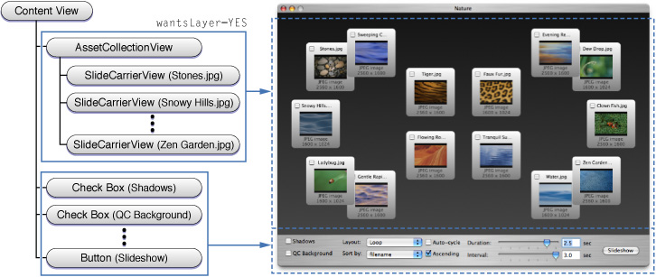

> 导航：[总目录](../../../README.md) · [documentation](../../../_indexes/documentation.md) · [Animation Overview](Introduction%20to%20Animation%20Overview.md)

[Next](Glossary.md)[Previous](OS%20X%20Animation%20Technologies.md)

# Choosing the Animation Technology for Your Application

Choosing which animation technology your application should use can be challenging.

This chapter provides guidelines that will help you determine whether your application should use Core Animation, non-layer-backed Cocoa views, layer-backed Cocoa views, or a combination of the technologies. It also provides a summary of the capabilities offered by Core Animation layers and layer-backed Cocoa views.

When adding animation to your applications, the following guidelines will help you choose the appropriate technology:

- For the portions of your user interface that only require static, non-rotated, Aqua controls, use Cocoa views.
- For the portions of your user interface that require simple animation of a view or window's frame, consider using the animator proxy support provided by Cocoa views and windows.
- For the portions of your user interface that require the ability to display and interact with rotated Aqua controls, use layer-backed Cocoa views.
- If performance testing indicates that your custom view is processor or time intensive, consider using layer-backed Cocoa views. Remember that layer-backed views use more memory than non-layer-backed views.
- If your custom views requires extensive user events handling consider using layer-backed Cocoa views.
- For the portions of your user interface that have considerable graphics and animation requirements and does not rely on Aqua controls, consider using Core Animation layers directly. Using layers directly does require you to handle all user events (mouse and keyboard interaction) yourself by overriding the view that hosts the root layer.

Core Animation layers, on the other hand, have the advantage of being computationally much lighter-weight than instances of Cocoa views. This allows you to create interfaces from smaller constituent parts when using Core Animation layers. This can also give Core Animation layers the edge when your application needs to display hierarchies consisting of thousands of layer objects.

You can use a combination of layer-backed views, non-layer-backed views, and layer-hosting views in a single user interface with two caveats:

- All the subviews of layer-backed views are automatically layer backed. To improve performance, you should avoid making views descendants of layer-backed views if they don’t require animation or cached drawing.
- You must host your custom Core Animation layers in a single layer-hosting view rather than inserting them into a layer hierarchy managed by a layer-backed view.

The _[CocoaSlides](../../../samplecode/CocoaSlides/CocoaSlides.md#apple-f4xwc4dqnrsv64tfmyxwi33df52wszbpirkfgmjqgaydimbxgi)_ sample is an example of a hybrid view/layer-backed view user interface. Figure 4-1 shows the relevant portion of the view hierarchy.

__Figure 4-1__  Hybrid layer-backed view and conventional view user interface

The `AssetCollectionView` view is a layer-backed view, and as a result all the `SlideCarrierView` subviews are also layer-backed. Layer-backed views are used for this portion of the user interface because:

- The slides require animation that includes rotation; this requirement precludes using non-layer-backed views, because the view animation proxies do not support rotation unless the view is layer-backed.
- The slides incorporate a standard Aqua checkbox; this fact precludes using Core Animation directly because it doesn’t provide Aqua controls. Replicating the look and feel of an Aqua control in a Core Animation layer is not recommended; this may change in a future version of OS X.

  Using a non-layer-backed view is not an option; The Aqua checkbox must function, even when rotated, and that is not supported.
- The slides are complex to draw; by using a layer-backed view; the slide content is redrawn by the application only when it changes.

The portion of the user interface at the bottom of the window is made up of standard Aqua controls that are not layer-backed. There is no need for these controls to be in a layer-backed view hierarchy; they are never rotated and would not benefit significantly by using cached drawing.

The following is a brief summary of the shared capabilities of Core Animation layers and layer-backed views, including the advantages of one over the other.

- Both layers and layer-backed views support a nested hierarchy model with parent-relative coordinate systems.
- Both layers and layer-backed views support cached contents that require no application interaction for damage redrawing.
- Both layers and layer-backed views support the full range of media types.
- Both layers and layer-backed views support overlapping of layers/views with other layers/views outside of the sublayer/subview.

- Layers support several visual properties that are not exposed in layer-backed views. For example, corner radius and borders.
- Sublayers can reside outside of a layer’s bounds.
- Layers support complex masking.
- Layers are computationally lightweight.
- Layers support complex transforms.
- Layout managers provide more flexible control over layer placement.

- Layer-backed views participate in the responder chain.
- Layer-backed views receive user events.
- Layer-backed views support drag and drop.
- Layer-backed views support accessibility.
- Layer-backed views support all the standard Aqua controls and views.
- Layer-backed views support scrolling.
- Layer -backed views support text input.

[Next](Glossary.md)[Previous](OS%20X%20Animation%20Technologies.md)

