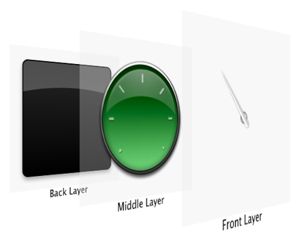
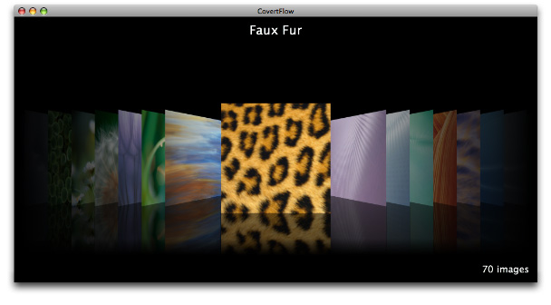

> 导航：[总目录](../../../README.md) · [documentation](../../../_indexes/documentation.md) · [Animation Overview](Introduction%20to%20Animation%20Overview.md)


[Next](Choosing%20the%20Animation%20Technology%20for%20Your%20Application.md)[Previous](Animation%20Basics.md)

# OS X Animation Technologies

Incorporating sophisticated animations and visual effects into an application can be difficult, often requiring developers to use low-level graphics APIs such as OpenGL to get acceptable animation performance. OS X provides several technologies that make it easier to create rich, animated application interfaces from high-level APIs that are available to both Cocoa and Carbon applications.

__Core Animation__ is an Objective-C framework, first introduced in OS X v10.5, that allows you to dramatically increase the production value of your application by adding real-time animations and visual transitions without needing to know esoteric graphics and math techniques. Using Core Animation you can dynamically render and animate text, 2D graphics, OpenGL, Quartz Composer compositions and QuickTime video simultaneously, complete with transparency effects and Core Image filters and effects.

At its heart, Core Animation is a high-speed, 2D layering engine. You create a Core Animation interface by dividing the user interface into separate layers. By compositing those layers together you create the finished user interface. Figure 3-1 shows a user interface animating its content, then splitting into its decomposed Core Animation layers to show how the layers are combined.

__Figure 3-1__  A Core Animation user interface decomposed into layers



Layers are arranged in a nested layer tree—an abstraction that should be familiar to developers who have used views in their Cocoa application. Each visible layer tree is backed by a corresponding render tree, which is responsible for caching the layer content and rapidly compositing it to the screen as required. Your application doesn't need to perform costly redraw operations unless the content changes.

In addition to the layer’s basic position and geometry, each layer also provides optional visual properties that are applied when a layer's content is rendered, including:

- An optional background color
- An optional corner radius, allowing layers to display with rounded corners
- An optional array of Core Image filters that are applied to the content behind a layer before its content is composited
- A Core Image filter used to composite the layer's contents with the background
- An optional array of Core Image filters that are applied to the contents of the layer and its sublayers
- Control over a layer's opacity
- Parameters that are used to draw an optional shadow including the color, offset, opacity and blur radius
- An optional border drawn using the specified line width and color

Although Core Animation is a 2D layering engine, it provides support for convincing 3D scenes using projective transformations. Every layer has a three-dimensional transform matrix that is applied to its content, and a second three-dimensional transform matrix that is applied to its sublayers. Using these projections, you can create stunning user interfaces that communicate depth to the user (see Figure 3-2).

__Figure 3-2__   Core Animation 3D interface



Core Animation provides support for animating a layer’s visual properties in two ways, implicitly and explicitly.

Implicit animations occur automatically in response to setting a new value for an animatable layer property. Core Animation assumes full responsibility for running the animation, at frame rate, in a separate thread, freeing your application to handle other events. For example, by assigning the `frame` property the `newFrame` value, the `textLayer` object animates smoothly to the new location.

```
textLayer.frame=newFrame;
```

Each of a layer’s animatable properties has a related implicit animation. You can override a default animation to supply your own custom animations for a layer property. You can also disable the animation of any layer property, either temporarily or permanently.

Explicit animation is achieved by creating an instance of a Core Animation animation class and specifying a target layer and, optionally, a property. Explicitly animating a layer property affects only the presentation value of the property; the actual value of the layer property does not change. For example, to draw attention to a layer, you might make it spin 360° by animating the transformation matrix. This animation affects the display of the layer, but its transform matrix remains untouched.

Core Animation layers support the classic Cocoa view model of positioning layers relative to their superlayer—a style known as “springs and struts”. In addition Core Animation also provides a more general layout manager mechanism that allows you to write your own layout managers. A custom layout manager assumes responsibility for providing layout of the associated layer's sublayers.

Using a custom layout manager, your application can create complex animations by taking advantage of implicit animations. Updating the position, size, or transform matrix of a layer causes it to animate to the new settings. The CoverFlow style of animation is accomplished with a custom layout manager.

Core Animation provides a constraint layout manager class that arranges layers using a set of constraints. Each specified constraint describes the relationship of one geometric attribute of a layer (the left, right, top, or bottom edge or the horizontal or vertical center) to a geometric attribute of one of its sibling layers or its superlayer. For example, using the constraint layout manager you can define a layout where layer A is always centered and 5 points below layer B. Moving layer B to a new position automatically causes layer A” to reposition itself relative to layer B.

The Cocoa `NSView` class is integrated with Core Animation and layers in two ways. The first type of integration is _layer hosting_. A layer-hosting view displays a Core Animation layer tree that is set by an application. It is the application’s responsibility to interact with the layer content by manipulating the layers directly. A layer hosting view is how an application displays Core Animation user interfaces.

You specify that the view `aView` is the layer host of the Core Animation layer `rootLayer` as follows:

```

// aView is an existing view in a window
// rootLayer is the root layer of a layer tree

[aView setLayer:rootLayer];
[aView setWantsLayer:YES];
```

When working with a layer-hosting view, you typically subclass `NSView` and handle user-generated events such as keypresses and mouse clicks in that subclass, manipulating the Core Animation layers as necessary.

The second type of `NSView` and Core Animation integration is _layer-backed views_. Layer-backed views use Core Animation layers as their backing store, freeing the views from the responsibility of refreshing the screen. The views need to redraw only when the view content actually changes. Enabling layer-backing for a view and its descendants is done using the following code:

```

// aView is an existing view in a window
[aView setWantsLayer:YES];
```

When layer backing is enabled for a view, the view and all its subviews are mirrored by a Core Animation layer tree. The views can be standard Aqua controls or custom views. The view and its subviews still take part in the responder-chain, still receive events, and act as any other view. However, when redrawing needs to be done and the content has not changed, the render tree handles the redraw rather than the application.

In addition to providing cached redrawing, layer-backed views expose a number of the advanced visual properties of Core Animation layer properties, including:

- Control over the view’s opacity
- An optional shadow, specified using an `NSShadow` object
- An optional array of Core Image filters that are applied to the content behind a view before its content is composited
- A Core Image filter used to composite the view’s contents with the background
- An optional array of Core Image filters that are applied to the contents of the view and its subviews

For more information on layer-backed views, see _[View Programming Guide](../../Cocoa/View%20Programming%20Guide/Introduction%20to%20View%20Programming%20Guide%20for%20Cocoa.md#apple-f4xwc4dqnrsv64tfmyxwi33df52wszbpkridimbqgazdsnzy)_.

Taking a cue from Core Animation, the Application Kit supports the concept of a generalized animation facility through the use of __animation proxies__.

Classes that support the `NSAnimatablePropertyContainer` protocol provide implicit animation support for any property that is key-value coding compliant. By operating through the animation proxy, you can perform implicit animation just as you can in Core Animation.

For example, the following code snippet causes `aView` to be displayed at its new location:

```
[aView setFrame:NSMakeRect(100.0,100.0,300.0,300.0)];
```

However, using an animation proxy and the same view method, `aView` animates smoothly to its new location.

```
[[aView animator] setFrame:NSMakeRect(100.0,100.0,300.0,300.0)];
```

Unlike Core Animation, which allows only animation of properties that have a direct mapping to a render-tree property, the Application Kit allows any key-value coding compliant property to be animated if its class implements the `NSAnimatablePropertyContainer` protocol. Animating these properties does require the view to redraw its contents, but is still much easier than animating these properties manually. As with Core Animation layers you can change the default implicit animation for the animated properties.

For additional information on Cocoa animation see _[Animation Programming Guide for Cocoa](../../Cocoa/Animation%20Programming%20Guide%20for%20Cocoa/Introduction%20to%20Animation%20Programming%20Guide%20for%20Cocoa.md#apple-f4xwc4dqnrsv64tfmyxwi33df52wszbpkridimbqgaztkojs)_.

The `NSView` class provides methods that allow you to easily provide a transition animation that is used when a view transitions to full screen mode and back again. The method [enterFullScreenMode:withOptions:](https://developer.apple.com/documentation/appkit/nsview/1483780-enterfullscreenmode) allows you to specify the target screen that the view should take over. Exiting full screen mode is done using [exitFullScreenModeWithOptions:](https://developer.apple.com/documentation/appkit/nsview/1483256-exitfullscreenmode). You can test whether a view is in full screen mode using the method [isInFullScreenMode](https://developer.apple.com/documentation/appkit/nsview/1483337-isinfullscreenmode).

The `NSAnimation` and `NSViewAnimation` classes provide a much simpler, and less powerful, animation capability than the `NSAnimatablePropertyContainer` protocol.

`NSAnimation` provides basic timing functionality and progress curve computation, a delegate mechanism for influencing animation behavior in simple ways, and facilities for chaining component animations together.

`NSViewAnimation` is a concrete subclass of `NSAnimation` that provides for animating view frame changes (thus, both position and dimensions) and performing simple fade-in and fade-out effects, using any of four predefined progress curves. View animations may be blocking, asynchronous, or threaded asynchronous, but successive incremental changes as view frame coordinates are interpolated take effect immediately in the view instances themselves.

If your application is intended for deployment on OS X v10.5 or later, you’ll find that the animation proxies provided by the `NSWindow` and `NSView` classes are typically more convenient to use than using `NSAnimation` directly.

`NSAnimation` and `NSViewAnimation` are available in OS X v10.4 and later. For additional information on `NSAnimation` and `NSViewAnimation`, see _[Animation Programming Guide for Cocoa](../../Cocoa/Animation%20Programming%20Guide%20for%20Cocoa/Introduction%20to%20Animation%20Programming%20Guide%20for%20Cocoa.md#apple-f4xwc4dqnrsv64tfmyxwi33df52wszbpkridimbqgaztkojs)_.

[Next](Choosing%20the%20Animation%20Technology%20for%20Your%20Application.md)[Previous](Animation%20Basics.md)

