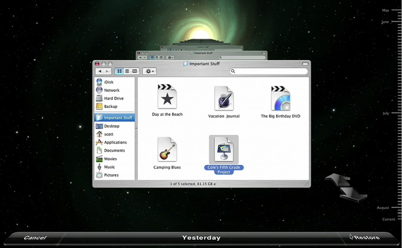
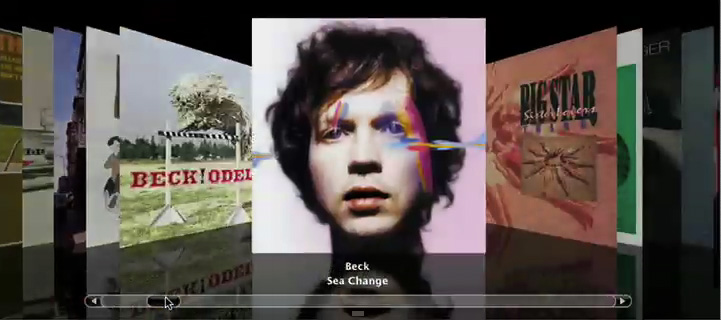

> 导航：[总目录](../../../README.md) · [documentation](../../../_indexes/documentation.md) · [Animation Overview](Introduction%20to%20Animation%20Overview.md)

[Next](Animation%20Basics.md)[Previous](Introduction%20to%20Animation%20Overview.md)

# What Is Animation?

Animation is a visual technique that provides the illusion of motion by displaying a collection of images in rapid sequence. Each image contains a small change, for example a leg moves slightly, or the wheel of a car turns. When the images are viewed rapidly, your eye fills in the details and the illusion of movement is complete.

When used appropriately in your application’s user interface, animation can enhance the user experience while providing a more dynamic look and feel. Moving user interface elements smoothly around the screen, gradually fading them in and out, and creating new custom controls with special visual effects can combine to create a cinematic computing experience for your users.

There are many examples of animation in the OS X user interface:

- Dock icons bounce to indicate that an application requires the user's attention.
- Sheets and drawers use animation as they are displayed and hidden.
- Progress indicators animate to indicate that a lengthy operation is in progress.
- Dragging icons to the dock causes icons to “part” to allow the new icon to be inserted.
- The default button in a panel pulses.

Applications also use animation effectively to provide a rich, dynamic user experience. For example, iChat plays a sound, and then uses animation to show when a buddy is no longer available. The sound alerts you to the change in status, and the animation provides you a chance to focus on the application to analyze the event.

Front Row uses animation throughout its user interface. For example, when Front Row is activated a transition is used to show that the mode is changing from the Mac OS Aqua interface to the Front Row interface. As you navigate deeper into the hierarchy of menus, new menus push in from the right, pushing the old menu off to the left. As you ascend the menus, the transitions reverse, again helping you maintain context.

In Time Machine perceived distance provides an intuitive metaphor for a linear progression in time. Older file system snapshots are shown further away, allowing you to move through them to find the version you want to restore.

__Figure 1-1__  Time Machine user interface

The iTunes 7.0 CoverFlow interface shows album and movie covers in an engaging manner. As you browse through the content the images animate to face the user directly. This is a great example of the cinematic computing experience. And the CoverFlow user interface allows more content to be displayed in a smaller area than if the images were placed side by side.

__Figure 1-2__  iTunes 7.0 CoverFlow user interface

Even small uses of animation can communicate well. The iSync menu extra animates to show the syncing is in progress (Figure Figure 1-3.) In all these cases the applications provide additional information and context to the user through the use of animation.

__Figure 1-3__  iSync menu status item

How you incorporate animation into your own application largely depends on the type of interface your application provides. Applications that use the Aqua user interface can best integrate animation by creating custom controls or views. Applications that create their own user interface, such as educational software, casual games, or full-screen applications such as Front Row, have much greater leeway in determining how much animation is appropriate for their users.

With judicious use of animation and visual effects, the most mundane system utility can become a rich visual experience for users, thus providing a compelling competitive advantage for your application.

[Next](Animation%20Basics.md)[Previous](Introduction%20to%20Animation%20Overview.md)

