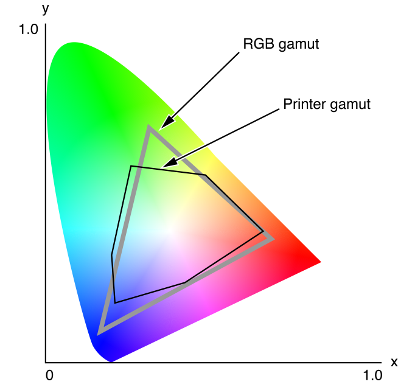

> 导航：[总目录](../../../README.md) · [documentation](../../../_indexes/documentation.md) · [Color Management Overview](Introduction%20to%20Color%20Management%20Overview.md)

[Next](Document%20Revision%20History.md)[Previous](Color%20Spaces.md)

# Color Management Systems

Color management is the process of ensuring consistent color across peripheral devices and across operating-system platforms. Members of the computer and publishing industries developed color management systems (CMSs) to convert colors from the color space of one device to the color space of another device. A color management system gives the user the ability to perform color matching, to see in advance which colors cannot be accurately reproduced on a specific device, to simulate the range of colors of one device on another, and to calibrate peripheral devices using a device profile and a calibration application.

A color management system includes:

- Collections of color characteristics. These collections are given various names, such as color tags, precision transforms, or profiles.
- A color management module (CMM). This is a mathematical engine that performs the color matching among, and transformation between, collections of color characteristics.
- A system component for invoking color matching. ColorSync is Apple’s implementation of the ICC specification, providing system-level color management of images, documents, and devices.

When an image is output to a particular device, the device displays only those colors that are within its gamut. Likewise, when an image is created by scanning, all colors from the original image are reduced to the colors within the scanner’s gamut. Devices with different gamuts cannot reproduce each other’s colors exactly, but careful shifting of the colors used on one device can improve the visual match when the image is displayed on another.

Figure 3-1 shows examples of two devices’ color gamuts, projected onto Yxy space. Both devices produce less than the total possible range of colors, and the printer gamut is restricted to a significantly smaller range than the RGB gamut. The problem illustrated by Figure 3-1 is to display the same image on both devices with a minimum of visual mismatch. The solution to the problem is to match the colors of the image using profiles for both devices and one or more color management modules. A _profile_ is a structure that provides a means of defining the color characteristics of a given device in a particular state.

__Figure 3-1__  Color gamuts for two devices expressed in Yxy space

_Color conversion_ is the process of converting colors from one color space to another. _Color matching_, which entails color conversion, is the process of selecting colors from the destination gamut that most closely approximate the colors from the source image. Color matching always involves color conversion, whereas color conversion may not entail color matching. 

Color matching or color conversion across different color spaces requires the use of a profile for each device involved. Profiles provide the information necessary to understand how a particular device reproduces color. A profile may contain such information as lightest and darkest possible tones (referred to as white point and black point), the difference between specific “targets” and what is actually captured, and maximum densities for red, green, blue, cyan, magenta, and yellow. Together these measurements represent the data which describe a particular color gamut.

Profiles are documents containing data that describe how to transform colors from device color space to an intermediate color space. This file format allows for the description of a wide variety of devices and is regularly updated with improvements. If needed, you can extend the data format to suit your software’s purpose.

Profiles can contain different kinds of information. For example, a scanner profile and a printer profile have different sets of minimum required tags and element data. They can also contain optional and private tagged elements which can contain custom information used by particular color management modules. However, all profiles have at least a header followed by a required element tag table. The required tags may represent lookup tables, for example. The required tags for various profile classes are described in the International Color Consortium Profile Format Specification. To obtain a copy of this specification, or to get other information about the ICC, visit the ICC Web site at [http://www.color.org/](http://www.color.org/).

The profile that is associated with the image and describes the characteristics of the device on which the image was created is called the _source profile_. Displaying the image requires using another profile, which is associated with the output device, such as a display. The profile for that device is called the _destination profile_. If the image is destined for a display, color matching requires using the display’s profile (the destination profile) along with the image source profile to match the image colors to the display gamut. If the image is printed, color matching must use the printer profile to match the image colors to the printer, including generating black and removing excessive color densities (known as undercolor removal, or UCR) where appropriate.

A _profile connection space_ (PCS) is a device-independent color space used as an intermediate when converting from one device-dependent color space to another. Profile connection spaces are typically based on spaces derived from the CIE color space. ColorSync supports two of these spaces, XYZ and L\*a\*b.

There are a variety of classes, or categories of profiles, each of which plays a role in the color matching process. They include:

- Device profiles
- Color space profiles
- Abstract profiles
- Device link profiles
- Named color space profiles

A _device profile_ characterizes a particular device: that is, it describes the characteristics of a color space for a physical device in a particular state. A display, for example, might have a single profile, or it might have several, based on differences in gamma value and white point. A printer might have a different profile for each paper type or ink type it uses because each paper type and ink type constitutes a different printer state. Broadly speaking, there are three kinds of device profiles—input, display, and output. Input device profiles characterize scanners and digital cameras. Display devices profiles characterize monitors and LCD panels. Output device profile characterize printers, printing presses, and film recorders.

A _color space profile_ contains the data necessary to convert color values between a PCS and a non-device color space (such as L\*a\*b to or from L\*u\*v, or XYZ to or from Yxy), for color matching. Color space profiles provide a convenient means for CMMs to convert between different non-device profiles.

_Abstract profiles_ allow applications to perform special color effects independent of the devices on which the effects are rendered. For example, an application may choose to implement an abstract profile that increases yellow hue on all devices. Abstract profiles allow users of the application to make subjective color changes to images or graphics objects.

A _device link profile_ represents a one-way link or connection between devices. It can be created from a set of multiple profiles, such as various device profiles associated with the creation and editing of an image. It does not represent any device model, nor can it be embedded into images.

A _named color space profile_ contains data for a list of named colors. The profile specifies a device color value and the corresponding CIE value for each color in the list.

Profiles can be embedded within images. For example, profiles can be embedded in JPEG, EPS, TIFF, and PICT files and in the private file formats used by applications. Embedded profiles allow for the automatic interpretation of color information as the color image is transferred from one device to another.

Embedding a profile in an image guarantees that the image can be rendered correctly on a different system. Although profiles can be several hundred KB or even larger, the typical RGB profile is around 500 bytes.

A color management module (CMM) uses profiles to convert and match a color in a given color space on a given device to or from another color space or device, perhaps a device-independent color space. When colors consistent with one device’s gamut are displayed on a device with a different gamut, a CMM attempts to minimize the perceived differences in the displayed colors between the two devices. The CMM does this by mapping the out-of-gamut colors into the range of colors that can be produced by the destination device. The CMM uses lookup tables and algorithms for color matching, previewing, color reproduction capabilities of one device on another, and checking for colors that cannot be reproduced.

Rendering intent refers to the approach taken when a CMM maps or translates the colors of an image to the color gamut of a destination device—that is, a rendering intent specifies a gamut-matching strategy. The ICC specification defines a profile tag for each of four rendering intents: perceptual matching, relative colorimetric matching, saturation matching, and absolute colorimetric matching.

_Perceptual matching_ is typically used for photographic content. All the colors of one gamut are scaled to fit within another gamut. Colors maintain their relative positions. Perceptual matching usually produces better results than colorimetric matching for realistic images such as scanned photographs. The eye can compensate for gamuts differences and when printed on a CMYK device, the image may look similar to the original on an RGB device. A side effect is that most of the colors of the original space may be altered to fit in the new space.

_Relative colorimetric matching_ is typically used for spot colors. Colors that fall within the overlapping gamuts of both devices are left unchanged. For example, to match an image from the RGB gamut onto the CMYK printer gamut, only the colors in the RGB gamut that fall outside the printer gamut are altered. Allows some colors in both images to be exactly the same, which is useful when colors must match quantitatively. A disadvantage is that many colors may map to a single color, resulting in tone compression. All colors outside the printer gamut, for example, would be converted to colors at the edge of its gamut, reducing the number of colors in the image and possibly altering its appearance. Colors outside the gamut are usually converted to colors with the same lightness, but different saturation, at the edge of the gamut. The final image may be lighter or darker overall than the original image, but the blank areas will coincide.

_Saturation matching_ is typically used for business graphics. The relative saturation of colors is maintained as well as can be achieved from gamut to gamut. Colors outside the gamut of the destination space are usually converted to colors with the same saturation of the source space, but with different lightness, at the edge of the gamut. Can be useful for some graphic images, such as bar graphs and pie charts, when the actual color displayed is less important than its vividness.

_Absolute colorimetric matching_ is most often used in proofing. This type of matching preserves the native device white point of the source image instead of mapping to D50 relative. Absolute colorimetric matching is most often used in simulation or proofing operations where a device is trying to simulate the behavior of another device and media. For example, simulating newsprint on a monitor with absolute colorimetric intent would allow white space to be displayed onscreen as yellowish background because of the differences in white points between the two devices.

ColorSync is Apple’s platform-independent color management system that provides essential services for fast, consistent, and accurate color calibration, proofing, and reproduction. In OS X, ColorSync is fully integrated into the operating system. In most cases, color matching occurs behind-the-scenes, without any effort required on the part of applications. As soon as a device is connected to the computer, OS X registers at least one profile for the device. ColorSync uses the registered profiles to ensure color matching throughout the digital workflow.

The ColorSync Manager is the application programming interface (API) to color matching services in OS X. Only those developers who require color matching support beyond what OS X provides automatically need to use this API. Some typical reasons for using the ColorSync Manager API include:

- You are a hardware vendor and want to register a profile for your scanner, camera, or printer.
- Your application supports creative professionals for whom color fidelity is essential. Your application may need to support soft proofing, preparation of materials for printing press, or other custom color tasks.

You can find detailed information on how ColorSync works in OS X and guidance on whether your application needs to use the ColorSync Manager API by reading Technical Note TN2035 [ColorSync on OS X](https://developer.apple.com/technotes/tn/tn2035.html).

[Next](Document%20Revision%20History.md)[Previous](Color%20Spaces.md)

