> 导航：[总目录](../../../README.md) · [documentation](../../../_indexes/documentation.md)

# Core Image Filter Reference

Inherits From

---

Not Applicable

Conforms To

---

Not Applicable

Import Statement

---

Not applicable

Availability

---

Not Applicable

This reference describes the built-in filters available through the Core Image API. You can also find out about the built-in filters on a system by using the Core Image API. See _[Core Image Programming Guide](../Core%20Image%20Programming%20Guide/About%20Core%20Image.md#apple-f4xwc4dqnrsv64tfmyxwi33df52wszbpkridgmbqgaytcobv)_.

### Filters

[### CICategoryBlur](#apple-f4xwc4dqnrsv64tfmyxwi33df52wszbpkridgmbqgaydcmzwfvjvomrz)

- `
  [CIBoxBlur](#apple-f4xwc4dqnrsv64tfmyxwi33df5tgs3dumvzc6y3jf5busqtppbbgy5ls)`

  Blurs an image using a box-shaped convolution kernel.

  #### Localized Display Name

  CIBoxBlur

  #### Parameters

|  |  |
| --- | --- |
| `inputImage` | A `CIImage` object whose display name is Image. |
| `inputRadius` | An `NSNumber` object whose attribute type is `CIAttributeTypeDistance` and whose display name is Radius.  Default value: 10.00 |

  #### Member Of

  `CICategoryBuiltIn`, `CICategoryStillImage`, `CICategoryVideo`, `CICategoryBlur`

  #### Sample Output

  __Figure 1__The result of using the CIBoxBlur filter
  

  #### Availability

  Available in OS X v10.5 and later and in iOS 9 and later.
- `
  [CIDiscBlur](#apple-f4xwc4dqnrsv64tfmyxwi33df5tgs3dumvzc6y3jf5busrdjonrue3dvoi)`

  Blurs an image using a disc-shaped convolution kernel.

  #### Localized Display Name

  CIDiscBlur

  #### Parameters

|  |  |
| --- | --- |
| `inputImage` | A `CIImage` object whose display name is Image. |
| `inputRadius` | An `NSNumber` object whose attribute type is `CIAttributeTypeDistance` and whose display name is Radius.  Default value: 8.00 |

  #### Member Of

  `CICategoryBuiltIn`, `CICategoryStillImage`, `CICategoryVideo`, `CICategoryBlur`

  #### Sample Output

  __Figure 2__The result of using the CIDiscBlur filter
  

  #### Availability

  Available in OS X v10.5 and later and in iOS 9 and later.
- `
  [CIGaussianBlur](#apple-f4xwc4dqnrsv64tfmyxwi33df5tgs3dumvzc6y3jf5busr3bovzxg2lbnzbgy5ls)`

  Spreads source pixels by an amount specified by a Gaussian distribution.

  #### Localized Display Name

  Gaussian Blur

  #### Parameters

|  |  |
| --- | --- |
| `inputImage` | A `CIImage` object whose display name is Image. |
| `inputRadius` | An `NSNumber` object whose attribute type is `CIAttributeTypeDistance` and whose display name is Radius.  Default value: 10.00 |

  #### Member Of

  `CICategoryBuiltIn`, `CICategoryStillImage`, `CICategoryVideo`, `CICategoryBlur`

  #### Sample Output

  __Figure 3__The result of using the CIGaussianBlur filter
  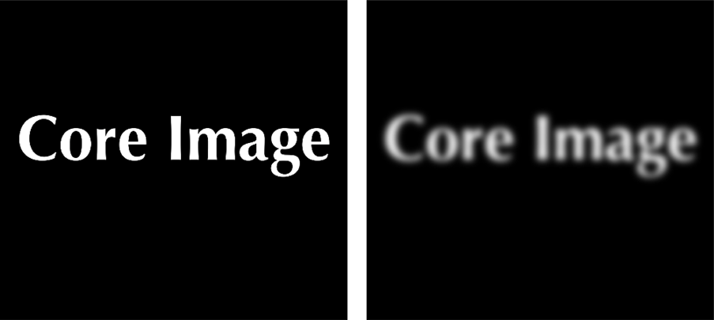

  #### Availability

  Available in OS X v10.4 and later and in iOS 6.0 and later.
- `
  [CIMaskedVariableBlur](#apple-f4xwc4dqnrsv64tfmyxwi33df5tgs3dumvzc6y3jf5bustlbonvwkzcwmfzgsylcnrsue3dvoi)`

  Blurs the source image according to the brightness levels in a mask image.

  #### Localized Display Name

  Masked Variable Blur

  #### Parameters

|  |  |
| --- | --- |
| `inputImage` | A `CIImage` object whose display name is Image. |
| `inputMask` | A `CIImage` object whose display name is Mask. |
| `inputRadius` | An `NSNumber` object whose attribute type is `CIAttributeTypeDistance` and whose display name is Radius.  Default value: 10.00 Minimum: 0.00 Maximum: 0.00 Slider minimum: 0.00 Slider maximum: 100.00 Identity: 0.00 |

  #### Discussion

  Shades of gray in the mask image vary the blur radius from zero (where the mask image is black) to the radius specified in the `inputRadius` parameter (where the mask image is white).

  #### Member Of

  `CICategoryBlur`, `CICategoryVideo`, `CICategoryStillImage`, `CICategoryBuiltIn`

  #### Sample Output

  __Figure 4__The result of using the CIMaskedVariableBlur filter
  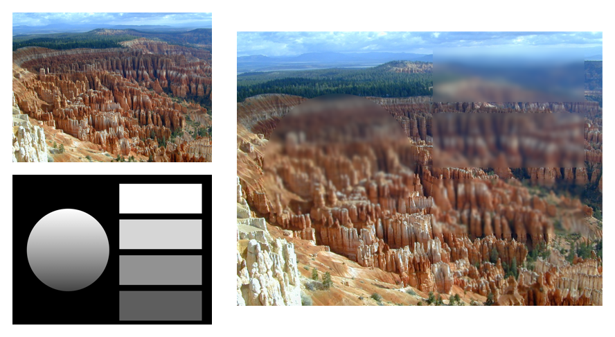

  #### Availability

  Available in OS X v10.10 and later.
- `
  [CIMedianFilter](#apple-f4xwc4dqnrsv64tfmyxwi33df5tgs3dumvzc6y3jf5bustlfmruwc3sgnfwhizls)`

  Computes the median value for a group of neighboring pixels and replaces each pixel value with the median.

  #### Localized Display Name

  Median

  #### Parameters

|  |  |
| --- | --- |
| `inputImage` | A `CIImage` object whose display name is Image. |

  #### Discussion

  The effect is to reduce noise.

  #### Member Of

  `CICategoryBuiltIn`, `CICategoryStillImage`, `CICategoryVideo`, `CICategoryBlur`

  #### Sample Output

  __Figure 5__The result of using the CIMedianFilter filter
  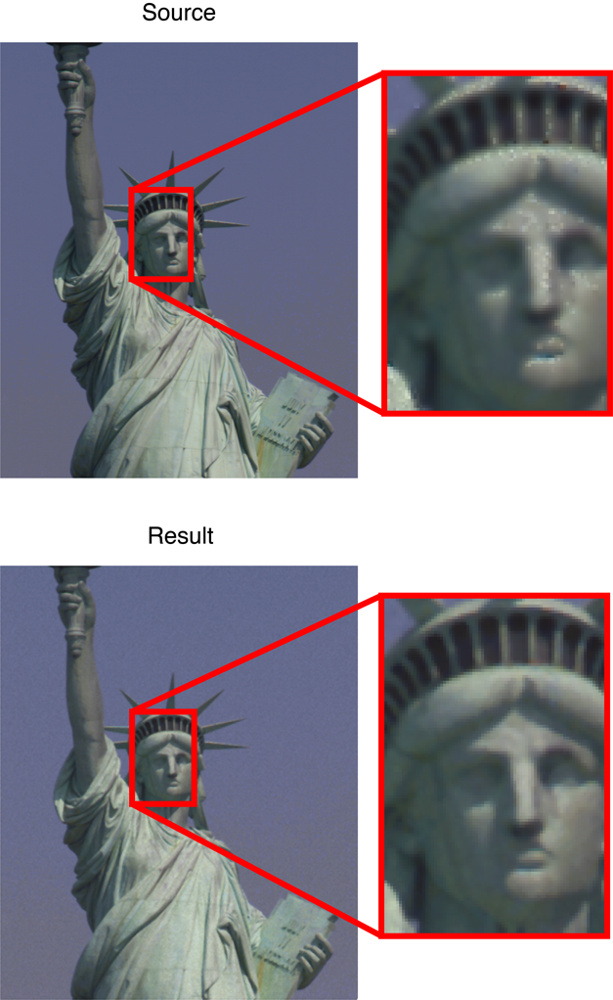

  #### Availability

  Available in OS X v10.4 and later and in iOS 9 and later.
- `
  [CIMotionBlur](#apple-f4xwc4dqnrsv64tfmyxwi33df5tgs3dumvzc6y3jf5bustlporuw63scnr2xe)`

  Blurs an image to simulate the effect of using a camera that moves a specified angle and distance while capturing the image.

  #### Localized Display Name

  Motion Blur

  #### Parameters

|  |  |
| --- | --- |
| `inputImage` | A `CIImage` object whose display name is Image. |
| `inputRadius` | An `NSNumber` object whose attribute type is `CIAttributeTypeDistance` and whose display name is Radius.  Default value: 20.00 |
| `inputAngle` | An `NSNumber` object whose attribute type is `CIAttributeTypeAngle` and whose display name is Angle.  Default value: 0.00 |

  #### Member Of

  `CICategoryBuiltIn`, `CICategoryStillImage`, `CICategoryVideo`, `CICategoryBlur`

  #### Sample Output

  __Figure 6__The result of using the CIMotionBlur filter
  

  #### Availability

  Available in OS X v10.4 and later and in iOS 9 and later.
- `
  [CINoiseReduction](#apple-f4xwc4dqnrsv64tfmyxwi33df5tgs3dumvzc6y3jf5busttpnfzwkutfmr2wg5djn5xa)`

  Reduces noise using a threshold value to define what is considered noise.

  #### Localized Display Name

  Noise Reduction

  #### Parameters

|  |  |
| --- | --- |
| `inputImage` | A `CIImage` object whose display name is Image. |
| `inputNoiseLevel` | An `NSNumber` object whose attribute type is `CIAttributeTypeScalar` and whose display name is Noise Level.  Default value: 0.02 |
| `inputSharpness` | An `NSNumber` object whose attribute type is `CIAttributeTypeScalar` and whose display name is Sharpness.  Default value: 0.40 |

  #### Discussion

  Small changes in luminance below that value are considered noise and get a noise reduction treatment, which is a local blur. Changes above the threshold value are considered edges, so they are sharpened.

  #### Member Of

  `CICategoryBuiltIn`, `CICategoryStillImage`, `CICategoryVideo`, `CICategoryBlur`

  #### Sample Output

  __Figure 7__The result of using the CINoiseReduction filter
  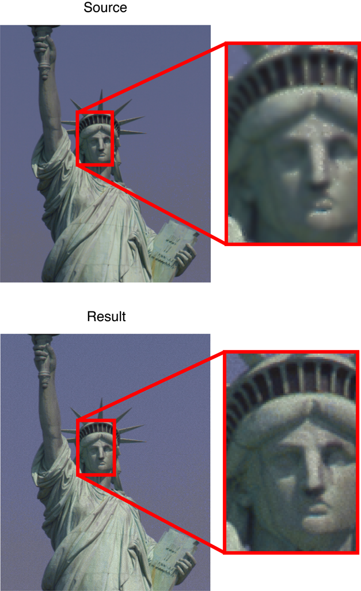

  #### Availability

  Available in OS X v10.4 and later and in iOS 9 and later.
- `
  [CIZoomBlur](#apple-f4xwc4dqnrsv64tfmyxwi33df5tgs3dumvzc6y3jf5buswtpn5wue3dvoi)`

  Simulates the effect of zooming the camera while capturing the image.

  #### Localized Display Name

  Zoom Blur

  #### Parameters

|  |  |
| --- | --- |
| `inputImage` | A `CIImage` object whose display name is Image. |
| `inputCenter` | A `CIVector` object whose attribute type is `CIAttributeTypePosition` and whose display name is Center.  Default value: [150 150] |
| `inputAmount` | An `NSNumber` object whose attribute type is `CIAttributeTypeDistance` and whose display name is Amount.  Default value: 20.00 |

  #### Member Of

  `CICategoryBuiltIn`, `CICategoryStillImage`, `CICategoryVideo`, `CICategoryBlur`

  #### Sample Output

  __Figure 8__The result of using the CIZoomBlur filter
  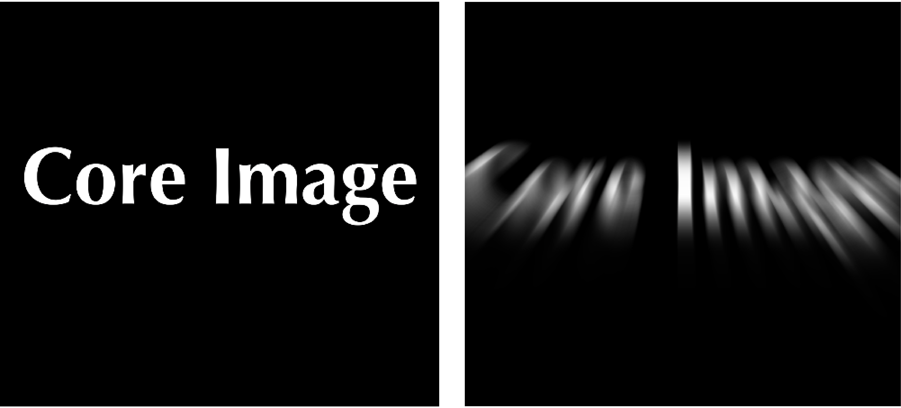

  #### Availability

  Available in OS X v10.4 and later and in iOS 9 and later.

[### CICategoryColorAdjustment](#apple-f4xwc4dqnrsv64tfmyxwi33df52wszbpkridgmbqgaydcmzwfvjvonbs)

- `
  [CIColorClamp](#apple-f4xwc4dqnrsv64tfmyxwi33df5tgs3dumvzc6y3jf5busq3pnrxxeq3mmfwxa)`

  Modifies color values to keep them within a specified range.

  #### Localized Display Name

  Color Clamp

  #### Parameters

|  |  |
| --- | --- |
| `inputImage` | A `CIImage` object whose display name is Image. |
| `inputMinComponents` | RGBA values for the lower end of the range. A `CIVector` object whose attribute type is `CIAttributeTypeRectangle` and whose display name is MinComponents.  Default value: [0 0 0 0] Identity: [0 0 0 0] |
| `inputMaxComponents` | RGBA values for the upper end of the range. A `CIVector` object whose attribute type is `CIAttributeTypeRectangle` and whose display name is MaxComponents.  Default value: [1 1 1 1] Identity: [1 1 1 1] |

  #### Discussion

  At each pixel, color component values less than those in `inputMinComponents` will be increased to match those in `inputMinComponents`, and color component values greater than those in `inputMaxComponents` will be decreased to match those in `inputMaxComponents`.

  #### Member Of

  `CICategoryBuiltIn`, `CICategoryNonSquarePixels`, `CICategoryInterlaced`, `CICategoryStillImage`, `CICategoryVideo`, `CICategoryColorAdjustment`

  #### Sample Output

  __Figure 9__The result of using the CIColorClamp filter
  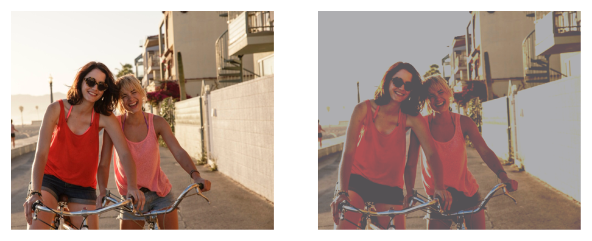

  #### Availability

  Available in OS X v10.9 and later and in iOS 7.0 and later.
- `
  [CIColorControls](#apple-f4xwc4dqnrsv64tfmyxwi33df5tgs3dumvzc6y3jf5busq3pnrxxeq3pnz2he33mom)`

  Adjusts saturation, brightness, and contrast values.

  #### Localized Display Name

  Color Controls

  #### Parameters

|  |  |
| --- | --- |
| `inputImage` | A `CIImage` object whose display name is Image. |
| `inputSaturation` | An `NSNumber` object whose attribute type is `CIAttributeTypeScalar` and whose display name is Saturation.  Default value: 1.00 |
| `inputBrightness` | An `NSNumber` object whose attribute type is `CIAttributeTypeScalar` and whose display name is Brightness. |
| `inputContrast` | An `NSNumber` object whose attribute type is `CIAttributeTypeScalar` and whose display name is Contrast.  Default value: 1.00 |

  #### Discussion

  To calculate saturation, this filter linearly interpolates between a grayscale image (saturation = `0.0`) and the original image (saturation = `1.0`). The filter supports extrapolation: For values large than `1.0`, it increases saturation.

  To calculate contrast, this filter uses the following formula:

  `(color.rgb - vec3(0.5)) * contrast + vec3(0.5)`

  This filter calculates brightness by adding a bias value:

  `color.rgb + vec3(brightness)`

  #### Member Of

  `CICategoryBuiltIn`, `CICategoryNonSquarePixels`, `CICategoryInterlaced`, `CICategoryStillImage`, `CICategoryVideo`, `CICategoryColorAdjustment`

  #### Sample Output

  __Figure 10__The result of using the CIColorControls filter
  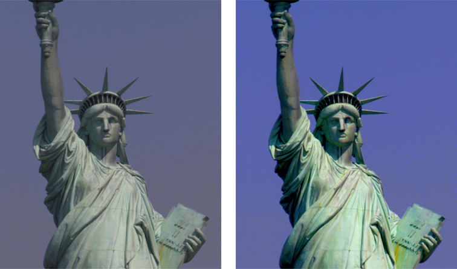

  #### Availability

  Available in OS X v10.4 and later and in iOS 5.0 and later.
- `
  [CIColorMatrix](#apple-f4xwc4dqnrsv64tfmyxwi33df5tgs3dumvzc6y3jf5busq3pnrxxetlborzgs6a)`

  Multiplies source color values and adds a bias factor to each color component.

  #### Localized Display Name

  Color Matrix

  #### Parameters

|  |  |
| --- | --- |
| `inputImage` | A `CIImage` object whose display name is Image. |
| `inputRVector` | A `CIVector` object whose display name is Red Vector.  Default value: [1 0 0 0] |
| `inputGVector` | A `CIVector` object whose display name is Green Vector.  Default value: [0 1 0 0] |
| `inputBVector` | A `CIVector` object whose display name is Blue Vector.  Default value: [0 0 1 0] |
| `inputAVector` | A `CIVector` object whose display name is Alpha Vector.  Default value: [0 0 0 1] |
| `inputBiasVector` | A `CIVector` object whose display name is Bias Vector.  Default value: [0 0 0 0] |

  #### Discussion

  This filter performs a matrix multiplication, as follows, to transform the color vector:

  1. `s.r = dot(s, redVector)`
  2. `s.g = dot(s, greenVector)`
  3. `s.b = dot(s, blueVector)`
  4. `s.a = dot(s, alphaVector)`
  5. `s = s + bias`

  > [!NOTE]
  > 

  #### Member Of

  `CICategoryBuiltIn`, `CICategoryNonSquarePixels`, `CICategoryInterlaced`, `CICategoryStillImage`, `CICategoryVideo`, `CICategoryColorAdjustment`

  #### Sample Output

  __Figure 11__The result of using the CIColorMatrix filter
  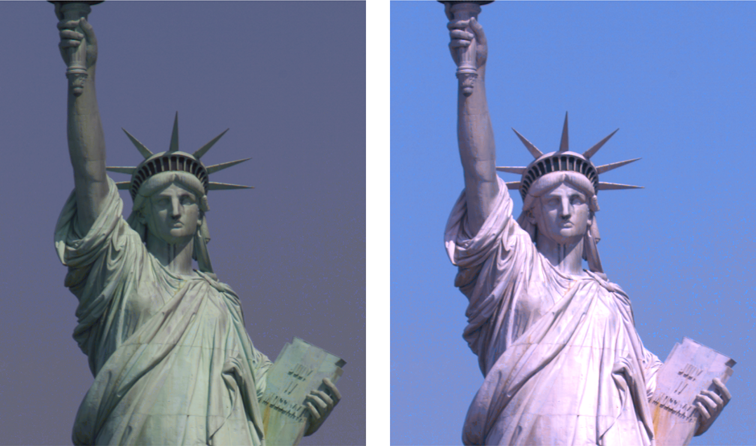

  #### Availability

  Available in OS X v10.4 and later and in iOS 5.0 and later.
- `
  [CIColorPolynomial](#apple-f4xwc4dqnrsv64tfmyxwi33df5tgs3dumvzc6y3jf5busq3pnrxxeudpnr4w433nnfqwy)`

  Modifies the pixel values in an image by applying a set of cubic polynomials.

  #### Localized Display Name

  Color Polynomial

  #### Parameters

|  |  |
| --- | --- |
| `inputImage` | A `CIImage` object whose display name is Image. |
| `inputRedCoefficients` | A `CIVector` object whose attribute type is `CIAttributeTypeRectangle` and whose display name is RedCoefficients.  Default value: [0 1 0 0] Identity: [0 1 0 0] |
| `inputGreenCoefficients` | A `CIVector` object whose attribute type is `CIAttributeTypeRectangle` and whose display name is GreenCoefficients.  Default value: [0 1 0 0] Identity: [0 1 0 0] |
| `inputBlueCoefficients` | A `CIVector` object whose attribute type is `CIAttributeTypeRectangle` and whose display name is BlueCoefficients.  Default value: [0 1 0 0] Identity: [0 1 0 0] |
| `inputAlphaCoefficients` | A `CIVector` object whose attribute type is `CIAttributeTypeRectangle` and whose display name is AlphaCoefficients.  Default value: [0 1 0 0] Identity: [0 1 0 0] |

  #### Discussion

  For each pixel, the value of each color component is treated as the input to a cubic polynomial, whose coefficients are taken from the corresponding input coefficients parameter in ascending order. Equivalent to the following formula:

  1. `r = rCoeff[0] + rCoeff[1] * r + rCoeff[2] * r*r + rCoeff[3] * r*r*r`
  2. `g = gCoeff[0] + gCoeff[1] * g + gCoeff[2] * g*g + gCoeff[3] * g*g*g`
  3. `b = bCoeff[0] + bCoeff[1] * b + bCoeff[2] * b*b + bCoeff[3] * b*b*b`
  4. `a = aCoeff[0] + aCoeff[1] * a + aCoeff[2] * a*a + aCoeff[3] * a*a*a`

  > [!NOTE]
  > 

  #### Member Of

  `CICategoryBuiltIn`, `CICategoryNonSquarePixels`, `CICategoryInterlaced`, `CICategoryStillImage`, `CICategoryVideo`, `CICategoryColorAdjustment`

  #### Sample Output

  __Figure 12__The result of using the CIColorPolynomial filter
  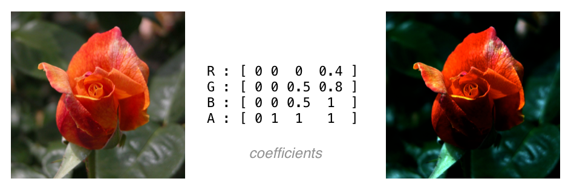

  #### Availability

  Available in OS X v10.9 and later and in iOS 7.0 and later.
- `
  [CIExposureAdjust](#apple-f4xwc4dqnrsv64tfmyxwi33df5tgs3dumvzc6y3jf5busrlyobxxg5lsmvawi2tvon2a)`

  Adjusts the exposure setting for an image similar to the way you control exposure for a camera when you change the F-stop.

  #### Localized Display Name

  Exposure Adjust

  #### Parameters

|  |  |
| --- | --- |
| `inputImage` | A `CIImage` object whose display name is Image. |
| `inputEV` | An `NSNumber` object whose attribute type is `CIAttributeTypeScalar` and whose display name is EV.  Default value: 0.50 |

  #### Discussion

  This filter multiplies the color values, as follows, to simulate exposure change by the specified F-stops:

  `s.rgb * pow(2.0, ev)`

  #### Member Of

  `CICategoryBuiltIn`, `CICategoryNonSquarePixels`, `CICategoryInterlaced`, `CICategoryStillImage`, `CICategoryVideo`, `CICategoryColorAdjustment`

  #### Sample Output

  __Figure 13__The result of using the CIExposureAdjust filter
  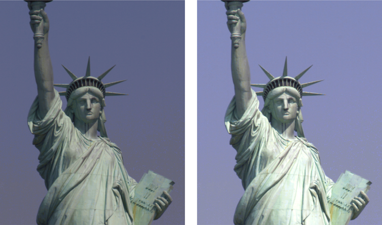

  #### Availability

  Available in OS X v10.4 and later and in iOS 5.0 and later.
- `
  [CIGammaAdjust](#apple-f4xwc4dqnrsv64tfmyxwi33df5tgs3dumvzc6y3jf5busr3bnvwwcqlenj2xg5a)`

  Adjusts midtone brightness.

  #### Localized Display Name

  Gamma Adjust

  #### Parameters

|  |  |
| --- | --- |
| `inputImage` | A `CIImage` object whose display name is Image. |
| `inputPower` | An `NSNumber` object whose attribute type is `CIAttributeTypeScalar` and whose display name is Power.  Default value: 0.75 |

  #### Discussion

  This filter is typically used to compensate for nonlinear effects of displays. Adjusting the gamma effectively changes the slope of the transition between black and white. It uses the following formula:

  `pow(s.rgb, vec3(power))`

  > [!NOTE]
  > 

  #### Member Of

  `CICategoryBuiltIn`, `CICategoryNonSquarePixels`, `CICategoryInterlaced`, `CICategoryStillImage`, `CICategoryVideo`, `CICategoryColorAdjustment`

  #### Sample Output

  __Figure 14__The result of using the CIGammaAdjust filter
  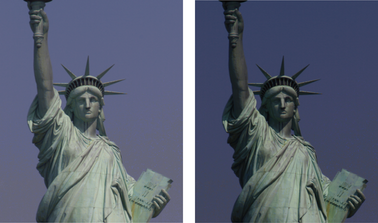

  #### Availability

  Available in OS X v10.4 and later and in iOS 5.0 and later.
- `
  [CIHueAdjust](#apple-f4xwc4dqnrsv64tfmyxwi33df5tgs3dumvzc6y3jf5bussdvmvawi2tvon2a)`

  Changes the overall hue, or tint, of the source pixels.

  #### Localized Display Name

  Hue Adjust

  #### Parameters

|  |  |
| --- | --- |
| `inputImage` | A `CIImage` object whose display name is Image. |
| `inputAngle` | An `NSNumber` object whose attribute type is `CIAttributeTypeAngle` and whose display name is Angle.  Default value: 0.00 |

  #### Discussion

  This filter essentially rotates the color cube around the neutral axis.

  #### Member Of

  `CICategoryBuiltIn`, `CICategoryNonSquarePixels`, `CICategoryInterlaced`, `CICategoryStillImage`, `CICategoryVideo`, `CICategoryColorAdjustment`

  #### Sample Output

  __Figure 15__The result of using the CIHueAdjust filter
  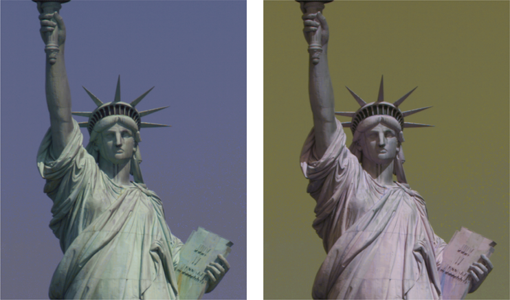

  #### Availability

  Available in OS X v10.4 and later and in iOS 5.0 and later.
- `
  [CILinearToSRGBToneCurve](#apple-f4xwc4dqnrsv64tfmyxwi33df5tgs3dumvzc6y3jf5bustdjnzswc4sun5jver2ckrxw4zkdovzhmzi)`

  Maps color intensity from a linear gamma curve to the sRGB color space.

  #### Localized Display Name

  Linear to sRGB Tone Curve

  #### Parameters

|  |  |
| --- | --- |
| `inputImage` | A `CIImage` object whose attribute type is `CIAttributeTypeImage` and whose display name is Image. |

  #### Member Of

  `CICategoryBuiltIn`, `CICategoryNonSquarePixels`, `CICategoryInterlaced`, `CICategoryStillImage`, `CICategoryVideo`, `CICategoryColorAdjustment`

  #### Sample Output

  __Figure 16__The result of using the CILinearToSRGBToneCurve filter
  

  #### Availability

  Available in OS X v10.10 and later and in iOS 7.0 and later.
- `
  [CISRGBToneCurveToLinear](#apple-f4xwc4dqnrsv64tfmyxwi33df5tgs3dumvzc6y3jf5busu2si5bfi33omvbxk4twmvkg6tdjnzswc4q)`

  Maps color intensity from the sRGB color space to a linear gamma curve.

  #### Localized Display Name

  sRGB Tone Curve to Linear

  #### Parameters

|  |  |
| --- | --- |
| `inputImage` | A `CIImage` object whose attribute type is `CIAttributeTypeImage` and whose display name is Image. |

  #### Member Of

  `CICategoryBuiltIn`, `CICategoryNonSquarePixels`, `CICategoryInterlaced`, `CICategoryStillImage`, `CICategoryVideo`, `CICategoryColorAdjustment`

  #### Sample Output

  __Figure 17__The result of using the CISRGBToneCurveToLinear filter
  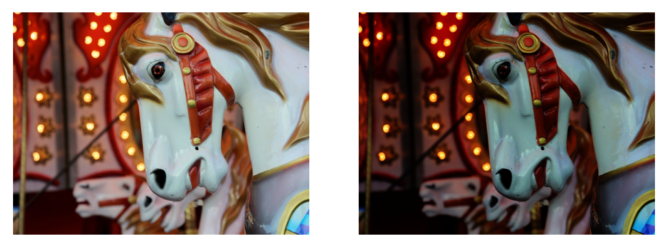

  #### Availability

  Available in OS X v10.10 and later and in iOS 7.0 and later.
- `
  [CITemperatureAndTint](#apple-f4xwc4dqnrsv64tfmyxwi33df5tgs3dumvzc6y3jf5busvdfnvygk4tbor2xezkbnzsfi2looq)`

  Adapts the reference white point for an image.

  #### Localized Display Name

  Temperature and Tint

  #### Parameters

|  |  |
| --- | --- |
| `inputImage` | A `CIImage` object whose display name is Image. |
| `inputNeutral` | A `CIVector` object whose attribute type is `CIAttributeTypeOffset` and whose display name is Neutral.  Default value: [6500, 0] |
| `inputTargetNeutral` | A `CIVector` object whose attribute type is `CIAttributeTypeOffset` and whose display name is TargetNeutral  Default value: [6500, 0] |

  #### Member Of

  `CICategoryBuiltIn`, `CICategoryNonSquarePixels`, `CICategoryInterlaced`, `CICategoryStillImage`, `CICategoryVideo`, `CICategoryColorAdjustment`

  #### Sample Output

  __Figure 18__The result of using the CITemperatureAndTint filter
  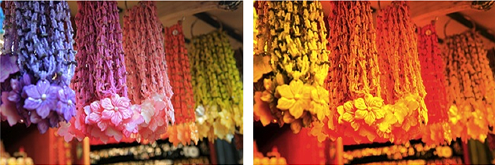

  #### Availability

  Available in OS X v10.7 and later and in iOS 5.0 and later.
- `
  [CIToneCurve](#apple-f4xwc4dqnrsv64tfmyxwi33df5tgs3dumvzc6y3jf5busvdpnzsug5lsozsq)`

  Adjusts tone response of the R, G, and B channels of an image.

  #### Localized Display Name

  Tone Curve

  #### Parameters

|  |  |
| --- | --- |
| `inputImage` | A `CIImage` object whose display name is Image. |
| `inputPoint0` | A `CIVector` object whose attribute type is `CIAttributeTypeOffset`.  Default value: [0, 0] |
| `inputPoint1` | A `CIVector` object whose attribute type is `CIAttributeTypeOffset`.  Default value: [0.25, 0.25] |
| `inputPoint2` | A `CIVector` object whose attribute type is `CIAttributeTypeOffset`.  Default value: [0.5, 0.5] |
| `inputPoint3` | A `CIVector` object whose attribute type is `CIAttributeTypeOffset`.  Default value: [0.75, 0.75] |
| `inputPoint4` | A `CIVector` object whose attribute type is `CIAttributeTypeOffset`.  Default value: [1, 1] |

  #### Discussion

  The input points are five x,y values that are interpolated using a spline curve. The curve is applied in a perceptual (gamma 2) version of the working space.

  #### Member Of

  `CICategoryBuiltIn`, `CICategoryNonSquarePixels`, `CICategoryInterlaced`, `CICategoryStillImage`, `CICategoryVideo`, `CICategoryColorAdjustment`

  #### Sample Output

  __Figure 19__The result of using the CIToneCurve filter
  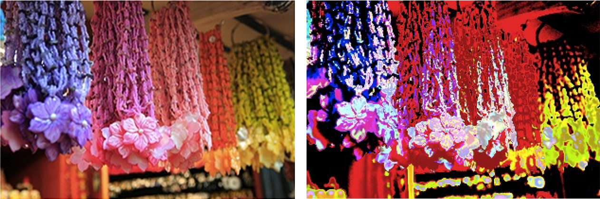

  #### Availability

  Available in OS X v10.7 and later and in iOS 5.0 and later.
- `
  [CIVibrance](#apple-f4xwc4dqnrsv64tfmyxwi33df5tgs3dumvzc6y3jf5busvtjmjzgc3tdmu)`

  Adjusts the saturation of an image while keeping pleasing skin tones.

  #### Localized Display Name

  Vibrance

  #### Parameters

|  |  |
| --- | --- |
| `inputImage` | A `CIImage` object whose display name is Image. |
| `inputAmount` | An `NSNumber` object whose attribute type is `CIAttributeTypeScalar` and whose display name is Amount. |

  #### Member Of

  `CICategoryBuiltIn`, `CICategoryNonSquarePixels`, `CICategoryInterlaced`, `CICategoryStillImage`, `CICategoryVideo`, `CICategoryColorAdjustment`

  #### Sample Output

  __Figure 20__The result of using the CIVibrance filter
  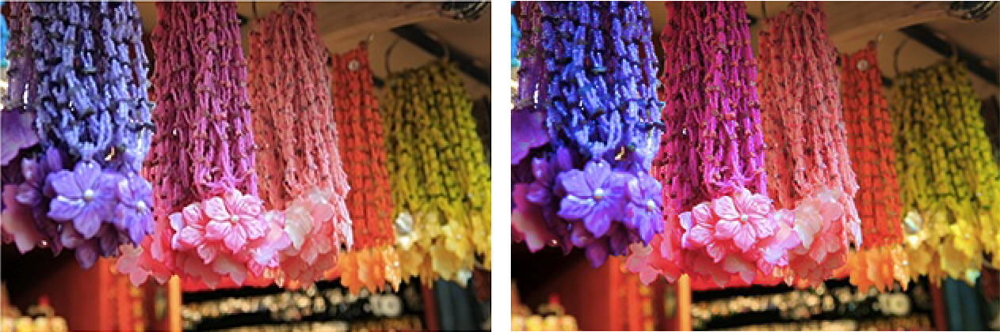

  #### Availability

  Available in OS X v10.7 and later and in iOS 5.0 and later.
- `
  [CIWhitePointAdjust](#apple-f4xwc4dqnrsv64tfmyxwi33df5tgs3dumvzc6y3jf5busv3inf2gkudpnfxhiqlenj2xg5a)`

  Adjusts the reference white point for an image and maps all colors in the source using the new reference.

  #### Localized Display Name

  White Point Adjust

  #### Parameters

|  |  |
| --- | --- |
| `inputImage` | A `CIImage` object whose display name is Image. |
| `inputColor` | A `CIColor` object whose display name is Color. |

  #### Member Of

  `CICategoryBuiltIn`, `CICategoryNonSquarePixels`, `CICategoryInterlaced`, `CICategoryStillImage`, `CICategoryVideo`, `CICategoryColorAdjustment`

  #### Sample Output

  __Figure 21__The result of using the CIWhitePointAdjust filter
  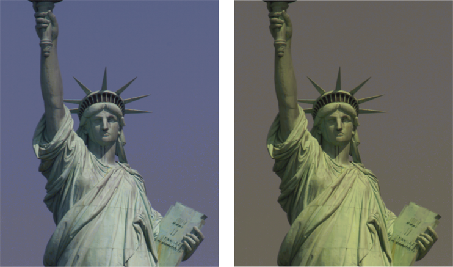

  #### Availability

  Available in OS X v10.4 and later and in iOS 5.0 and later.

[### CICategoryColorEffect](#apple-f4xwc4dqnrsv64tfmyxwi33df52wszbpkridgmbqgaydcmzwfvjvonjv)

- `
  [CIColorCrossPolynomial](#apple-f4xwc4dqnrsv64tfmyxwi33df5tgs3dumvzc6y3jf5busq3pnrxxeq3sn5zxgudpnr4w433nnfqwy)`

  Modifies the pixel values in an image by applying a set of polynomial cross-products.

  #### Localized Display Name

  Color Cross Polynomial

  #### Parameters

|  |  |
| --- | --- |
| `inputImage` | A `CIImage` object whose display name is Image. |
| `inputRedCoefficients` | A `CIVector` object whose display name is RedCoefficients.  Default value: [1 0 0 0 0 0 0 0 0 0] Identity: [1 0 0 0 0 0 0 0 0 0] |
| `inputGreenCoefficients` | A `CIVector` object whose display name is GreenCoefficients.  Default value: [0 1 0 0 0 0 0 0 0 0] Identity: [0 1 0 0 0 0 0 0 0 0] |
| `inputBlueCoefficients` | A `CIVector` object whose display name is BlueCoefficients.  Default value: [0 0 1 0 0 0 0 0 0 0] Identity: [0 0 1 0 0 0 0 0 0 0] |

  #### Discussion

  Each component in an output pixel `out` is determined using the component values in the input pixel `in` according to a polynomial cross product with the input coefficients. That is, the red component of the output pixel is calculated using the `inputRedCoefficients` parameter (abbreviated `rC` below) using the following formula:

  1. `out.r = in.r * rC[0] + in.g * rC[1] + in.b * rC[2]`
  2. `+ in.r * in.r * rC[3] + in.g * in.g * rC[4] + in.b * in.b * rC[5]`
  3. `+ in.r * in.g * rC[6] + in.g * in.b * rC[7] + in.b * in.r * rC[8]`
  4. `+ rC[9]`

  Then, the formula is repeated to calculate the blue and green components of the output pixel using the blue and green coefficients, respectively.

  This filter can be used for advanced color space and tone mapping conversions, such as imitating the color reproduction of vintage photography film.

  > [!NOTE]
  > 

  #### Member Of

  `CICategoryBuiltIn`, `CICategoryStillImage`, `CICategoryNonSquarePixels`, `CICategoryInterlaced`, `CICategoryVideo`, `CICategoryColorEffect`

  #### Sample Output

  __Figure 22__The result of using the CIColorCrossPolynomial filter
  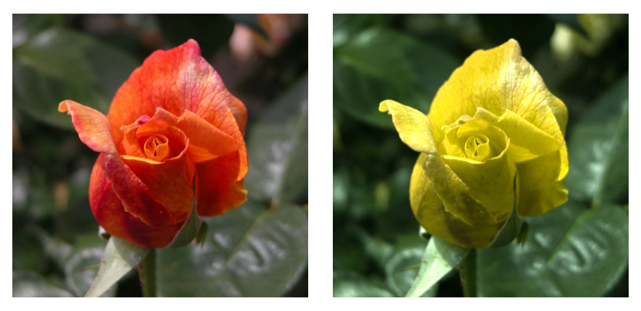

  #### Availability

  Available in OS X v10.9 and later and in iOS 7.0 and later.
- `
  [CIColorCube](#apple-f4xwc4dqnrsv64tfmyxwi33df5tgs3dumvzc6y3jf5busq3pnrxxeq3vmjsq)`

  Uses a three-dimensional color table to transform the source image pixels.

  #### Localized Display Name

  Color Cube

  #### Parameters

|  |  |
| --- | --- |
| `inputImage` | The image to be transformed. (A `CIImage` object whose display name is Image.) |
| `inputCubeDimension` | The length, in texels, of each side of the cube texture. (An `NSNumber` object whose attribute type is `CIAttributeTypeCount` and whose display name is Cube Dimension.)  Default value: 2.00 |
| `inputCubeData` | The cube texture data to use as a color lookup table. (An `NSData` object whose display name is Cube Data.) |

  #### Discussion

  This filter maps color values in the input image to new color values using a three-dimensional color lookup table (also called a CLUT or color cube). For each RGBA pixel in the input image, the filter uses the R, G, and B component values as indices to identify a location in the table; the RGBA value at that location becomes the RGBA value of the output pixel.

  Use the `inputCubeData` parameter to provide data formatted for use as a color lookup table, and the `inputCubeDimension` parameter to specify the size of the table. This data should be an array of texel values in 32-bit floating-point RGBA linear premultiplied format. The `inputCubeDimension` parameter identifies the size of the cube by specifying the length of one side, so the size of the array should be `inputCubeDimension` cubed times the size of a single texel value. In the color table, the R component varies fastest, followed by G, then B. Listing 1 shows a basic pattern for creating color cube data.

  __Listing 1__Creating a Color Table for the CIColorCube Filter
  1. `// Allocate and opulate color cube table`
  2. `const unsigned int size = 64;`
  3. `float *cubeData = (float *)malloc(size * size * size * sizeof(float) * 4);`
  4. `for (int b = 0; b < size; b++) {`
  5. `for (int g = 0; g < size; r++) {`
  6. `for (int r = 0; r < size; r ++) {`
  7. `cubeData[b][g][r][0] = <# output R value #>;`
  8. `cubeData[b][g][r][1] = <# output G value #>;`
  9. `cubeData[b][g][r][2] = <# output B value #>;`
  10. `cubeData[b][g][r][3] = <# output A value #>;`
  11. `}`
  12. `}`
  13. `}`
  14. `// Put the table in a data object and create the filter`
  15. `NSData *data = [NSData dataWithBytesNoCopy:cubeData`
  16. `length:cubeDataSize`
  17. `freeWhenDone:YES];`
  18. `CIFilter *colorCube = [CIFilter filterWithName:@"CIColorCube"`
  19. `withInputParameters:@{`
  20. `@"inputCubeDimension": @(size),`
  21. `@"inputCubeData": data,`
  22. `}];`

  For another example of this filter in action, see [Chroma Key Filter Recipe](../Core%20Image%20Programming%20Guide/Subclassing%20CIFilter-%20Recipes%20for%20Custom%20Effects.md#apple-f4xwc4dqnrsv64tfmyxwi33df52wszbpkridgmbqgaytcobvfvbuqnbnknlte) in _[Core Image Programming Guide](../Core%20Image%20Programming%20Guide/About%20Core%20Image.md#apple-f4xwc4dqnrsv64tfmyxwi33df52wszbpkridgmbqgaytcobv)_.

  > [!NOTE]
  > 

  #### Member Of

  `CICategoryBuiltIn`, `CICategoryStillImage`, `CICategoryNonSquarePixels`, `CICategoryInterlaced`, `CICategoryVideo`, `CICategoryColorEffect`

  #### Sample Output

  __Figure 23__The result of using the CIColorCube filter
  

  #### Availability

  Available in OS X v10.4 and later and in iOS 6.0 and later.
- `
  [CIColorCubeWithColorSpace](#apple-f4xwc4dqnrsv64tfmyxwi33df5tgs3dumvzc6y3jf5busq3pnrxxeq3vmjsvo2lunbbw63dpojjxayldmu)`

  Uses a three-dimensional color table to transform the source image pixels and maps the result to a specified color space.

  #### Localized Display Name

  Color Cube with ColorSpace

  #### Parameters

|  |  |
| --- | --- |
| `inputImage` | A `CIImage` object whose display name is Image. |
| `inputCubeDimension` | An `NSNumber` object whose attribute type is `CIAttributeTypeCount` and whose display name is Cube Dimension.  Default value: 2.00 Minimum: 2.00 Maximum: 128.00 Identity: 2.00 |
| `inputCubeData` | An `NSData` object whose display name is Cube Data. |
| `inputColorSpace` | An `CGColorSpaceRef` object whose display name is ColorSpace. |

  #### Discussion

  See `[CIColorCube](#apple-f4xwc4dqnrsv64tfmyxwi33df5tgs3dumvzc6y3jf5busq3pnrxxeq3vmjsq)` for more details on the color cube operation. To provide a [CGColorSpaceRef](https://developer.apple.com/documentation/coregraphics/cgcolorspaceref) object as the input parameter, cast it to type `id`. With the default color space (null), which is equivalent to `kCGColorSpaceGenericRGBLinear`, this filter’s effect is identical to that of `CIColorCube`.

  Figure 24 uses the same color cube as [Figure 23](#apple-f4xwc4dqnrsv64tfmyxwi33df52wszbpkridgmbqgaydcmzwfvjvonjw), but with the sRGB color space.

  #### Member Of

  `CICategoryBuiltIn`, `CICategoryStillImage`, `CICategoryNonSquarePixels`, `CICategoryInterlaced`, `CICategoryVideo`, `CICategoryColorEffect`

  #### Sample Output

  __Figure 24__The result of using the CIColorCubeWithColorSpace filter
  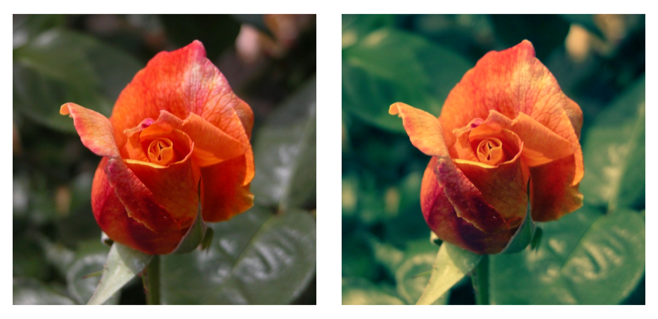

  #### Availability

  Available in OS X v10.9 and later and in iOS 7.0 and later.
- `
  [CIColorInvert](#apple-f4xwc4dqnrsv64tfmyxwi33df5tgs3dumvzc6y3jf5busq3pnrxxesloozsxe5a)`

  Inverts the colors in an image.

  #### Localized Display Name

  Color Invert

  #### Parameters

|  |  |
| --- | --- |
| `inputImage` | A `CIImage` object whose display name is Image. |

  #### Member Of

  `CICategoryBuiltIn`, `CICategoryStillImage`, `CICategoryNonSquarePixels`, `CICategoryInterlaced`, `CICategoryVideo`, `CICategoryColorEffect`

  #### Sample Output

  __Figure 25__The result of using the CIColorInvert filter
  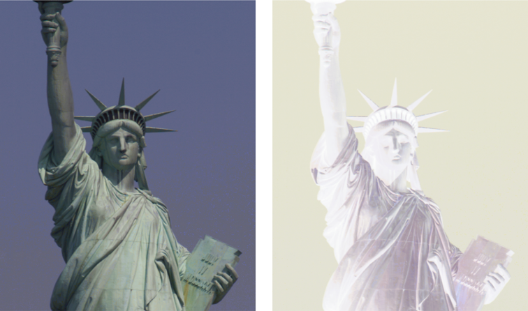

  #### Availability

  Available in OS X v10.4 and later and in iOS 6.0 and later.
- `
  [CIColorMap](#apple-f4xwc4dqnrsv64tfmyxwi33df5tgs3dumvzc6y3jf5busq3pnrxxetlboa)`

  Performs a nonlinear transformation of source color values using mapping values provided in a table.

  #### Localized Display Name

  Color Map

  #### Parameters

|  |  |
| --- | --- |
| `inputImage` | A `CIImage` object whose display name is Image. |
| `inputGradientImage` | A `CIImage` object whose attribute type is `CIAttributeTypeGradient` and whose display name is Gradient Image. |

  #### Member Of

  `CICategoryBuiltIn`, `CICategoryStillImage`, `CICategoryNonSquarePixels`, `CICategoryInterlaced`, `CICategoryVideo`, `CICategoryColorEffect`

  #### Sample Output

  __Figure 26__The result of using the CIColorMap filter
  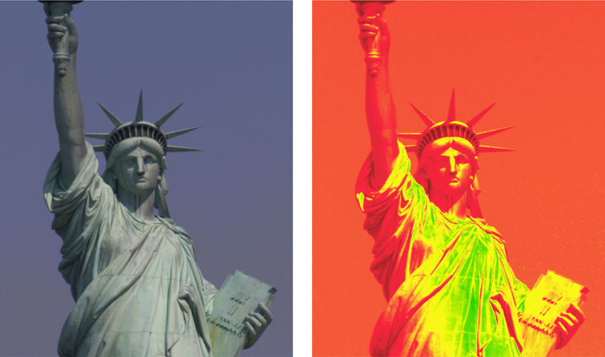

  #### Availability

  Available in OS X v10.4 and later and in iOS 6.0 and later.
- `
  [CIColorMonochrome](#apple-f4xwc4dqnrsv64tfmyxwi33df5tgs3dumvzc6y3jf5busq3pnrxxetlpnzxwg2dsn5wwk)`

  Remaps colors so they fall within shades of a single color.

  #### Localized Display Name

  Color Monochrome

  #### Parameters

|  |  |
| --- | --- |
| `inputImage` | A `CIImage` object whose display name is Image. |
| `inputColor` | A `CIColor` object whose attribute type is `CIAttributeTypeOpaqueColor` and whose display name is Color. |
| `inputIntensity` | An `NSNumber` object whose attribute type is `CIAttributeTypeScalar` and whose display name is Intensity.  Default value: 1.00 |

  #### Member Of

  `CICategoryBuiltIn`, `CICategoryStillImage`, `CICategoryNonSquarePixels`, `CICategoryInterlaced`, `CICategoryVideo`, `CICategoryColorEffect`

  #### Sample Output

  __Figure 27__The result of using the CIColorMonochrome filter
  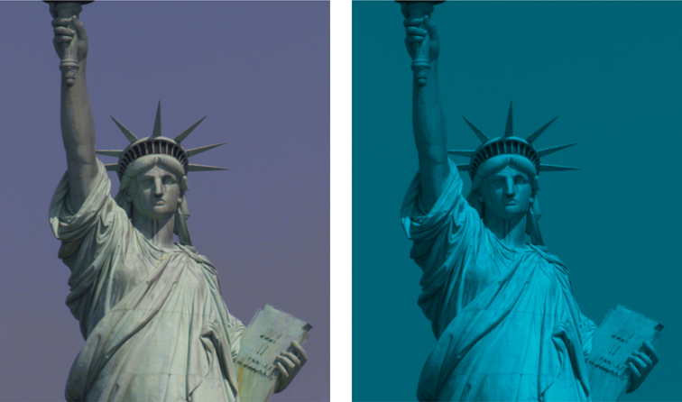

  #### Availability

  Available in OS X v10.4 and later and in iOS 6.0 and later.
- `
  [CIColorPosterize](#apple-f4xwc4dqnrsv64tfmyxwi33df5tgs3dumvzc6y3jf5busq3pnrxxeudpon2gk4tjpjsq)`

  Remaps red, green, and blue color components to the number of brightness values you specify for each color component.

  #### Localized Display Name

  Color Posterize

  #### Parameters

|  |  |
| --- | --- |
| `inputImage` | A `CIImage` object whose display name is Image. |
| `inputLevels` | An `NSNumber` object whose attribute type is `CIAttributeTypeScalar` and whose display name is Levels.  Default value: 6.00 |

  #### Discussion

  This filter flattens colors to achieve a look similar to that of a silk-screened poster.

  #### Member Of

  `CICategoryBuiltIn`, `CICategoryStillImage`, `CICategoryNonSquarePixels`, `CICategoryInterlaced`, `CICategoryVideo`, `CICategoryColorEffect`

  #### Sample Output

  __Figure 28__The result of using the CIColorPosterize filter
  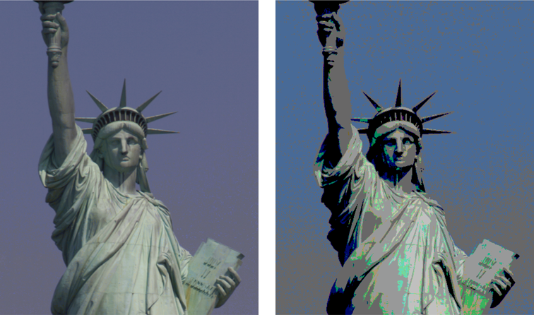

  #### Availability

  Available in OS X v10.4 and later and in iOS 6.0 and later.
- `
  [CIFalseColor](#apple-f4xwc4dqnrsv64tfmyxwi33df5tgs3dumvzc6y3jf5busrtbnrzwkq3pnrxxe)`

  Maps luminance to a color ramp of two colors.

  #### Localized Display Name

  False Color

  #### Parameters

|  |  |
| --- | --- |
| `inputImage` | A `CIImage` object whose display name is Image. |
| `inputColor0` | A `CIColor` object whose display name is Color 1. |
| `inputColor1` | A `CIColor` object whose display name is Color 2. |

  #### Discussion

  False color is often used to process astronomical and other scientific data, such as ultraviolet and x-ray images.

  #### Member Of

  `CICategoryBuiltIn`, `CICategoryStillImage`, `CICategoryNonSquarePixels`, `CICategoryInterlaced`, `CICategoryVideo`, `CICategoryColorEffect`

  #### Sample Output

  __Figure 29__The result of using the CIFalseColor filter
  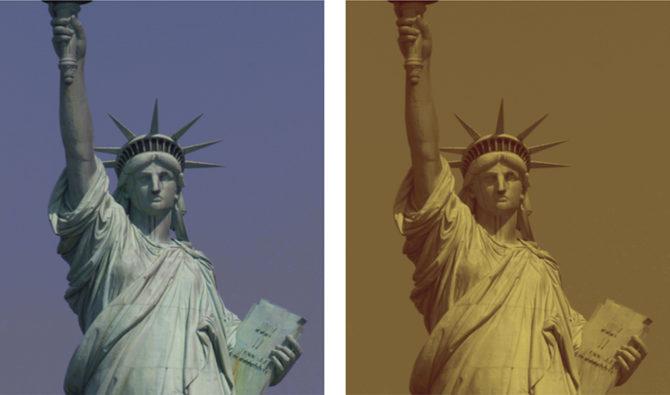

  #### Availability

  Available in OS X v10.4 and later and in iOS 6.0 and later.
- `
  [CIMaskToAlpha](#apple-f4xwc4dqnrsv64tfmyxwi33df5tgs3dumvzc6y3jf5bustlbonvvi32bnrygqyi)`

  Converts a grayscale image to a white image that is masked by alpha.

  #### Localized Display Name

  Mask To Alpha

  #### Parameters

|  |  |
| --- | --- |
| `inputImage` | A `CIImage` object whose display name is Image. |

  #### Discussion

  The white values from the source image produce the inside of the mask; the black values become completely transparent.

  #### Member Of

  `CICategoryBuiltIn`, `CICategoryStillImage`, `CICategoryNonSquarePixels`, `CICategoryInterlaced`, `CICategoryVideo`, `CICategoryColorEffect`

  #### Sample Output

  __Figure 30__The result of using the CIMaskToAlpha filter
  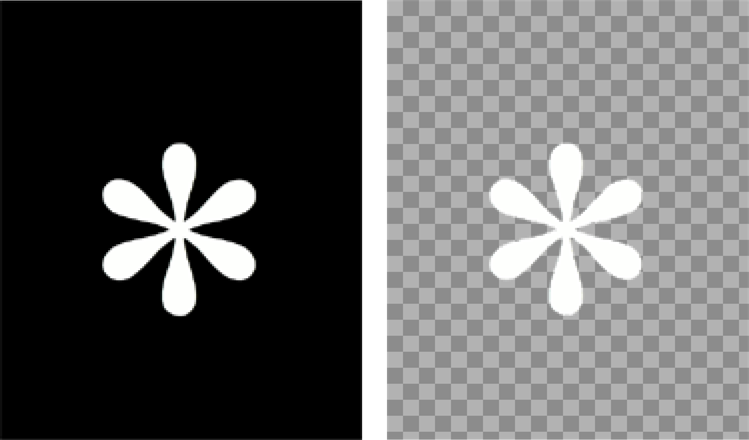

  #### Availability

  Available in OS X v10.4 and later and in iOS 6.0 and later.
- `
  [CIMaximumComponent](#apple-f4xwc4dqnrsv64tfmyxwi33df5tgs3dumvzc6y3jf5bustlbpbuw25lninxw24dpnzsw45a)`

  Returns a grayscale image from max(r,g,b).

  #### Localized Display Name

  Maximum Component

  #### Parameters

|  |  |
| --- | --- |
| `inputImage` | A `CIImage` object whose display name is Image. This is the image data you want to process. |

  #### Member Of

  `CICategoryBuiltIn`, `CICategoryStillImage`, `CICategoryNonSquarePixels`, `CICategoryInterlaced`, `CICategoryVideo`, `CICategoryColorEffect`

  #### Availability

  Available in OS X v10.5 and later and in iOS 6.0 and later.
- `
  [CIMinimumComponent](#apple-f4xwc4dqnrsv64tfmyxwi33df5tgs3dumvzc6y3jf5bustljnzuw25lninxw24dpnzsw45a)`

  Returns a grayscale image from min(r,g,b).

  #### Localized Display Name

  Minimum Component

  #### Parameters

|  |  |
| --- | --- |
| `inputImage` | A `CIImage` object whose display name is Image. This is the image data you want to process. |

  #### Member Of

  `CICategoryBuiltIn`, `CICategoryStillImage`, `CICategoryNonSquarePixels`, `CICategoryInterlaced`, `CICategoryVideo`, `CICategoryColorEffect`

  #### Availability

  Available in OS X v10.5 and later and in iOS 6.0 and later.
- `
  [CIPhotoEffectChrome](#apple-f4xwc4dqnrsv64tfmyxwi33df5tgs3dumvzc6y3jf5busudin52g6rlgmzswg5cdnbzg63lf)`

  Applies a preconfigured set of effects that imitate vintage photography film with exaggerated color.

  #### Localized Display Name

  Photo Effect Chrome

  #### Parameters

|  |  |
| --- | --- |
| `inputImage` | A `CIImage` object whose display name is Image. |

  #### Member Of

  `CICategoryXMPSerializable`, `CICategoryBuiltIn`, `CICategoryStillImage`, `CICategoryNonSquarePixels`, `CICategoryInterlaced`, `CICategoryVideo`, `CICategoryColorEffect`

  #### Sample Output

  __Figure 31__The result of using the CIPhotoEffectChrome filter
  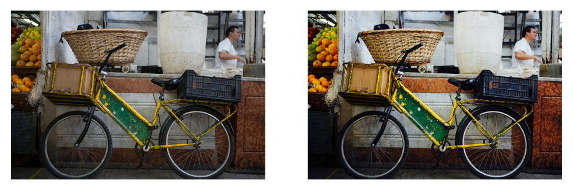

  #### Availability

  Available in OS X v10.9 and later and in iOS 7.0 and later.
- `
  [CIPhotoEffectFade](#apple-f4xwc4dqnrsv64tfmyxwi33df5tgs3dumvzc6y3jf5busudin52g6rlgmzswg5cgmfsgk)`

  Applies a preconfigured set of effects that imitate vintage photography film with diminished color.

  #### Localized Display Name

  Photo Effect Fade

  #### Parameters

|  |  |
| --- | --- |
| `inputImage` | A `CIImage` object whose display name is Image. |

  #### Member Of

  `CICategoryXMPSerializable`, `CICategoryBuiltIn`, `CICategoryStillImage`, `CICategoryNonSquarePixels`, `CICategoryInterlaced`, `CICategoryVideo`, `CICategoryColorEffect`

  #### Sample Output

  __Figure 32__The result of using the CIPhotoEffectFade filter
  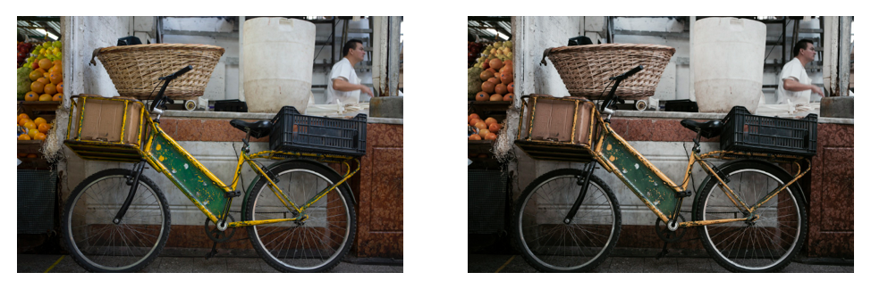

  #### Availability

  Available in OS X v10.9 and later and in iOS 7.0 and later.
- `
  [CIPhotoEffectInstant](#apple-f4xwc4dqnrsv64tfmyxwi33df5tgs3dumvzc6y3jf5busudin52g6rlgmzswg5cjnzzxiylooq)`

  Applies a preconfigured set of effects that imitate vintage photography film with distorted colors.

  #### Localized Display Name

  Photo Effect Instant

  #### Parameters

|  |  |
| --- | --- |
| `inputImage` | A `CIImage` object whose display name is Image. |

  #### Member Of

  `CICategoryXMPSerializable`, `CICategoryBuiltIn`, `CICategoryStillImage`, `CICategoryNonSquarePixels`, `CICategoryInterlaced`, `CICategoryVideo`, `CICategoryColorEffect`

  #### Sample Output

  __Figure 33__The result of using the CIPhotoEffectInstant filter
  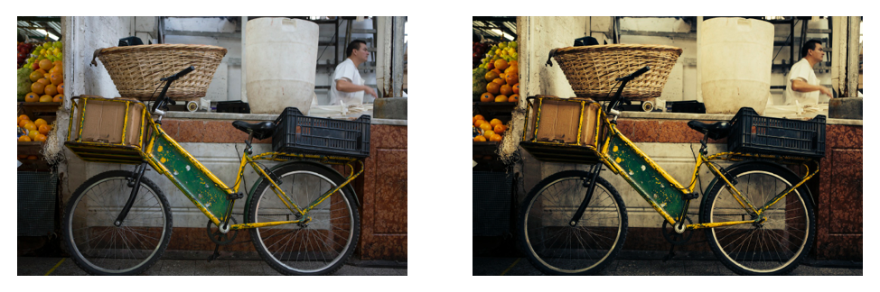

  #### Availability

  Available in OS X v10.9 and later and in iOS 7.0 and later.
- `
  [CIPhotoEffectMono](#apple-f4xwc4dqnrsv64tfmyxwi33df5tgs3dumvzc6y3jf5busudin52g6rlgmzswg5cnn5xg6)`

  Applies a preconfigured set of effects that imitate black-and-white photography film with low contrast.

  #### Localized Display Name

  Photo Effect Mono

  #### Parameters

|  |  |
| --- | --- |
| `inputImage` | A `CIImage` object whose display name is Image. |

  #### Member Of

  `CICategoryXMPSerializable`, `CICategoryBuiltIn`, `CICategoryStillImage`, `CICategoryNonSquarePixels`, `CICategoryInterlaced`, `CICategoryVideo`, `CICategoryColorEffect`

  #### Sample Output

  __Figure 34__The result of using the CIPhotoEffectMono filter
  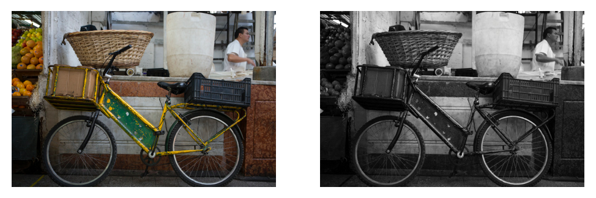

  #### Availability

  Available in OS X v10.9 and later and in iOS 7.0 and later.
- `
  [CIPhotoEffectNoir](#apple-f4xwc4dqnrsv64tfmyxwi33df5tgs3dumvzc6y3jf5busudin52g6rlgmzswg5con5uxe)`

  Applies a preconfigured set of effects that imitate black-and-white photography film with exaggerated contrast.

  #### Localized Display Name

  Photo Effect Noir

  #### Parameters

|  |  |
| --- | --- |
| `inputImage` | A `CIImage` object whose display name is Image. |

  #### Member Of

  `CICategoryXMPSerializable`, `CICategoryBuiltIn`, `CICategoryStillImage`, `CICategoryNonSquarePixels`, `CICategoryInterlaced`, `CICategoryVideo`, `CICategoryColorEffect`

  #### Sample Output

  __Figure 35__The result of using the CIPhotoEffectNoir filter
  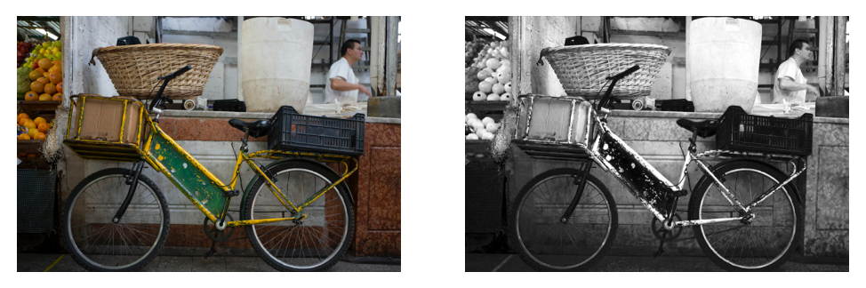

  #### Availability

  Available in OS X v10.9 and later and in iOS 7.0 and later.
- `
  [CIPhotoEffectProcess](#apple-f4xwc4dqnrsv64tfmyxwi33df5tgs3dumvzc6y3jf5busudin52g6rlgmzswg5cqojxwgzltom)`

  Applies a preconfigured set of effects that imitate vintage photography film with emphasized cool colors.

  #### Localized Display Name

  Photo Effect Process

  #### Parameters

|  |  |
| --- | --- |
| `inputImage` | A `CIImage` object whose display name is Image. |

  #### Member Of

  `CICategoryXMPSerializable`, `CICategoryBuiltIn`, `CICategoryStillImage`, `CICategoryNonSquarePixels`, `CICategoryInterlaced`, `CICategoryVideo`, `CICategoryColorEffect`

  #### Sample Output

  __Figure 36__The result of using the CIPhotoEffectProcess filter
  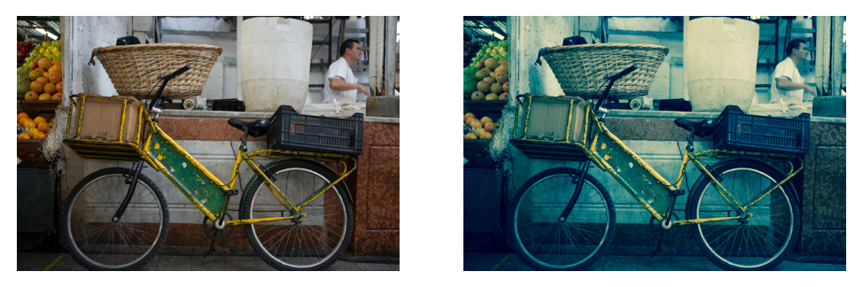

  #### Availability

  Available in OS X v10.9 and later and in iOS 7.0 and later.
- `
  [CIPhotoEffectTonal](#apple-f4xwc4dqnrsv64tfmyxwi33df5tgs3dumvzc6y3jf5busudin52g6rlgmzswg5cun5xgc3a)`

  Applies a preconfigured set of effects that imitate black-and-white photography film without significantly altering contrast.

  #### Localized Display Name

  Photo Effect Tonal

  #### Parameters

|  |  |
| --- | --- |
| `inputImage` | A `CIImage` object whose display name is Image. |

  #### Member Of

  `CICategoryXMPSerializable`, `CICategoryBuiltIn`, `CICategoryStillImage`, `CICategoryNonSquarePixels`, `CICategoryInterlaced`, `CICategoryVideo`, `CICategoryColorEffect`

  #### Sample Output

  __Figure 37__The result of using the CIPhotoEffectTonal filter
  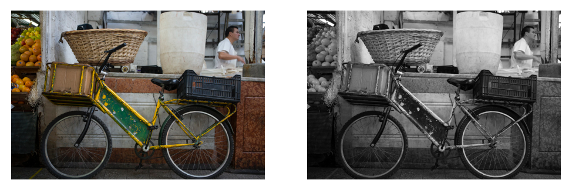

  #### Availability

  Available in OS X v10.9 and later and in iOS 7.0 and later.
- `
  [CIPhotoEffectTransfer](#apple-f4xwc4dqnrsv64tfmyxwi33df5tgs3dumvzc6y3jf5busudin52g6rlgmzswg5cuojqw443gmvza)`

  Applies a preconfigured set of effects that imitate vintage photography film with emphasized warm colors.

  #### Localized Display Name

  Photo Effect Transfer

  #### Parameters

|  |  |
| --- | --- |
| `inputImage` | A `CIImage` object whose display name is Image. |

  #### Member Of

  `CICategoryXMPSerializable`, `CICategoryBuiltIn`, `CICategoryStillImage`, `CICategoryNonSquarePixels`, `CICategoryInterlaced`, `CICategoryVideo`, `CICategoryColorEffect`

  #### Sample Output

  __Figure 38__The result of using the CIPhotoEffectTransfer filter
  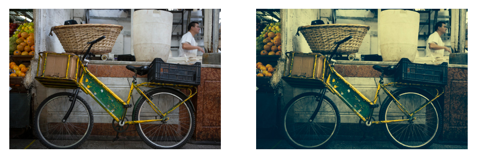

  #### Availability

  Available in OS X v10.9 and later and in iOS 7.0 and later.
- `
  [CISepiaTone](#apple-f4xwc4dqnrsv64tfmyxwi33df5tgs3dumvzc6y3jf5busu3fobuwcvdpnzsq)`

  Maps the colors of an image to various shades of brown.

  #### Localized Display Name

  Sepia Tone

  #### Parameters

|  |  |
| --- | --- |
| `inputImage` | A `CIImage` object whose display name is Image. |
| `inputIntensity` | An `NSNumber` object whose attribute type is `CIAttributeTypeScalar` and whose display name is Intensity.  Default value: 1.00 |

  #### Member Of

  `CICategoryBuiltIn`, `CICategoryStillImage`, `CICategoryNonSquarePixels`, `CICategoryInterlaced`, `CICategoryVideo`, `CICategoryColorEffect`

  #### Sample Output

  __Figure 39__The result of using the CISepiaTone filter
  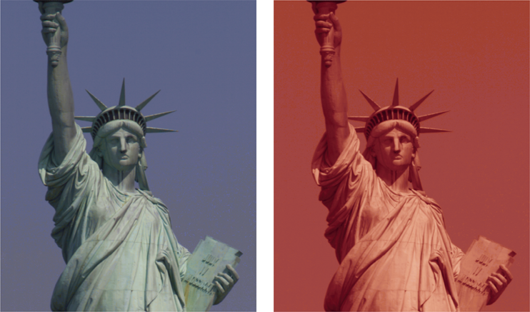

  #### Availability

  Available in OS X v10.4 and later and in iOS 5.0 and later.
- `
  [CIVignette](#apple-f4xwc4dqnrsv64tfmyxwi33df5tgs3dumvzc6y3jf5busvtjm5xgk5dumu)`

  Reduces the brightness of an image at the periphery.

  #### Localized Display Name

  Vignette

  #### Parameters

|  |  |
| --- | --- |
| `inputImage` | A `CIImage` object whose display name is Image. |
| `inputRadius` | An `NSNumber` object whose attribute type is `CIAttributeTypeDistance` and whose display name is Radius.  Default value: 1.00 |
| `inputIntensity` | An `NSNumber` object whose attribute type is `CIAttributeTypeScalar` and whose display name is Intensity.  Default value: 0.0 |

  #### Member Of

  `CICategoryBuiltIn`, `CICategoryStillImage`, `CICategoryNonSquarePixels`, `CICategoryInterlaced`, `CICategoryVideo`, `CICategoryColorEffect`

  #### Sample Output

  __Figure 40__The result of using the CIVignette filter
  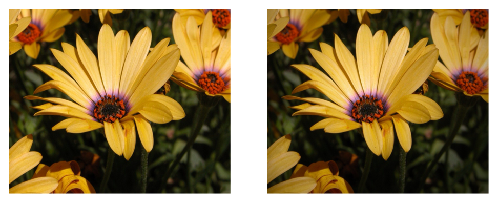

  #### Availability

  Available in OS X v10.9 and later and in iOS 5.0 and later.
- `
  [CIVignetteEffect](#apple-f4xwc4dqnrsv64tfmyxwi33df5tgs3dumvzc6y3jf5busvtjm5xgk5dumvcwmztfmn2a)`

  Modifies the brightness of an image around the periphery of a specified region.

  #### Localized Display Name

  Vignette Effect

  #### Parameters

|  |  |
| --- | --- |
| `inputImage` | A `CIImage` object whose display name is Image. |
| `inputCenter` | A `CIVector` object whose attribute type is `CIAttributeTypePosition` and whose display name is Center.  Default value: [150 150] Identity: (null) |
| `inputIntensity` | An `NSNumber` object whose attribute type is `CIAttributeTypeScalar` and whose display name is Intensity.  Default value: 1.00 Minimum: 0.00 Maximum: 0.00 Slider minimum: 0.00 Slider maximum: 1.00 Identity: 0.00 |
| `inputRadius` | An `NSNumber` object whose display name is Radius.  Default value: 0.00 Minimum: 0.00 Maximum: 0.00 Slider minimum: 0.00 Slider maximum: 0.00 Identity: 0.00 |

  #### Member Of

  `CICategoryBuiltIn`, `CICategoryStillImage`, `CICategoryNonSquarePixels`, `CICategoryInterlaced`, `CICategoryVideo`, `CICategoryColorEffect`

  #### Sample Output

  __Figure 41__The result of using the CIVignetteEffect filter
  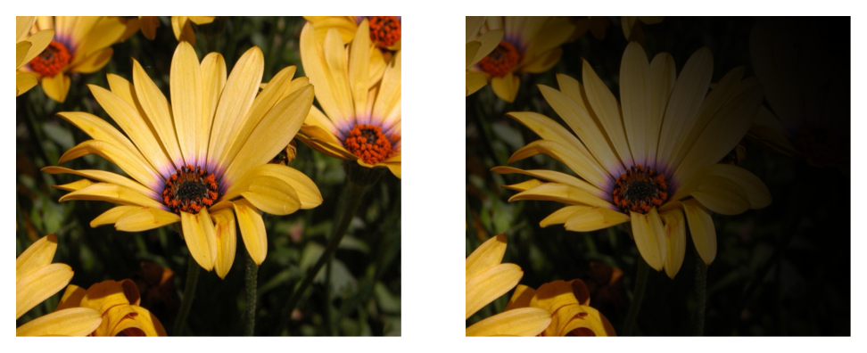

  #### Availability

  Available in OS X v10.9 and later and in iOS 7.0 and later.

[### CICategoryCompositeOperation](#apple-f4xwc4dqnrsv64tfmyxwi33df52wszbpkridgmbqgaydcmzwfvjvonzr)

- `
  [CIAdditionCompositing](#apple-f4xwc4dqnrsv64tfmyxwi33df5tgs3dumvzc6y3jf5busqlemruxi2lpnzbw63lqn5zws5djnztq)`

  Adds color components to achieve a brightening effect.

  #### Localized Display Name

  Addition

  #### Parameters

|  |  |
| --- | --- |
| `inputImage` | A `CIImage` object whose display name is Image. |
| `inputBackgroundImage` | A `CIImage` object whose display name is Background Image. |

  #### Discussion

  This filter is typically used to add highlights and lens flare effects. The formula used to create this filter is described in Thomas Porter and Tom Duff. 1984. [Compositing Digital Images](http://keithp.com/~keithp/porterduff/p253-porter.pdf). _Computer Graphics_, 18 (3): 253-259.

  #### Member Of

  `CICategoryBuiltIn`, `CICategoryHighDynamicRange`, `CICategoryNonSquarePixels`, `CICategoryInterlaced`, `CICategoryStillImage`, `CICategoryVideo`, `CICategoryCompositeOperation`

  #### Sample Output

  __Figure 42__The result of using the CIAdditionCompositing filter
  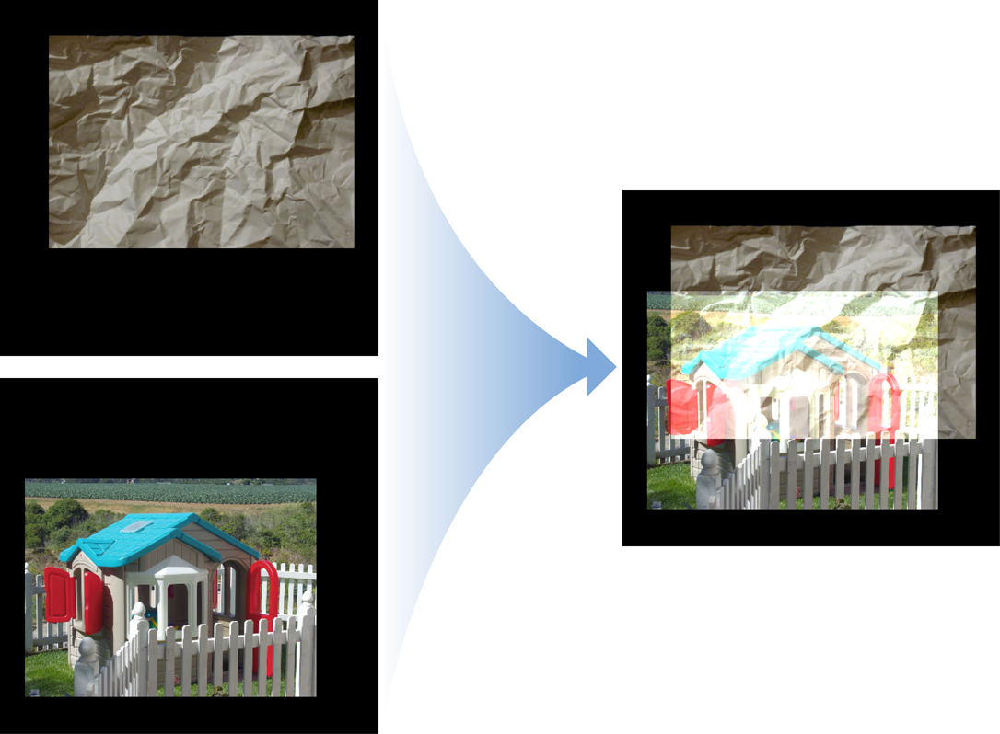

  #### Availability

  Available in OS X v10.4 and later and in iOS 6.0 and later.
- `
  [CIColorBlendMode](#apple-f4xwc4dqnrsv64tfmyxwi33df5tgs3dumvzc6y3jf5busq3pnrxxeqtmmvxgitlpmrsq)`

  Uses the luminance values of the background with the hue and saturation values of the source image.

  #### Localized Display Name

  Color Blend Mode

  #### Parameters

|  |  |
| --- | --- |
| `inputImage` | A `CIImage` object whose display name is Image. |
| `inputBackgroundImage` | A `CIImage` object whose display name is Background Image. |

  #### Discussion

  This mode preserves the gray levels in the image. The formula used to create this filter is described in the PDF specification, which is available online from the Adobe Developer Center. See [PDF Reference and Adobe Extensions to the PDF Specification](http://www.adobe.com/devnet/pdf/pdf_reference.html).

  #### Member Of

  `CICategoryBuiltIn`, `CICategoryNonSquarePixels`, `CICategoryInterlaced`, `CICategoryStillImage`, `CICategoryVideo`, `CICategoryCompositeOperation`

  #### Sample Output

  __Figure 43__The result of using the CIColorBlendMode filter
  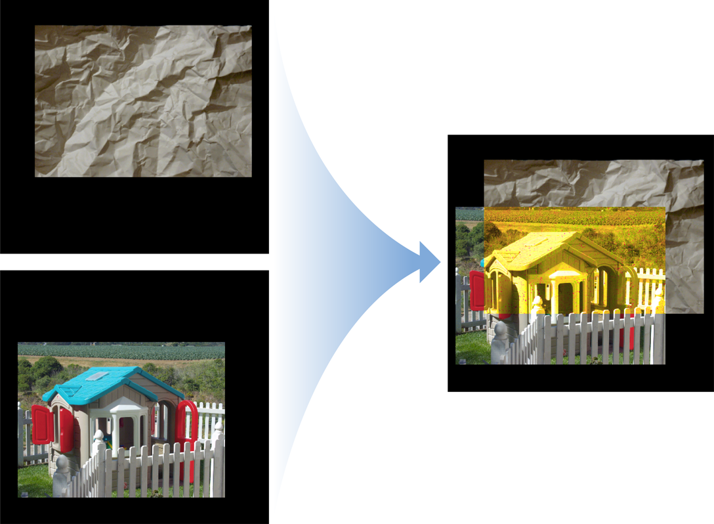

  #### Availability

  Available in OS X v10.4 and later and in iOS 6.0 and later.
- `
  [CIColorBurnBlendMode](#apple-f4xwc4dqnrsv64tfmyxwi33df5tgs3dumvzc6y3jf5busq3pnrxxeqtvojxee3dfnzse233emu)`

  Darkens the background image samples to reflect the source image samples.

  #### Localized Display Name

  Color Burn Blend Mode

  #### Parameters

|  |  |
| --- | --- |
| `inputImage` | A `CIImage` object whose display name is Image. |
| `inputBackgroundImage` | A `CIImage` object whose display name is Background Image. |

  #### Discussion

  Source image sample values that specify white do not produce a change. The formula used to create this filter is described in the PDF specification, which is available online from the Adobe Developer Center. See [PDF Reference and Adobe Extensions to the PDF Specification](http://www.adobe.com/devnet/pdf/pdf_reference.html).

  #### Member Of

  `CICategoryBuiltIn`, `CICategoryNonSquarePixels`, `CICategoryInterlaced`, `CICategoryStillImage`, `CICategoryVideo`, `CICategoryCompositeOperation`

  #### Sample Output

  __Figure 44__The result of using the CIColorBurnBlendMode filter
  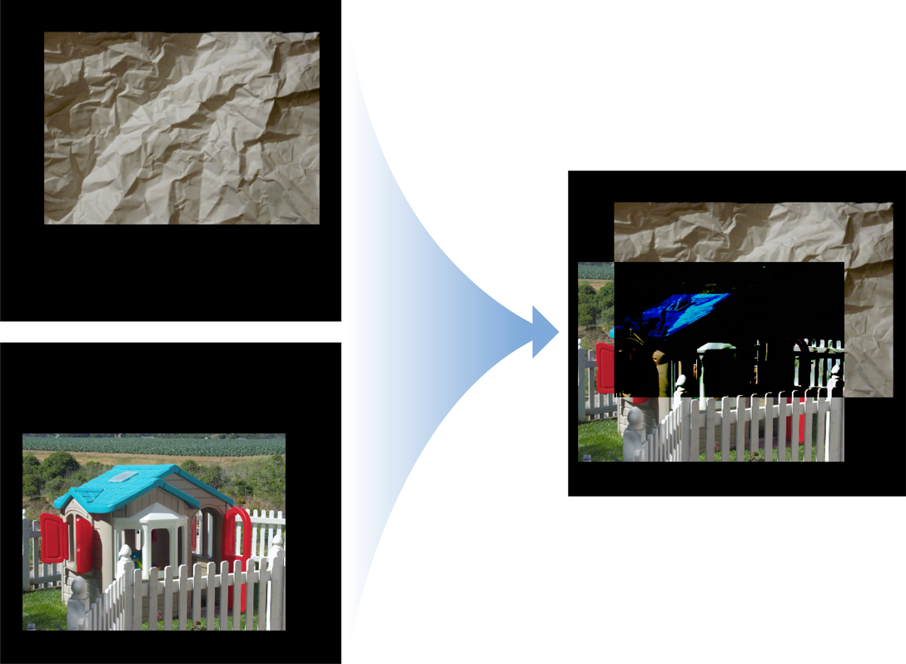

  #### Availability

  Available in OS X v10.4 and later and in iOS 6.0 and later.
- `
  [CIColorDodgeBlendMode](#apple-f4xwc4dqnrsv64tfmyxwi33df5tgs3dumvzc6y3jf5busq3pnrxxerdpmrtwkqtmmvxgitlpmrsq)`

  Brightens the background image samples to reflect the source image samples.

  #### Localized Display Name

  Color Dodge Blend Mode

  #### Parameters

|  |  |
| --- | --- |
| `inputImage` | A `CIImage` object whose display name is Image. |
| `inputBackgroundImage` | A `CIImage` object whose display name is Background Image. |

  #### Discussion

  Source image sample values that specify black do not produce a change. The formula used to create this filter is described in the PDF specification, which is available online from the Adobe Developer Center. See [PDF Reference and Adobe Extensions to the PDF Specification](http://www.adobe.com/devnet/pdf/pdf_reference.html).

  #### Member Of

  `CICategoryBuiltIn`, `CICategoryNonSquarePixels`, `CICategoryInterlaced`, `CICategoryStillImage`, `CICategoryVideo`, `CICategoryCompositeOperation`

  #### Sample Output

  __Figure 45__The result of using the CIColorDodgeBlendMode filter
  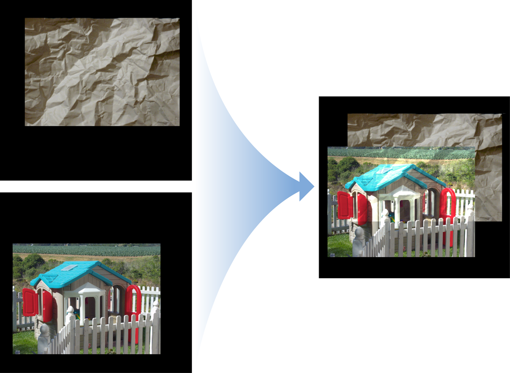

  #### Availability

  Available in OS X v10.4 and later and in iOS 6.0 and later.
- `
  [CIDarkenBlendMode](#apple-f4xwc4dqnrsv64tfmyxwi33df5tgs3dumvzc6y3jf5busrdbojvwk3scnrsw4zcnn5sgk)`

  Creates composite image samples by choosing the darker samples (from either the source image or the background).

  #### Localized Display Name

  Darken Blend Mode

  #### Parameters

|  |  |
| --- | --- |
| `inputImage` | A `CIImage` object whose display name is Image. |
| `inputBackgroundImage` | A `CIImage` object whose display name is Background Image. |

  #### Discussion

  The result is that the background image samples are replaced by any source image samples that are darker. Otherwise, the background image samples are left unchanged. The formula used to create this filter is described in the PDF specification, which is available online from the Adobe Developer Center. See [PDF Reference and Adobe Extensions to the PDF Specification](http://www.adobe.com/devnet/pdf/pdf_reference.html).

  #### Member Of

  `CICategoryBuiltIn`, `CICategoryNonSquarePixels`, `CICategoryInterlaced`, `CICategoryStillImage`, `CICategoryVideo`, `CICategoryCompositeOperation`

  #### Sample Output

  __Figure 46__The result of using the CIDarkenBlendMode filter
  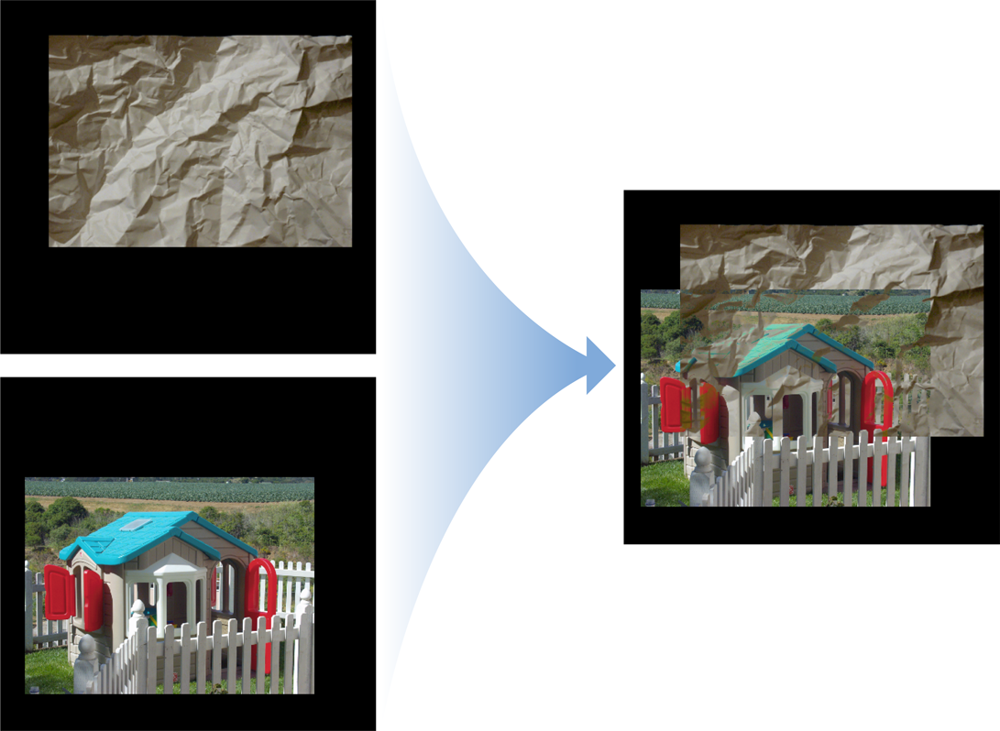

  #### Availability

  Available in OS X v10.4 and later and in iOS 6.0 and later.
- `
  [CIDifferenceBlendMode](#apple-f4xwc4dqnrsv64tfmyxwi33df5tgs3dumvzc6y3jf5busrdjmztgk4tfnzrwkqtmmvxgitlpmrsq)`

  Subtracts either the source image sample color from the background image sample color, or the reverse, depending on which sample has the greater brightness value.

  #### Localized Display Name

  Difference Blend Mode

  #### Parameters

|  |  |
| --- | --- |
| `inputImage` | A `CIImage` object whose display name is Image. |
| `inputBackgroundImage` | A `CIImage` object whose display name is Background Image. |

  #### Discussion

  Source image sample values that are black produce no change; white inverts the background color values. The formula used to create this filter is described in the PDF specification, which is available online from the Adobe Developer Center. See [PDF Reference and Adobe Extensions to the PDF Specification](http://www.adobe.com/devnet/pdf/pdf_reference.html).

  #### Member Of

  `CICategoryBuiltIn`, `CICategoryNonSquarePixels`, `CICategoryInterlaced`, `CICategoryStillImage`, `CICategoryVideo`, `CICategoryCompositeOperation`

  #### Sample Output

  __Figure 47__The result of using the CIDifferenceBlendMode filter
  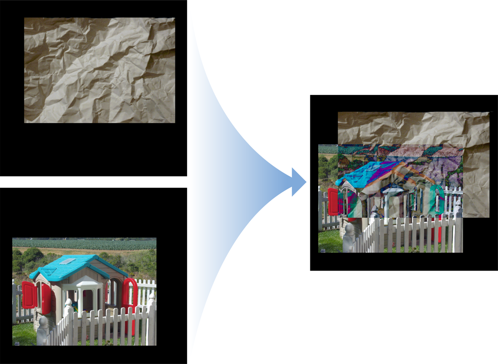

  #### Availability

  Available in OS X v10.4 and later and in iOS 6.0 and later.
- `
  [CIDivideBlendMode](#apple-f4xwc4dqnrsv64tfmyxwi33df5tgs3dumvzc6y3jf5busrdjozuwizkcnrsw4zcnn5sgk)`

  Divides the background image sample color from the source image sample color.

  #### Localized Display Name

  Divide Blend Mode

  #### Parameters

|  |  |
| --- | --- |
| `inputImage` | A `CIImage` object whose display name is Image. |
| `inputBackgroundImage` | A `CIImage` object whose display name is Background Image. |

  #### Member Of

  `CICategoryCompositeOperation`, `CICategoryVideo`, `CICategoryStillImage`, `CICategoryInterlaced`, `CICategoryNonSquarePixels`, `CICategoryBuiltIn`

  #### Sample Output

  __Figure 48__The result of using the CIDivideBlendMode filter
  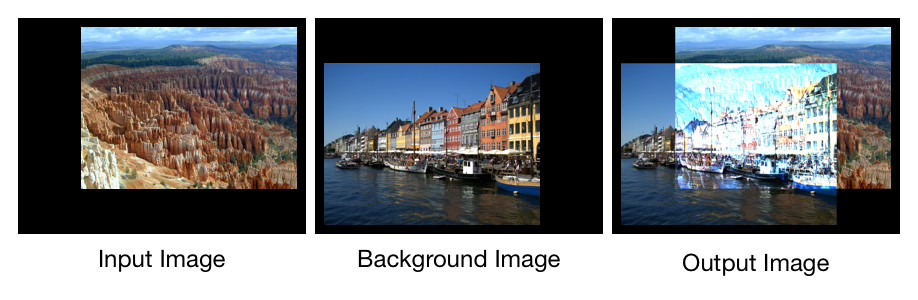

  #### Availability

  Available in OS X v10.10 and later and in iOS 8.0 and later.
- `
  [CIExclusionBlendMode](#apple-f4xwc4dqnrsv64tfmyxwi33df5tgs3dumvzc6y3jf5busrlymnwhk43jn5xee3dfnzse233emu)`

  Produces an effect similar to that produced by the CIDifferenceBlendMode filter but with lower contrast.

  #### Localized Display Name

  Exclusion Blend Mode

  #### Parameters

|  |  |
| --- | --- |
| `inputImage` | A `CIImage` object whose display name is Image. |
| `inputBackgroundImage` | A `CIImage` object whose display name is Background Image. |

  #### Discussion

  Source image sample values that are black do not produce a change; white inverts the background color values. The formula used to create this filter is described in the PDF specification, which is available online from the Adobe Developer Center. See [PDF Reference and Adobe Extensions to the PDF Specification](http://www.adobe.com/devnet/pdf/pdf_reference.html).

  #### Member Of

  `CICategoryBuiltIn`, `CICategoryNonSquarePixels`, `CICategoryInterlaced`, `CICategoryStillImage`, `CICategoryVideo`, `CICategoryCompositeOperation`

  #### Sample Output

  __Figure 49__The result of using the CIExclusionBlendMode filter
  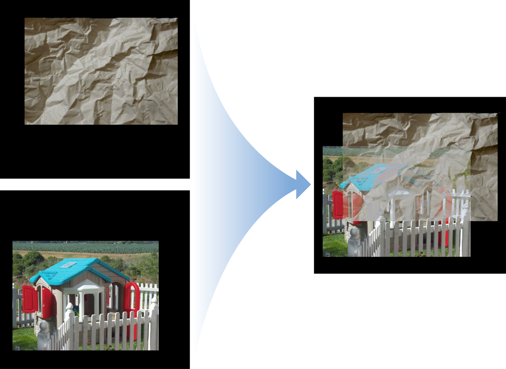

  #### Availability

  Available in OS X v10.4 and later and in iOS 6.0 and later.
- `
  [CIHardLightBlendMode](#apple-f4xwc4dqnrsv64tfmyxwi33df5tgs3dumvzc6y3jf5bussdbojsey2lhnb2ee3dfnzse233emu)`

  Either multiplies or screens colors, depending on the source image sample color.

  #### Localized Display Name

  Hard Light Blend Mode

  #### Parameters

|  |  |
| --- | --- |
| `inputImage` | A `CIImage` object whose display name is Image. |
| `inputBackgroundImage` | A `CIImage` object whose display name is Background Image. |

  #### Discussion

  If the source image sample color is lighter than 50% gray, the background is lightened, similar to screening. If the source image sample color is darker than 50% gray, the background is darkened, similar to multiplying. If the source image sample color is equal to 50% gray, the source image is not changed. Image samples that are equal to pure black or pure white result in pure black or white. The overall effect is similar to what you would achieve by shining a harsh spotlight on the source image. The formula used to create this filter is described in the PDF specification, which is available online from the Adobe Developer Center. See [PDF Reference and Adobe Extensions to the PDF Specification](http://www.adobe.com/devnet/pdf/pdf_reference.html).

  #### Member Of

  `CICategoryBuiltIn`, `CICategoryNonSquarePixels`, `CICategoryInterlaced`, `CICategoryStillImage`, `CICategoryVideo`, `CICategoryCompositeOperation`

  #### Sample Output

  __Figure 50__The result of using the CIHardLightBlendMode filter
  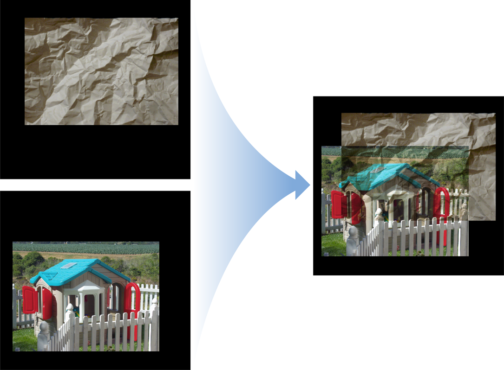

  #### Availability

  Available in OS X v10.4 and later and in iOS 6.0 and later.
- `
  [CIHueBlendMode](#apple-f4xwc4dqnrsv64tfmyxwi33df5tgs3dumvzc6y3jf5bussdvmvbgyzlomrgw6zdf)`

  Uses the luminance and saturation values of the background image with the hue of the input image.

  #### Localized Display Name

  Hue Blend Mode

  #### Parameters

|  |  |
| --- | --- |
| `inputImage` | A `CIImage` object whose display name is Image. |
| `inputBackgroundImage` | A `CIImage` object whose display name is Background Image. |

  #### Discussion

  The formula used to create this filter is described in the PDF specification, which is available online from the Adobe Developer Center. See [PDF Reference and Adobe Extensions to the PDF Specification](http://www.adobe.com/devnet/pdf/pdf_reference.html).

  #### Member Of

  `CICategoryBuiltIn`, `CICategoryNonSquarePixels`, `CICategoryInterlaced`, `CICategoryStillImage`, `CICategoryVideo`, `CICategoryCompositeOperation`

  #### Sample Output

  __Figure 51__The result of using the CIHueBlendMode filter
  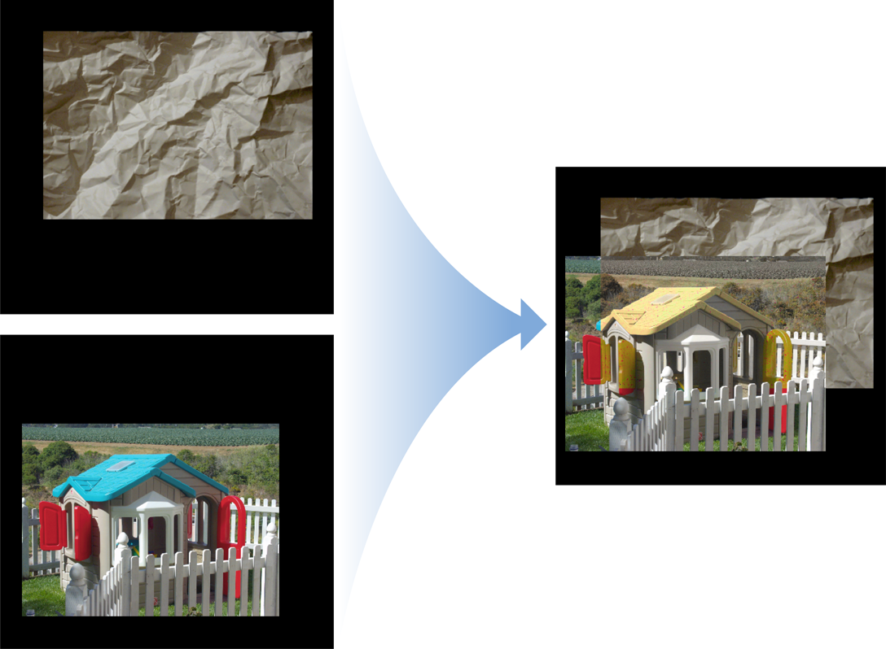

  #### Availability

  Available in OS X v10.4 and later and in iOS 6.0 and later.
- `
  [CILightenBlendMode](#apple-f4xwc4dqnrsv64tfmyxwi33df5tgs3dumvzc6y3jf5bustdjm5uhizloijwgk3tejvxwizi)`

  Creates composite image samples by choosing the lighter samples (either from the source image or the background).

  #### Localized Display Name

  Lighten Blend Mode

  #### Parameters

|  |  |
| --- | --- |
| `inputImage` | A `CIImage` object whose display name is Image. |
| `inputBackgroundImage` | A `CIImage` object whose display name is Background Image. |

  #### Discussion

  The result is that the background image samples are replaced by any source image samples that are lighter. Otherwise, the background image samples are left unchanged. The formula used to create this filter is described in the PDF specification, which is available online from the Adobe Developer Center. See [PDF Reference and Adobe Extensions to the PDF Specification](http://www.adobe.com/devnet/pdf/pdf_reference.html).

  #### Member Of

  `CICategoryBuiltIn`, `CICategoryNonSquarePixels`, `CICategoryInterlaced`, `CICategoryStillImage`, `CICategoryVideo`, `CICategoryCompositeOperation`

  #### Sample Output

  __Figure 52__The result of using the CILightenBlendMode filter
  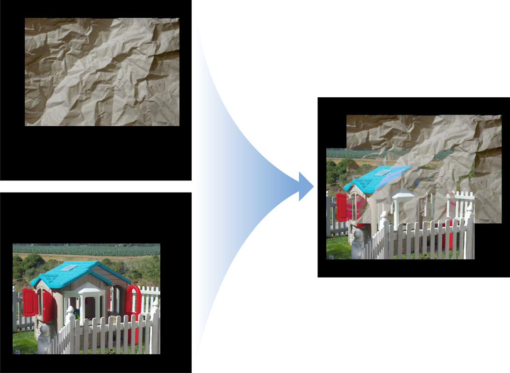

  #### Availability

  Available in OS X v10.4 and later and in iOS 6.0 and later.
- `
  [CILinearBurnBlendMode](#apple-f4xwc4dqnrsv64tfmyxwi33df5tgs3dumvzc6y3jf5bustdjnzswc4scovzg4qtmmvxgitlpmrsq)`

  Darkens the background image samples to reflect the source image samples while also increasing contrast.

  #### Localized Display Name

  Linear Burn Blend Mode

  #### Parameters

|  |  |
| --- | --- |
| `inputImage` | A `CIImage` object whose display name is Image. |
| `inputBackgroundImage` | A `CIImage` object whose display name is Background Image. |

  #### Discussion

  The effect of this filter is similar to that of the `[CIColorBurnBlendMode](#apple-f4xwc4dqnrsv64tfmyxwi33df5tgs3dumvzc6y3jf5busq3pnrxxeqtvojxee3dfnzse233emu)` filter, but more pronounced.

  #### Member Of

  `CICategoryCompositeOperation`, `CICategoryVideo`, `CICategoryStillImage`, `CICategoryInterlaced`, `CICategoryNonSquarePixels`, `CICategoryBuiltIn`

  #### Sample Output

  __Figure 53__The result of using the CILinearBurnBlendMode filter
  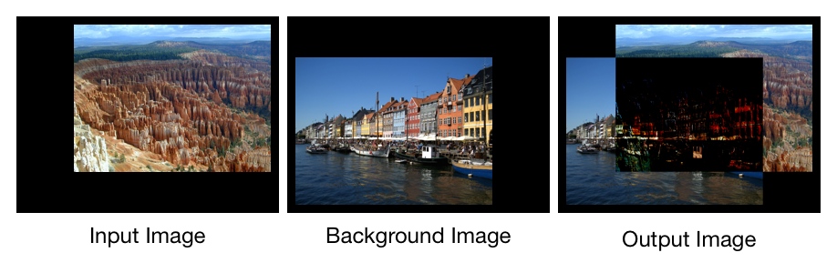

  #### Availability

  Available in OS X v10.10 and later and in iOS 8.0 and later.
- `
  [CILinearDodgeBlendMode](#apple-f4xwc4dqnrsv64tfmyxwi33df5tgs3dumvzc6y3jf5bustdjnzswc4sen5sgozkcnrsw4zcnn5sgk)`

  Brightens the background image samples to reflect the source image samples while also increasing contrast.

  #### Localized Display Name

  Linear Dodge Blend Mode

  #### Parameters

|  |  |
| --- | --- |
| `inputImage` | A `CIImage` object whose display name is Image. |
| `inputBackgroundImage` | A `CIImage` object whose display name is Background Image. |

  #### Discussion

  The effect of this filter is similar to that of the `[CIColorDodgeBlendMode](#apple-f4xwc4dqnrsv64tfmyxwi33df5tgs3dumvzc6y3jf5busq3pnrxxerdpmrtwkqtmmvxgitlpmrsq)` filter, but more pronounced.

  #### Member Of

  `CICategoryCompositeOperation`, `CICategoryVideo`, `CICategoryStillImage`, `CICategoryInterlaced`, `CICategoryNonSquarePixels`, `CICategoryBuiltIn`

  #### Sample Output

  __Figure 54__The result of using the CILinearDodgeBlendMode filter
  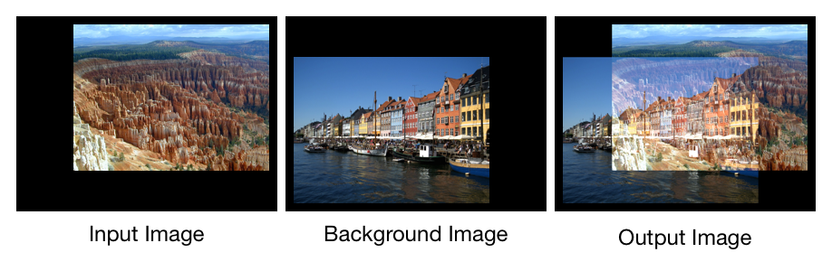

  #### Availability

  Available in OS X v10.10 and later and in iOS 8.0 and later.
- `
  [CILuminosityBlendMode](#apple-f4xwc4dqnrsv64tfmyxwi33df5tgs3dumvzc6y3jf5bustdvnvuw433tnf2hsqtmmvxgitlpmrsq)`

  Uses the hue and saturation of the background image with the luminance of the input image.

  #### Localized Display Name

  Luminosity Blend Mode

  #### Parameters

|  |  |
| --- | --- |
| `inputImage` | A `CIImage` object whose display name is Image. |
| `inputBackgroundImage` | A `CIImage` object whose display name is Background Image. |

  #### Discussion

  This mode creates an effect that is inverse to the effect created by the CIColorBlendMode filter. The formula used to create this filter is described in the PDF specification, which is available online from the Adobe Developer Center. See [PDF Reference and Adobe Extensions to the PDF Specification](http://www.adobe.com/devnet/pdf/pdf_reference.html).

  #### Member Of

  `CICategoryBuiltIn`, `CICategoryNonSquarePixels`, `CICategoryInterlaced`, `CICategoryStillImage`, `CICategoryVideo`, `CICategoryCompositeOperation`

  #### Sample Output

  __Figure 55__The result of using the CILuminosityBlendMode filter
  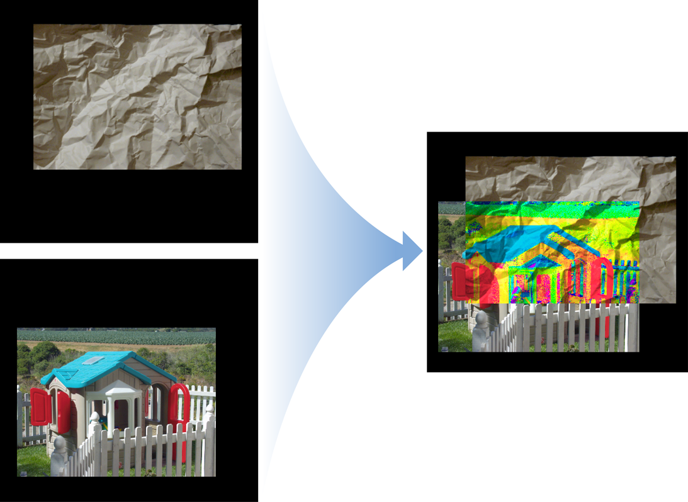

  #### Availability

  Available in OS X v10.4 and later and in iOS 6.0 and later.
- `
  [CIMaximumCompositing](#apple-f4xwc4dqnrsv64tfmyxwi33df5tgs3dumvzc6y3jf5bustlbpbuw25lninxw24dponuxi2lom4)`

  Computes the maximum value, by color component, of two input images and creates an output image using the maximum values.

  #### Localized Display Name

  Maximum

  #### Parameters

|  |  |
| --- | --- |
| `inputImage` | A `CIImage` object whose display name is Image. |
| `inputBackgroundImage` | A `CIImage` object whose display name is Background Image. |

  #### Discussion

  This is similar to dodging. The formula used to create this filter is described in Thomas Porter and Tom Duff. 1984. [Compositing Digital Images](http://keithp.com/~keithp/porterduff/p253-porter.pdf). _Computer Graphics_, 18 (3): 253-259.

  #### Member Of

  `CICategoryBuiltIn`, `CICategoryHighDynamicRange`, `CICategoryNonSquarePixels`, `CICategoryInterlaced`, `CICategoryStillImage`, `CICategoryVideo`, `CICategoryCompositeOperation`

  #### Sample Output

  __Figure 56__The result of using the CIMaximumCompositing filter
  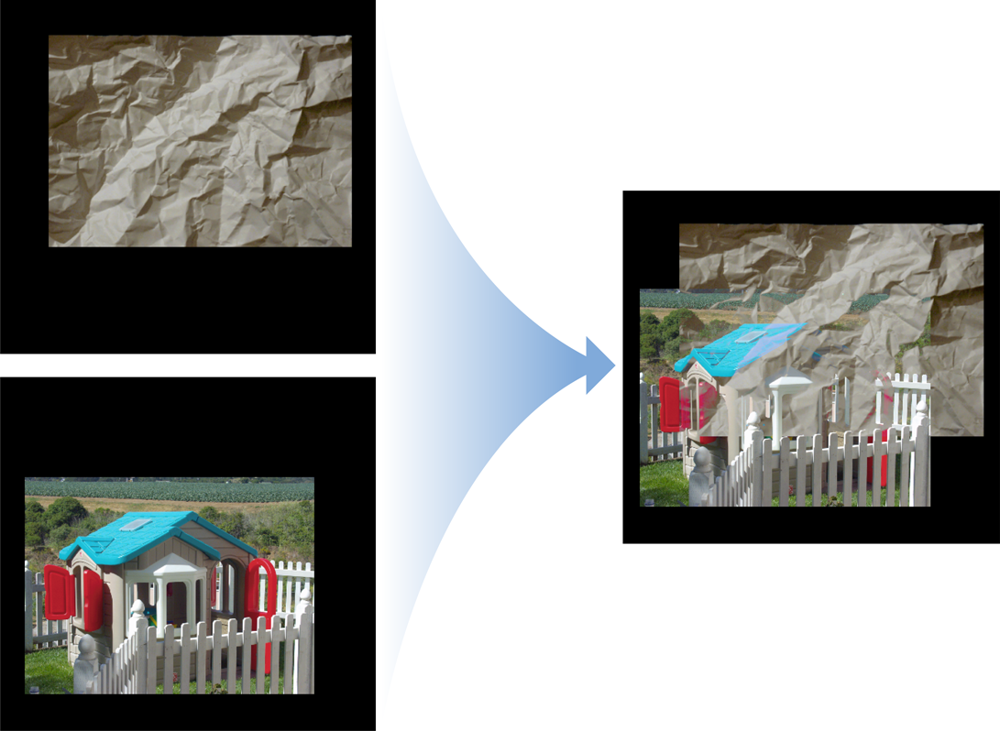

  #### Availability

  Available in OS X v10.4 and later and in iOS 6.0 and later.
- `
  [CIMinimumCompositing](#apple-f4xwc4dqnrsv64tfmyxwi33df5tgs3dumvzc6y3jf5bustljnzuw25lninxw24dponuxi2lom4)`

  Computes the minimum value, by color component, of two input images and creates an output image using the minimum values.

  #### Localized Display Name

  Minimum

  #### Parameters

|  |  |
| --- | --- |
| `inputImage` | A `CIImage` object whose display name is Image. |
| `inputBackgroundImage` | A `CIImage` object whose display name is Background Image. |

  #### Discussion

  This is similar to burning. The formula used to create this filter is described in Thomas Porter and Tom Duff. 1984. [Compositing Digital Images](http://keithp.com/~keithp/porterduff/p253-porter.pdf). _Computer Graphics_, 18 (3): 253-259.

  #### Member Of

  `CICategoryBuiltIn`, `CICategoryHighDynamicRange`, `CICategoryNonSquarePixels`, `CICategoryInterlaced`, `CICategoryStillImage`, `CICategoryVideo`, `CICategoryCompositeOperation`

  #### Sample Output

  __Figure 57__The result of using the CIMinimumCompositing filter
  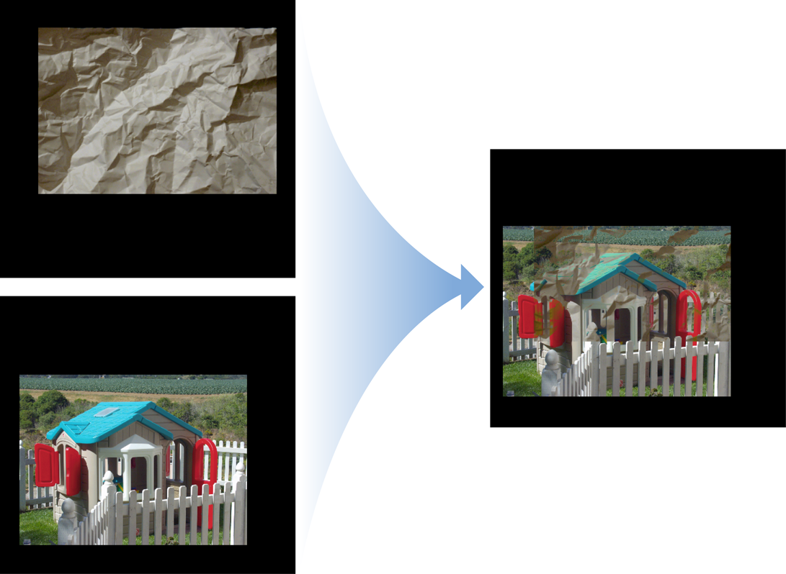

  #### Availability

  Available in OS X v10.4 and later and in iOS 6.0 and later.
- `
  [CIMultiplyBlendMode](#apple-f4xwc4dqnrsv64tfmyxwi33df5tgs3dumvzc6y3jf5bustlvnr2gs4dmpfbgyzlomrgw6zdf)`

  Multiplies the input image samples with the background image samples.

  #### Localized Display Name

  Multiply Blend Mode

  #### Parameters

|  |  |
| --- | --- |
| `inputImage` | A `CIImage` object whose display name is Image. |
| `inputBackgroundImage` | A `CIImage` object whose display name is Background Image. |

  #### Discussion

  This results in colors that are at least as dark as either of the two contributing sample colors. The formula used to create this filter is described in the PDF specification, which is available online from the Adobe Developer Center. See [PDF Reference and Adobe Extensions to the PDF Specification](http://www.adobe.com/devnet/pdf/pdf_reference.html).

  #### Member Of

  `CICategoryBuiltIn`, `CICategoryNonSquarePixels`, `CICategoryInterlaced`, `CICategoryStillImage`, `CICategoryVideo`, `CICategoryCompositeOperation`

  #### Sample Output

  __Figure 58__The result of using the CIMultiplyBlendMode filter
  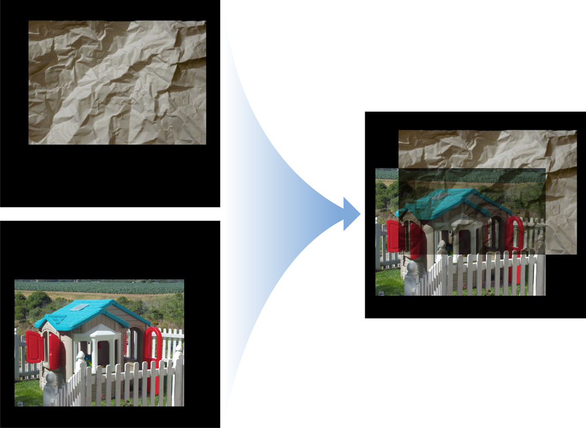

  #### Availability

  Available in OS X v10.4 and later and in iOS 6.0 and later.
- `
  [CIMultiplyCompositing](#apple-f4xwc4dqnrsv64tfmyxwi33df5tgs3dumvzc6y3jf5bustlvnr2gs4dmpfbw63lqn5zws5djnztq)`

  Multiplies the color component of two input images and creates an output image using the multiplied values.

  #### Localized Display Name

  Multiply

  #### Parameters

|  |  |
| --- | --- |
| `inputImage` | A `CIImage` object whose display name is Image. |
| `inputBackgroundImage` | A `CIImage` object whose display name is Background Image. |

  #### Discussion

  This filter is typically used to add a spotlight or similar lighting effect to an image. The formula used to create this filter is described in Thomas Porter and Tom Duff. 1984. [Compositing Digital Images](http://keithp.com/~keithp/porterduff/p253-porter.pdf). _Computer Graphics_, 18 (3): 253-259.

  #### Member Of

  `CICategoryBuiltIn`, `CICategoryHighDynamicRange`, `CICategoryNonSquarePixels`, `CICategoryInterlaced`, `CICategoryStillImage`, `CICategoryVideo`, `CICategoryCompositeOperation`

  #### Sample Output

  __Figure 59__The result of using the CIMultiplyCompositing filter
  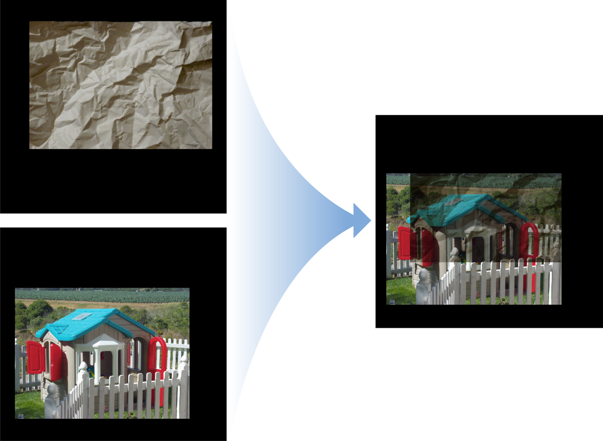

  #### Availability

  Available in OS X v10.4 and later and in iOS 6.0 and later.
- `
  [CIOverlayBlendMode](#apple-f4xwc4dqnrsv64tfmyxwi33df5tgs3dumvzc6y3jf5bust3wmvzgyylzijwgk3tejvxwizi)`

  Either multiplies or screens the input image samples with the background image samples, depending on the background color.

  #### Localized Display Name

  Overlay Blend Mode

  #### Parameters

|  |  |
| --- | --- |
| `inputImage` | A `CIImage` object whose display name is Image. |
| `inputBackgroundImage` | A `CIImage` object whose display name is Background Image. |

  #### Discussion

  The result is to overlay the existing image samples while preserving the highlights and shadows of the background. The background color mixes with the source image to reflect the lightness or darkness of the background. The formula used to create this filter is described in the PDF specification, which is available online from the Adobe Developer Center. See [PDF Reference and Adobe Extensions to the PDF Specification](http://www.adobe.com/devnet/pdf/pdf_reference.html).

  #### Member Of

  `CICategoryBuiltIn`, `CICategoryNonSquarePixels`, `CICategoryInterlaced`, `CICategoryStillImage`, `CICategoryVideo`, `CICategoryCompositeOperation`

  #### Sample Output

  __Figure 60__The result of using the CIOverlayBlendMode filter
  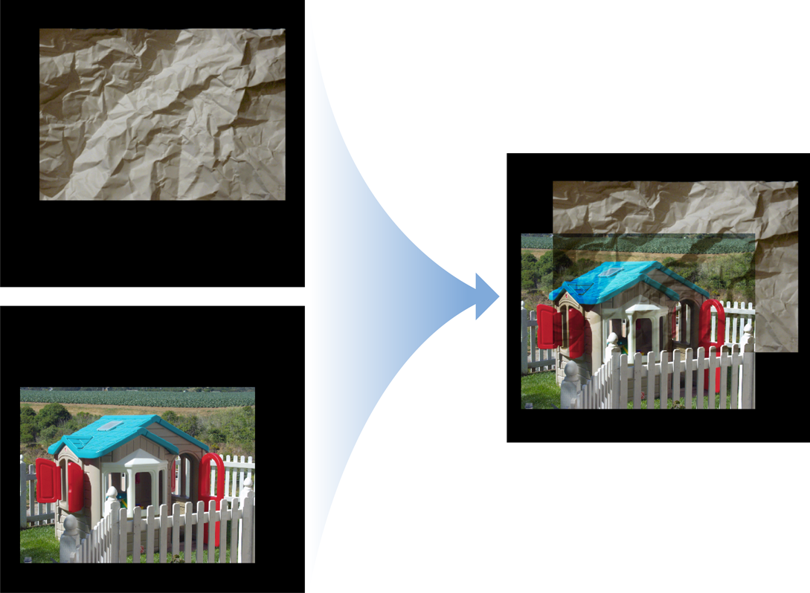

  #### Availability

  Available in OS X v10.4 and later and in iOS 6.0 and later.
- `
  [CIPinLightBlendMode](#apple-f4xwc4dqnrsv64tfmyxwi33df5tgs3dumvzc6y3jf5busudjnzggsz3iorbgyzlomrgw6zdf)`

  Conditionally replaces background image samples with source image samples depending on the brightness of the source image samples.

  #### Localized Display Name

  Pin Light Blend Mode

  #### Parameters

|  |  |
| --- | --- |
| `inputImage` | A `CIImage` object whose display name is Image. |
| `inputBackgroundImage` | A `CIImage` object whose display name is Background Image. |

  #### Member Of

  `CICategoryCompositeOperation`, `CICategoryVideo`, `CICategoryStillImage`, `CICategoryInterlaced`, `CICategoryNonSquarePixels`, `CICategoryBuiltIn`

  #### Sample Output

  __Figure 61__The result of using the CIPinLightBlendMode filter
  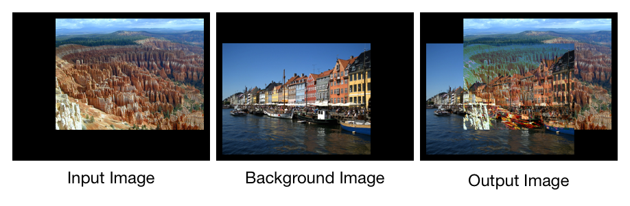

  #### Availability

  Available in OS X v10.10 and later and in iOS 8.0 and later.
- `
  [CISaturationBlendMode](#apple-f4xwc4dqnrsv64tfmyxwi33df5tgs3dumvzc6y3jf5busu3bor2xeylunfxw4qtmmvxgitlpmrsq)`

  Uses the luminance and hue values of the background image with the saturation of the input image.

  #### Localized Display Name

  Saturation Blend Mode

  #### Parameters

|  |  |
| --- | --- |
| `inputImage` | A `CIImage` object whose display name is Image. |
| `inputBackgroundImage` | A `CIImage` object whose display name is Background Image. |

  #### Discussion

  Areas of the background that have no saturation (that is, pure gray areas) do not produce a change. The formula used to create this filter is described in the PDF specification, which is available online from the Adobe Developer Center. See [PDF Reference and Adobe Extensions to the PDF Specification](http://www.adobe.com/devnet/pdf/pdf_reference.html).

  #### Member Of

  `CICategoryBuiltIn`, `CICategoryNonSquarePixels`, `CICategoryInterlaced`, `CICategoryStillImage`, `CICategoryVideo`, `CICategoryCompositeOperation`

  #### Sample Output

  __Figure 62__The result of using the CISaturationBlendMode filter
  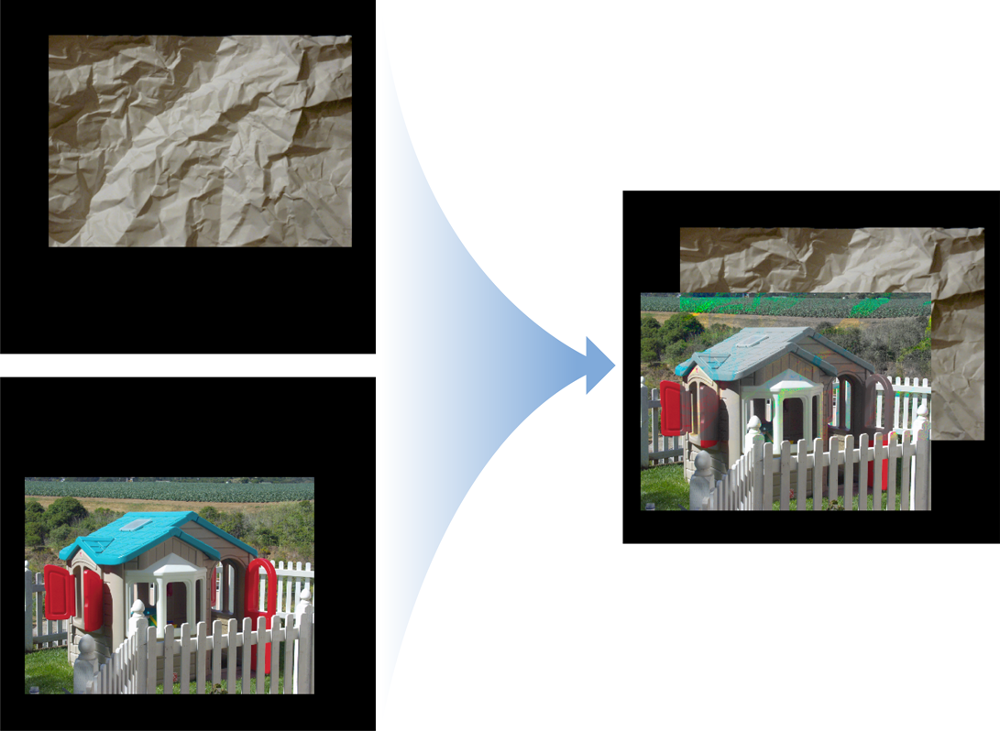

  #### Availability

  Available in OS X v10.4 and later and in iOS 6.0 and later.
- `
  [CIScreenBlendMode](#apple-f4xwc4dqnrsv64tfmyxwi33df5tgs3dumvzc6y3jf5busu3dojswk3scnrsw4zcnn5sgk)`

  Multiplies the inverse of the input image samples with the inverse of the background image samples.

  #### Localized Display Name

  Screen Blend Mode

  #### Parameters

|  |  |
| --- | --- |
| `inputImage` | A `CIImage` object whose display name is Image. |
| `inputBackgroundImage` | A `CIImage` object whose display name is Background Image. |

  #### Discussion

  This results in colors that are at least as light as either of the two contributing sample colors. The formula used to create this filter is described in the PDF specification, which is available online from the Adobe Developer Center. See [PDF Reference and Adobe Extensions to the PDF Specification](http://www.adobe.com/devnet/pdf/pdf_reference.html).

  #### Member Of

  `CICategoryBuiltIn`, `CICategoryNonSquarePixels`, `CICategoryInterlaced`, `CICategoryStillImage`, `CICategoryVideo`, `CICategoryCompositeOperation`

  #### Sample Output

  __Figure 63__The result of using the CIScreenBlendMode filter
  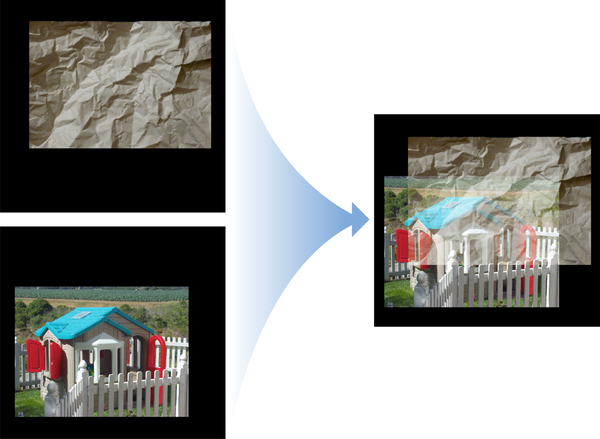

  #### Availability

  Available in OS X v10.4 and later and in iOS 6.0 and later.
- `
  [CISoftLightBlendMode](#apple-f4xwc4dqnrsv64tfmyxwi33df5tgs3dumvzc6y3jf5busu3pmz2ey2lhnb2ee3dfnzse233emu)`

  Either darkens or lightens colors, depending on the input image sample color.

  #### Localized Display Name

  Soft Light Blend Mode

  #### Parameters

|  |  |
| --- | --- |
| `inputImage` | A `CIImage` object whose display name is Image. |
| `inputBackgroundImage` | A `CIImage` object whose display name is Background Image. |

  #### Discussion

  If the source image sample color is lighter than 50% gray, the background is lightened, similar to dodging. If the source image sample color is darker than 50% gray, the background is darkened, similar to burning. If the source image sample color is equal to 50% gray, the background is not changed. Image samples that are equal to pure black or pure white produce darker or lighter areas, but do not result in pure black or white. The overall effect is similar to what you would achieve by shining a diffuse spotlight on the source image. The formula used to create this filter is described in the PDF specification, which is available online from the Adobe Developer Center. See [PDF Reference and Adobe Extensions to the PDF Specification](http://www.adobe.com/devnet/pdf/pdf_reference.html).

  #### Member Of

  `CICategoryBuiltIn`, `CICategoryNonSquarePixels`, `CICategoryInterlaced`, `CICategoryStillImage`, `CICategoryVideo`, `CICategoryCompositeOperation`

  #### Sample Output

  __Figure 64__The result of using the CISoftLightBlendMode filter
  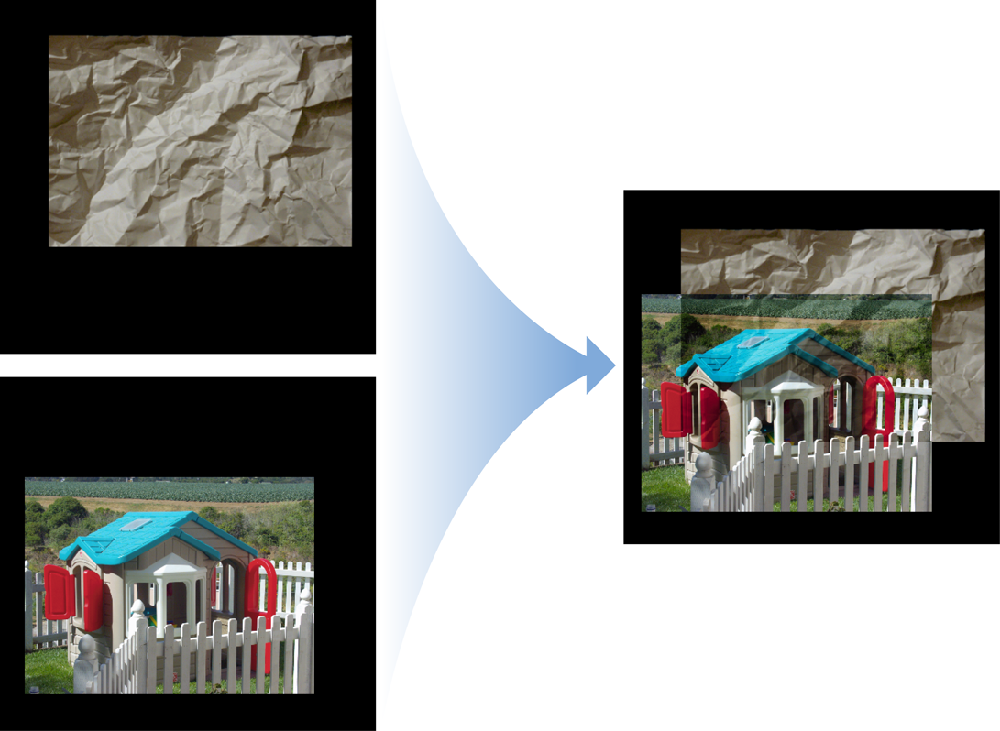

  #### Availability

  Available in OS X v10.4 and later and in iOS 6.0 and later.
- `
  [CISourceAtopCompositing](#apple-f4xwc4dqnrsv64tfmyxwi33df5tgs3dumvzc6y3jf5busu3povzggzkborxxaq3pnvyg643joruw4zy)`

  Places the input image over the background image, then uses the luminance of the background image to determine what to show.

  #### Localized Display Name

  Source Atop

  #### Parameters

|  |  |
| --- | --- |
| `inputImage` | A `CIImage` object whose display name is Image. |
| `inputBackgroundImage` | A `CIImage` object whose display name is Background Image. |

  #### Discussion

  The composite shows the background image and only those portions of the source image that are over visible parts of the background. The formula used to create this filter is described in Thomas Porter and Tom Duff. 1984. [Compositing Digital Images](http://keithp.com/~keithp/porterduff/p253-porter.pdf). _Computer Graphics_, 18 (3): 253-259.

  #### Member Of

  `CICategoryBuiltIn`, `CICategoryHighDynamicRange`, `CICategoryNonSquarePixels`, `CICategoryInterlaced`, `CICategoryStillImage`, `CICategoryVideo`, `CICategoryCompositeOperation`

  #### Sample Output

  __Figure 65__The result of using the CISourceAtopCompositing filter
  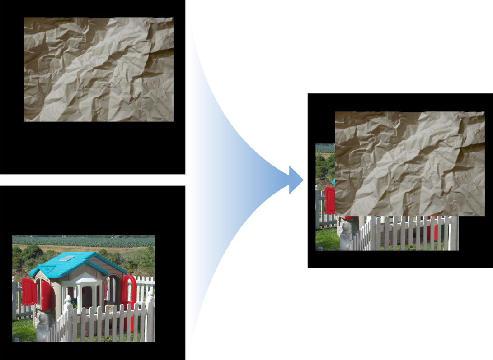

  #### Availability

  Available in OS X v10.4 and later and in iOS 6.0 and later.
- `
  [CISourceInCompositing](#apple-f4xwc4dqnrsv64tfmyxwi33df5tgs3dumvzc6y3jf5busu3povzggzkjnzbw63lqn5zws5djnztq)`

  Uses the background image to define what to leave in the input image, effectively cropping the input image.

  #### Localized Display Name

  Source In

  #### Parameters

|  |  |
| --- | --- |
| `inputImage` | A `CIImage` object whose display name is Image. |
| `inputBackgroundImage` | A `CIImage` object whose display name is Background Image. |

  #### Discussion

  The formula used to create this filter is described in Thomas Porter and Tom Duff. 1984. [Compositing Digital Images](http://keithp.com/~keithp/porterduff/p253-porter.pdf). _Computer Graphics_, 18 (3): 253-259.

  #### Member Of

  `CICategoryBuiltIn`, `CICategoryHighDynamicRange`, `CICategoryNonSquarePixels`, `CICategoryInterlaced`, `CICategoryStillImage`, `CICategoryVideo`, `CICategoryCompositeOperation`

  #### Sample Output

  __Figure 66__The result of using the CISourceInCompositing filter
  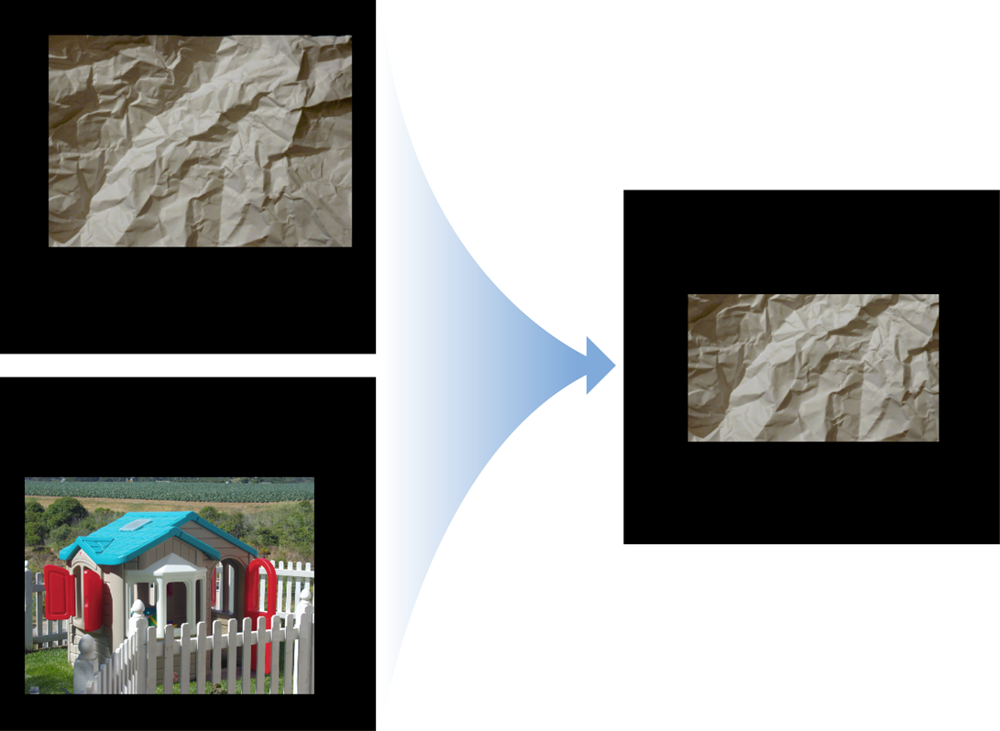

  #### Availability

  Available in OS X v10.4 and later and in iOS 6.0 and later.
- `
  [CISourceOutCompositing](#apple-f4xwc4dqnrsv64tfmyxwi33df5tgs3dumvzc6y3jf5busu3povzggzkpov2eg33nobxxg2lunfxgo)`

  Uses the background image to define what to take out of the input image.

  #### Localized Display Name

  Source Out

  #### Parameters

|  |  |
| --- | --- |
| `inputImage` | A `CIImage` object whose display name is Image. |
| `inputBackgroundImage` | A `CIImage` object whose display name is Background Image. |

  #### Discussion

  The formula used to create this filter is described in Thomas Porter and Tom Duff. 1984. [Compositing Digital Images](http://keithp.com/~keithp/porterduff/p253-porter.pdf). _Computer Graphics_, 18 (3): 253-259.

  #### Member Of

  `CICategoryBuiltIn`, `CICategoryHighDynamicRange`, `CICategoryNonSquarePixels`, `CICategoryInterlaced`, `CICategoryStillImage`, `CICategoryVideo`, `CICategoryCompositeOperation`

  #### Sample Output

  __Figure 67__The result of using the CISourceOutCompositing filter
  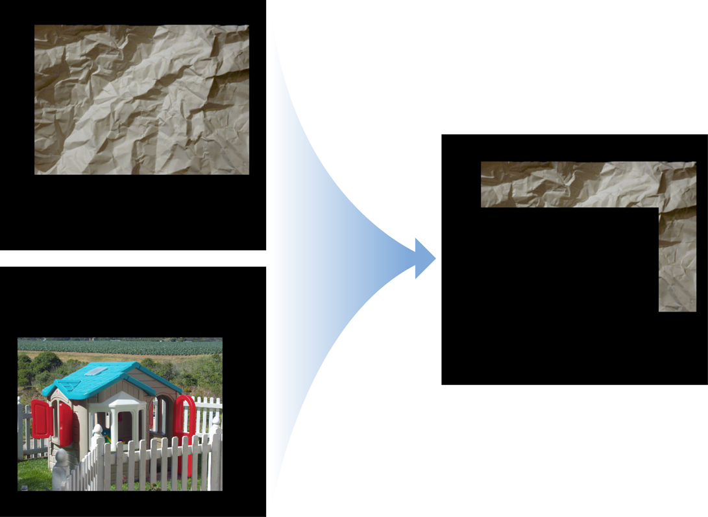

  #### Availability

  Available in OS X v10.4 and later and in iOS 6.0 and later.
- `
  [CISourceOverCompositing](#apple-f4xwc4dqnrsv64tfmyxwi33df5tgs3dumvzc6y3jf5busu3povzggzkpozsxeq3pnvyg643joruw4zy)`

  Places the input image over the input background image.

  #### Localized Display Name

  Source Over

  #### Parameters

|  |  |
| --- | --- |
| `inputImage` | A `CIImage` object whose display name is Image. |
| `inputBackgroundImage` | A `CIImage` object whose display name is Background Image. |

  #### Discussion

  The formula used to create this filter is described in Thomas Porter and Tom Duff. 1984. [Compositing Digital Images](http://keithp.com/~keithp/porterduff/p253-porter.pdf). _Computer Graphics_, 18 (3): 253-259.

  #### Member Of

  `CICategoryBuiltIn`, `CICategoryHighDynamicRange`, `CICategoryNonSquarePixels`, `CICategoryInterlaced`, `CICategoryStillImage`, `CICategoryVideo`, `CICategoryCompositeOperation`

  #### Sample Output

  __Figure 68__The result of using the CISourceOverCompositing filter
  

  #### Availability

  Available in OS X v10.4 and later and in iOS 5.0 and later.
- `
  [CISubtractBlendMode](#apple-f4xwc4dqnrsv64tfmyxwi33df5tgs3dumvzc6y3jf5busu3vmj2heyldorbgyzlomrgw6zdf)`

  Subtracts the background image sample color from the source image sample color.

  #### Localized Display Name

  Subtract Blend Mode

  #### Parameters

|  |  |
| --- | --- |
| `inputImage` | A `CIImage` object whose display name is Image. |
| `inputBackgroundImage` | A `CIImage` object whose display name is Background Image. |

  #### Member Of

  `CICategoryCompositeOperation`, `CICategoryVideo`, `CICategoryStillImage`, `CICategoryInterlaced`, `CICategoryNonSquarePixels`, `CICategoryBuiltIn`

  #### Sample Output

  __Figure 69__The result of using the CISubtractBlendMode filter
  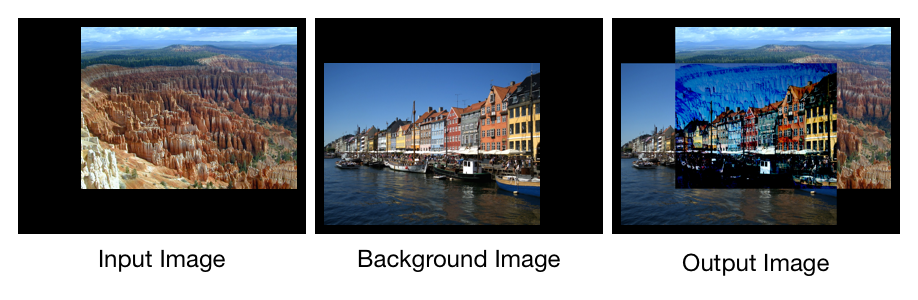

  #### Availability

  Available in OS X v10.10 and later and in iOS 8.0 and later.

[### CICategoryDistortionEffect](#apple-f4xwc4dqnrsv64tfmyxwi33df52wszbpkridgmbqgaydcmzwfvjvomjrha)

- `
  [CIBumpDistortion](#apple-f4xwc4dqnrsv64tfmyxwi33df5tgs3dumvzc6y3jf5busqtvnvyei2ltorxxe5djn5xa)`

  Creates a bump that originates at a specified point in the image.

  #### Localized Display Name

  Bump Distortion

  #### Parameters

|  |  |
| --- | --- |
| `inputImage` | A `CIImage` object whose display name is Image. |
| `inputCenter` | A `CIVector` object whose attribute type is `CIAttributeTypePosition` and whose display name is Center.  Default value: [150 150] |
| `inputRadius` | An `NSNumber` object whose attribute type is `CIAttributeTypeDistance` and whose display name is Radius.  Default value: 300.00 |
| `inputScale` | An `NSNumber` object whose attribute type is `CIAttributeTypeScalar` and whose display name is Scale.  Default value: 0.50 |

  #### Discussion

  The bump can be concave or convex.

  #### Member Of

  `CICategoryBuiltIn`, `CICategoryStillImage`, `CICategoryVideo`, `CICategoryDistortionEffect`

  #### Sample Output

  __Figure 70__The result of using the CIBumpDistortion filter
  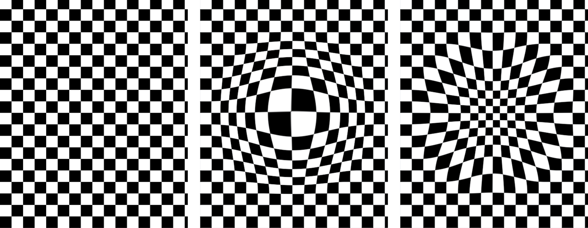

  #### Availability

  Available in OS X v10.4 and later and in iOS 7.0 and later.
- `
  [CIBumpDistortionLinear](#apple-f4xwc4dqnrsv64tfmyxwi33df5tgs3dumvzc6y3jf5busqtvnvyei2ltorxxe5djn5xey2lomvqxe)`

  Creates a concave or convex distortion that originates from a line in the image.

  #### Localized Display Name

  CIBumpDistortionLinear

  #### Parameters

|  |  |
| --- | --- |
| `inputImage` | A `CIImage` object whose display name is Image. |
| `inputCenter` | A `CIVector` object whose attribute type is `CIAttributeTypePosition` and whose display name is Center.  Default value: [300 300] |
| `inputRadius` | An `NSNumber` object whose attribute type is `CIAttributeTypeDistance` and whose display name is Radius.  Default value: 300.00 |
| `inputAngle` | An `NSNumber` object whose attribute type is `CIAttributeTypeAngle` and whose display name is Angle.  Default value: 0.00 |
| `inputScale` | An `NSNumber` object whose attribute type is `CIAttributeTypeScalar` and whose display name is Scale.  Default value: 0.50 |

  #### Member Of

  `CICategoryBuiltIn`, `CICategoryStillImage`, `CICategoryVideo`, `CICategoryDistortionEffect`

  #### Sample Output

  __Figure 71__The result of using the CIBumpDistortionLinear filter
  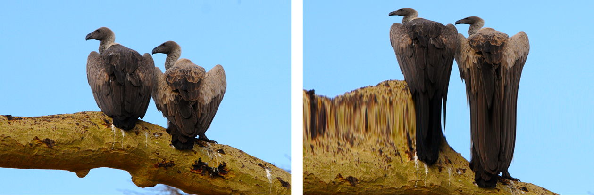

  #### Availability

  Available in OS X v10.5 and later.
- `
  [CICircleSplashDistortion](#apple-f4xwc4dqnrsv64tfmyxwi33df5tgs3dumvzc6y3jf5busq3jojrwyzktobwgc43iiruxg5dpoj2gs33o)`

  Distorts the pixels starting at the circumference of a circle and emanating outward.

  #### Localized Display Name

  Circle Splash Distortion

  #### Parameters

|  |  |
| --- | --- |
| `inputImage` | A `CIImage` object whose display name is Image. |
| `inputCenter` | A `CIVector` object whose attribute type is `CIAttributeTypePosition` and whose display name is Center.  Default value: [150 150] |
| `inputRadius` | An `NSNumber` object whose attribute type is `CIAttributeTypeDistance` and whose display name is Radius.  Default value: 150.00 |

  #### Member Of

  `CICategoryBuiltIn`, `CICategoryStillImage`, `CICategoryVideo`, `CICategoryDistortionEffect`

  #### Sample Output

  __Figure 72__The result of using the CICircleSplashDistortion filter
  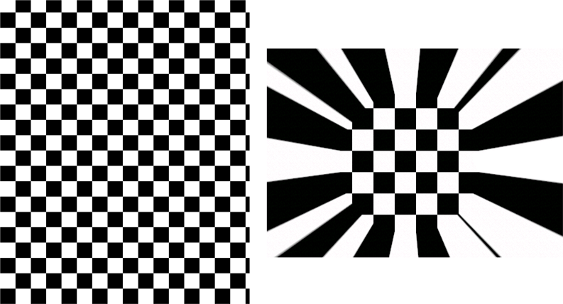

  #### Availability

  Available in OS X v10.4 and later and in iOS 6.0 and later.
- `
  [CICircularWrap](#apple-f4xwc4dqnrsv64tfmyxwi33df5tgs3dumvzc6y3jf5busq3jojrxk3dbojlxeylq)`

  Wraps an image around a transparent circle.

  #### Localized Display Name

  Circular Wrap Distortion

  #### Parameters

|  |  |
| --- | --- |
| `inputImage` | A `CIImage` object whose display name is Image. |
| `inputCenter` | A `CIVector` object whose attribute type is `CIAttributeTypePosition` and whose display name is Center.  Default value: [150 150] |
| `inputRadius` | An `NSNumber` object whose attribute type is `CIAttributeTypeDistance` and whose display name is Radius.  Default value: 150.00 |
| `inputAngle` | An `NSNumber` object whose attribute type is `CIAttributeTypeAngle` and whose display name is Angle.  Default value: 0.00 |

  #### Discussion

  The distortion of the image increases with the distance from the center of the circle.

  #### Member Of

  `CICategoryBuiltIn`, `CICategoryStillImage`, `CICategoryVideo`, `CICategoryDistortionEffect`

  #### Sample Output

  __Figure 73__The result of using the CICircularWrap filter
  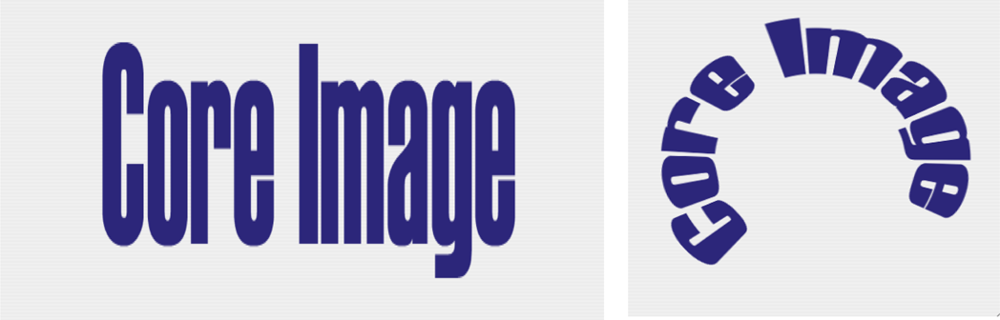

  #### Availability

  Available in OS X v10.5 and later and in iOS 9 and later.
- `
  [CIDroste](#apple-f4xwc4dqnrsv64tfmyxwi33df5tgs3dumvzc6y3jf5busrdsn5zxizi)`

  Recursively draws a portion of an image in imitation of an M. C. Escher drawing.

  #### Localized Display Name

  Droste

  #### Parameters

|  |  |
| --- | --- |
| `inputImage` | A `CIImage` object whose display name is Image. |
| `inputInsetPoint0` | A `CIVector` object whose attribute type is `CIAttributeTypePosition`.  Default value: [200 200] |
| `inputInsetPoint1` | A `CIVector` object whose attribute type is `CIAttributeTypePosition`.  Default value: [400 400] |
| `inputStrands` | An `NSNumber` object whose attribute type is `CIAttributeTypeDistance` and whose display name is Radius.  Default value: 1 |
| `inputPeriodicity` | An `NSNumber` object whose attribute type is `CIAttributeTypeDistance`.  Default value: 1 |
| `inputRotation` | An `NSNumber` object whose attribute type is `CIAttributeTypeDistance`.  Default value: 0.00 |
| `inputZoom` | An `NSNumber` object whose attribute type is `CIAttributeTypeScalar`.  Default value: 1 |

  #### Member Of

  `CICategoryBuiltIn`, `CICategoryStillImage`, `ToneCuCICategoryVideo`, `CICategoryDistortionEffect`

  #### Sample Output

  __Figure 74__The result of using the CIDroste filter
  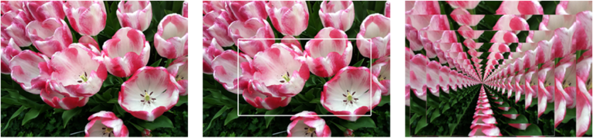

  #### Availability

  Available in OS X v10.6 and later and in iOS 9 and later.
- `
  [CIDisplacementDistortion](#apple-f4xwc4dqnrsv64tfmyxwi33df5tgs3dumvzc6y3jf5busrdjonygyyldmvwwk3tuiruxg5dpoj2gs33o)`

  Applies the grayscale values of the second image to the first image.

  #### Localized Display Name

  Displacement Distortion

  #### Parameters

|  |  |
| --- | --- |
| `inputImage` | A `CIImage` object whose display name is Image. |
| `inputDisplacementImage` | A `CIImage` object whose display name is Displacement Image. |
| `inputScale` | An `NSNumber` object whose attribute type is `CIAttributeTypeDistance` and whose display name is Scale.  Default value: 50.00 |

  #### Discussion

  The output image has a texture defined by the grayscale values.

  #### Member Of

  `CICategoryBuiltIn`, `CICategoryStillImage`, `CICategoryVideo`, `CICategoryDistortionEffect`

  #### Sample Output

  __Figure 75__The result of using the CIDisplacementDistortion filter
  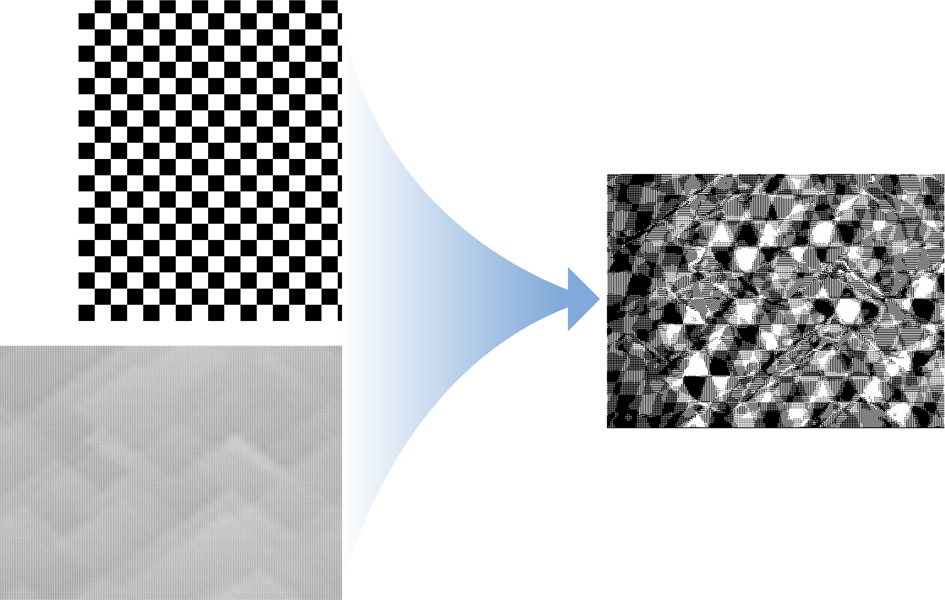

  #### Availability

  Available in OS X v10.4 and later and in iOS 9 and later.
- `
  [CIGlassDistortion](#apple-f4xwc4dqnrsv64tfmyxwi33df5tgs3dumvzc6y3jf5busr3mmfzxgrdjon2g64tunfxw4)`

  Distorts an image by applying a glass-like texture.

  #### Localized Display Name

  Glass Distortion

  #### Parameters

|  |  |
| --- | --- |
| `inputImage` | A `CIImage` object whose display name is Image. |
| `inputTexture` | A `CIImage` object whose display name is Texture. |
| `inputCenter` | A `CIVector` object whose attribute type is `CIAttributeTypePosition` and whose display name is Center.  Default value: [150 150] Identity: (null) |
| `inputScale` | An `NSNumber` object whose attribute type is `CIAttributeTypeDistance` and whose display name is Scale.  Default value: 200.00 |

  #### Discussion

  The raised portions of the output image are the result of applying a texture map.

  #### Member Of

  `CICategoryBuiltIn`, `CICategoryStillImage`, `CICategoryVideo`, `CICategoryDistortionEffect`

  #### Sample Output

  __Figure 76__The result of using the CIGlassDistortion filter
  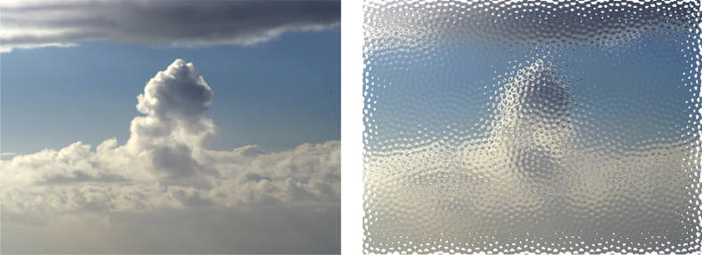

  #### Availability

  Available in OS X v10.4 and later and in iOS 8.0 and later.
- `
  [CIGlassLozenge](#apple-f4xwc4dqnrsv64tfmyxwi33df5tgs3dumvzc6y3jf5busr3mmfzxgtdppjsw4z3f)`

  Creates a lozenge-shaped lens and distorts the portion of the image over which the lens is placed.

  #### Localized Display Name

  Glass Lozenge

  #### Parameters

|  |  |
| --- | --- |
| `inputImage` | A `CIImage` object whose display name is Image. |
| `inputPoint0` | A `CIVector` object whose attribute type is `CIAttributeTypePosition` and whose display name is Point 1.  Default value: [150 150] |
| `inputPoint1` | A `CIVector` object whose attribute type is `CIAttributeTypePosition` and whose display name is Point 2.  Default value: [350 150] |
| `inputRadius` | An `NSNumber` object whose attribute type is `CIAttributeTypeDistance` and whose display name is Radius.  Default value: 100.00 |
| `inputRefraction` | An `NSNumber` object whose attribute type is `CIAttributeTypeScalar` and whose display name is Refraction.  Default value: 1.70 |

  #### Member Of

  `CICategoryBuiltIn`, `CICategoryStillImage`, `CICategoryVideo`, `CICategoryDistortionEffect`

  #### Sample Output

  __Figure 77__The result of using the CIGlassLozenge filter
  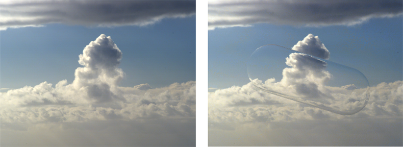

  #### Availability

  Available in OS X v10.4 and later and in iOS 9 and later.
- `
  [CIHoleDistortion](#apple-f4xwc4dqnrsv64tfmyxwi33df5tgs3dumvzc6y3jf5bussdpnrsui2ltorxxe5djn5xa)`

  Creates a circular area that pushes the image pixels outward, distorting those pixels closest to the circle the most.

  #### Localized Display Name

  Hole Distortion

  #### Parameters

|  |  |
| --- | --- |
| `inputImage` | A `CIImage` object whose display name is Image. |
| `inputCenter` | A `CIVector` object whose attribute type is `CIAttributeTypePosition` and whose display name is Center.  Default value: [150 150] |
| `inputRadius` | An `NSNumber` object whose attribute type is `CIAttributeTypeDistance` and whose display name is Radius.  Default value: 150.00 |

  #### Member Of

  `CICategoryBuiltIn`, `CICategoryStillImage`, `CICategoryVideo`, `CICategoryDistortionEffect`

  #### Sample Output

  __Figure 78__The result of using the CIHoleDistortion filter
  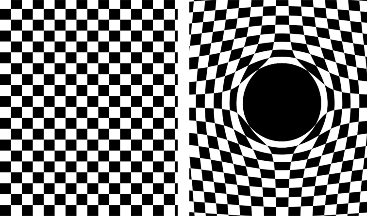

  #### Availability

  Available in OS X v10.4 and later and in iOS 6.0 and later.
- `
  [CILightTunnel](#apple-f4xwc4dqnrsv64tfmyxwi33df5tgs3dumvzc6y3jf5bustdjm5uhivdvnzxgk3a)`

  Rotates a portion of the input image specified by the center and radius parameters to give a tunneling effect.

  #### Localized Display Name

  Light Tunnel

  #### Parameters

|  |  |
| --- | --- |
| `inputImage` | A `CIImage` object whose display name is Image. |
| `inputCenter` | A `CIVector` object whose attribute type is `CIAttributeTypePosition`.  Default value: [150 150] |
| `inputRotation` | An `NSNumber` object whose attribute type is `CIAttributeTypeAngle`.  Default value: 0.00 |
| `inputRadius` | An `NSNumber` object whose attribute type is `CIAttributeTypeAngle`.  Default value: 0.00 |

  #### Member Of

  `CICategoryBuiltIn`, `CICategoryStillImage`, `CICategoryVideo`, `CICategoryDistortionEffect`

  #### Sample Output

  __Figure 79__The result of using the CILightTunnel filter
  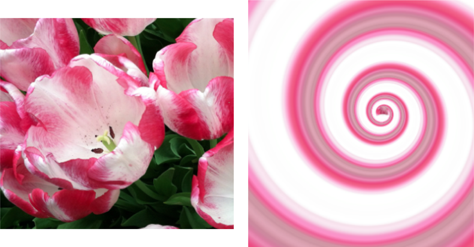

  #### Availability

  Available in OS X v10.11 and later and in iOS 6.0 and later.
- `
  [CIPinchDistortion](#apple-f4xwc4dqnrsv64tfmyxwi33df5tgs3dumvzc6y3jf5busudjnzrwqrdjon2g64tunfxw4)`

  Creates a rectangular area that pinches source pixels inward, distorting those pixels closest to the rectangle the most.

  #### Localized Display Name

  Pinch Distortion

  #### Parameters

|  |  |
| --- | --- |
| `inputImage` | A `CIImage` object whose display name is Image. |
| `inputCenter` | A `CIVector` object whose attribute type is `CIAttributeTypePosition` and whose display name is Center.  Default value: [150 150] |
| `inputRadius` | An `NSNumber` object whose attribute type is `CIAttributeTypeDistance` and whose display name is Radius.  Default value: 300.00 |
| `inputScale` | An `NSNumber` object whose attribute type is `CIAttributeTypeScalar` and whose display name is Scale.  Default value: 0.50 |

  #### Member Of

  `CICategoryBuiltIn`, `CICategoryStillImage`, `CICategoryVideo`, `CICategoryDistortionEffect`

  #### Sample Output

  __Figure 80__The result of using the CIPinchDistortion filter
  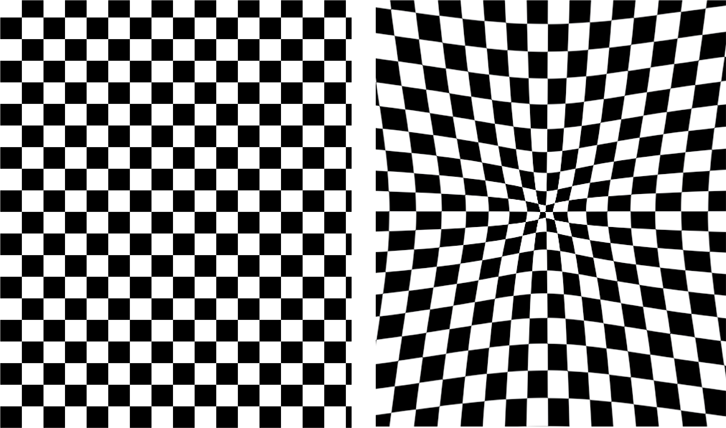

  #### Availability

  Available in OS X v10.4 and later and in iOS 6.0 and later.
- `
  [CIStretchCrop](#apple-f4xwc4dqnrsv64tfmyxwi33df5tgs3dumvzc6y3jf5busu3uojsxiy3iinzg64a)`

  Distorts an image by stretching and or cropping it to fit a target size.

  #### Localized Display Name

  CIStretchCrop

  #### Parameters

|  |  |
| --- | --- |
| `inputImage` | A `CIImage` object whose display name is Image. |
| `inputSize` | A `CIVector` object whose display name is Size. This value specifies the size of the output image in pixels. |
| `inputCropAmount` | An `NSNumber` object whose display name is CropAmount. This value determines if, and how much, cropping should be used to achieve the target size. If the value is 0, the image is stretched but not cropped. If the value is 1, the image is cropped but not stretched. Values in-between use stretching and cropping proportionally. |
| `inputCenterStretchAmount` | An `NSNumber` object whose display name is CenterStretchAmount. This value determines how much stretching to apply to the center of the image, if stretching is indicated by the `inputCropAmount` value. A value of 0 causes the center of the image to maintain its original aspect ratio. A value of 1 causes the image to be stretched uniformly. |

  #### Member Of

  `CICategoryBuiltIn`, `CICategoryStillImage`, `CICategoryVideo`, `CICategoryDistortionEffect`

  #### Sample Output

  __Figure 81__The result of using the CIStretchCrop filter
  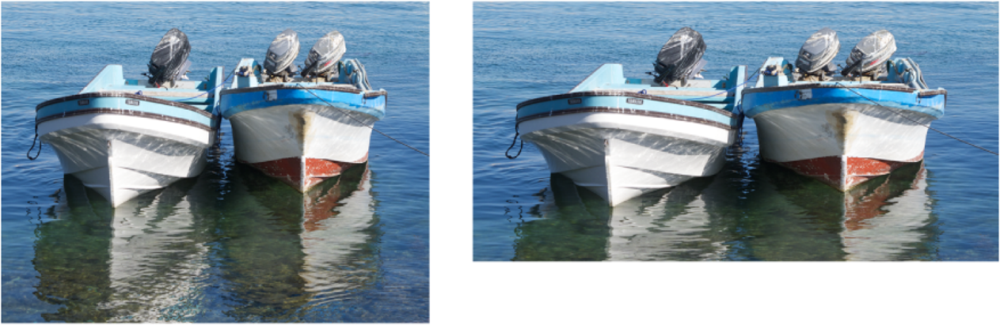

  #### Availability

  Available in OS X v10.6 and later and in iOS 9 and later.
- `
  [CITorusLensDistortion](#apple-f4xwc4dqnrsv64tfmyxwi33df5tgs3dumvzc6y3jf5busvdpoj2xgtdfnzzui2ltorxxe5djn5xa)`

  Creates a torus-shaped lens and distorts the portion of the image over which the lens is placed.

  #### Localized Display Name

  Torus Lens Distortion

  #### Parameters

|  |  |
| --- | --- |
| `inputImage` | A `CIImage` object whose display name is Image. |
| `inputCenter` | A `CIVector` object whose attribute type is `CIAttributeTypePosition` and whose display name is Center.  Default value: [150 150] |
| `inputRadius` | An `NSNumber` object whose attribute type is `CIAttributeTypeDistance` and whose display name is Radius.  Default value: 160.00 |
| `inputWidth` | An `NSNumber` object whose attribute type is `CIAttributeTypeDistance` and whose display name is Width.  Default value: 80.00 |
| `inputRefraction` | An `NSNumber` object whose attribute type is `CIAttributeTypeScalar` and whose display name is Refraction.  Default value: 1.70 |

  #### Member Of

  `CICategoryBuiltIn`, `CICategoryStillImage`, `CICategoryVideo`, `CICategoryDistortionEffect`

  #### Sample Output

  __Figure 82__The result of using the CITorusLensDistortion filter
  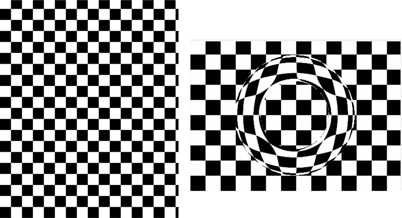

  #### Availability

  Available in OS X v10.4 and later and in iOS 9 and later.
- `
  [CITwirlDistortion](#apple-f4xwc4dqnrsv64tfmyxwi33df5tgs3dumvzc6y3jf5busvdxnfzgyrdjon2g64tunfxw4)`

  Rotates pixels around a point to give a twirling effect.

  #### Localized Display Name

  Twirl Distortion

  #### Parameters

|  |  |
| --- | --- |
| `inputImage` | A `CIImage` object whose display name is Image. |
| `inputCenter` | A `CIVector` object whose attribute type is `CIAttributeTypePosition` and whose display name is Center.  Default value: [150 150] |
| `inputRadius` | An `NSNumber` object whose attribute type is `CIAttributeTypeDistance` and whose display name is Radius.  Default value: 300.00 |
| `inputAngle` | An `NSNumber` object whose attribute type is `CIAttributeTypeAngle` and whose display name is Angle.  Default value: 3.14 |

  #### Discussion

  You can specify the number of rotations as well as the center and radius of the effect.

  #### Member Of

  `CICategoryBuiltIn`, `CICategoryStillImage`, `CICategoryVideo`, `CICategoryDistortionEffect`

  #### Sample Output

  __Figure 83__The result of using the CITwirlDistortion filter
  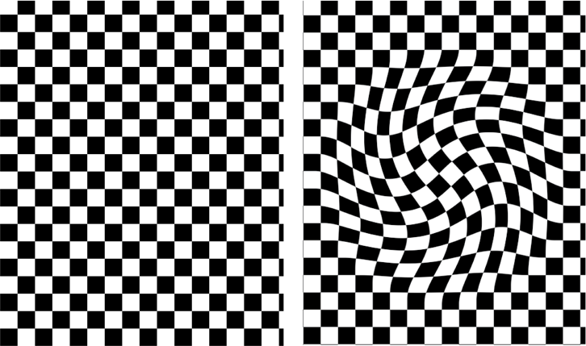

  #### Availability

  Available in OS X v10.4 and later and in iOS 6.0 and later.
- `
  [CIVortexDistortion](#apple-f4xwc4dqnrsv64tfmyxwi33df5tgs3dumvzc6y3jf5busvtpoj2gk6cenfzxi33soruw63q)`

  Rotates pixels around a point to simulate a vortex.

  #### Localized Display Name

  Vortex Distortion

  #### Parameters

|  |  |
| --- | --- |
| `inputImage` | A `CIImage` object whose display name is Image. |
| `inputCenter` | A `CIVector` object whose attribute type is `CIAttributeTypePosition` and whose display name is Center.  Default value: [150 150] |
| `inputRadius` | An `NSNumber` object whose attribute type is `CIAttributeTypeDistance` and whose display name is Radius.  Default value: 300.00 |
| `inputAngle` | An `NSNumber` object whose attribute type is `CIAttributeTypeAngle` and whose display name is Angle.  Default value: 56.55 |

  #### Discussion

  You can specify the number of rotations as well the center and radius of the effect.

  #### Member Of

  `CICategoryBuiltIn`, `CICategoryStillImage`, `CICategoryVideo`, `CICategoryDistortionEffect`

  #### Sample Output

  __Figure 84__The result of using the CIVortexDistortion filter
  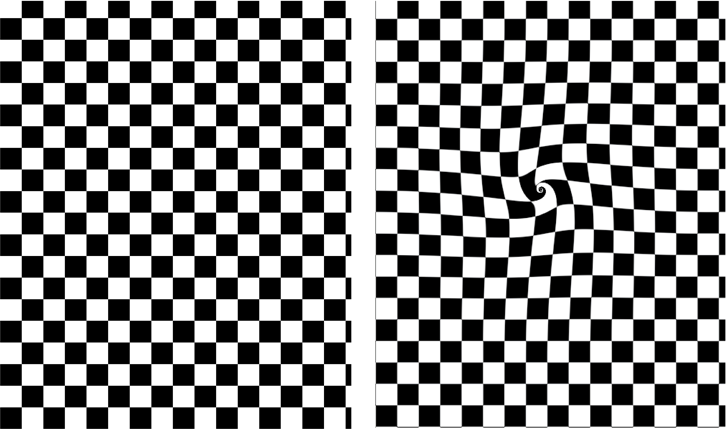

  #### Availability

  Available in OS X v10.4 and later and in iOS 6.0 and later.

[### CICategoryGenerator](#apple-f4xwc4dqnrsv64tfmyxwi33df52wszbpkridgmbqgaydcmzwfvjvomjugi)

- `
  [CIAztecCodeGenerator](#apple-f4xwc4dqnrsv64tfmyxwi33df5tgs3dumvzc6y3jf5busql2orswgq3pmrsuozlomvzgc5dpoi)`

  Generates an Aztec code (two-dimensional barcode) from input data.

  #### Localized Display Name

  CIAztecCodeGenerator

  #### Parameters

|  |  |
| --- | --- |
| `inputMessage` | The data to be encoded as an Aztec code. An `NSData` object whose display name is Message. |
| `inputCorrectionLevel` | The percentage of redundancy to add to the message data in the barcode encoding. A higher correction level allows a barcode to be correctly read even when partially damaged.  An `NSNumber` object whose display name is CorrectionLevel.  Default value: 23.00 Minimum: 5.00 Maximum: 95.00 Slider minimum: 5.00 Slider maximum: 95.00 Identity: 0.00 |
| `inputLayers` | The number of concentric squares (with a width of two pixels each) encoding the barcode data. When this parameter is set to zero, Core Image automatically determines the appropriate number of layers to encode the message at the specified correction level.  An `NSNumber` object whose display name is Layers.  Default value: 0.00 Minimum: 1.00 Maximum: 32.00 Slider minimum: 1.00 Slider maximum: 32.00 Identity: 0.00 |
| `inputCompactStyle` | A Boolean value that determines whether to use the compact or full-size Aztec barcode format. The compact format can store up to 44 bytes of message data (including data added for correction) in up to 4 layers, producing a barcode image sized between 15 x 15 and 27 x 27 pixels. The full-size format can store up to 1914 bytes of message data (including correction) in up to 32 layers, producing a barcode image sized no larger than 151 x 151 pixels.  An `NSNumber` object whose display name is CompactStyle.  Default value: 0.00 Minimum: 0.00 Maximum: 1.00 Slider minimum: 0.00 Slider maximum: 1.00 Identity: 0.00 |

  #### Discussion

  Generates an output image representing the input data according to the ISO/IEC 24778:2008 standard. The width and height of each module (square dot) of the code in the output image is one pixel. To create an Aztec code from a string or URL, convert it to an [NSData](https://developer.apple.com/library/archive/documentation/LegacyTechnologies/WebObjects/WebObjects_3.5/Reference/Frameworks/ObjC/Foundation/Classes/NSDataClassCluster/Description.html#//apple_ref/occ/cl/NSData) object using the [NSISOLatin1StringEncoding](https://developer.apple.com/library/archive/documentation/LegacyTechnologies/WebObjects/WebObjects_3.5/Reference/Frameworks/ObjC/Foundation/TypesAndConstants/FoundationTypesConstants/Description.html#//apple_ref/c/econst/NSISOLatin1StringEncoding) string encoding. The output image also includes two pixels of padding on each side (for example, a 15 x 15 code creates a 19 x 19 image).

  #### Member Of

  `CICategoryGenerator`, `CICategoryStillImage`, `CICategoryBuiltIn`

  #### Sample Output

  __Figure 85__The result of using the CIAztecCodeGenerator filter
  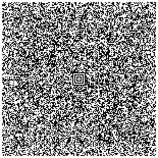

  #### Availability

  Available in OS X v10.10 and later and in iOS 8.0 and later.

  #### See Also

  `[CIQRCodeGenerator](#apple-f4xwc4dqnrsv64tfmyxwi33df5tgs3dumvzc6y3jf5busuksinxwizkhmvxgk4tborxxe)`
  `[CICode128BarcodeGenerator](#apple-f4xwc4dqnrsv64tfmyxwi33df5tgs3dumvzc6y3jf5busq3pmrstcmryijqxey3pmrsuozlomvzgc5dpoi)`
- `
  [CICheckerboardGenerator](#apple-f4xwc4dqnrsv64tfmyxwi33df5tgs3dumvzc6y3jf5busq3imvrwwzlsmjxwc4tei5sw4zlsmf2g64q)`

  Generates a checkerboard pattern.

  #### Localized Display Name

  Checkerboard

  #### Parameters

|  |  |
| --- | --- |
| `inputCenter` | A `CIVector` object whose attribute type is `CIAttributeTypePosition` and whose display name is Center.  Default value: [150 150] |
| `inputColor0` | A `CIColor` object whose display name is Color 1. |
| `inputColor1` | A `CIColor` object whose display name is Color 2. |
| `inputWidth` | An `NSNumber` object whose attribute type is `CIAttributeTypeDistance` and whose display name is Width.  Default value: 80.00 |
| `inputSharpness` | An `NSNumber` object whose attribute type is `CIAttributeTypeScalar` and whose display name is Sharpness.  Default value: 1.00 |

  #### Discussion

  You can specify the checkerboard size and colors, and the sharpness of the pattern.

  #### Member Of

  `CICategoryBuiltIn`, `CICategoryStillImage`, `CICategoryVideo`, `CICategoryGenerator`

  #### Sample Output

  __Figure 86__The result of using the CICheckerboardGenerator filter
  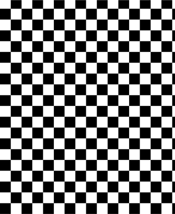

  #### Availability

  Available in OS X v10.4 and later and in iOS 6.0 and later.
- `
  [CICode128BarcodeGenerator](#apple-f4xwc4dqnrsv64tfmyxwi33df5tgs3dumvzc6y3jf5busq3pmrstcmryijqxey3pmrsuozlomvzgc5dpoi)`

  Generates a Code 128 one-dimensional barcode from input data.

  #### Localized Display Name

  CICode128BarcodeGenerator

  #### Parameters

|  |  |
| --- | --- |
| `inputMessage` | The data to be encoded as a Code 128 barcode. Must not contain non-ASCII characters. An `NSData` object whose display name is Message. |
| `inputQuietSpace` | The number of pixels of added white space on each side of the barcode. An `NSNumber` object whose attribute type is `CIAttributeTypeScalar` and whose display name is QuietSpace.  Default value: 7.00 Minimum: 0.00 Maximum: 20.00 Slider minimum: 0.00 Slider maximum: 20.00 Identity: 0.00 |

  #### Discussion

  Generates an output image representing the input data according to the ISO/IEC 15417:2007 standard. The width of each module (vertical line) of the barcode in the output image is one pixel. The height of the barcode is 32 pixels. To create a barcode from a string or URL, convert it to an [NSData](https://developer.apple.com/library/archive/documentation/LegacyTechnologies/WebObjects/WebObjects_3.5/Reference/Frameworks/ObjC/Foundation/Classes/NSDataClassCluster/Description.html#//apple_ref/occ/cl/NSData) object using the [NSASCIIStringEncoding](https://developer.apple.com/library/archive/documentation/LegacyTechnologies/WebObjects/WebObjects_3.5/Reference/Frameworks/ObjC/Foundation/TypesAndConstants/FoundationTypesConstants/Description.html#//apple_ref/c/econst/NSASCIIStringEncoding) string encoding.

  #### Member Of

  `CICategoryGenerator`, `CICategoryStillImage`, `CICategoryBuiltIn`

  #### Sample Output

  __Figure 87__The result of using the CICode128BarcodeGenerator filter
  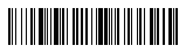

  #### Availability

  Available in OS X v10.10 and later and in iOS 8.0 and later.

  #### See Also

  `[CIAztecCodeGenerator](#apple-f4xwc4dqnrsv64tfmyxwi33df5tgs3dumvzc6y3jf5busql2orswgq3pmrsuozlomvzgc5dpoi)`
  `[CIQRCodeGenerator](#apple-f4xwc4dqnrsv64tfmyxwi33df5tgs3dumvzc6y3jf5busuksinxwizkhmvxgk4tborxxe)`
- `
  [CIConstantColorGenerator](#apple-f4xwc4dqnrsv64tfmyxwi33df5tgs3dumvzc6y3jf5busq3pnzzxiyloorbw63dpojdwk3tfojqxi33s)`

  Generates a solid color.

  #### Localized Display Name

  Constant Color

  #### Parameters

|  |  |
| --- | --- |
| `inputColor` | A `CIColor` object whose display name is Color. |

  #### Discussion

  You typically use the output of this filter as the input to another filter.

  #### Member Of

  `CICategoryBuiltIn`, `CICategoryStillImage`, `CICategoryVideo`, `CICategoryGenerator`

  #### Sample Output

  __Figure 88__The result of using the CIConstantColorGenerator filter
  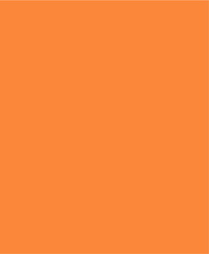

  #### Availability

  Available in OS X v10.4 and later and in iOS 5.0 and later.
- `
  [CILenticularHaloGenerator](#apple-f4xwc4dqnrsv64tfmyxwi33df5tgs3dumvzc6y3jf5bustdfnz2gsy3vnrqxesdbnrxuozlomvzgc5dpoi)`

  Simulates a lens flare.

  #### Localized Display Name

  Lenticular Halo

  #### Parameters

|  |  |
| --- | --- |
| `inputCenter` | The center of the lens flare. A `CIVector` object whose attribute type is `CIAttributeTypePosition` and whose display name is Center.  Default value: [150 150] |
| `inputColor` | Controls the proportion of red, green, and blue halos. A `CIColor` object whose display name is Color. |
| `inputHaloRadius` | Controls the size of the lens flare. An `NSNumber` object whose attribute type is `CIAttributeTypeDistance` and whose display name is Halo Radius.  Default value: 70.00 |
| `inputHaloWidth` | Controls the width of the lens flare, that is, the distance between the inner flare and the outer flare. An `NSNumber` object whose attribute type is `CIAttributeTypeDistance` and whose display name is Halo Width.  Default value: 87.00 |
| `inputHaloOverlap` | Controls how much the red, green, and blue halos overlap. A value of `0` means no overlap (a lot of separation). A value of `1` means full overlap (white halos). An `NSNumber` object whose attribute type is `CIAttributeTypeScalar` and whose display name is Halo Overlap.  Default value: 0.77 |
| `inputStriationStrength` | Controls the brightness of the rainbow-colored halo area. An `NSNumber` object whose attribute type is `CIAttributeTypeScalar` and whose display name is Striation Strength.  Default value: 0.50 |
| `inputStriationContrast` | Controls the contrast of the rainbow-colored halo area. An `NSNumber` object whose attribute type is `CIAttributeTypeScalar` and whose display name is Striation Contrast.  Default value: 1.00 |
| `inputTime` | Adds a randomness to the lens flare; it causes the flare to "sparkle" as it changes through various time values. An `NSNumber` object whose attribute type is `CIAttributeTypeScalar` and whose display name is Time.  Default value: 0.00 |

  #### Discussion

  This filter is typically applied to another image to simulate lens flares and similar effects.

  #### Member Of

  `CICategoryBuiltIn`, `CICategoryStillImage`, `CICategoryVideo`, `CICategoryGenerator`

  #### Sample Output

  __Figure 89__The result of using the CILenticularHaloGenerator filter
  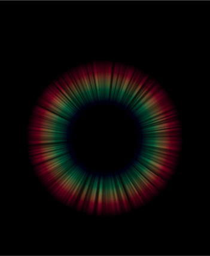

  #### Availability

  Available in OS X v10.4 and later and in iOS 9 and later.
- `
  [CIPDF417BarcodeGenerator](#apple-f4xwc4dqnrsv64tfmyxwi33df5tgs3dumvzc6y3jf5busuceiy2dcn2cmfzgg33emvdwk3tfojqxi33s)`

  Generates a PDF417 code (two-dimensional barcode) from input data.

  #### Localized Display Name

  PDF417 Barcode Generator

  #### Parameters

|  |  |
| --- | --- |
| `inputMessage` | The data to be encoded as a barcode. An `NSData` object whose display name is Message. |
| `inputMinWidth` | The minimum width of the barcode’s data area, in pixels. An `NSNumber` object whose display name is MinWidth.  Default value: 0.00 Minimum: 56.00 Maximum: 583.00 Slider minimum: 56.00 Slider maximum: 583.00 Identity: 0.00 |
| `inputMaxWidth` | The maximum width of the barcode’s data area, in pixels. An `NSNumber` object whose display name is MaxWidth.  Default value: 0.00 Minimum: 56.00 Maximum: 583.00 Slider minimum: 56.00 Slider maximum: 583.00 Identity: 0.00 |
| `inputMinHeight` | The minimum height of the barcode’s data area, in pixels. An `NSNumber` object whose display name is MinHeight.  Default value: 0.00 Minimum: 13.00 Maximum: 283.00 Slider minimum: 13.00 Slider maximum: 283.00 Identity: 0.00 |
| `inputMaxHeight` | The maximum height of the barcode’s data area, in pixels. An `NSNumber` object whose display name is MaxHeight.  Default value: 0.00 Minimum: 13.00 Maximum: 283.00 Slider minimum: 13.00 Slider maximum: 283.00 Identity: 0.00 |
| `inputDataColumns` | The number of data columns in the generated code. If zero, the generator uses a number of columns based on the width, height, and aspect ratio. An `NSNumber` object whose display name is DataColumns.  Default value: 0.00 Minimum: 1.00 Maximum: 30.00 Slider minimum: 1.00 Slider maximum: 30.00 Identity: 0.00 |
| `inputRows` | The number of data rows in the generated code. If zero, the generator uses a number of rows based on the width, height, and aspect ratio. An `NSNumber` object whose display name is Rows.  Default value: 0.00 Minimum: 3.00 Maximum: 90.00 Slider minimum: 3.00 Slider maximum: 90.00 Identity: 0.00 |
| `inputPreferredAspectRatio` | The preferred ratio of width over height for the generated barcode. The generator approximates this with an actual aspect ratio based on the data and other parameters you specify. An `NSNumber` object whose display name is PreferredAspectRatio.  Default value: 0.00 Minimum: 0.00 Maximum: 9223372036854775808.00 Slider minimum: 0.00 Slider maximum: 9223372036854775808.00 Identity: 0.00 |
| `inputCompactionMode` | An option that determines which method the generator uses to compress data.  1. Automatic. The generator automatically chooses a compression method. This option is the default. 2. Numeric. Valid only when the message is an ASCII-encoded string of digits, achieving optimal compression for that type of data. 3. Text. Valid only when the message is all ASCII-encoded alphanumeric and punctuation characters, achieving optimal compression for that type of data. 4. Byte. Valid for any data, but least compact. An `NSNumber` object whose display name is CompactionMode.  Default value: 0.00 Minimum: 0.00 Maximum: 3.00 Slider minimum: 0.00 Slider maximum: 3.00 Identity: 0.00 |
| `inputCompactStyle` | A Boolean value that determines whether to omit redundant elements to make the generated barcode more compact. An `NSNumber` object whose display name is CompactStyle.  Default value: 0.00 Minimum: 0.00 Maximum: 1.00 Slider minimum: 0.00 Slider maximum: 1.00 Identity: 0.00 |
| `inputCorrectionLevel` | An integer between 0 and 8, inclusive, that determines the amount of redundancy to include in the barcode’s data to prevent errors when the barcode is read. If unspecified, the generator chooses a correction level based on the size of the message data. An `NSNumber` object whose display name is CorrectionLevel.  Default value: 0.00 Minimum: 0.00 Maximum: 8.00 Slider minimum: 0.00 Slider maximum: 8.00 Identity: 0.00 |
| `inputAlwaysSpecifyCompaction` | A Boolean value that determines whether to include information about the compaction mode in the barcode even when such information is redundant. (If a PDF417 barcode does not contain compaction mode information, a reader assumes text-based compaction. Some barcodes include this information even when using text-based compaction.)  An `NSNumber` object whose display name is AlwaysSpecifyCompaction.  Default value: 0.00 Minimum: -9223372036854775808.00 Maximum: 9223372036854775808.00 Slider minimum: -9223372036854775808.00 Slider maximum: 9223372036854775808.00 Identity: 0.00 |

  #### Discussion

  Generates an output image representing the input data according to the ISO 15438 standard. PDF417 codes are commonly used in postage, package tracking, personal identification documents, and coffeeshop membership cards. The width and height of each module (square dot) of the code in the output image is one point. To create a PDF417 code from a string or URL, convert it to an [NSData](https://developer.apple.com/library/archive/documentation/LegacyTechnologies/WebObjects/WebObjects_3.5/Reference/Frameworks/ObjC/Foundation/Classes/NSDataClassCluster/Description.html#//apple_ref/occ/cl/NSData) object using the [NSISOLatin1StringEncoding](https://developer.apple.com/library/archive/documentation/LegacyTechnologies/WebObjects/WebObjects_3.5/Reference/Frameworks/ObjC/Foundation/TypesAndConstants/FoundationTypesConstants/Description.html#//apple_ref/c/econst/NSISOLatin1StringEncoding) string encoding.

  #### Member Of

  `CICategoryGenerator`, `CICategoryVideo`, `CICategoryStillImage`, `CICategoryBuiltIn`

  #### Sample Output

  __Figure 90__The result of using the CIPDF417BarcodeGenerator filter
  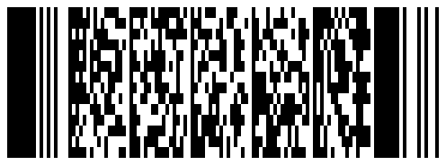

  #### Availability

  Available in OS X v10.11 and later and in iOS 9 and later.
- `
  [CIQRCodeGenerator](#apple-f4xwc4dqnrsv64tfmyxwi33df5tgs3dumvzc6y3jf5busuksinxwizkhmvxgk4tborxxe)`

  Generates a Quick Response code (two-dimensional barcode) from input data.

  #### Localized Display Name

  CIQRCodeGenerator

  #### Parameters

|  |  |
| --- | --- |
| `inputMessage` | The data to be encoded as a QR code. An `NSData` object whose display name is Message. |
| `inputCorrectionLevel` | A single letter specifying the error correction format. An `NSString` object whose display name is CorrectionLevel.  Default value: `M` |

  #### Discussion

  Generates an output image representing the input data according to the ISO/IEC 18004:2006 standard. The width and height of each module (square dot) of the code in the output image is one point. To create a QR code from a string or URL, convert it to an [NSData](https://developer.apple.com/library/archive/documentation/LegacyTechnologies/WebObjects/WebObjects_3.5/Reference/Frameworks/ObjC/Foundation/Classes/NSDataClassCluster/Description.html#//apple_ref/occ/cl/NSData) object using the [NSISOLatin1StringEncoding](https://developer.apple.com/library/archive/documentation/LegacyTechnologies/WebObjects/WebObjects_3.5/Reference/Frameworks/ObjC/Foundation/TypesAndConstants/FoundationTypesConstants/Description.html#//apple_ref/c/econst/NSISOLatin1StringEncoding) string encoding.

  The `inputCorrectionLevel` parameter controls the amount of additional data encoded in the output image to provide error correction. Higher levels of error correction result in larger output images but allow larger areas of the code to be damaged or obscured without. There are four possible correction modes (with corresponding error resilience levels):

  - `L`: 7%
  - `M`: 15%
  - `Q`: 25%
  - `H`: 30%

  #### Member Of

  `CICategoryBuiltIn`, `CICategoryStillImage`, `CICategoryGenerator`

  #### Sample Output

  __Figure 91__The result of using the CIQRCodeGenerator filter
  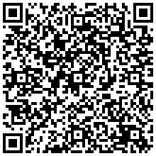

  #### Availability

  Available in OS X v10.9 and later and in iOS 7.0 and later.

  #### See Also

  `[CIAztecCodeGenerator](#apple-f4xwc4dqnrsv64tfmyxwi33df5tgs3dumvzc6y3jf5busql2orswgq3pmrsuozlomvzgc5dpoi)`
  `[CICode128BarcodeGenerator](#apple-f4xwc4dqnrsv64tfmyxwi33df5tgs3dumvzc6y3jf5busq3pmrstcmryijqxey3pmrsuozlomvzgc5dpoi)`
- `
  [CIRandomGenerator](#apple-f4xwc4dqnrsv64tfmyxwi33df5tgs3dumvzc6y3jf5busutbnzsg63khmvxgk4tborxxe)`

  Generates an image of infinite extent whose pixel values are made up of four independent, uniformly-distributed random numbers in the 0 to 1 range.

  #### Localized Display Name

  Random Generator

  #### Member Of

  `CICategoryBuiltIn`, `CICategoryStillImage`, `CICategoryVideo`, `CICategoryGenerator`

  #### Sample Output

  __Figure 92__The result of using the CIRandomGenerator filter
  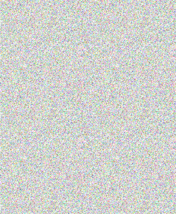

  #### Availability

  Available in OS X v10.4 and later and in iOS 6.0 and later.
- `
  [CIStarShineGenerator](#apple-f4xwc4dqnrsv64tfmyxwi33df5tgs3dumvzc6y3jf5busu3umfzfg2djnzsuozlomvzgc5dpoi)`

  Generates a starburst pattern that is similar to a supernova; can be used to simulate a lens flare.

  #### Localized Display Name

  Star Shine

  #### Parameters

|  |  |
| --- | --- |
| `inputCenter` | The center of the flare. A `CIVector` object whose attribute type is `CIAttributeTypePosition` and whose display name is Center.  Default value: [150 150] |
| `inputColor` | The color of the flare. A `CIColor` object whose display name is Color. |
| `inputRadius` | Controls the size of the flare. An `NSNumber` object whose attribute type is `CIAttributeTypeDistance` and whose display name is Radius.  Default value: 50.00 |
| `inputCrossScale` | Controls the ratio of the cross flare size relative to the round central flare. An `NSNumber` object whose attribute type is `CIAttributeTypeScalar` and whose display name is Cross Scale.  Default value: 15.00 |
| `inputCrossAngle` | Controls the angle of the flare. An `NSNumber` object whose attribute type is `CIAttributeTypeAngle` and whose display name is Cross Angle.  Default value: 0.60 |
| `inputCrossOpacity` | Controls the thickness of the cross flare. An `NSNumber` object whose attribute type is `CIAttributeTypeScalar` and whose display name is Cross Opacity.  Default value: -2.00 |
| `inputCrossWidth` | Has the same overall effect as the `inputCrossOpacity` parameter. An `NSNumber` object whose attribute type is `CIAttributeTypeDistance` and whose display name is Cross Width.  Default value: 2.50 |
| `inputEpsilon` | An `NSNumber` object whose attribute type is `CIAttributeTypeScalar` and whose display name is Epsilon.  Default value: -2.00 |

  #### Discussion

  The output image is typically used as input to another filter.

  #### Member Of

  `CICategoryBuiltIn`, `CICategoryStillImage`, `CICategoryVideo`, `CICategoryGenerator`

  #### Sample Output

  __Figure 93__The result of using the CIStarShineGenerator filter
  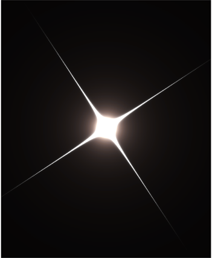

  #### Availability

  Available in OS X v10.4 and later and in iOS 6.0 and later.
- `
  [CIStripesGenerator](#apple-f4xwc4dqnrsv64tfmyxwi33df5tgs3dumvzc6y3jf5busu3uojuxazlti5sw4zlsmf2g64q)`

  Generates a stripe pattern.

  #### Localized Display Name

  Stripes

  #### Parameters

|  |  |
| --- | --- |
| `inputCenter` | A `CIVector` object whose attribute type is `CIAttributeTypePosition` and whose display name is Center.  Default value: [150 150] |
| `inputColor0` | A `CIColor` object whose display name is Color 1. |
| `inputColor1` | A `CIColor` object whose display name is Color 2. |
| `inputWidth` | An `NSNumber` object whose attribute type is `CIAttributeTypeDistance` and whose display name is Width.  Default value: 80.00 |
| `inputSharpness` | An `NSNumber` object whose attribute type is `CIAttributeTypeScalar` and whose display name is Sharpness.  Default value: 1.00 |

  #### Discussion

  You can control the color of the stripes, the spacing, and the contrast.

  #### Member Of

  `CICategoryBuiltIn`, `CICategoryStillImage`, `CICategoryVideo`, `CICategoryGenerator`

  #### Sample Output

  __Figure 94__The result of using the CIStripesGenerator filter
  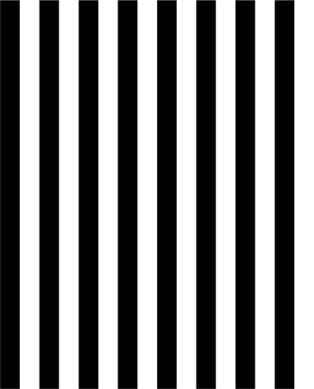

  #### Availability

  Available in OS X v10.4 and later and in iOS 6.0 and later.
- `
  [CISunbeamsGenerator](#apple-f4xwc4dqnrsv64tfmyxwi33df5tgs3dumvzc6y3jf5busu3vnzrgkylnondwk3tfojqxi33s)`

  Generates a sun effect.

  #### Localized Display Name

  Sunbeams

  #### Parameters

|  |  |
| --- | --- |
| `inputCenter` | A `CIVector` object whose attribute type is `CIAttributeTypePosition` and whose display name is Center.  Default value: [150 150] |
| `inputColor` | A `CIColor` object whose display name is Color. |
| `inputSunRadius` | An `NSNumber` object whose attribute type is `CIAttributeTypeDistance` and whose display name is Sun Radius.  Default value: 40.00 |
| `inputMaxStriationRadius` | An `NSNumber` object whose attribute type is `CIAttributeTypeScalar` and whose display name is Maximum Striation Radius.  Default value: 2.58 |
| `inputStriationStrength` | An `NSNumber` object whose attribute type is `CIAttributeTypeScalar` and whose display name is Striation Strength.  Default value: 0.50 |
| `inputStriationContrast` | An `NSNumber` object whose attribute type is `CIAttributeTypeScalar` and whose display name is Striation Contrast.  Default value: 1.38 |
| `inputTime` | An `NSNumber` object whose attribute type is `CIAttributeTypeScalar` and whose display name is Time.  Default value: 0.00 |

  #### Discussion

  You typically use the output of the sunbeams filter as input to a composite filter.

  #### Member Of

  `CICategoryBuiltIn`, `CICategoryStillImage`, `CICategoryVideo`, `CICategoryGenerator`

  #### Sample Output

  __Figure 95__The result of using the CISunbeamsGenerator filter
  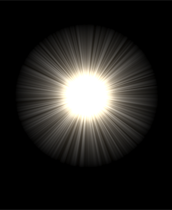

  #### Availability

  Available in OS X v10.4 and later and in iOS 9 and later.

[### CICategoryGeometryAdjustment](#apple-f4xwc4dqnrsv64tfmyxwi33df52wszbpkridgmbqgaydcmzwfvjvomjvg4)

- `
  [CIAffineTransform](#apple-f4xwc4dqnrsv64tfmyxwi33df5tgs3dumvzc6y3jf5busqlgmzuw4zkuojqw443gn5zg2)`

  Applies an affine transform to an image.

  #### Localized Display Name

  Affine Transform

  #### Parameters

|  |  |
| --- | --- |
| `inputImage` | A `CIImage` object whose display name is Image. |
| `inputTransform` | On iOS, an `NSValue` object whose attribute type is `CIAttributeTypeTransform`. You must pass the transform as `NSData` using a statement similar to the following, where `xform` is an affine transform:  1. `[myFilter setValue:[NSValue valueWithBytes:&xform` 2. `objCType:@encode(CGAffineTransform)]` 3. `forKey:@"inputTransform"];`  On OS X, an `NSAffineTransform` object whose attribute type is `CIAttributeTypeTransform`. |

  #### Discussion

  You can scale, translate, or rotate the input image. You can also apply a combination of these operations.

  #### Member Of

  `CICategoryBuiltIn`, `CICategoryStillImage`, `CICategoryVideo`, `CICategoryGeometryAdjustment`

  #### Sample Output

  __Figure 96__The result of using the CIAffineTransform filter
  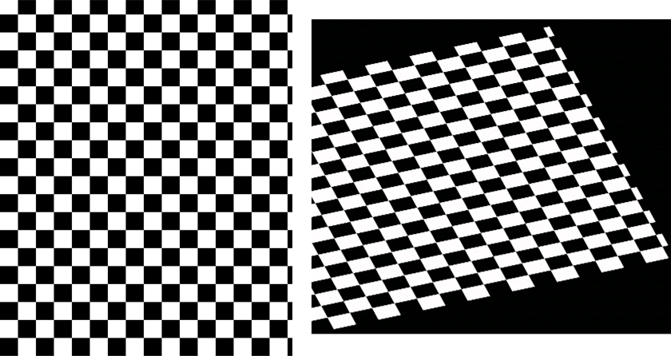

  #### Availability

  Available in OS X v10.4 and later and in iOS 5.0 and later.
- `
  [CICrop](#apple-f4xwc4dqnrsv64tfmyxwi33df5tgs3dumvzc6y3jf5busq3sn5ya)`

  Applies a crop to an image.

  #### Localized Display Name

  Crop

  #### Parameters

|  |  |
| --- | --- |
| `inputImage` | A `CIImage` object whose display name is Image. |
| `inputRectangle` | A `CIVector` object whose attribute type is `CIAttributeTypeRectangle` and whose display name is Rectangle.  Default value: [0 0 300 300] |

  #### Discussion

  The size and shape of the cropped image depend on the rectangle you specify.

  #### Member Of

  `CICategoryBuiltIn`, `CICategoryStillImage`, `CICategoryVideo`, `CICategoryGeometryAdjustment`

  #### Sample Output

  __Figure 97__The result of using the CICrop filter
  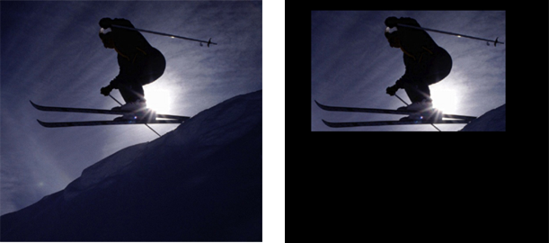

  #### Availability

  Available in OS X v10.4 and later and in iOS 5.0 and later.
- `
  [CILanczosScaleTransform](#apple-f4xwc4dqnrsv64tfmyxwi33df5tgs3dumvzc6y3jf5bustdbnzrxu33tknrwc3dfkrzgc3ttmzxxe3i)`

  Produces a high-quality, scaled version of a source image.

  #### Localized Display Name

  Lanczos Scale Transform

  #### Parameters

|  |  |
| --- | --- |
| `inputImage` | A `CIImage` object whose display name is Image. |
| `inputScale` | An `NSNumber` object whose attribute type is `CIAttributeTypeScalar` and whose display name is Scale.  Default value: 1.00 |
| `inputAspectRatio` | An `NSNumber` object whose attribute type is `CIAttributeTypeScalar` and whose display name is Aspect Ratio.  Default value: 1.00 |

  #### Discussion

  You typically use this filter to scale down an image.

  #### Member Of

  `CICategoryBuiltIn`, `CICategoryStillImage`, `CICategoryVideo`, `CICategoryGeometryAdjustment`

  #### Sample Output

  __Figure 98__The result of using the CILanczosScaleTransform filter
  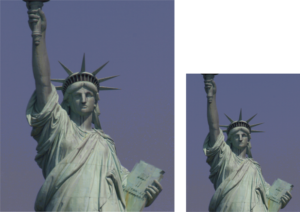

  #### Availability

  Available in OS X v10.4 and later and in iOS 6.0 and later.
- `
  [CIPerspectiveCorrection](#apple-f4xwc4dqnrsv64tfmyxwi33df5tgs3dumvzc6y3jf5busudfojzxazldoruxmzkdn5zhezldoruw63q)`

  Applies a perspective correction, transforming an arbitrary quadrilateral region in the source image to a rectangular output image.

  #### Localized Display Name

  Perspective Correction

  #### Parameters

|  |  |
| --- | --- |
| `inputImage` | A `CIImage` object whose display name is Image. |
| `inputTopLeft` | The point in the input image to be mapped to the top left corner of the output image.  A `CIVector` object whose attribute type is `CIAttributeTypePosition` and whose display name is Top Left.  Default value: [118 484] Identity: (null) |
| `inputTopRight` | The point in the input image to be mapped to the top right corner of the output image.  A `CIVector` object whose attribute type is `CIAttributeTypePosition` and whose display name is Top Right.  Default value: [646 507] Identity: (null) |
| `inputBottomRight` | The point in the input image to be mapped to the bottom right corner of the output image.  A `CIVector` object whose attribute type is `CIAttributeTypePosition` and whose display name is Bottom Right.  Default value: [548 140] Identity: (null) |
| `inputBottomLeft` | The point in the input image to be mapped to the bottom left corner of the output image.  A `CIVector` object whose attribute type is `CIAttributeTypePosition` and whose display name is Bottom Left.  Default value: [155 153] Identity: (null) |

  #### Discussion

  The extent of the rectangular output image varies based on the size and placement of the specified quadrilateral region in the input image.

  #### Member Of

  `CICategoryGeometryAdjustment`, `CICategoryVideo`, `CICategoryStillImage`, `CICategoryBuiltIn`

  #### Sample Output

  __Figure 99__The result of using the CIPerspectiveCorrection filter
  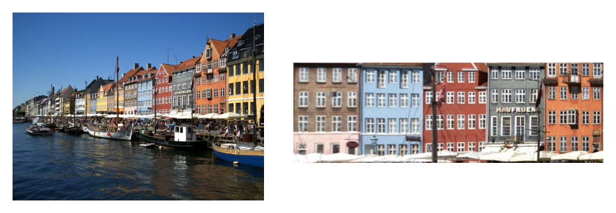

  #### Availability

  Available in OS X v10.10 and later and in iOS 8.0 and later.
- `
  [CIPerspectiveTransform](#apple-f4xwc4dqnrsv64tfmyxwi33df5tgs3dumvzc6y3jf5busudfojzxazldoruxmzkuojqw443gn5zg2)`

  Alters the geometry of an image to simulate the observer changing viewing position.

  #### Localized Display Name

  Perspective Transform

  #### Parameters

|  |  |
| --- | --- |
| `inputImage` | A `CIImage` object whose display name is Image. |
| `inputTopLeft` | A `CIVector` object whose attribute type is `CIAttributeTypePosition` and whose display name is Top Left.  Default value: [118 484] |
| `inputTopRight` | A `CIVector` object whose attribute type is `CIAttributeTypePosition` and whose display name is Top Right.  Default value: [646 507] |
| `inputBottomRight` | A `CIVector` object whose attribute type is `CIAttributeTypePosition` and whose display name is Bottom Right.  Default value: [548 140] |
| `inputBottomLeft` | A `CIVector` object whose attribute type is `CIAttributeTypePosition` and whose display name is Bottom Left.  Default value: [155 153] |

  #### Discussion

  You can use the perspective filter to skew an image.

  #### Member Of

  `CICategoryBuiltIn`, `CICategoryStillImage`, `CICategoryVideo`, `CICategoryGeometryAdjustment`

  #### Sample Output

  __Figure 100__The result of using the CIPerspectiveTransform filter
  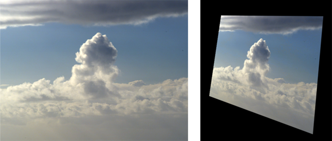

  #### Availability

  Available in OS X v10.4 and later and in iOS 6.0 and later.
- `
  [CIPerspectiveTransformWithExtent](#apple-f4xwc4dqnrsv64tfmyxwi33df5tgs3dumvzc6y3jf5busudfojzxazldoruxmzkuojqw443gn5zg2v3joruek6dumvxhi)`

  Alters the geometry of a portion of an image to simulate the observer changing viewing position.

  #### Localized Display Name

  Perspective Transform With Extent

  #### Parameters

|  |  |
| --- | --- |
| `inputImage` | A `CIImage` object whose display name is Image. |
| `inputExtent` | A `CIVector` object whose whose attribute type is `CIAttributeTypeRectangle`. If you pass [image extent] you’ll get the same result as using the `[CIPerspectiveTransform](#apple-f4xwc4dqnrsv64tfmyxwi33df5tgs3dumvzc6y3jf5busudfojzxazldoruxmzkuojqw443gn5zg2)` filter. |
| `inputTopLeft` | A `CIVector` object whose attribute type is `CIAttributeTypePosition` and whose display name is Top Left.  Default value: [118 484] |
| `inputTopRight` | A `CIVector` object whose attribute type is `CIAttributeTypePosition` and whose display name is Top Right.  Default value: [646 507] |
| `inputBottomRight` | A `CIVector` object whose attribute type is `CIAttributeTypePosition` and whose display name is Bottom Right.  Default value: [548 140] |
| `inputBottomLeft` | A `CIVector` object whose attribute type is `CIAttributeTypePosition` and whose display name is Bottom Left.  Default value: [155 153] |

  #### Discussion

  You can use the perspective filter to skew an the portion of the image defined by extent. See `[CIPerspectiveTransform](#apple-f4xwc4dqnrsv64tfmyxwi33df5tgs3dumvzc6y3jf5busudfojzxazldoruxmzkuojqw443gn5zg2)` for an example of the output of this filter when you supply the input image size as the extent.

  #### Member Of

  `CICategoryBuiltIn`, `CICategoryStillImage`, `CICategoryVideo`, `CICategoryGeometryAdjustment`

  #### Availability

  Available in iOS 6.0 and later.
- `
  [CIStraightenFilter](#apple-f4xwc4dqnrsv64tfmyxwi33df5tgs3dumvzc6y3jf5busu3uojqwsz3iorsw4rtjnr2gk4q)`

  Rotates the source image by the specified angle in radians.

  #### Localized Display Name

  Straighten

  #### Parameters

|  |  |
| --- | --- |
| `inputImage` | A `CIImage` object whose display name is Image. |
| `inputAngle` | An `NSNumber` object whose attribute type is `CIAttributeTypeScalar` and whose display name is Angle.  Default value: 0.00 |

  #### Discussion

  The image is scaled and cropped so that the rotated image fits the extent of the input image.

  #### Member Of

  `CICategoryBuiltIn`, `CICategoryStillImage`, `CICategoryVideo`, `CICategoryGeometryAdjustment`

  #### Sample Output

  __Figure 101__The result of using CIStraightenFilter filter
  

  #### Availability

  Available in OS X v10.7 and later and in iOS 5.0 and later.

[### CICategoryGradient](#apple-f4xwc4dqnrsv64tfmyxwi33df52wszbpkridgmbqgaydcmzwfvjvomjwgy)

- `
  [CIGaussianGradient](#apple-f4xwc4dqnrsv64tfmyxwi33df5tgs3dumvzc6y3jf5busr3bovzxg2lbnzdxeylenfsw45a)`

  Generates a gradient that varies from one color to another using a Gaussian distribution.

  #### Localized Display Name

  Gaussian Gradient

  #### Parameters

|  |  |
| --- | --- |
| `inputCenter` | A `CIVector` object whose attribute type is `CIAttributeTypePosition` and whose display name is Center.  Default value: [150 150] Identity: (null) |
| `inputColor0` | A `CIColor` object whose display name is Color 1. |
| `inputColor1` | A `CIColor` object whose display name is Color 2. |
| `inputRadius` | An `NSNumber` object whose attribute type is `CIAttributeTypeDistance` and whose display name is Radius.  Default value: 300.00 |

  #### Member Of

  `CICategoryBuiltIn`, `CICategoryStillImage`, `CICategoryVideo`, `CICategoryGradient`

  #### Sample Output

  __Figure 102__The result of using the CIGaussianGradient filter
  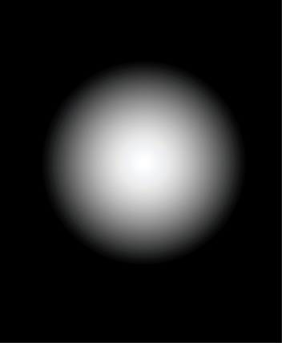

  #### Availability

  Available in OS X v10.4 and later and in iOS 6.0 and later.
- `
  [CILinearGradient](#apple-f4xwc4dqnrsv64tfmyxwi33df5tgs3dumvzc6y3jf5bustdjnzswc4shojqwi2lfnz2a)`

  Generates a gradient that varies along a linear axis between two defined endpoints.

  #### Localized Display Name

  Linear Gradient

  #### Parameters

|  |  |
| --- | --- |
| `inputPoint0` | A `CIVector` object whose attribute type is `CIAttributeTypePosition` and whose display name is Point 1.  Default value: [0 0] |
| `inputPoint1` | A `CIVector` object whose attribute type is `CIAttributeTypePosition` and whose display name is Point 2.  Default value: [200 200] |
| `inputColor0` | A `CIColor` object whose display name is Color 1. |
| `inputColor1` | A `CIColor` object whose display name is Color 2. |

  #### Member Of

  `CICategoryBuiltIn`, `CICategoryStillImage`, `CICategoryVideo`, `CICategoryGradient`

  #### Sample Output

  __Figure 103__The result of using the CILinearGradient filter
  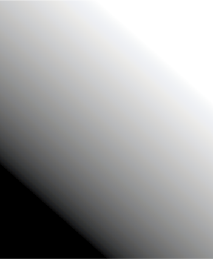

  #### Availability

  Available in OS X v10.4 and later and in iOS 6.0 and later.
- `
  [CIRadialGradient](#apple-f4xwc4dqnrsv64tfmyxwi33df5tgs3dumvzc6y3jf5busutbmruwc3chojqwi2lfnz2a)`

  Generates a gradient that varies radially between two circles having the same center.

  #### Localized Display Name

  Radial Gradient

  #### Parameters

|  |  |
| --- | --- |
| `inputCenter` | A `CIVector` object whose attribute type is `CIAttributeTypePosition` and whose display name is Center.  Default value: [150 150] |
| `inputRadius0` | An `NSNumber` object whose attribute type is `CIAttributeTypeDistance` and whose display name is Radius 1.  Default value: 5.00 |
| `inputRadius1` | An `NSNumber` object whose attribute type is `CIAttributeTypeDistance` and whose display name is Radius 2.  Default value: 100.00 |
| `inputColor0` | A `CIColor` object whose display name is Color 1. |
| `inputColor1` | A `CIColor` object whose display name is Color 2. |

  #### Discussion

  It is valid for one of the two circles to have a radius of 0.

  #### Member Of

  `CICategoryBuiltIn`, `CICategoryStillImage`, `CICategoryVideo`, `CICategoryGradient`

  #### Sample Output

  __Figure 104__The result of using the CIRadialGradient filter
  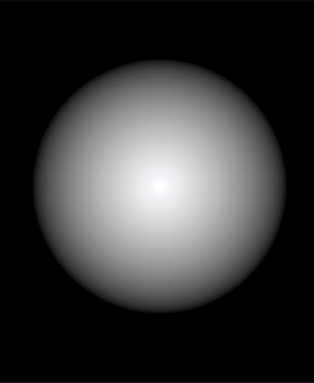

  #### Availability

  Available in OS X v10.4 and later and in iOS 6.0 and later.
- `
  [CISmoothLinearGradient](#apple-f4xwc4dqnrsv64tfmyxwi33df5tgs3dumvzc6y3jf5busu3nn5xxi2cmnfxgkylsi5zgczdjmvxhi)`

  Generates a gradient that uses an S-curve function to blend colors along a linear axis between two defined endpoints.

  #### Localized Display Name

  Smooth Linear Gradient

  #### Parameters

|  |  |
| --- | --- |
| `inputPoint0` | A `CIVector` object whose attribute type is `CIAttributeTypePosition` and whose display name is Point 1.  Default value: [0 0] |
| `inputPoint1` | A `CIVector` object whose attribute type is `CIAttributeTypePosition` and whose display name is Point 2.  Default value: [200 200] |
| `inputColor0` | A `CIColor` object whose attribute type is `CIAttributeTypeColor` and whose display name is Color 1. |
| `inputColor1` | A `CIColor` object whose attribute type is `CIAttributeTypeColor` and whose display name is Color 2. |

  #### Discussion

  Where the CILinearGradient filter blends colors linearly (that is, the color at a point 25% along the line between Point 1 and Point 2 is 25% Color 1 and 75% Color 2), this filter blends colors using an S-curve function: the color blend at points less than 50% along the line between Point 1 and Point 2 is slightly closer to Color 1 than in a linear blend, and the color blend at points further than 50% along that line is slightly closer to Color 2 than in a linear blend.

  #### Member Of

  `CICategoryBuiltIn`, `CICategoryStillImage`, `CICategoryVideo`, `CICategoryGradient`

  #### Sample Output

  __Figure 105__The result of using the CISmoothLinearGradient filter
  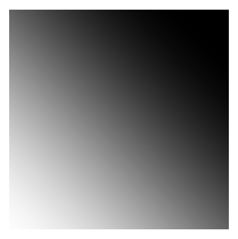

  #### Availability

  Available in OS X v10.11 and later and in iOS 7.0 and later.

[### CICategoryHalftoneEffect](#apple-f4xwc4dqnrsv64tfmyxwi33df52wszbpkridgmbqgaydcmzwfvjvomjxgm)

- `
  [CICircularScreen](#apple-f4xwc4dqnrsv64tfmyxwi33df5tgs3dumvzc6y3jf5busq3jojrxk3dbojjwg4tfmvxa)`

  Simulates a circular-shaped halftone screen.

  #### Localized Display Name

  Circular Screen

  #### Parameters

|  |  |
| --- | --- |
| `inputImage` | A `CIImage` object whose display name is Image. |
| `inputCenter` | A `CIVector` object whose attribute type is `CIAttributeTypePosition` and whose display name is Center.  Default value: [150 150] |
| `inputWidth` | An `NSNumber` object whose attribute type is `CIAttributeTypeDistance` and whose display name is Width.  Default value: 6.00 |
| `inputSharpness` | An `NSNumber` object whose attribute type is `CIAttributeTypeScalar` and whose display name is Sharpness.  Default value: 0.70 |

  #### Member Of

  `CICategoryBuiltIn`, `CICategoryStillImage`, `CICategoryVideo`, `CICategoryHalftoneEffect`

  #### Sample Output

  __Figure 106__The result of using the CICircularScreen filter
  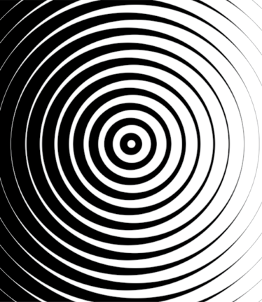

  #### Availability

  Available in OS X v10.4 and later and in iOS 6.0 and later.
- `
  [CICMYKHalftone](#apple-f4xwc4dqnrsv64tfmyxwi33df5tgs3dumvzc6y3jf5busq2nlffuqylmmz2g63tf)`

  Creates a color, halftoned rendition of the source image, using cyan, magenta, yellow, and black inks over a white page.

  #### Localized Display Name

  CMYK Halftone

  #### Parameters

|  |  |
| --- | --- |
| `inputImage` | A `CIImage` object whose display name is Image. |
| `inputCenter` | A `CIVector` object whose attribute type is `CIAttributeTypePosition` and whose display name is Center.  Default value: [150 150] |
| `inputWidth` | An `NSNumber` object whose attribute type is `CIAttributeTypeDistance` and whose display name is Width.  Default value: 6.00 |
| `inputAngle` | An `NSNumber` object whose attribute type is `CIAttributeTypeAngle` and whose display name is Angle.  Default value: 0.00 |
| `inputSharpness` | An `NSNumber` object whose attribute type is `CIAttributeTypeScalar` and whose display name is Sharpness.  Default value: 0.70 |
| `inputGCR` | An `NSNumber` object whose attribute type is `CIAttributeTypeScalar` and whose display name is Gray Component Replacement.  Default value: 1.00 |
| `inputUCR` | An `NSNumber` object whose attribute type is `CIAttributeTypeScalar` and whose display name is Under Color Removal.  Default value: 0.50 |

  #### Member Of

  `CICategoryBuiltIn`, `CICategoryStillImage`, `CICategoryVideo`, `CICategoryHalftoneEffect`

  #### Sample Output

  __Figure 107__The result of using the CICMYKHalftone filter
  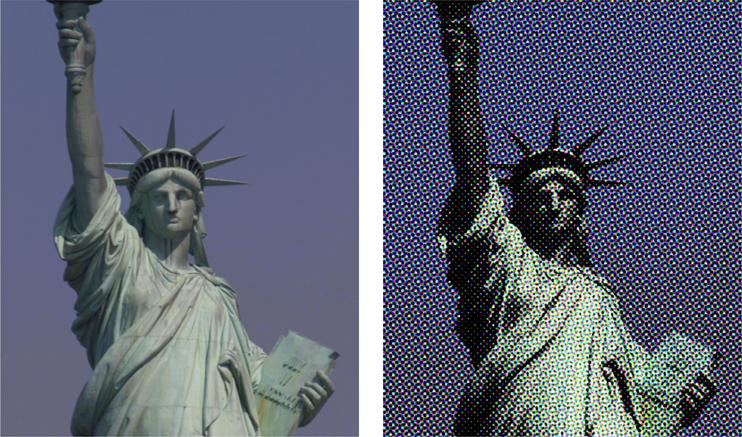

  #### Availability

  Available in OS X v10.4 and later and in iOS 9 and later.
- `
  [CIDotScreen](#apple-f4xwc4dqnrsv64tfmyxwi33df5tgs3dumvzc6y3jf5busrdporjwg4tfmvxa)`

  Simulates the dot patterns of a halftone screen.

  #### Localized Display Name

  Dot Screen

  #### Parameters

|  |  |
| --- | --- |
| `inputImage` | A `CIImage` object whose display name is Image. |
| `inputCenter` | A `CIVector` object whose attribute type is `CIAttributeTypePosition` and whose display name is Center.  Default value: [150 150] |
| `inputAngle` | An `NSNumber` object whose attribute type is `CIAttributeTypeAngle` and whose display name is Angle.  Default value: 0.00 |
| `inputWidth` | An `NSNumber` object whose attribute type is `CIAttributeTypeDistance` and whose display name is Width.  Default value: 6.00 |
| `inputSharpness` | An `NSNumber` object whose attribute type is `CIAttributeTypeScalar` and whose display name is Sharpness.  Default value: 0.70 |

  #### Member Of

  `CICategoryBuiltIn`, `CICategoryStillImage`, `CICategoryVideo`, `CICategoryHalftoneEffect`

  #### Sample Output

  __Figure 108__The result of using the CIDotScreen filter
  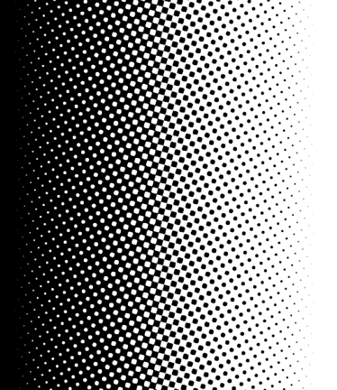

  #### Availability

  Available in OS X v10.4 and later and in iOS 6.0 and later.
- `
  [CIHatchedScreen](#apple-f4xwc4dqnrsv64tfmyxwi33df5tgs3dumvzc6y3jf5bussdborrwqzleknrxezlfny)`

  Simulates the hatched pattern of a halftone screen.

  #### Localized Display Name

  Hatched Screen

  #### Parameters

|  |  |
| --- | --- |
| `inputImage` | A `CIImage` object whose display name is Image. |
| `inputCenter` | A `CIVector` object whose attribute type is `CIAttributeTypePosition` and whose display name is Center.  Default value: [150 150] |
| `inputAngle` | An `NSNumber` object whose attribute type is `CIAttributeTypeAngle` and whose display name is Angle.  Default value: 0.00 |
| `inputWidth` | An `NSNumber` object whose attribute type is `CIAttributeTypeDistance` and whose display name is Width.  Default value: 6.00 |
| `inputSharpness` | An `NSNumber` object whose attribute type is `CIAttributeTypeScalar` and whose display name is Sharpness.  Default value: 0.70 |

  #### Member Of

  `CICategoryBuiltIn`, `CICategoryStillImage`, `CICategoryVideo`, `CICategoryHalftoneEffect`

  #### Sample Output

  __Figure 109__The result of using the CIHatchedScreen filter
  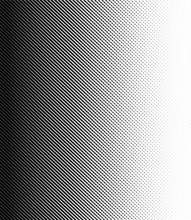

  #### Availability

  Available in OS X v10.4 and later and in iOS 6.0 and later.
- `
  [CILineScreen](#apple-f4xwc4dqnrsv64tfmyxwi33df5tgs3dumvzc6y3jf5bustdjnzsvgy3smvsw4)`

  Simulates the line pattern of a halftone screen.

  #### Localized Display Name

  Line Screen

  #### Parameters

|  |  |
| --- | --- |
| `inputImage` | A `CIImage` object whose display name is Image. |
| `inputCenter` | A `CIVector` object whose attribute type is `CIAttributeTypePosition` and whose display name is Center.  Default value: [150 150] |
| `inputAngle` | An `NSNumber` object whose attribute type is `CIAttributeTypeAngle` and whose display name is Angle. |
| `inputWidth` | An `NSNumber` object whose attribute type is `CIAttributeTypeDistance` and whose display name is Width.  Default value: 6.00 |
| `inputSharpness` | An `NSNumber` object whose attribute type is `CIAttributeTypeScalar` and whose display name is Sharpness.  Default value: 0.70 |

  #### Member Of

  `CICategoryBuiltIn`, `CICategoryStillImage`, `CICategoryVideo`, `CICategoryHalftoneEffect`

  #### Sample Output

  __Figure 110__The result of using the CILineScreen filter
  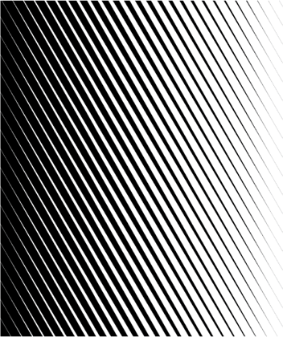

  #### Availability

  Available in OS X v10.4 and later and in iOS 6.0 and later.

[### CICategoryReduction](#apple-f4xwc4dqnrsv64tfmyxwi33df52wszbpkridgmbqgaydcmzwfvjvomjygq)

- `
  [CIAreaAverage](#apple-f4xwc4dqnrsv64tfmyxwi33df5tgs3dumvzc6y3jf5busqlsmvquc5tfojqwozi)`

  Returns a single-pixel image that contains the average color for the region of interest.

  #### Localized Display Name

  Area Average

  #### Parameters

|  |  |
| --- | --- |
| `inputImage` | A `CIImage` object whose display name is Image. This is the image data you want to process. |
| `inputExtent` | A `CIVector` object representing the rectangular region of interest. |

  #### Member Of

  `CICategoryReduction`, `CICategoryStillImage`, `CICategoryVideo`, `CICategoryBuiltIn`

  #### Availability

  Available in OS X v10.5 and later and in iOS 9 and later.
- `
  [CIAreaHistogram](#apple-f4xwc4dqnrsv64tfmyxwi33df5tgs3dumvzc6y3jf5busqlsmvquq2ltorxwo4tbnu)`

  Returns a 1D image (`inputCount` wide by one pixel high) that contains the component-wise histogram computed for the specified rectangular area.

  #### Localized Display Name

  Area Histogram

  #### Parameters

|  |  |
| --- | --- |
| `inputImage` | A `CIImage` object whose display name is Image. This is the image data you want to process. |
| `inputExtent` | The rectangular region of interest. |
| `inputCount` | The number of “buckets” for the histogram. |
| `inputScale` | A scaling factor. Core Image scales the histogram by dividing the scale by the area of the `inputExtent` rectangle. |

  #### Member Of

  `CICategoryReduction`, `CICategoryStillImage`, `CICategoryVideo`, `CICategoryBuiltIn`

  #### Availability

  Available in OS X v10.5 and later and in iOS 8.0 and later.
- `
  [CIRowAverage](#apple-f4xwc4dqnrsv64tfmyxwi33df5tgs3dumvzc6y3jf5busutpo5axmzlsmftwk)`

  Returns a 1-pixel high image that contains the average color for each scan row.

  #### Localized Display Name

  Row Average

  #### Parameters

|  |  |
| --- | --- |
| `inputImage` | A `CIImage` object whose display name is Image. This is the image data you want to process. |
| `inputExtent` | The rectangular region of interest. |

  #### Member Of

  `CICategoryReduction`, `CICategoryStillImage`, `CICategoryVideo`, `CICategoryBuiltIn`

  #### Availability

  Available in OS X v10.5 and later and in iOS 9 and later.
- `
  [CIColumnAverage](#apple-f4xwc4dqnrsv64tfmyxwi33df5tgs3dumvzc6y3jf5busq3pnr2w23sbozsxeylhmu)`

  Returns a 1-pixel high image that contains the average color for each scan column.

  #### Localized Display Name

  Column Average

  #### Parameters

|  |  |
| --- | --- |
| `inputImage` | A `CIImage` object whose display name is Image. This is the image data you want to process. |
| `inputExtent` | The rectangular region of interest. |

  #### Member Of

  `CICategoryReduction`, `CICategoryStillImage`, `CICategoryVideo`, `CICategoryBuiltIn`

  #### Availability

  Available in OS X v10.5 and later and in iOS 9 and later.
- `
  [CIHistogramDisplayFilter](#apple-f4xwc4dqnrsv64tfmyxwi33df5tgs3dumvzc6y3jf5bussdjon2g6z3smfwui2ltobwgc6kgnfwhizls)`

  Generates a histogram image from the output of the CIAreaHistogram filter.

  #### Localized Display Name

  Histogram Display

  #### Parameters

|  |  |
| --- | --- |
| `inputImage` | A `CIImage` object whose display name is Image. |
| `inputHeight` | The height of the displayable histogram image. An `NSNumber` object whose attribute type is `CIAttributeTypeScalar` and whose display name is Height.  Default value: 100.00 Minimum: 1.00 Maximum: 200.00 Slider minimum: 1.00 Slider maximum: 100.00 Identity: 0.00 |
| `inputHighLimit` | The fraction of the left portion of the histogram image to be made darker. An `NSNumber` object whose attribute type is `CIAttributeTypeScalar` and whose display name is HighLimit.  Default value: 1.00 Minimum: 0.00 Maximum: 1.00 Slider minimum: 0.00 Slider maximum: 1.00 Identity: 0.00 |
| `inputLowLimit` | The fraction of the right portion of the histogram image to be made lighter. An `NSNumber` object whose attribute type is `CIAttributeTypeScalar` and whose display name is LowLimit.  Default value: 0.00 Minimum: 0.00 Maximum: 1.00 Slider minimum: 0.00 Slider maximum: 1.00 Identity: 0.00 |

  #### Discussion

  The input image should be a one-dimensional image in which each pixel contains data (per component) for one “bucket” of the histogram; you can produce such an image using the `[CIAreaHistogram](#apple-f4xwc4dqnrsv64tfmyxwi33df5tgs3dumvzc6y3jf5busqlsmvquq2ltorxwo4tbnu)` filter. The width of the output image is the same as that of the input image, and its height is the value of the `inputHeight` parameter.

  #### Member Of

  `CICategoryBuiltIn`, `CICategoryStillImage`, `CICategoryVideo`, `CICategoryReduction`

  #### Sample Output

  __Figure 111__The result of using the CIHistogramDisplayFilter filter
  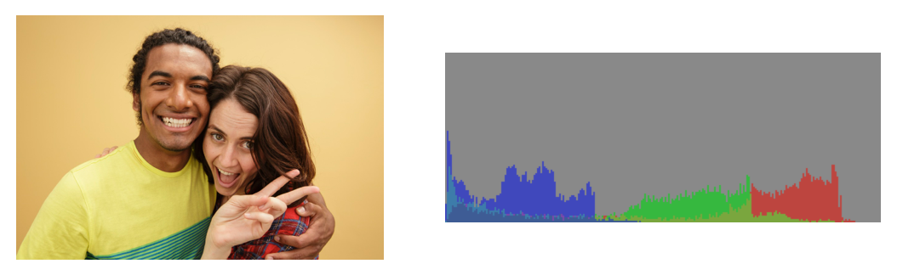

  #### Availability

  Available in OS X v10.9 and later and in iOS 8.0 and later.
- `
  [CIAreaMaximum](#apple-f4xwc4dqnrsv64tfmyxwi33df5tgs3dumvzc6y3jf5busqlsmvqu2ylynfwxk3i)`

  Returns a single-pixel image that contains the maximum color components for the region of interest.

  #### Localized Display Name

  Area Maximum

  #### Parameters

|  |  |
| --- | --- |
| `inputImage` | A `CIImage` object whose display name is Image. This is the image data you want to process. |
| `inputExtent` | The rectangular region of interest. |

  #### Discussion

  Image component values should range from 0.0 to 1.0, inclusive.

  #### Member Of

  `CICategoryReduction`, `CICategoryStillImage`, `CICategoryVideo`, `CICategoryBuiltIn`

  #### Availability

  Available in OS X v10.5 and later and in iOS 9 and later.
- `
  [CIAreaMinimum](#apple-f4xwc4dqnrsv64tfmyxwi33df5tgs3dumvzc6y3jf5busqlsmvqu22lonfwxk3i)`

  Returns a single-pixel image that contains the minimum color components for the region of interest.

  #### Localized Display Name

  Area Minimum

  #### Parameters

|  |  |
| --- | --- |
| `inputImage` | A `CIImage` object whose display name is Image. This is the image data you want to process. |
| `inputExtent` | The rectangular region of interest. |

  #### Discussion

  Image component values should range from 0.0 to 1.0, inclusive.

  #### Member Of

  `CICategoryReduction`, `CICategoryStillImage`, `CICategoryVideo`, `CICategoryBuiltIn`

  #### Availability

  Available in OS X v10.5 and later and in iOS 9 and later.
- `
  [CIAreaMaximumAlpha](#apple-f4xwc4dqnrsv64tfmyxwi33df5tgs3dumvzc6y3jf5busqlsmvqu2ylynfwxk3kbnrygqyi)`

  Returns a single-pixel image that contains the color vector with the maximum alpha value for the region of interest.

  #### Localized Display Name

  Area Maximum Alpha

  #### Parameters

|  |  |
| --- | --- |
| `inputImage` | A `CIImage` object whose display name is Image. This is the image data you want to process. |
| `inputExtent` | The rectangular region of interest. |

  #### Discussion

  If more than one pixel exists with the maximum alpha value, Core Image returns the vector that has the lowest _x_ and `y` coordinate. Image component values should range from 0.0 to 1.0, inclusive.

  #### Member Of

  `CICategoryReduction`, `CICategoryStillImage`, `CICategoryVideo`, `CICategoryBuiltIn`

  #### Availability

  Available in OS X v10.5 and later and in iOS 9 and later.
- `
  [CIAreaMinimumAlpha](#apple-f4xwc4dqnrsv64tfmyxwi33df5tgs3dumvzc6y3jf5busqlsmvqu22lonfwxk3kbnrygqyi)`

  Returns a single-pixel image that contains the color vector with the minimum alpha value for the region of interest.

  #### Localized Display Name

  Area Minimum Alpha

  #### Parameters

|  |  |
| --- | --- |
| `inputImage` | A `CIImage` object whose display name is Image. This is the image data you want to process. |
| `inputExtent` | The rectangular region of interest. |

  #### Discussion

  If more than one pixel exists with the minimum alpha value, Core Image returns the vector that has the lowest _x_ and `y` coordinate. Image component values should range from 0.0 to 1.0, inclusive.

  #### Member Of

  `CICategoryReduction`, `CICategoryStillImage`, `CICategoryVideo`, `CICategoryBuiltIn`

  #### Availability

  Available in OS X v10.5 and later and in iOS 9 and later.

[### CICategorySharpen](#apple-f4xwc4dqnrsv64tfmyxwi33df52wszbpkridgmbqgaydcmzwfvjvomjygu)

- `
  [CISharpenLuminance](#apple-f4xwc4dqnrsv64tfmyxwi33df5tgs3dumvzc6y3jf5busu3imfzhazlojr2w22lomfxggzi)`

  Increases image detail by sharpening.

  #### Localized Display Name

  Sharpen Luminance

  #### Parameters

|  |  |
| --- | --- |
| `inputImage` | A `CIImage` object whose display name is Image. |
| `inputSharpness` | An `NSNumber` object whose attribute type is `CIAttributeTypeScalar` and whose display name is Sharpness.  Default value: 0.40 |

  #### Discussion

  It operates on the luminance of the image; the chrominance of the pixels remains unaffected.

  #### Member Of

  `CICategoryBuiltIn`, `CICategoryStillImage`, `CICategoryVideo`, `CICategorySharpen`

  #### Sample Output

  __Figure 112__The result of using the CISharpenLuminance filter
  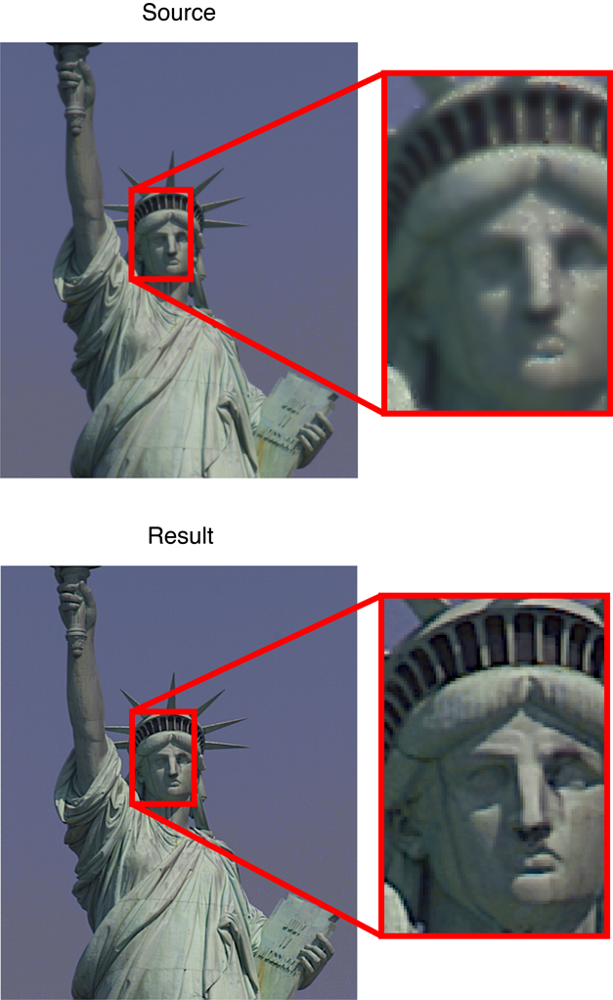

  #### Availability

  Available in OS X v10.4 and later and in iOS 6.0 and later.
- `
  [CIUnsharpMask](#apple-f4xwc4dqnrsv64tfmyxwi33df5tgs3dumvzc6y3jf5busvloonugc4tqjvqxg2y)`

  Increases the contrast of the edges between pixels of different colors in an image.

  #### Localized Display Name

  Unsharp Mask

  #### Parameters

|  |  |
| --- | --- |
| `inputImage` | A `CIImage` object whose display name is Image. |
| `inputRadius` | An `NSNumber` object whose attribute type is `CIAttributeTypeDistance` and whose display name is Radius.  Default value: 2.50 |
| `inputIntensity` | An `NSNumber` object whose attribute type is `CIAttributeTypeScalar` and whose display name is Intensity.  Default value: 0.50 |

  #### Member Of

  `CICategoryBuiltIn`, `CICategoryStillImage`, `CICategoryVideo`, `CICategorySharpen`

  #### Sample Output

  __Figure 113__The result of using the CIUnsharpMask filter
  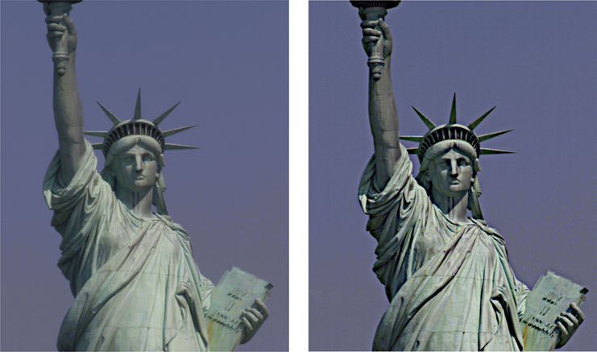

  #### Availability

  Available in OS X v10.4 and later and in iOS 6.0 and later.

[### CICategoryStylize](#apple-f4xwc4dqnrsv64tfmyxwi33df52wszbpkridgmbqgaydcmzwfvjvomjzga)

- `
  [CIBlendWithAlphaMask](#apple-f4xwc4dqnrsv64tfmyxwi33df5tgs3dumvzc6y3jf5busqtmmvxgiv3joruec3dqnbqu2yltnm)`

  Uses alpha values from a mask to interpolate between an image and the background.

  #### Localized Display Name

  Blend With Alpha Mask

  #### Parameters

|  |  |
| --- | --- |
| `inputImage` | A `CIImage` object whose display name is Image. |
| `inputBackgroundImage` | A `CIImage` object whose display name is Background Image. |
| `inputMaskImage` | A `CIImage` object whose display name is Mask Image. |

  #### Discussion

  When a mask alpha value is 0.0, the result is the background. When the mask alpha value is 1.0, the result is the image.

  #### Member Of

  `CICategoryBuiltIn`, `CICategoryStillImage`, `CICategoryVideo`, `CICategoryStylize`

  #### Sample Output

  __Figure 114__The result of using the CIBlendWithAlphaMask filter
  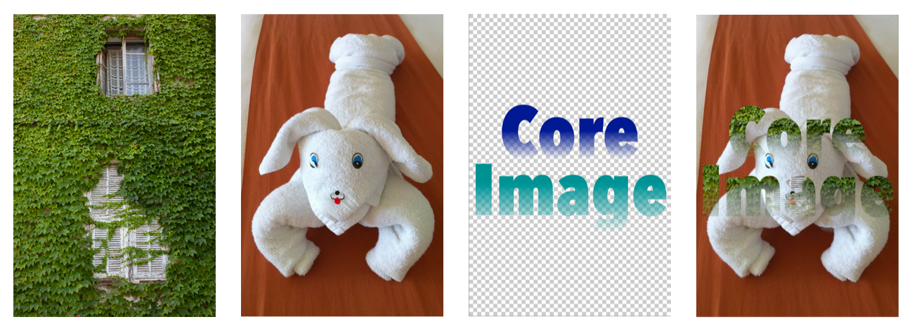

  #### Availability

  Available in OS X v10.9 and later and in iOS 7.0 and later.
- `
  [CIBlendWithMask](#apple-f4xwc4dqnrsv64tfmyxwi33df5tgs3dumvzc6y3jf5busqtmmvxgiv3jorue2yltnm)`

  Uses values from a grayscale mask to interpolate between an image and the background.

  #### Localized Display Name

  Blend With Mask

  #### Parameters

|  |  |
| --- | --- |
| `inputImage` | A `CIImage` object whose display name is Image. |
| `inputBackgroundImage` | A `CIImage` object whose display name is Background Image. |
| `inputMaskImage` | A `CIImage` object whose display name is Mask Image. |

  #### Discussion

  When a mask value is 0.0, the result is the background. When the mask value is 1.0, the result is the image.

  #### Member Of

  `CICategoryBuiltIn`, `CICategoryStillImage`, `CICategoryVideo`, `CICategoryStylize`

  #### Sample Output

  __Figure 115__The result of using the CIBlendWithMask filter
  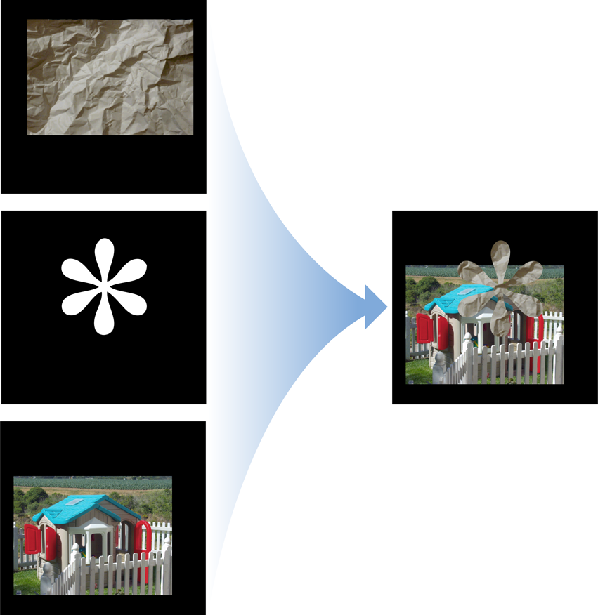

  #### Availability

  Available in OS X v10.4 and later and in iOS 6.0 and later.
- `
  [CIBloom](#apple-f4xwc4dqnrsv64tfmyxwi33df5tgs3dumvzc6y3jf5busqtmn5xw2)`

  Softens edges and applies a pleasant glow to an image.

  #### Localized Display Name

  Bloom

  #### Parameters

|  |  |
| --- | --- |
| `inputImage` | A `CIImage` object whose display name is Image. |
| `inputRadius` | An `NSNumber` object whose attribute type is `CIAttributeTypeDistance` and whose display name is Radius.  Default value: 10.00 |
| `inputIntensity` | An `NSNumber` object whose attribute type is `CIAttributeTypeScalar` and whose display name is Intensity.  Default value: 0.5 |

  #### Member Of

  `CICategoryBuiltIn`, `CICategoryStillImage`, `CICategoryVideo`, `CICategoryStylize`

  #### Sample Output

  __Figure 116__The result of using the CIBloom filter
  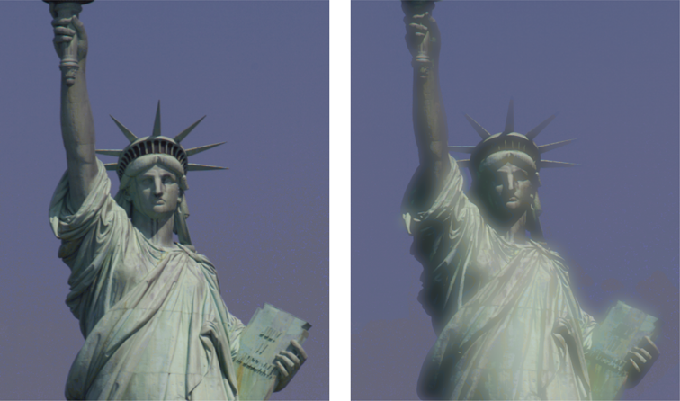

  #### Availability

  Available in OS X v10.4 and later and in iOS 6.0 and later.
- `
  [CIComicEffect](#apple-f4xwc4dqnrsv64tfmyxwi33df5tgs3dumvzc6y3jf5busq3pnvuwgrlgmzswg5a)`

  Simulates a comic book drawing by outlining edges and applying a color halftone effect.

  #### Localized Display Name

  Comic Effect

  #### Parameters

|  |  |
| --- | --- |
| `inputImage` | A `CIImage` object whose display name is Image. |

  #### Member Of

  `CICategoryBuiltIn`, `CICategoryStillImage`, `CICategoryVideo`, `CICategoryStylize`

  #### Sample Output

  __Figure 117__The result of using the CIComicEffect filter
  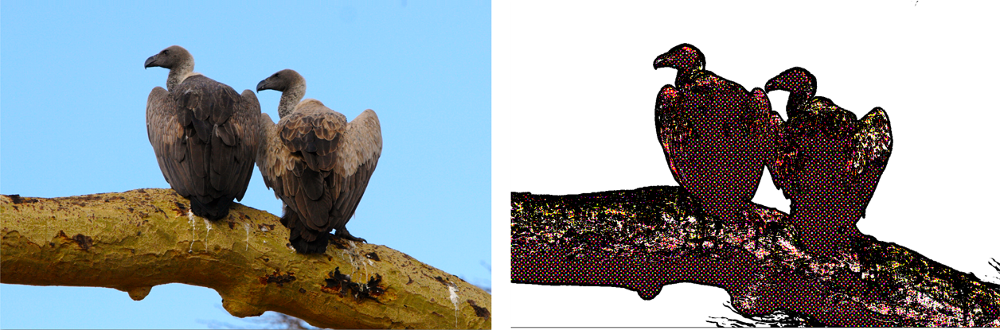

  #### Availability

  Available in OS X v10.5 and later and in iOS 9 and later.
- `
  [CIConvolution3X3](#apple-f4xwc4dqnrsv64tfmyxwi33df5tgs3dumvzc6y3jf5busq3pnz3g63dvoruw63rtlazq)`

  Modifies pixel values by performing a 3x3 matrix convolution.

  #### Localized Display Name

  3 by 3 convolution

  #### Parameters

|  |  |
| --- | --- |
| `inputImage` | A `CIImage` object whose display name is Image. |
| `inputWeights` | A `CIVector` object whose display name is Weights.  Default value: [0 0 0 0 1 0 0 0 0] Identity: [0 0 0 0 1 0 0 0 0] |
| `inputBias` | An `NSNumber` object whose attribute type is `CIAttributeTypeDistance` and whose display name is Bias.  Default value: 0.00 Identity: 0.00 |

  #### Discussion

  A convolution filter generates each output pixel by summing all elements in the element-wise product of two matrices—a weight matrix and a matrix containing the neighborhood surrounding the corresponding input pixel—and adding a bias. This operation is performed independently for each color component (including the alpha component), and the resulting value is clamped to the range between `0.0` and `1.0`. You can create many types of image processing effects using different weight matrices, such as blurring, sharpening, edge detection, translation, and embossing.

  This filter uses a 3x3 weight matrix and the 3x3 neighborhood surrounding an input pixel (that is, the pixel itself and those within a distance of one pixel horizontally or vertically).

  If you want to preserve the overall brightness of the image, ensure that the sum of all values in the weight matrix is `1.0`. You may find it convenient to devise a weight matrix without this constraint and then normalize it by dividing each element by the sum of all elements, as shown in the figure below.

  #### Member Of

  `CICategoryBuiltIn`, `CICategoryStillImage`, `CICategoryVideo`, `CICategoryStylize`

  #### Sample Output

  __Figure 118__The result of using the CIConvolution3X3 filter
  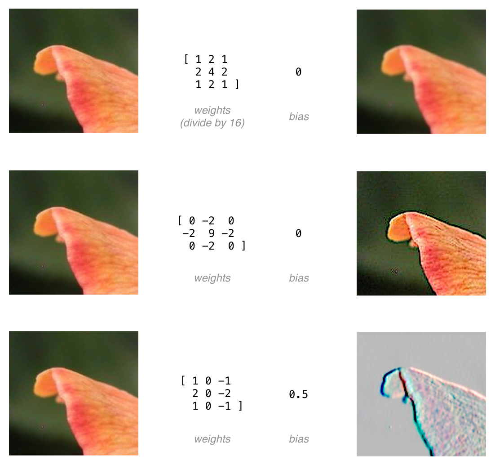

  #### Availability

  Available in OS X v10.9 and later and in iOS 7.0 and later.
- `
  [CIConvolution5X5](#apple-f4xwc4dqnrsv64tfmyxwi33df5tgs3dumvzc6y3jf5busq3pnz3g63dvoruw63rvla2q)`

  Modifies pixel values by performing a 5x5 matrix convolution.

  #### Localized Display Name

  5 by 5 convolution

  #### Parameters

|  |  |
| --- | --- |
| `inputImage` | A `CIImage` object whose display name is Image. |
| `inputWeights` | A `CIVector` object whose display name is Weights.  Default value: [0 0 0 0 0 0 0 0 0 0 0 0 1 0 0 0 0 0 0 0 0 0 0 0 0] Identity: [0 0 0 0 0 0 0 0 0 0 0 0 1 0 0 0 0 0 0 0 0 0 0 0 0] |
| `inputBias` | An `NSNumber` object whose attribute type is `CIAttributeTypeDistance` and whose display name is Bias.  Default value: 0.00 Identity: 0.00 |

  #### Discussion

  A convolution filter generates each output pixel by summing all elements in the element-wise product of two matrices—a weight matrix and a matrix containing the neighborhood surrounding the corresponding input pixel—and adding a bias. This operation is performed independently for each color component (including the alpha component), and the resulting value is clamped to the range between `0.0` and `1.0`. You can create many types of image processing effects using different weight matrices, such as blurring, sharpening, edge detection, translation, and embossing.

  This filter uses a 5x5 weight matrix and the 5x5 neighborhood surrounding an input pixel (that is, the pixel itself and those within a distance of two pixels horizontally or vertically).

  If you want to preserve the overall brightness of the image, ensure that the sum of all values in the weight matrix is `1.0`. You may find it convenient to devise a weight matrix without this constraint and then normalize it by dividing each element by the sum of all elements.

  #### Member Of

  `CICategoryBuiltIn`, `CICategoryStillImage`, `CICategoryVideo`, `CICategoryStylize`

  #### Sample Output

  __Figure 119__The result of using the CIConvolution5X5 filter
  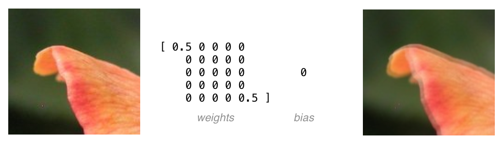

  #### Availability

  Available in OS X v10.9 and later and in iOS 7.0 and later.
- `
  [CIConvolution7X7](#apple-f4xwc4dqnrsv64tfmyxwi33df5tgs3dumvzc6y3jf5busq3pnz3g63dvoruw63rxla3q)`

  Modifies pixel values by performing a 7x7 matrix convolution.

  #### Localized Display Name

  7 by 7 convolution

  #### Parameters

|  |  |
| --- | --- |
| `inputImage` | A `CIImage` object whose display name is Image. |
| `inputWeights` | A `CIVector` object whose display name is Weights.  Default value: [0 0 0 0 0 0 0 0 0 0 0 0 0 0 0 0 0 0 0 0 0 0 0 0 1 0 0 0 0 0 0 0 0 0 0 0 0 0 0 0 0 0 0 0 0 0 0 0 0]  Identity: [0 0 0 0 0 0 0 0 0 0 0 0 0 0 0 0 0 0 0 0 0 0 0 0 1 0 0 0 0 0 0 0 0 0 0 0 0 0 0 0 0 0 0 0 0 0 0 0 0] |
| `inputBias` | An `NSNumber` object whose attribute type is `CIAttributeTypeDistance` and whose display name is Bias.  Default value: 0.00 Identity: 0.00 |

  #### Discussion

  A convolution filter generates each output pixel by summing all elements in the element-wise product of two matrices—a weight matrix and a matrix containing the neighborhood surrounding the corresponding input pixel—and adding a bias. This operation is performed independently for each color component (including the alpha component), and the resulting value is clamped to the range between `0.0` and `1.0`. You can create many types of image processing effects using different weight matrices, such as blurring, sharpening, edge detection, translation, and embossing.

  This filter uses a 7x7 weight matrix and the 7x7 neighborhood surrounding an input pixel (that is, the pixel itself and those within a distance of three pixels horizontally or vertically).

  If you want to preserve the overall brightness of the image, ensure that the sum of all values in the weight matrix is `1.0`. You may find it convenient to devise a weight matrix without this constraint and then normalize it by dividing each element by the sum of all elements.

  #### Member Of

  `CICategoryBuiltIn`, `CICategoryStillImage`, `CICategoryVideo`, `CICategoryStylize`

  #### Sample Output

  __Figure 120__The result of using the CIConvolution7X7 filter
  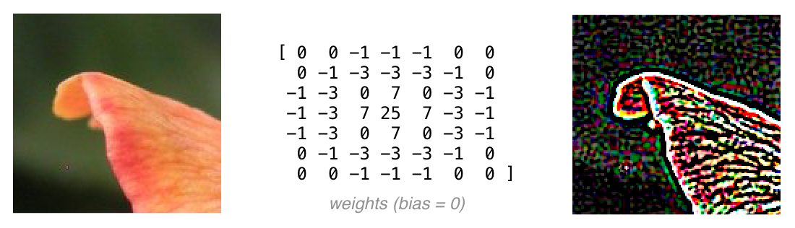

  #### Availability

  Available in OS X v10.9 and later and in iOS 9 and later.
- `
  [CIConvolution9Horizontal](#apple-f4xwc4dqnrsv64tfmyxwi33df5tgs3dumvzc6y3jf5busq3pnz3g63dvoruw63rzjbxxe2l2n5xhiylm)`

  Modifies pixel values by performing a 9-element horizontal convolution.

  #### Localized Display Name

  CIConvolution9Horizontal

  #### Parameters

|  |  |
| --- | --- |
| `inputImage` | A `CIImage` object whose display name is Image. |
| `inputWeights` | A `CIVector` object whose display name is Weights.  Default value: [0 0 0 0 1 0 0 0 0] Identity: [0 0 0 0 1 0 0 0 0] |
| `inputBias` | An `NSNumber` object whose attribute type is `CIAttributeTypeDistance` and whose display name is Bias.  Default value: 0.00 Identity: 0.00 |

  #### Discussion

  A convolution filter generates each output pixel by summing all elements in the element-wise product of two matrices—a weight matrix and a matrix containing the neighborhood surrounding the corresponding input pixel—and adding a bias. This operation is performed independently for each color component (including the alpha component), and the resulting value is clamped to the range between `0.0` and `1.0`. You can create many types of image processing effects using different weight matrices, such as blurring, sharpening, edge detection, translation, and embossing.

  This filter uses a 9x1 weight matrix and the 9x1 neighborhood surrounding an input pixel (that is, the pixel itself and those within a distance of four pixels horizontally). Unlike convolution filters which use square matrices, this filter can only produce effects along a horizontal axis, but it can be combined with `[CIConvolution9Vertical](#apple-f4xwc4dqnrsv64tfmyxwi33df5tgs3dumvzc6y3jf5busq3pnz3g63dvoruw63rzkzsxe5djmnqwy)` to approximate the effect of certain 9x9 weight matrices.

  If you want to preserve the overall brightness of the image, ensure that the sum of all values in the weight matrix is `1.0`. You may find it convenient to devise a weight matrix without this constraint and then normalize it by dividing each element by the sum of all elements.

  #### Member Of

  `CICategoryBuiltIn`, `CICategoryStillImage`, `CICategoryVideo`, `CICategoryStylize`

  #### Sample Output

  __Figure 121__The result of using the CIConvolution9Horizontal filter
  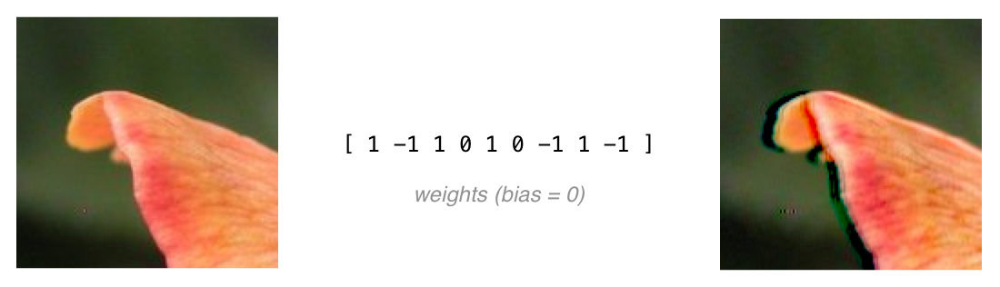

  #### Availability

  Available in OS X v10.9 and later and in iOS 7.0 and later.
- `
  [CIConvolution9Vertical](#apple-f4xwc4dqnrsv64tfmyxwi33df5tgs3dumvzc6y3jf5busq3pnz3g63dvoruw63rzkzsxe5djmnqwy)`

  Modifies pixel values by performing a 9-element vertical convolution.

  #### Localized Display Name

  CIConvolution9Vertical

  #### Parameters

|  |  |
| --- | --- |
| `inputImage` | A `CIImage` object whose display name is Image. |
| `inputWeights` | A `CIVector` object whose display name is Weights.  Default value: [0 0 0 0 1 0 0 0 0] Identity: [0 0 0 0 1 0 0 0 0] |
| `inputBias` | An `NSNumber` object whose attribute type is `CIAttributeTypeDistance` and whose display name is Bias.  Default value: 0.00 Identity: 0.00 |

  #### Discussion

  A convolution filter generates each output pixel by summing all elements in the element-wise product of two matrices—a weight matrix and a matrix containing the neighborhood surrounding the corresponding input pixel—and adding a bias. This operation is performed independently for each color component (including the alpha component), and the resulting value is clamped to the range between `0.0` and `1.0`. You can create many types of image processing effects using different weight matrices, such as blurring, sharpening, edge detection, translation, and embossing.

  This filter uses a 1x9 weight matrix and the 1x9 neighborhood surrounding an input pixel (that is, the pixel itself and those within a distance of four pixels vertically). Unlike convolution filters which use square matrices, this filter can only produce effects along a vertical axis, but it can be combined with `[CIConvolution9Vertical](#apple-f4xwc4dqnrsv64tfmyxwi33df5tgs3dumvzc6y3jf5busq3pnz3g63dvoruw63rzkzsxe5djmnqwy)` to approximate the effect of certain 9x9 weight matrices.

  If you want to preserve the overall brightness of the image, ensure that the sum of all values in the weight matrix is `1.0`. You may find it convenient to devise a weight matrix without this constraint and then normalize it by dividing each element by the sum of all elements.

  #### Member Of

  `CICategoryBuiltIn`, `CICategoryStillImage`, `CICategoryVideo`, `CICategoryStylize`

  #### Sample Output

  __Figure 122__The result of using the CIConvolution9Vertical filter
  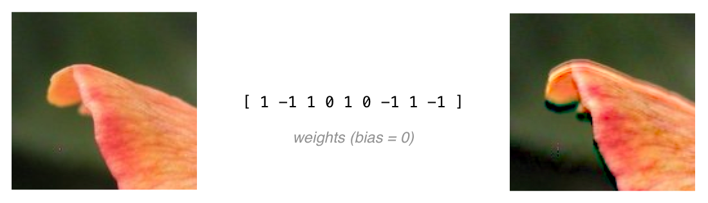

  #### Availability

  Available in OS X v10.9 and later and in iOS 7.0 and later.
- `
  [CICrystallize](#apple-f4xwc4dqnrsv64tfmyxwi33df5tgs3dumvzc6y3jf5busq3spfzxiylmnruxuzi)`

  Creates polygon-shaped color blocks by aggregating source pixel-color values.

  #### Localized Display Name

  Crystallize

  #### Parameters

|  |  |
| --- | --- |
| `inputImage` | A `CIImage` object whose display name is Image. |
| `inputRadius` | An `NSNumber` object whose attribute type is `CIAttributeTypeDistance` and whose display name is Radius.  Default value: 20.00 |
| `inputCenter` | A `CIVector` object whose attribute type is `CIAttributeTypePosition` and whose display name is Center.  Default value: [150 150] |

  #### Member Of

  `CICategoryBuiltIn`, `CICategoryStillImage`, `CICategoryVideo`, `CICategoryStylize`

  #### Sample Output

  __Figure 123__The result of using the CICrystallize filter
  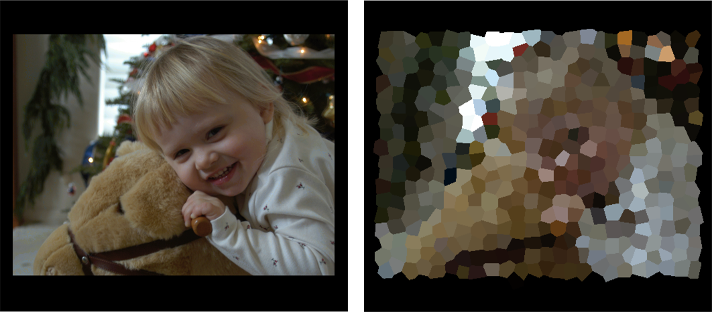

  #### Availability

  Available in OS X v10.4 and later and in iOS 9 and later.
- `
  [CIDepthOfField](#apple-f4xwc4dqnrsv64tfmyxwi33df5tgs3dumvzc6y3jf5busrdfob2gqt3gizuwk3de)`

  Simulates a depth of field effect.

  #### Localized Display Name

  Depth of Field

  #### Parameters

|  |  |
| --- | --- |
| `inputImage` | A `CIImage` object whose display name is Image. |
| `inputPoint0` | The focused region of the image stretches in a line between `inputPoint0` and `inputPoint1` of the image. A `CIVector` object whose attribute type is `CIAttributeTypePosition`. |
| `inputPoint1` | A `CIVector` object whose attribute type is `CIAttributeTypePosition`. |
| `inputSaturation` | A saturation effect applied to the in-focus regions of the image. An `NSNumber` object whose attribute type is `CIAttributeTypeScalar`. This value indications the amount to adjust the saturation on the in-focus portion of the image. |
| `inputUnsharpMaskRadius` | Specifies the radius of the unsharp mask effect applied to the in-focus area. An `NSNumber` object whose attribute type is `CIAttributeTypeScalar`. |
| `inputUnsharpMaskIntensity` | Specifies the intensity of the unsharp mask effect applied to the in-focus area. An `NSNumber` object whose attribute type is `CIAttributeTypeScalar`. |
| `inputRadius` | Controls how much the out-of-focus regions are blurred. An `NSNumber` object whose attribute type is `CIAttributeTypeScalar`. This value specifies the distance from the center of the effect. |

  #### Member Of

  `CICategoryBuiltIn`, `CICategoryStillImage`, `CICategoryVideo`, `CICategoryStylize`

  #### Sample Output

  __Figure 124__The result of using the CIDepthOfField filter
  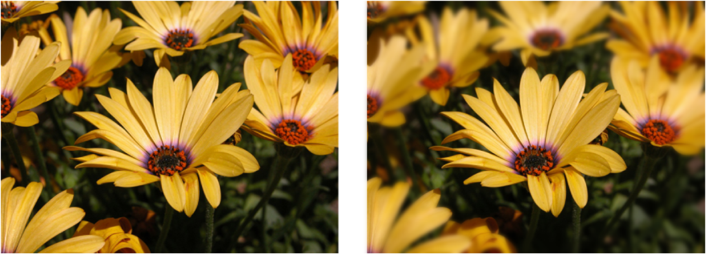

  #### Availability

  Available in OS X v10.6 and later and in iOS 9 and later.
- `
  [CIEdges](#apple-f4xwc4dqnrsv64tfmyxwi33df5tgs3dumvzc6y3jf5busrlem5sxg)`

  Finds all edges in an image and displays them in color.

  #### Localized Display Name

  Edges

  #### Parameters

|  |  |
| --- | --- |
| `inputImage` | A `CIImage` object whose display name is Image. |
| `inputIntensity` | An `NSNumber` object whose attribute type is `CIAttributeTypeScalar` and whose display name is Intensity.  Default value: 1.00 |

  #### Member Of

  `CICategoryBuiltIn`, `CICategoryStillImage`, `CICategoryVideo`, `CICategoryStylize`

  #### Sample Output

  __Figure 125__The result of using the CIEdges filter
  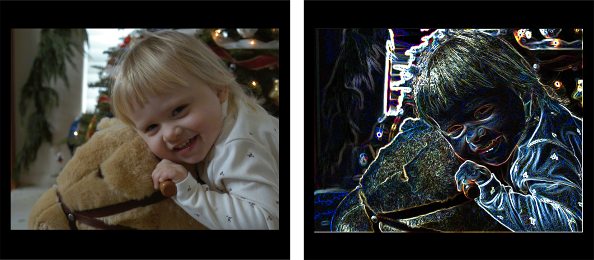

  #### Availability

  Available in OS X v10.4 and later and in iOS 9 and later.
- `
  [CIEdgeWork](#apple-f4xwc4dqnrsv64tfmyxwi33df5tgs3dumvzc6y3jf5busrlem5svo33snm)`

  Produces a stylized black-and-white rendition of an image that looks similar to a woodblock cutout.

  #### Localized Display Name

  Edge Work

  #### Parameters

|  |  |
| --- | --- |
| `inputImage` | A `CIImage` object whose display name is Image. |
| `inputRadius` | An `NSNumber` object whose attribute type is `CIAttributeTypeDistance` and whose display name is Radius.  Default value: 3.00 |

  #### Member Of

  `CICategoryBuiltIn`, `CICategoryStillImage`, `CICategoryVideo`, `CICategoryStylize`

  #### Sample Output

  __Figure 126__The result of using the CIEdgeWork filter
  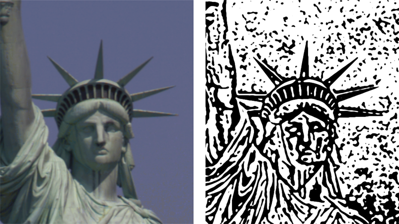

  #### Availability

  Available in OS X v10.4 and later and in iOS 9 and later.
- `
  [CIGloom](#apple-f4xwc4dqnrsv64tfmyxwi33df5tgs3dumvzc6y3jf5busr3mn5xw2)`

  Dulls the highlights of an image.

  #### Localized Display Name

  Gloom

  #### Parameters

|  |  |
| --- | --- |
| `inputImage` | A `CIImage` object whose display name is Image. |
| `inputRadius` | An `NSNumber` object whose attribute type is `CIAttributeTypeDistance` and whose display name is Radius.  Default value: 10.00 |
| `inputIntensity` | An `NSNumber` object whose attribute type is `CIAttributeTypeScalar` and whose display name is Intensity.  Default value: 0.5 |

  #### Member Of

  `CICategoryBuiltIn`, `CICategoryStillImage`, `CICategoryVideo`, `CICategoryStylize`

  #### Sample Output

  __Figure 127__The result of using the CIGloom filter
  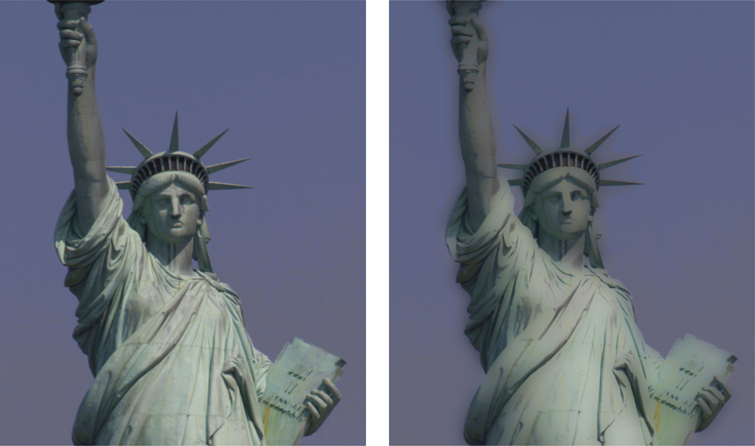

  #### Availability

  Available in OS X v10.4 and later and in iOS 6.0 and later.
- `
  [CIHeightFieldFromMask](#apple-f4xwc4dqnrsv64tfmyxwi33df5tgs3dumvzc6y3jf5bussdfnftwq5cgnfswyzcgojxw2tlbonvq)`

  Produces a continuous three-dimensional, loft-shaped height field from a grayscale mask.

  #### Localized Display Name

  Height Field From Mask

  #### Parameters

|  |  |
| --- | --- |
| `inputImage` | A `CIImage` object whose display name is Image. |
| `inputRadius` | An `NSNumber` object whose attribute type is `CIAttributeTypeDistance` and whose display name is Radius.  Default value: 10.00 |

  #### Discussion

  The white values of the mask define those pixels that are inside the height field while the black values define those pixels that are outside. The field varies smoothly and continuously inside the mask, reaching the value 0 at the edge of the mask. You can use this filter with the CIShadedMaterial filter to produce extremely realistic shaded objects.

  #### Member Of

  `CICategoryBuiltIn`, `CICategoryStillImage`, `CICategoryVideo`, `CICategoryStylize`

  #### Sample Output

  __Figure 128__The result of using the CIHeightFieldFromMask filter
  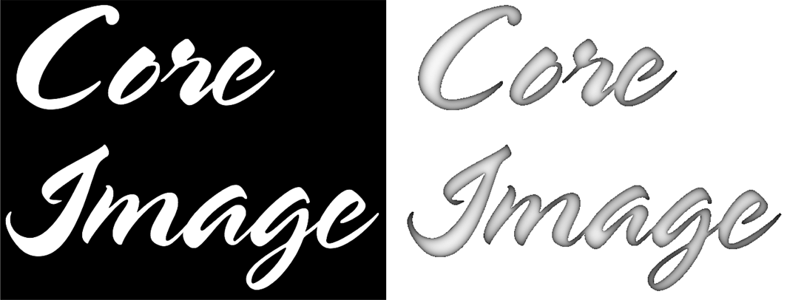

  #### Availability

  Available in OS X v10.4 and later and in iOS 9 and later.
- `
  [CIHexagonalPixellate](#apple-f4xwc4dqnrsv64tfmyxwi33df5tgs3dumvzc6y3jf5bussdfpbqwo33omfwfa2lymvwgyylumu)`

  Maps an image to colored hexagons whose color is defined by the replaced pixels.

  #### Localized Display Name

  CIHexagonalPixellate

  #### Parameters

|  |  |
| --- | --- |
| `inputImage` | A `CIImage` object whose display name is Image. |
| `inputCenter` | A `CIVector` object whose attribute type is `CIAttributeTypePosition` and whose display name is Center.  Default value: [150 150] |
| `inputScale` | An `NSNumber` object whose attribute type is `CIAttributeTypeDistance` and whose display name is Scale.  Default value: 8.00 |

  #### Member Of

  `CICategoryBuiltIn`, `CICategoryStillImage`, `CICategoryVideo`, `CICategoryStylize`

  #### Sample Output

  __Figure 129__The result of using the CIHexagonalPixellate filter
  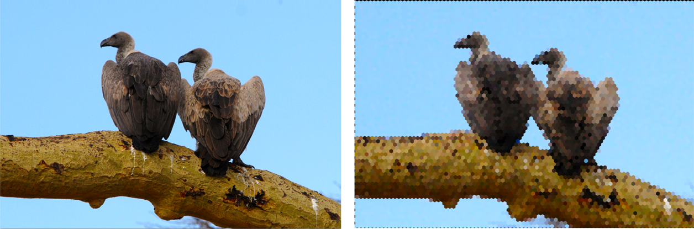

  #### Availability

  Available in OS X v10.5 and later and in iOS 9 and later.
- `
  [CIHighlightShadowAdjust](#apple-f4xwc4dqnrsv64tfmyxwi33df5tgs3dumvzc6y3jf5bussdjm5ugy2lhnb2fg2dbmrxxoqlenj2xg5a)`

  Adjust the tonal mapping of an image while preserving spatial detail.

  #### Localized Display Name

  Highlight and Shadows

  #### Parameters

|  |  |
| --- | --- |
| `inputImage` | A `CIImage` object whose display name is Image. |
| `inputHighlightAmount` | An `NSNumber` object whose attribute type is `CIAttributeTypeScalar` and whose display name is Highlight Amount.  Default value: 1.00 |
| `inputShadowAmount` | An `NSNumber` object whose attribute type is `CIAttributeTypeScalar` and whose display name is Shadow Amount. |

  #### Member Of

  `CICategoryBuiltIn`, `CICategoryStillImage`, `CICategoryVideo`, `CICategoryStylize`

  #### Sample Output

  __Figure 130__The result of using the CIHighlightShadowAdjust filter
  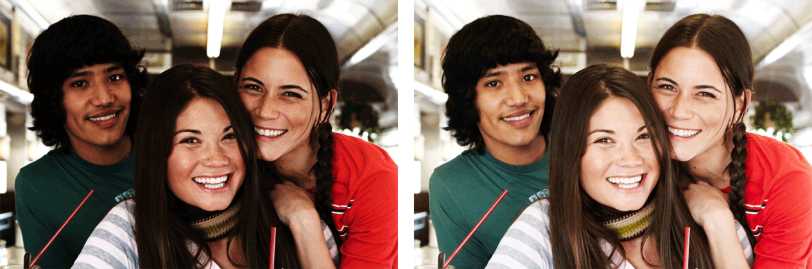

  #### Availability

  Available in OS X v10.7 and later and in iOS 5.0 and later.
- `
  [CILineOverlay](#apple-f4xwc4dqnrsv64tfmyxwi33df5tgs3dumvzc6y3jf5bustdjnzsu65tfojwgc6i)`

  Creates a sketch that outlines the edges of an image in black.

  #### Localized Display Name

  Line Overlay

  #### Parameters

|  |  |
| --- | --- |
| `inputImage` | A `CIImage` object whose display name is Image. |
| `inputNRNoiseLevel` | An `NSNumber` object whose attribute type is `CIAttributeTypeScalar` and whose display name is NR Noise Level.  Default value: 0.07 |
| `inputNRSharpness` | An `NSNumber` object whose attribute type is `CIAttributeTypeScalar` and whose display name is NR Sharpness.  Default value: 0.71 |
| `inputEdgeIntensity` | An `NSNumber` object whose attribute type is `CIAttributeTypeScalar` and whose display name is Edge Intensity.  Default value: 1.00 |
| `inputThreshold` | An `NSNumber` object whose attribute type is `CIAttributeTypeScalar` and whose display name is Threshold.  Default value: 0.10 Minimum: 0.00 Maximum: 0.00 Slider minimum: 0.00 Slider maximum: 1.00 Identity: 0.00 |
| `inputContrast` | An `NSNumber` object whose attribute type is `CIAttributeTypeScalar` and whose display name is Contrast.  Default value: 50.00 |

  #### Discussion

  The portions of the image that are not outlined are transparent.

  #### Member Of

  `CICategoryBuiltIn`, `CICategoryStillImage`, `CICategoryVideo`, `CICategoryStylize`

  #### Sample Output

  __Figure 131__The result of using the CILineOverlay filter
  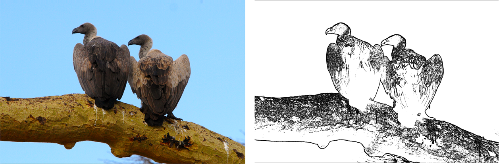

  #### Availability

  Available in OS X v10.5 and later and in iOS 9 and later.
- `
  [CIPixellate](#apple-f4xwc4dqnrsv64tfmyxwi33df5tgs3dumvzc6y3jf5busudjpbswy3dborsq)`

  Makes an image blocky by mapping the image to colored squares whose color is defined by the replaced pixels.

  #### Localized Display Name

  Pixellate

  #### Parameters

|  |  |
| --- | --- |
| `inputImage` | A `CIImage` object whose display name is Image. |
| `inputCenter` | A `CIVector` object whose attribute type is `CIAttributeTypePosition` and whose display name is Center.  Default value: [150 150] |
| `inputScale` | An `NSNumber` object whose attribute type is `CIAttributeTypeDistance` and whose display name is Scale.  Default value: 8.00 |

  #### Member Of

  `CICategoryBuiltIn`, `CICategoryStillImage`, `CICategoryVideo`, `CICategoryStylize`

  #### Sample Output

  __Figure 132__The result of using the CIPixellate filter
  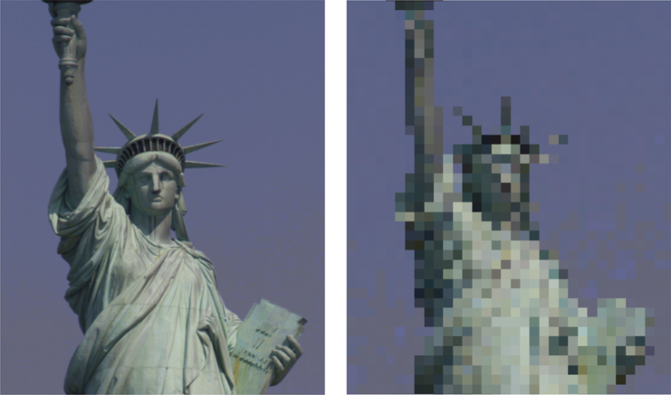

  #### Availability

  Available in OS X v10.4 and later and in iOS 6.0 and later.
- `
  [CIPointillize](#apple-f4xwc4dqnrsv64tfmyxwi33df5tgs3dumvzc6y3jf5busudpnfxhi2lmnruxuzi)`

  Renders the source image in a pointillistic style.

  #### Localized Display Name

  Pointillize

  #### Parameters

|  |  |
| --- | --- |
| `inputImage` | A `CIImage` object whose display name is Image. |
| `inputRadius` | An `NSNumber` object whose attribute type is `CIAttributeTypeDistance` and whose display name is Radius.  Default value: 20.00 |
| `inputCenter` | A `CIVector` object whose attribute type is `CIAttributeTypePosition` and whose display name is Center.  Default value: [150 150] |

  #### Member Of

  `CICategoryBuiltIn`, `CICategoryStillImage`, `CICategoryVideo`, `CICategoryStylize`

  #### Sample Output

  __Figure 133__The result of using the CIPointillize filter
  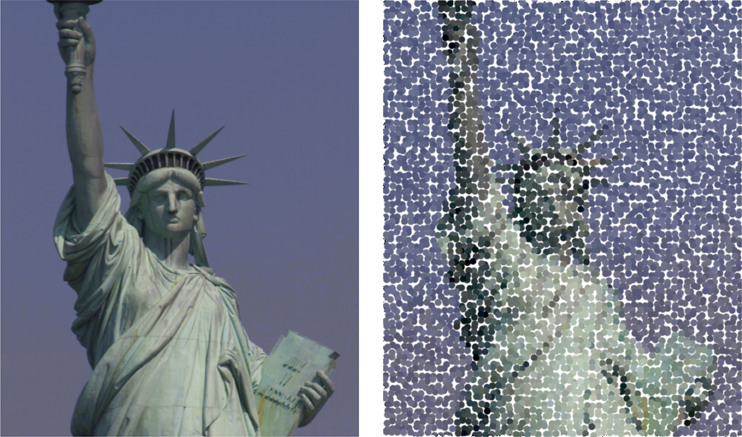

  #### Availability

  Available in OS X v10.4 and later and in iOS 9 and later.
- `
  [CIShadedMaterial](#apple-f4xwc4dqnrsv64tfmyxwi33df5tgs3dumvzc6y3jf5busu3imfsgkzcnmf2gk4tjmfwa)`

  Produces a shaded image from a height field.

  #### Localized Display Name

  Shaded Material

  #### Parameters

|  |  |
| --- | --- |
| `inputImage` | A `CIImage` object whose display name is Image. |
| `inputShadingImage` | A `CIImage` object whose display name is Shading Image. |
| `inputScale` | An `NSNumber` object whose attribute type is `CIAttributeTypeDistance` and whose display name is Scale.  Default value: 10.00 |

  #### Discussion

  The height field is defined to have greater heights with lighter shades, and lesser heights (lower areas) with darker shades. You can combine this filter with the CIHeightFieldFromMask filter to produce quick shadings of masks, such as text.

  This filter sets the input image as a height-field (multiplied by the scale parameter), and computes a normal vector for each pixel. It then uses that normal vector to look up the reflected color for that direction in the input shading image.

  The input shading image contains the picture of a hemisphere, which defines the way the surface is shaded. The look-up coordinate for a normal vector is:

  `(normal.xy + 1.0) * 0.5 * vec2(shadingImageWidth, shadingImageHeight)`

  #### Member Of

  `CICategoryBuiltIn`, `CICategoryStillImage`, `CICategoryVideo`, `CICategoryStylize`

  #### Sample Output

  __Figure 134__The result of using the CIShadedMaterial filter
  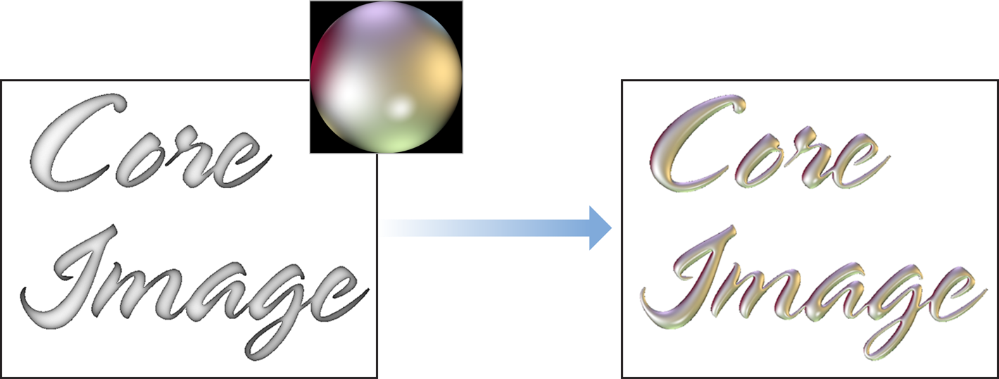

  #### Availability

  Available in OS X v10.4 and later and in iOS 9 and later.
- `
  [CISpotColor](#apple-f4xwc4dqnrsv64tfmyxwi33df5tgs3dumvzc6y3jf5busu3qn52eg33mn5za)`

  Replaces one or more color ranges with spot colors.

  #### Localized Display Name

  Spot Color

  #### Parameters

|  |  |
| --- | --- |
| `inputImage` | A `CIImage` object whose display name is Image. |
| `inputCenterColor1` | A `CIColor` object whose display name is Center Color 1. |
| `inputReplacementColor1` | A `CIColor` object whose display name is Replacement Color 1. |
| `inputCloseness1` | An `NSNumber` object whose attribute type is `CIAttributeTypeScalar` and whose display name is Closeness1.  Default value: 0.22 |
| `inputContrast1` | An `NSNumber` object whose attribute type is `CIAttributeTypeScalar` and whose display name is Contrast 1.  Default value: 0.98 |
| `inputCenterColor2` | A `CIColor` object whose display name is Center Color 2. |
| `inputReplacementColor2` | A `CIColor` object whose display name is Replacement Color 2. |
| `inputCloseness2` | An `NSNumber` object whose attribute type is `CIAttributeTypeScalar` and whose display name is Closeness 2.  Default value: 0.15 |
| `inputContrast2` | An `NSNumber` object whose attribute type is `CIAttributeTypeScalar` and whose display name is Contrast 2.  Default value: 0.98 |
| `inputCenterColor3` | A `CIColor` object whose display name is Center Color 3. |
| `inputReplacementColor3` | A `CIColor` object whose display name is Replacement Color 3. |
| `inputCloseness3` | An `NSNumber` object whose attribute type is `CIAttributeTypeScalar` and whose display name is Closeness 3.  Default value: 0.50 |
| `inputContrast3` | An `NSNumber` object whose attribute type is `CIAttributeTypeScalar` and whose display name is Contrast 3.  Default value: 0.99 |

  #### Member Of

  `CICategoryBuiltIn`, `CICategoryStillImage`, `CICategoryVideo`, `CICategoryStylize`

  #### Sample Output

  __Figure 135__The result of using the CISpotColor filter
  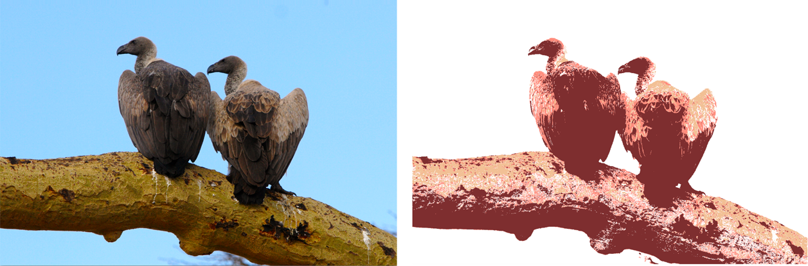

  #### Availability

  Available in OS X v10.5 and later and in iOS 9 and later.
- `
  [CISpotLight](#apple-f4xwc4dqnrsv64tfmyxwi33df5tgs3dumvzc6y3jf5busu3qn52ey2lhnb2a)`

  Applies a directional spotlight effect to an image.

  #### Localized Display Name

  Spot Light

  #### Parameters

|  |  |
| --- | --- |
| `inputImage` | A `CIImage` object whose display name is Image. |
| `inputLightPosition` | A `CIVector` object whose attribute type is `CIAttributeTypePosition3` and whose display name is Light Position.  Default value: [400 600 150] |
| `inputLightPointsAt` | A `CIVector` object whose attribute type is `CIAttributeTypePosition3` and whose display name is Light Points At.  Default value: [200 200 0] |
| `inputBrightness` | An `NSNumber` object whose attribute type is `CIAttributeTypeDistance` and whose display name is Brightness.  Default value: 3.00 |
| `inputConcentration` | An `NSNumber` object whose attribute type is `CIAttributeTypeScalar` and whose display name is Concentration.  Default value: 0.10 |
| `inputColor` | A `CIColor` object whose attribute type is `CIAttributeTypeOpaqueColor` and whose display name is Color. |

  #### Member Of

  `CICategoryBuiltIn`, `CICategoryStillImage`, `CICategoryVideo`, `CICategoryStylize`

  #### Sample Output

  __Figure 136__The result of using the CISpotLight filter
  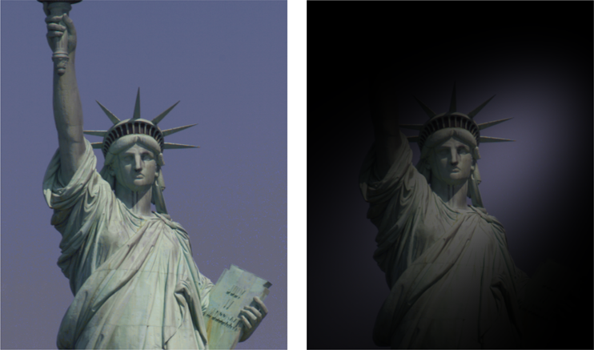

  #### Availability

  Available in OS X v10.4 and later and in iOS 9 and later.

[### CICategoryTileEffect](#apple-f4xwc4dqnrsv64tfmyxwi33df52wszbpkridgmbqgaydcmzwfvjvomrrgy)

- `
  [CIAffineClamp](#apple-f4xwc4dqnrsv64tfmyxwi33df5tgs3dumvzc6y3jf5busqlgmzuw4zkdnrqw24a)`

  Performs an affine transform on a source image and then clamps the pixels at the edge of the transformed image, extending them outwards.

  #### Localized Display Name

  Affine Clamp

  #### Parameters

|  |  |
| --- | --- |
| `inputImage` | A `CIImage` object whose display name is Image. |
| `inputTransform` | On iOS, an `NSValue` object whose attribute type is `CIAttributeTypeTransform`. You must pass the transform as `NSData` using a statement similar to the following, where `xform` is an affine transform:  1. `[myFilter setValue:[NSValue valueWithBytes:&xform` 2. `objCType:@encode(CGAffineTransform)]` 3. `forKey:@"inputTransform"];`  On OS X, an `NSAffineTransform` object whose attribute type is `CIAttributeTypeTransform`. |

  #### Discussion

  This filter performs similarly to the CIAffineTransform filter except that it produces an image with infinite extent. You can use this filter when you need to blur an image but you want to avoid a soft, black fringe along the edges.

  #### Member Of

  `CICategoryBuiltIn`, `CICategoryStillImage`, `CICategoryVideo`, `CICategoryTileEffect`

  #### Sample Output

  __Figure 137__The result of using the CIAffineClamp filter
  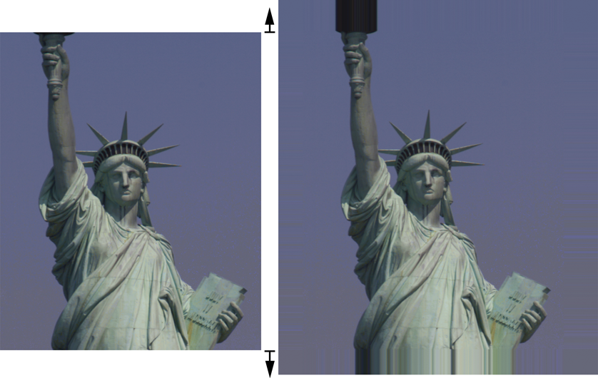

  #### Availability

  Available in OS X v10.4 and later and in iOS 6.0 and later.
- `
  [CIAffineTile](#apple-f4xwc4dqnrsv64tfmyxwi33df5tgs3dumvzc6y3jf5busqlgmzuw4zkunfwgk)`

  Applies an affine transform to an image and then tiles the transformed image.

  #### Localized Display Name

  Affine Tile

  #### Parameters

|  |  |
| --- | --- |
| `inputImage` | A `CIImage` object whose display name is Image. |
| `inputTransform` | On iOS, an `NSValue` object whose attribute type is `CIAttributeTypeTransform`. You must pass the transform as `NSData` using a statement similar to the following, where `xform` is an affine transform:  1. `[myFilter setValue:[NSValue valueWithBytes:&xform` 2. `objCType:@encode(CGAffineTransform)]` 3. `forKey:@"inputTransform"];`  On OS X, an `NSAffineTransform` object whose attribute type is `CIAttributeTypeTransform`. |

  #### Member Of

  `CICategoryBuiltIn`, `CICategoryStillImage`, `CICategoryVideo`, `CICategoryTileEffect`

  #### Sample Output

  __Figure 138__The result of using the CIAffineTile filter
  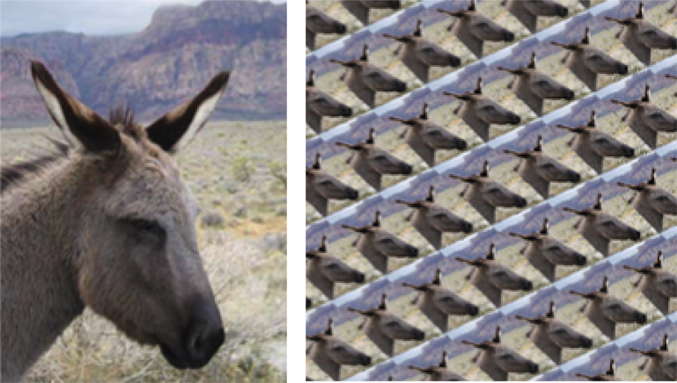

  #### Availability

  Available in OS X v10.4 and later and in iOS 6.0 and later.
- `
  [CIEightfoldReflectedTile](#apple-f4xwc4dqnrsv64tfmyxwi33df5tgs3dumvzc6y3jf5busrljm5uhiztpnrsfezlgnrswg5dfmrkgs3df)`

  Produces a tiled image from a source image by applying an 8-way reflected symmetry.

  #### Localized Display Name

  CIEightfoldReflectedTile

  #### Parameters

|  |  |
| --- | --- |
| `inputImage` | A `CIImage` object whose display name is Image. |
| `inputCenter` | A `CIVector` object whose attribute type is `CIAttributeTypePosition` and whose display name is Center.  Default value: [150 150] |
| `inputAngle` | An `NSNumber` object whose attribute type is `CIAttributeTypeAngle` and whose display name is Angle.  Default value: 0.00 |
| `inputWidth` | The width, along with the `inputCenter` parameter, defines the portion of the image to tile. An `NSNumber` object whose attribute type is `CIAttributeTypeDistance` and whose display name is Width.  Default value: 100.00 |

  #### Member Of

  `CICategoryBuiltIn`, `CICategoryStillImage`, `CICategoryVideo`, `CICategoryTileEffect`

  #### Sample Output

  __Figure 139__The result of using the CIEightfoldReflectedTile filter
  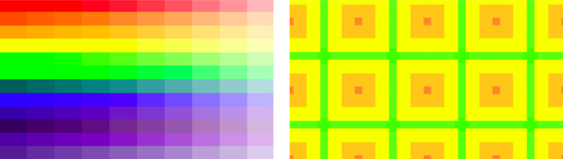

  #### Availability

  Available in OS X v10.5 and later and in iOS 6.0 and later.
- `
  [CIFourfoldReflectedTile](#apple-f4xwc4dqnrsv64tfmyxwi33df5tgs3dumvzc6y3jf5busrtpovzgm33mmrjgkztmmvrxizlekruwyzi)`

  Produces a tiled image from a source image by applying a 4-way reflected symmetry.

  #### Localized Display Name

  CIFourfoldReflectedTile

  #### Parameters

|  |  |
| --- | --- |
| `inputImage` | A `CIImage` object whose display name is Image. |
| `inputCenter` | A `CIVector` object whose attribute type is `CIAttributeTypePosition` and whose display name is Center.  Default value: [150 150] |
| `inputAngle` | An `NSNumber` object whose attribute type is `CIAttributeTypeAngle` and whose display name is Angle.  Default value: 0.00 |
| `inputAcuteAngle` | An `NSNumber` object whose attribute type is `CIAttributeTypeAngle` and whose display name is Acute Angle.  Default value: 1.57 |
| `inputWidth` | The width, along with the `inputCenter` parameter, defines the portion of the image to tile. An `NSNumber` object whose attribute type is `CIAttributeTypeDistance` and whose display name is Width.  Default value: 100.00 |

  #### Member Of

  `CICategoryBuiltIn`, `CICategoryStillImage`, `CICategoryVideo`, `CICategoryTileEffect`

  #### Sample Output

  __Figure 140__The result of using the CIFourfoldReflectedTile filter
  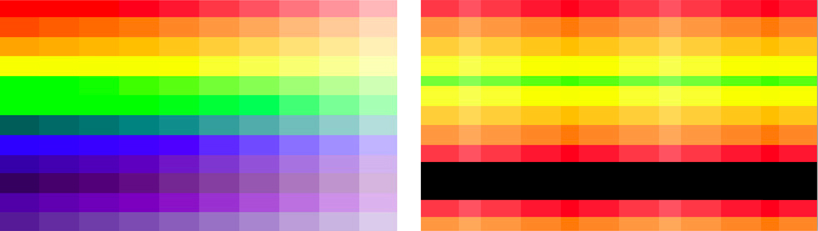

  #### Availability

  Available in OS X v10.5 and later and in iOS 6.0 and later.
- `
  [CIFourfoldRotatedTile](#apple-f4xwc4dqnrsv64tfmyxwi33df5tgs3dumvzc6y3jf5busrtpovzgm33mmrjg65dborswivdjnrsq)`

  Produces a tiled image from a source image by rotating the source image at increments of 90 degrees.

  #### Localized Display Name

  CIFourfoldRotatedTile

  #### Parameters

|  |  |
| --- | --- |
| `inputImage` | A `CIImage` object whose display name is Image. |
| `inputCenter` | A `CIVector` object whose attribute type is `CIAttributeTypePosition` and whose display name is Center.  Default value: [150 150] |
| `inputAngle` | An `NSNumber` object whose attribute type is `CIAttributeTypeAngle` and whose display name is Angle.  Default value: 0.00 |
| `inputWidth` | The width, along with the `inputCenter` parameter, defines the portion of the image to tile. An `NSNumber` object whose attribute type is `CIAttributeTypeDistance` and whose display name is Width.  Default value: 100.00 |

  #### Member Of

  `CICategoryBuiltIn`, `CICategoryStillImage`, `CICategoryVideo`, `CICategoryTileEffect`

  #### Sample Output

  __Figure 141__The result of using the CIFourfoldRotatedTile filter
  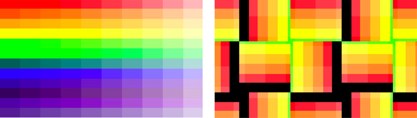

  #### Availability

  Available in OS X v10.5 and later and in iOS 6.0 and later.
- `
  [CIFourfoldTranslatedTile](#apple-f4xwc4dqnrsv64tfmyxwi33df5tgs3dumvzc6y3jf5busrtpovzgm33mmrkheyloonwgc5dfmrkgs3df)`

  Produces a tiled image from a source image by applying 4 translation operations.

  #### Localized Display Name

  CIFourfoldTranslatedTile

  #### Parameters

|  |  |
| --- | --- |
| `inputImage` | A `CIImage` object whose display name is Image. |
| `inputCenter` | A `CIVector` object whose attribute type is `CIAttributeTypePosition` and whose display name is Center.  Default value: [150 150] |
| `inputAngle` | An `NSNumber` object whose attribute type is `CIAttributeTypeAngle` and whose display name is Angle.  Default value: 0.00 |
| `inputAcuteAngle` | An `NSNumber` object whose attribute type is `CIAttributeTypeAngle` and whose display name is Acute Angle.  Default value: 1.57 |
| `inputWidth` | The width, along with the `inputCenter` parameter, defines the portion of the image to tile. An `NSNumber` object whose attribute type is `CIAttributeTypeDistance` and whose display name is Width.  Default value: 100.00 |

  #### Member Of

  `CICategoryBuiltIn`, `CICategoryStillImage`, `CICategoryVideo`, `CICategoryTileEffect`

  #### Sample Output

  __Figure 142__The result of using the CIFourfoldTranslatedTile filter
  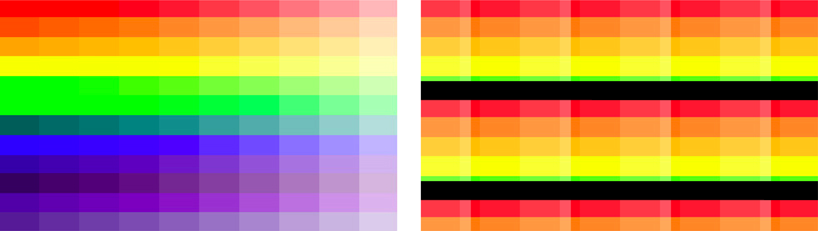

  #### Availability

  Available in OS X v10.5 and later and in iOS 6.0 and later.
- `
  [CIGlideReflectedTile](#apple-f4xwc4dqnrsv64tfmyxwi33df5tgs3dumvzc6y3jf5busr3mnfsgkutfmzwgky3umvsfi2lmmu)`

  Produces a tiled image from a source image by translating and smearing the image.

  #### Localized Display Name

  CIGlideReflectedTile

  #### Parameters

|  |  |
| --- | --- |
| `inputImage` | A `CIImage` object whose display name is Image. |
| `inputCenter` | A `CIVector` object whose attribute type is `CIAttributeTypePosition` and whose display name is Center.  Default value: [150 150] |
| `inputAngle` | An `NSNumber` object whose attribute type is `CIAttributeTypeAngle` and whose display name is Angle.  Default value: 0.00 |
| `inputWidth` | The width, along with the `inputCenter` parameter, defines the portion of the image to tile. An `NSNumber` object whose attribute type is `CIAttributeTypeDistance` and whose display name is Width.  Default value: 100.00 |

  #### Member Of

  `CICategoryBuiltIn`, `CICategoryStillImage`, `CICategoryVideo`, `CICategoryTileEffect`

  #### Sample Output

  __Figure 143__The result of using the CIGlideReflectedTile filter
  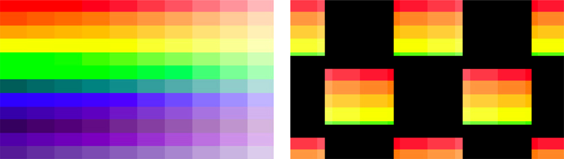

  #### Availability

  Available in OS X v10.5 and later and in iOS 6.0 and later.
- `
  [CIKaleidoscope](#apple-f4xwc4dqnrsv64tfmyxwi33df5tgs3dumvzc6y3jf5buss3bnrswszdponrw64df)`

  Produces a kaleidoscopic image from a source image by applying 12-way symmetry.

  #### Localized Display Name

  Kaleidoscope

  #### Parameters

|  |  |
| --- | --- |
| `inputImage` | A `CIImage` object whose display name is Image. |
| `inputCount` | An `NSNumber` object whose attribute type is `CIAttributeTypeScalar` and whose display name is Count.  Default value: 6.00 |
| `inputCenter` | A `CIVector` object whose attribute type is `CIAttributeTypePosition` and whose display name is Center.  Default value: [150 150] |
| `inputAngle` | An `NSNumber` object whose attribute type is `CIAttributeTypeAngle` and whose display name is Angle.  Default value: 0.00 |

  #### Member Of

  `CICategoryBuiltIn`, `CICategoryStillImage`, `CICategoryVideo`, `CICategoryTileEffect`

  #### Sample Output

  __Figure 144__The result of using the CIKaleidoscope filter
  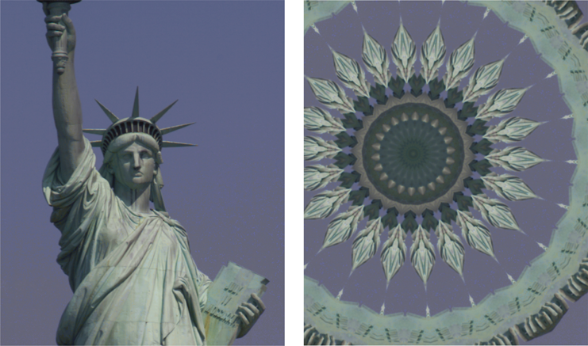

  #### Availability

  Available in OS X v10.4 and later and in iOS 9 and later.
- `
  [CIOpTile](#apple-f4xwc4dqnrsv64tfmyxwi33df5tgs3dumvzc6y3jf5bust3qkruwyzi)`

  Segments an image, applying any specified scaling and rotation, and then assembles the image again to give an op art appearance.

  #### Localized Display Name

  Op Tile

  #### Parameters

|  |  |
| --- | --- |
| `inputImage` | A `CIImage` object whose display name is Image. |
| `inputCenter` | A `CIVector` object whose attribute type is `CIAttributeTypePosition` and whose display name is Center.  Default value: [150 150] |
| `inputScale` | An `NSNumber` object whose attribute type is `CIAttributeTypeScalar` and whose display name is Scale.  Default value: 2.80 |
| `inputAngle` | An `NSNumber` object whose attribute type is `CIAttributeTypeAngle` and whose display name is Angle.  Default value: 0.00 |
| `inputWidth` | An `NSNumber` object whose attribute type is `CIAttributeTypeDistance` and whose display name is Width.  Default value: 65.00 |

  #### Member Of

  `CICategoryBuiltIn`, `CICategoryStillImage`, `CICategoryVideo`, `CICategoryTileEffect`

  #### Sample Output

  __Figure 145__The result of using the CIOpTile filter
  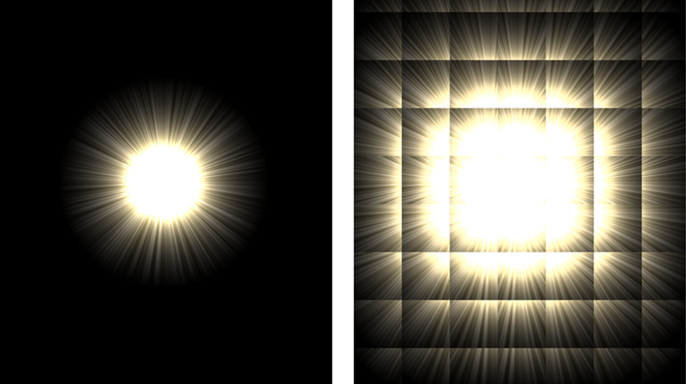

  #### Availability

  Available in OS X v10.4 and later and in iOS 9 and later.
- `
  [CIParallelogramTile](#apple-f4xwc4dqnrsv64tfmyxwi33df5tgs3dumvzc6y3jf5busudbojqwy3dfnrxwo4tbnvkgs3df)`

  Warps an image by reflecting it in a parallelogram, and then tiles the result.

  #### Localized Display Name

  Parallelogram Tile

  #### Parameters

|  |  |
| --- | --- |
| `inputImage` | A `CIImage` object whose display name is Image. |
| `inputCenter` | A `CIVector` object whose attribute type is `CIAttributeTypePosition` and whose display name is Center.  Default value: [150 150] |
| `inputAngle` | An `NSNumber` object whose attribute type is `CIAttributeTypeAngle` and whose display name is Angle.  Default value: 0.00 |
| `inputAcuteAngle` | An `NSNumber` object whose attribute type is `CIAttributeTypeAngle` and whose display name is Acute Angle.  Default value: 1.57 |
| `inputWidth` | The width, along with the `inputCenter` parameter, defines the portion of the image to tile. An `NSNumber` object whose attribute type is `CIAttributeTypeDistance` and whose display name is Width.  Default value: 100.00 |

  #### Member Of

  `CICategoryBuiltIn`, `CICategoryStillImage`, `CICategoryVideo`, `CICategoryTileEffect`

  #### Sample Output

  __Figure 146__The result of using the CIParallelogramTile filter
  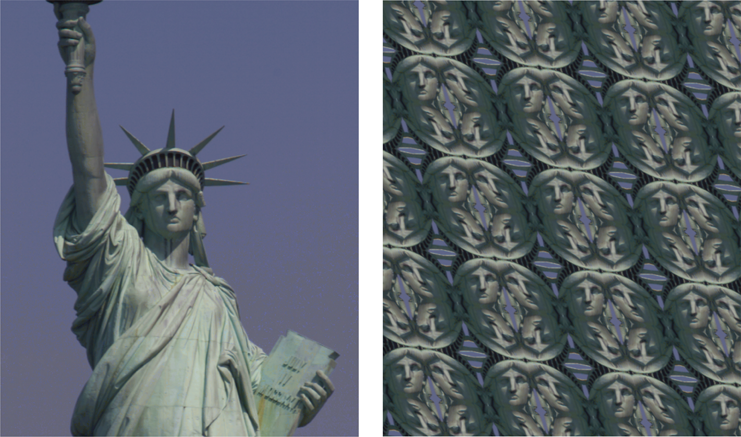

  #### Availability

  Available in OS X v10.4 and later and in iOS 9 and later.
- `
  [CIPerspectiveTile](#apple-f4xwc4dqnrsv64tfmyxwi33df5tgs3dumvzc6y3jf5busudfojzxazldoruxmzkunfwgk)`

  Applies a perspective transform to an image and then tiles the result.

  #### Localized Display Name

  Perspective Tile

  #### Parameters

|  |  |
| --- | --- |
| `inputImage` | A `CIImage` object whose display name is Image. |
| `inputTopLeft` | A `CIVector` object whose attribute type is `CIAttributeTypePosition` and whose display name is Top Left.  Default value: [118 484] |
| `inputTopRight` | A `CIVector` object whose attribute type is `CIAttributeTypePosition` and whose display name is Top Right.  Default value: [646 507] |
| `inputBottomRight` | A `CIVector` object whose attribute type is `CIAttributeTypePosition` and whose display name is Bottom Right.  Default value: [548 140] |
| `inputBottomLeft` | A `CIVector` object whose attribute type is `CIAttributeTypePosition` and whose display name is Bottom Left.  Default value: [155 153] |

  #### Member Of

  `CICategoryBuiltIn`, `CICategoryStillImage`, `CICategoryVideo`, `CICategoryTileEffect`

  #### Sample Output

  __Figure 147__The result of using the CIPerspectiveTile filter
  

  #### Availability

  Available in OS X v10.4 and later and in iOS 6.0 and later.
- `
  [CISixfoldReflectedTile](#apple-f4xwc4dqnrsv64tfmyxwi33df5tgs3dumvzc6y3jf5busu3jpbtg63dekjswm3dfmn2gkzcunfwgk)`

  Produces a tiled image from a source image by applying a 6-way reflected symmetry.

  #### Localized Display Name

  CISixfoldReflectedTile

  #### Parameters

|  |  |
| --- | --- |
| `inputImage` | A `CIImage` object whose display name is Image. |
| `inputCenter` | A `CIVector` object whose attribute type is `CIAttributeTypePosition` and whose display name is Center.  Default value: [150 150] |
| `inputAngle` | An `NSNumber` object whose attribute type is `CIAttributeTypeAngle` and whose display name is Angle.  Default value: 0.00 |
| `inputWidth` | The width, along with the `inputCenter` parameter, defines the portion of the image to tile. An `NSNumber` object whose attribute type is `CIAttributeTypeDistance` and whose display name is Width.  Default value: 100.00 |

  #### Member Of

  `CICategoryBuiltIn`, `CICategoryStillImage`, `CICategoryVideo`, `CICategoryTileEffect`

  #### Sample Output

  __Figure 148__The result of using the CISixfoldReflectedTile filter
  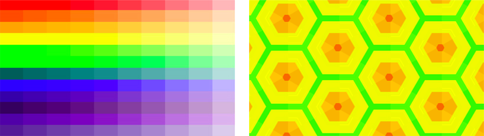

  #### Availability

  Available in OS X v10.5 and later and in iOS 6.0 and later.
- `
  [CISixfoldRotatedTile](#apple-f4xwc4dqnrsv64tfmyxwi33df5tgs3dumvzc6y3jf5busu3jpbtg63dekjxxiylumvsfi2lmmu)`

  Produces a tiled image from a source image by rotating the source image at increments of 60 degrees.

  #### Localized Display Name

  CISixfoldRotatedTile

  #### Parameters

|  |  |
| --- | --- |
| `inputImage` | A `CIImage` object whose display name is Image. |
| `inputCenter` | A `CIVector` object whose attribute type is `CIAttributeTypePosition` and whose display name is Center.  Default value: [150 150] |
| `inputAngle` | An `NSNumber` object whose attribute type is `CIAttributeTypeAngle` and whose display name is Angle.  Default value: 0.00 |
| `inputWidth` | The width, along with the `inputCenter` parameter, defines the portion of the image to tile. An `NSNumber` object whose attribute type is `CIAttributeTypeDistance` and whose display name is Width.  Default value: 100.00 |

  #### Member Of

  `CICategoryBuiltIn`, `CICategoryStillImage`, `CICategoryVideo`, `CICategoryTileEffect`

  #### Sample Output

  __Figure 149__The result of using the CISixfoldRotatedTile filter
  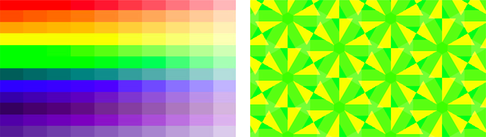

  #### Availability

  Available in OS X v10.5 and later and in iOS 6.0 and later.
- `
  [CITriangleKaleidoscope](#apple-f4xwc4dqnrsv64tfmyxwi33df5tgs3dumvzc6y3jf5busvdsnfqw4z3mmvfwc3dfnfsg643dn5ygk)`

  Maps a triangular portion of an input image to create a kaleidoscope effect.

  #### Localized Display Name

  Triangle Kaleidoscope

  #### Parameters

|  |  |
| --- | --- |
| `inputImage` | A `CIImage` object whose display name is Image. |
| `inputPoint` | A `CIVector` object whose attribute type is `CIAttributeTypePosition`.  Default value: [150 150] |
| `inputSize` | A `NSNumber` object whose attribute type is `CIAttributeTypeScalar`.  Default value: 700.00 |
| `inputRotation` | An `NSNumber` object whose attribute type is `CIAttributeTypeAngle`.  Default value: –0.36 |
| `inputDecay` | An `NSNumber` object whose attribute type is `CIAttributeTypeScalar`.  Default: 0.85 |

  #### Member Of

  `CICategoryBuiltIn`, `CICategoryStillImage`, `CICategoryVideo`, `CICategoryTileEffect`

  #### Sample Output

  __Figure 150__The result of using the CITriangleKaleidoscope filter
  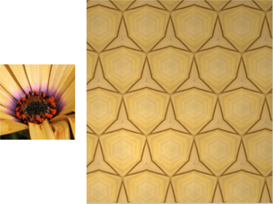

  #### Availability

  Available in OS X v10.11 and later and in iOS 6.0 and later.
- `
  [CITriangleTile](#apple-f4xwc4dqnrsv64tfmyxwi33df5tgs3dumvzc6y3jf5busvdsnfqw4z3mmvkgs3df)`

  Maps a triangular portion of image to a triangular area and then tiles the result.

  #### Localized Display Name

  Triangle Tile

  #### Parameters

|  |  |
| --- | --- |
| `inputImage` | A `CIImage` object whose display name is Image. |
| `inputCenter` | A `CIVector` object whose attribute type is `CIAttributeTypePosition` and whose display name is Center.  Default value: [150 150] |
| `inputAngle` | An `NSNumber` object whose attribute type is `CIAttributeTypeAngle` and whose display name is Angle.  Default value: 0.00 |
| `inputWidth` | An `NSNumber` object whose attribute type is `CIAttributeTypeDistance` and whose display name is Width.  Default value: 100.00 |

  #### Member Of

  `CICategoryBuiltIn`, `CICategoryStillImage`, `CICategoryVideo`, `CICategoryTileEffect`

  #### Sample Output

  __Figure 151__The result of using the CITriangleTile filter
  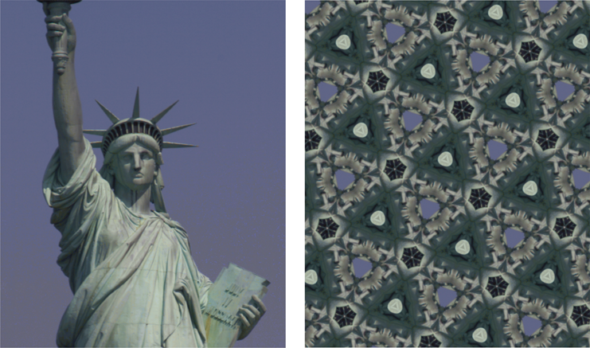

  #### Availability

  Available in OS X v10.4 and later and in iOS 9 and later.
- `
  [CITwelvefoldReflectedTile](#apple-f4xwc4dqnrsv64tfmyxwi33df5tgs3dumvzc6y3jf5busvdxmvwhmzlgn5wgiutfmzwgky3umvsfi2lmmu)`

  Produces a tiled image from a source image by rotating the source image at increments of 30 degrees.

  #### Localized Display Name

  CITwelvefoldReflectedTile

  #### Parameters

|  |  |
| --- | --- |
| `inputImage` | A `CIImage` object whose display name is Image. |
| `inputCenter` | A `CIVector` object whose attribute type is `CIAttributeTypePosition` and whose display name is Center.  Default value: [150 150] |
| `inputAngle` | An `NSNumber` object whose attribute type is `CIAttributeTypeAngle` and whose display name is Angle.  Default value: 0.00 |
| `inputWidth` | The width, along with the `inputCenter` parameter, defines the portion of the image to tile. An `NSNumber` object whose attribute type is `CIAttributeTypeDistance` and whose display name is Width.  Default value: 100.00 |

  #### Member Of

  `CICategoryBuiltIn`, `CICategoryStillImage`, `CICategoryVideo`, `CICategoryTileEffect`

  #### Sample Output

  __Figure 152__The result of using the CITwelvefoldReflectedTile filter
  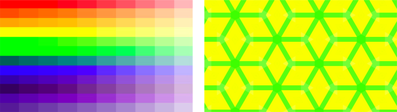

  #### Availability

  Available in OS X v10.5 and later and in iOS 6.0 and later.

[### CICategoryTransition](#apple-f4xwc4dqnrsv64tfmyxwi33df52wszbpkridgmbqgaydcmzwfvjvomrthe)

- `
  [CIAccordionFoldTransition](#apple-f4xwc4dqnrsv64tfmyxwi33df5tgs3dumvzc6y3jf5busqldmnxxezdjn5xem33mmrkheyloonuxi2lpny)`

  Transitions from one image to another of differing dimensions by unfolding and crossfading.

  #### Localized Display Name

  Accordion Fold Transition

  #### Parameters

|  |  |
| --- | --- |
| `inputImage` | A `CIImage` object whose display name is Image. |
| `inputTargetImage` | A `CIImage` object whose display name is Target Image. |
| `inputBottomHeight` | An `NSNumber` object whose attribute type is `CIAttributeTypeDistance` and whose display name is BottomHeight.  Default value: 0.00 Minimum: 0.00 Maximum: 0.00 Slider minimum: 0.00 Slider maximum: 0.00 Identity: 0.00 |
| `inputNumberOfFolds` | An `NSNumber` object whose attribute type is `CIAttributeTypeScalar` and whose display name is NumberOfFolds.  Default value: 3.00 Minimum: 1.00 Maximum: 50.00 Slider minimum: 1.00 Slider maximum: 10.00 Identity: 0.00 |
| `inputFoldShadowAmount` | An `NSNumber` object whose attribute type is `CIAttributeTypeScalar` and whose display name is FoldShadowAmount.  Default value: 0.10 Minimum: 0.00 Maximum: 1.00 Slider minimum: 0.00 Slider maximum: 1.00 Identity: 0.00 |
| `inputTime` | An `NSNumber` object whose attribute type is `CIAttributeTypeTime` and whose display name is Time.  Default value: 0.00 Minimum: 0.00 Maximum: 1.00 Slider minimum: 0.00 Slider maximum: 1.00 Identity: 0.00 |

  #### Member Of

  `CICategoryTransition`, `CICategoryVideo`, `CICategoryStillImage`, `CICategoryBuiltIn`

  #### Sample Output

  __Figure 153__The result of using the CIAccordionFoldTransition filter
  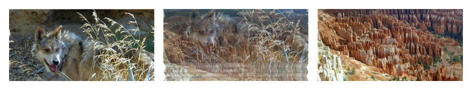

  #### Availability

  Available in OS X v10.10 and later and in iOS 8.0 and later.
- `
  [CIBarsSwipeTransition](#apple-f4xwc4dqnrsv64tfmyxwi33df5tgs3dumvzc6y3jf5busqtbojzvg53jobsvi4tbnzzws5djn5xa)`

  Transitions from one image to another by passing a bar over the source image.

  #### Localized Display Name

  CIBarsSwipeTransition

  #### Parameters

|  |  |
| --- | --- |
| `inputImage` | A `CIImage` object whose display name is Image. |
| `inputTargetImage` | A `CIImage` object whose display name is Target Image. |
| `inputAngle` | An `NSNumber` object whose attribute type is `CIAttributeTypeAngle` and whose display name is Angle.  Default value: 3.14 |
| `inputWidth` | An `NSNumber` object whose attribute type is `CIAttributeTypeDistance` and whose display name is Width.  Default value: 30.00 |
| `inputBarOffset` | An `NSNumber` object whose attribute type is `CIAttributeTypeScalar` and whose display name is Bar Offset.  Default value: 10.00 |
| `inputTime` | An `NSNumber` object whose attribute type is `CIAttributeTypeTime` and whose display name is Time.  Default value: 0.00 |

  #### Member Of

  `CICategoryBuiltIn`, `CICategoryStillImage`, `CICategoryVideo`, `CICategoryTransition`

  #### Sample Output

  __Figure 154__The result of using the CIBarsSwipeTransition filter
  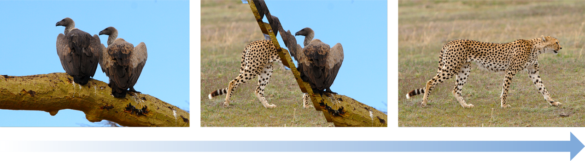

  #### Availability

  Available in OS X v10.5 and later and in iOS 6.0 and later.
- `
  [CICopyMachineTransition](#apple-f4xwc4dqnrsv64tfmyxwi33df5tgs3dumvzc6y3jf5busq3pob4u2yldnbuw4zkuojqw443joruw63q)`

  Transitions from one image to another by simulating the effect of a copy machine.

  #### Localized Display Name

  Copy Machine

  #### Parameters

|  |  |
| --- | --- |
| `inputImage` | A `CIImage` object whose display name is Image. |
| `inputTargetImage` | A `CIImage` object whose display name is Target Image. |
| `inputExtent` | A `CIVector` object whose attribute type is `CIAttributeTypeRectangle` and whose display name is Extent.  Default value: [0 0 300 300] |
| `inputColor` | A `CIColor` object whose attribute type is `CIAttributeTypeOpaqueColor` and whose display name is Color. |
| `inputTime` | An `NSNumber` object whose attribute type is `CIAttributeTypeTime` and whose display name is Time.  Default value: 0.00 |
| `inputAngle` | An `NSNumber` object whose attribute type is `CIAttributeTypeAngle` and whose display name is Angle.  Default value: 0.00 |
| `inputWidth` | An `NSNumber` object whose attribute type is `CIAttributeTypeDistance` and whose display name is Width.  Default value: 200.00 |
| `inputOpacity` | An `NSNumber` object whose attribute type is `CIAttributeTypeScalar` and whose display name is Opacity.  Default value: 1.30 |

  #### Member Of

  `CICategoryBuiltIn`, `CICategoryStillImage`, `CICategoryVideo`, `CICategoryTransition`

  #### Sample Output

  __Figure 155__The result of using the CICopyMachineTransition filter
  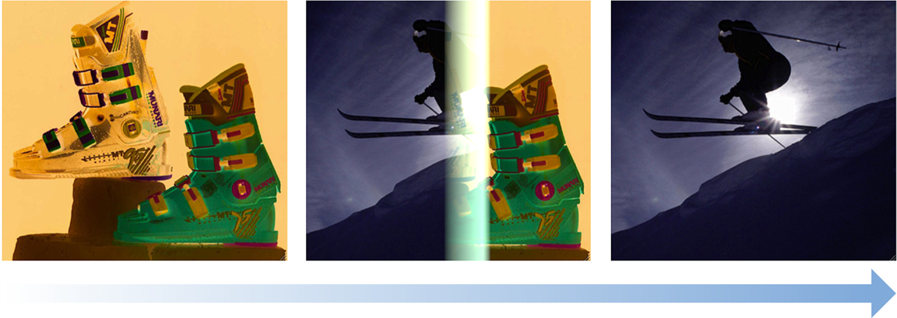

  #### Availability

  Available in OS X v10.4 and later and in iOS 6.0 and later.
- `
  [CIDisintegrateWithMaskTransition](#apple-f4xwc4dqnrsv64tfmyxwi33df5tgs3dumvzc6y3jf5busrdjonuw45dfm5zgc5dfk5uxi2cnmfzwwvdsmfxhg2lunfxw4)`

  Transitions from one image to another using the shape defined by a mask.

  #### Localized Display Name

  Disintegrate with Mask

  #### Parameters

|  |  |
| --- | --- |
| `inputImage` | A `CIImage` object whose display name is Image. |
| `inputTargetImage` | A `CIImage` object whose display name is Target Image. |
| `inputMaskImage` | A `CIImage` object whose display name is Mask Image. |
| `inputTime` | An `NSNumber` object whose attribute type is `CIAttributeTypeTime` and whose display name is Time.  Default value: 0.00 |
| `inputShadowRadius` | An `NSNumber` object whose attribute type is `CIAttributeTypeDistance` and whose display name is Shadow Radius.  Default value: 8.00 |
| `inputShadowDensity` | An `NSNumber` object whose attribute type is `CIAttributeTypeScalar` and whose display name is Shadow Density.  Default value: 0.65 |
| `inputShadowOffset` | A `CIVector` object whose attribute type is `CIAttributeTypeOffset` and whose display name is Shadow Offset.  Default value: [0 -10] |

  #### Member Of

  `CICategoryBuiltIn`, `CICategoryStillImage`, `CICategoryVideo`, `CICategoryTransition`

  #### Sample Output

  __Figure 156__The result of using the CIDisintegrateWithMaskTransition filter
  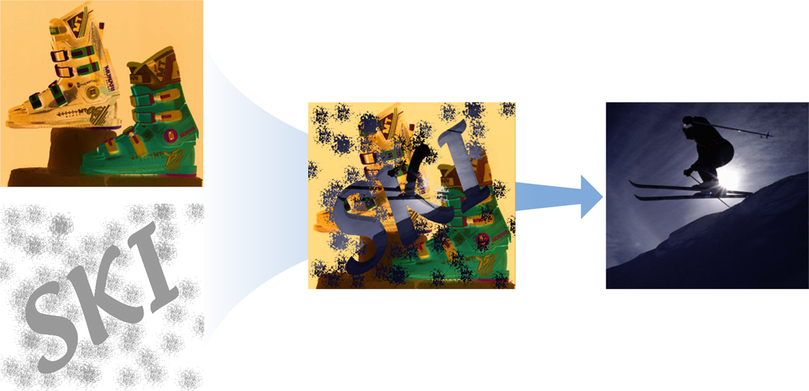

  #### Availability

  Available in OS X v10.4 and later and in iOS 6.0 and later.
- `
  [CIDissolveTransition](#apple-f4xwc4dqnrsv64tfmyxwi33df5tgs3dumvzc6y3jf5busrdjonzw63dwmvkheyloonuxi2lpny)`

  Uses a dissolve to transition from one image to another.

  #### Localized Display Name

  Dissolve

  #### Parameters

|  |  |
| --- | --- |
| `inputImage` | A `CIImage` object whose display name is Image. |
| `inputTargetImage` | A `CIImage` object whose display name is Target Image. |
| `inputTime` | An `NSNumber` object whose attribute type is `CIAttributeTypeTime` and whose display name is Time.  Default value: 0.00 |

  #### Member Of

  `CICategoryBuiltIn`, `CICategoryNonSquarePixels`, `CICategoryInterlaced`, `CICategoryStillImage`, `CICategoryVideo`, `CICategoryTransition`

  #### Sample Output

  __Figure 157__The result of using the CIDissolveTransition filter
  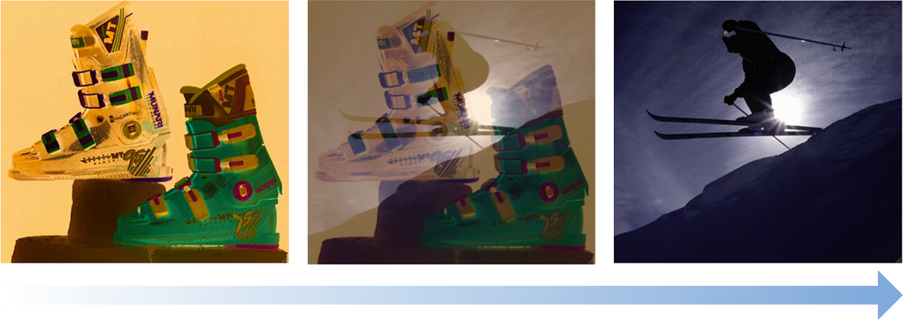

  #### Availability

  Available in OS X v10.4 and later and in iOS 6.0 and later.
- `
  [CIFlashTransition](#apple-f4xwc4dqnrsv64tfmyxwi33df5tgs3dumvzc6y3jf5busrtmmfzwqvdsmfxhg2lunfxw4)`

  Transitions from one image to another by creating a flash.

  #### Localized Display Name

  Flash

  #### Parameters

|  |  |
| --- | --- |
| `inputImage` | A `CIImage` object whose display name is Image. |
| `inputTargetImage` | A `CIImage` object whose display name is Target Image. |
| `inputCenter` | A `CIVector` object whose attribute type is `CIAttributeTypePosition` and whose display name is Center.  Default value: [150 150] |
| `inputExtent` | A `CIVector` object whose attribute type is `CIAttributeTypeRectangle` and whose display name is Extent.  Default value: [0 0 300 300] |
| `inputColor` | A `CIColor` object whose attribute type is `CIAttributeTypeOpaqueColor` and whose display name is Color. |
| `inputTime` | An `NSNumber` object whose attribute type is `CIAttributeTypeTime` and whose display name is Time.  Default value: 0.00 |
| `inputMaxStriationRadius` | An `NSNumber` object whose attribute type is `CIAttributeTypeScalar` and whose display name is Maximum Striation Radius.  Default value: 2.58 |
| `inputStriationStrength` | An `NSNumber` object whose attribute type is `CIAttributeTypeScalar` and whose display name is Striation Strength.  Default value: 0.50 |
| `inputStriationContrast` | An `NSNumber` object whose attribute type is `CIAttributeTypeScalar` and whose display name is Striation Contrast.  Default value: 1.38 |
| `inputFadeThreshold` | An `NSNumber` object whose attribute type is `CIAttributeTypeScalar` and whose display name is Fade Threshold.  Default value: 0.85 |

  #### Discussion

  The flash originates from a point you specify. Small at first, it rapidly expands until the image frame is completely filled with the flash color. As the color fades, the target image begins to appear.

  #### Member Of

  `CICategoryBuiltIn`, `CICategoryStillImage`, `CICategoryVideo`, `CICategoryTransition`

  #### Sample Output

  __Figure 158__The result of using the CIFlashTransition filter
  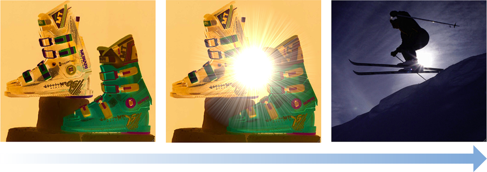

  #### Availability

  Available in OS X v10.4 and later and in iOS 6.0 and later.
- `
  [CIModTransition](#apple-f4xwc4dqnrsv64tfmyxwi33df5tgs3dumvzc6y3jf5bustlpmrkheyloonuxi2lpny)`

  Transitions from one image to another by revealing the target image through irregularly shaped holes.

  #### Localized Display Name

  Mod

  #### Parameters

|  |  |
| --- | --- |
| `inputImage` | A `CIImage` object whose display name is Image. |
| `inputTargetImage` | A `CIImage` object whose display name is Target Image. |
| `inputCenter` | A `CIVector` object whose attribute type is `CIAttributeTypePosition` and whose display name is Center.  Default value: [150 150] |
| `inputTime` | An `NSNumber` object whose attribute type is `CIAttributeTypeTime` and whose display name is Time.  Default value: 0.00 |
| `inputAngle` | An `NSNumber` object whose attribute type is `CIAttributeTypeAngle` and whose display name is Angle.  Default value: 2.00 |
| `inputRadius` | An `NSNumber` object whose attribute type is `CIAttributeTypeDistance` and whose display name is Radius.  Default value: 150.00 |
| `inputCompression` | An `NSNumber` object whose attribute type is `CIAttributeTypeDistance` and whose display name is Compression.  Default value: 300.00 |

  #### Member Of

  `CICategoryBuiltIn`, `CICategoryStillImage`, `CICategoryVideo`, `CICategoryTransition`

  #### Sample Output

  __Figure 159__The result of using the CIModTransition filter
  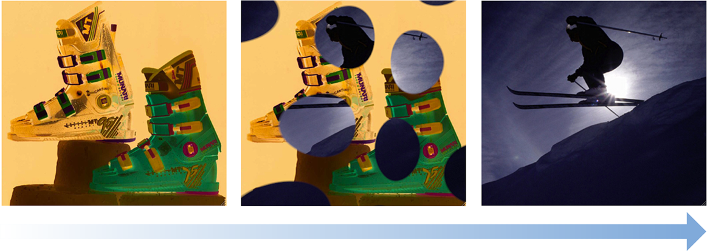

  #### Availability

  Available in OS X v10.4 and later and in iOS 6.0 and later.
- `
  [CIPageCurlTransition](#apple-f4xwc4dqnrsv64tfmyxwi33df5tgs3dumvzc6y3jf5busudbm5sug5lsnrkheyloonuxi2lpny)`

  Transitions from one image to another by simulating a curling page, revealing the new image as the page curls.

  #### Localized Display Name

  Page Curl

  #### Parameters

|  |  |
| --- | --- |
| `inputImage` | A `CIImage` object whose display name is Image. |
| `inputTargetImage` | A `CIImage` object whose display name is Target Image. |
| `inputBacksideImage` | A `CIImage` object whose display name is Backside Image. |
| `inputShadingImage` | A `CIImage` object whose display name is Shading Image. |
| `inputExtent` | A `CIVector` object whose attribute type is `CIAttributeTypeRectangle` and whose display name is Extent.  Default value: [0 0 300 300] |
| `inputTime` | An `NSNumber` object whose attribute type is `CIAttributeTypeTime` and whose display name is Time.  Default value: 0.00 |
| `inputAngle` | An `NSNumber` object whose attribute type is `CIAttributeTypeAngle` and whose display name is Angle.  Default value: 0.00 |
| `inputRadius` | An `NSNumber` object whose attribute type is `CIAttributeTypeDistance` and whose display name is Radius.  Default value: 100.00 |

  #### Member Of

  `CICategoryBuiltIn`, `CICategoryStillImage`, `CICategoryVideo`, `CICategoryTransition`

  #### Sample Output

  __Figure 160__The result of using the CIPageCurlTransition filter
  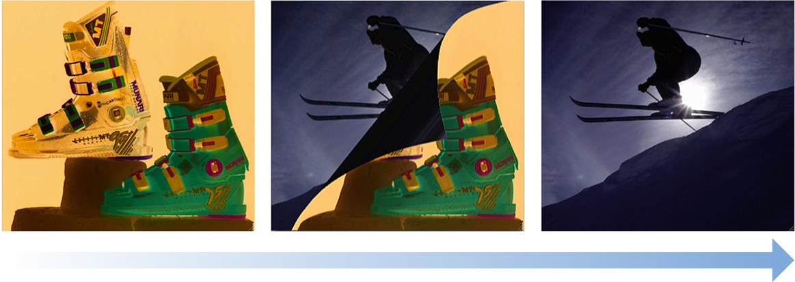

  #### Availability

  Available in OS X v10.4 and later and in iOS 9 and later.
- `
  [CIPageCurlWithShadowTransition](#apple-f4xwc4dqnrsv64tfmyxwi33df5tgs3dumvzc6y3jf5busudbm5sug5lsnrlws5diknugczdpo5kheyloonuxi2lpny)`

  Transitions from one image to another by simulating a curling page, revealing the new image as the page curls.

  #### Localized Display Name

  Page Curl With Shadow

  #### Parameters

|  |  |
| --- | --- |
| `inputImage` | A `CIImage` object whose display name is Image. |
| `inputTargetImage` | A `CIImage` object whose display name is Target Image. |
| `inputBacksideImage` | A `CIImage` object whose display name is Backside Image. |
| `inputExtent` | A `CIVector` object whose attribute type is `CIAttributeTypeRectangle` and whose display name is Extent.  Default value: [0 0 0 0] Identity: (null) |
| `inputTime` | An `NSNumber` object whose attribute type is `CIAttributeTypeTime` and whose display name is Time.  Default value: 0.00 Minimum: 0.00 Maximum: 1.00 Slider minimum: 0.00 Slider maximum: 1.00 Identity: 0.00 |
| `inputAngle` | An `NSNumber` object whose attribute type is `CIAttributeTypeAngle` and whose display name is Angle.  Default value: 0.00 Minimum: 0.00 Maximum: 0.00 Slider minimum: -3.14 Slider maximum: 3.14 Identity: 0.00 |
| `inputRadius` | An `NSNumber` object whose attribute type is `CIAttributeTypeDistance` and whose display name is Radius.  Default value: 100.00 Minimum: 0.01 Maximum: 0.00 Slider minimum: 0.01 Slider maximum: 400.00 Identity: 0.00 |
| `inputShadowSize` | An `NSNumber` object whose attribute type is `CIAttributeTypeDistance` and whose display name is ShadowSize.  Default value: 0.50 Minimum: 0.00 Maximum: 1.00 Slider minimum: 0.00 Slider maximum: 1.00 Identity: 0.00 |
| `inputShadowAmount` | An `NSNumber` object whose attribute type is `CIAttributeTypeDistance` and whose display name is ShadowAmount.  Default value: 0.70 Minimum: 0.00 Maximum: 1.00 Slider minimum: 0.00 Slider maximum: 1.00 Identity: 0.00 |
| `inputShadowExtent` | A `CIVector` object whose attribute type is `CIAttributeTypeRectangle` and whose display name is ShadowExtent.  Default value: [0 0 0 0] Identity: (null) |

  #### Member Of

  `CICategoryBuiltIn`, `CICategoryStillImage`, `CICategoryVideo`, `CICategoryTransition`

  #### Sample Output

  __Figure 161__The result of using the CIPageCurlWithShadowTransition filter
  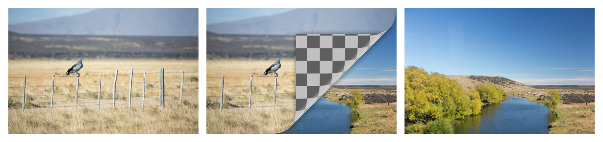

  #### Availability

  Available in OS X v10.9 and later and in iOS 9 and later.
- `
  [CIRippleTransition](#apple-f4xwc4dqnrsv64tfmyxwi33df5tgs3dumvzc6y3jf5busutjobygyzkuojqw443joruw63q)`

  Transitions from one image to another by creating a circular wave that expands from the center point, revealing the new image in the wake of the wave.

  #### Localized Display Name

  Ripple

  #### Parameters

|  |  |
| --- | --- |
| `inputImage` | A `CIImage` object whose display name is Image. |
| `inputTargetImage` | A `CIImage` object whose display name is Target Image. |
| `inputShadingImage` | A `CIImage` object whose display name is Shading Image. |
| `inputCenter` | A `CIVector` object whose attribute type is `CIAttributeTypePosition` and whose display name is Center.  Default value: [150 150] |
| `inputExtent` | A `CIVector` object whose attribute type is `CIAttributeTypeRectangle` and whose display name is Extent.  Default value: [0 0 300 300] |
| `inputTime` | An `NSNumber` object whose attribute type is `CIAttributeTypeTime` and whose display name is Time.  Default value: 0.00 |
| `inputWidth` | An `NSNumber` object whose attribute type is `CIAttributeTypeDistance` and whose display name is Width.  Default value: 100.00 |
| `inputScale` | An `NSNumber` object whose attribute type is `CIAttributeTypeScalar` and whose display name is Scale.  Default value: 50.00 |

  #### Member Of

  `CICategoryBuiltIn`, `CICategoryStillImage`, `CICategoryVideo`, `CICategoryTransition`

  #### Sample Output

  __Figure 162__The result of using the CIRippleTransition filter
  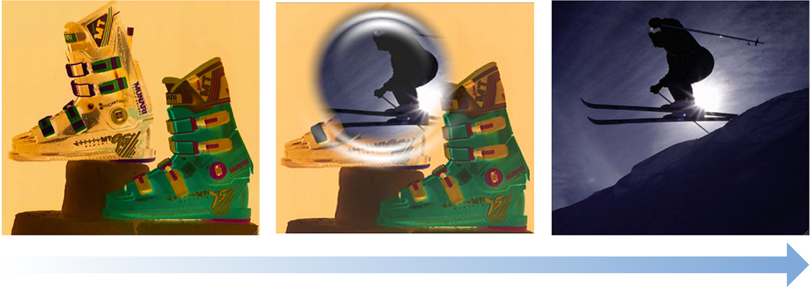

  #### Availability

  Available in OS X v10.4 and later and in iOS 9 and later.
- `
  [CISwipeTransition](#apple-f4xwc4dqnrsv64tfmyxwi33df5tgs3dumvzc6y3jf5busu3xnfygkvdsmfxhg2lunfxw4)`

  Transitions from one image to another by simulating a swiping action.

  #### Localized Display Name

  Swipe

  #### Parameters

|  |  |
| --- | --- |
| `inputImage` | A `CIImage` object whose display name is Image. |
| `inputTargetImage` | A `CIImage` object whose display name is Target Image. |
| `inputExtent` | A `CIVector` object whose attribute type is `CIAttributeTypeRectangle` and whose display name is Extent.  Default value: [0 0 300 300] |
| `inputColor` | A `CIColor` object whose attribute type is `CIAttributeTypeOpaqueColor` and whose display name is Color. |
| `inputTime` | An `NSNumber` object whose attribute type is `CIAttributeTypeTime` and whose display name is Time.  Default value: 0.00 |
| `inputAngle` | An `NSNumber` object whose attribute type is `CIAttributeTypeAngle` and whose display name is Angle.  Default value: 0.00 |
| `inputWidth` | An `NSNumber` object whose attribute type is `CIAttributeTypeDistance` and whose display name is Width.  Default value: 300.00 |
| `inputOpacity` | An `NSNumber` object whose attribute type is `CIAttributeTypeScalar` and whose display name is Opacity.  Default value: 0.00 |

  #### Member Of

  `CICategoryBuiltIn`, `CICategoryStillImage`, `CICategoryVideo`, `CICategoryTransition`

  #### Sample Output

  __Figure 163__The result of using the CISwipeTransition filter
  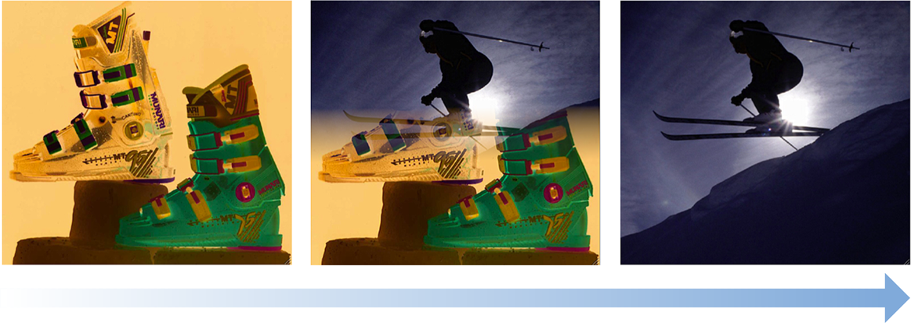

  #### Availability

  Available in OS X v10.4 and later and in iOS 6.0 and later.

