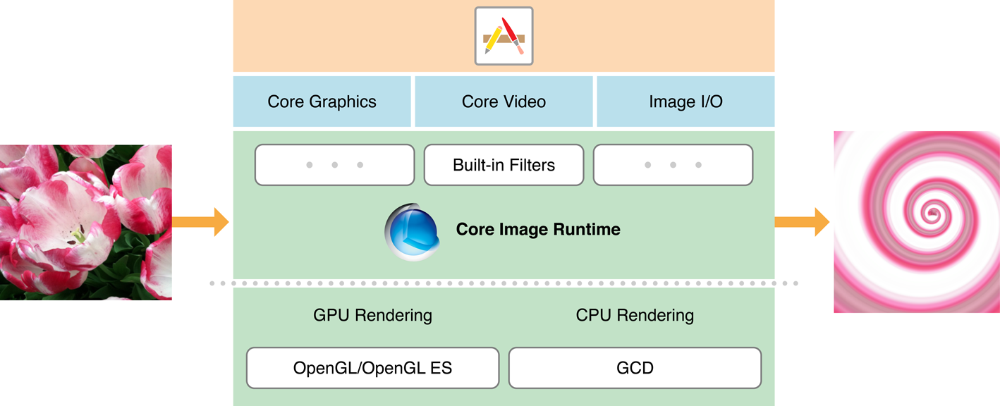

> 导航：[总目录](../../../README.md) · [documentation](../../../_indexes/documentation.md)

[Next](Processing%20Images.md)

# About Core Image

Core Image is an image processing and analysis technology designed to provide near real-time processing for still and video images. It operates on image data types from the Core Graphics, Core Video, and Image I/O frameworks, using either a GPU or CPU rendering path. Core Image hides the details of low-level graphics processing by providing an easy-to-use application programming interface (API). You don’t need to know the details of OpenGL, OpenGL ES, or Metal to leverage the power of the GPU, nor do you need to know anything about Grand Central Dispatch (GCD) to get the benefit of multicore processing. Core Image handles the details for you.

__Figure I-1__  Core Image in relation to the operating system

The Core Image framework provides:

- Access to built-in image processing filters
- Feature detection capability
- Support for automatic image enhancement
- The ability to chain multiple filters together to create custom effects
- Support for creating custom filters that run on a GPU
- Feedback-based image processing capabilities

On macOS, Core Image also provides a means for packaging custom filters for use by other apps.

### Core Image is Efficient and Easy to Use for Processing and Analyzing Images

Core Image provides hundreds of built-in filters. You set up filters by supplying key-value pairs for a filter’s input parameters. The output of one filter can be the input of another, making it possible to chain numerous filters together to create amazing effects. If you create a compound effect that you want to use again, you can subclass CIFilter to capture the effect “recipe.”

There are more than a dozen categories of filters. Some are designed to achieve artistic results, such as the stylize and halftone filter categories. Others are optimal for fixing image problems, such as color adjustment and sharpen filters.

Core Image can analyze the quality of an image and provide a set of filters with optimal settings for adjusting such things as hue, contrast, and tone color, and for correcting for flash artifacts such as red eye. It does all this with one method call on your part.

Core Image can detect human face features in still images and track them over time in video images. Knowing where faces are can help you determine where to place a vignette or apply other special filters.

### Query Core Image to Get a List of Filters and Their Attributes

Core Image has “built-in” reference documentation for its filters. You can query the system to find out which filters are available. Then, for each filter, you can retrieve a dictionary that contains its attributes, such as its input parameters, defaults parameter values, minimum and maximum values, display name, and more.

### Core Image Can Achieve Real-Time Video Performance

If your app needs to process video in real-time, there are several things you can do to optimize performance.

### Use an Image Accumulator to Support Feedback-Based Processing

The `CIImageAccumulator` class is designed for efficient feedback-based image processing, which you might find useful if your app needs to image dynamical systems.

### Create and Distribute Custom Kernels and Filters

If none of the built-in filters suits your needs, even when chained together, consider creating a custom filter. You’ll need to understand kernels—programs that operate at the pixel level—because they are at the heart of every filter.

In macOS, you can package one or more custom filter as an image unit so that other apps can load and use them.

Other important documentation for Core Image includes:

- _[Core Image Reference Collection](https://developer.apple.com/documentation/coreimage)_ provides a detailed description of the classes available in the Core Image framework.
- _[Core Image Filter Reference](https://developer.apple.com/library/archive/documentation/GraphicsImaging/Reference/CoreImageFilterReference/index.html#//apple_ref/doc/uid/TP40004346)_ describes the built-in image processing filters that Apple provides, and shows how images appear before and after processing with a filter.
- _[Core Image Kernel Language Reference](../Core%20Image%20Kernel%20Language%20Reference/Introduction.md#apple-f4xwc4dqnrsv64tfmyxwi33df52wszbpkridimbqga2dgojx)_ describes the language for creating kernel routines for custom filters.
[Next](Processing%20Images.md)

