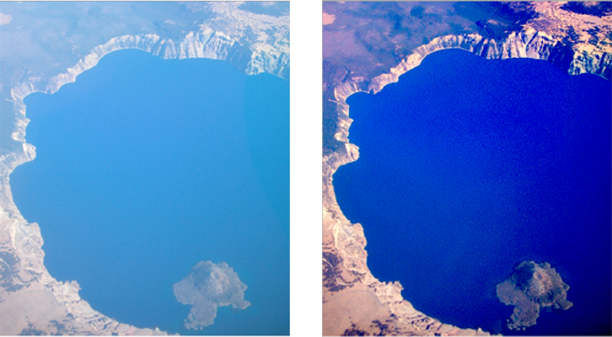
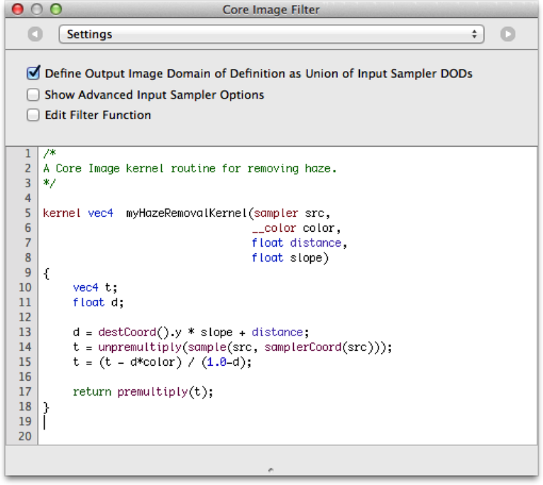
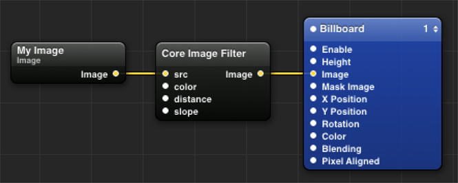

> 导航：[总目录](../../../README.md) · [documentation](../../../_indexes/documentation.md) · [Core Image Programming Guide](About%20Core%20Image.md)


[Next](Packaging%20and%20Loading%20Image%20Units.md)[Previous](What%20You%20Need%20to%20Know%20Before%20Writing%20a%20Custom%20Filter.md)

# Creating Custom Filters

If the filters provided by Core Image don’t provide the functionality you need, you can write your own filter. You can include a filter as part of an application project, or (in macOS only) you can package one or more filters as a standalone _image unit_. Image units use the [NSBundle](https://developer.apple.com/library/archive/documentation/LegacyTechnologies/WebObjects/WebObjects_3.5/Reference/Frameworks/ObjC/Foundation/Classes/NSBundle/Description.html#//apple_ref/occ/cl/NSBundle) class and allow an app to host external plug-in filters.

The following sections provide detailed information on how to create and use custom filters and image units:

- [Expressing Image Processing Operations in Core Image](#apple-f4xwc4dqnrsv64tfmyxwi33df52wszbpkridgmbqgaytcobvfvbuqnrnijbusscfjjfes)
- [Creating a Custom Filter](#apple-f4xwc4dqnrsv64tfmyxwi33df52wszbpkridgmbqgaytcobvfvbuqnrninfeerkejbeeq) describes the methods that you need to implement and other filter requirements.
- [Using Your Own Custom Filter](#apple-f4xwc4dqnrsv64tfmyxwi33df52wszbpkridgmbqgaytcobvfvbuqnrninfeescei5auc) tells what’s need for you to use the filter in your own app. (If you want to package it as a standalone image unit, see [Packaging and Loading Image Units](Packaging%20and%20Loading%20Image%20Units.md#apple-f4xwc4dqnrsv64tfmyxwi33df52wszbpkridgmbqgaytcobvfvbuqnznknltcmq).)
- [Supplying an ROI Function](#apple-f4xwc4dqnrsv64tfmyxwi33df52wszbpkridgmbqgaytcobvfvbuqnrninfeerkdifcug) provides information about the region of interest and when you must supply a method to calculate this region. (It’s not always needed.)
- [Writing Nonexecutable Filters](#apple-f4xwc4dqnrsv64tfmyxwi33df52wszbpkridgmbqgaytcobvfvbuqnrninfeersii5dug) is a must-read section for anyone who plans to write a filter that is CPU nonexecutable, as it lists the requirements for such filters. An image unit can contain both kinds of filters. CPU nonexecutable filters are secure because they cannot harbor viruses and Trojan horses. Filter clients who are security conscious may want to use only those filters that are CPU nonexecutable.
- [Kernel Routine Examples](#apple-f4xwc4dqnrsv64tfmyxwi33df52wszbpkridgmbqgaytcobvfvbuqnrnknltk) provides kernel routines for three sample filters: brightening, multiply, and hole distortion.

Core Image works such that a kernel (that is, a per-pixel processing routine) is written as a computation where an output pixel is expressed using an inverse mapping back to the corresponding pixels of the kernel’s input images. Although you can express most pixel computations this way—some more naturally than others—there are some image processing operations for which this is difficult, if not impossible. Before you write a filter, you may want to consider whether the image processing operation can be expressed in Core Image. For example, computing a histogram is difficult to describe as an inverse mapping to the source image.

This section shows how to create a Core Image filter that has an Objective-C portion and a kernel portion. By following the steps in this section, you’ll create a filter that is CPU executable. You can package this filter, along with other filters if you’d like, as an image unit by following the instructions in [Packaging and Loading Image Units](Packaging%20and%20Loading%20Image%20Units.md#apple-f4xwc4dqnrsv64tfmyxwi33df52wszbpkridgmbqgaytcobvfvbuqnznknltcmq). Or, you can simply use the filter from within your own app. See [Using Your Own Custom Filter](#apple-f4xwc4dqnrsv64tfmyxwi33df52wszbpkridgmbqgaytcobvfvbuqnrninfeescei5auc) for details.

Core Image provides three types of kernel-based filters: color filters, warp filters, and general filters. A general filter includes a GPU kernel routine that can modify pixel colors and pixel locations. However, if you’re designing a filter that modifies only pixel colors, or that changes image geometry without otherwise modifying pixels, creating a color or warp filter lets Core Image provide better filter performance across the wide variety of iOS and Mac hardware. For details, see the reference documentation for the [CIColorKernel](https://developer.apple.com/documentation/coreimage/cicolorkernel) and [CIWarpKernel](https://developer.apple.com/documentation/coreimage/ciwarpkernel) classes.

The general filter in this section assumes that the region of interest (ROI) and the domain of definition coincide. If you want to write a filter for which this assumption isn’t true, make sure you also read [Supplying an ROI Function](#apple-f4xwc4dqnrsv64tfmyxwi33df52wszbpkridgmbqgaytcobvfvbuqnrninfeerkdifcug). Before you create your own custom filter, make sure you understand Core Image coordinate spaces. See [Building a Dictionary of Filters](Querying%20the%20System%20for%20Filters.md#apple-f4xwc4dqnrsv64tfmyxwi33df52wszbpkridgmbqgaytcobvfvbuqmrnknltc).

To create a custom CPU executable filter, perform the following steps:

1. [Write the Kernel Code](#apple-f4xwc4dqnrsv64tfmyxwi33df52wszbpkridgmbqgaytcobvfvbuqnrnijbusskjinbuu)
2. [Use Quartz Composer to Test the Kernel Routine](#apple-f4xwc4dqnrsv64tfmyxwi33df52wszbpkridgmbqgaytcobvfvbuqnrnijbusq2hinfem)
3. [Declare an Interface for the Filter](#apple-f4xwc4dqnrsv64tfmyxwi33df52wszbpkridgmbqgaytcobvfvbuqnrnijbusskijfeuc)
4. [Write an Init Method for the CIKernel Object](#apple-f4xwc4dqnrsv64tfmyxwi33df52wszbpkridgmbqgaytcobvfvbuqnrnknlte)
5. [Write a Custom Attributes Method](#apple-f4xwc4dqnrsv64tfmyxwi33df52wszbpkridgmbqgaytcobvfvbuqnrnknltc)
6. [Write an Output Image Method](#apple-f4xwc4dqnrsv64tfmyxwi33df52wszbpkridgmbqgaytcobvfvbuqnrnijbusrkeijdeg)
7. [Register the Filter](#apple-f4xwc4dqnrsv64tfmyxwi33df52wszbpkridgmbqgaytcobvfvbuqnrnijbusqshinduu)
8. [Write a Method to Create Instances of the Filter](#apple-f4xwc4dqnrsv64tfmyxwi33df52wszbpkridgmbqgaytcobvfvbuqnrnijbussceizbeo)

Each step is described in detail in the sections that follow using a haze removal filter as an example. The effect of the haze removal filter is to adjust the brightness and contrast of an image, and to apply sharpening to it. This filter is useful for correcting images taken through light fog or haze, which is typically the case when taking an image from an airplane. Figure 9-1 shows an image before and after processing with the haze removal filter. The app using the filter provides sliders that enable the user to adjust the filter’s input parameters.

__Figure 9-1__  An image before and after processing with the haze removal filter



The code that performs per-pixel processing resides in a file with the `.cikernel` extension. You can include more than one kernel routine in this file. You can also include other routines if you want to make your code modular. You specify a kernel using a subset of OpenGL Shading Language (glslang) and the Core Image extensions to it. See _[Core Image Kernel Language Reference](../Core%20Image%20Kernel%20Language%20Reference/Introduction.md#apple-f4xwc4dqnrsv64tfmyxwi33df52wszbpkridimbqga2dgojx)_ for information on allowable elements of the language.

A kernel routine signature must return a vector (`vec4`) that contains the result of mapping the source pixel to a destination pixel. Core Image invokes a kernel routine once for each pixel. Keep in mind that your code can’t accumulate knowledge from pixel to pixel. A good strategy when writing your code is to move as much invariant calculation as possible from the actual kernel and place it in the Objective-C portion of the filter.

Listing 9-1 shows the kernel routine for a haze removal filter. A detailed explanation for each numbered line of code follows the listing. (There are examples of other pixel-processing routines in [Kernel Routine Examples](#apple-f4xwc4dqnrsv64tfmyxwi33df52wszbpkridgmbqgaytcobvfvbuqnrnknltk) and in _[Image Unit Tutorial](../Image%20Unit%20Tutorial/Introduction.md#apple-f4xwc4dqnrsv64tfmyxwi33df52wszbpkridimbqga2dkmzr)_.)

__Listing 9-1__  A kernel routine for the haze removal filter

```
kernel vec4 myHazeRemovalKernel(sampler src,             // 1
                     __color color,
                    float distance,
                    float slope)
{
    vec4   t;
    float  d;

    d = destCoord().y * slope  +  distance;              // 2
    t = unpremultiply(sample(src, samplerCoord(src)));   // 3
    t = (t - d*color) / (1.0-d);                         // 4

    return premultiply(t);                               // 5
}
```

Here’s what the code does:

1. Takes four input parameters and returns a vector. When you declare the interface for the filter, you must make sure to declare the same number of input parameters as you specify in the kernel. The kernel must return a `vec4` data type.
2. Calculates a value based on the _y_-value of the destination coordinate and the slope and distance input parameters. The `destCoord` routine (provided by Core Image) returns the position, in working space coordinates, of the pixel currently being computed.
3. Gets the pixel value, in sampler space, of the sampler `src` that is associated with the current output pixel after any transformation matrix associated with the `src` is applied. Recall that Core Image uses color components with premultiplied alpha values. Before processing, you need to unpremultiply the color values you receive from the sampler.
4. Calculates the output vector by applying the haze removal formula, which incorporates the slope and distance calculations and adjusts for color.
5. Returns a `vec4` vector, as required. The kernel performs a premultiplication operation before returning the result because Core Image uses color components with premultiplied alpha values.

Quartz Composer is an easy-to-use development tool that you can use to test kernel routines.

To download Quartz Composer

1. Open Xcode.
2. Choose Xcode > Open Developer Tool > More Developer Tools...

   Choosing this item will take you to [developer.apple.com](https://developer.apple.com/).
3. Sign in to developer.apple.com.

   You should then see the Downloads for Apple Developers webpage.
4. Download the Graphics Tools for Xcode package, which contains Quartz Composer.

Quartz Composer provides a patch—Core Image Filter—into which you can place your kernel routine.You simply open the Inspector for the Core Image Filter patch, and either paste or type your code into the text field, as shown in Figure 9-2.

__Figure 9-2__  The haze removal kernel routine pasted into the Settings pane



After you enter the code, the patch’s input ports are automatically created according to the prototype of the kernel function, as you can see in Figure 9-3. The patch always has a single output port, which represents the resulting image produced by the kernel.

The simple composition shown in Figure 9-3 imports an image file using the Image Importer patch, processes it through the kernel, then renders the result onscreen using the Billboard patch. Your kernel can use more than one image or, if it generates output, it might not require any input images.

The composition you build to test your kernel can be more complex than that shown in Figure 9-3. For example, you might want to chain your kernel routine with other built-in Core Image filters or with other kernel routines. Quartz Composer provides many other patches that you can use in the course of testing your kernel routine.

__Figure 9-3__  A Quartz Composer composition that tests a kernel routine



The `.h` file for the filter contains the interface that specifies the filter inputs, as shown in Listing 9-2. The haze removal kernel has four input parameters: a source, color, distance, and slope. The interface for the filter must also contain these input parameters. The input parameters must be in the same order as specified for the filter, and the data types must be compatible between the two.

__Listing 9-2__  Code that declares the interface for a haze removal filter

```objc
@interface MyHazeFilter: CIFilter
{
    CIImage   *inputImage;
    CIColor   *inputColor;
    NSNumber  *inputDistance;
    NSNumber  *inputSlope;
}

@end
```


The implementation file for the filter contains a method that initializes a Core Image kernel object (`CIKernel`) with the kernel routine specified in the `.cikernel` file. A `.cikernel` file can contain more than one kernel routine. A detailed explanation for each numbered line of code appears following the listing.

__Listing 9-3__  An init method that initializes the kernel

```objc
static CIKernel *hazeRemovalKernel = nil;

- (id)init
{
    if(hazeRemovalKernel == nil)                                         // 1
    {
        NSBundle    *bundle = [NSBundle bundleForClass: [self class]];   // 2
        NSString    *code = [NSString stringWithContentsOfFile: [bundle
                                pathForResource: @"MyHazeRemoval"
                                ofType: @"cikernel"]];                   // 3
        NSArray     *kernels = [CIKernel kernelsWithString: code];       // 4
        hazeRemovalKernel = kernels[0];                                  // 5
    }
    return [super init];
}
```

Here’s what the code does:

1. Checks whether the `CIKernel` object is already initialized.
2. Returns the bundle that dynamically loads the `CIFilter` class.
3. Returns a string created from the file name at the specified path, which in this case is the `MyHazeRemoval.cikernel` file.
4. Creates a `CIKernel` object from the string specified by the `code` argument. Each routine in the `.cikernel` file that is marked as a kernel is returned in the `kernels` array. This example has only one kernel in the `.cikernel` file, so the array contains only one item.
5. Sets `hazeRemovalKernel` to the first kernel in the `kernels` array. If the `.cikernel` file contains more than one kernel, you would also initialize those kernels in this routine.

A `customAttributes` method allows clients of the filter to obtain the filter attributes such as the input parameters, default values, and minimum and maximum values. (See _[CIFilter Class Reference](https://developer.apple.com/documentation/coreimage/cifilter)_ for a complete list of attributes.) A filter is not required to provide any information about an attribute other than its class, but a filter must behave in a reasonable manner if attributes are not present.

Typically, these are the attributes that your `customAttributes` method would return:

- Input and output parameters
- Attribute class for each parameter you supply (mandatory)
- Minimum, maximum, and default values for each parameter (optional)
- Other information as appropriate, such as slider minimum and maximum values (optional)

Listing 9-4 shows the `customAttributes` method for the Haze filter. The input parameters `inputDistance` and `inputSlope` each have minimum, maximum, slider minimum, slider maximum, default and identity values set. The slider minimum and maximum values are used to set up the sliders shown in [Figure 9-1](#apple-f4xwc4dqnrsv64tfmyxwi33df52wszbpkridgmbqgaytcobvfvbuqnrninfeer2dinaug). The `inputColor` parameter has a default value set.

__Listing 9-4__  The `customAttributes` method for the Haze filter

```objc
- (NSDictionary *)customAttributes
{
    return @{
        @"inputDistance" :  @{
            kCIAttributeMin       : @0.0,
            kCIAttributeMax       : @1.0,
            kCIAttributeSliderMin : @0.0,
            kCIAttributeSliderMax : @0.7,
            kCIAttributeDefault   : @0.2,
            kCIAttributeIdentity  : @0.0,
            kCIAttributeType      : kCIAttributeTypeScalar
            },
        @"inputSlope" : @{
            kCIAttributeSliderMin : @-0.01,
            kCIAttributeSliderMax : @0.01,
            kCIAttributeDefault   : @0.00,
            kCIAttributeIdentity  : @0.00,
            kCIAttributeType      : kCIAttributeTypeScalar
            },
         kCIInputColorKey : @{
         kCIAttributeDefault : [CIColor colorWithRed:1.0
                                               green:1.0
                                                blue:1.0
                                               alpha:1.0]
           },
   };
}
```


An `outputImage` method creates a `CISampler` object for each input image (or image mask), creates a `CIFilterShape` object (if appropriate), and applies the kernel method. Listing 9-5 shows an `outputImage` method for the haze removal filter. The first thing the code does is to set up a sampler to fetch pixels from the input image. Because this filter uses only one input image, the code sets up only one sampler.

The code calls the [apply:arguments:options:](https://developer.apple.com/documentation/coreimage/cifilter/1438077-apply) method of `CIFilter` to produce a `CIImage` object. The first parameter to the apply method is the `CIKernel` object that contains the haze removal kernel function. (See [Write the Kernel Code](#apple-f4xwc4dqnrsv64tfmyxwi33df52wszbpkridgmbqgaytcobvfvbuqnrnijbusskjinbuu).) Recall that the haze removal kernel function takes four arguments: a sampler, a color, a distance, and the slope. These arguments are passed as the next four parameters to the [apply:arguments:options:](https://developer.apple.com/documentation/coreimage/cifilter/1438077-apply) method in Listing 9-5. The remaining arguments to the apply method specify options (key-value pairs) that control how Core Image should evaluate the function. You can pass one of three keys: [kCIApplyOptionExtent](https://developer.apple.com/documentation/coreimage/kciapplyoptionextent), [kCIApplyOptionDefinition](https://developer.apple.com/documentation/coreimage/kciapplyoptiondefinition), or [kCIApplyOptionUserInfo](https://developer.apple.com/documentation/coreimage/kciapplyoptionuserinfo). This example uses the [kCIApplyOptionDefinition](https://developer.apple.com/documentation/coreimage/kciapplyoptiondefinition) key to specify the domain of definition (DOD) of the output image. See _[CIFilter Class Reference](https://developer.apple.com/documentation/coreimage/cifilter)_ for a description of these keys and for more information on using the [apply:arguments:options:](https://developer.apple.com/documentation/coreimage/cifilter/1438077-apply) method.

The final argument `nil`, specifies the end of the options list.

__Listing 9-5__  A method that returns the image output from a haze removal filter

```objc
- (CIImage *)outputImage
{
    CISampler *src = [CISampler samplerWithImage: inputImage];

    return [self apply: hazeRemovalKernel, src, inputColor, inputDistance,
        inputSlope, kCIApplyOptionDefinition, [src definition], nil];
}
```

Listing 9-5 is a simple example. The implementation for your `outputImage` method needs to be tailored to your filter. If your filter requires loop-invariant calculations, you would include them in the `outputImage` method rather than in the kernel.

Ideally, you’ll package the filter as an image unit, regardless of whether you plan to distribute the filter to others or use it only in your own app. If you plan to package this filter as an image unit, you’ll register your filter using the `CIPlugInRegistration` protocol described in [Packaging and Loading Image Units](Packaging%20and%20Loading%20Image%20Units.md#apple-f4xwc4dqnrsv64tfmyxwi33df52wszbpkridgmbqgaytcobvfvbuqnznknltcmq). You can skip the rest of this section.

If for some reason you do not want to package the filter as an image unit (which is not recommended), you’ll need to register your filter using the registration method of the `CIFilter` class described shown in Listing 9-6. The initialize method calls [registerFilterName:constructor:classAttributes:](https://developer.apple.com/documentation/coreimage/cifilter/1437889-registername). You should register only the display name ([kCIAttributeFilterDisplayName](https://developer.apple.com/documentation/coreimage/kciattributefilterdisplayname)) and the filter categories ([kCIAttributeFilterCategories](https://developer.apple.com/documentation/coreimage/kciattributefiltercategories)). All other filters attributes should be specified in the `customAttributes` method. (See [Write a Custom Attributes Method](#apple-f4xwc4dqnrsv64tfmyxwi33df52wszbpkridgmbqgaytcobvfvbuqnrnknltc)).

The filter name is the string for creating the haze removal filter when you want to use it. The constructor object specified implements the `filterWithName:` method (see [Write a Method to Create Instances of the Filter](#apple-f4xwc4dqnrsv64tfmyxwi33df52wszbpkridgmbqgaytcobvfvbuqnrnijbussceizbeo)). The filter class attributes are specified as an `NSDictionary` object. The display name—what you’d show in the user interface—for this filter is Haze Remover.

__Listing 9-6__  Registering a filter that is not part of an image unit

```objc
+ (void)initialize
{
    [CIFilter registerFilterName: @"MyHazeRemover"
                     constructor: self
                 classAttributes:
     @{kCIAttributeFilterDisplayName : @"Haze Remover",
       kCIAttributeFilterCategories : @[
               kCICategoryColorAdjustment, kCICategoryVideo,
               kCICategoryStillImage, kCICategoryInterlaced,
               kCICategoryNonSquarePixels]}
     ];
}
```


If you plan to use this filter only in your own app, then you’ll need to implement a `filterWithName:` method as described in this section. If you plan to package this filter as an image unit for use by third-party developers, then you can skip this section because your packaged filters can use the [filterWithName:](https://developer.apple.com/documentation/coreimage/cifilter/1438255-filterwithname) method provided by the `CIFilter` class.

The `filterWithName:` method shown in Listing 9-7 creates instances of the filter when they are requested.

__Listing 9-7__  A method that creates instance of a filter

```objc
+ (CIFilter *)filterWithName: (NSString *)name
{
    CIFilter  *filter;
    filter = [[self alloc] init];
    return filter;
}
```

After you follow these steps to create a filter, you can use the filter in your own app. See [Using Your Own Custom Filter](#apple-f4xwc4dqnrsv64tfmyxwi33df52wszbpkridgmbqgaytcobvfvbuqnrninfeescei5auc) for details. If you want to make a filter or set of filters available as a plug-in for other apps, see [Packaging and Loading Image Units](Packaging%20and%20Loading%20Image%20Units.md#apple-f4xwc4dqnrsv64tfmyxwi33df52wszbpkridgmbqgaytcobvfvbuqnznknltcmq).

The procedure for using your own custom filter is the same as the procedure for using any filter provided by Core Image except that you must initialize the filter class. You initialize the haze removal filter class created in the last section with this line of code:

```
[MyHazeFilter class];
```

Listing 9-8 shows how to use the haze removal filter. Note the similarity between this code and the code discussed in [Processing Images](Processing%20Images.md#apple-f4xwc4dqnrsv64tfmyxwi33df52wszbpkridgmbqgaytcobvfvbuqmznkrifqusfiyytami).

__Listing 9-8__  Using your own custom filter

```objc
- (void)drawRect: (NSRect)rect
{
    CGRect  cg = CGRectMake(NSMinX(rect), NSMinY(rect),
                            NSWidth(rect), NSHeight(rect));
    CIContext *context = [[NSGraphicsContext currentContext] CIContext];

    if(filter == nil) {
        NSURL       *url;

        [MyHazeFilter class];

        url = [NSURL fileURLWithPath: [[NSBundle mainBundle]
                    pathForResource: @"CraterLake"  ofType: @"jpg"]];
        filter = [CIFilter filterWithName: @"MyHazeRemover"
                            withInputParameters:@{
                  kCIInputImageKey: [CIImage imageWithContentsOfURL: url],
                  kCIInputColorKey: [CIColor colorWithRed:0.7 green:0.9 blue:1],
                  }];
    }

    [filter setValue: @(distance) forKey: @"inputDistance"];
    [filter setValue: @(slope) forKey: @"inputSlope"];

    [context drawImage: [filter valueForKey: kCIOutputImageKey]
        atPoint: cg.origin  fromRect: cg];
}
```


The region of interest, or ROI, defines the area in the source from which a sampler takes pixel information to provide to the kernel for processing. Recall from the [The Region of Interest](What%20You%20Need%20to%20Know%20Before%20Writing%20a%20Custom%20Filter.md#apple-f4xwc4dqnrsv64tfmyxwi33df52wszbpkridgmbqgaytcobvfvbuqojnknltcmq) discussion in [Querying the System for Filters](Querying%20the%20System%20for%20Filters.md#apple-f4xwc4dqnrsv64tfmyxwi33df52wszbpkridgmbqgaytcobvfvbuqmrnkrifqusfiyytami) that the working space coordinates of the ROI and the DOD either coincide exactly, are dependent on one another, or not related. Core Image always assumes that the ROI and the DOD coincide. If that’s the case for the filter you write, then you don’t need to supply an ROI function. But if this assumption is not true for the filter you write, then you must supply an ROI function. Further, you can supply an ROI function only for CPU executable filters.

The ROI function you supply calculates the region of interest for each sampler that is used by the kernel. Core Image invokes your ROI function, passing to it the sampler index, the extent of the region being rendered, and any data that is needed by your routine. In OS X v10.11 and later and iOS 8.0 and later, the recommended way to apply a filter is the [applyWithExtent:roiCallback:arguments:](https://developer.apple.com/documentation/coreimage/cikernel/1438243-applywithextent) or [applyWithExtent:roiCallback:inputImage:arguments:](https://developer.apple.com/documentation/coreimage/ciwarpkernel/1437798-apply) method, to which you supply a callback function as a block (Objective-C) or closure (Swift).

An ROI callback is a block or closure whose signature conforms to the [CIKernelROICallback](https://developer.apple.com/documentation/coreimage/cikernelroicallback) type. This block takes two parameters: the first, `index`, specifies the sampler for which the method calculates the ROI, and the second, `rect`, specifies the extent of the region for which ROI information is desired. Core Image calls your routine for each pass through the filter. Your method calculates the ROI based on the rectangle passed to it, and returns the ROI specified as a `CGRect` structure.

The next sections provide examples of ROI functions.

If your ROI function does not require data to be passed to it in the `userInfo` parameter, then you don’t need to include that argument, as shown in Listing 9-9. The code in Listing 9-9 outsets the sampler by one pixel, which is a calculation used by an edge-finding filter or any 3x3 convolution.

__Listing 9-9__  A simple ROI function

```
CIKernelROICallback callback = ^(int index, CGRect rect) {
    return CGRectInset(rect, -1.0, -1.0);
};
```

Note that this function ignores the `index` value. If your kernel uses only one sampler, then you can ignore the index. If your kernel uses more than one sampler, you must make sure that you return the ROI that’s appropriate for the specified sampler. You’ll see how to do that in the sections that follow.

Listing 9-10 shows an ROI function for a glass distortion filter. This function returns an ROI for two samplers. Sampler `0` represents the image to distort and sampler `1` represents the texture used for the glass.

As with other uses of blocks (Objective-C) or closures (Swift), an ROI callback can capture state from the context in which is defined. You can use this behavior to provide additional parameters to your routine, as seen in this example: an external value `scale` controls the inset applied by the ROI function. (When using the older [setROISelector:](https://developer.apple.com/documentation/coreimage/cikernel/1437691-setroiselector) API, you provide such values with the [kCIApplyOptionUserInfo](https://developer.apple.com/documentation/coreimage/kciapplyoptionuserinfo) key in the `options` dictionary you pass to the [apply:arguments:options:](https://developer.apple.com/documentation/coreimage/cifilter/1438077-apply) method.

All of the glass texture (sampler `1`) needs to be referenced because the filter uses the texture as a rectangular pattern. As a result, the function returns an infinite rectangle as the ROI. An infinite rectangle is a convention that indicates to use all of a sampler. (The constant [CGRectInfinite](https://developer.apple.com/documentation/coregraphics/cgrect/1455324-infinite) is defined in the Quartz 2D API.)

__Listing 9-10__  An ROI function for a glass distortion filter

```
float scale = 1.0f;
CIKernelROICallback distortionCallback = ^(int index, CGRect rect) {
    if (index == 0) {
        CGFloat s = scale * 0.5f;
        return CGRectInset(rect, -s,-s);
    }
    return CGRectInfinite;
};
```


Listing 9-11 shows an ROI function that returns the ROI for a kernel that uses three samplers, one of which is an environment map. The ROI for sampler `0` and sampler `1` coincide with the DOD. For that reason, the code returns the `destination` rectangle passed to it for samplers other than sampler `2`.

Sampler `2` uses captured values that specify the size of the environment map to create the rectangle that specifies the region of interest.

__Listing 9-11__  Supplying a routine that calculates the region of interest

```
CGRect sampler2ROI = CGRectMake(0, 0, envMapWidth, envMapHeight);
CIKernelROICallback envMapROICallback = ^(int index, CGRect rect) {
    if (samplerIndex == 2) {
        return sampler2ROI;
    }
    return destination;
};
```


As you saw from the previous examples, a sampler has an index associated with it. When you supply an ROI function, Core Image passes a sampler index to you. A sampler index is assigned on the basis of its order when passed to the `apply` method for the filter. You call `apply` from within the filter’s `outputImage` routine, as shown in Listing 9-12.

In this listing, notice especially the numbered lines of code that set up the samplers and show how to provide them to the kernel. A detailed explanation for each of these lines appears following Listing 9-12.

__Listing 9-12__  An output image routine for a filter that uses an environment map

```objc
- (CIImage *)outputImage
{
    int i;
    CISampler *src, *blur, *env;                                      // 1
    CIVector *envscale;
    CIKernel *kernel;

    src = [CISampler samplerWithImage:inputImage];                    // 2
    blur = [CISampler samplerWithImage:inputHeightImage];             // 3
    env = [CISampler samplerWithImage:inputEnvironmentMap];           // 4
    envscale = [CIVector vectorWithX:[inputEMapWidth floatValue]
                     Y:[inputEMapHeight floatValue]];
    i = [inputKind intValue];
    if ([inputHeightInAlpha boolValue]) {
        i += 8;
    }
    kernel = roundLayerKernels[i];
    return [kernel applyWithExtent: [self extent]                      // 5
                       roiCallback: envMapROICallback                  // 6
                         arguments: @[                                 // 7
                               blur,
                               env,
                               @( pow(10.0, [inputSurfaceScale floatValue]) ),
                               envscale,
                               inputEMapOpacity,
                         ]];
 }
```

Here’s what the code does:

1. Declares variables for each of the three samplers that are needed for the kernel.
2. Sets up a sampler for the input image. The ROI for this sampler coincides with the DOD.
3. Sets up a sampler for an image used for input height. The ROI for this sampler coincides with the DOD.
4. Sets up a sampler for an environment map. The ROI for this sampler does not coincide with the DOD, which means you must supply an ROI function.
5. Applies the kernel to produce a Core Image image (`CIImage` object), using the options that follow.
6. The ROI function with the kernel that needs to use it.
7. The arguments to the kernel function, which must be type compatible with the function signature of the kernel function. (The kernel function source is not shown here; assume they are type compatible in this example).

   The order of the sampler arguments determine its index. The first sampler supplied to the kernel is index `0`. In this case, that’s the `src` sampler. The second sampler supplied to the kernel—`blur`— is assigned index `1`. The third sampler—`env`—is assigned index `2`. It’s important to check your ROI function to make sure that you provide the appropriate ROI for each sampler.

A filter that is CPU nonexecutable is guaranteed to be secure. Because this type of filter runs only on the GPU, it cannot engage in virus or Trojan horse activity or other malicious behavior. To guarantee security, CPU nonexecutable filters have these restrictions:

- This type of filter is a pure kernel, meaning that it is fully contained in a `.cikernel` file. As such, it doesn’t have a filter class and is restricted in the types of processing it can provide. Sampling instructions of the following form are the only types of sampling instructions that are valid for a nonexecutable filter:

  `color = sample (someSrc, samplerCoord(someSrc));`
- CPU nonexecutable filters must be packaged as part of an image unit.
- Core Image assumes that the ROI coincides with the DOD. This means that nonexecutable filters are not suited for such effects as blur or distortion.

The _[CIDemoImageUnit](../../../samplecode/CIDemoImageUnit/CIDemoImageUnit.md#apple-f4xwc4dqnrsv64tfmyxwi33df52wszbpirkfgnbqgaydsnbxgm)_ sample contains a nonexecutable filter in the `MyKernelFilter.cikernel` file. When the image unit is loaded, the MyKernelFilter filter is loaded along with the FunHouseMirror filter that’s also in the image unit. FunHouseMirror, however, is an executable filter. It has an Objective-C portion as well as a kernel portion.

When you write a nonexecutable filter, you need to provide all filter attributes in the `Descriptions.plist` file for the image unit bundle. Listing 9-13 shows the attributes for the MyKernelFilter in the CIDemoImageUnit sample.

__Listing 9-13__  The property list for the MyKernelFilter nonexecutable filter

```
<key>MyKernelFilter</key>
        <dict>
            <key>CIFilterAttributes</key>
            <dict>
                <key>CIAttributeFilterCategories</key>
                <array>
                    <string>CICategoryStylize</string>
                    <string>CICategoryVideo</string>
                    <string>CICategoryStillImage</string>
                </array>
                <key>CIAttributeFilterDisplayName</key>
                <string>MyKernelFilter</string>
                <key>CIInputs</key>
                <array>
                    <dict>
                        <key>CIAttributeClass</key>
                        <string>CIImage</string>
                        <key>CIAttributeDisplayName</key>
                        <string>inputImage</string>
                        <key>CIAttributeName</key>
                        <string>inputImage</string>
                    </dict>
                    <dict>
                        <key>CIAttributeClass</key>
                        <string>NSNumber</string>
                        <key>CIAttributeDefault</key>
                        <real>8</real>
                        <key>CIAttributeDisplayName</key>
                        <string>inputScale</string>
                        <key>CIAttributeIdentity</key>
                        <real>8</real>
                        <key>CIAttributeMin</key>
                        <real>1</real>
                        <key>CIAttributeName</key>
                        <string>inputScale</string>
                        <key>CIAttributeSliderMax</key>
                        <real>16</real>
                        <key>CIAttributeSliderMin</key>
                        <real>1</real>
                    </dict>
                    <dict>
                        <key>CIAttributeClass</key>
                        <string>NSNumber</string>
                        <key>CIAttributeDefault</key>
                        <real>1.2</real>
                        <key>CIAttributeDisplayName</key>
                        <string> inputGreenWeight </string>
                        <key>CIAttributeIdentity</key>
                        <real>1.2</real>
                        <key>CIAttributeMin</key>
                        <real>1</real>
                        <key>CIAttributeName</key>
                        <string>inputGreenWeight</string>
                        <key>CIAttributeSliderMax</key>
                        <real>3.0</real>
                        <key>CIAttributeSliderMin</key>
                        <real>1</real>
                    </dict>
                </array>
            </dict>
            <key>CIFilterClass</key>
            <string>MyKernelFilter</string>
            <key>CIHasCustomInterface</key>
            <false/>
            <key>CIKernelFile</key>
            <string>MyKernelFilter</string>
```


The essence of any image processing filter is the kernel that performs the pixel calculations. The code listings in this section show some typical kernel routines for these filters: brighten, multiply, and hole distortion. By looking at these you can get an idea of how to write your own kernel routine. Note, however, that these routines are examples. Don’t assume that the code shown here is what Core Image uses for the filters it supplies.

Before you write your own kernel routine, you may want to read [Expressing Image Processing Operations in Core Image](#apple-f4xwc4dqnrsv64tfmyxwi33df52wszbpkridgmbqgaytcobvfvbuqnrnijbusscfjjfes) to see which operations pose a challenge in Core Image. You’ll also want to take a look at _[Core Image Kernel Language Reference](../Core%20Image%20Kernel%20Language%20Reference/Introduction.md#apple-f4xwc4dqnrsv64tfmyxwi33df52wszbpkridimbqga2dgojx)_.

You can find in-depth information on writing kernels as well as more examples in _[Image Unit Tutorial](../Image%20Unit%20Tutorial/Introduction.md#apple-f4xwc4dqnrsv64tfmyxwi33df52wszbpkridimbqga2dkmzr)_.

Listing 9-14 computes a brightening effect. A detailed explanation for each numbered line of code appears following the listing.

__Listing 9-14__  A kernel routine that computes a brightening effect

```
kernel vec4 brightenEffect (sampler src, float k)
{
  vec4 currentSource = sample (src, samplerCoord (src));         // 1
  currentSource.rgb = currentSource.rgb + k * currentSource.a;   // 2
  return currentSource;                                          // 3
}
```

Here’s what the code does:

1. Looks up the source pixel in the sampler that is associated with the current output position.
2. Adds a bias to the pixel value. The bias is `k` scaled by the alpha value of the pixel to make sure the pixel value is premultiplied.
3. Returns the changed pixel.

Listing 9-15 shows a kernel routine that computes a multiply effect. The code looks up the source pixel in the sampler and then multiplies it by the value passed to the routine.

__Listing 9-15__  A kernel routine that computes a multiply effect

```
kernel vec4 multiplyEffect (sampler src, __color mul)
{
  return sample (src, samplerCoord (src)) * mul;
}
```


Listing 9-16 shows a kernel routine that computes a hole distortion. Note that there are many ways to compute a hole distortion. A detailed explanation for each numbered line of code appears following the listing.

__Listing 9-16__  A kernel routine that computes a hole distortion

```
kernel vec4 holeDistortion (sampler src, vec2 center, vec2 params)   // 1
{
  vec2 t1;
  float distance0, distance1;

  t1 = destCoord () - center;                                        // 2
  distance0 = dot (t1, t1);                                          // 3
  t1 = t1 * inversesqrt (distance0);                                 // 4
  distance0 = distance0 * inversesqrt (distance0) * params.x;        // 5
  distance1 = distance0 - (1.0 / distance0);                         // 6
  distance0 = (distance0 < 1.0 ? 0.0 : distance1) * params.y;        // 7
  t1 = t1 * distance0 + center;                                      // 8

  return sample (src, samplerTransform (src, t1));                   // 9
}
```

Here’s what the code does:

1. Takes three parameters—a sampler, a vector that specifies the center of the hole distortion, and the `params` vector, which contains (`1/radius`, `radius`).
2. Creates the vector `t1` from the center to the current working coordinates.
3. Squares the distance from the center and assigns the value to the `distance0` variable.
4. Normalizes `t1`. (Makes `t1` a unit vector.)
5. Computes the parametric distance from the center `(distance squared * 1/distance) * 1/radius`. This value is 0 at the center and 1 where the distance is equal to the radius.
6. Creates a hole with the appropriate distortion around it. (`x – 1/sqrt (x)`)
7. Makes sure that all pixels within the hole map from the pixel at the center, then scales up the distorted distance function by the radius.
8. Scales the vector to create the distortion and then adds the center back in.
9. Returns the distorted sample from the source texture.

[Next](Packaging%20and%20Loading%20Image%20Units.md)[Previous](What%20You%20Need%20to%20Know%20Before%20Writing%20a%20Custom%20Filter.md)

