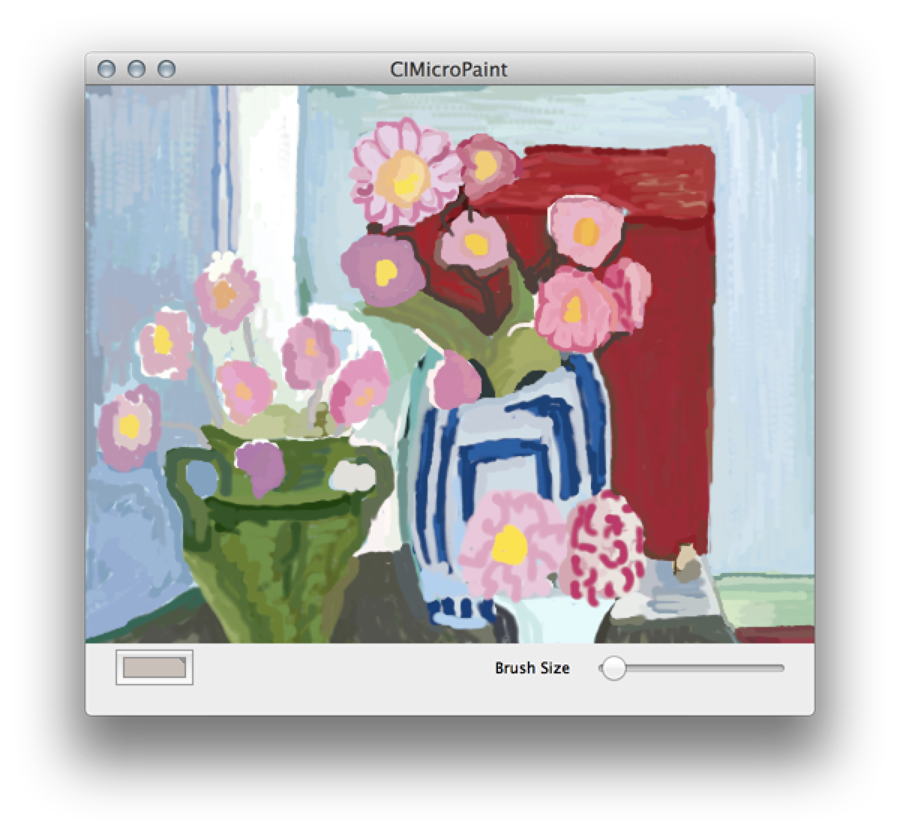

> 导航：[总目录](../../../README.md) · [documentation](../../../_indexes/documentation.md) · [Core Image Programming Guide](About%20Core%20Image.md)


[Next](What%20You%20Need%20to%20Know%20Before%20Writing%20a%20Custom%20Filter.md)[Previous](Getting%20the%20Best%20Performance.md)

# Using Feedback to Process Images

The `CIImageAccumulator` class is ideally suited for feedback-based processing. As it’s name suggests, it accumulates image data over time. This chapter shows how to use a `CIImageAccumulator` object to implement a simple painting app called MicroPaint that allows users to paint on a canvas to create images similar to that shown in Figure 7-1.

__Figure 7-1__  Output from MicroPaint



The “image” starts as a blank canvas. MicroPaint uses an image accumulator to collect the paint applied by the user. When the user clicks Clear, MicroPaint resets the image accumulator to a white canvas. The color well allows the user to change paint colors. The user can change the brush size using the slider.

The essential tasks for creating setting up an image accumulator for the MicroPaint app are:

1. [Set Up the Interface for the MicroPaint App](#apple-f4xwc4dqnrsv64tfmyxwi33df52wszbpkridgmbqgaytcobvfvbuqnjnknlte)
2. [Initialize Filters and Default Values for Painting](#apple-f4xwc4dqnrsv64tfmyxwi33df52wszbpkridgmbqgaytcobvfvbuqnjnknltg)
3. [Track and Accumulate Painting Operations](#apple-f4xwc4dqnrsv64tfmyxwi33df52wszbpkridgmbqgaytcobvfvbuqnjnknlti)

This chapter describes only the code that is essential to creating an image accumulator and supporting drawing to it. The methods for drawing to the view and for handling view size changes aren’t discussed here. For that, see _[CIMicroPaint](../../../samplecode/CIMicroPaint/CIMicroPaint.md#apple-f4xwc4dqnrsv64tfmyxwi33df52wszbpirkfgnbqgaydsmrrha)_, which is a complete sample code project that you can download and examine in more detail. `CIMicroPaint` has several interesting details. It shows how to draw to an OpenGL view and to maintain backward compatibility for previous versions of OS X.

The interface to MicroPaint needs the following:

- An image accumulator
- A “brush” for the user. The brush is a Core Image filter (CIRadialGradient) that applies color in a way that simulates an air brush.
- A composite filter (CISourceOverCompositing) that allows new paint to be composited over previously applied paint.
- Variables for keeping track of the current paint color and brush size.

Building a Dictionary of Filters declares `MircoPaintView` as a subclass of `SampleCIView`. The `SampleCIView` class isn’t discussed here; it is a subclass of the `NSOpenGLView` class. See the _[CIMicroPaint](../../../samplecode/CIMicroPaint/CIMicroPaint.md#apple-f4xwc4dqnrsv64tfmyxwi33df52wszbpirkfgnbqgaydsmrrha)_ sample app for details.

__Listing 7-1__  The interface for the MicroPaint app

```objc
@interface MicroPaintView : SampleCIView {
    CIImageAccumulator *imageAccumulator;
    CIFilter *brushFilter;
    CIFilter *compositeFilter;
    NSColor *color;
    CGFloat brushSize;
}
@end
```


When you initialize the MicroPaint app (as shown in Listing 7-2), you need to create the brush and composite filters, and set the initial brush size and paint color. The code in [Listing 7-2](#apple-f4xwc4dqnrsv64tfmyxwi33df52wszbpkridgmbqgaytcobvfvbuqnjnknlto) is created and initialized to transparent black with an input radius of 0. When the user drags the cursor, the brush filter takes on the current values for brush size and color.

__Listing 7-2__  Initializing filters, brush size, and paint color

```
    brushFilter = [CIFilter filterWithName: @"CIRadialGradient" withInputParameters:@{
         @"inputColor1": [CIColor colorWithRed:0.0 green:0.0 blue:0.0 alpha:0.0],
         @"inputRadius0": @0.0,
         }];
    compositeFilter = [CIFilter filterWithName: @"CISourceOverCompositing"];
    brushSize = 25.0;
    color = [NSColor colorWithDeviceRed: 0.0 green: 0.0 blue: 0.0 alpha: 1.0];
```


The `mouseDragged:` method is called whenever the user either clicks or drags the cursor over the canvas. It updates the brush and compositing filter values and adds new painting operations to the accumulated image.

After setting the image, you need to trigger an update of the display. Your `drawRect:` method handles drawing the image. When drawing to a `CIContext` object, make sure to use [drawImage:inRect:fromRect:](https://developer.apple.com/documentation/coreimage/cicontext/1437786-drawimage) rather than the deprecated method `drawImage:atPoint:fromRect:`.

__Listing 7-3__  Setting up and applying the brush filter to the accumulated image

```objc
- (void)mouseDragged:(NSEvent *)event
{
    CGRect   rect;
    NSPoint  loc = [self convertPoint: [event locationInWindow] fromView: nil];
    CIColor   *cicolor;

    // Make a rectangle that is centered on the drag location and
    // whose dimensions are twice of the current brush size
    rect = CGRectMake(loc.x-brushSize, loc.y-brushSize,
                                   2.0*brushSize, 2.0*brushSize);
    // Set the size of the brush
    // Recall this is really a radial gradient filter
    [brushFilter setValue: @(brushSize)
                   forKey: @"inputRadius1"];
    cicolor = [[CIColor alloc] initWithColor: color];
    [brushFilter setValue: cicolor  forKey: @"inputColor0"];
    [brushFilter setValue: [CIVector vectorWithX: loc.x Y:loc.y]
                   forKey: kCIInputCenterKey];
    // Composite the output from the brush filter with the image
    // accummulated by the image accumulator
    [compositeFilter setValue: [brushFilter valueForKey: kCIOutputImageKey]
                       forKey: kCIInputImageKey];
    [compositeFilter setValue: [imageAccumulator image]
                       forKey: kCIInputBackgroundImageKey];
    // Set the image accumluator to the composited image
    [imageAccumulator setImage: [compositeFilter valueForKey: kCIOutputImageKey]
                     dirtyRect: rect];
    // After setting the image, you need to trigger an update of the display
    [self setImage: [imageAccumulator image] dirtyRect: rect];
}
```

[Next](What%20You%20Need%20to%20Know%20Before%20Writing%20a%20Custom%20Filter.md)[Previous](Getting%20the%20Best%20Performance.md)

