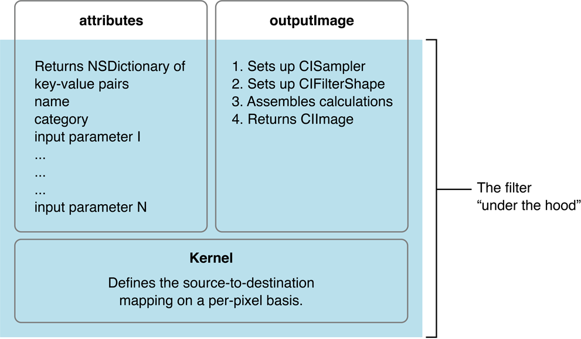
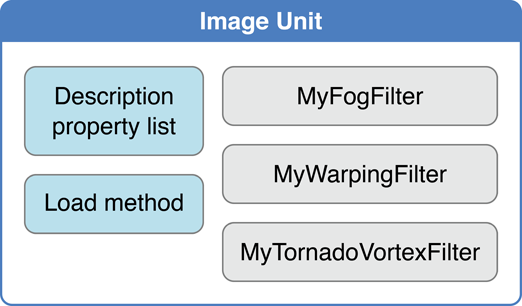
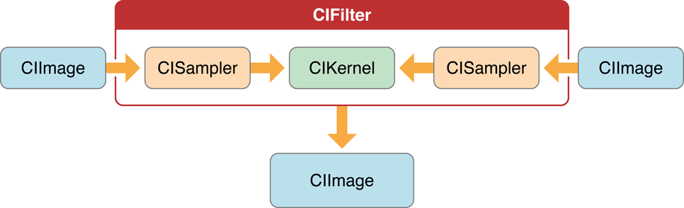
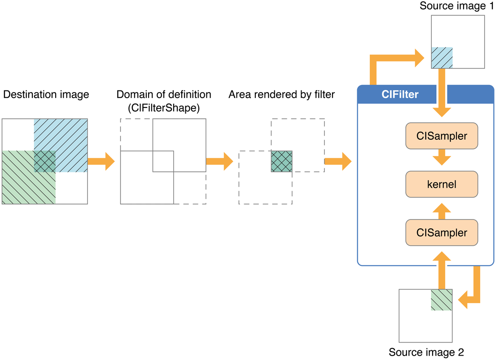

> 导航：[总目录](../../../README.md) · [documentation](../../../_indexes/documentation.md) · [Core Image Programming Guide](About%20Core%20Image.md)

[Next](Creating%20Custom%20Filters.md)[Previous](Using%20Feedback%20to%20Process%20Images.md)

# What You Need to Know Before Writing a Custom Filter

Core Image provides support for writing custom filters. A _custom filter_ is one for which you write a routine, called a _kernel_, that specifies the calculations to perform on each source image pixel. If you plan to use the built-in Core Image filters, either as they are or by subclassing them, you don’t need to read this chapter. If you plan to write a custom filter, you should read this chapter so you understand the processing path and the components in a custom filter. After reading this chapter, you can find out how to write a filter in [Creating Custom Filters](Creating%20Custom%20Filters.md#apple-f4xwc4dqnrsv64tfmyxwi33df52wszbpkridgmbqgaytcobvfvbuqnrnkrifqusfiyytami). If you are interested in packaging your custom filter for distribution, you should also read [Packaging and Loading Image Units](Packaging%20and%20Loading%20Image%20Units.md#apple-f4xwc4dqnrsv64tfmyxwi33df52wszbpkridgmbqgaytcobvfvbuqnznknltcmq).

Core Image is designed for two types of developers: filter clients and filter creators. If you plan only to use Core Image filters, you are a _filter client_. If you plan to write your own filter, you are a _filter creator_.

Figure 8-1 shows the components of a typical filter. The shaded area of the figure indicates parts that are “under the hood”—the parts that a filter client does not need to know anything about but which a filter creator must understand. The portion that’s not shaded shows two methods—`attributes` and `outputImage`—that provide data to the filter client. The filter’s `attributes` method returns a list of key-value pairs that describe a filter. The `outputImage` method produces an image using:

- A sampler to fetch pixels from a source
- A kernel that processes pixels

__Figure 8-1__  The components of a typical filter

At the heart of every custom filter is a kernel. The _kernel_ specifies the calculations that are performed on each source image pixel. Kernel calculations can be very simple or complex. A very simple kernel for a “do nothing” filter could simply return the source pixel:

`destination pixel = source pixel`

Filter creators use a variant of OpenGL Shading Language (glslang) to specify per-pixel calculations. (See _[Core Image Kernel Language Reference](../Core%20Image%20Kernel%20Language%20Reference/Introduction.md#apple-f4xwc4dqnrsv64tfmyxwi33df52wszbpkridimbqga2dgojx)_.) The kernel is opaque to a filter client. A filter can actually use several kernel routines, passing the output of one to the input of another. For instructions on how to write a custom filter, see [Creating Custom Filters](Creating%20Custom%20Filters.md#apple-f4xwc4dqnrsv64tfmyxwi33df52wszbpkridgmbqgaytcobvfvbuqnrnkrifqusfiyytami).

Filter creators can make their custom filters available to any app by packaging them as a plug-in, or _image unit_, using the architecture specified by the [NSBundle](https://developer.apple.com/library/archive/documentation/LegacyTechnologies/WebObjects/WebObjects_3.5/Reference/Frameworks/ObjC/Foundation/Classes/NSBundle/Description.html#//apple_ref/occ/cl/NSBundle) class. An image unit can contain more than one filter, as shown in Figure 8-2. For example, you could write a set of filters that perform different kinds of edge detection and package them as a single image unit. Filter clients can use the Core Image API to load the image unit and to obtain a list of the filters contained in that image unit. See [Loading Image Units](Packaging%20and%20Loading%20Image%20Units.md#apple-f4xwc4dqnrsv64tfmyxwi33df52wszbpkridgmbqgaytcobvfvbuqnznknltm) for basic information. See _[Image Unit Tutorial](../Image%20Unit%20Tutorial/Introduction.md#apple-f4xwc4dqnrsv64tfmyxwi33df52wszbpkridimbqga2dkmzr)_ for in-depth examples and detailed information on writing filters and packaging them as standalone image units.

__Figure 8-2__  An image unit contains packaging information along with one or more filter definitions

Figure 8-3 shows the pixel processing path for a filter that operates on two source images. Source images are always specified as `CIImage` objects. Core Image provides a variety of ways to get image data. You can supply a URL to an image, read raw image data (using the [NSData](https://developer.apple.com/library/archive/documentation/LegacyTechnologies/WebObjects/WebObjects_3.5/Reference/Frameworks/ObjC/Foundation/Classes/NSDataClassCluster/Description.html#//apple_ref/occ/cl/NSData) class), or convert a Quartz 2D image ([CGContextRef](https://developer.apple.com/documentation/coregraphics/cgcontextref)), an OpenGL texture, or a Core Video image buffer ([CVImageBufferRef](https://developer.apple.com/documentation/corevideo/cvimagebufferref)) to a `CIImage` object.

Note that the actual number of input images, and whether or not the filter requires an input image, depends on the filter. Filters are very flexible—a filter can:

- Work without an input image. Some filters generate an image based on input parameters that aren’t images. (For example, see the `CICheckerboardGenerator` and `CIConstantColorGenerator` filters in _[Core Image Filter Reference](https://developer.apple.com/library/archive/documentation/GraphicsImaging/Reference/CoreImageFilterReference/index.html#//apple_ref/doc/uid/TP40004346)_.)
- Require one image. (For example, see the `CIColorPosterize` and `CICMYKHalftone` filters in _[Core Image Filter Reference](https://developer.apple.com/library/archive/documentation/GraphicsImaging/Reference/CoreImageFilterReference/index.html#//apple_ref/doc/uid/TP40004346)_.)
- Require two or more images. Filters that composite images or use the values in one image to control how the pixels in another image are processed typically require two or more images. One input image can act as a shading image, an image mask, a background image, or provide a source of lookup values that control some aspect of how the other image is processed. (For example, see the `CIShadedMaterial` filter in _[Core Image Filter Reference](https://developer.apple.com/library/archive/documentation/GraphicsImaging/Reference/CoreImageFilterReference/index.html#//apple_ref/doc/uid/TP40004346)_.)

When you process an image, it is your responsibility to create a `CIImage` object that contains the appropriate input data.

__Figure 8-3__  The pixel processing path

Pixels from each source image are fetched by a `CISampler` object, or simply a sampler. As its name suggests, a _sampler_ retrieves samples of an image and provides them to a kernel. A filter creator provides a sampler for each source image. Filter clients don’t need to know anything about samplers.

A sampler defines:

- A coordinate transform, which can be the identity transform if no transformation is needed.
- An interpolation mode, which can be nearest neighbor sampling or bilinear interpolation (which is the default).
- A wrapping mode that specifies how to produce pixels when the sampled area is outside of the source image—either to use transparent black or clamp to the extent.

The filter creator defines the per-pixel image processing calculations in the kernel, but Core Image handles the actual implementation of those calculations. Core Image determines whether the calculations are performed using the GPU or the CPU. Core Image implements hardware rasterization using Metal, OpenGL, or OpenGL ES depending on device capabilities. It implements software rasterization through an emulation environment specifically tuned for evaluating fragment programs with nonprojective texture lookups over large quadrilaterals (quads).

Although the pixel processing path is from source image to destination, the calculation path that Core Image uses begins at the destination and works its way back to the source pixels, as shown in Figure 8-4. This backward calculation might seem unwieldy, but it actually minimizes the number of pixels used in any calculation. The alternative, which Core Image does not use, is the brute force method of processing all source pixels, then later deciding what’s needed for the destination. Let’s take a closer look at Figure 8-4.

__Figure 8-4__  The Core Image calculation path

Assume that the filter in Figure 8-4 performs some kind of compositing operation, such as source-over compositing. The filter client wants to overlap the two images so that only a small portion of each image is composited to achieve the result shown at the left side of Figure 8-4. By looking ahead to what the destination ought to be, Core Image can determine which data from the source images affect the final image and then restrict calculations only to those source pixels. As a result, the samplers fetch sample pixels only from shaded areas in the source images, shown in Figure 8-4.

Note the box in Figure 8-4 that’s labeled _Domain of definition_. The domain of definition is simply a way to further restrict calculations. It is an area outside of which all pixels are transparent (that is, the alpha component is equal to 0). In this example, the domain of definition coincides exactly with the destination image. Core Image lets you supply a `CIFilterShape` object to define this area. The `CIFilterShape` class provides a number of methods that can define rectangular shapes, transform shapes, and perform inset, union, and intersection operations on shapes. For example, if you define a filter shape using a rectangle that is smaller than the shaded area shown in Figure 8-4, then Core Image uses that information to further restrict the source pixels used in the calculation.

Core Image promotes efficient processing in other ways. It performs intelligent caching and compiler optimizations that make it well-suited for such tasks as real-time video processing and image analysis. It caches intermediate results for any data set that is evaluated repeatedly. Core Image evicts data in least-recently-used order whenever adding a new image would cause the cache to grow too large. Objects that are reused frequently remain in the cache, while those used once in a while might be moved in and out of the cache as needed. Your app benefits from Core Image caching without needing to know the details of how caching is implemented. However, you get the best performance by reusing objects (images, contexts, and so forth) whenever you can.

Core Image also gets great performance by using traditional compilation techniques at the kernel and pass levels. The method Core Image uses to allocate registers minimizes the number of temporary registers (per kernel) and temporary pixel buffers (per filter graph). The compiler performs several optimizations and automatically distinguishes between reading data-dependent textures, which are based on previous calculations, and those that are not data-dependent. Again, you don’t need to concern yourself with the details of the compilation techniques. The important point is that Core Image is hardware savvy; it uses the power of the GPU and multicore CPUs whenever it can, and it does so in smart ways.

Core Image performs operations in a device-independent working space. The Core Image working space is, in theory, infinite in extent. A point in working space is represented by a coordinate pair (_x_, _y_), where _x_ represents the location along the horizontal axis and _y_ represents the location along the vertical axis. Coordinates are floating-point values. By default, the origin is point (0,0).

When Core Image reads an image, it translates the pixel locations into device-independent working space coordinates. When it is time to display a processed image, Core Image translates the working space coordinates to the appropriate coordinates for the destination, such as a display.

When you write your own filters, you need to be familiar with two coordinate spaces: the _destination coordinate space_ and the _sampler space_. The destination coordinate space represents the image you are rendering to. The sampler space represents what you are texturing from (another image, a lookup table, and so on). You obtain the current location in destination space using the `destCoord` function whereas the `samplerCoord` function provides the current location in sample space. (See _[Core Image Kernel Language Reference](../Core%20Image%20Kernel%20Language%20Reference/Introduction.md#apple-f4xwc4dqnrsv64tfmyxwi33df52wszbpkridimbqga2dgojx)_.)

Keep in mind that if your source data is tiled, the sampler coordinates have an offset (dx/dy). If your sample coordinates have an offset, it may be necessary for you to convert the destination location to the sampler location using the function `samplerTransform`.

Although not explicitly labeled in [Figure 8-4](#apple-f4xwc4dqnrsv64tfmyxwi33df52wszbpkridgmbqgaytcobvfvbuqojnknlts), the shaded area in each of the source images is the _region of interest_ for samplers depicted in the figure. The region of interest, or ROI, defines the area in the source from which a sampler takes pixel information to provide to the kernel for processing. If you are a filter client, you don’t need to concern yourself with the ROI. But if you are a filter creator, you’ll want to understand the relationship between the region of interest and the domain of definition.

Recall that the domain of definition describes the bounding shape of a filter. In theory, this shape can be without bounds. Consider, for example, a filter that creates a repeating pattern that could extend to infinity.

The ROI and the domain of definition can relate to each other in the following ways:

- They coincide exactly—there is a 1:1 mapping between source and destination. For example, a hue filter processes a pixel from the working space coordinate (_r_,_s_) in the ROI to produce a pixel at the working space coordinate (_r_,_s_) in the domain of definition.
- They are dependent on each other, but modulated in some way. Some of the most interesting filters—blur and distortion, for example—use many source pixels in the calculation of one destination pixel. For example, a distortion filter might use a pixel (_r_,_s_) and its neighbors from the working coordinate space in the ROI to produce a single pixel (_r_,_s_) in the domain of definition.
- The domain of definition is calculated from values in a lookup table that are provided by the sampler. The location of values in the map or table are unrelated to the working space coordinates in the source image and the destination. A value located at (_r_,_s_) in a shading image does not need to be the value that produces a pixel at the working space coordinate (_r_,_s_) in the domain of definition. Many filters use values provided in a shading image or lookup table in combination with an image source. For example, a color ramp or a table that approximates a function, such as the `arcsin` function, provides values that are unrelated to the notion of working coordinates.

Unless otherwise instructed, Core Image assumes that the ROI and the domain of definition coincide. If you write a filter for which this assumption doesn’t hold, you need to provide Core Image with a routine that calculates the ROI for a particular sampler.

See [Supplying an ROI Function](Creating%20Custom%20Filters.md#apple-f4xwc4dqnrsv64tfmyxwi33df52wszbpkridgmbqgaytcobvfvbuqnrninfeerkdifcug) for more information.

You can categorize custom Core Image filters on the basis of whether or not they require an auxiliary binary executable to be loaded into the address space of the client app. As you use the Core Image API, you’ll notice that these are simply referred to as _executable_ and _nonexecutable_. Filter creators can choose to write either kind of filter. Filter clients can choose to use only nonexecutable or to use both kinds of filters.

Security is the primary motivation for distinguishing CPU executable and CPU nonexecutable filters. Nonexecutable filters consist only of a Core Image kernel program to describe the filter operation. In contrast, an executable filter also contains machine code that runs on the CPU. Core Image kernel programs run within a restricted environment and cannot pose as a virus, Trojan horse, or other security threat, whereas arbitrary code that runs on the CPU can.

Nonexecutable filters have special requirements, one of which is that nonexecutable filters must be packaged as part of an image unit. Filter creators can read [Writing Nonexecutable Filters](Creating%20Custom%20Filters.md#apple-f4xwc4dqnrsv64tfmyxwi33df52wszbpkridgmbqgaytcobvfvbuqnrninfeersii5dug) for more information. Filter clients can find information on loading each kind of filter in [Loading Image Units](Packaging%20and%20Loading%20Image%20Units.md#apple-f4xwc4dqnrsv64tfmyxwi33df52wszbpkridgmbqgaytcobvfvbuqnznknltm).

_Premultiplied alpha_ is a term used to describe a source color, the components of which have already been multiplied by an alpha value. Premultiplying speeds up the rendering of an image by eliminating the need to perform a multiplication operation for each color component. For example, in an RGB color space, rendering an image with premultiplied alpha eliminates three multiplication operations (red times alpha, green times alpha, and blue times alpha) for each pixel in the image.

Filter creators must supply Core Image with color components that are premultiplied by the alpha value. Otherwise, the filter behaves as if the alpha value for a color component is 1.0. Making sure color components are premultiplied is important for filters that manipulate color.

By default, Core Image assumes that processing nodes are 128 bits-per-pixel, linear light, premultiplied RGBA floating-point values that use the GenericRGB color space. You can specify a different working color space by providing a Quartz 2D CGColorSpace object. Note that the working color space must be RGB-based. If you have YUV data as input (or other data that is not RGB-based), you can use ColorSync functions to convert to the working color space. (See _[Quartz 2D Programming Guide](../Quartz%202D%20Programming%20Guide/Introduction.md#apple-f4xwc4dqnrsv64tfmyxwi33df52wszbpkridgmbqgaytanrw)_ for information on creating and using CGColorspace objects.)

With 8-bit YUV 4:2:2 sources, Core Image can process 240 HD layers per gigabyte. Eight-bit YUV is the native color format for video source such as DV, MPEG, uncompressed D1, and JPEG. You need to convert YUV color spaces to an RGB color space for Core Image.

Shantzis, Michael A., “A Model for Efficient and Flexible Image Computing,” (1994), _Proceedings of the 21st Annual Conference on Computer Graphics and Interactive Techniques_.

Smith, Alvy Ray, “Image Compositing Fundamentals,” Memo 4, Microsoft, July 1995. Available from [http://alvyray.com/Memos/MemosCG.htm#ImageCompositing](http://alvyray.com/Memos/MemosCG.htm#ImageCompositing)

[Next](Creating%20Custom%20Filters.md)[Previous](Using%20Feedback%20to%20Process%20Images.md)

