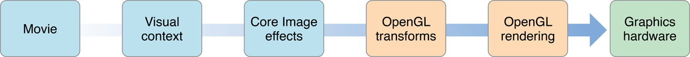
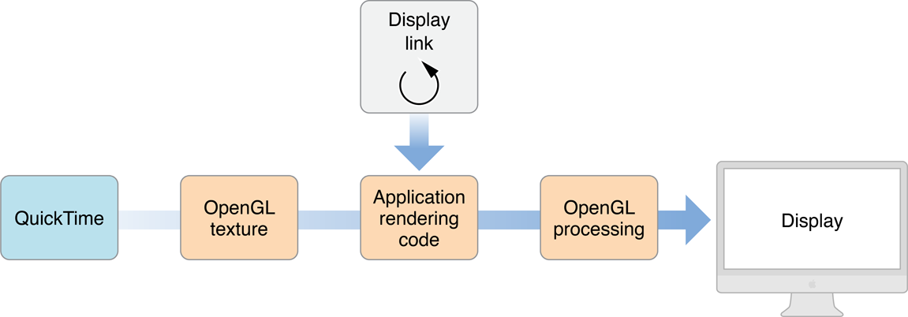
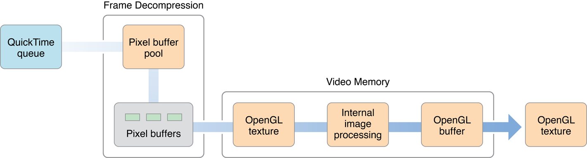

> 导航：[总目录](../../../README.md) · [documentation](../../../_indexes/documentation.md) · [Core Video Programming Guide](Introduction%20to%20Core%20Video%20Programming%20Guide.md)

[Next](Core%20Video%20Tasks.md)[Previous](Introduction%20to%20Core%20Video%20Programming%20Guide.md)

# Core Video Concepts

Core Video is a new model for handling digital video in OS X. It provides two major features to simplify video processing:

- A standard buffering model that makes it easy to switch between uncompressed video frames (such as from QuickTime) and OpenGL.
- A display synchronization solution.

This chapter describes the concepts behind these features.

Core Video assumes a pipeline of discrete steps when handling video, from the incoming movie data to the actual video frames displayed onscreen. This pipeline makes it much easier to add custom processing.

__Figure 1-1__  The Core Video pipeline

The movie’s frame data comes from your video source (QuickTime, for example) and is assigned to a visual context. The _visual context_ simply specifies the drawing destination you want to render your video into. For example, this context can be a Core Graphics context or an OpenGL context. In most cases, a visual context is associated with a view in a window, but it is possible to have offscreen contexts as well.

After you specify a drawing context, you are free to manipulate the frame as you wish. For example, you can process your frame using Core Image filters or specify warping effects in OpenGL. After doing so, you hand off the frame to OpenGL, which then executes your rendering instructions (if any) and sends the completed frame to the display.

Within the Core Video pipeline, the most important facets for developers are the display link, which handles display synchronization, and the common buffering model, which simplifies memory management when moving frames between various buffer types. Most applications manipulating video need to use only the display link. You need to worry about using Core Video buffers only if you are generating (or compressing) video frames.

To simplify synchronization of video with a display’s refresh rate, Core Video provides a special timer called a _display link_. The display link runs as a separate high priority thread, which is not affected by interactions within your application process.

In the past, synchronizing your video frames with the display’s refresh rate was often a problem, especially if you also had audio. You could only make simple guesses for when to output a frame (by using a timer, for example), which didn’t take into account possible latency from user interactions, CPU loading, window compositing and so on. The Core Video display link can make intelligent estimates for when a frame needs to be output, based on display type and latencies.

[Figure 1-2](#apple-f4xwc4dqnrsv64tfmyxwi33df52wszbpkridimbqgaytkmzwfvbuqmrqgiwugscbi5bucq2f) shows how the display link interacts with your application when processing video frames.

__Figure 1-2__  Processing video frames with the display link

- The display link calls your callback periodically, requesting frames.
- Your callback must then obtain the frame for the requested time. You get this frame as an OpenGL texture. (This example assumes that your frames come from QuickTime, but you can use any video source that can provide frame buffers.)
- You can now use any OpenGL calls on the texture to manipulate it.

If for some reason the processing takes longer than expected (that is, the display link’s estimate is off), the video graphics card can still drop frames or otherwise compensate for the timing error as necessary.

If your application actually generates frames for display, or compresses incoming raw video, you will need to store the image data while doing so. Core Video provides different buffer types to simplify this process.

Previously, there was a lot of overhead if you wanted to, for example, manipulate QuickTime frames using OpenGL. Converting between various buffer types and handling the internal memory housekeeping was a chore. Now, with Core Video, buffers are Core Foundation-style objects, which are easy to create and destroy, and easy to convert from one buffer type to another.

Core Video defines an abstract buffer of type CVBuffer. All the other buffer types are derived from the CVBuffer type (and are typed as such). A CVBuffer can hold video, audio, or possibly some other type of data. You can use the CVBuffer APIs on any Core Video buffer.

- An _image buffer_ is an abstract buffer used specifically to store video images (or frames). Pixel buffers and OpenGL buffers are derived from image buffers.
- A _pixel buffer_ stores an image in main memory.
- A Core Video _OpenGL buffer_ is a wrapper around a standard OpenGL buffer (or pbuffer), which stores an image in video (graphics card) memory.
- A Core Video OpenGL _texture_ is a wrapper around a standard OpenGL texture, which is an immutable image stored in graphics card memory. Textures are derived from a pixel buffer or an OpenGL buffer, which contains the actual frame data. A texture must be wrapped onto a primitive (such as a rectangle, or a sphere) to be displayed.

When using buffers, it is often useful to manage them in buffer pools. A _buffer pool_ allocates a number of buffers that can then be reused as needed. The advantage here is that the system doesn’t have to devote extra time allocating and deallocating memory; when you release a buffer, it goes back into the pool. You can have pixel buffer pools in main memory and OpenGL buffer pools in video memory.

You can think of a buffer pool as a small fleet of cars bought for corporate use. An employee simply takes a car from the fleet when needed and returns it when she’s done with it. Doing so requires much less overhead than buying and selling a car each time. To maximize resources, the number of cars in the fleet can be adjusted based on demand.

In a similar fashion, you should allocate OpenGL textures using a _texture cache_, which holds a number of textures that can be reused.

[Figure 1-3](#apple-f4xwc4dqnrsv64tfmyxwi33df52wszbpkridimbqgaytkmzwfvbuqmrqgiwugscbjjfegqsg) shows a possible implementation of the frame processing that occurs under the hood when processing QuickTime movies, showing the use of a number of buffers and buffer pools to store video data as it progresses from compressed file data to the actual pixel images that appear onscreen.

__Figure 1-3__  Decompressing and processing a QuickTime frame

The steps in the frame processing are as follows:

- QuickTime supplies the video data stream that will be turned into individual frames.
- The frames are decompressed using the specified codec. A pixel buffer pool is used to hold key frames, B frames, and so on, which are needed to render individual frames.
- Individual frames are stored as OpenGL textures in video memory. Additional image processing for the frame (such as de-interlacing) can be done here, with the results being stored in an OpenGL buffer.
- When you request a frame from Core Video (in response to the display link callback), the OpenGL buffer contents are converted to an OpenGL texture that is then handed to you.

A video frame often has information associated with it that is useful to the system that displays it. In Core Video, this information is associated with a video frame as an attachment. _Attachments_ are Core Foundation objects representing various types of data, such as the following common video properties:

- Clean aperture and preferred clean aperture. Video processing (such as filtering) often produces artifacts at the edges of a frame. To avoid displaying such artifacts, most video images contain more screen information than is actually displayed and simply crop the edges. The preferred clean aperture is the suggested cropping that is set when the video is compressed. The clean aperture is the cropping that is actually used when displaying.
- Color space. A color space is the model used to represent an image, such as RGB or YCbCr. Its is called a “color space” because most models use several parameters that can be mapped to a point in space. For example, the RGB color space uses three parameters, red, green, and blue, and every possible combination of the three maps to a unique point in three-dimensional space.
- Square versus rectangular pixels. Digital video on computers typically use square pixels. However, TV uses rectangular pixels, so you need to compensate for this discrepancy if you are creating video for broadcast.
- Gamma level. The gamma is a “fudge factor” used to match the output of display hardware to what our eyes expect to see. For example, the voltage to color intensity ratio of a display is typically nonlinear; doubling the “blue” signal voltage doesn’t necessarily produce an image that looks “twice as blue.” The gamma is the exponent in the curve that best matches the input versus output response.
- Timestamps. Typically represented as hours, minutes, seconds, and fractions, a timestamp represents when a particular frame appears in a movie. The size of the fractional portion depends on the timebase your movie is using. Timestamps make it easy to isolate particular movie frames, and simplify synchronization of multiple video and audio tracks.

You specify attachments as key-value pairs. You can either use predefined keys, as described in the _Core Video Reference_, or define your own if you have custom frame information. If you indicate that an attachment can be propagated, you can easily transfer these attachments to successive buffers, for example, when creating an OpenGL texture from a pixel buffer.

[Next](Core%20Video%20Tasks.md)[Previous](Introduction%20to%20Core%20Video%20Programming%20Guide.md)

