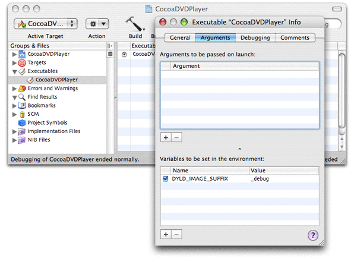

> 导航：[总目录](../../../README.md) · [documentation](../../../_indexes/documentation.md) · [DVD Playback Services Programming Guide](Introduction%20to%20DVD%20Playback%20Services%20Programming%20Guide.md)


[Next](Glossary.md)[Previous](Basic%20Programming%20Tasks.md)

# Additional Programming Tasks

In this chapter, you'll learn about other features such as DVD events and bookmarks, and how to debug your application code.

DVD Playback Services defines a set of DVD events to notify your application when important state changes occur. Responding to these events is optional. As a general rule, however, you should design your application to respond to events rather than poll for state changes.

To receive DVD events, you need to register one or more event callback functions. To register an event callback, you call the `DVDRegisterEventCallBack` function, passing in a pointer to the callback and a list of events the callback should receive. The function passes back a registration number that you will need to use when you unregister the callback.

Listing 3-1 shows how to register a callback to receive several events of interest.

__Listing 3-1__  Registering a DVD event handler

```
    DVDEventCode eventCodes[] = {
        kDVDEventAngle,
        kDVDEventDisplayMode,
        kDVDEventError,
        kDVDEventPlayback,
        kDVDEventPTT,
        kDVDEventTitle,
        kDVDEventTitleTime,
        kDVDEventVideoStandard,
    }; // 1

    OSStatus err = DVDRegisterEventCallBack (
        MyDVDEventHandler,
        eventCodes,
        sizeof(eventCodes)/sizeof(DVDEventCode),
        (UInt32)self,
        &mEventCallBackID); // 2
```

Here's what this code does:

1. Creates an array of the events that our callback will receive.
2. Registers our callback to receive these events. `DVDRegisterEventCallBack` passes back a registration number that is needed later to unregister the callback; see [Ending a Playback Session](Basic%20Programming%20Tasks.md#apple-f4xwc4dqnrsv64tfmyxwi33df52wszbpkridimbqgazdsnjqfvjvomq).

DVD Playback Services invokes your DVD event callback function in a thread other than your application's main thread. Your response to a DVD event might include drawing operations, which need to execute in the main thread. To ensure that your event-handling code executes safely, your callback function can pass the event information to a method that is guaranteed to execute in the main thread. Listing 3-2 shows how to do this in a Cocoa application.

__Listing 3-2__  Decoupling a DVD event from the callback thread

```
void MyDVDEventHandler (
    DVDEventCode inEventCode,
    UInt32 inEventData1,
    UInt32 inEventData2,
    UInt32 inRefCon
)
{
    Controller *controller = (Controller *)inRefCon;

    DVDEvent *dvdEvent = [[DVDEvent alloc] initWithData:inEventCode
        data1:inEventData1
        data2:inEventData2]; // 1

    [controller performSelectorOnMainThread:@selector(handleDVDEvent:)
        withObject:dvdEvent
        waitUntilDone:FALSE]; // 2

    [dvdEvent release]; // 3
}
```

Here's what this code does:

1. Creates an object that encapsulates the DVD event information. The class for this object is defined in the CocoaDVDPlayer project.
2. Passes the object to our event-handling method, which executes asynchronously in the main thread.
3. The object is retained in our event handler, so it's safe to release it here.

The `DVDSetAudioVolume` function adjusts the audio output volume or level during playback. This function takes a single argument, an integer that can range from 0 to 255. The value 0 represents no output, and the value 255 represents the current system audio output volume. Both stereo channels use the same setting.

Many multimedia applications provide a slider control to adjust the audio output. For users who want to use the keyboard instead of the mouse to operate this control, you should also provide a way to change the audio output volume in increments. [Listing 3-3](#apple-f4xwc4dqnrsv64tfmyxwi33df52wszbpkridimbqgazdcnrtfvkfanbqgaydgmrsgawvgvzx) shows how to implement a function that adjusts the audio volume using increments of 16. This function takes a single argument that represents the change direction (up or down).

__Listing 3-3__  Setting the DVD audio output volume

```objc
- (UInt16) setAudioVolume:(BOOL)up
{
    UInt16 minLevel, curLevel, maxLevel;
    OSStatus err = DVDGetAudioVolumeInfo (&minLevel, &curLevel, &maxLevel); // 1

    UInt16 newLevel = curLevel;
    UInt16 delta = (maxLevel - minLevel + 1) / 16; // 2

    if (up) { // 3
        newLevel = MIN(curLevel + delta, maxLevel);
    }
    else {
        newLevel = MAX(curLevel - delta, minLevel);
    }

    err = DVDSetAudioVolume (newLevel); // 4
    return newLevel; // 5
}
```

Here's what this code does:

1. Retrieves the current audio settings. The minimum and maximum levels are 0 and 255.
2. Calculates the size of each increment. In this example, the increment is 256/16 = 16.
3. Calculates the new audio setting, clamping the result if necessary.
4. Sets the audio volume.
5. Returns the new setting; the caller uses this value to adjust the slider.

Bookmarks are objects that specify the current media position during playback. You are responsible for allocating and managing the memory needed when you create a bookmark. Before attempting to create a bookmark, media must be open and playing.

Creating a bookmark is a three-step process:

1. Determine the size of a bookmark. You do this by calling the `DVDGetBookmark` function without supplying a pointer to any bookmark memory.
2. Use the [malloc](https://developer.apple.com/library/archive/documentation/System/Conceptual/ManPages_iPhoneOS/man3/malloc.3.html#//apple_ref/doc/man/3/malloc) function to allocate memory for a new bookmark. You don't need to initialize the contents of the memory.
3. Call `DVDGetBookmark` a second time to create the bookmark, passing in a pointer to your newly-allocated memory. You are responsible for releasing the memory when you are finished using it.

To use a bookmark to return to a frame and resume playback, you should call the convenience function `DVDGotoBookmark`. Before calling this function, media must be open but not necessarily playing.

Listing 3-4 shows how to write a simple bookmark class.

__Listing 3-4__  A simple bookmark class

```objc
@interface Bookmark : NSObject {
    void * data;
    UInt32 size;
}
- (void) gotoBookmark;

@end
```

```objc
@implementation Bookmark

- (id) init {
    self = [super init];
    if (self) {
        data = NULL;
        size = 0;
        OSStatus err = DVDGetBookmark (NULL, &size); // 1
        data = malloc (size); // 2
        err = DVDGetBookmark (data, &size); // 3
    }
    return self;
}

- (void) gotoBookmark {
    OSStatus err = DVDGotoBookmark (data, size) //4;
}

- (void) dealloc {
    free (data); // 5
    [super dealloc];
}

@end
```

Here's what this code does:

1. Gets the size of a bookmark.
2. Allocates memory for bookmark data.
3. Creates a bookmark to the current playback location.
4. Positions the media at this bookmark and resumes playback.
5. Frees the memory for this bookmark.

If you want to save a bookmark in a file for reuse the next time the user opens the media, you need to devise a way to associate the bookmark with the media folder to which it refers. DVD Playback Services can generate a media identifier that you can use as an associative key. For example, you could use the media identifier to name the file that contains the bookmarks for that media folder. To obtain the media identifier for the media folder that's currently open, you call the `DVDGetMediaUniqueID` function. This function returns an 8-byte array that you can convert into a string of hexadecimal characters.

Listing 3-5 shows how to retrieve and display a media identifier.

__Listing 3-5__  Displaying the media identifier

```
    DVDDiscID id;
    DVDGetMediaUniqueID (id);
    NSLog(@"Media ID: %.2x%.2x%.2x%.2x%.2x%.2x%.2x%.2x",
        id[0], id[1], id[2], id[3], id[4], id[5], id[6], id[7]);
```


A region code is an integer that identifies a marketing region for DVD-Video media. The countries of the world have been grouped into different regions to accommodate the release patterns of movies by the major movie studios. DVD-Video discs are generally assigned one or more of these region codes when they are manufactured. Every DVD drive is compatible with a single region: region 1 is the United States and Canada, for example, and region 2 is Japan and Europe.

For a given DVD drive, DVD Playback Services will not play a DVD-Video disc if none of its designated regions match the region assigned to the drive. DVD Playback Services checks for a matching region code whenever you open DVD media. The relevant functions—`DVDOpenMediaFile` and`DVDOpenMediaVolume`—indicate a region mismatch by returning the result code `kDVDErrorMismatchedRegionCode`.

If you are writing an application that uses DVD Playback Services, you can assign a new region code to a DVD drive for the purpose of enabling playback of a DVD-Video disc marketed for a particular region. This situation might arise whenever an application has a playback session open and the user inserts a disc that does not match the drive region. This feature is tricky to implement correctly, however, and Apple's DVD Player is already programmed to handle drive region changes. If your application encounters a region mismatch during playback, the recommended procedure is to close the session and direct the user to launch DVD Player.

If you decide to use DVD Playback Services to change a DVD drive's region:

- You must provide an authorization object from a user with administrator privileges. For more information, see _[Authorization Services Programming Guide](../../Security/Authorization%20Services%20Programming%20Guide/Introduction%20to%20Authorization%20Services%20Programming%20Guide.md#apple-f4xwc4dqnrsv64tfmyxwi33df52wszbpkridgmbqgaydsojv)_.
- Be aware that region code assignments may be made a maximum of only five times per drive. This restriction is built into the hardware—after the fifth region code assignment, the drive is permanently assigned to this region and cannot be changed.
- Don't create a menu item for changing the region. It's not necessary to make users aware of regions and region codes unless there is actually a region mismatch.

If you want to debug an application that uses DVD Playback Services, at runtime the application must link to a debug version of the shared library inside the DVD Playback framework. This section explains why this is the case and shows how to make this happen.

When you launch your application using the Xcode debugger or with GDB directly, you may find that the application terminates when it calls the `DVDInitialize` function to start a playback session. This is a security feature to protect the decryption code in the framework. To make debugging possible, the DVD Playback framework also contains a debug version of its shared library. The debug version does not contain the decryption code, so it plays non-encrypted media only. DVD discs are not always encrypted. For example, a DVD authored with the iDVD application is free of encryption. Another option is to use the DVD disc that's included with Jim Taylor’s book _DVD Demystified_.

You need to configure your environment so that when your application launches, the dynamic loader `dyld` binds to the debug version of DVD Playback. The simplest solution is to define an environment variable that causes the dynamic loader to search for libraries with the suffix `_debug`. If you're debugging your application from a Terminal window, you can define the environment variable with this command:

```
export DYLD_IMAGE_SUFFIX=_debug
```

If you're using the Xcode debugger, Figure 3-1 shows how to use the executable inspector window to define this environment variable:

__Figure 3-1__  Defining an environment variable in Xcode



A possible disadvantage of this solution is that it causes the dynamic loader to load debug versions of other system frameworks as well. If you're using the Xcode debugger, this may not interfere with your debugging session. If you're using GDB in a Terminal window, the additional log messages can be distracting. To learn how to load the debug version of DVD Playback without loading other debug libraries, see [ADC Technical Note TN2124](https://developer.apple.com/technotes/tn2004/tn2124.html).

Almost all of the functions in DVD Playback Services return a result code that indicates whether the function succeeded or failed. You should write your code to receive these result codes, even if your application doesn't always check them. By receiving these codes, you can examine the status of each function call when debugging.

[Next](Glossary.md)[Previous](Basic%20Programming%20Tasks.md)

