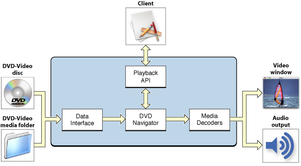
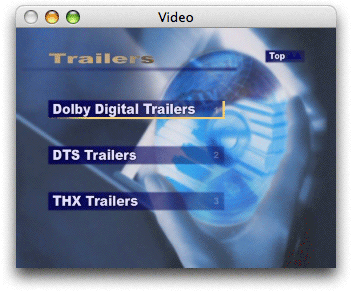
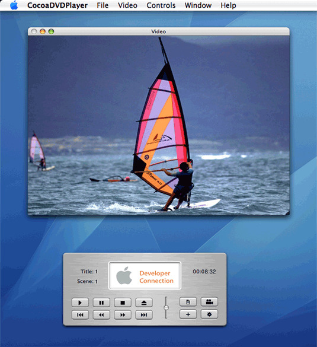

> 导航：[总目录](../../../README.md) · [documentation](../../../_indexes/documentation.md) · [DVD Playback Services Programming Guide](Introduction%20to%20DVD%20Playback%20Services%20Programming%20Guide.md)

[Next](Basic%20Programming%20Tasks.md)[Previous](Introduction%20to%20DVD%20Playback%20Services%20Programming%20Guide.md)

# Programming Concepts

Introduced in the late 1990's, DVD-Video is a standard for storing and reproducing audio and video on DVD-ROM discs. DVD-Video is an exciting multimedia technology, and DVD Playback Services makes this technology accessible and easy to use for developers writing Mac apps. DVD Playback Services makes it possible to control all aspects of DVD-Video playback without concern for the complicated details of getting the media content stream from the disc to the user. You can use DVD Playback Services to write your own DVD player, or use it to incorporate playback features into an existing application. This chapter describes the concepts you'll need to understand before you begin using DVD Playback Services.

DVD Playback Services provides an abstraction layer for the programmer that hides the complexity of playback processing. The API includes a basic set of functions that are closely aligned to the controls on a typical DVD player, and other functions to implement advanced features such as bookmarks and region code updates. The diagram in Figure 1-1 shows a simplified, high-level view of how DVD Playback Services works.

__Figure 1-1__  DVD playback high-level architecture

The data interface reads the media and creates data streams for video, audio, subpictures, navigation, and so on. (Subpictures are bitmap overlays used for subtitles, captions, and other static visual content.) The DVD navigator manages the DVD user interface and controls playback. Menus are used for content selection, and in some cases for feature control. The content consists of up to 99 titles, and each title is divided into one or more sequential parts (chapters). Media decoders handle the decryption and decoding of compressed video and audio data streams. DVD Playback supports the MPEG-1 and MPEG-2 video codecs, and the PCM, AC-3, and MPEG audio codecs. The video channels are composited for display in a Carbon or Cocoa window. Audio data is converted into stereo analog output.

DVD Playback Services uses the concept of a playback session. A playback session is a connection between a process and the DVD Playback framework. Only one session is possible at a time on a given computer system. (This is necessary because on certain computer systems the graphics I/O drivers are not re-entrant.) A new session begins when you call the `DVDInitialize` function and ends when you call the `DVDDispose` function.

Sessions are multithreaded. All drawing is handled in the main thread. If you implement a callback function and register the function with DVD Playback Services, the function is always called in a thread other than the main thread.

During a playback session, DVD Playback Services maintains state information on your behalf. You can use accessor functions such as `DVDGetTitle` to ask for specific state information, or you can receive notifications of state change events by registering a callback function. Notifications are discussed in more detail in the next section DVD Events.

DVD Playback Services provides accessor functions to get the current values of various state parameters during playback. For example, you can use the `DVDGetTime` function to find out if the elapsed playback time has changed. It's possible to detect state changes by calling an accessor function repeatedly; this practice is often referred to as polling. Polling can consume a lot of cycles, and its use is generally discouraged in Mac apps.

To eliminate the need for polling, DVD Playback Services defines a set of notification events called DVD events. DVD events are used to notify your application of important state changes. Most DVD events include one or two integer values that indicate something about the current playback state. To receive DVD events of interest, you register one or more callback functions. You can register a single callback function to handle multiple events, or use several different callbacks.

For example, you may want to implement a clock to show the user how long the current title has been playing. The best way to keep track of the current playback time is to register a callback to receive the `kDVDEventTitleTime` event. This event passes the elapsed time and duration of the current title to your application at a regular interval that you can control.

To learn about the various types of DVD events, see "Event Codes" in the constants section of _DVD Playback Framework Reference_.

DVD-Video media is enclosed in a folder with a standard name. In standard-definition media, the folder is named VIDEO_TS. On a DVD disc, the media folder is located at the root level of the disc's Universal Disc Format (UDF) file system. Media folders can also be stored anywhere on a hard drive; this might occur if you're authoring the media yourself. A media folder generally contains many different files and folders in a standard configuration.

When you use DVD Playback Services to open DVD-Video media for playback, you must specify the full path to the media folder on the mounted disc volume or hard drive. For example, the path to the media on a DVD disc might be `/Volumes/MY_MOVIE/VIDEO_TS`. Before attempting to open media, DVD Playback Services checks the media folder to make sure its structure is valid. In addition, the media's region codes are checked against the region code currently assigned to the DVD drive, to make sure the media is authorized for playback in the drive.

After you open DVD-Video media, you can ask DVD Playback Services for the media's unique 64-bit identifier or media ID. You can use this media ID as a key to save information about the media in a file for later use.

Almost all the functions in DVD Playback Services return a result code, either zero (`noErr`) to indicate success or a negative integer to indicate why the function failed. DVD Playback Services defines several dozen result codes. Generally, a non-zero result code indicates one of two things:

- The operation is not permitted because of the current playback state. For example, if no media folder is open and you call the `DVDPlay` function, nothing happens and the function passes back the result code `kDVDErrorNoValidMedia`.
- The operation is not permitted by the media itself. Authors of DVD media can place constraints on various operations. When DVD Playback Services enforces one of these constraints, it returns the result code `kDVDErrorUserActionNoOp`.

More serious exceptions or errors can also occur. These errors are signaled to your application by calling one of the custom callback functions that you register. There are two types of serious errors: errors signaled with a DVD error event (`kDVDEventError`), and I/O errors signaled by calling a fatal error callback function that you implement and register. When you receive a serious error, you should end the playback session immediately.

A video window is simply a Carbon or Cocoa window that you create and use for DVD-Video playback. DVD Playback Services supports the use of a single window for playback. You need to specify the window's graphics port (Carbon) or window ID (Cocoa), and the bounds of the area inside the window in which you want the video to be displayed. This video area is a rectangular area somewhere inside the content area of the window; often the content area and the video area are the same rectangle.

DVD Playback Services always scales the video to fit inside the video area, so it's important to specify a video area with the correct aspect ratio. Every title on a DVD is authored for one of two video aspect ratios: standard (4:3 or 1.33) or wide (16:9 or 1.78). Whenever the title changes, you are responsible for changing the aspect ratio of the video area to conform to the new aspect ratio. Some scaling is unavoidable, because the dimensions of the actual DVD-Video raster do not conform to either of these two aspect ratios. (Another way of thinking about this is that DVD pixels are rectangular, not square.) For example, the NTSC raster for standard video is actually 720 x 480 pixels. To display NTSC standard video output as it's intended to be seen, you need to rescale the video area horizontally (640 x 480), vertically (720 x 540), or both.

You also need to tell DVD Playback Services which display device it should use for the video output. For optimal performance, the window should always be positioned on a single screen. On systems with more than one screen, the user may attempt to move the video window so that it straddles two screens at once. If this occurs, your application should move the entire window onto the screen that contains the largest window area.

DVD-Video media generally contains one or more menus, including a disc or top menu. A DVD menu is an on-screen menu that presents one or more buttons and other visual information to help the user make a choice. The buttons specify titles to play, settings, or other menus. The visual information can include button highlights and animated backgrounds. The information needed to display these menus is contained in the media itself; no Carbon or Cocoa UI elements are needed. (It's important not to confuse DVD menus with application menus such as the Controls menu in DVD Player.)

__Figure 1-2__  A DVD menu

DVD Plackback Services provides an abstraction layer that eliminates the complexity of displaying and operating DVD menus. You simply need to notify DVD Playback Services whenever the user moves or clicks the mouse inside the video window, presses an arrow key to navigate between buttons, or presses the return or enter key to activate a button. DVD Playback Services provides a set of functions you can call whenever one of these events occurs. These functions are documented in the "Menu Navigation" section of _DVD Playback Framework Reference_.

To summarize, DVD Playback Services is responsible for displaying the DVD Menu and performing its actions. You are responsible for notifying DVD Playback Services when a user operates an input device (mouse or keyboard) to use the menu. Visual feedback and button selection in the menu is handled for you automatically. When the user selects and activates a button, DVD Playback Services performs the associated action. The action might be to play a title or scene, or branch to another menu.

When DVD media is playing, DVD Playback Services directs the audio output to the system's internal speakers or to an external device connected to the audio output port.

The audio output volume experienced by the user is controlled by two settings: the system volume setting and the playback volume setting. The playback volume is a subset of the system volume. DVD Playback Services allows you to set the playback volume using an integer that ranges from 0 to 255, where 255 is the current system volume. Both stereo channels use the same volume setting. DVD Playback Services also allows you to toggle the audio output on and off; you could use this feature to implement an audio mute control.

DVD Playback Services provides functions to get information about the audio stream being used in the current title, to find other audio streams, and to switch to a different audio stream. For example, you could use these functions to switch between different formats such as AC-3 and MPEG audio. These functions are documented in the "Accessing Audio Streams" section of _DVD Playback Framework Reference_.

DVD Playback Services provides a way to create bookmarks that specify the media position during playback. A bookmark can represent a menu, a still picture, the elapsed time in a title, or any other location in the media. A bookmark is a block of data that can be stored in memory or written out to a file. At some later time, you can retrieve the bookmark and call the `DVDGotoBookmark` function to go to the specified position in the media and begin playing.

You can use bookmarks to implement a number of interesting features. For example, you could:

- Allow the user to create bookmarks to favorite scenes for later re-play.
- Save a bookmark to the last play position in a file, and use this bookmark to resume playback at the specified frame when the media is re-opened.

On DVDs that support multiple languages, generally the user can select a different language for the audio channel, subtitles, and menus using a language selection menu created by the DVD author. You do not need to do any special programming to take advantage of this feature.

When you open media for playback, DVD Playback Services selects a default language based on the language setting in the International Preferences panel and the languages available in the media. You can use DVD Playback Services to determine the language used in the current title or menu, and to set the default to a different language. For more information, see the section "Accessing Language Codes" in _DVD Playback Framework Reference_.

The author of a DVD can create as many as nine video streams that represent the same scene viewed from different camera angles. The primary angle is designated as angle 1. You can use DVD Playback Services to find the number of different angles in a title, and to get or set the current angle. For more information, see the section "Accessing Camera Angles" in _DVD Playback Framework Reference_.

_[CocoaDVDPlayer](../../../samplecode/CocoaDVDPlayer/CocoaDVDPlayer.md#apple-f4xwc4dqnrsv64tfmyxwi33df52wszbpirkfgmjqgaydgnzzgi)_ is a project in the ADC Reference Library that shows how to use DVD Playback Services to write a working DVD-Video player. The CocoaDVDPlayer user interface, shown in Figure 1-3, features a video window and a controller window that serves as the "remote control" for the player. (It's also possible to operate the player from the keyboard.)

__Figure 1-3__  User interface for a DVD-Video player created using DVD Playback Services

Most of the code examples in this guide are based on source code used in CocoaDVDPlayer. You may find it useful to download this project now and follow along as your read about the programming tasks in the next two chapters.

[Next](Basic%20Programming%20Tasks.md)[Previous](Introduction%20to%20DVD%20Playback%20Services%20Programming%20Guide.md)

